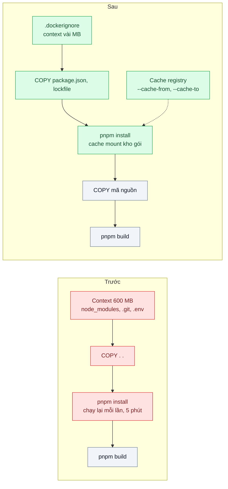
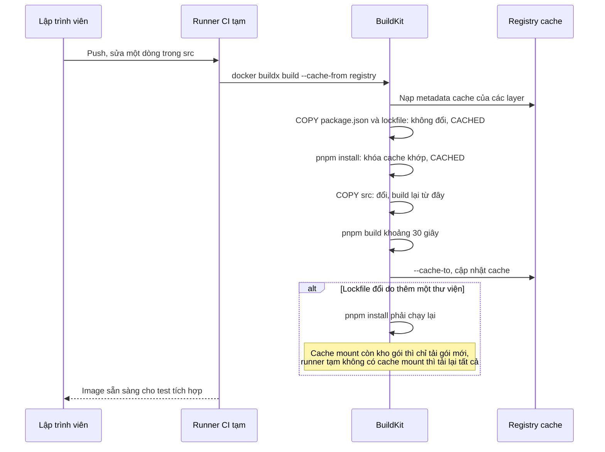

# Layer Caching & .dockerignore — Mỗi build cài lại toàn bộ npm 5 phút dù chỉ sửa một dòng code

| Scope | Mức độ | Trạng thái | Pattern gốc | Cập nhật |
|---|---|---|---|---|
| 17 · backend / docker | 🟢 Cơ bản | 📋 Kế hoạch | Layer Caching — Docker docs "Build cache", ".dockerignore file"; BuildKit cache mounts | 2026-10-06 |

> **Một câu tóm tắt:** Sắp xếp Dockerfile để thứ ít đổi (lockfile, cài dependency) nằm trước thứ hay đổi (mã nguồn), loại file thừa khỏi build context bằng `.dockerignore`, và giữ kho gói giữa các lần build bằng cache mount, để sửa một dòng code chỉ build lại vài chục giây.

## 1. Bài toán thực tế (What)

**Bối cảnh** *(doanh nghiệp giả định, số liệu minh họa)*
Ví điện tử có 25 lập trình viên, mỗi ngày khoảng 150 lần build image trên CI cho các pull request. Dockerfile của API NestJS: `COPY . .` ngay sau `FROM`, rồi `RUN pnpm install`, rồi `RUN pnpm build`. Runner CI là máy tạm, xóa sau mỗi job.

**Triệu chứng người kinh doanh nhìn thấy**
- Mỗi pull request chờ khoảng 7 phút mới có image để chạy test tích hợp; lập trình viên chuyển sang việc khác rồi quên, vòng review kéo dài cả ngày.
- Hóa đơn phút chạy CI tăng đều mỗi tháng, phần lớn là thời gian tải và cài lại cùng một bộ dependency.
- Bản sửa lỗi khẩn cấp vẫn phải chờ đủ chu trình build dài như mọi thay đổi khác.

**Nguyên nhân kỹ thuật**
Docker tái sử dụng một layer chỉ khi chỉ thị và dữ liệu đầu vào của nó không đổi, và mọi layer sau một layer thay đổi đều phải build lại. `COPY . .` đứng trước bước cài đặt nên sửa bất kỳ file nào cũng làm mất cache của `pnpm install`. Build context không có `.dockerignore`: thư mục `node_modules` local, `.git`, `coverage` (khoảng 600 MB) được gửi lên daemon mỗi lần và còn làm cache mất hiệu lực vì nội dung thay đổi liên tục. Runner tạm không giữ cache giữa các job.

**Ràng buộc**
- Kết quả build phải tái lập: cùng lockfile cho ra cùng dependency.
- Không đổi nhà cung cấp CI; runner vẫn là máy tạm.
- `.env` và file bí mật tuyệt đối không được lọt vào build context.

## 2. Vì sao dùng pattern này (Why)

**Nguyên nhân gốc mà pattern nhắm vào:** thứ tự chỉ thị và build context khiến cache của bước tốn kém nhất bị vô hiệu hóa bởi những thay đổi không liên quan.

**Pattern giải quyết thế nào:** Docker docs giải thích cơ chế cache theo layer: mỗi chỉ thị có khóa cache tính từ chỉ thị và dữ liệu đầu vào; một layer đổi thì mọi layer sau build lại. Vì vậy: (1) `.dockerignore` loại `node_modules`, `.git`, `dist`, `.env*` khỏi context, context nhỏ và ổn định; (2) chép `package.json`, `pnpm-lock.yaml`, `pnpm-workspace.yaml` trước, cài dependency, *rồi* mới chép mã nguồn, nên sửa code không chạm layer cài đặt; (3) BuildKit cache mount (`RUN --mount=type=cache,...`) giữ kho gói pnpm giữa các lần build, kể cả khi lockfile đổi làm layer cài đặt phải chạy lại, chỉ tải gói mới; (4) với runner tạm, xuất cache ra registry bằng `--cache-to` và nạp lại bằng `--cache-from`.

**Lựa chọn khác đã cân nhắc**

| Lựa chọn | Giải quyết được gì | Vì sao không chọn (ở bài này) |
|---|---|---|
| Giữ nguyên + tối ưu nhỏ (runner CI mạnh hơn, mirror npm nội bộ) | Tải và cài nhanh hơn một chút | Vẫn cài lại toàn bộ mỗi lần; tốn tiền hơn cho cùng việc thừa |
| Build `dist/` và `node_modules` ngoài Docker rồi `COPY` vào | Tận dụng cache của hệ thống CI | Mất tính tái lập, native module có thể lệch nền tảng |
| Runner CI cố định giữ cache local | Cache tự nhiên giữa các job | Phải tự vận hành runner; job song song trên nhiều máy vẫn không chia sẻ cache |
| Sắp xếp layer + `.dockerignore` + cache mount + cache registry (chọn) | Build lại tối thiểu, context nhỏ, dùng được với runner tạm | Phải hiểu khóa cache; cache mount không đi theo cache registry |

## 3. Thiết kế hệ thống (How)

### 3.1 Kiến trúc trước và sau



### 3.2 Luồng chính



### 3.3 Thành phần và trách nhiệm

| Thành phần | Trách nhiệm | Quyết định thiết kế đáng chú ý |
|---|---|---|
| `.dockerignore` | Loại file không cần khỏi build context | Loại cả `.env*` và khóa cá nhân: vừa nhanh vừa an toàn |
| Thứ tự chỉ thị | File ít đổi trước, file hay đổi sau | Trong monorepo, chép manifest của mọi package cần thiết trước mã nguồn |
| `pnpm fetch` hoặc install theo lockfile | Tải gói chỉ dựa vào lockfile | `pnpm fetch` được thiết kế cho Docker: chỉ cần lockfile, không cần `package.json` của từng package |
| Cache mount | Giữ kho gói pnpm giữa các lần build trên cùng builder | Không nằm trong image, không xuất theo cache registry |
| Cache registry | Chia sẻ cache layer giữa các runner tạm | `mode=max` để xuất cả layer của stage trung gian |
| Đo cache | Đếm bước CACHED và thời gian từng bước | Dùng `--progress=plain` để log đọc được trong CI |

### 3.4 Điểm dễ sai khi triển khai
- **`.dockerignore` sai vị trí hoặc sai mẫu.** File phải ở gốc build context; mẫu khác `.gitignore` ở vài chi tiết. Kiểm tra bằng kích thước "transferring context" trong log.
- **Chép một file hay đổi trước bước cài đặt** (ví dụ `README.md` hoặc cả thư mục `packages/`) làm cache cài đặt mất hiệu lực mỗi lần.
- **Tin rằng cache mount giúp được runner tạm.** Cache mount sống trong builder; runner mới là builder mới. Với runner tạm, thứ giúp được là cache registry cho layer.
- **Đưa secret vào khóa cache.** Truyền token qua `ARG` để cài gói riêng tư làm token nằm trong metadata và thay đổi khóa cache; dùng build secret (bài 08).
- **Cache cũ che lỗi.** Thỉnh thoảng chạy build `--no-cache` theo lịch để chắc build từ đầu vẫn chạy.

## 4. Tech stack và tác động (Impact techstack)

| Lớp | Công nghệ chọn | Vì sao chọn | Thay thế tương đương |
|---|---|---|---|
| Build | Docker BuildKit, `docker buildx` | Cache mount, cache registry, log tiến trình chi tiết | Kaniko (cơ chế cache khác) |
| Quản lý gói | pnpm 10 (`pnpm fetch`, kho gói nội dung địa chỉ) | Kho gói dùng lại được giữa các lần cài; trùng stack repo | npm `ci` với cache mount `~/.npm` |
| Cache dùng chung | Cache registry (`type=registry`) trên registry local | Chạy được với mọi CI, mô phỏng được bằng `registry:2` | Cache của GitHub Actions (`type=gha`) |
| Ứng dụng | NestJS 10, TypeScript strict | Stack mặc định | Fastify |
| Đo | `time docker build`, `--progress=plain`, kích thước context trong log | Thời gian từng bước, số bước CACHED | Báo cáo thời gian của hệ thống CI |

**Thay đổi so với hệ thống hiện tại:** thêm `.dockerignore`, sắp xếp lại Dockerfile, bật cache mount và cache registry trong lệnh build CI. Đội học đọc log BuildKit để biết vì sao một bước không trúng cache.

## 5. Kết quả đầu ra và cách đo (Output impact)

| Chỉ số | Trước (minh họa) | Mục tiêu khi thực hành | Cách đo |
|---|---|---|---|
| Thời gian build sau khi sửa một file trong `src` | 5 phút | ≤ 45 giây | `time docker build`, builder có cache, 5 lần lấy trung vị |
| Thời gian build trên builder mới với cache registry | 5 phút | ≤ 90 giây | Xóa builder, `docker buildx create` mới, build với `--cache-from` |
| Thời gian build khi lockfile thêm một gói (có cache mount) | 5 phút | ≤ 90 giây | Thêm một dependency, build lại trên cùng builder |
| Kích thước build context | 600 MB | ≤ 5 MB | Dòng "transferring context" trong log `--progress=plain` |
| File `.env` có trong context | có | không | Bước kiểm tra liệt kê file trong context (stage gỡ lỗi chép context và `ls`) |

> Số "trước" là minh họa để hình dung bài toán. Số "mục tiêu" chỉ được coi là đạt khi có số đo thật
> ở mục 8 kèm môi trường đo.

**Tác động nghiệp vụ mong đợi:** vòng phản hồi pull request ngắn lại, bản sửa khẩn cấp lên nhanh hơn, và chi phí phút CI giảm vì không còn cài lại cùng một bộ dependency.

## 6. Đánh đổi và khi KHÔNG nên dùng

**Đánh đổi**
- Dockerfile phải giữ kỷ luật thứ tự; một thay đổi vô ý có thể làm mất cache mà không ai để ý.
- Cache registry tốn dung lượng registry và cần chính sách dọn dẹp.
- Cache có thể che lỗi build từ đầu nếu không có build `--no-cache` định kỳ.

**Không nên dùng khi**
- Image build rất hiếm (vài lần mỗi tháng) và nhanh sẵn: công sức tối ưu không đáng.
- Môi trường build không hỗ trợ BuildKit: vẫn làm được `.dockerignore` và thứ tự layer, bỏ phần cache mount.
- Dependency thay đổi ở gần như mỗi commit: cache cài đặt ít khi trúng, ưu tiên mirror gói gần runner.

**Liên quan**
- Đọc trước: `../01-multi-stage-build-image-1-8gb-deploy-10-phut/` — cấu trúc stage mà bài này tối ưu cache.
- Đọc sau: `../08-env-config-secrets-khong-nuong-vao-image/` — build secret thay cho `ARG` chứa token.
- Cùng chủ đề: `../../09-backend-monorepo/03-affected-graph-ci-chay-40-phut-cho-moi-commit/` — chỉ build package bị ảnh hưởng.
- Đọc sau: `../07-image-tagging-sbom-scan-tag-latest-khong-biet-dang-chay-gi/` — gắn tag cho image build ra.

## 7. Cơ sở tham khảo

- Docker docs, "Docker build cache" — https://docs.docker.com/build/cache/ — cơ chế khóa cache theo layer, vì sao layer sau bị build lại, cách sắp xếp chỉ thị.
- Docker docs, "Build context" và ".dockerignore files" — https://docs.docker.com/build/concepts/context/ — cú pháp mẫu loại trừ, vị trí file.
- Docker docs, "Optimize cache usage in builds" (cache mounts) và "Cache storage backends" — https://docs.docker.com/build/cache/ — `RUN --mount=type=cache`, `--cache-to`, `--cache-from`, `mode=max` (tên trang cần xác minh).
- pnpm docs, "Working with Docker" và "pnpm fetch" — https://pnpm.io/docker — cài từ lockfile, cache mount cho kho gói pnpm.

## 8. Kế hoạch thực hành

- [ ] Bước 1: dựng API NestJS với Dockerfile hiện trạng (`COPY . .` trước install), không có `.dockerignore`; registry local `registry:2` làm nơi lưu cache.
- [ ] Bước 2: đo "trước": build lần đầu, sửa một dòng rồi build lại, thêm một dependency rồi build lại; ghi thời gian và kích thước context.
- [ ] Bước 3: thêm `.dockerignore`, sắp xếp lại chỉ thị, dùng `pnpm fetch` và cache mount, bật `--cache-to` và `--cache-from` registry.
- [ ] Bước 4: đo "sau" cả ba kịch bản và kịch bản builder mới; ghi số thật và môi trường vào mục 5.
- [ ] Bước 5: viết test: (a) build context không chứa `node_modules`, `.git`, `.env`; (b) sửa file trong `src` thì bước cài đặt được báo CACHED; (c) build `--no-cache` vẫn thành công.

**Cấu trúc code dự kiến**
```text
apps/api/
  Dockerfile                    # [PATTERN] manifest trước, mã nguồn sau, cache mount
  Dockerfile.naive              # hiện trạng để so sánh
.dockerignore
scripts/
  build-with-registry-cache.sh  # buildx --cache-from, --cache-to
  measure-build-scenarios.sh    # ba kịch bản đo
test/
  build-context-contents.test.ts
  install-step-is-cached.test.ts
docker-compose.yml              # registry local
```

**Cách chạy** *(điền khi bắt đầu code)*
```bash
docker compose up -d
pnpm install && pnpm test
```
