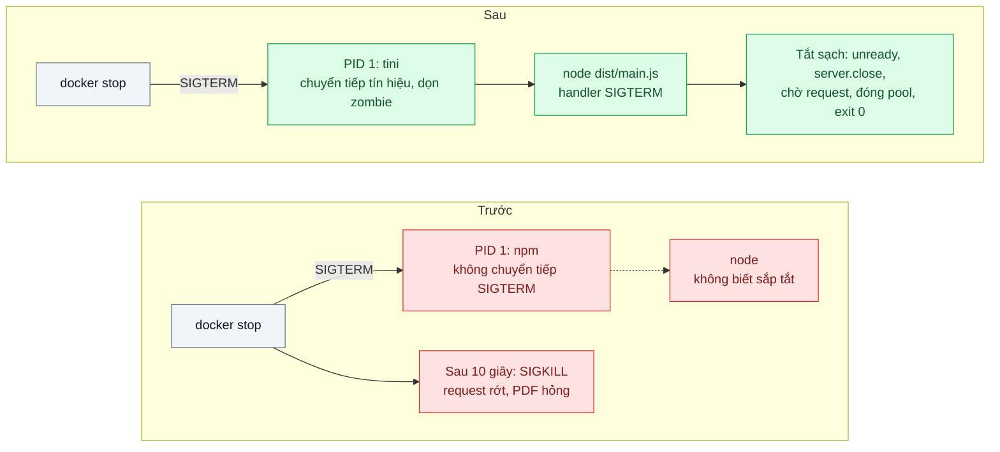
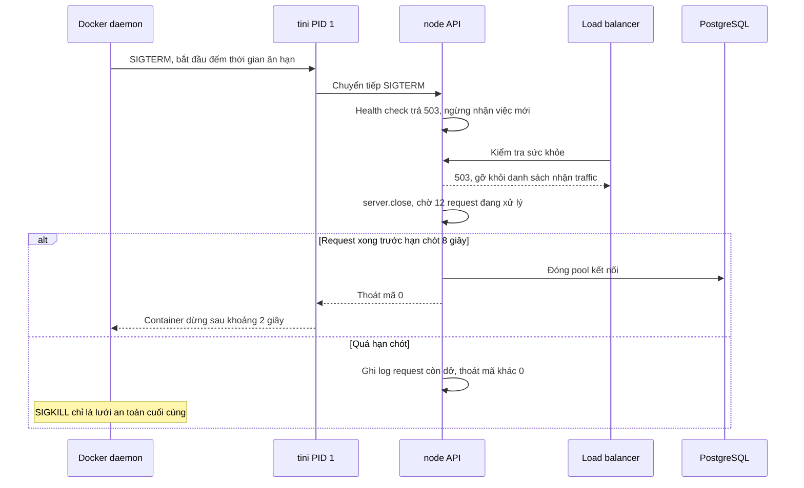

# PID 1 & Signal Handling — Container không nhận SIGTERM, bị kill cứng sau 10 giây, request rớt

| Scope | Mức độ | Trạng thái | Pattern gốc | Cập nhật |
|---|---|---|---|---|
| 17 · backend / docker | 🟡 Trung bình | 📋 Kế hoạch | Init process & graceful shutdown — Docker docs (`--init`, tini); Yelp Engineering, "dumb-init" (2016) | 2026-10-06 |

> **Một câu tóm tắt:** Để một init nhỏ (tini/dumb-init) làm PID 1 chuyển tiếp tín hiệu và dọn tiến trình con, chạy thẳng `node` bằng exec form, và cho ứng dụng tự xử lý SIGTERM (ngừng nhận request mới, làm xong request đang chạy, đóng kết nối) trong thời gian ân hạn, thay vì bị SIGKILL cắt ngang sau 10 giây.

## 1. Bài toán thực tế (What)

**Bối cảnh** *(doanh nghiệp giả định, số liệu minh họa)*
Công ty logistics chạy API cập nhật trạng thái đơn cho khoảng 3.000 shipper, khoảng 400 request mỗi giây giờ cao điểm. Mỗi ngày deploy 3–4 lần bằng rolling update. Dockerfile kết thúc bằng `CMD npm run start:prod`; ứng dụng có tạo tiến trình con để sinh file PDF phiếu giao hàng.

**Triệu chứng người kinh doanh nhìn thấy**
- Mỗi lần deploy, một loạt shipper thấy lỗi khi bấm "Đã giao"; một số phải bấm lại, một số đơn bị ghi trạng thái hai lần.
- Deploy chậm: mỗi container mất đúng 10 giây mới tắt, 20 container là vài phút chỉ để chờ.
- Thỉnh thoảng phiếu giao hàng PDF tạo dở, file hỏng, đối soát cuối ngày phải sinh lại.

**Nguyên nhân kỹ thuật**
`docker stop` gửi SIGTERM tới PID 1 của container, chờ 10 giây mặc định rồi gửi SIGKILL. PID 1 ở đây là `npm`, không chuyển tiếp SIGTERM cho tiến trình `node` một cách đáng tin cậy; tài liệu best practices của image Node chính thức cũng khuyên chạy thẳng `node` thay vì qua `npm` vì lý do này. Kết quả: `node` không biết mình sắp bị tắt, mã graceful shutdown không chạy, sau 10 giây mọi request đang xử lý và transaction đang mở bị cắt ngang. Thêm nữa, trong PID namespace, tiến trình PID 1 chỉ nhận những tín hiệu nó đã đăng ký handler, và có trách nhiệm thu dọn tiến trình con đã kết thúc; không ai làm việc đó thì tiến trình zombie tích tụ.

**Ràng buộc**
- Không làm mất request đang xử lý khi deploy hoặc khi hạ tầng tắt container.
- Thời gian tắt phải ngắn hơn thời gian ân hạn của nền tảng (Compose, Kubernetes).
- Không đổi nền tảng chạy container trong bài này.

## 2. Vì sao dùng pattern này (Why)

**Nguyên nhân gốc mà pattern nhắm vào:** tiến trình nhận tín hiệu (PID 1) không phải là ứng dụng, và ứng dụng không có thủ tục tắt sạch.

**Pattern giải quyết thế nào:** Có hai phần. *Init process*: Docker cung cấp `--init` (Compose: `init: true`) để chạy một init nhỏ (tini) làm PID 1; Yelp viết dumb-init cũng vì đúng vấn đề này: init chuyển tiếp tín hiệu cho tiến trình con và thu dọn zombie. Kết hợp exec form `CMD ["node", "dist/main.js"]` để không có shell hay npm chen giữa. *Graceful shutdown*: ứng dụng đăng ký handler SIGTERM theo tài liệu Node.js về process signals: chuyển health check sang "không sẵn sàng", `server.close()` ngừng nhận kết nối mới, chờ request đang chạy xong trong một hạn chót ngắn hơn thời gian ân hạn, đóng pool database và hàng đợi, rồi thoát mã 0. Nhờ vậy SIGKILL chỉ còn là lưới an toàn.

**Lựa chọn khác đã cân nhắc**

| Lựa chọn | Giải quyết được gì | Vì sao không chọn (ở bài này) |
|---|---|---|
| Giữ nguyên + tối ưu nhỏ (tăng thời gian chờ lên 60 giây) | Ít bị cắt ngang hơn | Node vẫn không nhận tín hiệu; deploy chậm thêm 6 lần, request vẫn rớt khi hết 60 giây |
| Chỉ đổi sang `CMD ["node", ...]`, không init | Node là PID 1, nhận được SIGTERM nếu có handler | Không ai thu dọn zombie của tiến trình sinh PDF; hành vi phụ thuộc việc có đăng ký handler hay không |
| Shell script entrypoint với `exec node ...` | Thay shell bằng node | Cùng hạn chế như trên; dễ quên `exec` |
| Init (tini qua `--init` hoặc dumb-init) + exec form + handler SIGTERM (chọn) | Tín hiệu tới đúng ứng dụng, zombie được dọn, tắt sạch có hạn chót | Thêm một tiến trình rất nhỏ; ứng dụng phải viết thủ tục tắt |

## 3. Thiết kế hệ thống (How)

### 3.1 Kiến trúc trước và sau



### 3.2 Luồng chính



### 3.3 Thành phần và trách nhiệm

| Thành phần | Trách nhiệm | Quyết định thiết kế đáng chú ý |
|---|---|---|
| Init (tini qua `--init` hoặc dumb-init trong image) | Làm PID 1, chuyển tiếp tín hiệu, thu dọn zombie | Đặt trong image nếu nền tảng không có `--init`, để hành vi giống nhau mọi nơi |
| Exec form `CMD` | Chạy thẳng `node`, không qua shell hay npm | Shell form `CMD node ...` vẫn chèn `/bin/sh -c` |
| Handler SIGTERM | Điều phối thủ tục tắt theo thứ tự | Chỉ chạy một lần; tín hiệu thứ hai thì thoát ngay |
| Health check | Báo không sẵn sàng ngay khi bắt đầu tắt | Liên quan bài 06 và probes ở scope 16 |
| Hạn chót tắt | Giới hạn thời gian chờ request | Ngắn hơn `stop_grace_period` vài giây để kịp đóng kết nối |
| Đóng tài nguyên | Đóng pool DB, consumer hàng đợi, tiến trình con | Ngừng lấy job mới trước khi chờ job đang chạy |

### 3.4 Điểm dễ sai khi triển khai
- **Shell form trong Dockerfile.** `CMD node dist/main.js` (không có ngoặc vuông) chạy qua `/bin/sh -c`; shell là PID 1 và không chuyển tiếp tín hiệu. Luôn dùng exec form.
- **`server.close()` chờ mãi kết nối keep-alive.** Kết nối nhàn rỗi giữ server mở; đóng kết nối nhàn rỗi chủ động (Node có API cho việc này ở các phiên bản mới, cần xác minh phiên bản) và đặt hạn chót cứng.
- **Không chuyển health check sang 503 trước.** Load balancer vẫn gửi request mới vào container đang tắt và nhận lỗi kết nối.
- **Hạn chót dài hơn thời gian ân hạn.** Nền tảng SIGKILL trước khi ứng dụng kịp đóng pool; luôn để dư vài giây.
- **Quên tiến trình con.** Tiến trình sinh PDF không được báo tắt sẽ bị giết giữa chừng; chuyển tiếp tín hiệu hoặc chờ nó xong trong thủ tục tắt.

## 4. Tech stack và tác động (Impact techstack)

| Lớp | Công nghệ chọn | Vì sao chọn | Thay thế tương đương |
|---|---|---|---|
| Init | tini qua `docker run --init` / Compose `init: true` | Có sẵn trong Docker, không cần sửa image | dumb-init cài trong image và đặt làm `ENTRYPOINT` |
| Runtime | Node.js 20, `process.on('SIGTERM')` | Cơ chế tín hiệu chuẩn của Node | — |
| Ứng dụng | NestJS 10 với `enableShutdownHooks()` và hook `onApplicationShutdown` | Gắn thủ tục đóng tài nguyên vào vòng đời module | Fastify với `close` hook |
| Hạ tầng local | Docker Compose, `stop_grace_period`, nhiều bản sao sau NGINX | Tái hiện rolling restart có load balancer | Kubernetes `terminationGracePeriodSeconds` (scope 16) |
| Đo | k6 chạy liên tục khi restart, `time docker stop`, `docker inspect` mã thoát | Đếm request lỗi, thời gian tắt, phân biệt mã 0 và 137 | Log có cấu trúc của thủ tục tắt |

**Thay đổi so với hệ thống hiện tại:** đổi `CMD` sang exec form gọi thẳng `node`, bật init, viết thủ tục tắt trong ứng dụng, chỉnh thời gian ân hạn. Đội phải hiểu vòng đời tín hiệu của container và thứ tự tắt tài nguyên.

## 5. Kết quả đầu ra và cách đo (Output impact)

| Chỉ số | Trước (minh họa) | Mục tiêu khi thực hành | Cách đo |
|---|---|---|---|
| Request lỗi khi restart lần lượt 4 bản sao dưới tải 200 request/giây | khoảng 3 % trong lúc restart | 0 | k6 chạy liên tục, script restart từng bản sao; đếm response lỗi |
| Thời gian `docker stop` một container | 10 giây | ≤ 3 giây | `time docker stop` |
| Mã thoát của container khi dừng | 137 (bị SIGKILL) | 0 | `docker inspect --format '{{.State.ExitCode}}'` |
| Tiến trình zombie sau 1.000 lần sinh PDF | tăng dần | 0 | `ps` trong container đếm tiến trình trạng thái Z |
| File PDF hỏng do bị cắt ngang | có | 0 trong kịch bản restart khi đang sinh | Kiểm tra tính toàn vẹn file sau mỗi lần restart |

> Số "trước" là minh họa để hình dung bài toán. Số "mục tiêu" chỉ được coi là đạt khi có số đo thật
> ở mục 8 kèm môi trường đo.

**Tác động nghiệp vụ mong đợi:** deploy giữa giờ làm việc mà shipper không gặp lỗi, không còn trạng thái đơn ghi hai lần do bấm lại, và rút ngắn thời gian mỗi lần deploy.

## 6. Đánh đổi và khi KHÔNG nên dùng

**Đánh đổi**
- Ứng dụng phải có thủ tục tắt và test cho nó; đây là mã ít được chạy nên dễ mục.
- Thêm một tiến trình init (rất nhỏ) và một điểm cấu hình phải giống nhau giữa môi trường.
- Thủ tục tắt kéo dài thời gian dừng so với kill ngay khi không có request.

**Không nên dùng khi**
- Container chạy tác vụ một lần, ngắn, không phục vụ request (job in báo cáo vài giây): kill ngay là chấp nhận được, vẫn nên dùng exec form.
- Ứng dụng đã có init riêng làm PID 1 và tự xử lý tín hiệu đúng (một số image hệ thống): thêm tini là thừa.
- Request thường dài hơn mọi thời gian ân hạn hợp lý (xử lý video 30 phút): cần chuyển sang hàng đợi có khả năng tiếp tục, không chỉ tắt sạch.

**Liên quan**
- Đọc trước: `../01-multi-stage-build-image-1-8gb-deploy-10-phut/` — image runtime chạy thẳng `node`.
- Đọc sau: `../06-healthcheck-depends-on-app-khoi-dong-truoc-db-san-sang/` — health check báo không sẵn sàng khi tắt.
- Đọc sau: `../../16-backend-k8s/02-graceful-shutdown-prestop-deploy-lam-rot-request-dang-xu-ly/` — cùng thủ tục trên Kubernetes với preStop.
- Cùng chủ đề: `../../01-frontend-backend-transporter/03-idempotency-key-bam-thanh-toan-hai-lan/` — chặn ghi trùng khi người dùng bấm lại.

## 7. Cơ sở tham khảo

- Docker docs, `docker run --init` và Compose `init` — https://docs.docker.com/ — chạy init (tini) làm PID 1 để chuyển tiếp tín hiệu và thu dọn tiến trình.
- Yelp Engineering, "dumb-init: An init for Docker", 2016 — https://engineeringblog.yelp.com/2016/01/dumb-init-an-init-for-docker.html — vì sao PID 1 trong container xử lý tín hiệu khác thường và cách một init tối giản giải quyết.
- Node.js docs, "Process: Signal events" — https://nodejs.org/docs/latest/api/process.html — đăng ký handler SIGTERM, SIGINT và hành vi mặc định.
- NestJS docs, "Lifecycle events" (`enableShutdownHooks`) — https://docs.nestjs.com/fundamentals/lifecycle-events — gắn thủ tục đóng tài nguyên khi nhận tín hiệu.
- tini — https://github.com/krallin/tini — init dùng bởi `docker run --init` (cần xác minh chi tiết tích hợp).

## 8. Kế hoạch thực hành

- [ ] Bước 1: dựng API NestJS có endpoint chậm 3 giây và endpoint sinh PDF bằng tiến trình con; Dockerfile `CMD npm run start:prod`; Compose 4 bản sao sau NGINX.
- [ ] Bước 2: đo "trước": k6 200 request/giây, restart lần lượt từng bản sao; ghi request lỗi, thời gian dừng, mã thoát, số zombie.
- [ ] Bước 3: đổi sang exec form `node`, bật `init: true`, viết thủ tục tắt (503, `server.close`, hạn chót, đóng pool, chờ tiến trình con), chỉnh `stop_grace_period`.
- [ ] Bước 4: đo "sau" cùng kịch bản; ghi số thật và môi trường vào mục 5.
- [ ] Bước 5: viết test: (a) gửi SIGTERM khi đang có request chậm thì request vẫn hoàn tất và tiến trình thoát mã 0; (b) sau SIGTERM, health check trả 503 ngay; (c) quá hạn chót thì thoát với log liệt kê request dở; (d) không còn zombie sau nhiều lần sinh PDF.

**Cấu trúc code dự kiến**
```text
src/
  main.ts                           # enableShutdownHooks
  shutdown/graceful-shutdown.ts     # [PATTERN] thứ tự tắt, hạn chót
  health/health.controller.ts       # 503 khi đang tắt
  pdf/pdf-worker.ts                 # tiến trình con
Dockerfile                          # exec form, không qua npm
Dockerfile.npm-start                # hiện trạng để so sánh
test/
  sigterm-finishes-inflight.test.ts
  health-unready-on-shutdown.test.ts
bench/rolling-restart.k6.js
docker-compose.yml                  # 4 bản sao, nginx, init: true
```

**Cách chạy** *(điền khi bắt đầu code)*
```bash
docker compose up -d
pnpm install && pnpm test
```
