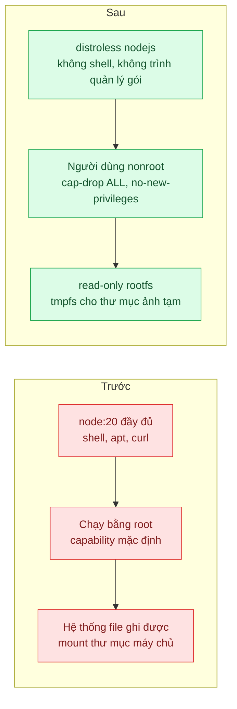
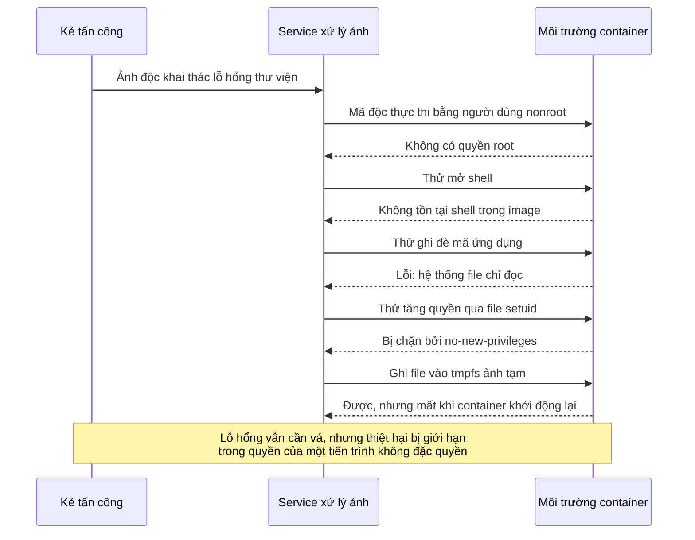

# Non-root, Read-only FS & Distroless — Container chạy root, có shell; một lỗ RCE là chiếm được node

| Scope | Mức độ | Trạng thái | Pattern gốc | Cập nhật |
|---|---|---|---|---|
| 17 · backend / docker | 🟡 Trung bình | 📋 Kế hoạch | Least Privilege Container — Docker docs "Security"; OWASP Docker Security Cheat Sheet; GoogleContainerTools distroless | 2026-10-06 |

> **Một câu tóm tắt:** Chạy ứng dụng bằng người dùng không phải root, trên hệ thống file chỉ đọc, bỏ hết capability không cần, và dùng base image distroless không có shell hay trình quản lý gói, để một lỗ thực thi mã từ xa trong ứng dụng không biến thành quyền điều khiển cả container và máy chủ.

## 1. Bài toán thực tế (What)

**Bối cảnh** *(doanh nghiệp giả định, số liệu minh họa)*
Sàn thương mại điện tử có service xử lý ảnh sản phẩm: nhận ảnh từ khoảng 20.000 shop, cắt, nén, đóng dấu. Image dựng từ `node:20`, chạy mặc định bằng root, có shell, `apt`, `curl`; một thư mục của máy chủ được mount vào để ghi ảnh tạm.

**Triệu chứng người kinh doanh nhìn thấy**
- Đợt kiểm thử xâm nhập (giả định) khai thác một lỗ hổng trong thư viện xử lý ảnh, có ngay shell root trong container, tải được công cụ và ghi file vào thư mục máy chủ được mount.
- Báo cáo xếp mức nghiêm trọng cao; khách doanh nghiệp lớn yêu cầu bằng chứng khắc phục trước khi gia hạn hợp đồng.
- Đội bảo mật không có cách nào chứng minh "nếu lỗ hổng tương tự xảy ra lần nữa thì thiệt hại giới hạn ở đâu".

**Nguyên nhân kỹ thuật**
Lỗ hổng trong dependency là điều sớm muộn cũng xảy ra; vấn đề là *mức thiệt hại* khi nó xảy ra. Container chạy root với tập capability mặc định, hệ thống file ghi được, có sẵn shell, trình quản lý gói và công cụ mạng: kẻ tấn công có đủ mọi thứ để cài công cụ, sửa mã ứng dụng ngay trong container, và tận dụng thư mục máy chủ được mount để leo thang. Root trong container cùng một lỗi cấu hình hoặc lỗi kernel là con đường thoát ra máy chủ.

**Ràng buộc**
- Thư viện xử lý ảnh cần ghi file tạm; ứng dụng cần ghi log ra stdout.
- Đội vận hành vẫn cần cách gỡ lỗi khi có sự cố production.
- Không đổi nền tảng chạy container; các thiết lập phải áp được bằng Docker và Compose.

## 2. Vì sao dùng pattern này (Why)

**Nguyên nhân gốc mà pattern nhắm vào:** container được cấp nhiều quyền và công cụ hơn mức ứng dụng cần, nên mọi lỗ hổng trong ứng dụng thừa hưởng toàn bộ quyền đó.

**Pattern giải quyết thế nào:** Nguyên tắc đặc quyền tối thiểu áp vào container theo nhiều lớp, đúng các mục trong OWASP Docker Security Cheat Sheet: đặt người dùng không phải root (`USER`), giới hạn capability (`--cap-drop ALL`), ngăn leo thang đặc quyền trong container (`no-new-privileges`), đặt hệ thống file gốc chỉ đọc (`--read-only`) và chỉ mở vùng ghi tạm cần thiết bằng tmpfs. Base image distroless của GoogleContainerTools chỉ chứa runtime và thư viện cần thiết, không có shell hay trình quản lý gói, và có biến thể chạy sẵn bằng người dùng không phải root. Mỗi lớp độc lập: một lớp bị vượt qua thì lớp khác vẫn giới hạn thiệt hại.

**Lựa chọn khác đã cân nhắc**

| Lựa chọn | Giải quyết được gì | Vì sao không chọn (ở bài này) |
|---|---|---|
| Giữ nguyên + tối ưu nhỏ (vá thư viện ảnh, quét lỗ hổng thường xuyên) | Đóng lỗ hổng đã biết | Cần làm, nhưng không giới hạn thiệt hại của lỗ hổng chưa biết |
| Chỉ thêm `USER node` vào image hiện tại | Không còn root | Vẫn có shell, `curl`, hệ thống file ghi được; mới một lớp |
| Alpine làm base runtime | Image nhỏ, ít gói | Vẫn có shell và trình quản lý gói; musl có thể gây khác biệt với native module của thư viện ảnh |
| Sandbox runtime mạnh hơn (gVisor, microVM) | Cách ly mạnh ở mức kernel | Thay đổi nền tảng chạy; để dành khi chạy mã không tin cậy của bên thứ ba |
| Non-root + read-only + cap-drop + no-new-privileges + distroless (chọn) | Nhiều lớp, áp được ngay bằng Docker, không đổi nền tảng | Gỡ lỗi khó hơn; phải khai báo rõ vùng ghi |

## 3. Thiết kế hệ thống (How)

### 3.1 Kiến trúc trước và sau



### 3.2 Luồng chính



### 3.3 Thành phần và trách nhiệm

| Thành phần | Trách nhiệm | Quyết định thiết kế đáng chú ý |
|---|---|---|
| Base distroless nodejs, biến thể nonroot | Cung cấp runtime Node mà không có shell và công cụ | Dùng làm stage cuối của multi-stage build (bài 01); chép `dist/` và `node_modules` production |
| `USER` không phải root | Tiến trình không có quyền root trong container | UID cố định, file ứng dụng thuộc root và chỉ đọc với UID chạy |
| Read-only root filesystem | Không sửa được mã và cấu hình trong container | Liệt kê vùng ghi: tmpfs cho ảnh tạm, log ra stdout |
| `cap-drop ALL`, `no-new-privileges` | Bỏ capability, chặn leo thang qua setuid | Lắng nghe cổng trên 1024 nên không cần capability nào |
| Không mount thư mục máy chủ | Bỏ đường leo thang qua volume | Ảnh xử lý xong đẩy lên object storage thay vì ghi xuống máy chủ |
| Container gỡ lỗi riêng | Gỡ lỗi khi cần mà không đưa shell vào image chạy | Biến thể debug của distroless hoặc container gỡ lỗi gắn vào namespace (cần xác minh cách dùng) |

### 3.4 Điểm dễ sai khi triển khai
- **Quyền file sai khi đổi sang non-root.** Ứng dụng không đọc được file vì chép vào bằng root với quyền chặt, hoặc ngược lại thư mục mã thuộc người dùng chạy nên ghi được. Kiểm tra quyền bằng test.
- **Read-only làm vỡ thư viện ghi ngầm** vào thư mục nhà hoặc `/tmp`. Chạy test tích hợp với `--read-only` từ sớm để phát hiện chỗ ghi.
- **`HEALTHCHECK` gọi `curl`** trong image distroless không có `curl`. Viết health check bằng chính `node` (bài 06).
- **Lắng nghe cổng 80** bằng người dùng không phải root cần capability; dùng cổng cao và để tầng trước ánh xạ.
- **Ghi đè các thiết lập ở môi trường khác.** Compose có `read_only`, `cap_drop`, nhưng môi trường chạy khác phải đặt tương đương; viết thành checklist triển khai.

## 4. Tech stack và tác động (Impact techstack)

| Lớp | Công nghệ chọn | Vì sao chọn | Thay thế tương đương |
|---|---|---|---|
| Base runtime | distroless nodejs (Debian 12), biến thể nonroot (cần xác minh tên tag) | Không shell, không trình quản lý gói, cùng họ glibc với stage build | `node:20-slim` + `USER node`; Chainguard image (cần xác minh) |
| Ứng dụng | Fastify + `sharp` cho xử lý ảnh | Service nhỏ; `sharp` là thư viện ảnh phổ biến có native module, thử được tương thích với distroless | NestJS |
| Thiết lập runtime | Compose `user`, `read_only`, `tmpfs`, `cap_drop`, `security_opt` | Áp được bằng Docker, giữ nguyên trong file cấu hình | Kubernetes `securityContext` (scope 16) |
| Quét | Trivy | So số lỗ hổng trước và sau | Grype (cần xác minh) |
| Kiểm chứng | Endpoint "RCE giả lập" chỉ bật trong môi trường thử, chạy lệnh tùy ý | Tái hiện có kiểm soát những gì kẻ tấn công làm được | — |

**Thay đổi so với hệ thống hiện tại:** đổi base image stage cuối, thêm thiết lập bảo mật cho container, bỏ mount thư mục máy chủ, viết health check bằng `node`, có quy trình gỡ lỗi mới. Đội vận hành học gỡ lỗi container không có shell.

## 5. Kết quả đầu ra và cách đo (Output impact)

| Chỉ số | Trước (minh họa) | Mục tiêu khi thực hành | Cách đo |
|---|---|---|---|
| UID của tiến trình ứng dụng | 0 (root) | khác 0 | `docker top` hoặc đọc `/proc/1/status` qua endpoint thử |
| Hành động thành công qua RCE giả lập (mở shell, ghi mã, cài gói, tải công cụ) | 4/4 | 0/4 | Script gọi endpoint RCE giả lập với 4 lệnh, ghi kết quả |
| Capability hiệu lực của tiến trình | tập mặc định | rỗng | Trường `CapEff` trong `/proc/1/status` |
| Lỗ hổng HIGH và CRITICAL trong image | không đo | giảm rõ rệt, ghi số cụ thể | `trivy image --severity HIGH,CRITICAL` |
| Kích thước image | không đo | ghi số trước và sau | `docker image ls` |

> Số "trước" là minh họa để hình dung bài toán. Số "mục tiêu" chỉ được coi là đạt khi có số đo thật
> ở mục 8 kèm môi trường đo.

**Tác động nghiệp vụ mong đợi:** có bằng chứng cụ thể cho khách doanh nghiệp rằng một lỗ hổng ứng dụng không còn đồng nghĩa với mất quyền kiểm soát máy chủ, và giảm khối lượng lỗ hổng phải xử lý mỗi đợt quét.

## 6. Đánh đổi và khi KHÔNG nên dùng

**Đánh đổi**
- Gỡ lỗi production khó hơn: không `docker exec sh`; phải dựa vào log, metric hoặc container gỡ lỗi.
- Phải khai báo rõ mọi vùng ghi; thư viện ghi ngầm sẽ lỗi lúc chạy nếu không phát hiện trong test.
- Phụ thuộc chu kỳ cập nhật của base distroless.

**Không nên dùng khi**
- Image dùng cho phát triển local cần shell và công cụ: giữ image dev riêng, không áp các thiết lập này.
- Ứng dụng thật sự cần quyền đặc biệt (ví dụ công cụ mạng cần capability riêng): cấp đúng capability đó thay vì bỏ hết, và cô lập service đó.
- Chạy mã không tin cậy của bên thứ ba: các lớp này chưa đủ, cần sandbox mạnh hơn ở mức kernel.

**Liên quan**
- Đọc trước: `../01-multi-stage-build-image-1-8gb-deploy-10-phut/` — stage cuối chuyển sang distroless.
- Đọc sau: `../07-image-tagging-sbom-scan-tag-latest-khong-biet-dang-chay-gi/` — quét lỗ hổng và truy vết image.
- Cùng chủ đề: `../../15-backend-storage/08-upload-security-virus-scan-content-type-sniffing/` — kiểm tra file tải lên trước khi xử lý.
- Cùng chủ đề: `../08-env-config-secrets-khong-nuong-vao-image/` — container bị chiếm cũng không nên đọc được bí mật thừa.

## 7. Cơ sở tham khảo

- Docker docs, "Docker Engine security" — https://docs.docker.com/engine/security/ — namespace, capability của kernel, khuyến nghị chạy không phải root.
- OWASP Docker Security Cheat Sheet — https://cheatsheetseries.owasp.org/cheatsheets/Docker_Security_Cheat_Sheet.html — đặt người dùng, giới hạn capability, `no-new-privileges`, hệ thống file chỉ đọc.
- GoogleContainerTools, distroless — https://github.com/GoogleContainerTools/distroless — nội dung image, biến thể nonroot và debug, image cho Node.js (cần xác minh tên tag hiện hành).
- Docker Compose docs, thuộc tính service `read_only`, `tmpfs`, `cap_drop`, `security_opt`, `user` — https://docs.docker.com/compose/ — áp các thiết lập trong file cấu hình.

## 8. Kế hoạch thực hành

- [ ] Bước 1: dựng service xử lý ảnh Fastify + `sharp` từ `node:20` chạy root, có endpoint "RCE giả lập" chỉ bật bằng biến môi trường thử nghiệm.
- [ ] Bước 2: đo "trước": chạy 4 lệnh tấn công qua endpoint giả lập, đọc UID và `CapEff`, quét Trivy, ghi kích thước image.
- [ ] Bước 3: chuyển stage cuối sang distroless nonroot, thêm `read_only`, `tmpfs`, `cap_drop: [ALL]`, `no-new-privileges`, health check bằng `node`, bỏ mount thư mục máy chủ.
- [ ] Bước 4: đo "sau" cùng cách; ghi số thật và môi trường vào mục 5.
- [ ] Bước 5: viết test: (a) cả 4 lệnh tấn công thất bại; (b) xử lý ảnh vẫn chạy với hệ thống file chỉ đọc; (c) `CapEff` bằng 0; (d) image không chứa `/bin/sh`.

**Cấu trúc code dự kiến**
```text
src/
  server.ts
  images/resize.route.ts
  testing/simulated-rce.route.ts      # chỉ bật trong môi trường thử
  health/healthcheck.js               # health check bằng node, không cần curl
Dockerfile                            # [PATTERN] stage cuối distroless nonroot
Dockerfile.root                       # hiện trạng để so sánh
test/
  attack-commands-fail.test.ts
  works-on-read-only-fs.test.ts
docker-compose.yml                    # read_only, tmpfs, cap_drop, security_opt
```

**Cách chạy** *(điền khi bắt đầu code)*
```bash
docker compose up -d
pnpm install && pnpm test
```
