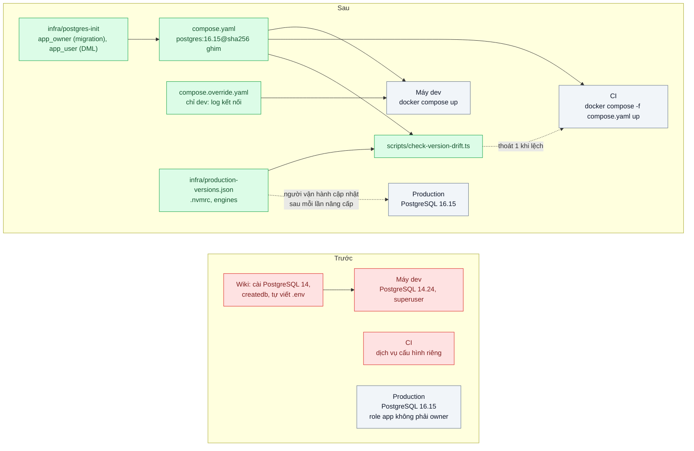

# Docker Compose & Dev/Prod Parity — "Trên máy em chạy được" vì Postgres local 14, production 16

| Scope | Mức độ | Trạng thái | Pattern gốc | Cập nhật |
|---|---|---|---|---|
| 17 · backend / docker | 🟢 Cơ bản | ✅ Hoàn thành | Dev/Prod Parity — The Twelve-Factor App (2011), mục X; Docker Compose docs | 2026-10-09 |

> **Một câu tóm tắt:** Mô tả toàn bộ dịch vụ phụ trợ (PostgreSQL, Redis, ...) trong một file Compose với đúng phiên bản và cấu hình quyền như production, để mọi lập trình viên và CI chạy trên cùng một môi trường dựng bằng một lệnh, thay vì mỗi máy một phiên bản cài tay.

## 1. Bài toán thực tế (What)

**Bối cảnh** *(doanh nghiệp giả định, số liệu minh họa)*
Công ty SaaS B2B có 12 lập trình viên backend. Mỗi người tự cài PostgreSQL và Redis bằng trình quản lý gói của máy, phần lớn là PostgreSQL 14 và Redis 6; production dùng PostgreSQL 16 và Redis 7. Ứng dụng production kết nối bằng một role riêng không phải owner của database, còn máy local thường dùng role mặc định có toàn quyền.

**Triệu chứng người kinh doanh nhìn thấy**
- Một lần phát hành bị chặn 2 giờ: migration chạy tốt trên mọi máy local nhưng thất bại ở production với lỗi quyền, phải hoàn tác và dời lịch giao tính năng cho khách.
- Lập trình viên mới mất khoảng 2 ngày để dựng được môi trường chạy test; người hướng dẫn mất theo nửa ngày.
- Mỗi quý có vài lỗi chỉ xuất hiện trên staging hoặc production, đội mất thời gian tranh luận "máy ai đúng".

**Nguyên nhân kỹ thuật**
Từ PostgreSQL 15, quyền `CREATE` trên schema `public` không còn được cấp mặc định cho mọi role (xem release notes PostgreSQL 15). Trên PostgreSQL 14 local, role ứng dụng tạo bảng trong `public` được; trên PostgreSQL 16 production với role không phải owner thì không. Đây chỉ là một ví dụ của khoảng cách công cụ giữa dev và production: khác phiên bản, khác cấu hình quyền, khác extension, khác phiên bản Node. Môi trường local được dựng bằng tay nên không ai biết chính xác nó khác production ở đâu.

**Ràng buộc**
- Lập trình viên dùng cả macOS (chip ARM) và Linux; môi trường phải chạy được trên cả hai.
- Dựng môi trường bằng một lệnh, chạy lại không hỏng dữ liệu đang có.
- CI dùng đúng định nghĩa môi trường đó cho test tích hợp.

## 2. Vì sao dùng pattern này (Why)

**Nguyên nhân gốc mà pattern nhắm vào:** môi trường phát triển là tập hợp phần mềm cài tay, trôi khỏi production theo thời gian mà không ai thấy.

**Pattern giải quyết thế nào:** The Twelve-Factor App, mục X "Dev/prod parity", chỉ ra ba khoảng cách giữa dev và production (thời gian, con người, công cụ) và khuyên không dùng dịch vụ phụ trợ khác nhau giữa các môi trường, kể cả khi bản "nhẹ" tiện hơn. Docker Compose biến môi trường thành mã: một file khai báo dịch vụ, image với phiên bản ghim cụ thể, biến môi trường, volume, healthcheck và script khởi tạo. Script khởi tạo tạo role ứng dụng không phải owner y như production, nên lỗi quyền lộ ra ngay ở máy lập trình viên và ở CI. File được review, có lịch sử, và cùng một file chạy cho mọi người.

**Lựa chọn khác đã cân nhắc**

| Lựa chọn | Giải quyết được gì | Vì sao không chọn (ở bài này) |
|---|---|---|
| Giữ nguyên + tối ưu nhỏ (wiki hướng dẫn cài đúng phiên bản) | Có hướng dẫn chung | Không ai kiểm tra; trôi lại sau vài tháng; vẫn mất thời gian cài tay |
| Database dùng chung trên một máy chủ dev | Một phiên bản cho mọi người | Lập trình viên giẫm dữ liệu của nhau, không chạy được offline, không thử được migration phá hủy |
| Testcontainers trong test | Mỗi lần test có container sạch đúng phiên bản | Tốt cho test, nhưng không phục vụ việc chạy ứng dụng hằng ngày; có thể kết hợp sau |
| Dev container hoặc môi trường dev từ xa | Đồng nhất cả công cụ của lập trình viên | Thay đổi thói quen lớn hơn nhu cầu hiện tại |
| Compose ghim phiên bản như production + script khởi tạo role (chọn) | Một lệnh, đúng phiên bản và quyền, CI dùng chung | Tốn tài nguyên máy; cần kỷ luật cập nhật phiên bản theo production |

## 3. Thiết kế hệ thống (How)

### 3.1 Kiến trúc trước và sau



### 3.2 Luồng chính

```mermaid
sequenceDiagram
  participant DEV as Lập trình viên
  participant DC as docker compose
  participant PG as PostgreSQL 16.15 (compose)
  participant CI as CI
  DEV->>DC: cp .env.example .env && docker compose up -d --wait
  DC->>PG: Volume trống: chạy infra/postgres-init/01-roles.sql
  PG->>PG: app_owner sở hữu crm, crm_test; app_user chỉ CONNECT, USAGE, DML
  DC-->>DEV: healthy (pg_isready qua TCP)
  DEV->>PG: Migration bằng role app (cấu hình cũ, một DATABASE_URL)
  PG-->>DEV: ERROR 42501 permission denied for schema public
  Note over DEV: Lỗi quyền lộ ở máy dev,<br/>không phải lúc phát hành
  DEV->>DEV: Tách MIGRATION_DATABASE_URL (app_owner) khỏi DATABASE_URL (app_user)
  DEV->>CI: Push
  CI->>CI: pnpm check:versions (so compose.yaml, .nvmrc với production-versions.json)
  CI->>DC: docker compose -f compose.yaml up -d --wait (không đọc override)
  CI->>PG: pnpm db:migrate bằng app_owner, pnpm test bằng app_user
  CI-->>DEV: Xanh trên cùng phiên bản và cùng quyền với production
```

### 3.3 Thành phần và trách nhiệm

| Thành phần | Trách nhiệm | Quyết định thiết kế đáng chú ý |
|---|---|---|
| `compose.yaml` | Khai báo PostgreSQL, phiên bản ghim, healthcheck, volume, cổng loopback 55432 | Tag bản vá + digest (`postgres:16.15@sha256:ca0bd484…`), không dùng tag trôi `postgres:16`; mật khẩu `${VAR:?}` không có mặc định; nhãn `lab.id=17-05` |
| `compose.override.yaml` | Thiết lập chỉ cho dev: `log_connections`, log câu chậm hơn 250 ms | Compose tự gộp khi chạy không có `-f`; CI chạy `-f compose.yaml` nên không dùng. Không đổi image, role, quyền (script kiểm lệch báo lỗi nếu file đặt `image`) |
| `infra/postgres-init/01-roles.sql` + `app-privileges.psql` | Tạo `app_owner` (owner database, chạy migration) và `app_user` (CONNECT, USAGE, SELECT/INSERT/UPDATE/DELETE qua `ALTER DEFAULT PRIVILEGES`); tạo `crm_test` cùng quyền | Mật khẩu đọc bằng `\getenv`, đưa vào câu lệnh bằng `format(%L) \gexec`; idempotent; file `.psql` không bị entrypoint tự chạy nên dùng chung cho hai database |
| `.env.example` | Liệt kê mật khẩu mẫu và bốn chuỗi kết nối (app, migration, test app, test migration) | Giá trị mẫu, không dùng ở production (bài 08) |
| `infra/production-versions.json` | "Phiên bản production" giả lập: `postgres 16.15`, `node 20.19.6` | Thực tế đọc từ `SHOW server_version` của production bằng tài khoản chỉ đọc hoặc từ IaC |
| `scripts/check-version-drift.ts` | So tag Compose, file override, `.nvmrc`, `engines.node`, Node đang chạy với production; `--db` hỏi `SHOW server_version` của DB đang chạy | Thoát 0 khi khớp, 1 khi lệch (in dịch vụ và tag), 2 khi tham số sai; thiếu digest chỉ là cảnh báo |
| `src/db/migrator.ts`, `pnpm db:migrate` | Chạy migration Kysely bằng `MIGRATION_DATABASE_URL` | Ghi `current_user` và `server_version` vào log để thấy ngay chạy bằng role nào, trên bản nào |
| API NestJS (`src/`) | `POST/GET/PATCH/DELETE /customers`, `/health` trả role và phiên bản DB | Nối bằng `DATABASE_URL` của `app_user`; in role và phiên bản lúc khởi động |
| `.nvmrc`, `engines` | Node 20.19.6 cho máy dev và CI | Script kiểm `.nvmrc` = production, `.nvmrc` thỏa `engines`, Node đang chạy cùng minor |

### 3.4 Điểm dễ sai khi triển khai
- **Ghim phiên bản một lần rồi quên.** Production nâng cấp, Compose đứng yên; đưa `pnpm check:versions` vào CI (mỗi PR và định kỳ).
- **Chỉ sửa một trong hai khoảng cách.** Đo thật ở mục 5.1: PostgreSQL 16 + superuser vẫn chạy migration thành công, PostgreSQL 14 + role app không phải owner cũng thành công. Chỉ tổ hợp "16 + role app" mới lộ lỗi, nên Compose phải giống production ở cả phiên bản lẫn role.
- **Lỗi lộ ở bảng nội bộ của Kysely, không ở migration của ứng dụng.** Câu bị từ chối là `create table if not exists "kysely_migration"`, câu đầu tiên Migrator chạy; thông báo không nhắc tới bảng `customers`, dễ chẩn đoán nhầm.
- **Trên PostgreSQL 14, role app tự tạo bảng thì sở hữu luôn bảng đó** (đo thật: `customers`, `kysely_migration` thuộc `app_user`), tức ứng dụng có quyền `DROP`. Test bất biến "không đối tượng nào trong `public` thuộc role app" bắt được trường hợp này.
- **Init script không chạy lại** khi volume đã có dữ liệu (log: "Skipping initialization"); sửa file trong `infra/postgres-init/` thì phải `docker compose down -v` rồi `up`.
- **`log_statement=all` hoặc `ddl` trong `command`/override làm lộ mật khẩu role.** Entrypoint truyền các cờ `-c` cho cả server tạm lúc chạy init script; đã kiểm: log container có nguyên văn `CREATE ROLE app_owner LOGIN PASSWORD '...'`. Override của lab chỉ bật `log_connections` và `log_min_duration_statement`.
- **`pg_isready` không đăng nhập**, nên "healthy" không chứng minh role đã có. Healthcheck hỏi qua TCP mới đúng nghĩa "init xong", vì server tạm lúc init chỉ nghe Unix socket.
- **`name:` ở đầu `compose.yaml` cố định tên project**: hai bản checkout khác thư mục dùng chung project và volume `lab-17-05_pgdata`. Đo "bản clone sạch" phải tắt project chính trước (hoặc dùng `-p`).
- **Tag trôi khác nhau giữa các máy.** Trên máy đo, `postgres:16` (kéo trước đó) trỏ index `sha256:65b16a8b…`, còn Docker Hub lúc đo trỏ `sha256:ca0bd484…` (cùng PostgreSQL 16.15, Debian 13.7 bên trong; khác ở index). Ghim digest thì mọi máy dùng đúng một image.
- **Cổng trùng với dịch vụ cài sẵn trên máy** (5432) khiến ứng dụng nối nhầm vào bản cũ; lab mở 127.0.0.1:55432 và API in `role`, `server_version` lúc khởi động; `check:versions --db` báo lỗi khi DB đang nối tới không phải bản production.
- **`\getenv` chỉ có từ psql 15**: init script của lab không chạy được trên image PostgreSQL 14 (vô tình cũng là một chốt chặn dựng nhầm bản cũ).
- **Kysely 0.29 tách Migrator sang `kysely/migration`**; `import { Migrator } from 'kysely'` biên dịch lỗi và chạy ra "Migrator is not a constructor".

## 4. Tech stack và tác động (Impact techstack)

| Lớp | Công nghệ chọn | Vì sao chọn | Thay thế tương đương |
|---|---|---|---|
| Điều phối local | Docker Compose (`compose.yaml` + `compose.override.yaml`), `up --wait` | Một lệnh dựng môi trường, gộp file theo môi trường, chờ healthcheck | Testcontainers cho test, dev container |
| Database | `postgres:16.15@sha256:ca0bd484…` (arm64 + amd64), init script trong `/docker-entrypoint-initdb.d` | Đúng phiên bản và hành vi quyền như production giả lập | Image có sẵn extension cần dùng |
| Bản "trước" | `postgres:14.24@sha256:14bfab57…` chỉ dùng trong bench (mô phỏng bản cài tay) | Bản mới nhất của nhánh 14 lúc làm lab | Homebrew `postgresql@14` (không cài: lab không cài phần mềm hệ thống) |
| Ứng dụng | NestJS 10.4.22, Kysely 0.29.6, pg 8.23.1, Node 20.19.6 qua `.nvmrc` + `engines` | Stack mặc định của repo | Fastify |
| Migration | Kysely Migrator, danh sách migration tĩnh, chạy bằng `app_owner` | Tách quyền migration khỏi quyền ứng dụng | node-pg-migrate |
| Kiểm tra | `scripts/check-version-drift.ts` (`yaml` 2.9.1, `semver` 7.8.5), Vitest 5.0.3 | Phát hiện lệch và lỗi quyền tự động | — |

**Lệch so với kế hoạch:** lab không có Redis. API không dùng Redis, thêm một dịch vụ không dùng chỉ để có dòng "Redis 7" là overengineer; script kiểm lệch nhận mọi dịch vụ có `image` trong `compose.yaml`, thêm Redis chỉ cần thêm dòng `"redis": "7.4.6"` vào `infra/production-versions.json` (test (c) có ca "dịch vụ không có trong production"). Chỉ số "INFO server của Redis" ở mục 5 vì vậy chưa đo. "Production" là file JSON giả lập, không có máy production thật để hỏi `SELECT version()`; `--db` hỏi DB của Compose (và PostgreSQL 14 của bản trước) thay cho production.

**Thay đổi so với hệ thống hiện tại:** thêm file Compose, init script, `.env.example`, `.nvmrc`, file phiên bản production và script kiểm lệch; tách `MIGRATION_DATABASE_URL` (owner) khỏi `DATABASE_URL` (app); CI chạy `check:versions`, migration và test tích hợp trên `compose.yaml`. Lập trình viên gỡ PostgreSQL cài tay (hoặc để nguyên ở cổng 5432, lab dùng 55432).

## 5. Kết quả đầu ra và cách đo (Output impact)

| Chỉ số | Trước (minh họa) | Mục tiêu khi thực hành | Cách đo |
|---|---|---|---|
| Thời gian từ `git clone` tới test xanh trên máy mới | 2 ngày | ≤ 30 phút | Đo bằng đồng hồ trên máy ảo sạch, ghi từng bước |
| Lỗi quyền của migration bị phát hiện trước khi phát hành | 0 % | 100 % trong kịch bản thử | Chạy cùng migration trên PostgreSQL 14 role toàn quyền và Compose PostgreSQL 16 role app, so kết quả |
| Phiên bản dịch vụ khác nhau giữa dev, CI, production | 3 phiên bản khác nhau | 0 khác biệt mức minor | Script so `SELECT version()` và `INFO server` của Redis |
| Số lệnh để dựng môi trường | hơn 10 bước thủ công | 1 lệnh | Đếm trong README của bài |
| `docker compose up -d` chạy lại không hỏng | không áp dụng | chạy lại 3 lần, dữ liệu giữ nguyên | Script chạy lặp và kiểm tra dữ liệu mẫu |

> Số "trước" là minh họa để hình dung bài toán. Số "mục tiêu" chỉ được coi là đạt khi có số đo thật
> ở mục 8 kèm môi trường đo.

**Tác động nghiệp vụ mong đợi:** phát hành không còn bị chặn bởi lỗi chỉ có ở production, lập trình viên mới đóng góp ngay trong ngày đầu, và đội ngừng tranh luận "máy ai đúng".

### 5.1 Số đã đo

**Môi trường** *(đã đo, 2026-10-09, 09:54 – 09:57 giờ Việt Nam)*: MacBook Apple M1 Pro (8 nhân, 16 GB), macOS 26.6.2,
**cắm sạc** (`AC Power`, pin 100 %, ghi trước mỗi lượt), nắp mở, `caffeinate -ims`. Load 1 phút của macOS 5,4 – 9,0 suốt
lượt (Docker Desktop, ứng dụng của người dùng, container MySQL/RabbitMQ của dự án khác). Docker Desktop, Engine 28.5.1,
máy ảo Docker 8 CPU / 7,65 GiB. Node 20.19.6, pnpm 10.32.0. Image: `postgres:14.24@sha256:14bfab57…`,
`postgres:16.15@sha256:ca0bd484…` (arm64). File thô (không commit): `bench/results/main/matrix.json`, `setup-timing.json`,
`restart.json`, `negative.json` và `*.log` cùng thư mục, `drift-live.log`.

**"Máy mới" được mô phỏng thế nào** (không phải máy ảo): bản sao sạch của thư mục bài (36 file mà git theo dõi hoặc chưa
theo dõi nhưng không bị `.gitignore` loại: không `node_modules`, không `.env`) vào thư mục tạm ngoài repo; image PostgreSQL
**đã có sẵn** trên máy; kho pnpm toàn cục **đã có** mọi gói (máy đã chạy các lab khác), thêm một lượt với kho pnpm trống
(`--store-dir` mới, tải gói từ npm registry qua Internet). Docker Desktop, Node, pnpm đã cài sẵn. Thời gian là **thời gian
máy chạy các lệnh**, không gồm thời gian người đọc wiki, cài Docker/Node hay gõ lệnh. 3 vòng, xoay thứ tự ba luồng giữa các
vòng; ghi trung vị (thấp nhất – cao nhất).

**Cùng một migration trên hai phiên bản và hai kiểu role** (`bench/migration-matrix.ts`, một lượt vì là chỉ số đúng/sai).
Bốn dòng đầu: container mới, dựng giống hệt nhau (database thuộc superuser, `app_user` chỉ `LOGIN` + `CONNECT`, không
`GRANT CREATE`), chỉ khác phiên bản. Hai dòng cuối: PostgreSQL của `compose.yaml` với init script của lab.

| PostgreSQL | Role chạy migration | Superuser | `CREATE` trên `public` | Kết quả | Bảng tạo ra thuộc |
|---|---|---|---|---|---|
| 14.24 (cài tay kiểu cũ) | `postgres` | có | có | thành công (40 ms) | `postgres` |
| 14.24 (cài tay kiểu cũ) | `app_user` | không | **có** (PUBLIC) | **thành công** (29 ms) | **`app_user`** |
| 16.15 (container mới) | `postgres` | có | có | thành công (53 ms) | `postgres` |
| 16.15 (container mới) | `app_user` | không | không | **lỗi 42501** (17 ms) | — |
| 16.15 (`compose.yaml` + init) | `app_user` | không | không | **lỗi 42501** (19 ms) | — |
| 16.15 (`compose.yaml` + init) | `app_owner` | không | có (owner database) | thành công (45 ms) | `app_owner` |

Lỗi thật trên PostgreSQL 16.15, nguyên văn. Phía client (`pnpm db:migrate`):

```text
migration: role=app_user server=16.15 (Debian 16.15-1.pgdg13+2) (33 ms)
LỖI migration [42501]: permission denied for schema public
```

Log server (`log_min_error_statement` mặc định):

```text
ERROR:  permission denied for schema public at character 28
STATEMENT:  create table if not exists "kysely_migration" ("name" varchar(255) not null primary key, "timestamp" varchar(255) not null)
```

**Từ "vừa clone" tới kết quả** (`bench/setup-timing.ts`, giây)

| Luồng | Các bước | Tổng: trung vị (thấp – cao) | Kết quả |
|---|---|---|---|
| Trước: hướng dẫn thủ công (README cũ) | 1. "cài PostgreSQL 14" (mô phỏng `docker run postgres:14.24`) 0,8 · 2. chờ nhận kết nối 1,2 · 3. `createdb` hai database 0,3 · 4. tự viết `.env` (superuser cho mọi thứ) 0,0 · 5. `pnpm install` 1,3 · 6. `pnpm db:migrate` 1,8 · 7. test API 2,1 | 7,3 (6,6 – 8,2) | xanh 3/3, nhưng **xanh giả**: PostgreSQL 14 + superuser, lỗi quyền không lộ |
| Sau: `cp .env.example .env && docker compose up -d --wait && pnpm install && pnpm test` | 1. `cp` 0,0 · 2. `up --wait` 4,0 · 3. `pnpm install` 1,3 · 4. `pnpm test` (21 test) 6,1 | 11,3 (9,5 – 11,4) | xanh 3/3 trên 16.15 + role như production |
| Sau, kho pnpm trống (1 lượt) | `up --wait` 2,8 · `pnpm install` 6,1 · `pnpm test` 6,0 | 15,0 | xanh |
| CI trên `compose.yaml` (không override, biến từ môi trường) với mã trước (migration dùng chuỗi kết nối của role app) | 1. `docker compose -f compose.yaml up -d --wait` 2,7 · 2. `pnpm install` 1,3 · 3. `pnpm check:versions` 1,6 · 4. `pnpm db:migrate` 0,6, **thoát 1** | **5,9 (5,8 – 6,7)** tới lúc job dừng | dừng ở bước 4 cả 3/3 lượt, thông báo `permission denied for schema public` |

Kéo image lần đầu (chưa có layer nào trên máy): `docker pull postgres:14.24@sha256:…` mất 23,7 s cho 155,8 MB nén (arm64),
một mẫu. `postgres:16.15` (158,9 MB nén) không kéo lại được trên máy này vì các lab khác đang dùng, nên **ước lượng** máy
chưa có image cộng thêm khoảng 24 s, chưa đo trực tiếp. Không đo lại bằng `docker rmi` + `pull` trên daemon chính (nhật ký
17/01 điểm 4).

**Chạy lại `up` không hỏng dữ liệu** (`bench/restart-keeps-data.ts`): sau khi ghi một dòng mẫu, `up -d --wait` lần 1, 2, 3
mỗi lần 0,7 s; `restart` + `up` 1,6 s; `down` (giữ volume) + `up` 2,9 s. Sau cả 5 lần: dòng mẫu còn, `app_user` vẫn không
có `CREATE` trên `public`, container mới ghi "Skipping initialization" (init script không chạy lại).

**Lệch phiên bản** (`pnpm check:versions`, `bench/results/main/drift-live.log`): trên file của lab thoát 0 (`postgres 16.15,
node 20.19.6`); `--db` với PostgreSQL 14.24 kiểu cũ thoát 1: `DB đang chạy 14.24 (Debian 14.24-1.pgdg13+2), production 16.15`;
với DB của Compose: `DB đang chạy 16.15`. Dev và CI dùng cùng `compose.yaml` nên cùng một digest.

**Test và phép thử âm**
- `pnpm test`: 4 file, 21 test xanh, khoảng 6 s — (a) `app-role-permissions.test.ts` 7 test, (b) `migration-owner.test.ts`
  3 test, (c) `version-drift.test.ts` 9 test, `api.test.ts` 2 test (NestJS thật qua HTTP, nối bằng role app).
- (a) kiểm cả catalog (`has_schema_privilege`, `has_database_privilege`, `has_table_privilege`, `pg_roles`, `pg_class`) lẫn
  kết nối thật (`CREATE TABLE` → 42501; `INSERT/SELECT/UPDATE/DELETE` chạy; `DROP`/`ALTER` → "must be owner"; `TRUNCATE` → 42501).
- (c) chạy script như CI (tiến trình con, đọc mã thoát): file thật khớp → 0; tag 15.14, `postgres:16`, `latest`/không tag,
  override đặt `image`, dịch vụ không có trong production, `.nvmrc` 20.18.0, Node đang chạy 22.11 → 1; thiếu digest → cảnh
  báo, 0; `--db` với DB của Compose → 0.
- Phép thử âm (`bench/negative-drills.ts`, `negative.json`, 5/5 đúng kỳ vọng, file khôi phục khớp sha256 sau mỗi phép thử):

| Phép thử | Kết quả |
|---|---|
| 1. Thêm `GRANT CREATE ON SCHEMA public TO app_user` vào init, `down -v` + `up` | (a) đỏ: 3/7 test (catalog CREATE, `CREATE TABLE` bị từ chối, bất biến "không đối tượng nào thuộc role app" vì bảng tạm do app tạo) |
| 2. `TEST_MIGRATION_DATABASE_URL` trỏ role app, DB sạch | (b) đỏ 3/3, đầu ra có `permission denied for schema public` |
| 3. `compose.yaml` đổi `postgres:16.15@…` thành `postgres:16.14@…` | script thoát 1: `✖ [postgres] tag "16.14" (phiên bản 16.14) khác production 16.15`; (c) đỏ 2/9 (ca "file thật khớp" và `--db`) |
| 4. `compose.yaml` dùng `postgres:16` (tag trôi, không digest) | script thoát 1: `✖ [postgres] tag "16" không ghim bản vá: ... production chạy 16.15, ghim "16.15"` kèm cảnh báo thiếu digest; (c) đỏ 3/9 |
| Đối chứng: khôi phục, `down -v` + `up`, `pnpm test` | xanh 21/21 |

**Đối chiếu mục tiêu**

| Chỉ số | Kết quả đo | Đánh giá |
|---|---|---|
| Clone tới test xanh ≤ 30 phút | 11,3 s máy chạy (image, kho pnpm có sẵn); 15,0 s với kho pnpm trống; cộng khoảng 24 s nếu chưa có image (ước lượng) | đạt ở phần máy chạy; thời gian người (cài Docker, Node, đọc README) và máy ảo sạch thật chưa đo |
| Lỗi quyền phát hiện trước phát hành 100 % | trước: 0/2 kịch bản dev phát hiện (14.24 superuser, 14.24 role app); sau: CI trên `compose.yaml` dừng ở `db:migrate` 3/3 lượt sau 5,9 s; test (b) đỏ khi migration dùng role app | đạt trong kịch bản thử |
| 0 khác biệt mức minor dev/CI/production | trước: dev 14.24, production 16.15 (khác major); sau: dev = CI = 16.15 cùng digest, script thoát 0 | đạt với PostgreSQL và Node; Redis chưa đo (lab không có Redis) |
| Số lệnh dựng môi trường: 1 | trước 4 bước tay (cài, chờ, `createdb`, viết `.env`); sau 2 lệnh trên máy dev (`cp .env.example .env`, `docker compose up -d --wait`), 1 lệnh trên CI (biến có sẵn) | gần đạt: thêm một lệnh chép `.env` vì không để mật khẩu mặc định |
| `up -d` chạy lại 3 lần, dữ liệu giữ nguyên | 3 lần `up` + `restart` + `down`/`up`: dữ liệu, role, quyền giữ nguyên | đạt |

**Hạn chế:** "máy mới" là thư mục sạch trên chính máy đo, không phải máy ảo; luồng "trước" chạy lệnh bằng script nên không
có thời gian người dò lỗi (đây mới là phần lớn của "2 ngày" ở mục 1); bản "trước" nhanh hơn (7,3 so với 11,3 s) vì chỉ có test
API và không có init script, so sánh giây ở đây không phải mục đích; 3 vòng; máy chạy chung container của dự án khác.

## 6. Đánh đổi và khi KHÔNG nên dùng

**Đánh đổi**
- Tốn RAM và CPU máy lập trình viên, nhất là khi chạy nhiều dịch vụ.
- Compose không giống hệt nền tảng production (cân bằng tải, mạng, dịch vụ được quản lý); parity ở mức dịch vụ phụ trợ, không phải toàn bộ hạ tầng.
- Phải có người chịu trách nhiệm cập nhật phiên bản theo production (file `production-versions.json` của lab chỉ đúng khi được cập nhật).
- Thêm một bước chép `.env` vì không để mật khẩu mặc định trong file Compose; test cần `.env` hoặc biến môi trường của CI.
- Script kiểm lệch tin tag khớp với digest; tag và digest lệch nhau (sửa tay) thì chỉ `--db` hỏi DB đang chạy mới bắt được.

**Không nên dùng khi**
- Dịch vụ phụ trợ chỉ có dưới dạng dịch vụ cloud được quản lý, không có bản chạy local tương đương: cần môi trường dev trên cloud hoặc giả lập có kiểm soát.
- Ứng dụng không có dịch vụ phụ trợ (thư viện thuần): không cần Compose.
- Máy lập trình viên quá yếu để chạy đủ dịch vụ: dùng môi trường dev từ xa, vẫn với cùng định nghĩa.

**Liên quan**
- Đọc sau: `../06-healthcheck-depends-on-app-khoi-dong-truoc-db-san-sang/` — thứ tự khởi động trong cùng file Compose.
- Đọc sau: `../08-env-config-secrets-khong-nuong-vao-image/` — cấu hình qua biến môi trường, không bí mật trong file.
- Cùng chủ đề: `../../02-backend-database/07-multi-tenant-saas-300-cong-ty-chung-mot-db/` — tách role migration và role ứng dụng.
- Cùng chủ đề: `../../23-backend-monitoring-benchmark/07-load-testing-k6-coordinated-omission-benchmark-tu-danh-lua/` — đo trên môi trường giống production mới có ý nghĩa.

## 7. Cơ sở tham khảo

- Adam Wiggins, *The Twelve-Factor App*, 2011, "X. Dev/prod parity" — https://12factor.net/dev-prod-parity — ba khoảng cách thời gian, con người, công cụ; không dùng dịch vụ phụ trợ khác nhau giữa môi trường.
- PostgreSQL 15 Release Notes — https://www.postgresql.org/docs/release/15.0/ — mục "Remove PUBLIC creation permission on the public schema" (thay đổi không tương thích, áp dụng cho cluster và database mới) và "Change the owner of the public schema to be the new pg_database_owner role"; psql thêm `\getenv`.
- PostgreSQL 16 docs, "Schemas — Usage Patterns" — https://www.postgresql.org/docs/16/ddl-schemas.html — secure schema usage pattern; từ PostgreSQL 15 cấu hình mặc định hỗ trợ pattern này.
- PostgreSQL 16 docs, `GRANT` https://www.postgresql.org/docs/16/sql-grant.html, `ALTER DEFAULT PRIVILEGES` https://www.postgresql.org/docs/16/sql-alterdefaultprivileges.html, psql (`\getenv`, `\gexec`) https://www.postgresql.org/docs/16/app-psql.html.
- Docker Compose docs — "Merge Compose files" https://docs.docker.com/compose/how-tos/multiple-compose-files/merge/ (mặc định đọc `compose.yaml` và `compose.override.yaml`), `docker compose up` https://docs.docker.com/reference/cli/docker/compose/up/ (`--wait`: chờ dịch vụ running/healthy).
- Docker Official Image `postgres`, mục "Initialization scripts" — https://hub.docker.com/_/postgres, nội dung tại https://github.com/docker-library/docs/blob/master/postgres/content.md — script `*.sql`/`*.sh` trong `/docker-entrypoint-initdb.d` chỉ chạy khi thư mục dữ liệu trống; server tạm lúc init chỉ nghe Unix socket.

## 8. Kế hoạch thực hành

- [x] Bước 1: dựng API NestJS với migration tạo bảng trong `public`; tái hiện "trước" bằng container PostgreSQL 14 dùng role toàn quyền.
- [x] Bước 2: đo "trước": chạy migration trên PostgreSQL 14 (thành công) và trên PostgreSQL 16 với role không phải owner (thất bại); đo thời gian dựng môi trường theo hướng dẫn thủ công (thư mục sạch, không phải máy ảo — xem 5.1).
- [x] Bước 3: viết `compose.yaml` ghim phiên bản, init script tạo role như production, override cho dev, `.env.example`, script kiểm tra lệch phiên bản; tách role migration.
- [x] Bước 4: đo "sau": thời gian từ clone tới test xanh, CI phát hiện lỗi quyền; ghi số thật và môi trường vào mục 5.
- [x] Bước 5: viết test: (a) role ứng dụng không tạo được bảng nhưng đọc ghi được dữ liệu; (b) migration chạy bằng role owner thành công; (c) script kiểm tra lệch báo lỗi khi tag Compose khác phiên bản production giả lập.

**Cấu trúc code thật**
```text
compose.yaml                         # [PATTERN] postgres:16.15@sha256 ghim, init, healthcheck TCP, nhãn lab.id=17-05
compose.override.yaml                # chỉ cho dev: log_connections, log câu chậm
infra/
  postgres-init/
    01-roles.sql                     # [PATTERN] app_owner, app_user, crm_test; \getenv + format(%L) \gexec
    app-privileges.psql              # [PATTERN] quyền như production cho từng database (entrypoint không tự chạy .psql)
  production-versions.json           # production giả lập: postgres 16.15, node 20.19.6
.env.example                         # mật khẩu mẫu, bốn chuỗi kết nối
.nvmrc                               # 20.19.6
scripts/
  check-version-drift.ts             # CLI: thoát 0 khớp / 1 lệch / 2 tham số sai; --db hỏi SHOW server_version
  lib/version-drift.ts               # [PATTERN] luật so tag, override, .nvmrc, engines, Node đang chạy
  clean.ts                           # dọn chỉ đồ của lab (project lab-17-05, nhãn lab.id=17-05)
src/
  config.ts                          # nạp .env (biến môi trường ưu tiên), requireEnv không mặc định
  db/database.ts, db/migrator.ts     # [PATTERN] migration bằng MIGRATION_DATABASE_URL (owner)
  db/migrate.ts                      # pnpm db:migrate, thoát 1 khi lỗi
  db/migrations/001-create-customers.ts
  customers/                         # controller + repository (role app, chỉ DML)
  app.module.ts, main.ts             # [PATTERN] API nối bằng DATABASE_URL (app_user)
test/
  app-role-permissions.test.ts       # (a)
  migration-owner.test.ts            # (b)
  version-drift.test.ts              # (c)
  api.test.ts                        # API thật qua HTTP bằng role app
  support/                           # chuỗi kết nối test, reset crm_test bằng role migration
bench/
  migration-matrix.ts                # 14.24/16.15 × superuser/app, compose × app/owner
  setup-timing.ts                    # trước / sau / CI mã trước, 3 vòng xoay thứ tự
  restart-keeps-data.ts              # up lặp lại, restart, down + up
  negative-drills.ts                 # 4 phép thử âm + đối chứng
  lib/run.ts
```

**Cách chạy** *(đã chạy lại từ đầu, 2026-10-09)*
```bash
# Cần: Docker Desktop (Compose v2), Node 20.19.6 (`nvm use` đọc .nvmrc), pnpm 10.32.0.
# Image postgres:16.15 (ghim digest) tự kéo khi thiếu (~159 MB nén).
cp .env.example .env               # giá trị mẫu; production lấy mật khẩu từ kho bí mật
docker compose up -d --wait        # dev: tự gộp compose.override.yaml
pnpm install --frozen-lockfile
pnpm typecheck
pnpm test                          # 21 test: (a) (b) (c) + API
pnpm check:versions                # kiểm lệch (CI chạy bước này mỗi PR)

# Chạy tay
pnpm db:migrate                    # bằng MIGRATION_DATABASE_URL (app_owner)
pnpm dev                           # API ở http://127.0.0.1:3100 bằng DATABASE_URL (app_user)

# Giống CI: chỉ compose.yaml, biến lấy từ môi trường
docker compose -f compose.yaml up -d --wait

# Đo (≈ 3 phút; bench kéo postgres:14.24 ghim digest nếu chưa có, ~156 MB nén; dùng cổng 55433 cho container tạm)
pnpm bench:matrix                  # cần compose đang chạy
pnpm bench:restart                 # cần compose đang chạy
pnpm bench:negative                # sửa tạm init/compose.yaml rồi khôi phục khớp sha256; down -v/up nhiều lần
docker compose down -v && pnpm bench:setup <thư-mục-tạm-ngoài-repo> main 3 --cold-store

# Dọn: chỉ đồ của lab, không prune toàn cục
docker compose down -v
pnpm clean                         # thêm --pg14-image để xóa image postgres:14.24 của bench
```

## Bài học sau khi làm

- **Hai khoảng cách chồng lên nhau, sửa một vẫn lọt.** Ma trận đo cho thấy migration chỉ lỗi ở đúng một tổ hợp: PostgreSQL
  16 với role không phải owner. Dev dùng 16 nhưng vẫn superuser thì xanh; dùng role app như production nhưng còn 14 thì
  cũng xanh. Parity phải gồm cả phiên bản lẫn role, và init script là chỗ đặt phần "role như production".
- **Bản cũ còn nguy hiểm theo cách khác:** trên 14.24, role app chạy migration thì sở hữu luôn bảng, tức ứng dụng có quyền
  `DROP`. Test bất biến ở mức catalog ("không đối tượng nào trong `public` thuộc role app") là thứ bắt được, đúng như bài
  học của 19/01: kiểm trạng thái trong DB, không chỉ kiểm câu lệnh chạy được. Ở phép thử âm 1, chính test này đỏ vì bảng tạm
  do role app tạo được.
- **Thông báo lỗi không chỉ vào migration của mình.** Câu bị từ chối là bảng `kysely_migration` của thư viện, câu đầu tiên
  Migrator chạy. Ghi `current_user` và `server_version` ở dòng đầu log migration giúp chẩn đoán trong vài giây.
- **Mã "trước" trên CI giống production dừng sau khoảng 6 s ở bước migrate**, trong khi theo hướng dẫn cũ nó xanh ở mọi máy dev
  và chỉ lỗi lúc phát hành. Giá trị của pattern nằm ở chỗ lỗi lộ ở bước nào, không ở số giây dựng môi trường: bản "trước"
  dựng còn nhanh hơn, nhưng là xanh giả.
- **Cờ `-c` của postgres trong Compose áp cho cả server tạm lúc init**: `log_statement=ddl` ghi nguyên văn mật khẩu của
  `CREATE ROLE` vào log container (đã kiểm). Thiết lập "chỉ cho dev" vẫn phải xem nó chạm vào init thế nào.
- **`name:` trong `compose.yaml` làm mọi bản checkout dùng chung project và volume** (`lab-17-05_pgdata`), dù nằm ở thư mục
  khác. Thấy khi viết bench đo bản clone: bench từ chối chạy khi project chính còn bật, thay vì âm thầm dùng volume cũ.
- **Tag trôi khác nhau thật giữa các máy**: `postgres:16` đã kéo trên máy đo và `postgres:16` trên Docker Hub lúc đo trỏ hai
  index digest khác nhau (bên trong vẫn là 16.15). Script coi tag không ghim bản vá là lỗi, thiếu digest là cảnh báo.
- **Lỗi gặp khi làm:** Kysely 0.29 chuyển `Migrator` sang `kysely/migration` (typecheck báo `KyselyTypeError`, chạy thì
  "Migrator is not a constructor"); `vitest.config.ts` đọc `.env` bằng `node:util` `parseEnv` thay vì `loadEnv` của Vite (Vite
  không phải dependency trực tiếp dưới pnpm).
- **Hạn chế số đo:** xem cuối mục 5.1 (thư mục sạch thay cho máy ảo, image và kho pnpm có sẵn trừ một lượt, không đo thời gian
  người, 3 vòng, một mẫu kéo image lạnh).
