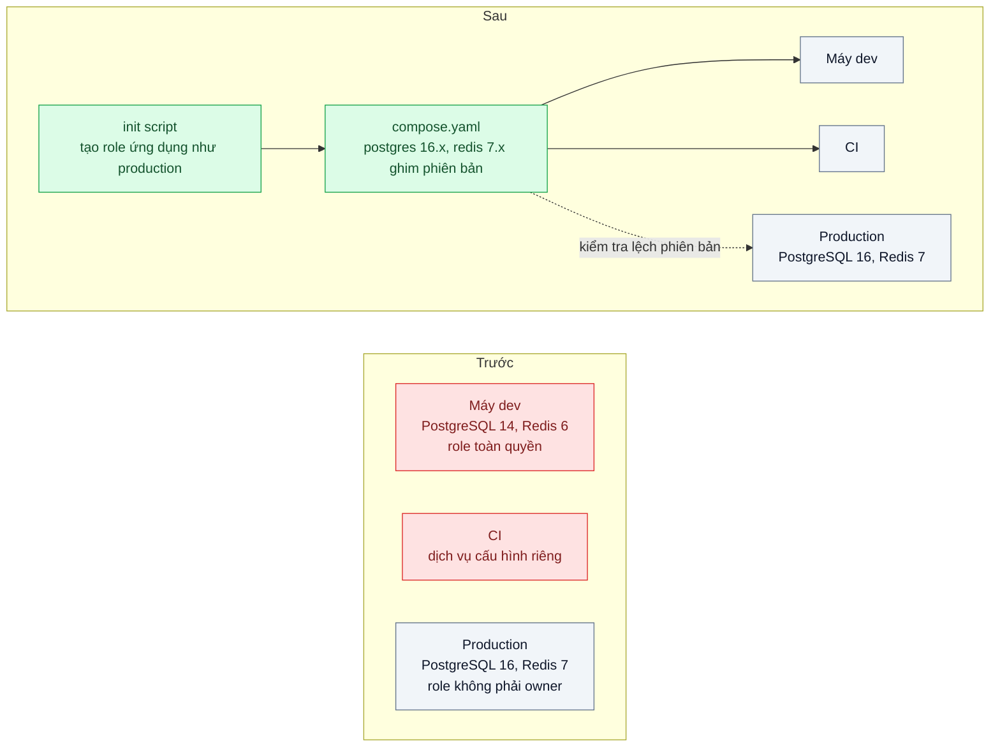
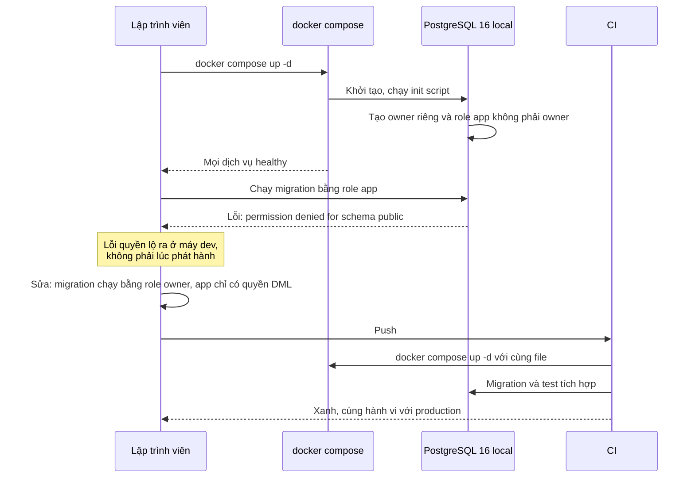

# Docker Compose & Dev/Prod Parity — "Trên máy em chạy được" vì Postgres local 14, production 16

| Scope | Mức độ | Trạng thái | Pattern gốc | Cập nhật |
|---|---|---|---|---|
| 17 · backend / docker | 🟢 Cơ bản | 📋 Kế hoạch | Dev/Prod Parity — The Twelve-Factor App (2011), mục X; Docker Compose docs | 2026-10-06 |

> **Một câu tóm tắt:** Mô tả toàn bộ dịch vụ phụ trợ (PostgreSQL, Redis, ...) trong một file Compose với đúng phiên bản và cấu hình quyền như production, để mọi lập trình viên và CI chạy trên cùng một môi trường dựng bằng một lệnh, thay vì mỗi máy một phiên bản cài tay.

## 1. Bài toán thực tế (What)

**Bối cảnh** *(doanh nghiệp giả định, số liệu minh họa)*
Công ty SaaS B2B có 12 lập trình viên backend. Mỗi người tự cài PostgreSQL và Redis bằng trình quản lý gói của máy, phần lớn là PostgreSQL 14 và Redis 6; production dùng PostgreSQL 16 và Redis 7. Ứng dụng production kết nối bằng một role riêng không phải owner của database, còn máy local thường dùng role mặc định có toàn quyền.

**Triệu chứng người kinh doanh nhìn thấy**
- Một lần phát hành bị chặn 2 giờ: migration chạy tốt trên mọi máy local nhưng thất bại ở production với lỗi quyền, phải hoàn tác và dời lịch giao tính năng cho khách.
- Lập trình viên mới mất khoảng 2 ngày để dựng được môi trường chạy test; người hướng dẫn mất theo nửa ngày.
- Mỗi quý có vài lỗi chỉ xuất hiện trên staging hoặc production, đội mất thời gian tranh luận "máy ai đúng".

**Nguyên nhân kỹ thuật**
Từ PostgreSQL 15, quyền `CREATE` trên schema `public` không còn được cấp mặc định cho mọi role (xem release notes PostgreSQL 15). Trên PostgreSQL 14 local, role ứng dụng tạo bảng trong `public` được; trên PostgreSQL 16 production với role không phải owner thì không. Đây chỉ là một ví dụ của khoảng cách công cụ giữa dev và production: khác phiên bản, khác cấu hình quyền, khác extension, khác phiên bản Node. Môi trường local được dựng bằng tay nên không ai biết chính xác nó khác production ở đâu.

**Ràng buộc**
- Lập trình viên dùng cả macOS (chip ARM) và Linux; môi trường phải chạy được trên cả hai.
- Dựng môi trường bằng một lệnh, chạy lại không hỏng dữ liệu đang có.
- CI dùng đúng định nghĩa môi trường đó cho test tích hợp.

## 2. Vì sao dùng pattern này (Why)

**Nguyên nhân gốc mà pattern nhắm vào:** môi trường phát triển là tập hợp phần mềm cài tay, trôi khỏi production theo thời gian mà không ai thấy.

**Pattern giải quyết thế nào:** The Twelve-Factor App, mục X "Dev/prod parity", chỉ ra ba khoảng cách giữa dev và production (thời gian, con người, công cụ) và khuyên không dùng dịch vụ phụ trợ khác nhau giữa các môi trường, kể cả khi bản "nhẹ" tiện hơn. Docker Compose biến môi trường thành mã: một file khai báo dịch vụ, image với phiên bản ghim cụ thể, biến môi trường, volume, healthcheck và script khởi tạo. Script khởi tạo tạo role ứng dụng không phải owner y như production, nên lỗi quyền lộ ra ngay ở máy lập trình viên và ở CI. File được review, có lịch sử, và cùng một file chạy cho mọi người.

**Lựa chọn khác đã cân nhắc**

| Lựa chọn | Giải quyết được gì | Vì sao không chọn (ở bài này) |
|---|---|---|
| Giữ nguyên + tối ưu nhỏ (wiki hướng dẫn cài đúng phiên bản) | Có hướng dẫn chung | Không ai kiểm tra; trôi lại sau vài tháng; vẫn mất thời gian cài tay |
| Database dùng chung trên một máy chủ dev | Một phiên bản cho mọi người | Lập trình viên giẫm dữ liệu của nhau, không chạy được offline, không thử được migration phá hủy |
| Testcontainers trong test | Mỗi lần test có container sạch đúng phiên bản | Tốt cho test, nhưng không phục vụ việc chạy ứng dụng hằng ngày; có thể kết hợp sau |
| Dev container hoặc môi trường dev từ xa | Đồng nhất cả công cụ của lập trình viên | Thay đổi thói quen lớn hơn nhu cầu hiện tại |
| Compose ghim phiên bản như production + script khởi tạo role (chọn) | Một lệnh, đúng phiên bản và quyền, CI dùng chung | Tốn tài nguyên máy; cần kỷ luật cập nhật phiên bản theo production |

## 3. Thiết kế hệ thống (How)

### 3.1 Kiến trúc trước và sau



### 3.2 Luồng chính



### 3.3 Thành phần và trách nhiệm

| Thành phần | Trách nhiệm | Quyết định thiết kế đáng chú ý |
|---|---|---|
| `compose.yaml` | Khai báo dịch vụ phụ trợ, phiên bản ghim, healthcheck, volume | Ghim tới phiên bản minor của production, không dùng tag `latest` |
| `compose.override.yaml` | Thiết lập chỉ dành cho dev (cổng mở ra máy, công cụ quản trị) | Compose tự gộp file override; CI không dùng file này |
| Init script | Tạo database, role owner và role ứng dụng, extension | Quyền giống production; chạy một lần khi volume trống |
| `.env.example` | Liệt kê biến môi trường cần thiết | Không chứa bí mật thật (bài 08) |
| Kiểm tra lệch phiên bản | So phiên bản trong Compose với phiên bản production | Script đọc `SELECT version()` của production (chỉ đọc) và so với tag trong Compose |
| Phiên bản Node | `.nvmrc` và trường `engines` khớp image runtime | Ứng dụng có thể chạy trên máy hoặc trong container, cùng phiên bản |

### 3.4 Điểm dễ sai khi triển khai
- **Ghim phiên bản một lần rồi quên.** Production nâng cấp, Compose đứng yên; đưa kiểm tra lệch phiên bản vào CI định kỳ.
- **Local dùng role toàn quyền "cho tiện".** Khi đó lỗi quyền vẫn chỉ lộ ở production; role trong Compose phải giống production.
- **Init script không chạy lại** vì volume đã có dữ liệu từ lần trước; ghi rõ cách làm mới (`docker compose down -v`) và giữ init script idempotent.
- **Cổng trùng với dịch vụ đã cài sẵn trên máy** (PostgreSQL local đang chạy cổng 5432) khiến ứng dụng nối nhầm vào bản cũ; đặt cổng khác trong override và kiểm tra `SELECT version()` khi khởi động.
- **Khác kiến trúc CPU.** Image không có bản cho ARM chạy giả lập chậm hoặc lỗi; chọn image đa kiến trúc.

## 4. Tech stack và tác động (Impact techstack)

| Lớp | Công nghệ chọn | Vì sao chọn | Thay thế tương đương |
|---|---|---|---|
| Điều phối local | Docker Compose (file `compose.yaml`, override, profiles) | Một lệnh dựng môi trường, gộp file theo môi trường | Testcontainers cho test, dev container |
| Database | Image `postgres` ghim 16.x, init script trong thư mục khởi tạo của image | Đúng phiên bản và hành vi quyền như production | Image có sẵn extension cần dùng |
| Cache | Image `redis` ghim 7.x | Đúng phiên bản production | — |
| Ứng dụng | NestJS 10, Node 20 ghim qua `.nvmrc` và `engines` | Cùng phiên bản với image runtime | Fastify |
| Migration | Kysely Migrator chạy bằng role owner | Tách quyền migration khỏi quyền ứng dụng | node-pg-migrate |
| Kiểm tra | Script so phiên bản, Vitest test tích hợp trong CI | Phát hiện lệch và lỗi quyền tự động | — |

**Thay đổi so với hệ thống hiện tại:** thêm file Compose, init script, `.env.example`, script kiểm tra lệch phiên bản; tách role migration và role ứng dụng; CI chạy test tích hợp trên cùng file. Lập trình viên gỡ PostgreSQL và Redis cài tay (hoặc đổi cổng).

## 5. Kết quả đầu ra và cách đo (Output impact)

| Chỉ số | Trước (minh họa) | Mục tiêu khi thực hành | Cách đo |
|---|---|---|---|
| Thời gian từ `git clone` tới test xanh trên máy mới | 2 ngày | ≤ 30 phút | Đo bằng đồng hồ trên máy ảo sạch, ghi từng bước |
| Lỗi quyền của migration bị phát hiện trước khi phát hành | 0 % | 100 % trong kịch bản thử | Chạy cùng migration trên PostgreSQL 14 role toàn quyền và Compose PostgreSQL 16 role app, so kết quả |
| Phiên bản dịch vụ khác nhau giữa dev, CI, production | 3 phiên bản khác nhau | 0 khác biệt mức minor | Script so `SELECT version()` và `INFO server` của Redis |
| Số lệnh để dựng môi trường | hơn 10 bước thủ công | 1 lệnh | Đếm trong README của bài |
| `docker compose up -d` chạy lại không hỏng | không áp dụng | chạy lại 3 lần, dữ liệu giữ nguyên | Script chạy lặp và kiểm tra dữ liệu mẫu |

> Số "trước" là minh họa để hình dung bài toán. Số "mục tiêu" chỉ được coi là đạt khi có số đo thật
> ở mục 8 kèm môi trường đo.

**Tác động nghiệp vụ mong đợi:** phát hành không còn bị chặn bởi lỗi chỉ có ở production, lập trình viên mới đóng góp ngay trong ngày đầu, và đội ngừng tranh luận "máy ai đúng".

## 6. Đánh đổi và khi KHÔNG nên dùng

**Đánh đổi**
- Tốn RAM và CPU máy lập trình viên, nhất là khi chạy nhiều dịch vụ.
- Compose không giống hệt nền tảng production (cân bằng tải, mạng, dịch vụ được quản lý); parity ở mức dịch vụ phụ trợ, không phải toàn bộ hạ tầng.
- Phải có người chịu trách nhiệm cập nhật phiên bản theo production.

**Không nên dùng khi**
- Dịch vụ phụ trợ chỉ có dưới dạng dịch vụ cloud được quản lý, không có bản chạy local tương đương: cần môi trường dev trên cloud hoặc giả lập có kiểm soát.
- Ứng dụng không có dịch vụ phụ trợ (thư viện thuần): không cần Compose.
- Máy lập trình viên quá yếu để chạy đủ dịch vụ: dùng môi trường dev từ xa, vẫn với cùng định nghĩa.

**Liên quan**
- Đọc sau: `../06-healthcheck-depends-on-app-khoi-dong-truoc-db-san-sang/` — thứ tự khởi động trong cùng file Compose.
- Đọc sau: `../08-env-config-secrets-khong-nuong-vao-image/` — cấu hình qua biến môi trường, không bí mật trong file.
- Cùng chủ đề: `../../02-backend-database/07-multi-tenant-saas-300-cong-ty-chung-mot-db/` — tách role migration và role ứng dụng.
- Cùng chủ đề: `../../23-backend-monitoring-benchmark/07-load-testing-k6-coordinated-omission-benchmark-tu-danh-lua/` — đo trên môi trường giống production mới có ý nghĩa.

## 7. Cơ sở tham khảo

- Adam Wiggins, *The Twelve-Factor App*, 2011, "X. Dev/prod parity" — https://12factor.net/dev-prod-parity — ba khoảng cách thời gian, con người, công cụ; không dùng dịch vụ phụ trợ khác nhau giữa môi trường.
- Docker Compose docs — https://docs.docker.com/compose/ — file Compose, gộp nhiều file và override, profiles, healthcheck.
- Docker Official Image `postgres`, mục "Initialization scripts" — https://hub.docker.com/_/postgres (cần xác minh) — chạy script khởi tạo khi volume trống.
- PostgreSQL 15 Release Notes — https://www.postgresql.org/docs/release/15.0/ — thay đổi quyền mặc định trên schema `public`, nguyên nhân của sự cố minh họa.

## 8. Kế hoạch thực hành

- [ ] Bước 1: dựng API NestJS với migration tạo bảng trong `public`; tái hiện "trước" bằng container PostgreSQL 14 dùng role toàn quyền.
- [ ] Bước 2: đo "trước": chạy migration trên PostgreSQL 14 (thành công) và trên PostgreSQL 16 với role không phải owner (thất bại); đo thời gian dựng môi trường theo hướng dẫn thủ công trên máy ảo sạch.
- [ ] Bước 3: viết `compose.yaml` ghim phiên bản, init script tạo role như production, override cho dev, `.env.example`, script kiểm tra lệch phiên bản; tách role migration.
- [ ] Bước 4: đo "sau": thời gian từ clone tới test xanh, CI phát hiện lỗi quyền; ghi số thật và môi trường vào mục 5.
- [ ] Bước 5: viết test: (a) role ứng dụng không tạo được bảng nhưng đọc ghi được dữ liệu; (b) migration chạy bằng role owner thành công; (c) script kiểm tra lệch báo lỗi khi tag Compose khác phiên bản production giả lập.

**Cấu trúc code dự kiến**
```text
compose.yaml                         # [PATTERN] dịch vụ phụ trợ ghim phiên bản
compose.override.yaml                # chỉ cho dev
infra/postgres-init/
  01-roles.sql                       # owner và role app như production
.env.example
.nvmrc
scripts/
  check-version-drift.ts
src/
  db/migrate.ts                      # chạy bằng role owner
test/
  app-role-permissions.test.ts
  version-drift.test.ts
```

**Cách chạy** *(điền khi bắt đầu code)*
```bash
docker compose up -d
pnpm install && pnpm test
```
