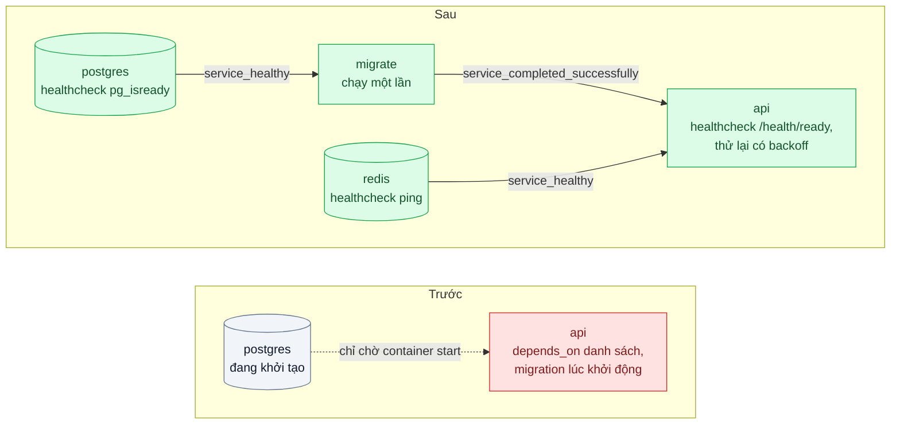
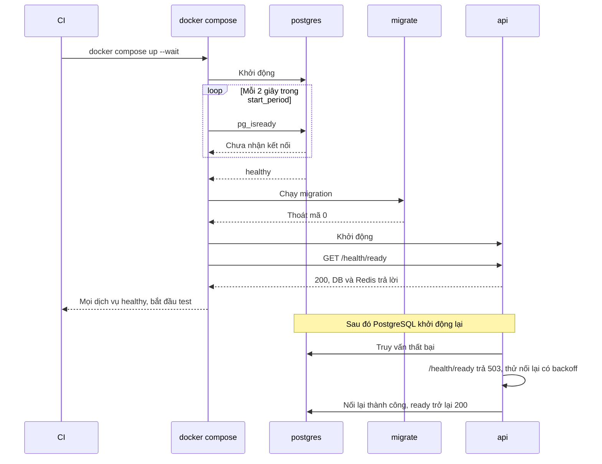

# HEALTHCHECK & Startup Ordering — App khởi động trước khi DB sẵn sàng, crash loop

| Scope | Mức độ | Trạng thái | Pattern gốc | Cập nhật |
|---|---|---|---|---|
| 17 · backend / docker | 🟡 Trung bình | 📋 Kế hoạch | Health Check & Startup Ordering — Docker docs "HEALTHCHECK"; Compose `depends_on` với `condition: service_healthy`; Azure "Health Endpoint Monitoring" | 2026-10-06 |

> **Một câu tóm tắt:** Cho mỗi dịch vụ một health check thật (database trả lời được truy vấn, ứng dụng nối được database), để Compose chỉ khởi động ứng dụng khi database đã *sẵn sàng* chứ không chỉ *đã chạy*, chạy migration xong trước, và ứng dụng tự thử kết nối lại có backoff khi phụ thuộc chưa sẵn sàng.

## 1. Bài toán thực tế (What)

**Bối cảnh** *(doanh nghiệp giả định, số liệu minh họa)*
Công ty phần mềm CRM có 15 lập trình viên và một pipeline CI chạy test tích hợp bằng Docker Compose cho mỗi pull request, khoảng 120 lần mỗi ngày. File Compose có `api`, `postgres`, `redis`; `api` khai báo `depends_on: [postgres]` và chạy migration ngay khi khởi động.

**Triệu chứng người kinh doanh nhìn thấy**
- Khoảng 1/5 lần chạy CI thất bại ngẫu nhiên ở bước khởi động; lập trình viên bấm chạy lại theo thói quen, có lỗi thật cũng bị bỏ qua vì tưởng là "CI chập chờn".
- Mỗi sáng nhiều người mất vài phút với `docker compose up` báo lỗi kết nối, phải chạy lại lần hai.
- Một lần lỗi migration thật bị lẫn trong các lần crash khởi động, lọt lên staging.

**Nguyên nhân kỹ thuật**
`depends_on` dạng danh sách chỉ đảm bảo container `postgres` đã *được khởi động*, không đảm bảo PostgreSQL đã khởi tạo xong và nhận kết nối. Lần chạy đầu với volume trống, PostgreSQL còn chạy script khởi tạo vài giây; `api` nối vào, nhận lỗi, thoát; chính sách khởi động lại tạo vòng crash. Không có health check nên không ai (Compose, CI, con người) biết khi nào hệ thống thật sự sẵn sàng. Migration gắn vào khởi động ứng dụng khiến nhiều bản sao cùng chạy migration một lúc.

**Ràng buộc**
- Một lệnh `docker compose up` phải luôn đưa hệ thống tới trạng thái sẵn sàng, không cần chạy lại.
- CI cần một tín hiệu rõ ràng "đã sẵn sàng" để bắt đầu test, không dùng `sleep` cố định.
- Ứng dụng phải chịu được việc database khởi động lại giữa chừng, vì ở production không có `depends_on`.

## 2. Vì sao dùng pattern này (Why)

**Nguyên nhân gốc mà pattern nhắm vào:** "container đang chạy" bị coi là "dịch vụ sẵn sàng", và ứng dụng giả định phụ thuộc luôn có mặt lúc khởi động.

**Pattern giải quyết thế nào:** Docker cho phép khai báo `HEALTHCHECK` (trong Dockerfile hoặc Compose): một lệnh chạy định kỳ với `interval`, `timeout`, `retries`, `start_period`, và trạng thái container chuyển `starting`, `healthy`, `unhealthy`. Compose dùng trạng thái này qua `depends_on` dạng đầy đủ: `condition: service_healthy` chờ phụ thuộc khỏe, `condition: service_completed_successfully` chờ một dịch vụ chạy một lần (migration) kết thúc thành công. Azure mô tả Health Endpoint Monitoring: ứng dụng phơi endpoint kiểm tra cả các phụ thuộc quan trọng để bên ngoài biết nó có phục vụ được không. Cuối cùng, ứng dụng vẫn tự thử kết nối lại có backoff, vì thứ tự khởi động chỉ giúp lúc *bắt đầu*, không giúp khi database khởi động lại sau đó.

**Lựa chọn khác đã cân nhắc**

| Lựa chọn | Giải quyết được gì | Vì sao không chọn (ở bài này) |
|---|---|---|
| Giữ nguyên + tối ưu nhỏ (`sleep 10` trước khi chạy test, `restart: always`) | Giảm số lần lỗi | Chậm thêm khi không cần, vẫn lỗi khi máy CI chậm; crash loop vẫn còn, che lỗi thật |
| Script chờ cổng mở (kiểu wait-for-it) | Chờ được cổng TCP | Cổng mở trước khi PostgreSQL nhận truy vấn được; thêm script vào mọi image |
| Chỉ thử lại trong ứng dụng | Ứng dụng tự vượt qua giai đoạn chờ | Cần có, nhưng CI vẫn không biết khi nào sẵn sàng; migration vẫn chạy chồng |
| Health check + `depends_on` có điều kiện + dịch vụ migration riêng + thử lại có backoff (chọn) | Thứ tự đúng, tín hiệu sẵn sàng rõ, chịu được khởi động lại | Thêm cấu hình và endpoint; cần chọn tham số health check hợp lý |

## 3. Thiết kế hệ thống (How)

### 3.1 Kiến trúc trước và sau



### 3.2 Luồng chính



### 3.3 Thành phần và trách nhiệm

| Thành phần | Trách nhiệm | Quyết định thiết kế đáng chú ý |
|---|---|---|
| Health check `postgres` | `pg_isready` với đúng user và database | `start_period` đủ cho lần khởi tạo volume trống; `interval` ngắn để không chờ thừa |
| Health check `redis` | `redis-cli ping` | Đơn giản, rẻ |
| Dịch vụ `migrate` | Chạy migration một lần rồi thoát | Tách khỏi `api` để nhiều bản sao `api` không chạy migration chồng nhau |
| `/health/live` | Tiến trình còn sống | Không kiểm tra phụ thuộc, tránh khởi động lại dây chuyền khi DB chậm |
| `/health/ready` | Kiểm tra DB và Redis trả lời trong thời gian ngắn | Trả 503 khi phụ thuộc lỗi hoặc đang tắt (bài 03) |
| `HEALTHCHECK` trong image | Gọi `/health/ready` bằng script `node` | Image distroless không có `curl` (bài 04) |
| Thử lại có backoff | Nối lại DB khi khởi động và khi mất kết nối | Có giới hạn số lần và jitter, log mỗi lần thử |

### 3.4 Điểm dễ sai khi triển khai
- **Tin rằng Docker tự khởi động lại container unhealthy.** Docker Engine độc lập chỉ ghi nhận trạng thái; việc thay container là của bộ điều phối (Swarm, Kubernetes). Đừng dựa vào health check để tự chữa.
- **Health check quá nặng** (truy vấn lớn, gọi dịch vụ ngoài) chạy mỗi vài giây tạo tải và báo động giả. Kiểm tra rẻ, có timeout ngắn.
- **Liveness kiểm tra database.** DB chậm làm mọi bản sao ứng dụng bị coi là chết và khởi động lại cùng lúc; chỉ readiness mới kiểm tra phụ thuộc.
- **Quên `start_period`.** Lần khởi tạo đầu chậm hơn bình thường; các lần thất bại trong giai đoạn này không nên tính vào `retries`.
- **Bỏ thử lại trong ứng dụng vì "đã có depends_on".** Ở production không có `depends_on`, và database có thể khởi động lại bất cứ lúc nào.

## 4. Tech stack và tác động (Impact techstack)

| Lớp | Công nghệ chọn | Vì sao chọn | Thay thế tương đương |
|---|---|---|---|
| Điều phối local và CI | Docker Compose: `healthcheck`, `depends_on` có `condition`, `up --wait` | Thứ tự khởi động và tín hiệu sẵn sàng khai báo ngay trong file | Kubernetes probes (scope 16) |
| Database | PostgreSQL 16, `pg_isready` | Công cụ chính thức kiểm tra trạng thái nhận kết nối | Truy vấn `SELECT 1` |
| Cache | Redis 7, `redis-cli ping` | Có sẵn trong image | — |
| Ứng dụng | NestJS 10 với endpoint health tự viết | Kiểm soát rõ live và ready | `@nestjs/terminus` (cần xác minh) |
| Migration | Kysely Migrator trong dịch vụ `migrate` dùng chung image ứng dụng | Một image, hai lệnh khởi động | node-pg-migrate |
| Đo | Script chạy `compose up` 50 lần, `docker inspect` (`RestartCount`, `State.Health`) | Đếm lần thất bại và khởi động lại | Báo cáo của hệ thống CI |

**Thay đổi so với hệ thống hiện tại:** thêm health check cho mọi dịch vụ, tách dịch vụ migration, thêm hai endpoint health và cơ chế thử lại trong ứng dụng, CI dùng `--wait` thay cho `sleep`. Đội phải phân biệt rõ live và ready.

## 5. Kết quả đầu ra và cách đo (Output impact)

| Chỉ số | Trước (minh họa) | Mục tiêu khi thực hành | Cách đo |
|---|---|---|---|
| Lần khởi động thất bại trên 50 lần `compose up` từ volume trống | 10/50 | 0/50 | Script lặp `down -v` rồi `up --wait`, đếm mã thoát khác 0 |
| Số lần `api` khởi động lại trong một lần dựng | 2–4 | 0 | `docker inspect --format '{{.RestartCount}}'` |
| Thời gian tới khi mọi dịch vụ healthy | không xác định | ghi trung vị và p95 trên 50 lần | Đo thời gian lệnh `up --wait` |
| Migration chạy chồng khi có 3 bản sao `api` | có | 0 | Log migration, đếm số lần chạy mỗi lần dựng |
| Thời gian ứng dụng phục hồi sau khi PostgreSQL khởi động lại | phải khởi động lại ứng dụng | ≤ 15 giây, không can thiệp tay | Restart `postgres`, đo tới khi `/health/ready` trả 200 |

> Số "trước" là minh họa để hình dung bài toán. Số "mục tiêu" chỉ được coi là đạt khi có số đo thật
> ở mục 8 kèm môi trường đo.

**Tác động nghiệp vụ mong đợi:** CI đáng tin trở lại nên lỗi thật không bị bỏ qua, lập trình viên không mất thời gian mỗi sáng, và ứng dụng tự phục hồi khi database khởi động lại.

## 6. Đánh đổi và khi KHÔNG nên dùng

**Đánh đổi**
- Health check chạy định kỳ tốn một chút tài nguyên và cần chọn tham số cẩn thận.
- Thêm dịch vụ migration và hai endpoint phải bảo trì.
- `depends_on` có điều kiện chỉ có tác dụng trong Compose; môi trường khác cần cơ chế tương đương.

**Không nên dùng khi**
- Dịch vụ không có phụ thuộc lúc khởi động (worker đọc file tĩnh): health check đơn giản là đủ, không cần thứ tự.
- Kiểm tra sức khỏe cần gọi dịch vụ bên ngoài không kiểm soát được: đưa vào giám sát riêng (scope 23), không vào readiness.
- Production chạy trên Kubernetes: dùng probes của Kubernetes thay cho `HEALTHCHECK` của Docker, giữ nguyên ý tưởng live và ready.

**Liên quan**
- Đọc trước: `../05-compose-dev-prod-parity-tren-may-em-chay-duoc/` — file Compose mà bài này bổ sung health check.
- Cùng chủ đề: `../03-pid-1-signal-sigterm-container-khong-tat-sach/` — readiness trả 503 khi bắt đầu tắt.
- Đọc sau: `../../16-backend-k8s/01-probes-rolling-update-deploy-moi-nhan-traffic-khi-chua-san-sang/` — cùng ý tưởng với probes trên Kubernetes.
- Đọc sau: `../../07-backend-microservices/04-timeout-retry-backoff-jitter-retry-dong-loat-tao-bao-moi/` — thử lại có backoff và jitter.

## 7. Cơ sở tham khảo

- Docker docs, Dockerfile reference "HEALTHCHECK" — https://docs.docker.com/reference/dockerfile/#healthcheck — tham số `interval`, `timeout`, `start-period`, `retries`, các trạng thái health.
- Docker Compose docs, `depends_on` (dạng đầy đủ với `condition`) và `healthcheck` — https://docs.docker.com/compose/ — `service_healthy`, `service_completed_successfully`, `up --wait`.
- Microsoft Azure Architecture Center, "Health Endpoint Monitoring pattern" — https://learn.microsoft.com/azure/architecture/patterns/health-endpoint-monitoring — endpoint kiểm tra phụ thuộc, cân nhắc về chi phí và bảo mật của health check.
- PostgreSQL docs, "pg_isready" — https://www.postgresql.org/docs/current/app-pg-isready.html — kiểm tra trạng thái nhận kết nối của server.

## 8. Kế hoạch thực hành

- [ ] Bước 1: dựng Compose hiện trạng (`api` với `depends_on` danh sách, migration lúc khởi động, 3 bản sao); init script PostgreSQL có độ trễ để tái hiện khởi tạo chậm.
- [ ] Bước 2: đo "trước": 50 lần `down -v` rồi `up`, đếm thất bại, số lần khởi động lại, số lần migration chạy chồng.
- [ ] Bước 3: thêm health check cho `postgres` và `redis`, dịch vụ `migrate`, `depends_on` có điều kiện, endpoint live và ready, `HEALTHCHECK` bằng script `node`, thử lại có backoff.
- [ ] Bước 4: đo "sau" cùng kịch bản và kịch bản khởi động lại PostgreSQL; ghi số thật và môi trường vào mục 5.
- [ ] Bước 5: viết test: (a) `/health/ready` trả 503 khi DB tắt và 200 khi DB trở lại; (b) `/health/live` vẫn 200 khi DB tắt; (c) dịch vụ `api` không khởi động khi `migrate` thất bại; (d) thử lại dừng sau số lần giới hạn với log rõ ràng.

**Cấu trúc code dự kiến**
```text
compose.yaml                         # [PATTERN] healthcheck, depends_on có condition
src/
  health/health.controller.ts        # /health/live, /health/ready
  db/connect-with-backoff.ts
  db/migrate.ts                      # lệnh của dịch vụ migrate
scripts/
  healthcheck.js                     # dùng trong HEALTHCHECK, không cần curl
  startup-reliability.sh             # 50 lần down -v, up --wait
test/
  readiness-reflects-db.test.ts
  api-waits-for-migration.test.ts
Dockerfile
```

**Cách chạy** *(điền khi bắt đầu code)*
```bash
docker compose up -d --wait
pnpm install && pnpm test
```
