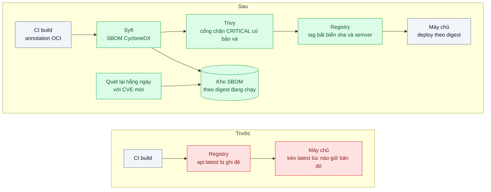
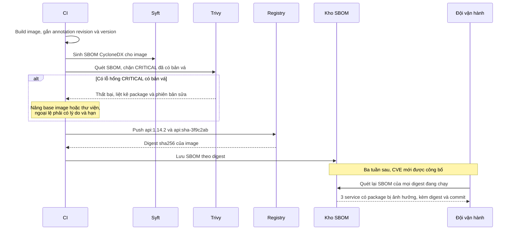

# Image Tagging, SBOM & Vulnerability Scan — Tag `latest` không biết đang chạy version nào, không biết có CVE không

| Scope | Mức độ | Trạng thái | Pattern gốc | Cập nhật |
|---|---|---|---|---|
| 17 · backend / docker | 🔴 Nâng cao | 📋 Kế hoạch | Immutable Image Tag + SBOM + Vulnerability Scan — Docker docs (tags, digests); OCI Image spec; Trivy; CycloneDX / SPDX | 2026-10-06 |

> **Một câu tóm tắt:** Gắn cho mỗi image một tag bất biến theo commit và phiên bản, deploy theo digest, đính kèm danh mục thành phần (SBOM) sinh lúc build, và quét lỗ hổng cả lúc build lẫn định kỳ trên image đang chạy, để trả lời được trong vài phút "production đang chạy gì" và "có bị ảnh hưởng bởi CVE này không".

## 1. Bài toán thực tế (What)

**Bối cảnh** *(doanh nghiệp giả định, số liệu minh họa)*
Ví điện tử có khoảng 20 service container hóa, chạy trên một cụm máy chủ, deploy nhiều lần mỗi ngày. CI build và push image với tag `latest` (và đôi khi `staging`), các máy chủ kéo `latest` khi deploy. Ngân hàng đối tác yêu cầu báo cáo định kỳ về quản lý lỗ hổng.

**Triệu chứng người kinh doanh nhìn thấy**
- Khi một lỗ hổng nghiêm trọng trong một thư viện phổ biến được công bố, đội kỹ thuật mất hai ngày để trả lời ngân hàng đối tác "service nào bị ảnh hưởng"; đối tác đe dọa tạm ngừng kết nối.
- Một sự cố production không tái hiện được vì không ai biết chính xác commit nào đang chạy; hai máy chủ chạy hai phiên bản khác nhau dưới cùng tag `latest`.
- Muốn rollback về bản hôm qua thì không còn image cũ: tag `latest` đã bị ghi đè.

**Nguyên nhân kỹ thuật**
Tag trong registry là con trỏ có thể di chuyển; `latest` trỏ tới image khác nhau theo thời gian, và máy chủ nào kéo lúc nào thì giữ bản đó. Không có liên kết từ image tới commit, không có danh sách thành phần (package hệ điều hành, package npm, phiên bản) đi kèm mỗi image, nên câu hỏi "có thư viện X phiên bản Y không" phải trả lời bằng cách mở từng image. Quét lỗ hổng chỉ làm thủ công, thỉnh thoảng, và không quét lại image cũ khi có CVE mới.

**Ràng buộc**
- Không đổi registry hiện tại; giải pháp chạy được với registry chuẩn OCI.
- Cổng chặn trong CI không được làm tắc phát hành vì lỗ hổng chưa có bản vá.
- Báo cáo cho đối tác phải dựa trên dữ liệu, không dựa trên trí nhớ.

## 2. Vì sao dùng pattern này (Why)

**Nguyên nhân gốc mà pattern nhắm vào:** image không có danh tính bất biến và không có danh mục thành phần, nên mọi câu hỏi về "đang chạy gì" đều phải điều tra thủ công.

**Pattern giải quyết thế nào:** Docker docs phân biệt *tag* (tên dễ đọc, có thể di chuyển) với *digest* (mã băm nội dung, bất biến): deploy theo digest đảm bảo mọi máy chạy đúng một nội dung. Mỗi image được gắn tag bất biến theo commit (`sha-3f9c2ab`) và phiên bản (`1.14.2`), registry chặn ghi đè tag. OCI Image spec định nghĩa các annotation chuẩn (`org.opencontainers.image.revision`, `.source`, `.version`, `.created`) để image tự mang thông tin nguồn gốc. SBOM theo định dạng CycloneDX hoặc SPDX, sinh bằng Syft lúc build, liệt kê mọi thành phần và phiên bản. Trivy quét lỗ hổng: trong CI làm cổng chặn lỗ hổng nghiêm trọng đã có bản vá; định kỳ quét lại SBOM của các digest đang chạy với cơ sở dữ liệu CVE mới nhất, vì lỗ hổng được công bố *sau* khi image đã build.

**Lựa chọn khác đã cân nhắc**

| Lựa chọn | Giải quyết được gì | Vì sao không chọn (ở bài này) |
|---|---|---|
| Giữ nguyên + tối ưu nhỏ (thêm tag ngày giờ bên cạnh `latest`) | Có tên khác nhau theo lần build | Tag vẫn ghi đè được; không liên kết với commit; không có danh mục thành phần |
| Chỉ quét lỗ hổng trong CI | Chặn image có lỗ hổng đã biết lúc build | Không phát hiện CVE công bố sau khi deploy; không trả lời được "service nào có thư viện X" |
| Dùng `npm ls` / lockfile làm danh mục | Có danh sách package npm | Thiếu package hệ điều hành của base image; không gắn với image cụ thể đang chạy |
| Nền tảng quản lý lỗ hổng thương mại | Đầy đủ, có giao diện | Chi phí và thời gian tích hợp; bài này dựng nền tảng tối thiểu bằng công cụ mở |
| Tag bất biến + deploy theo digest + annotation OCI + SBOM + quét CI và định kỳ (chọn) | Truy vết đầy đủ, trả lời CVE bằng truy vấn, rollback được | Thêm bước CI, lưu trữ SBOM, quy trình xử lý ngoại lệ lỗ hổng |

## 3. Thiết kế hệ thống (How)

### 3.1 Kiến trúc trước và sau



### 3.2 Luồng chính



### 3.3 Thành phần và trách nhiệm

| Thành phần | Trách nhiệm | Quyết định thiết kế đáng chú ý |
|---|---|---|
| Quy ước tag | `sha-<commit ngắn>` cho mọi build, `x.y.z` cho bản phát hành | Không dùng `latest` trong deploy; registry bật chặn ghi đè tag nếu hỗ trợ |
| Annotation OCI | Ghi revision, source, version, created vào image | Trả lời "commit nào" bằng `docker inspect` hoặc API registry |
| Deploy theo digest | Mọi máy chạy đúng một nội dung | File cấu hình deploy ghi digest, rollback là đổi về digest trước |
| SBOM | Danh mục thành phần của từng image | Sinh từ image cuối (không từ lockfile) để có cả package hệ điều hành |
| Cổng quét trong CI | Chặn lỗ hổng nghiêm trọng đã có bản vá | Bỏ qua lỗ hổng chưa có bản vá để không tắc phát hành; ngoại lệ có lý do và ngày hết hạn |
| Quét lại định kỳ | Phát hiện CVE mới trên image đang chạy | Quét SBOM đã lưu thay vì kéo lại image, nhanh và rẻ |

### 3.4 Điểm dễ sai khi triển khai
- **Tag bất biến nhưng deploy vẫn theo tag.** Nếu tag bị ghi đè (registry không chặn), máy kéo sau nhận nội dung khác; deploy theo digest mới chắc chắn.
- **SBOM sinh từ lockfile thay vì từ image.** Thiếu package hệ điều hành của base image, nơi thường có nhiều lỗ hổng nhất.
- **Cổng chặn mọi lỗ hổng.** Lỗ hổng chưa có bản vá chặn mọi phát hành, đội sẽ tắt cổng; chỉ chặn loại có thể hành động và quản lý ngoại lệ có hạn.
- **Chỉ quét lúc build.** Image không đổi nhưng danh sách CVE thì đổi mỗi ngày; phải quét lại định kỳ những gì đang chạy.
- **Xóa image cũ quá sớm** theo chính sách dọn registry, mất khả năng rollback; giữ ít nhất các digest của N bản phát hành gần nhất.

## 4. Tech stack và tác động (Impact techstack)

| Lớp | Công nghệ chọn | Vì sao chọn | Thay thế tương đương |
|---|---|---|---|
| Build | Docker BuildKit với `--label` / `--annotation` theo khóa OCI (cần xác minh cú pháp annotation) | Image tự mang thông tin nguồn gốc | Kaniko, Buildah |
| Registry local | `registry:2` (CNCF Distribution) | Chuẩn OCI, mô phỏng được digest và tag | Harbor (có chặn ghi đè tag), registry của nhà cung cấp cloud |
| SBOM | Syft, định dạng CycloneDX JSON | Đọc package hệ điều hành và npm từ image | BuildKit `--sbom=true` (attestation), định dạng SPDX |
| Quét | Trivy (quét image và quét SBOM) | Một công cụ cho cả cổng CI và quét lại định kỳ, cơ sở dữ liệu CVE cập nhật | Grype (cần xác minh) |
| Kho SBOM | Thư mục hoặc bảng PostgreSQL lưu SBOM theo digest | Đủ cho truy vấn "package X ở đâu" | Dependency-Track (cần xác minh) |

**Thay đổi so với hệ thống hiện tại:** quy ước tag mới, cấu hình deploy theo digest, thêm hai bước CI (SBOM, quét), job quét lại hằng ngày, kho SBOM, quy trình ngoại lệ lỗ hổng. Đội vận hành và bảo mật có chung một nguồn dữ liệu để trả lời đối tác.

## 5. Kết quả đầu ra và cách đo (Output impact)

| Chỉ số | Trước (minh họa) | Mục tiêu khi thực hành | Cách đo |
|---|---|---|---|
| Thời gian trả lời "production đang chạy commit nào" | vài giờ | dưới 1 phút | `docker inspect` đọc annotation revision của container đang chạy |
| Thời gian trả lời "service nào có package X phiên bản Y" | 2 ngày | dưới 5 phút cho 20 image | Script truy vấn kho SBOM, đo bằng `time` |
| Image đang chạy có SBOM | 0 % | 100 % | So danh sách digest đang chạy với kho SBOM |
| Image có lỗ hổng CRITICAL đã có bản vá lọt qua CI | không kiểm soát | 0 trong kịch bản dùng base image cũ cố ý | Build với base image cũ đã biết có lỗ hổng, kiểm tra CI chặn |
| Thời gian rollback về bản trước | không làm được | ≤ 2 phút | Đổi digest trong cấu hình deploy, đo tới khi container mới healthy |

> Số "trước" là minh họa để hình dung bài toán. Số "mục tiêu" chỉ được coi là đạt khi có số đo thật
> ở mục 8 kèm môi trường đo.

**Tác động nghiệp vụ mong đợi:** trả lời đối tác và kiểm toán về lỗ hổng trong vài phút bằng dữ liệu, rollback được khi phát hành lỗi, và không còn sự cố "không biết đang chạy bản nào".

## 6. Đánh đổi và khi KHÔNG nên dùng

**Đánh đổi**
- Thêm thời gian CI cho bước sinh SBOM và quét.
- Registry lưu nhiều image hơn vì không ghi đè; cần chính sách dọn có giữ lại bản rollback.
- Quy trình ngoại lệ lỗ hổng đòi hỏi người duyệt và theo dõi hạn.

**Không nên dùng khi**
- Image chỉ dùng nội bộ cho thử nghiệm ngắn hạn, không deploy: tag theo commit là đủ, SBOM và quét định kỳ là thừa.
- Chưa có quy trình xử lý kết quả quét: báo cáo hàng trăm lỗ hổng không ai xử lý chỉ tạo tiếng ồn; bắt đầu từ cổng CRITICAL có bản vá.
- Đã dùng nền tảng quản lý chuỗi cung ứng phần mềm đầy đủ: tích hợp vào đó thay vì dựng lại.

**Liên quan**
- Đọc trước: `../01-multi-stage-build-image-1-8gb-deploy-10-phut/` — image gọn thì ít thành phần phải theo dõi.
- Đọc trước: `../04-non-root-distroless-container-chay-root-co-shell/` — base image ít gói, ít lỗ hổng.
- Đọc sau: `../../16-backend-k8s/08-gitops-argocd-ai-deploy-gi-luc-nao-khong-ro/` — ghi digest vào Git để biết ai deploy gì.

## 7. Cơ sở tham khảo

- Docker docs, "docker image tag" và "Image digests" — https://docs.docker.com/ — tag là con trỏ có thể di chuyển, digest là định danh nội dung bất biến, kéo image theo digest.
- OCI Image Format Specification, "Annotations" — https://github.com/opencontainers/image-spec — các khóa annotation chuẩn `org.opencontainers.image.*`.
- Trivy docs — https://trivy.dev/ — quét image và SBOM, lọc theo mức độ, bỏ qua lỗ hổng chưa có bản vá, mã thoát cho cổng CI.
- Syft — https://github.com/anchore/syft — sinh SBOM từ image ở định dạng CycloneDX và SPDX.
- CycloneDX — https://cyclonedx.org/ và SPDX — https://spdx.dev/ — định dạng SBOM chuẩn để lưu trữ và trao đổi.

## 8. Kế hoạch thực hành

- [ ] Bước 1: Docker Compose chạy `registry:2`; ba service mẫu, một service cố ý dùng base image cũ; CI giả lập bằng script push `latest`.
- [ ] Bước 2: đo "trước": thử trả lời "commit nào đang chạy", "service nào có package X", thử rollback; ghi thời gian và kết quả.
- [ ] Bước 3: viết script CI mới: annotation OCI, tag `sha-` và semver, Syft sinh SBOM, Trivy cổng chặn, lưu SBOM theo digest; deploy theo digest; job quét lại SBOM hằng ngày.
- [ ] Bước 4: đo "sau" cùng câu hỏi và kịch bản rollback; ghi số thật và môi trường vào mục 5.
- [ ] Bước 5: viết test: (a) push lại cùng tag bất biến bị từ chối hoặc phát hiện; (b) image dùng base cũ có lỗ hổng CRITICAL có bản vá bị CI chặn; (c) truy vấn kho SBOM tìm đúng các service chứa package chỉ định; (d) annotation revision khớp commit đã build.

**Cấu trúc code dự kiến**
```text
scripts/
  build-and-tag.sh                    # [PATTERN] annotation OCI, tag sha và semver
  generate-sbom.sh                    # Syft, CycloneDX JSON
  scan-gate.sh                        # Trivy, chặn CRITICAL có bản vá
  deploy-by-digest.sh
  rescan-running-sboms.sh             # quét lại định kỳ
  find-package-in-sboms.ts            # truy vấn kho SBOM
services/api-a/  services/api-b/  services/api-legacy-base/
.trivyignore                          # ngoại lệ có lý do và hạn
test/
  scan-gate-blocks-critical.test.ts
  sbom-query-finds-package.test.ts
docker-compose.yml                    # registry local
```

**Cách chạy** *(điền khi bắt đầu code)*
```bash
docker compose up -d
pnpm install && pnpm test
```
