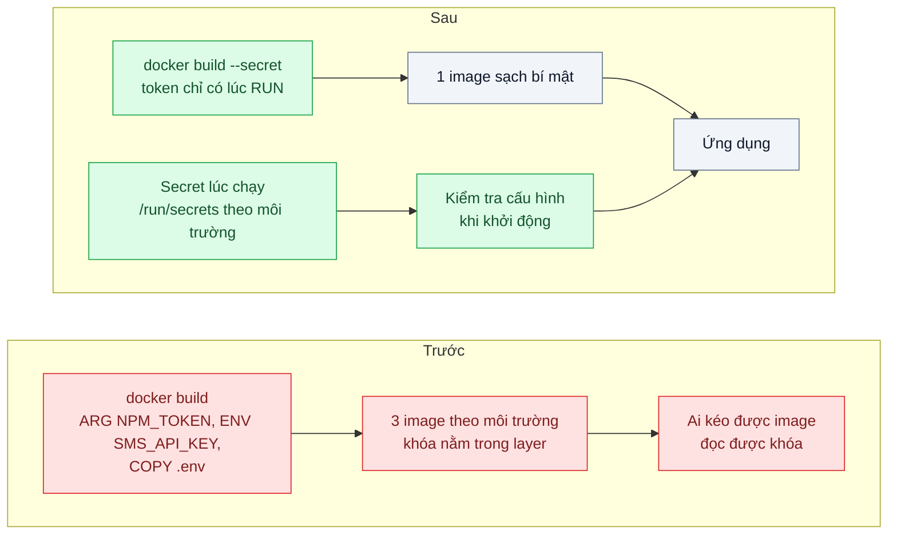
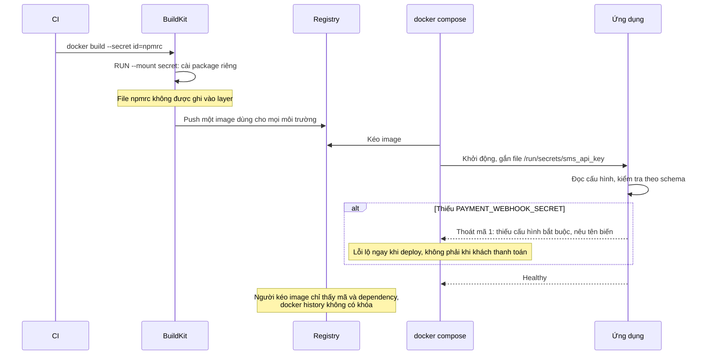

# Runtime Config & Secrets — API key nằm trong layer image, ai pull cũng đọc được

| Scope | Mức độ | Trạng thái | Pattern gốc | Cập nhật |
|---|---|---|---|---|
| 17 · backend / docker | 🟢 Cơ bản | 📋 Kế hoạch | Externalized Configuration — The Twelve-Factor App (2011), mục III Config; Docker build secrets; Compose secrets | 2026-10-06 |

> **Một câu tóm tắt:** Image không chứa cấu hình riêng của môi trường hay bí mật nào; bí mật lúc build đi qua secret mount không để lại dấu trong layer, bí mật lúc chạy được nạp vào container khi khởi động và kiểm tra ngay, để một image dùng cho mọi môi trường và ai kéo được image cũng không đọc được khóa.

## 1. Bài toán thực tế (What)

**Bối cảnh** *(doanh nghiệp giả định, số liệu minh họa)*
Công ty SaaS B2B tích hợp cổng SMS, cổng thanh toán và một registry npm riêng. Dockerfile dùng `ARG NPM_TOKEN` để cài package nội bộ, `ENV SMS_API_KEY=...` cho môi trường production, và `COPY . .` không có `.dockerignore` nên file `.env` của máy build cũng nằm trong image. Có ba image riêng cho dev, staging, production. Registry cho phép khoảng 40 người kéo image, gồm cả đối tác triển khai bên ngoài.

**Triệu chứng người kinh doanh nhìn thấy**
- Cổng SMS báo tài khoản gửi hàng chục nghìn tin lạ trong một đêm; hóa đơn tăng vọt, phải khóa khóa API giữa giờ cao điểm và khách không nhận được mã OTP.
- Điều tra cho thấy khóa có thể lấy từ image do một đối tác triển khai đã kéo về; không xác định được ai đã dùng.
- Đổi một khóa phải build lại và deploy lại cả ba image, mất gần một giờ trong lúc dịch vụ bị khóa.

**Nguyên nhân kỹ thuật**
Mọi thứ đi vào layer image đều nằm vĩnh viễn trong registry: `ENV` hiện ra trong cấu hình image, giá trị `ARG` có thể xuất hiện trong lịch sử build, file `.env` bị chép vào layer vẫn đọc được bằng cách giải nén image ngay cả khi một layer sau "xóa" nó. Cấu hình theo môi trường bị nướng vào image nên mỗi môi trường một image, thứ được test ở staging không phải thứ chạy ở production.

**Ràng buộc**
- Vẫn cài được package từ registry npm riêng lúc build.
- Đổi khóa không được yêu cầu build lại image.
- Thiếu cấu hình bắt buộc phải lộ ra ngay lúc khởi động, không phải lúc khách dùng tính năng.

## 2. Vì sao dùng pattern này (Why)

**Nguyên nhân gốc mà pattern nhắm vào:** cấu hình và bí mật bị coi là một phần của sản phẩm build, trong khi chúng thuộc về môi trường chạy.

**Pattern giải quyết thế nào:** The Twelve-Factor App, mục III, yêu cầu tách hẳn cấu hình (mọi thứ thay đổi giữa các môi trường, kể cả thông tin đăng nhập) khỏi mã và lưu trong môi trường; phép thử là mã nguồn có thể công khai ngay mà không lộ thông tin đăng nhập nào. Áp vào Docker: (1) bí mật cần lúc build (token npm) truyền bằng build secret của BuildKit, `RUN --mount=type=secret,...`, chỉ có mặt trong lúc chạy lệnh đó và không ghi vào layer; (2) `.dockerignore` loại mọi file `.env*`; (3) bí mật lúc chạy được nạp khi container khởi động, ví dụ Compose `secrets` gắn file vào `/run/secrets/<tên>`; (4) ứng dụng đọc và kiểm tra toàn bộ cấu hình theo schema khi khởi động, thiếu là thoát với thông báo rõ. Một image duy nhất đi qua mọi môi trường.

**Lựa chọn khác đã cân nhắc**

| Lựa chọn | Giải quyết được gì | Vì sao không chọn (ở bài này) |
|---|---|---|
| Giữ nguyên + tối ưu nhỏ (giới hạn người được kéo image) | Ít người tiếp cận hơn | Khóa vẫn nằm trong image và mọi bản sao lưu registry; đổi khóa vẫn phải build lại |
| Xóa file `.env` ở bước sau trong Dockerfile | File không còn trong hệ thống file cuối | Layer trước vẫn chứa file; giải nén image là đọc được |
| Mã hóa khóa trong image, giải mã lúc chạy | Khóa không ở dạng rõ | Lại cần một khóa giải mã đặt ở đâu đó; chỉ dời vấn đề |
| Biến môi trường thuần cho mọi bí mật | Đơn giản, đúng 12-factor | Dùng được, nhưng dễ lộ qua `docker inspect` và log của tiến trình con; file secret gắn vào có kiểm soát quyền tốt hơn |
| Build secret + `.dockerignore` + secret lúc chạy + kiểm tra cấu hình khi khởi động (chọn) | Image sạch bí mật, một image mọi môi trường, đổi khóa không cần build | Cần một nơi quản lý bí mật cho từng môi trường |

## 3. Thiết kế hệ thống (How)

### 3.1 Kiến trúc trước và sau



### 3.2 Luồng chính



### 3.3 Thành phần và trách nhiệm

| Thành phần | Trách nhiệm | Quyết định thiết kế đáng chú ý |
|---|---|---|
| `.dockerignore` | Loại `.env*`, khóa cá nhân khỏi build context | Lớp phòng thủ đầu tiên, rẻ nhất |
| Build secret | Truyền token npm cho đúng một lệnh `RUN` | Không dùng `ARG` hay `ENV` cho bất cứ thứ gì bí mật |
| Secret lúc chạy | Gắn bí mật vào container dưới dạng file khi khởi động | Ứng dụng hỗ trợ cả biến `X` và `X_FILE` để chạy được trên nhiều nền tảng |
| Module cấu hình | Đọc, ép kiểu, kiểm tra toàn bộ cấu hình theo schema khi khởi động | Thoát ngay nếu thiếu; không bao giờ log giá trị bí mật |
| Một image cho mọi môi trường | Môi trường chỉ khác nhau ở cấu hình nạp vào | Thứ đã test ở staging đúng là thứ chạy ở production |
| Quy trình đổi khóa | Thay file secret và khởi động lại container | Khóa đã lộ trong image cũ vẫn phải thu hồi ở phía nhà cung cấp |

### 3.4 Điểm dễ sai khi triển khai
- **Nghĩ rằng gỡ khóa khỏi image mới là xong.** Image cũ vẫn nằm trong registry và trên máy đã kéo; khóa đã lộ phải được thu hồi và cấp mới.
- **Dùng `ARG` cho token** vì "chỉ dùng lúc build": giá trị có thể hiện trong lịch sử và metadata build. Dùng build secret.
- **Log toàn bộ cấu hình khi khởi động** để gỡ lỗi, vô tình in khóa ra log tập trung. Chỉ log tên biến và trạng thái có hay không.
- **Biến cấu hình của frontend được nhúng lúc build** (các biến công khai của framework frontend) không thể đổi lúc chạy; chỉ đặt giá trị không bí mật ở đó.
- **Không kiểm tra cấu hình khi khởi động**: thiếu khóa thanh toán chỉ lộ khi khách đầu tiên thanh toán.

## 4. Tech stack và tác động (Impact techstack)

| Lớp | Công nghệ chọn | Vì sao chọn | Thay thế tương đương |
|---|---|---|---|
| Build | BuildKit build secrets (`--secret`, `RUN --mount=type=secret`) | Bí mật không vào layer hay lịch sử | SSH mount cho kho Git riêng |
| Kiểm tra Dockerfile | Docker build checks (cảnh báo bí mật trong `ARG`/`ENV`, cần xác minh tên luật) | Bắt lỗi ngay trong lệnh build | hadolint (cần xác minh) |
| Secret lúc chạy | Compose `secrets` gắn vào `/run/secrets` | Có sẵn trong Compose, mô phỏng cách nền tảng production gắn file | Kubernetes Secret, External Secrets Operator (scope 16) |
| Cấu hình ứng dụng | NestJS `ConfigModule` + schema zod | Kiểm tra kiểu và bắt buộc ngay khi khởi động | `envalid`, schema tự viết |
| Quét | Trivy chế độ quét secret, `docker history --no-trunc` | Phát hiện bí mật còn sót trong image | gitleaks cho mã nguồn (cần xác minh) |

**Thay đổi so với hệ thống hiện tại:** thêm `.dockerignore`, chuyển token npm sang build secret, gỡ mọi `ENV` bí mật, gộp ba image thành một, thêm module kiểm tra cấu hình, thu hồi và cấp lại các khóa đã lộ. Đội vận hành quản lý bí mật theo môi trường thay vì theo image.

## 5. Kết quả đầu ra và cách đo (Output impact)

| Chỉ số | Trước (minh họa) | Mục tiêu khi thực hành | Cách đo |
|---|---|---|---|
| Bí mật tìm thấy trong image | 3 (token npm, khóa SMS, file `.env`) | 0 | `trivy image --scanners secret`, `docker history --no-trunc`, giải nén `docker save` rồi tìm chuỗi mẫu |
| Số image cho một lần phát hành | 3 | 1 | Đếm digest đẩy lên registry mỗi lần phát hành |
| Thời gian đổi một khóa | gần 1 giờ (build và deploy lại) | ≤ 5 phút (thay secret, khởi động lại) | Đo từ lúc có khóa mới tới khi container healthy |
| Thiếu cấu hình bắt buộc bị phát hiện | khi khách dùng tính năng | lúc khởi động, thoát mã 1 kèm tên biến | Test khởi động container thiếu từng biến bắt buộc |
| Giá trị bí mật xuất hiện trong log | có thể | 0 | Tìm chuỗi bí mật mẫu trong log sau khi chạy bộ test |

> Số "trước" là minh họa để hình dung bài toán. Số "mục tiêu" chỉ được coi là đạt khi có số đo thật
> ở mục 8 kèm môi trường đo.

**Tác động nghiệp vụ mong đợi:** chia sẻ image cho đối tác triển khai mà không chia sẻ khóa, đổi khóa trong vài phút khi có sự cố thay vì khóa dịch vụ cả giờ, và chặn được hóa đơn bất thường do khóa bị lạm dụng.

## 6. Đánh đổi và khi KHÔNG nên dùng

**Đánh đổi**
- Cần một nơi quản lý bí mật cho từng môi trường và quy trình cấp quyền cho nó.
- Khởi động phụ thuộc vào việc bí mật có mặt; cấu hình sai làm container không lên (đây là điều mong muốn, nhưng cần quen).
- Lập trình viên phải tự tạo file secret local theo `.env.example`.

**Không nên dùng khi**
- Giá trị không bí mật và không đổi giữa môi trường (múi giờ mặc định, tên ứng dụng): để trong mã hoặc image là hợp lý.
- Cấu hình thay đổi rất thường xuyên trong lúc chạy (cờ tính năng bật tắt theo phút): dùng dịch vụ cấu hình động, không phải biến môi trường.
- Nền tảng production đã có cơ chế quản lý bí mật riêng: dùng cơ chế đó, giữ nguyên nguyên tắc image sạch bí mật.

**Liên quan**
- Đọc trước: `../02-layer-cache-dockerignore-moi-build-cai-lai-npm-5-phut/` — `.dockerignore` và build secret không phá cache.
- Cùng chủ đề: `../05-compose-dev-prod-parity-tren-may-em-chay-duoc/` — một định nghĩa môi trường, cấu hình khác nhau theo môi trường.
- Đọc sau: `../../16-backend-k8s/04-config-secret-external-secrets-password-db-nam-trong-yaml/` — quản lý bí mật trên Kubernetes.
- Cùng chủ đề: `../../19-backend-frontend-authenticate/10-api-key-service-to-service-client-credentials-mtls/` — vòng đời của khóa API.

## 7. Cơ sở tham khảo

- Adam Wiggins, *The Twelve-Factor App*, 2011, "III. Config" — https://12factor.net/config — tách cấu hình khỏi mã, lưu trong môi trường, phép thử "công khai mã nguồn được không".
- Docker docs, "Build secrets" — https://docs.docker.com/build/building/secrets/ — `--secret`, `RUN --mount=type=secret`, vì sao không dùng `ARG` và `ENV` cho bí mật.
- Docker Compose docs, "Secrets in Compose" — https://docs.docker.com/compose/how-tos/use-secrets/ (cần xác minh URL) — khai báo `secrets`, gắn file vào `/run/secrets`.
- Trivy docs, quét secret — https://trivy.dev/ — phát hiện thông tin đăng nhập còn sót trong image.
- NestJS docs, "Configuration" — https://docs.nestjs.com/techniques/configuration — nạp và kiểm tra cấu hình khi khởi động.

## 8. Kế hoạch thực hành

- [ ] Bước 1: dựng API NestJS cần token npm riêng (registry giả lập Verdaccio, cần xác minh) và khóa SMS giả; Dockerfile hiện trạng với `ARG`, `ENV`, `COPY .env`.
- [ ] Bước 2: đo "trước": tìm bí mật trong image bằng Trivy, `docker history`, giải nén `docker save`; đo thời gian đổi khóa.
- [ ] Bước 3: thêm `.dockerignore`, chuyển sang build secret, gỡ `ENV` bí mật, Compose `secrets`, module cấu hình kiểm tra bằng schema, hỗ trợ biến `_FILE`.
- [ ] Bước 4: đo "sau" cùng cách; ghi số thật và môi trường vào mục 5.
- [ ] Bước 5: viết test: (a) quét image không tìm thấy chuỗi bí mật mẫu; (b) thiếu biến bắt buộc thì thoát mã 1 kèm tên biến và không in giá trị nào; (c) cùng một image chạy được với cấu hình staging và production khác nhau; (d) đổi file secret rồi khởi động lại thì ứng dụng dùng khóa mới.

**Cấu trúc code dự kiến**
```text
src/
  config/config.schema.ts            # [PATTERN] schema, kiểm tra khi khởi động
  config/read-secret.ts              # đọc X hoặc X_FILE
  sms/sms.client.ts
Dockerfile                           # build secret, không ARG/ENV bí mật
Dockerfile.leaky                     # hiện trạng để so sánh
.dockerignore
.env.example                         # chỉ tên biến, không giá trị thật
secrets.example/                     # file mẫu cho Compose secrets
test/
  image-has-no-secrets.test.ts
  missing-config-fails-fast.test.ts
docker-compose.yml                   # secrets gắn vào /run/secrets
```

**Cách chạy** *(điền khi bắt đầu code)*
```bash
docker compose up -d
pnpm install && pnpm test
```
