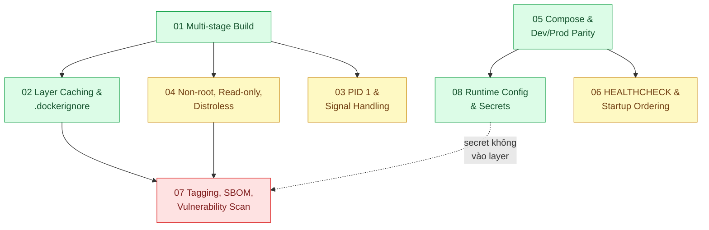

# 17 · Docker (`backend / docker`)

> **Phạm vi:** Đóng gói và chạy ứng dụng Node/TypeScript trong container: image nhỏ, build nhanh,
> nhận tín hiệu đúng, chạy an toàn, môi trường local giống production, khởi động theo thứ tự, gắn
> tag và quét lỗ hổng, cấu hình lúc chạy. Điều phối trên cluster thuộc scope 16.
>
> **Câu hỏi trung tâm:** Image nhỏ, build nhanh, chạy an toàn, tắt sạch, và "trên máy em chạy được"
> không còn là lý do?

## Bản đồ pattern trong scope

## Danh sách bài toán

| # | Bài toán (pattern — triệu chứng) | Mức | Pattern gốc / nguồn | Trạng thái |
|---|---|---|---|---|
| 01 | [Multi-stage Build — Image 1,8 GB chứa cả devDependencies, deploy mất 10 phút](./01-multi-stage-build-image-1-8gb-deploy-10-phut/) | 🟢 | Docker docs "Multi-stage builds", "Best practices for writing Dockerfiles" | ✅ |
| 02 | [Layer Caching & .dockerignore — Mỗi build cài lại toàn bộ npm 5 phút dù chỉ sửa một dòng code](./02-layer-cache-dockerignore-moi-build-cai-lai-npm-5-phut/) | 🟢 | Docker docs "Build cache", ".dockerignore file"; BuildKit cache mounts | 📋 |
| 03 | [PID 1 & Signal Handling — Container không nhận SIGTERM, bị kill cứng sau 10 giây, request rớt](./03-pid-1-signal-sigterm-container-khong-tat-sach/) | 🟡 | Docker docs (`--init`, tini); Yelp Engineering, "dumb-init: An init for Docker" (2016); Node.js docs (process signals) | 📋 |
| 04 | [Non-root, Read-only FS & Distroless — Container chạy root, có shell; một lỗ RCE là chiếm được node](./04-non-root-distroless-container-chay-root-co-shell/) | 🟡 | Docker docs "Security"; GoogleContainerTools distroless; OWASP "Docker Security Cheat Sheet" | 📋 |
| 05 | [Docker Compose & Dev/Prod Parity — "Trên máy em chạy được" vì Postgres local 14, production 16](./05-compose-dev-prod-parity-tren-may-em-chay-duoc/) | 🟢 | 12factor.net "Dev/prod parity"; Docker Compose docs | 📋 |
| 06 | [HEALTHCHECK & Startup Ordering — App khởi động trước khi DB sẵn sàng, crash loop](./06-healthcheck-depends-on-app-khoi-dong-truoc-db-san-sang/) | 🟡 | Docker docs "HEALTHCHECK"; Compose docs `depends_on` với `condition: service_healthy` | 📋 |
| 07 | [Image Tagging, SBOM & Vulnerability Scan — Tag `latest` không biết đang chạy version nào, không biết có CVE không](./07-image-tagging-sbom-scan-tag-latest-khong-biet-dang-chay-gi/) | 🔴 | Docker docs (tags, digests); OCI Image spec; Trivy docs; Syft / CycloneDX / SPDX | 📋 |
| 08 | [Runtime Config & Secrets — API key nằm trong layer image, ai pull cũng đọc được](./08-env-config-secrets-khong-nuong-vao-image/) | 🟢 | 12factor "Config"; Docker docs "Build secrets" (`--mount=type=secret`); Compose secrets | 📋 |

## Lộ trình đề xuất trong scope

1. **Multi-stage → Layer cache** — hai bài về build; đo kích thước và thời gian build trước/sau.
2. **Compose dev/prod parity → Runtime config → HEALTHCHECK** — môi trường local đúng và ổn định.
3. **PID 1 & signals** — bài hay bị bỏ qua; là nền của graceful shutdown ở scope 16.
4. **Non-root/distroless → Tagging/SBOM/scan** — bảo mật và truy vết.

## Kiến thức nền cần có trước

- Dockerfile cơ bản, lệnh `docker build/run`, Compose.
- Node.js: `process.on('SIGTERM')`, `server.close()`.
- pnpm trong monorepo (scope 09) nếu build từ monorepo.

## Liên kết với scope khác

- `16-backend-k8s` — probes/graceful shutdown dựa trên HEALTHCHECK và PID 1 ở đây.
- `09-backend-monorepo` — build image từ monorepo (prune workspace).
- `19-backend-frontend-authenticate` / `16` bài 04 — quản lý secret ở runtime.

## Nguồn tổng quan cho scope

- Docker docs, "Best practices for writing Dockerfiles" — https://docs.docker.com/build/building/best-practices/
- The Twelve-Factor App — https://12factor.net/
- OWASP Docker Security Cheat Sheet.
