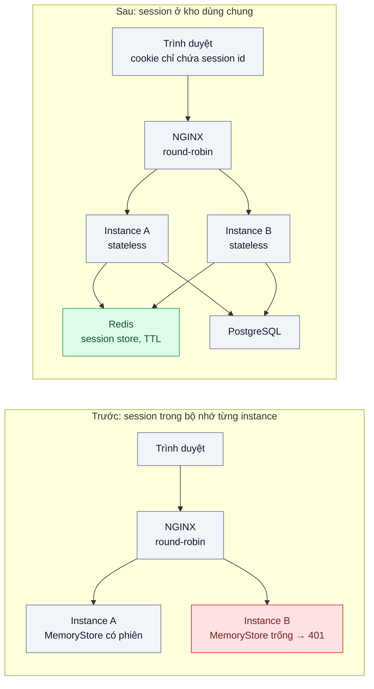
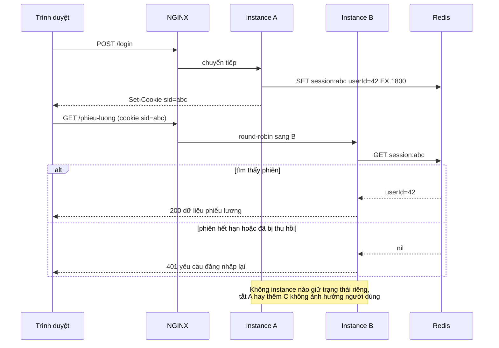

# Stateless Service & Externalized Session — Login ở server A, request sau vào server B bị văng ra

| Scope | Mức độ | Trạng thái | Pattern gốc | Cập nhật |
|---|---|---|---|---|
| 18 · backend / vertical / horizontal scale | 🟢 Cơ bản | 📋 Kế hoạch | Stateless Processes — Adam Wiggins, *The Twelve-Factor App* (2011), yếu tố VI; Server Session State — Fowler, *PoEAA* (2002) | 2026-10-06 |

> **Một câu tóm tắt:** Đưa trạng thái phiên đăng nhập ra khỏi bộ nhớ từng server vào một kho dùng chung (Redis) để bất kỳ instance nào cũng phục vụ được bất kỳ request nào — điều kiện tiên quyết để thêm máy.

## 1. Bài toán thực tế (What)

**Bối cảnh** *(doanh nghiệp giả định, số liệu minh họa)*
Một SaaS B2B quản lý nhân sự phục vụ 400 công ty khách hàng, backend NestJS chạy một instance duy nhất trên máy ảo 4 vCPU. Đầu tháng, 30.000 nhân viên cùng vào chấm công và xem phiếu lương, CPU chạm 95%, trang đăng nhập mất 8 giây. Đội kỹ thuật thêm instance thứ hai sau NGINX; ngay chiều hôm đó khách hàng gọi dồn dập.

**Triệu chứng người kinh doanh nhìn thấy**
- Nhân viên đăng nhập xong, bấm "Phiếu lương" thì bị đẩy về trang đăng nhập; thử vài lần mới vào được. Khoảng một phần ba request sau đăng nhập bị văng (minh họa).
- Bộ phận hỗ trợ nhận 120 ticket trong một buổi chiều, phải tắt instance thứ hai để "cho yên" — nghĩa là không thể mở rộng được nữa.
- Mỗi lần deploy, toàn bộ người đang dùng bị đăng xuất.

**Nguyên nhân kỹ thuật**
Phiên đăng nhập (session) nằm trong bộ nhớ của tiến trình Node (`MemoryStore`). Người dùng đăng nhập ở instance A thì chỉ A biết họ là ai; NGINX round-robin đưa request kế tiếp sang B, B không thấy session nên trả 401. Deploy khởi động lại tiến trình nên bộ nhớ mất, mọi người bị đăng xuất. Ứng dụng là *stateful*: kết quả của request phụ thuộc vào việc nó rơi vào máy nào.

**Ràng buộc**
- Không đổi cơ chế xác thực phía client (cookie session) trong vòng này vì ứng dụng di động cũ của khách vẫn đang dùng.
- Phải đăng xuất được ngay khi nhân viên nghỉ việc (thu hồi phiên tức thì).
- Thêm hoặc bớt instance không được làm người dùng đăng nhập lại.

## 2. Vì sao dùng pattern này (Why)

**Nguyên nhân gốc mà pattern nhắm vào:** trạng thái phiên bị gắn với một tiến trình cụ thể, nên các tiến trình không thay thế được nhau.

**Pattern giải quyết thế nào:** Yếu tố VI "Processes" của Twelve-Factor App yêu cầu tiến trình ứng dụng *stateless và share-nothing*: dữ liệu cần sống qua nhiều request phải nằm ở backing service (DB, Redis), không nằm trong bộ nhớ hay đĩa của tiến trình. Cụ thể hóa bằng pattern *Server Session State* của Fowler: server vẫn giữ session nhưng cất ở kho dùng chung; cookie chỉ mang ID phiên. Mọi instance tra Redis theo ID để biết người dùng là ai, nên request rơi vào máy nào cũng cho cùng kết quả; khởi động lại tiến trình không mất phiên; thu hồi phiên là xóa một key.

**Lựa chọn khác đã cân nhắc**

| Lựa chọn | Giải quyết được gì | Vì sao không chọn (ở bài này) |
|---|---|---|
| Giữ nguyên + tối ưu nhỏ (sticky session bằng `ip_hash` ở NGINX) | Request của một người luôn vào một instance, hết lỗi 401 | Tải lệch theo dải IP (văn phòng lớn sau một NAT dồn vào một máy); deploy hay instance chết vẫn mất phiên; chỉ che triệu chứng |
| Client Session State (toàn bộ phiên trong cookie/JWT, server không lưu gì) | Stateless triệt để, không cần Redis | Không thu hồi phiên tức thì được (vi phạm ràng buộc nghỉ việc); cookie bị giới hạn kích thước; phải đổi client di động cũ |
| Database Session State (bảng `sessions` trong PostgreSQL) | Dùng hạ tầng sẵn có, bền | Mỗi request thêm một truy vấn vào DB đang là điểm nóng; hết hạn phiên phải tự quét; Redis có TTL theo key và độ trễ thấp hơn |

## 3. Thiết kế hệ thống (How)

### 3.1 Kiến trúc trước và sau



### 3.2 Luồng chính



### 3.3 Thành phần và trách nhiệm

| Thành phần | Trách nhiệm | Quyết định thiết kế đáng chú ý |
|---|---|---|
| NGINX | Cân bằng tải round-robin giữa các instance, không sticky | Giữ round-robin thuần để chứng minh instance thay thế được nhau |
| Instance NestJS | Xác thực, đọc/ghi session qua store, không giữ gì trong bộ nhớ qua các request | Middleware session dùng `connect-redis`; bật `trust proxy` để cookie `secure` đúng sau NGINX |
| Redis | Lưu `session:<id>` với TTL trượt; là nguồn sự thật về phiên | TTL bằng thời gian không hoạt động tối đa; không dùng `maxmemory-policy allkeys-lru` để phiên không bị xóa ngẫu nhiên |
| Bảng `users` (PostgreSQL) | Danh tính và quyền; session chỉ lưu `userId` | Không chép hồ sơ vào session để quyền đổi là có hiệu lực ngay |

### 3.4 Điểm dễ sai khi triển khai
- Lưu cả hồ sơ và quyền vào session: đổi quyền xong người dùng vẫn giữ quyền cũ đến khi hết hạn. Chỉ lưu định danh, tra quyền khi cần.
- Quên `secure`, `httpOnly`, `sameSite` cho cookie và quên `trust proxy` sau NGINX: cookie không được gửi lại hoặc đi qua HTTP.
- Trạng thái "ẩn" khác vẫn nằm trong tiến trình: bộ đếm rate limit, cache cục bộ, file upload tạm trên đĩa. Stateless phải rà soát tất cả, không chỉ session.
- Redis không bật persistence hoặc dùng eviction xóa key bất kỳ: đầy RAM thì người dùng "tự nhiên" bị đăng xuất.
- Không có kịch bản Redis chết: mọi request thành 401 cùng lúc. Cần timeout ngắn, cảnh báo, và quyết định rõ (fail-closed) thay vì treo kết nối.

## 4. Tech stack và tác động (Impact techstack)

| Lớp | Công nghệ chọn | Vì sao chọn | Thay thế tương đương |
|---|---|---|---|
| Ngôn ngữ / runtime | TypeScript strict, Node 20 | Stack mặc định của repo | — |
| HTTP app | NestJS (Express adapter) + `express-session` + `connect-redis` | Đổi từ `MemoryStore` sang Redis bằng một dòng cấu hình nên thấy rõ "trước/sau" | Fastify + `@fastify/session` + `@fastify/redis` |
| Session store | Redis 7 | TTL theo key, độ trễ dưới mili-giây trong mạng nội bộ, `DEL` để thu hồi tức thì | PostgreSQL bảng `sessions` + job dọn; Memcached (không bền) |
| Load balancer local | NGINX (`upstream` round-robin, 2 instance) | Tái hiện đúng triệu chứng request nhảy máy; so sánh được với `ip_hash` | HAProxy, Traefik |
| DB nghiệp vụ | PostgreSQL 16 | Bảng `users` tối thiểu | — |
| Hạ tầng local / test / đo | Docker Compose, Vitest, k6 | Một lệnh dựng 2 instance + NGINX + Redis; k6 chạy kịch bản đăng nhập rồi gọi liên tiếp | — |

**Thay đổi so với hệ thống hiện tại:** thêm một Redis (theo dõi bộ nhớ, bật persistence, có bản sao); sửa cấu hình session và cookie sau proxy; đội vận hành học cách xem/xóa key phiên khi cần thu hồi.

## 5. Kết quả đầu ra và cách đo (Output impact)

| Chỉ số | Trước (minh họa) | Mục tiêu khi thực hành | Cách đo |
|---|---|---|---|
| Tỉ lệ request sau đăng nhập trả 401 khi chạy 2 instance round-robin | ~50% (một nửa request rơi vào instance không có phiên) | 0% | k6: mỗi VU đăng nhập rồi gọi 20 request có cookie; `check` status 200, đếm 401 |
| Người dùng bị đăng xuất khi tắt một instance | 100% người dùng của instance đó | 0 | `docker compose stop app-a` giữa lúc k6 chạy; đếm 401 |
| Độ trễ cộng thêm do tra session trong Redis (p95) | — | < 3 ms so với bản `MemoryStore` một instance | k6 `http_req_duration` p95 ở hai cấu hình; `redis-cli --latency` |
| Thu hồi phiên có hiệu lực | Chỉ sau khi hết hạn | Request kế tiếp sau `DEL` trả 401 | Test Vitest: đăng nhập, xóa key, gọi lại |

> Số "trước" là minh họa để hình dung bài toán. Số "mục tiêu" chỉ được coi là đạt khi có số đo thật
> ở mục 8 kèm môi trường đo.

**Tác động nghiệp vụ mong đợi:** thêm instance theo tải mà không sinh ticket hỗ trợ; deploy giữa giờ làm việc không làm nhân viên đăng nhập lại; thu hồi quyền của người nghỉ việc có hiệu lực ngay.

## 6. Đánh đổi và khi KHÔNG nên dùng

**Đánh đổi**
- Thêm một điểm phụ thuộc: Redis chết là cả hệ thống không xác thực được; cần bản sao và kế hoạch fail-over.
- Mỗi request có thêm một vòng mạng tới Redis (nhỏ nhưng không phải 0).
- Phải kiểm kê mọi trạng thái ẩn trong tiến trình; thường lộ ra cache cục bộ, job trong bộ nhớ, file tạm.

**Không nên dùng khi**
- Hệ thống cố ý chạy một instance và còn như vậy lâu (công cụ nội bộ ít người dùng): Redis chỉ thêm thứ để vận hành.
- Đã dùng token tự chứa (JWT ngắn hạn + refresh token có danh sách thu hồi) và client không gửi cookie: không còn gì để externalize ngoài danh sách thu hồi.
- Dữ liệu phiên lớn (hàng trăm KB mỗi người) và đọc ở mọi request: nên xem lại thiết kế, không phải đổi chỗ lưu.

**Liên quan**
- [../03-load-balancing-mot-server-qua-tai-cac-server-khac-ranh/](../03-load-balancing-mot-server-qua-tai-cac-server-khac-ranh/) — khi instance đã thay thế được nhau, chọn thuật toán phân phối.
- [../08-autoscaling-policy-scale-cham-hon-traffic/](../08-autoscaling-policy-scale-cham-hon-traffic/) — autoscale chỉ có nghĩa khi instance stateless.
- [../../16-backend-k8s/02-graceful-shutdown-prestop-deploy-lam-rot-request-dang-xu-ly/](../../16-backend-k8s/02-graceful-shutdown-prestop-deploy-lam-rot-request-dang-xu-ly/) — stateless là điều kiện để deploy không rớt request.
- [../../19-backend-frontend-authenticate/](../../19-backend-frontend-authenticate/) — chọn session cookie hay token là chuyện của scope xác thực.

## 7. Cơ sở tham khảo

- Adam Wiggins, *The Twelve-Factor App*, "VI. Processes", 2011 — https://12factor.net/processes — định nghĩa tiến trình stateless, share-nothing; nói rõ sticky session là vi phạm và session phải nằm ở datastore có hạn dùng như Redis/Memcached.
- Martin Fowler, *PoEAA* (2002), "Server Session State" — https://martinfowler.com/eaaCatalog/serverSessionState.html — pattern giữ session phía server; so sánh với "Client Session State" và "Database Session State" dùng cho bảng lựa chọn khác.
- Redis docs, lệnh `EXPIRE` / `SET ... EX` và chính sách eviction — https://redis.io/docs/ — cơ chế TTL cho phiên và cấu hình cần tránh.
- NGINX docs, "Using nginx as HTTP load balancer" — https://nginx.org/en/docs/http/load_balancing.html — round-robin và `ip_hash` (sticky) dùng để tái hiện triệu chứng và làm phương án so sánh.
- NestJS docs, "Session" — https://docs.nestjs.com/techniques/session — cách gắn `express-session` vào ứng dụng NestJS.

## 8. Kế hoạch thực hành

- [ ] Bước 1: `docker-compose.yml` dựng NGINX round-robin trước 2 instance NestJS dùng `MemoryStore`, Redis, PostgreSQL với bảng `users` seed sẵn.
- [ ] Bước 2: k6 kịch bản "đăng nhập rồi gọi 20 request" — ghi tỉ lệ 401 và p95 làm số "trước".
- [ ] Bước 3: đổi store sang `connect-redis`, cấu hình cookie + `trust proxy`, thêm endpoint thu hồi phiên (`DEL session:<id>`).
- [ ] Bước 4: chạy lại k6; giữa lúc chạy `docker compose stop app-a` rồi `start`; ghi số "sau" và môi trường đo vào mục 5.
- [ ] Bước 5: Vitest: "request sau đăng nhập đi vào instance khác vẫn 200", "xóa key phiên thì request kế tiếp 401", "khởi động lại instance không mất phiên".

**Cấu trúc code dự kiến**
```text
src/
  truoc/            # app dùng MemoryStore
  sau/              # app dùng connect-redis
  shared/           # module users, guard xác thực
nginx/nginx.conf    # upstream 2 instance, round-robin (biến thể ip_hash để so sánh)
bench/login-then-browse.k6.js
test/session.test.ts
docker-compose.yml  # nginx, app-a, app-b, redis, postgres
```

**Cách chạy** *(điền khi bắt đầu code)*
```bash
docker compose up -d
pnpm install && pnpm test
k6 run bench/login-then-browse.k6.js
```
