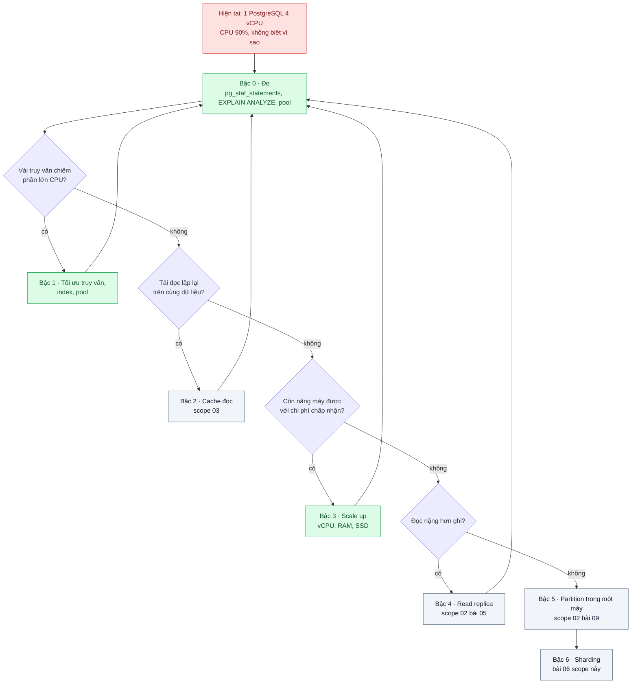
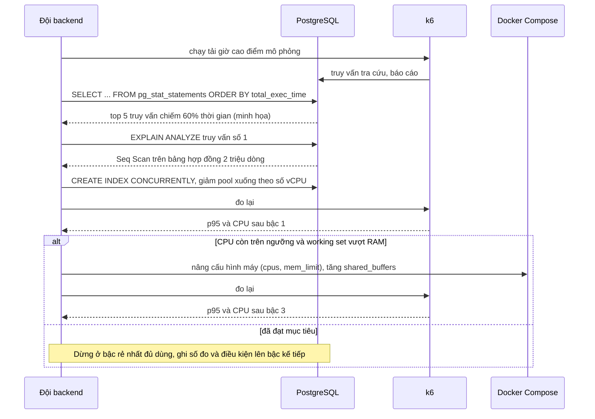

# Vertical first, then Horizontal — DB CPU 90%: nâng máy hay thêm máy? Thang scale theo thứ tự

| Scope | Mức độ | Trạng thái | Pattern gốc | Cập nhật |
|---|---|---|---|---|
| 18 · backend / vertical / horizontal scale | 🟢 Cơ bản | 📋 Kế hoạch | Scaling up vs scaling out — Kleppmann, *DDIA* (2017) ch.1 "Scalability"; AWS Well-Architected Framework, Performance Efficiency pillar | 2026-10-06 |

> **Một câu tóm tắt:** Khi PostgreSQL chạm 90% CPU, đi theo một thang có thứ tự — đo, tối ưu truy vấn, cache, nâng máy, tách đọc, rồi mới phân mảnh — vì mỗi bậc tăng độ phức tạp vận hành theo cách khác nhau và bậc rẻ thường còn rất nhiều dư địa.

## 1. Bài toán thực tế (What)

**Bối cảnh** *(doanh nghiệp giả định, số liệu minh họa)*
Một công ty bảo hiểm phi nhân thọ có hệ thống quản lý hợp đồng và bồi thường: 200 nhân viên nội bộ, cổng đại lý 3.000 người, một PostgreSQL 4 vCPU / 16 GB RAM chứa 300 GB dữ liệu, tăng 10 GB mỗi tháng. Từ 9h đến 11h, CPU của DB ở 90%, p95 API tra cứu hợp đồng 2,5 giây. Hai nhóm đưa hai đề xuất: nâng máy lên 16 vCPU (chi phí gấp 4) hoặc "chuyển sang microservices và sharding" (6 tháng).

**Triệu chứng người kinh doanh nhìn thấy**
- Đại lý chờ 10–15 giây mỗi lần tra cứu hợp đồng giờ cao điểm; một số bỏ sang nhập tay vào Excel.
- Báo cáo cuối ngày chạy 40 phút và làm mọi người khác chậm theo.
- Mỗi quý lại họp "nâng máy hay không", không ai có số liệu, sợ mua máy to rồi vẫn chậm.

**Nguyên nhân kỹ thuật**
Không ai biết 90% CPU là do cái gì. Khi đo thử, 5 truy vấn thiếu index có thể chiếm 60% thời gian thực thi (minh họa); pool 200 kết nối mở trên máy 4 vCPU làm DB tốn thời gian chuyển ngữ cảnh; báo cáo quét bảng lớn chạy chung máy với giao dịch. Nâng máy hay thêm máy khi chưa biết nguyên nhân là mua tài nguyên cho truy vấn xấu.

**Ràng buộc**
- Không dừng dịch vụ quá 15 phút và chỉ ngoài giờ hành chính.
- Ngân sách hạ tầng tăng không quá 2 lần trong năm.
- Đội 4 backend, không có DBA chuyên trách; không nhận thêm hệ phân tán nếu chưa cần.

## 2. Vì sao dùng pattern này (Why)

**Nguyên nhân gốc mà pattern nhắm vào:** quyết định scale không dựa trên số đo và không theo thứ tự chi phí / độ phức tạp.

**Pattern giải quyết thế nào:** DDIA ch.1 phân biệt *scaling up* (máy mạnh hơn, shared-memory) với *scaling out* (nhiều máy, shared-nothing) và lưu ý hệ phân tán mang theo độ phức tạp riêng — một DB nên ở trên một node cho đến khi chi phí nâng máy hoặc yêu cầu sẵn sàng buộc phải phân tán. Trụ cột Performance Efficiency của AWS Well-Architected yêu cầu chọn tài nguyên theo dữ liệu đo, đo lại liên tục và cân nhắc đánh đổi. Ghép lại thành một *thang scale*: (0) đo bằng `pg_stat_statements` và `EXPLAIN ANALYZE`; (1) tối ưu truy vấn, index, pool; (2) cache đọc; (3) scale up; (4) read replica; (5) partition trong một máy; (6) sharding. Lên bậc kế tiếp chỉ khi bậc hiện tại đã đo và không đủ.

**Lựa chọn khác đã cân nhắc**

| Lựa chọn | Giải quyết được gì | Vì sao không chọn (ở bài này) |
|---|---|---|
| Giữ nguyên + tối ưu nhỏ (index, pool, `pg_stat_statements`) | Thường giải quyết phần lớn CPU | Chính là bậc đầu của thang, luôn làm trước; nhưng một mình nó không đủ khi working set vượt RAM |
| Nâng máy ngay lên 16 vCPU | Nhanh, không đổi code | Nếu nguyên nhân là truy vấn xấu thì 90% CPU quay lại sau vài tháng với hóa đơn gấp 4; làm sau bước đo |
| Sharding / microservices ngay | Vượt giới hạn một máy về lâu dài | 300 GB còn xa giới hạn một máy; mất transaction và join xuyên shard; 6 tháng không tương xứng với vấn đề |
| Read replica ngay | Kéo báo cáo khỏi primary | Chỉ giúp tải đọc, có replication lag; phải đo xem tải là đọc hay ghi trước |

## 3. Thiết kế hệ thống (How)

### 3.1 Kiến trúc trước và sau



### 3.2 Luồng chính



### 3.3 Thành phần và trách nhiệm

| Thành phần | Trách nhiệm | Quyết định thiết kế đáng chú ý |
|---|---|---|
| `pg_stat_statements` | Xếp hạng truy vấn theo tổng thời gian thực thi và số lần gọi | Bật ở bậc 0 và giữ luôn; chi phí thu thập nhỏ so với giá trị |
| `EXPLAIN (ANALYZE, BUFFERS)` | Chỉ ra Seq Scan, sort tràn đĩa, ước lượng sai | Lưu kế hoạch trước/sau vào repo để so sánh |
| Pool kết nối (ứng dụng hoặc PgBouncer) | Giữ số kết nối hoạt động tương xứng với số vCPU | Pool quá lớn làm DB chậm hơn, không nhanh hơn |
| Docker Compose với `cpus` / `mem_limit` | Mô phỏng các cỡ máy 2 / 4 / 8 vCPU trên cùng dữ liệu | Cho phép vẽ đường cong "thêm vCPU được bao nhiêu TPS" trước khi mua máy thật |
| k6 + `docker stats` | Tạo tải lặp lại được và ghi CPU, p95 cho từng bậc | Cùng kịch bản, cùng dữ liệu cho mọi bậc để so sánh công bằng |

### 3.4 Điểm dễ sai khi triển khai
- Nâng máy trước khi sửa truy vấn: CPU hạ vài tháng rồi quay lại, mất luôn cơ hội biết nguyên nhân.
- So sánh các cỡ máy khi cache lạnh ở lần chạy đầu: luôn warm-up và chạy đủ lâu để đạt trạng thái ổn định.
- Thêm RAM mà không điều chỉnh `shared_buffers`, `effective_cache_size`, `work_mem`: máy to nhưng PostgreSQL vẫn chạy cấu hình máy nhỏ.
- Tăng `max_connections` theo số người dùng: hàng trăm kết nối hoạt động trên vài vCPU làm thông lượng giảm (xem PostgreSQL wiki về số kết nối).
- Quên rằng scale up cần thời gian dừng để đổi máy và không tăng tính sẵn sàng; phải có bản sao để fail-over dù vẫn ở một node.
- Nhìn CPU trung bình theo giờ: đỉnh 10 phút ở 100% bị san phẳng thành 60%, đọc sai nhu cầu.

## 4. Tech stack và tác động (Impact techstack)

| Lớp | Công nghệ chọn | Vì sao chọn | Thay thế tương đương |
|---|---|---|---|
| DB | PostgreSQL 16 + `pg_stat_statements` | Công cụ đo có sẵn trong DB; `EXPLAIN` chi tiết | MySQL với `performance_schema` |
| Ứng dụng tạo tải thật | NestJS API tra cứu hợp đồng (TypeScript strict, Node 20) | Mô phỏng pool kết nối và truy vấn như sản phẩm | Fastify thuần |
| Mô phỏng cỡ máy | Docker Compose `deploy.resources.limits.cpus`, `mem_limit` | Đổi cỡ máy bằng một dòng cấu hình, lặp lại được | Máy ảo cloud nhiều cỡ (tốn tiền, chậm lặp lại) |
| Tạo tải và đo | k6 (open model), `pgbench` cho tải thuần DB, `docker stats` | k6 đo p95 phía API; `pgbench` cho đường cong TPS theo vCPU | wrk, JMeter |
| Quan sát (tùy chọn) | Prometheus + `postgres_exporter` + Grafana | Nhìn CPU, kết nối, cache hit theo thời gian thay vì chụp màn hình | Chỉ dùng `docker stats` và `pg_stat_*` |
| Test | Vitest | Kiểm tra kế hoạch truy vấn không còn Seq Scan | Jest |

**Thay đổi so với hệ thống hiện tại:** bật `pg_stat_statements` trên production, thêm quy trình "đo trước khi mua máy" với mẫu báo cáo cố định; sửa pool và index; nếu lên bậc 3 thì lên lịch dừng dịch vụ để đổi máy và điều chỉnh cấu hình bộ nhớ của PostgreSQL.

## 5. Kết quả đầu ra và cách đo (Output impact)

| Chỉ số | Trước (minh họa) | Mục tiêu khi thực hành | Cách đo |
|---|---|---|---|
| CPU của DB ở tải giờ cao điểm mô phỏng | 90% | < 60% sau bậc 1; ghi riêng số của từng bậc | `docker stats` lấy mẫu mỗi giây trong 5 phút ổn định |
| p95 API tra cứu hợp đồng | 2,5 giây | < 300 ms | k6 `constant-arrival-rate`, `http_req_duration` p95 |
| Phần thời gian thực thi của 5 truy vấn đầu | 60% tổng | < 20% tổng | `pg_stat_statements`: `total_exec_time` top 5 chia tổng |
| TPS theo cỡ máy 2 / 4 / 8 vCPU trên cùng dữ liệu | Chưa biết | Vẽ được đường cong; ghi điểm gãy | `pgbench -c -j -T 300` với script truy vấn của bài, 3 lần mỗi cỡ |
| Chi phí hạ tầng cho 1.000 request/giây (ước lượng) | Chưa tính | Có bảng so sánh bậc 1 / bậc 3 / bậc 4 | Nhân giá máy (minh họa) với số máy cần từ số đo |

> Số "trước" là minh họa để hình dung bài toán. Số "mục tiêu" chỉ được coi là đạt khi có số đo thật
> ở mục 8 kèm môi trường đo.

**Tác động nghiệp vụ mong đợi:** cuộc họp "nâng máy hay không" có bảng số thay cho cảm tính; ngân sách tăng theo nhu cầu đo được; đại lý tra cứu dưới một giây giờ cao điểm mà không phải chuyển kiến trúc.

## 6. Đánh đổi và khi KHÔNG nên dùng

**Đánh đổi**
- Scale up có trần: đến cỡ máy lớn nhất thì phải sang bậc phân tán với toàn bộ độ phức tạp đã trì hoãn.
- Một máy to vẫn là một điểm hỏng; thang này giải quyết hiệu năng, không giải quyết tính sẵn sàng.
- Đổi cỡ máy thường cần dừng dịch vụ vài phút; chi phí máy không tăng tuyến tính theo vCPU.
- Kỷ luật "đo trước" tốn thời gian hơn bấm nút nâng máy.

**Không nên dùng khi**
- Đã ở cỡ máy lớn nhất mà nhà cung cấp có và CPU vẫn cao sau khi tối ưu: đi thẳng bậc 4–6.
- Yêu cầu sẵn sàng nhiều vùng địa lý hoặc lượng ghi vượt một node: phân tán là yêu cầu, không phải lựa chọn.
- Dữ liệu tự nhiên tách theo khách hàng và cần cách ly (SaaS nhiều tổ chức): sharding theo tenant có thể hợp lý từ đầu (scope 02 bài 07).

**Liên quan**
- [../../02-backend-database/01-n-plus-1-trang-50-don-ban-151-cau-sql/](../../02-backend-database/01-n-plus-1-trang-50-don-ban-151-cau-sql/) — bậc 1: truy vấn và index.
- [../../02-backend-database/03-connection-pool-200-pod-dap-postgres/](../../02-backend-database/03-connection-pool-200-pod-dap-postgres/) — bậc 1: pool kết nối.
- [../../03-backend-cache/01-cache-aside-trang-san-pham-doc-10k-lan-phut/](../../03-backend-cache/01-cache-aside-trang-san-pham-doc-10k-lan-phut/) — bậc 2.
- [../../02-backend-database/05-read-replica-bao-cao-cuoi-thang-lam-cham-tao-don/](../../02-backend-database/05-read-replica-bao-cao-cuoi-thang-lam-cham-tao-don/) — bậc 4.
- [../06-sharding-consistent-hashing-mot-db-khong-chua-noi-du-lieu/](../06-sharding-consistent-hashing-mot-db-khong-chua-noi-du-lieu/) — bậc 6.
- [../07-capacity-planning-use-method-mua-may-bao-nhieu-cho-tet/](../07-capacity-planning-use-method-mua-may-bao-nhieu-cho-tet/) — biến số đo của bài này thành kế hoạch mua máy.

## 7. Cơ sở tham khảo

- Martin Kleppmann, *Designing Data-Intensive Applications*, O'Reilly, 2017, ch.1 "Scalability" — mô tả tải, đo hiệu năng bằng percentiles, scaling up vs scaling out và lý do giữ DB trên một node khi còn có thể; ch.5–6 là các bậc replica và partition.
- AWS Well-Architected Framework, Performance Efficiency pillar — https://docs.aws.amazon.com/wellarchitected/ — nguyên tắc chọn tài nguyên theo dữ liệu, đo liên tục, cân nhắc đánh đổi.
- PostgreSQL docs, "pg_stat_statements" — https://www.postgresql.org/docs/current/pgstatstatements.html — công cụ của bậc 0.
- PostgreSQL docs, "Using EXPLAIN" — https://www.postgresql.org/docs/current/using-explain.html — đọc kế hoạch truy vấn để tìm Seq Scan và ước lượng sai.
- PostgreSQL wiki, "Number Of Database Connections" — https://wiki.postgresql.org/wiki/Number_Of_Database_Connections — vì sao pool quá lớn làm DB chậm.
- Docker docs, "Resource constraints" — https://docs.docker.com/ — giới hạn `cpus` và bộ nhớ dùng để mô phỏng cỡ máy.

## 8. Kế hoạch thực hành

- [ ] Bước 1: Docker Compose dựng PostgreSQL `cpus: 2` với 2 triệu hợp đồng seed và ba truy vấn thiếu index; NestJS API tra cứu với pool 200.
- [ ] Bước 2: k6 tải giờ cao điểm 5 phút; ghi CPU, p95, top 5 `pg_stat_statements` làm số "trước".
- [ ] Bước 3: bậc 1 — tạo index, giảm pool; đo lại. Bậc 3 — chạy cùng tải với `cpus: 4` và `cpus: 8`; đo lại; vẽ đường cong TPS theo vCPU bằng `pgbench`.
- [ ] Bước 4: điền bảng mục 5 cho từng bậc kèm môi trường (máy, phiên bản, số lần chạy); ghi điều kiện lên bậc 4 trở đi.
- [ ] Bước 5: Vitest: "kế hoạch truy vấn tra cứu không còn Seq Scan sau bậc 1" (`EXPLAIN (FORMAT JSON)`), "số kết nối hoạt động không vượt ngưỡng cấu hình".

**Cấu trúc code dự kiến**
```text
src/
  api/                 # NestJS: tra cứu hợp đồng, báo cáo
  seed/                # sinh 2 triệu hợp đồng
sql/
  00-baseline.sql      # schema thiếu index
  01-tier-1.sql        # index, cấu hình pool
bench/
  peak-hour.k6.js
  pgbench-lookup.sql
test/plan.test.ts
docker-compose.yml     # postgres (cpus tham số hóa), api
```

**Cách chạy** *(điền khi bắt đầu code)*
```bash
DB_CPUS=2 docker compose up -d
pnpm install && pnpm test
k6 run bench/peak-hour.k6.js
```
