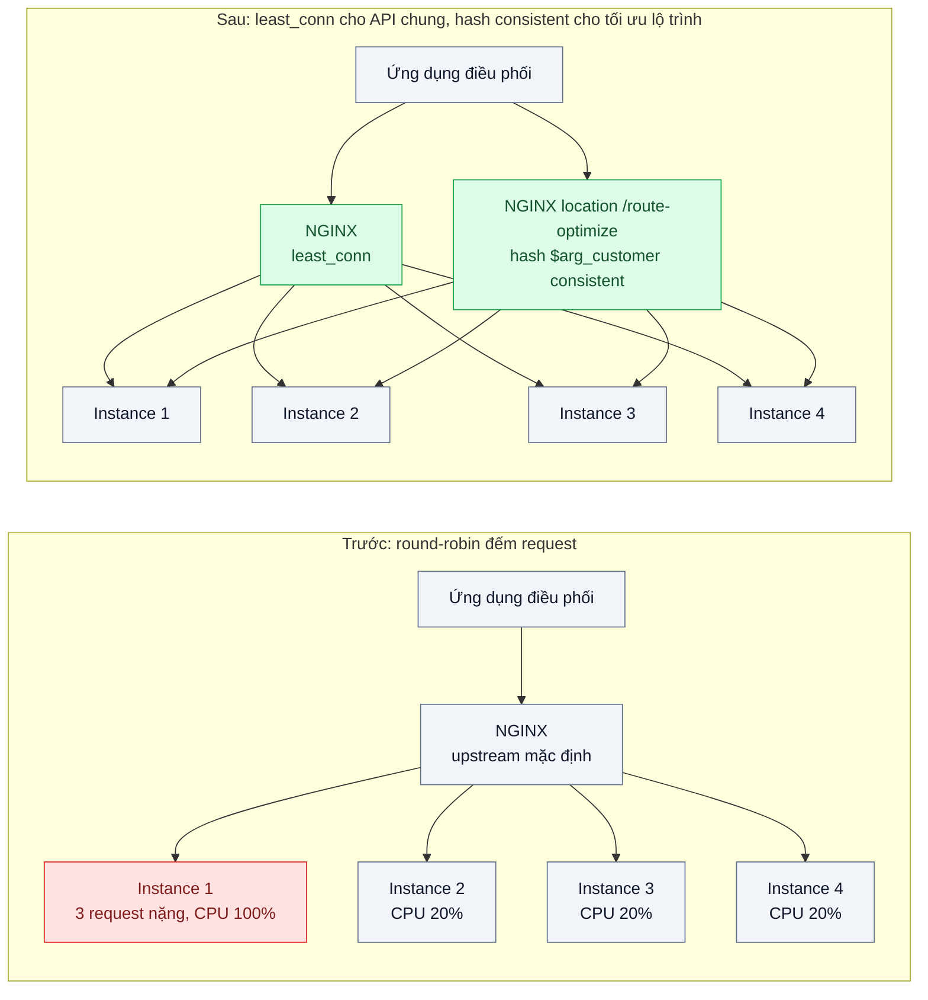
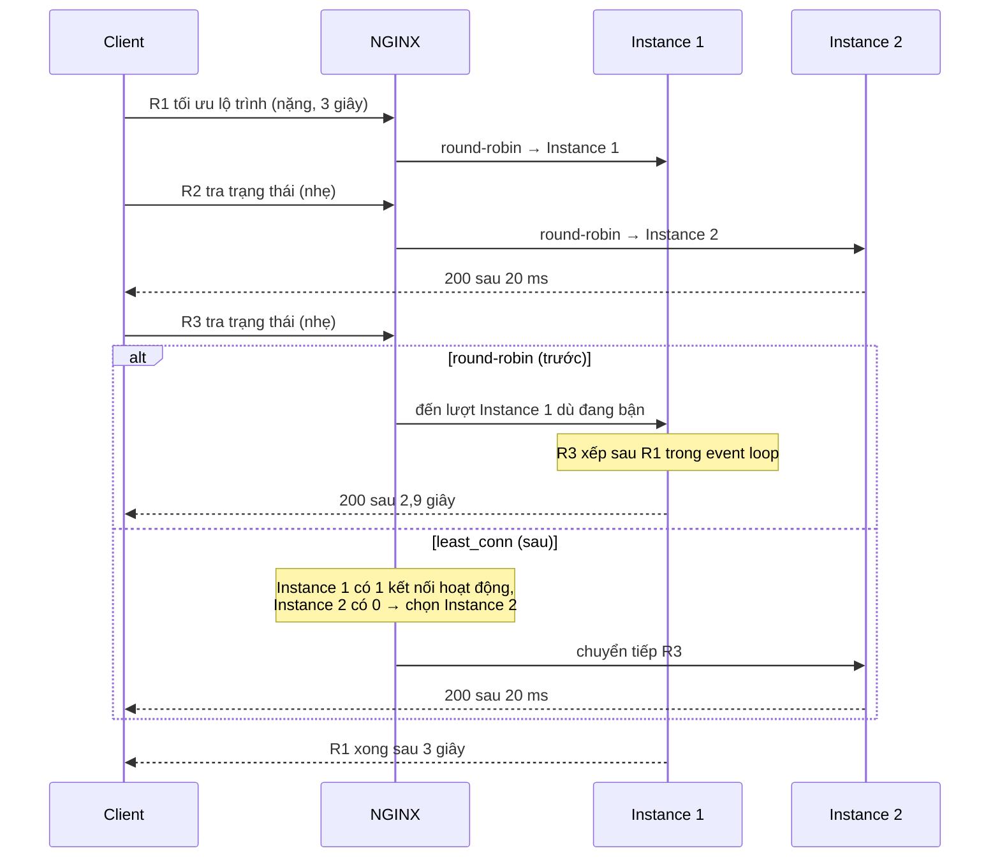

# Load Balancing Algorithms — Một server quá tải trong khi 3 server khác rảnh vì round-robin với request không đều

| Scope | Mức độ | Trạng thái | Pattern gốc | Cập nhật |
|---|---|---|---|---|
| 18 · backend / vertical / horizontal scale | 🟡 Trung bình | 📋 Kế hoạch | Load balancing algorithms — NGINX docs "Using nginx as HTTP load balancer" (round-robin, least_conn, hash); Consistent Hashing — Karger et al., STOC 1997 | 2026-10-06 |

> **Một câu tóm tắt:** Chọn thuật toán phân phối theo đặc tính request — `least_conn` cho request có chi phí không đều, `hash ... consistent` khi cần "cùng khách về cùng máy" — thay vì round-robin mặc định vốn chia đều *số request* nhưng không chia đều *công việc*.

## 1. Bài toán thực tế (What)

**Bối cảnh** *(doanh nghiệp giả định, số liệu minh họa)*
Một công ty logistics có API cho ứng dụng điều phối: 90% request là "tra trạng thái đơn" mất 20 ms; 10% là "tối ưu lộ trình 150 điểm giao" tính toán nặng 2–4 giây. Bốn instance Node chạy sau NGINX với cấu hình `upstream` mặc định (round-robin). Mỗi sáng đầu ca, 300 điều phối viên cùng bấm tối ưu lộ trình.

**Triệu chứng người kinh doanh nhìn thấy**
- Màn hình điều phối "treo" ngẫu nhiên vài giây dù chỉ xem trạng thái đơn; p99 của thao tác nhẹ lên 3 giây trong khi trung bình 60 ms (minh họa).
- Một instance CPU 100% khi ba instance còn lại 20%; thêm instance thứ năm, than phiền không bớt.
- Chi phí máy tăng mà trải nghiệm không đổi; đội kỹ thuật không giải thích được vì "tải đã chia đều".

**Nguyên nhân kỹ thuật**
Round-robin chia đều số request, không biết request nào nặng. Request nặng đến theo cụm đầu ca nên xác suất hai, ba request nặng rơi vào cùng một instance cao. Node xử lý trên một event loop: khi một request nặng chiếm CPU, mọi request nhẹ đã được NGINX gửi tới cùng instance phải xếp hàng sau nó. Thêm instance chỉ hạ xác suất va chạm, không loại bỏ cơ chế gây ra nó.

**Ràng buộc**
- Không đổi API và không yêu cầu client gửi thêm thông tin.
- Không cần sticky session (ứng dụng đã stateless — bài 01).
- Một số request tối ưu lộ trình lặp lại cùng tham số trong ngày, instance có cache cục bộ cho kết quả này.

## 2. Vì sao dùng pattern này (Why)

**Nguyên nhân gốc mà pattern nhắm vào:** thuật toán phân phối không có thông tin về tải thực đang nằm trên từng instance.

**Pattern giải quyết thế nào:** NGINX cung cấp nhiều phương pháp cân bằng tải: round-robin (mặc định, có trọng số), `least_conn` (gửi tới instance có ít kết nối đang hoạt động nhất — kết nối đang mở là tín hiệu "đang bận" sẵn có mà không cần instance báo cáo gì), `ip_hash` (sticky theo IP client), `hash <key> [consistent]` (định tuyến theo khóa, với `consistent` dùng hashing nhất quán kiểu ketama), `random [two]` (chọn ngẫu nhiên hai rồi lấy ít kết nối hơn). Với request chi phí không đều, `least_conn` tự tránh instance đang kẹt request nặng. Khi cần tận dụng cache cục bộ, `hash $arg_customer consistent` đưa cùng khách về cùng instance; tính chất của Karger et al. là thêm hay bớt một instance chỉ làm khoảng 1/N khóa đổi đích, nên scale không làm toàn bộ cache lạnh.

**Lựa chọn khác đã cân nhắc**

| Lựa chọn | Giải quyết được gì | Vì sao không chọn (ở bài này) |
|---|---|---|
| Giữ nguyên + tối ưu nhỏ (thêm instance, tăng `cpus`) | Hạ xác suất va chạm request nặng | Không loại bỏ nguyên nhân; chi phí tăng tuyến tính cho một vấn đề phân phối |
| Weighted round-robin | Máy khác cỡ nhận tải khác nhau | Máy cùng cỡ; vấn đề là request không đều, không phải máy không đều |
| `ip_hash` (sticky) | Một khách luôn vào một instance | Làm lệch tải theo dải IP, không cần vì đã stateless; không giải quyết request nặng |
| Tách upstream riêng cho endpoint nặng (bulkhead) | Request nhẹ không bao giờ xếp sau request nặng | Rất đáng làm và bổ trợ; bài này tập trung vào thuật toán, bulkhead ở scope 07 bài 08 |
| Đưa tính toán nặng vào `worker_threads` hoặc queue | Event loop không bị chặn | Giải quyết ở tầng ứng dụng, cần sửa code; vẫn cần LB phân phối tốt khi worker bận |

## 3. Thiết kế hệ thống (How)

### 3.1 Kiến trúc trước và sau



### 3.2 Luồng chính



### 3.3 Thành phần và trách nhiệm

| Thành phần | Trách nhiệm | Quyết định thiết kế đáng chú ý |
|---|---|---|
| NGINX `upstream api` | Phân phối request chung bằng `least_conn`; đánh dấu instance lỗi qua `max_fails` / `fail_timeout` | Ghi `$upstream_addr` và `$upstream_response_time` vào access log để đo phân phối |
| NGINX `upstream route` | Định tuyến `/route-optimize` theo `hash $arg_customer consistent` | Khóa hash phải có phân phối tốt; khách rất lớn tạo điểm nóng (scope 03 bài 05) |
| Instance Node | Trả header `X-Instance` (hostname) để test và k6 biết request rơi vào đâu | Endpoint nặng là tính toán CPU thuần để tái hiện event loop bị chặn |
| k6 hai scenario | Tải nhẹ 200 request/giây và tải nặng 5 request/giây chạy song song, gắn tag riêng | Open model để tải nhẹ không "chậm lại" khi request nặng kẹt |
| Script phân tích log | Đếm request và tổng thời gian theo `$upstream_addr`; tính độ lệch | Chạy sau mỗi lần đo, xuất bảng vào mục 5 |

### 3.4 Điểm dễ sai khi triển khai
- Tin rằng `least_conn` đo CPU: nó chỉ đếm kết nối đang hoạt động. Request nặng chạy nền sau khi đã trả response (fire-and-forget) không được tính; khi đó cần tách worker.
- Bật `keepalive` tới upstream rồi giả định cách đếm kết nối không đổi: đo lại phân phối sau khi bật, không suy diễn.
- Dùng `hash` với khóa lệch (một khách chiếm 40% request): một instance thành điểm nóng bất kể thuật toán; cân nhắc khóa ghép hoặc tách khách lớn.
- NGINX mã nguồn mở chỉ có kiểm tra sức khỏe thụ động (`max_fails`); instance "sống nhưng chậm" vẫn nhận request. Kết hợp timeout `proxy_read_timeout` hợp lý.
- Kết luận từ một lần chạy: phân phối ngẫu nhiên dao động mạnh, chạy ít nhất 3 lần và báo cáo khoảng.
- Quên rằng không thuật toán nào cứu được một instance đang bị chặn event loop; tính toán nặng cuối cùng vẫn phải rời khỏi luồng chính.

## 4. Tech stack và tác động (Impact techstack)

| Lớp | Công nghệ chọn | Vì sao chọn | Thay thế tương đương |
|---|---|---|---|
| Load balancer | NGINX mã nguồn mở (`least_conn`, `hash ... consistent`, `random two`) | Đủ các thuật toán cần so sánh, cấu hình bằng file, có access log chi tiết; `least_time` chỉ có ở NGINX Plus nên không dùng | HAProxy (`leastconn`, `source`, `uri`), Envoy, Traefik |
| Ứng dụng | Fastify thuần, TypeScript strict, Node 20 | Bài nhỏ, hai endpoint; NestJS là quá tay | NestJS |
| Tính toán nặng | Hàm CPU-bound thuần (tối ưu lộ trình giả) + biến thể `worker_threads` để so sánh | Tái hiện event loop bị chặn; biến thể cho thấy giới hạn của LB | Queue + worker (scope 14) |
| Hạ tầng local | Docker Compose, mỗi instance `cpus: 1` | Giới hạn CPU để request nặng thật sự "nặng" | Kubernetes local (quá tay cho bài này) |
| Đo | k6 (hai scenario open model), `docker stats`, script Node đọc access log | Tách p99 nhẹ/nặng; thấy lệch CPU; đếm phân phối theo instance | Prometheus + exporter của NGINX |
| Test | Vitest | Kiểm tra phân phối qua header `X-Instance` | Jest |

**Thay đổi so với hệ thống hiện tại:** chỉ sửa file cấu hình NGINX và thêm log format; đội vận hành học đọc access log theo upstream và hiểu khác biệt giữa các phương pháp khi scale thêm instance.

## 5. Kết quả đầu ra và cách đo (Output impact)

| Chỉ số | Trước (minh họa) | Mục tiêu khi thực hành | Cách đo |
|---|---|---|---|
| Độ lệch CPU giữa instance (max / min) ở đầu ca mô phỏng | 100% / 20% (5 lần) | < 1,5 lần | `docker stats` lấy mẫu mỗi giây, lấy trung bình 2 phút cao điểm |
| p99 request nhẹ khi có request nặng chạy song song | 3 giây | < 100 ms | k6 scenario `nhe`, `http_req_duration{scenario:nhe}` p99 |
| p95 request nặng | 4 giây | Không tệ hơn trước | k6 scenario `nang` p95 |
| Số request nhẹ chờ sau request nặng | Nhiều, không đo | Gần 0 | Access log: request nhẹ có `$upstream_response_time` > 500 ms |
| Tỉ lệ khách đổi instance khi bớt 1 trong 4 instance với `hash consistent` | Chưa biết | Khoảng 25% | Gửi 1.000 `customer` khác nhau trước/sau khi dừng một instance, so header `X-Instance` |

> Số "trước" là minh họa để hình dung bài toán. Số "mục tiêu" chỉ được coi là đạt khi có số đo thật
> ở mục 8 kèm môi trường đo.

**Tác động nghiệp vụ mong đợi:** điều phối viên không còn thấy màn hình treo ngẫu nhiên; bốn instance hiện có đủ dùng thay vì mua thêm; khi scale tiếp, cache tối ưu lộ trình không bị lạnh toàn bộ.

## 6. Đánh đổi và khi KHÔNG nên dùng

**Đánh đổi**
- `least_conn` dựa trên tín hiệu gián tiếp; sai lệch khi request không giữ kết nối trong lúc làm việc.
- `hash` đổi tính chất phân phối: tải chỉ đều khi khóa đều; cần theo dõi điểm nóng.
- Nhiều `upstream` và `location` làm cấu hình NGINX phức tạp hơn, phải có test cấu hình.

**Không nên dùng khi**
- Request đồng đều về chi phí: round-robin đơn giản, dễ dự đoán và đủ tốt.
- Chỉ có một hoặc hai instance: khác biệt giữa thuật toán gần như không đo được.
- Tải nặng cần cách ly thật sự (ảnh hưởng SLA): tách service hoặc worker riêng (bulkhead), không tinh chỉnh LB.
- Ứng dụng còn stateful và cần sticky: sửa stateless trước (bài 01) rồi mới chọn thuật toán.

**Liên quan**
- [../01-stateless-session-externalized-login-server-a-server-b-khong-biet/](../01-stateless-session-externalized-login-server-a-server-b-khong-biet/) — điều kiện để bỏ sticky.
- [../06-sharding-consistent-hashing-mot-db-khong-chua-noi-du-lieu/](../06-sharding-consistent-hashing-mot-db-khong-chua-noi-du-lieu/) — cùng ý tưởng hashing nhất quán áp cho dữ liệu.
- [../../07-backend-microservices/08-bulkhead-mot-tenant-lon-chiem-het-thread-pool/](../../07-backend-microservices/08-bulkhead-mot-tenant-lon-chiem-het-thread-pool/) — tách tải nặng khỏi tải nhẹ.
- [../../03-backend-cache/05-hot-key-mot-san-pham-viral-dap-mot-node-redis/](../../03-backend-cache/05-hot-key-mot-san-pham-viral-dap-mot-node-redis/) — điểm nóng khi hash theo khóa lệch.

## 7. Cơ sở tham khảo

- NGINX docs, "Using nginx as HTTP load balancer" — https://nginx.org/en/docs/http/load_balancing.html — mô tả round-robin, `least_conn`, `ip_hash`, trọng số và kiểm tra sức khỏe thụ động.
- NGINX docs, module `ngx_http_upstream_module` — https://nginx.org/en/docs/http/ngx_http_upstream_module.html — cú pháp `least_conn`, `hash key consistent` (ketama), `random two`, `max_fails`, `fail_timeout`, `keepalive`.
- Karger, Lehman, Leighton, Panigrahy, Levine, Lewin, "Consistent Hashing and Random Trees", STOC 1997 — tính chất thêm/bớt node chỉ di chuyển khoảng 1/N khóa, nền của `hash ... consistent`.
- Martin Kleppmann, *DDIA* (2017), ch.6 — phân mảnh theo hash và tái cân bằng; bối cảnh rộng hơn cho hashing nhất quán.
- Node.js docs, "Worker threads" — https://nodejs.org/api/worker_threads.html — cách đưa tính toán nặng ra khỏi event loop, dùng cho biến thể so sánh.
- Grafana k6 docs, "Scenarios" — https://grafana.com/docs/k6/ — chạy hai scenario open model song song với tag riêng.

## 8. Kế hoạch thực hành

- [ ] Bước 1: Docker Compose dựng 4 instance Fastify (`cpus: 1`) với endpoint `/orders/:id` (nhẹ) và `/route-optimize` (nặng, CPU-bound) trả header `X-Instance`; NGINX round-robin với log format có `$upstream_addr`, `$upstream_response_time`.
- [ ] Bước 2: k6 hai scenario chạy 3 phút; `docker stats` song song; chạy script phân tích log; ghi số "trước".
- [ ] Bước 3: đổi `upstream api` sang `least_conn`; thêm `upstream route` với `hash $arg_customer consistent` cho `/route-optimize`; `nginx -t` rồi reload.
- [ ] Bước 4: đo lại cùng kịch bản 3 lần; thử dừng một instance để đo tỉ lệ khách đổi đích; ghi bảng mục 5 kèm môi trường.
- [ ] Bước 5: Vitest (integration): "cùng `customer` luôn về cùng instance", "bớt một instance thì dưới 40% khách đổi instance", "với least_conn, request nhẹ không rơi vào instance đang xử lý nặng khi còn instance rảnh".

**Cấu trúc code dự kiến**
```text
src/
  server.ts            # Fastify: /orders/:id, /route-optimize, header X-Instance
  route-optimize.ts    # tính toán CPU-bound; biến thể worker_threads
nginx/
  round-robin.conf     # round-robin
  least-conn.conf      # least_conn + hash consistent
bench/
  mixed-load.k6.js        # hai scenario nhẹ/nặng
  analyze-access-log.mjs    # đọc access log, tính phân phối theo upstream
test/distribution.test.ts
docker-compose.yml     # nginx, app x4
```

**Cách chạy** *(điền khi bắt đầu code)*
```bash
docker compose up -d
pnpm install && pnpm test
k6 run bench/mixed-load.k6.js && node bench/analyze-access-log.mjs
```
