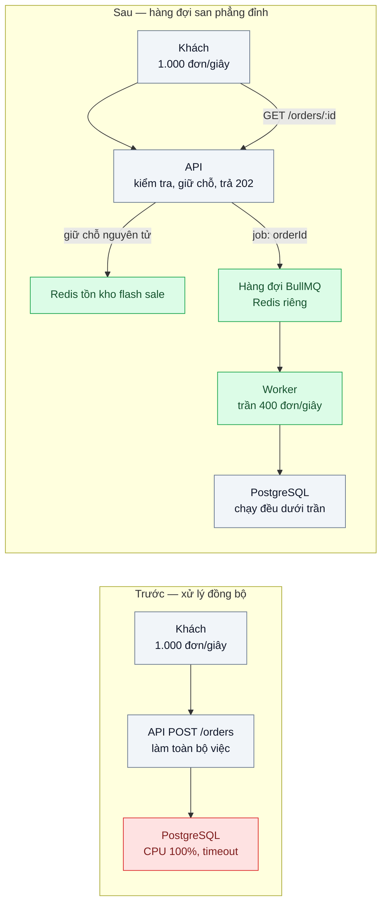
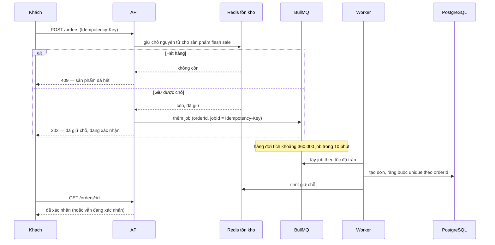

# Queue-Based Load Leveling — Đỉnh 20h gấp 20 lần bình thường trong 10 phút, mua máy cho đỉnh thì lãng phí

| Scope | Mức độ | Trạng thái | Pattern gốc | Cập nhật |
|---|---|---|---|---|
| 18 · backend / vertical / horizontal scale | 🟡 Trung bình | 📋 Kế hoạch | Queue-Based Load Leveling — Microsoft Azure Architecture Center; Little's Law — J. D. C. Little, Operations Research (1961) | 2026-10-06 |

> **Một câu tóm tắt:** Đặt một hàng đợi giữa nơi nhận yêu cầu và phần xử lý nặng để phần xử lý chạy ở tốc độ đều mà DB chịu được, còn hàng đợi hấp thụ phần vượt của đỉnh — đổi độ trễ xác nhận (tính trước được bằng định luật Little) lấy việc không phải mua máy cho 10 phút mỗi tuần.

## 1. Bài toán thực tế (What)

**Bối cảnh** *(doanh nghiệp giả định, số liệu minh họa)*
Một sàn TMĐT chạy flash sale lúc 20h mỗi thứ Sáu. Bình thường khoảng 50 đơn/giây; trong 10 phút đầu flash sale lên khoảng 1.000 đơn/giây. Tạo một đơn gồm tính khuyến mãi, ghi 6 bảng, gọi kho, tạo hóa đơn — tất cả đồng bộ trong `POST /orders`. PostgreSQL primary chịu tốt khoảng 400 đơn/giây.

**Triệu chứng người kinh doanh nhìn thấy**
- 20h05, khoảng 40% lượt đặt hàng báo lỗi hoặc quay vòng rồi hết thời gian; khách bấm lại nhiều lần, có người bị tạo hai đơn.
- Các trang khác (đăng nhập, xem đơn cũ) cũng chậm vì cùng DB.
- Phương án "nâng DB đủ cho 1.000 đơn/giây" tốn gấp khoảng 2,5 lần chi phí DB cả tuần cho 10 phút cao điểm.

**Nguyên nhân kỹ thuật**
Tốc độ đến (λ) vượt năng lực xử lý của DB trong một khoảng ngắn. Khi xử lý đồng bộ, phần vượt không có chỗ chờ nên dồn thành kết nối treo, khóa, timeout; khách bấm lại làm tải tăng thêm. Thêm pod API không giúp vì nút thắt nằm ở DB.

**Ràng buộc**
- Khách phải biết ngay mình đã giữ được sản phẩm hay chưa (số lượng flash sale có hạn).
- Đơn đã giữ chỗ phải được xác nhận trong tối đa 20 phút (cam kết nghiệp vụ, minh họa).
- Không tạo đơn trùng dù khách bấm lại hay worker chạy lại job.

## 2. Vì sao dùng pattern này (Why)

**Nguyên nhân gốc mà pattern nhắm vào:** tốc độ đến tức thời và năng lực xử lý bị buộc phải bằng nhau ở từng thời điểm.

**Pattern giải quyết thế nào:** Queue-Based Load Leveling (Azure) đặt hàng đợi làm bộ đệm giữa tác vụ gửi và dịch vụ xử lý, để dịch vụ xử lý theo tốc độ của chính nó. Ở đây API chỉ làm phần rẻ và cần trả lời ngay: kiểm tra, giữ chỗ tồn kho nguyên tử trong Redis, đưa job vào hàng đợi, trả `202` kèm mã đơn "đang xác nhận". Worker xử lý với tốc độ trần khoảng 400 đơn/giây. Định luật Little (`L = λW`) biến cam kết thời gian chờ thành con số kiểm tra được: trong 10 phút đỉnh, hàng đợi tích khoảng (1.000 − 400) × 600 = 360.000 job; đơn cuối của đỉnh chờ khoảng 360.000 / 400 = 900 giây ≈ 15 phút, trong cam kết 20 phút. Số lượng hàng flash sale giới hạn tự nhiên độ dài tối đa của hàng đợi.

**Lựa chọn khác đã cân nhắc**

| Lựa chọn | Giải quyết được gì | Vì sao không chọn (ở bài này) |
|---|---|---|
| Giữ nguyên + tối ưu nhỏ (tối ưu truy vấn, tăng pool) | Thêm vài chục phần trăm năng lực | Không bù được đỉnh gấp 20 lần; tăng pool còn làm DB tệ hơn |
| Nâng cấp DB cho đỉnh | Xử lý đồng bộ được 1.000 đơn/giây | Trả tiền cả tuần cho 10 phút; DB không co giãn trong vài phút |
| Autoscale pod API | Thêm năng lực nhận request | Nút thắt là DB; thêm pod chỉ thêm kết nối vào DB |
| Load shedding (bài 05) | Bảo vệ hệ thống bằng cách từ chối | Mất đơn đáng lẽ xử lý được nếu chờ thêm vài phút; dùng làm lớp sau khi hàng đợi chạm giới hạn |
| Queue-Based Load Leveling — **chọn** | DB chạy đều dưới trần, đỉnh được hấp thụ | Xác nhận đơn trở thành bất đồng bộ; thêm hàng đợi và trạng thái trung gian |

## 3. Thiết kế hệ thống (How)

### 3.1 Kiến trúc trước và sau



### 3.2 Luồng chính — một đơn trong đỉnh 20h



### 3.3 Thành phần và trách nhiệm

| Thành phần | Trách nhiệm | Quyết định thiết kế đáng chú ý |
|---|---|---|
| `POST /orders` | Kiểm tra, giữ chỗ tồn kho, đưa job, trả `202` | Chỉ thao tác Redis, không chạm PostgreSQL trên đường nóng |
| Redis tồn kho flash sale | Giữ chỗ nguyên tử (script Lua hoặc `DECR` có kiểm tra) | Giữ chỗ có hạn; job thất bại thì trả lại chỗ |
| Hàng đợi BullMQ | Bộ đệm giữa API và worker | Đặt trên Redis, *không* trên PostgreSQL — đưa hàng đợi vào chính nút thắt là tự phá pattern |
| Worker | Tạo đơn với tốc độ trần | Số worker và bộ giới hạn tốc độ cố định theo năng lực DB, không autoscale theo độ dài hàng đợi |
| Giám sát | Độ dài hàng đợi, tuổi job già nhất, tốc độ xử lý | Cảnh báo khi tuổi job già nhất tiến gần cam kết 20 phút |

### 3.4 Điểm dễ sai khi triển khai
- Autoscale worker theo độ dài hàng đợi như bài KEDA → đẩy nguyên đỉnh xuống DB, mất tác dụng san phẳng. Ở bài này trần worker là năng lực DB.
- Hàng đợi không giới hạn → thời gian chờ không giới hạn. Đo tuổi job già nhất, có ngưỡng chuyển sang từ chối (bài 05).
- Trả lời "Đặt hàng thành công" ở bước `202` → khách hiểu nhầm, hủy được thì khiếu nại. Giao diện phải nói "đã giữ chỗ, đang xác nhận".
- Consumer không idempotent → job chạy lại tạo đơn trùng (scope 14 bài 04). Ràng buộc unique ở DB là lưới an toàn cuối.
- Giữ chỗ không có hạn và không trả lại khi job lỗi → tồn kho "biến mất".

## 4. Tech stack và tác động (Impact techstack)

| Lớp | Công nghệ chọn | Vì sao chọn | Thay thế tương đương |
|---|---|---|---|
| Ứng dụng | Fastify thuần, TypeScript strict, Node 20 | Hai endpoint và một worker; NestJS là quá tay | NestJS |
| Hàng đợi | BullMQ trên Redis 7 tách biệt | Có bộ giới hạn tốc độ và concurrency cho worker; không dùng PGMQ vì PostgreSQL chính là nút thắt | RabbitMQ, SQS |
| Tồn kho flash sale | Redis 7 (script Lua) | Giữ chỗ nguyên tử, độ trễ thấp | — |
| Cơ sở dữ liệu | PostgreSQL 16 giới hạn `cpus` trong Docker Compose | Tạo năng lực nhỏ để tái hiện đỉnh vượt trần | — |
| Hạ tầng local | Docker Compose | Một lệnh dựng lại | — |
| Đo | k6 `ramping-arrival-rate` (open model), script lấy mẫu `getJobCounts` và tuổi job, `docker stats` | Đo phía khách, phía hàng đợi và phía DB cùng lúc | Prometheus + exporter |

**Thay đổi so với hệ thống hiện tại:** `POST /orders` tách làm hai nửa (nhận và xử lý), thêm Redis cho hàng đợi và tồn kho flash sale, endpoint trạng thái, giao diện "đang xác nhận". Đội vận hành học theo dõi tuổi job già nhất thay vì chỉ nhìn CPU.

## 5. Kết quả đầu ra và cách đo (Output impact)

| Chỉ số | Trước (minh họa) | Mục tiêu khi thực hành | Cách đo |
|---|---|---|---|
| Tỷ lệ `POST /orders` lỗi hoặc hết thời gian trong đỉnh | 40% | < 0,1% | k6 `http_req_failed` trong scenario đỉnh |
| p99 `POST /orders` trong đỉnh | 12 giây | < 200 ms | k6 `http_req_duration` p99 |
| CPU PostgreSQL trong đỉnh | 100% | Phẳng, ≤ 80% | `docker stats` lấy mẫu mỗi giây |
| Tuổi job già nhất lúc cuối đỉnh | — | Khớp tính toán Little (khoảng 15 phút ở quy mô thật; theo tỷ lệ ở lab) ±20% | Script lấy mẫu thời điểm tạo của job chờ lâu nhất |
| Thời gian xả hết hàng đợi sau đỉnh | — | Khớp dự đoán `L / (μ − λ_sau)` ±20% | Script lấy mẫu độ dài hàng đợi |
| Đơn trùng | Có | 0 | Truy vấn đếm theo Idempotency-Key trong bảng đơn |

> Số "trước" là minh họa để hình dung bài toán. Số "mục tiêu" chỉ được coi là đạt khi có số đo thật
> ở mục 8 kèm môi trường đo.

**Tác động nghiệp vụ mong đợi:** flash sale không còn "sập lúc 20h", khách biết ngay đã giữ được hàng, đơn được xác nhận trong cam kết; công ty không phải trả tiền DB cho đỉnh 10 phút.

## 6. Đánh đổi và khi KHÔNG nên dùng

**Đánh đổi**
- Xác nhận trở thành bất đồng bộ; cần trạng thái trung gian, endpoint trạng thái và giao diện tương ứng.
- Độ trễ xác nhận tăng theo kích thước đỉnh; cam kết thời gian chờ phải tính trước và giám sát.
- Thêm hàng đợi và tồn kho trong Redis cần sao lưu và giám sát riêng.

**Không nên dùng khi**
- Nghiệp vụ cần kết quả đồng bộ thật sự trong vài giây (ủy quyền thanh toán thẻ đang chờ ở cổng): san phẳng làm hỏng trải nghiệm; cần đủ năng lực hoặc từ chối sớm.
- Tải vượt năng lực kéo dài nhiều giờ chứ không phải một đỉnh ngắn: hàng đợi chỉ dồn mãi; cần tăng năng lực (bài 02, 07).
- Đỉnh nhỏ (gấp 1,5 lần) mà hệ thống còn dư địa: thêm hàng đợi chỉ thêm độ phức tạp.

**Liên quan**
- [../05-load-shedding-qua-tai-thi-tu-choi-mot-phan-thay-vi-sap-het/](../05-load-shedding-qua-tai-thi-tu-choi-mot-phan-thay-vi-sap-het/) — lớp tiếp theo khi hàng đợi chạm giới hạn chờ.
- [../07-capacity-planning-use-method-mua-may-bao-nhieu-cho-tet/](../07-capacity-planning-use-method-mua-may-bao-nhieu-cho-tet/) — định luật Little dùng để lập kế hoạch công suất.
- [../../14-backend-queueing/01-work-queue-gui-100k-email-lam-treo-api/](../../14-backend-queueing/01-work-queue-gui-100k-email-lam-treo-api/) — nền tảng work queue.
- [../../14-backend-queueing/04-idempotent-consumer-event-den-hai-lan-tru-kho-hai-lan/](../../14-backend-queueing/04-idempotent-consumer-event-den-hai-lan-tru-kho-hai-lan/) — worker chạy lại không tạo đơn trùng.
- [../../13-backend-transporter/05-async-request-reply-xu-ly-30-giay-http-timeout/](../../13-backend-transporter/05-async-request-reply-xu-ly-30-giay-http-timeout/) — 202 và hỏi trạng thái.
- [../../16-backend-k8s/09-keda-scale-worker-theo-do-dai-hang-doi/](../../16-backend-k8s/09-keda-scale-worker-theo-do-dai-hang-doi/) — đối chiếu: khi nào nên scale worker theo hàng đợi, khi nào phải giữ trần.

## 7. Cơ sở tham khảo

- Microsoft Azure Architecture Center, "Queue-Based Load Leveling pattern" — https://learn.microsoft.com/azure/architecture/patterns/queue-based-load-leveling — hàng đợi làm bộ đệm, dịch vụ xử lý theo tốc độ của mình, các lưu ý khi áp dụng.
- J. D. C. Little, "A Proof for the Queuing Formula: L = λW", *Operations Research*, 1961 — quan hệ giữa số việc trong hệ thống, tốc độ đến và thời gian chờ, dùng để tính cam kết chờ.
- Amazon Builders' Library, "Avoiding insurmountable queue backlogs" — https://aws.amazon.com/builders-library/ — rủi ro tồn đọng không xả kịp và cách giới hạn.
- BullMQ docs — https://docs.bullmq.io/ — concurrency, bộ giới hạn tốc độ của worker, `jobId` để chống trùng.

## 8. Kế hoạch thực hành

- [ ] Bước 1: Docker Compose gồm API Fastify, Redis cho hàng đợi, Redis tồn kho, PostgreSQL giới hạn CPU; đo năng lực DB thật (đơn/giây) để thay các số minh họa theo tỷ lệ.
- [ ] Bước 2: Đo "trước": k6 đỉnh gấp 20 lần trong vài phút với `POST /orders` đồng bộ; ghi tỷ lệ lỗi, p99, CPU DB.
- [ ] Bước 3: Áp dụng pattern: giữ chỗ Redis, `202`, worker có trần, endpoint trạng thái; tính trước tuổi job già nhất và thời gian xả bằng định luật Little.
- [ ] Bước 4: Đo "sau" cùng kịch bản 3 lần; so số đo với tính toán; ghi vào mục 5 kèm môi trường.
- [ ] Bước 5: Test: gửi cùng Idempotency-Key hai lần chỉ tạo một đơn; kill worker giữa chừng không mất đơn; hết hàng trả 409 ngay; CPU DB không vượt trần đã chọn khi đỉnh gấp 20.

**Cấu trúc code dự kiến**
```text
src/
  before/orders-sync.ts        # POST /orders xử lý đồng bộ
  after/orders-accept.ts       # giữ chỗ, đưa job, trả 202
  after/order-worker.ts        # worker có trần tốc độ
  after/stock-reserve.lua
  after/order-status.ts        # GET /orders/:id
bench/flash-sale-spike.k6.js
scripts/sample-queue.ts        # độ dài hàng đợi, tuổi job già nhất
test/order-leveling.test.ts
docker-compose.yml
```

**Cách chạy** *(điền khi bắt đầu code)*
```bash
docker compose up -d
pnpm install && pnpm test
k6 run bench/flash-sale-spike.k6.js & pnpm tsx scripts/sample-queue.ts
```
