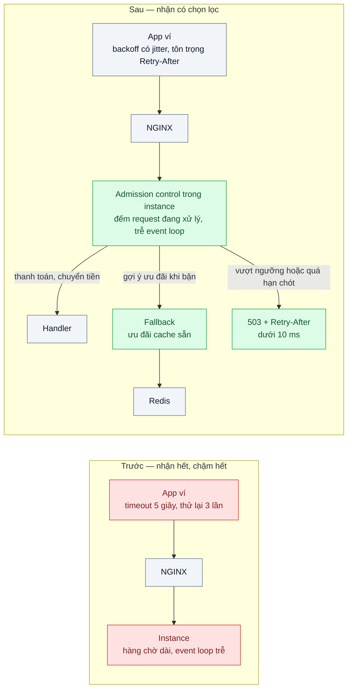
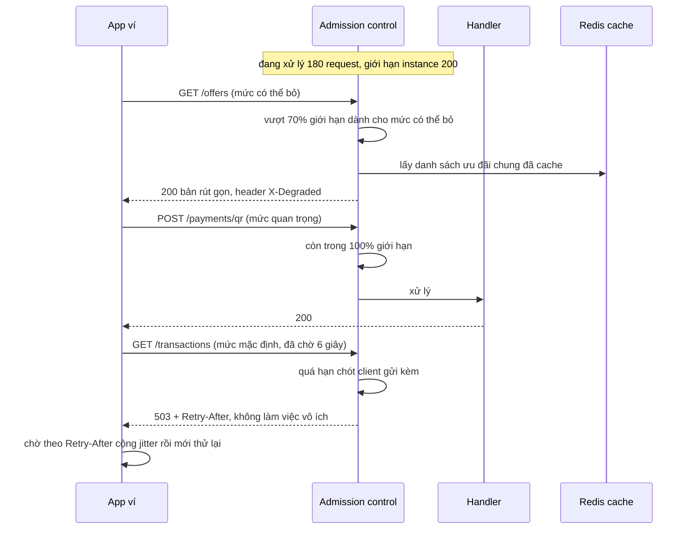

# Load Shedding & Graceful Degradation — Quá tải thì từ chối 20% request thay vì sập 100%

| Scope | Mức độ | Trạng thái | Pattern gốc | Cập nhật |
|---|---|---|---|---|
| 18 · backend / vertical / horizontal scale | 🔴 Nâng cao | 📋 Kế hoạch | Handling Overload, Addressing Cascading Failures — Google, *Site Reliability Engineering* (2016) ch.21–22; "Using load shedding to avoid overload" — Amazon Builders' Library | 2026-10-06 |

> **Một câu tóm tắt:** Khi tải vượt năng lực, mỗi instance chủ động từ chối sớm và rẻ phần request ít quan trọng (hoặc trả bản rút gọn), bỏ những request mà client đã thôi chờ, và giữ năng lực cho thanh toán — để hệ thống vẫn làm được phần lớn việc thay vì làm chậm mọi thứ tới mức sập toàn bộ.

## 1. Bài toán thực tế (What)

**Bối cảnh** *(doanh nghiệp giả định, số liệu minh họa)*
Một ví điện tử có API phục vụ app di động: thanh toán QR, chuyển tiền, lịch sử giao dịch, gợi ý ưu đãi. Ba instance Node sau load balancer chịu tốt khoảng 3.000 request/giây. Ngày nhận lương kèm một chương trình hoàn tiền lan truyền, tải lên khoảng 6.000 request/giây trong 20 phút.

**Triệu chứng người kinh doanh nhìn thấy**
- Toàn bộ app ví không dùng được khoảng 25 phút, kể cả thanh toán QR tại quầy; khách chuyển sang phương thức khác ngay trước mặt thu ngân.
- Khi tải đã giảm, hệ thống vẫn không hồi phục ngay mà "ì" thêm nhiều phút.
- Trong lúc sự cố, phần lớn năng lực bị dùng cho màn hình gợi ý ưu đãi — tính năng không ai cần gấp.

**Nguyên nhân kỹ thuật**
Mỗi instance nhận mọi request dù không thể xong kịp: hàng chờ nội bộ dài ra, độ trễ vượt timeout 5 giây của app, nên instance làm việc cho những request mà client đã bỏ (goodput sụp dù CPU 100%). App thử lại 3 lần, tải thực tăng gấp nhiều lần. Probe health chậm theo, orchestrator gỡ bớt instance, phần còn lại càng quá tải — một chuỗi sự cố dây chuyền. Không có phân biệt request quan trọng và request có thể bỏ.

**Ràng buộc**
- Thanh toán và chuyển tiền phải tiếp tục hoạt động khi quá tải tới gấp 2 năng lực.
- Không thể tăng năng lực trong vài phút (DB và các phụ thuộc không co giãn kịp).
- App di động đã phát hành; thay đổi phía client chỉ tới tay người dùng sau vài tuần.

## 2. Vì sao dùng pattern này (Why)

**Nguyên nhân gốc mà pattern nhắm vào:** hệ thống nhận việc vượt quá khả năng hoàn thành đúng hạn, không biết từ chối và không biết ưu tiên.

**Pattern giải quyết thế nào:** SRE Book ch.21–22 và Amazon Builders' Library mô tả cùng một bộ nguyên tắc. Đo quá tải bằng tín hiệu rẻ ngay tại instance (số request đang xử lý, độ trễ event loop, thời gian chờ). Từ chối *sớm và rẻ* — trước xác thực, trước truy vấn DB — bằng `503` kèm `Retry-After`. Gán mức quan trọng cho từng loại request và bỏ loại ít quan trọng trước. Không làm việc cho request đã quá hạn chót của client. Suy giảm có kiểm soát: trả dữ liệu cache hoặc bản rút gọn thay vì lỗi. Giới hạn thử lại ở client và đừng để probe health thất bại chỉ vì bận. Kết quả là goodput giữ gần năng lực tối đa thay vì sụp về 0.

**Lựa chọn khác đã cân nhắc**

| Lựa chọn | Giải quyết được gì | Vì sao không chọn (ở bài này) |
|---|---|---|
| Giữ nguyên + tối ưu nhỏ (thêm instance, autoscale) | Tăng năng lực khi tải tăng từ từ | Autoscale trễ vài phút (bài 08), DB không co giãn; vẫn cần lưới an toàn khi vượt |
| Rate limiting theo khách hàng (scope 13 bài 03) | Công bằng giữa các khách, chặn lạm dụng | Hạn mức cố định, không thích ứng khi năng lực thật giảm (mất một instance) |
| Queue-Based Load Leveling (bài 04) | Hấp thụ đỉnh cho việc bất đồng bộ | Thanh toán QR là tương tác đồng bộ, không chờ được vài phút |
| Circuit breaker (scope 07 bài 03) | Bảo vệ bên gọi khỏi phụ thuộc đang lỗi | Bảo vệ phía gọi, không bảo vệ chính instance đang quá tải; dùng bổ trợ |
| Load shedding theo mức ưu tiên + suy giảm có kiểm soát — **chọn** | Giữ goodput, ưu tiên thanh toán, hồi phục nhanh | Phải chọn ngưỡng đúng; một phần người dùng nhận từ chối hoặc bản rút gọn |

## 3. Thiết kế hệ thống (How)

### 3.1 Kiến trúc trước và sau



### 3.2 Luồng chính — ba loại request khi tải gấp 2



### 3.3 Thành phần và trách nhiệm

| Thành phần | Trách nhiệm | Quyết định thiết kế đáng chú ý |
|---|---|---|
| Admission control (hook `onRequest` của Fastify) | Đếm request đang xử lý, đọc độ trễ event loop, quyết định nhận/từ chối/suy giảm | Chạy trước mọi việc tốn kém; ngưỡng theo instance, không theo cụm |
| Bảng mức ưu tiên theo route | Quan trọng (thanh toán, chuyển tiền), mặc định, có thể bỏ (gợi ý, thống kê) | Mức có thể bỏ bị từ chối từ 70% giới hạn, mặc định từ 90%, quan trọng từ 100% |
| Hạn chót request | Client gửi hạn chót tuyệt đối; server bỏ request đã quá hạn trước khi xử lý | Kiểm lại trước các bước đắt (gọi DB, gọi dịch vụ khác) |
| Fallback cho mức có thể bỏ | Trả dữ liệu cache hoặc bản rút gọn | Đánh dấu bằng header để đo và để client hiển thị phù hợp |
| Chính sách thử lại phía client | Backoff có jitter, ngân sách thử lại, tôn trọng `Retry-After` | Có hiệu lực với bản app mới; bản cũ được bảo vệ bởi phía server |
| Probe health | Không thất bại chỉ vì đang bận | Tránh orchestrator gỡ instance đúng lúc cần năng lực nhất (scope 16 bài 01) |

### 3.4 Điểm dễ sai khi triển khai
- Từ chối sau khi đã xác thực token và truy vấn DB → việc từ chối cũng tốn gần bằng việc phục vụ, không cứu được gì.
- Trả `500` hoặc trả lỗi chậm thay vì `503` nhanh kèm `Retry-After` → client thử lại ngay, tải còn tăng.
- Bỏ request ngẫu nhiên thay vì theo mức ưu tiên → thanh toán bị từ chối trong khi gợi ý ưu đãi vẫn được phục vụ.
- Đặt giới hạn theo cảm tính → hoặc từ chối khi chưa cần, hoặc vẫn sập. Lấy ngưỡng từ điểm gãy đo bằng load test (bài 07).
- Đo bằng công cụ tải mô hình đóng → client chờ nên tải tự giảm, không thấy quá tải thật. Dùng mô hình mở (scope 23 bài 07).

## 4. Tech stack và tác động (Impact techstack)

| Lớp | Công nghệ chọn | Vì sao chọn | Thay thế tương đương |
|---|---|---|---|
| Ứng dụng | Fastify thuần, TypeScript strict, Node 20 | Hook `onRequest` gọn để làm admission control; NestJS là quá tay | NestJS interceptor |
| Tín hiệu quá tải | Bộ đếm request đang xử lý + `perf_hooks.monitorEventLoopDelay` của Node | Rẻ, đọc ngay trong tiến trình | Plugin `@fastify/under-pressure` (cần xác minh tùy chọn) |
| Load balancer | NGINX mã nguồn mở trước 3 instance | Stack mặc định của scope 18; có thể thêm `limit_conn` làm lớp chặn thô ở biên | HAProxy, Envoy |
| Cache fallback | Redis 7 | Dữ liệu ưu đãi chung đọc nhanh | Bộ nhớ trong tiến trình |
| Hạ tầng local | Docker Compose, mỗi instance `cpus: 1` | Năng lực nhỏ, dễ vượt | — |
| Đo | k6 mô hình mở (`constant-arrival-rate`) gấp 2 năng lực, tag theo mức ưu tiên | Đo goodput và tỷ lệ thành công theo từng loại | Prometheus + Grafana |

**Thay đổi so với hệ thống hiện tại:** thêm admission control và bảng mức ưu tiên ở mọi instance, endpoint fallback cho tính năng có thể bỏ, hạn chót trong header, chính sách thử lại mới cho app. Đội vận hành học theo dõi số request bị từ chối theo mức thay vì chỉ nhìn tỷ lệ lỗi tổng.

## 5. Kết quả đầu ra và cách đo (Output impact)

| Chỉ số | Trước (minh họa) | Mục tiêu khi thực hành | Cách đo |
|---|---|---|---|
| Goodput (request thành công dưới 500 ms mỗi giây) ở tải gấp 2 năng lực | Gần 0 | ≥ 90% năng lực tối đa đã đo | k6 đếm request 200 có `http_req_duration` < 500 ms theo từng giây |
| Tỷ lệ thành công của thanh toán ở tải gấp 2 | Gần 0% | ≥ 99% | k6 tag `priority:critical` |
| p99 của request bị từ chối | — | < 10 ms | k6 lọc phản hồi 503 |
| Tỷ lệ request có thể bỏ nhận bản rút gọn thay vì lỗi | 0% | ≥ 95% | Đếm header `X-Degraded` trong phản hồi |
| Thời gian hồi phục sau khi tải về bình thường | 25 phút | < 1 phút | Chuỗi thời gian goodput từ k6 sau khi hạ tải |
| Request xử lý xong sau hạn chót của client | Nhiều | Gần 0 | Log app so thời điểm xong với hạn chót trong header |

> Số "trước" là minh họa để hình dung bài toán. Số "mục tiêu" chỉ được coi là đạt khi có số đo thật
> ở mục 8 kèm môi trường đo.

**Tác động nghiệp vụ mong đợi:** ngày tải đột biến, khách vẫn thanh toán được tại quầy; một phần tính năng phụ tạm rút gọn thay vì cả app ngừng hoạt động; hệ thống tự hồi phục ngay khi tải giảm.

## 6. Đánh đổi và khi KHÔNG nên dùng

**Đánh đổi**
- Một phần người dùng nhận từ chối hoặc nội dung rút gọn ngay cả khi lẽ ra chờ thêm là được.
- Phải phân loại mức ưu tiên cho từng route và giữ phân loại đó đúng khi sản phẩm thay đổi.
- Ngưỡng sai gây từ chối oan lúc bình thường; cần đo lại sau mỗi thay đổi lớn về hiệu năng.

**Không nên dùng khi**
- Hệ thống luôn dư địa lớn và tải tăng chậm, đoán trước được: autoscale và lập kế hoạch công suất đủ dùng.
- Công việc có thể chờ (gửi email, tạo báo cáo): xếp hàng (bài 04) tốt hơn từ chối.
- Chưa có số đo năng lực thật: đặt ngưỡng mù còn rủi ro hơn không đặt; làm bài 07 trước.

**Liên quan**
- [../04-queue-based-load-leveling-dinh-20h-flash-sale/](../04-queue-based-load-leveling-dinh-20h-flash-sale/) — cách còn lại để đối phó đỉnh: hấp thụ thay vì từ chối.
- [../07-capacity-planning-use-method-mua-may-bao-nhieu-cho-tet/](../07-capacity-planning-use-method-mua-may-bao-nhieu-cho-tet/) — nơi lấy ngưỡng năng lực.
- [../../07-backend-microservices/04-timeout-retry-backoff-jitter-retry-dong-loat-tao-bao-moi/](../../07-backend-microservices/04-timeout-retry-backoff-jitter-retry-dong-loat-tao-bao-moi/) — thử lại phía client không khuếch đại quá tải.
- [../../13-backend-transporter/03-rate-limiting-mot-khach-api-goi-10k-req-s/](../../13-backend-transporter/03-rate-limiting-mot-khach-api-goi-10k-req-s/) — hạn mức theo khách, bổ trợ cho load shedding.
- [../../16-backend-k8s/01-probes-rolling-update-deploy-moi-nhan-traffic-khi-chua-san-sang/](../../16-backend-k8s/01-probes-rolling-update-deploy-moi-nhan-traffic-khi-chua-san-sang/) — probe không được gỡ instance chỉ vì bận.
- [../../23-backend-monitoring-benchmark/07-load-testing-k6-coordinated-omission-benchmark-tu-danh-lua/](../../23-backend-monitoring-benchmark/07-load-testing-k6-coordinated-omission-benchmark-tu-danh-lua/) — đo quá tải đúng cách.

## 7. Cơ sở tham khảo

- Google, *Site Reliability Engineering* (2016), ch.21 "Handling Overload" — https://sre.google/sre-book/handling-overload/ — mức quan trọng của request, giới hạn theo khách, client tự điều tiết thích ứng.
- Google, *Site Reliability Engineering* (2016), ch.22 "Addressing Cascading Failures" — https://sre.google/sre-book/addressing-cascading-failures/ — load shedding, suy giảm có kiểm soát, thử lại, hạn chót, probe health trong lúc quá tải.
- David Yanacek, "Using load shedding to avoid overload", Amazon Builders' Library — https://aws.amazon.com/builders-library/using-load-shedding-to-avoid-overload/ — goodput, từ chối rẻ và sớm, ưu tiên, giới hạn thời gian chờ.
- Marc Brooker, "Timeouts, retries, and backoff with jitter", Amazon Builders' Library — https://aws.amazon.com/builders-library/ — thử lại không khuếch đại tải.
- Node.js docs, "Performance measurement APIs" (`monitorEventLoopDelay`) — https://nodejs.org/api/perf_hooks.html — tín hiệu quá tải trong tiến trình.

## 8. Kế hoạch thực hành

- [ ] Bước 1: Docker Compose gồm NGINX, 3 instance Fastify (`cpus: 1`), Redis; các route thanh toán, lịch sử, ưu đãi có chi phí giả lập; đo năng lực tối đa bằng k6 tăng dần.
- [ ] Bước 2: Đo "trước": k6 mô hình mở ở gấp 2 năng lực trong 5 phút, có client giả lập thử lại 3 lần; ghi goodput, tỷ lệ thành công theo route, thời gian hồi phục.
- [ ] Bước 3: Áp dụng pattern: admission control theo mức ưu tiên, hạn chót, fallback cache, `503` + `Retry-After`; client k6 đổi sang backoff có jitter.
- [ ] Bước 4: Đo "sau" cùng kịch bản 3 lần; ghi vào mục 5 kèm môi trường.
- [ ] Bước 5: Test: khi bộ đếm vượt 70%, route có thể bỏ nhận fallback còn route quan trọng vẫn được xử lý; request quá hạn chót không chạm handler; phản hồi từ chối luôn có `Retry-After`; probe health vẫn 200 khi đang từ chối.

**Cấu trúc code dự kiến**
```text
src/
  server.ts                     # Fastify, ba nhóm route
  admission/admission-hook.ts   # đếm in-flight, trễ event loop, quyết định
  admission/priorities.ts       # bảng mức ưu tiên theo route
  admission/deadline.ts         # đọc và kiểm hạn chót
  fallback/offers-fallback.ts
nginx/nginx.conf
bench/overload-2x.k6.js         # mô hình mở, tag theo mức ưu tiên
test/admission-hook.test.ts
docker-compose.yml
```

**Cách chạy** *(điền khi bắt đầu code)*
```bash
docker compose up -d
pnpm install && pnpm test
k6 run bench/overload-2x.k6.js
```
