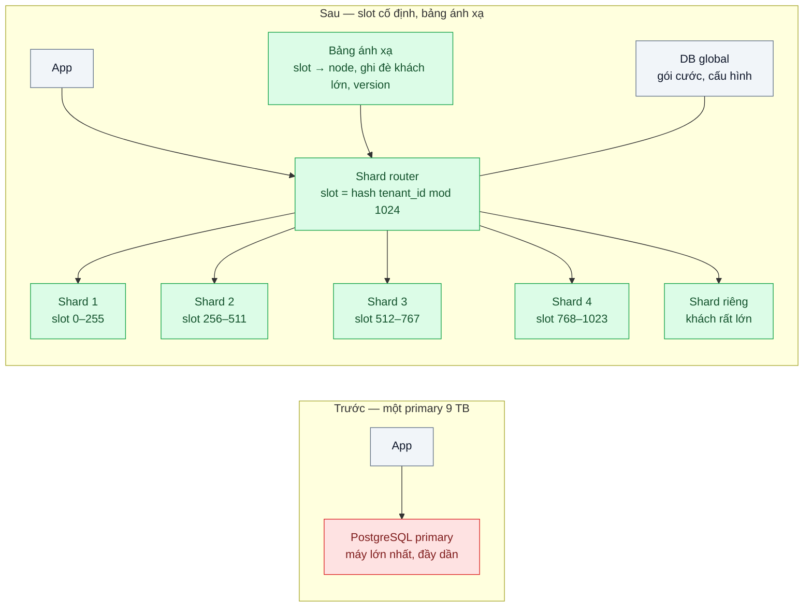
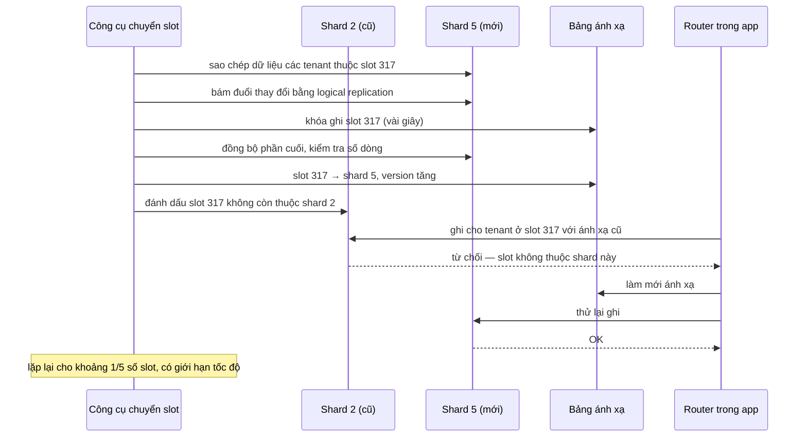

# Sharding with Consistent Hashing — Dữ liệu vượt một máy; chia theo khách hàng mà thêm máy không phải chia lại hết

| Scope | Mức độ | Trạng thái | Pattern gốc | Cập nhật |
|---|---|---|---|---|
| 18 · backend / vertical / horizontal scale | 🔴 Nâng cao | 📋 Kế hoạch | Partitioning — Kleppmann, *DDIA* (2017) ch.6; Consistent Hashing — Karger et al., STOC 1997; virtual nodes — DeCandia et al., "Dynamo", SOSP 2007; Sharding — Azure Architecture Center | 2026-10-06 |

> **Một câu tóm tắt:** Chia dữ liệu theo `tenant_id` ra nhiều máy PostgreSQL qua một lớp trung gian cố định — hash tenant vào 1.024 slot, bảng ánh xạ slot về máy — để mọi truy vấn của một khách nằm gọn trên một máy, và thêm máy chỉ phải chuyển khoảng 1/N dữ liệu thay vì chia lại gần hết như `tenant_id % N`.

## 1. Bài toán thực tế (What)

**Bối cảnh** *(doanh nghiệp giả định, số liệu minh họa)*
Một SaaS B2B quản lý khách hàng (CRM) phục vụ 4.000 công ty. PostgreSQL primary 9 TB, tăng khoảng 300 GB mỗi tháng. Đội đã đi hết thang scale của bài 02: tối ưu truy vấn, cache, nâng lên máy lớn nhất của nhà cung cấp, read replica, partition theo thời gian. Ghi và dung lượng vẫn là giới hạn của một máy.

**Triệu chứng người kinh doanh nhìn thấy**
- Dự báo khoảng 9 tháng nữa DB hết dung lượng và không còn cỡ máy lớn hơn để nâng.
- Backup và khôi phục 9 TB mất khoảng 14 giờ; một sự cố DB đồng nghĩa với mất cả ngày làm việc của 4.000 khách.
- Một khách lớn chạy nhập dữ liệu hàng loạt làm chậm mọi khách khác.
- Bản thử chia theo `tenant_id % 4` cho thấy: thêm máy thứ 5 thì khoảng 80% dữ liệu phải chuyển chỗ.

**Nguyên nhân kỹ thuật**
Mọi ghi và mọi byte dồn vào một node. Chia dữ liệu là bắt buộc, nhưng chia bằng `hash % N` gắn vị trí của mọi khóa với số node: N đổi thì gần như mọi khóa đổi chỗ, nên mỗi lần thêm máy là một cuộc di chuyển khổng lồ.

**Ràng buộc**
- Mọi màn hình nghiệp vụ chỉ làm việc trong phạm vi một khách (tenant); transaction phải giữ được tính cục bộ.
- Thêm máy trong giờ làm việc, mỗi khách chỉ bị ngừng ghi vài giây trong lúc chuyển.
- Khách rất lớn phải tách riêng được mà không đổi cơ chế định tuyến.

## 2. Vì sao dùng pattern này (Why)

**Nguyên nhân gốc mà pattern nhắm vào:** giới hạn của một node, và cách gán khóa vào node phụ thuộc trực tiếp vào số node.

**Pattern giải quyết thế nào:** DDIA ch.6 so sánh phân mảnh theo khoảng khóa và theo hash, và chỉ ra `hash mod N` là cách tái cân bằng tồi; các cách tốt hơn là số partition cố định (nhiều hơn số node), partition động, hoặc tỷ lệ theo node. Karger và cộng sự (1997) chứng minh với consistent hashing, thêm hoặc bớt một node chỉ làm khoảng 1/N khóa đổi chỗ; Dynamo dùng *virtual node* để phân phối đều hơn. Bài này dùng biến thể "số slot cố định": `slot = hash(tenant_id) mod 1024` không bao giờ đổi, còn bảng `slot → node` là thứ thay đổi khi thêm máy — chỉ các slot được giao cho máy mới phải chuyển. Khách lớn được ghi đè trực tiếp `tenant → node` (cách tra bảng — lookup — của Azure Sharding pattern). DDIA cũng lưu ý thuật ngữ "consistent hashing" hay bị dùng lẫn; điều quan trọng là tính chất "thêm node chỉ chuyển một phần nhỏ".

**Lựa chọn khác đã cân nhắc**

| Lựa chọn | Giải quyết được gì | Vì sao không chọn (ở bài này) |
|---|---|---|
| Giữ nguyên + tối ưu nhỏ (thêm partition, nén, xóa dữ liệu cũ) | Kéo dài thêm vài tháng | Không đổi giới hạn một node; thang scale bài 02 đã đi hết |
| `tenant_id % N` | Đơn giản | Thêm máy phải chuyển khoảng N/(N+1) dữ liệu |
| Chia theo khoảng `tenant_id` | Dễ hiểu, quét theo khoảng tốt | Khách mới dồn vào khoảng cuối, tạo điểm nóng |
| Mỗi khách một DB (scope 02 bài 07) | Cách ly mạnh | 4.000 DB khó vận hành; giữ cho khách rất lớn |
| Citus / distributed SQL | Phân mảnh, tái cân bằng, truy vấn phân tán có sẵn | Ứng viên mạnh cho production; lab tự làm router để hiểu cơ chế trước khi chọn |
| Hash vào slot cố định + bảng ánh xạ + ghi đè khách lớn — **chọn** | Truy vấn trong tenant một máy; thêm máy chuyển ~1/N | Truy vấn xuyên tenant khó; phải vận hành router và công cụ chuyển slot |

## 3. Thiết kế hệ thống (How)

### 3.1 Kiến trúc trước và sau



### 3.2 Luồng chính — thêm shard 5, chuyển một slot



### 3.3 Thành phần và trách nhiệm

| Thành phần | Trách nhiệm | Quyết định thiết kế đáng chú ý |
|---|---|---|
| Khóa phân mảnh `tenant_id` | Gom mọi dữ liệu của một khách vào một shard | Mọi bảng nghiệp vụ có `tenant_id`; truy vấn thiếu nó bị router từ chối |
| Hàm slot | `hash(tenant_id) mod 1024`, không bao giờ đổi | Hash ổn định giữa ngôn ngữ và phiên bản (ví dụ vài byte đầu của MD5 từ `node:crypto`), không dùng hash nội bộ của runtime |
| Bảng ánh xạ | `slot → node`, `tenant → node` cho khách lớn, có `version` | Router cache và làm mới khi nhận lỗi "sai shard" |
| Shard router | Chọn pool kết nối theo tenant | Thư viện trong app, không thêm proxy; lỗi "sai shard" được thử lại trong suốt |
| Kiểm tra quyền sở hữu ở shard | Shard từ chối ghi cho slot không thuộc mình | Lưới an toàn khi cache ánh xạ của router cũ |
| ID toàn cục | UUIDv7 hoặc ULID thay cho sequence | Không trùng giữa shard, chuyển dữ liệu không phải đổi khóa |

### 3.4 Điểm dễ sai khi triển khai
- Chọn khóa phân mảnh không có mặt trong mọi truy vấn chính → truy vấn phải rải tới mọi shard rồi gộp.
- Dùng hàm hash không ổn định (hash chuỗi tự viết, khác nhau giữa service Node và job Python) → hai nơi định tuyến khác nhau.
- Giữ sequence riêng mỗi shard → trùng ID khi chuyển tenant giữa shard.
- Giả định còn transaction và join xuyên tenant: báo cáo toàn hệ thống phải chuyển sang kho phân tích qua CDC.
- Chuyển slot không giới hạn tốc độ → chính việc chuyển làm chậm production.
- Một khách lớn hơn cả một shard → slot không giải quyết được; cần ghi đè sang shard riêng.

## 4. Tech stack và tác động (Impact techstack)

| Lớp | Công nghệ chọn | Vì sao chọn | Thay thế tương đương |
|---|---|---|---|
| Cơ sở dữ liệu | PostgreSQL 16 × 5 container + 1 DB global | Stack mặc định; logical replication có sẵn để chuyển slot | MySQL + Vitess |
| Router | Thư viện TypeScript strict, Node 20, mỗi shard một pool `pg` | Thấy rõ cơ chế; không thêm proxy | Citus coordinator (cần xác minh chi tiết tái cân bằng), Vitess vtgate |
| Hash | `node:crypto` (MD5, lấy 4 byte đầu) | Có sẵn, ổn định giữa các phiên bản và ngôn ngữ; không cần tính chất mật mã | xxHash, MurmurHash qua thư viện |
| Chuyển slot | Logical replication (publication theo bảng, lọc theo tenant) hoặc `COPY` theo tenant + bám đuổi | Ít gián đoạn ghi | pg_dump theo tenant (gián đoạn lâu hơn) |
| Hạ tầng local | Docker Compose | Một lệnh dựng 5 shard | — |
| Đo | Script mô phỏng 4.000 tenant; k6 trong lúc chuyển slot; `pg_database_size` | Tỷ lệ di chuyển, độ lệch, ảnh hưởng tới truy vấn | — |

**Thay đổi so với hệ thống hiện tại:** mọi truy cập DB đi qua router; thêm bảng ánh xạ, DB global, công cụ chuyển slot, đổi ID sang UUIDv7; báo cáo xuyên khách chuyển sang kho phân tích. Đội vận hành học vận hành nhiều shard: backup, nâng cấp và giám sát theo từng shard.

## 5. Kết quả đầu ra và cách đo (Output impact)

| Chỉ số | Trước (minh họa) | Mục tiêu khi thực hành | Cách đo |
|---|---|---|---|
| Tỷ lệ tenant phải chuyển khi đi từ 4 lên 5 shard | ~80% (`% N`) | ≈ 20% (≈ 1/5) | Script mô phỏng 4.000 tenant cho ba cách: `% N`, vòng hash có virtual node, slot cố định |
| Độ lệch dữ liệu giữa shard (lớn nhất / trung bình), không tính khách ghi đè | — | < 1,2 | `pg_database_size` hoặc đếm dòng theo shard |
| p99 truy vấn trong tenant ở cùng tải | Mốc trước khi chia | Không tệ hơn mốc | k6 cùng kịch bản trước và sau |
| Thời gian ngừng ghi của một slot khi chuyển | — | < 5 giây | Log công cụ chuyển slot: khóa → mở khóa |
| Ghi rơi vào shard sai sau khi đổi ánh xạ | — | 100% được thử lại thành công, 0 lỗi tới client | Bộ đếm lỗi "sai shard" và lỗi trả về trong k6 |
| Truy vấn rải nhiều shard trên luồng nghiệp vụ | — | 0 | Log router |

> Số "trước" là minh họa để hình dung bài toán. Số "mục tiêu" chỉ được coi là đạt khi có số đo thật
> ở mục 8 kèm môi trường đo.

**Tác động nghiệp vụ mong đợi:** dung lượng và năng lực ghi tăng bằng cách thêm máy; sự cố một shard chỉ ảnh hưởng một phần khách; khách lớn được cách ly khỏi phần còn lại.

## 6. Đánh đổi và khi KHÔNG nên dùng

**Đánh đổi**
- Mất transaction, join và ràng buộc xuyên tenant; báo cáo toàn hệ thống cần kho dữ liệu riêng.
- Vận hành nhiều DB: backup, migration schema, giám sát nhân theo số shard.
- Router và công cụ chuyển slot là code quan trọng mới cần kiểm thử kỹ.

**Không nên dùng khi**
- Chưa đi hết thang scale (bài 02): sharding là bậc cuối, đắt nhất về độ phức tạp.
- Nghiệp vụ cần truy vấn và transaction xuyên khách thường xuyên: cân nhắc distributed SQL thay vì tự chia.
- Dữ liệu vài trăm GB: một máy cộng replica và partition theo thời gian là đủ.

**Liên quan**
- [../02-scale-up-truoc-hay-scale-out-db-cpu-90/](../02-scale-up-truoc-hay-scale-out-db-cpu-90/) — các bậc phải đi trước sharding.
- [../03-load-balancing-mot-server-qua-tai-cac-server-khac-ranh/](../03-load-balancing-mot-server-qua-tai-cac-server-khac-ranh/) — cùng ý tưởng hashing nhất quán áp cho định tuyến request.
- [../../02-backend-database/07-multi-tenant-saas-300-cong-ty-chung-mot-db/](../../02-backend-database/07-multi-tenant-saas-300-cong-ty-chung-mot-db/) — mô hình dữ liệu đa tenant trước khi chia máy.
- [../../02-backend-database/09-partitioning-bang-su-kien-500-trieu-dong/](../../02-backend-database/09-partitioning-bang-su-kien-500-trieu-dong/) — partition trong một máy.
- [../../03-backend-cache/05-hot-key-mot-san-pham-viral-dap-mot-node-redis/](../../03-backend-cache/05-hot-key-mot-san-pham-viral-dap-mot-node-redis/) — điểm nóng khi khóa phân phối lệch.

## 7. Cơ sở tham khảo

- Martin Kleppmann, *Designing Data-Intensive Applications* (O'Reilly, 2017), ch.6 "Partitioning" — phân mảnh theo khoảng và theo hash, vì sao tránh `hash mod N`, số partition cố định, định tuyến request.
- Karger, Lehman, Leighton, Panigrahy, Levine, Lewin, "Consistent Hashing and Random Trees", STOC 1997 — tính chất thêm/bớt node chỉ chuyển khoảng 1/N khóa.
- DeCandia et al., "Dynamo: Amazon's Highly Available Key-value Store", SOSP 2007 — virtual node và các chiến lược phân partition.
- Microsoft Azure Architecture Center, "Sharding pattern" — https://learn.microsoft.com/azure/architecture/patterns/sharding — chiến lược lookup, range, hash và việc tái cân bằng.
- PostgreSQL docs, "Logical Replication" — https://www.postgresql.org/docs/16/logical-replication.html — công cụ chuyển slot ít gián đoạn.
- Citus docs — https://docs.citusdata.com/ — bảng phân tán theo cột tenant, colocation, tái cân bằng shard (phương án production để so sánh).

## 8. Kế hoạch thực hành

- [ ] Bước 1: Script mô phỏng 4.000 tenant (kích thước theo phân phối lệch, vài khách rất lớn); đo tỷ lệ di chuyển và độ lệch của ba cách gán khi đi từ 4 lên 5 node.
- [ ] Bước 2: Docker Compose 1 DB "trước" + 5 shard + DB global; nạp dữ liệu mẫu; k6 kịch bản CRM trong tenant để lấy mốc p99.
- [ ] Bước 3: Áp dụng pattern: router với slot cố định, bảng ánh xạ có version, kiểm tra quyền sở hữu ở shard, ghi đè khách lớn; chia dữ liệu ra 4 shard.
- [ ] Bước 4: Thêm shard 5 bằng công cụ chuyển slot trong lúc k6 chạy; ghi tỷ lệ di chuyển, thời gian ngừng ghi mỗi slot, lỗi sai shard vào mục 5 kèm môi trường.
- [ ] Bước 5: Test: cùng `tenant_id` luôn ra cùng slot ở mọi phiên bản; đổi 4 → 5 node với slot cố định chuyển ≤ 25% tenant; ghi với ánh xạ cũ được thử lại thành công; truy vấn thiếu `tenant_id` bị router từ chối.

**Cấu trúc code dự kiến**
```text
src/
  sharding/slot.ts              # hash ổn định → slot
  sharding/shard-map.ts         # bảng ánh xạ, cache, làm mới theo version
  sharding/shard-router.ts      # chọn pool, thử lại khi sai shard
  mover/move-slot.ts            # sao chép, bám đuổi, khóa, đổi ánh xạ
  simulation/rebalance-sim.ts   # so ba cách gán khóa
bench/crm-tenant.k6.js
test/shard-router.test.ts
docker-compose.yml              # 5 shard + global
```

**Cách chạy** *(điền khi bắt đầu code)*
```bash
docker compose up -d
pnpm install && pnpm test
pnpm tsx src/simulation/rebalance-sim.ts
```
