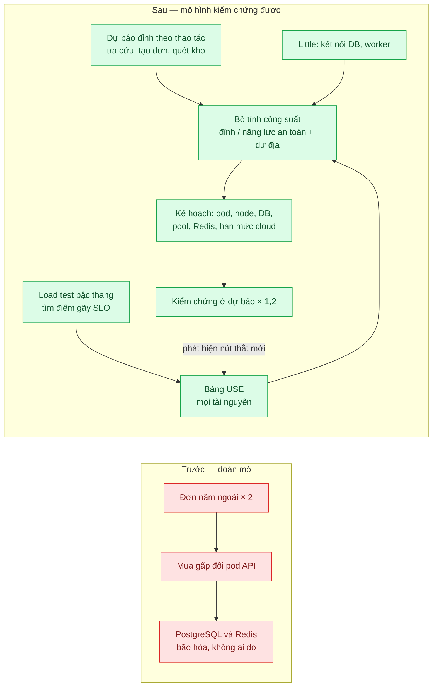
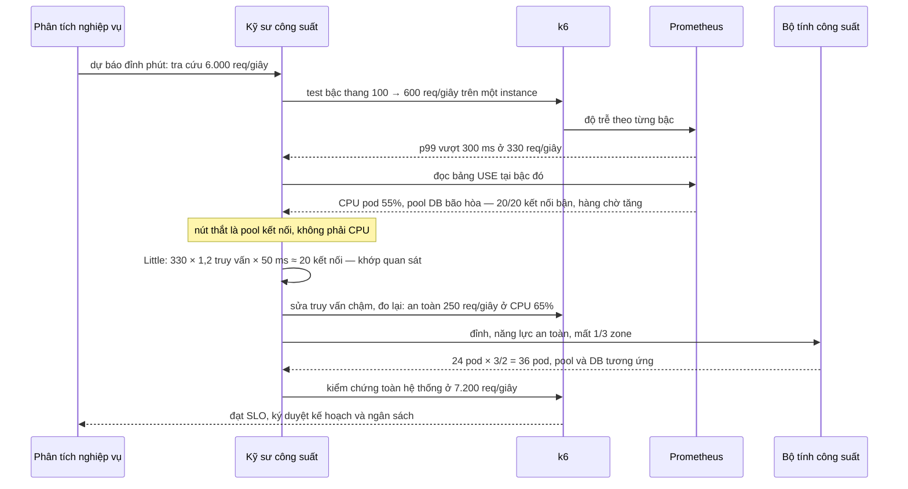

# Capacity Planning (USE method, Little's law) — Mua bao nhiêu máy cho mùa Tết? Hiện tại đoán mò

| Scope | Mức độ | Trạng thái | Pattern gốc | Cập nhật |
|---|---|---|---|---|
| 18 · backend / vertical / horizontal scale | 🔴 Nâng cao | 📋 Kế hoạch | The USE Method — Brendan Gregg; Little's Law — J. D. C. Little (1961); demand forecasting & capacity planning — Google, *Site Reliability Engineering* (2016) | 2026-10-06 |

> **Một câu tóm tắt:** Thay "nhân đôi mọi thứ" bằng một mô hình kiểm chứng được: dự báo đỉnh theo từng thao tác nghiệp vụ, đo năng lực an toàn của một instance bằng load test, dùng USE method tìm tài nguyên bão hòa đầu tiên, dùng định luật Little tính số kết nối và worker, rồi cộng dư địa cho sự cố — và kiểm chứng bằng một lượt test ở mức dự báo × 1,2 trước mùa.

## 1. Bài toán thực tế (What)

**Bối cảnh** *(doanh nghiệp giả định, số liệu minh họa)*
Một công ty logistics có ba tuần cao điểm trước Tết với lượng đơn gấp 3–4 lần tháng thường. Năm trước đội kỹ thuật "nhân đôi mọi thứ": số pod API gấp đôi, nhưng trang tra cứu vận đơn vẫn sập hai ngày vì pool kết nối PostgreSQL và Redis bão hòa. Năm trước nữa thì mua dư gấp ba và để không suốt mùa.

**Triệu chứng người kinh doanh nhìn thấy**
- Giám đốc tài chính hỏi "ngân sách hạ tầng cho Tết là bao nhiêu, dựa vào đâu?" — không ai trả lời được bằng số.
- Năm ngoái đã chi thêm mà vẫn sập đúng tuần cao điểm; khách và đối tác TMĐT phàn nàn không tra được vận đơn.
- Mỗi lần dự báo đơn thay đổi, đội kỹ thuật mất vài ngày họp để đoán lại.

**Nguyên nhân kỹ thuật**
Không có mô hình theo từng tài nguyên: không biết tài nguyên nào bão hòa trước (CPU pod, kết nối DB, Redis, giới hạn API của hãng). Kế hoạch dựa trên trung bình ngày thay vì phút cao điểm, và nhắm mức sử dụng gần 100% trong khi độ trễ tăng vọt khi tài nguyên tiến gần bão hòa. "Nhân đôi" pod API làm *tăng* số kết nối dồn vào DB — chính tài nguyên đã bão hòa.

**Ràng buộc**
- Kế hoạch phải xong trước mùa 8 tuần (thời gian xin tăng hạn mức của nhà cung cấp cloud, mua thêm node).
- Phải chịu được mất một zone trong ba zone mà vẫn đạt SLO.
- SLO: p99 tra cứu vận đơn dưới 300 ms (minh họa).

## 2. Vì sao dùng pattern này (Why)

**Nguyên nhân gốc mà pattern nhắm vào:** quyết định công suất dựa trên cảm tính và một chỉ số (CPU), không dựa trên mô hình nhu cầu và năng lực của từng tài nguyên.

**Pattern giải quyết thế nào:** USE method (Gregg) yêu cầu với *mỗi* tài nguyên kiểm tra ba chỉ số: Utilization (bận bao nhiêu phần trăm thời gian), Saturation (việc phải chờ — hàng đợi), Errors — để tìm nút thắt có hệ thống thay vì đoán. Định luật Little (`L = λW`) cho số việc đồng thời từ thông lượng và thời gian phục vụ: số kết nối DB bận ≈ số truy vấn/giây × thời gian mỗi truy vấn; số worker ≈ job/giây × thời gian mỗi job. SRE Book xếp dự báo nhu cầu và lập kế hoạch công suất vào trách nhiệm cốt lõi: dự báo có tính tăng trưởng tự nhiên và sự kiện, kiểm chứng năng lực bằng load test, cấp phát có dư địa. Ghép lại: dự báo đỉnh → đo năng lực an toàn của một instance tại điểm gãy SLO → USE tìm tài nguyên bão hòa đầu tiên → Little tính tài nguyên kiểu đồng thời → cộng dư địa → kiểm chứng.

**Lựa chọn khác đã cân nhắc**

| Lựa chọn | Giải quyết được gì | Vì sao không chọn (ở bài này) |
|---|---|---|
| Giữ nguyên + tối ưu nhỏ ("nhân đôi mọi thứ", thêm ngân sách dự phòng) | Nhanh, dễ duyệt | Mua sai chỗ, có thể làm nút thắt tệ hơn; không giải thích được ngân sách |
| Chỉ dựa vào autoscaling | Co giãn tầng stateless | Không co giãn được DB, Redis, hạn mức cloud, API đối tác; vẫn cần trần và hạn mức có trước |
| Công cụ ước lượng của nhà cung cấp | Có con số nhanh | Không biết đặc tính ứng dụng; không chỉ ra nút thắt |
| Mô hình USE + Little + load test kiểm chứng — **chọn** | Biết nút thắt, con số có căn cứ, lập lại nhanh khi dự báo đổi | Tốn công dựng môi trường test đủ giống production và đo cẩn thận |

## 3. Thiết kế hệ thống (How)

### 3.1 Kiến trúc trước và sau



### 3.2 Luồng chính — vòng lập kế hoạch và một nút thắt bị che



### 3.3 Thành phần và trách nhiệm

| Thành phần | Trách nhiệm | Quyết định thiết kế đáng chú ý |
|---|---|---|
| Mô hình nhu cầu | Đỉnh theo phút cho từng thao tác nghiệp vụ, từ dữ liệu năm trước × tăng trưởng × sự kiện | Dùng phút cao điểm, không dùng trung bình ngày |
| Load test bậc thang | Năng lực an toàn của một instance tại điểm gãy SLO | Mô hình mở; dữ liệu test đủ lớn để cache không "đẹp" giả |
| Bảng USE | Utilization, Saturation, Errors cho CPU, bộ nhớ, mạng, đĩa, pool DB, Redis, worker, API đối tác | Mỗi ô ghi rõ chỉ số Prometheus dùng để đo |
| Bộ tính công suất | `ceil(đỉnh / năng lực an toàn)`, dư địa mất zone, surge khi deploy, Little cho tài nguyên đồng thời | Script với đầu vào JSON; đổi dự báo là chạy lại trong vài phút |
| Lượt kiểm chứng | Test toàn hệ thống ở dự báo × 1,2 | Kết quả quyết định ký duyệt; nút thắt mới quay lại vòng USE |

### 3.4 Điểm dễ sai khi triển khai
- Lập kế hoạch theo trung bình ngày → đỉnh phút gấp nhiều lần trung bình bị bỏ qua.
- Nhắm mức sử dụng 90–100% → độ trễ hàng đợi tăng vọt khi gần bão hòa. Nhắm 60–70% cho tài nguyên trên đường đồng bộ.
- Chỉ đo CPU → bỏ sót Saturation (hàng chờ) và tài nguyên không phải CPU: kết nối, file descriptor, hạn mức API đối tác.
- Môi trường test quá nhỏ (DB vài GB, toàn trúng cache) → năng lực đo được đẹp hơn thật nhiều lần.
- Quên dư địa cho mất zone và cho pod surge khi deploy; quên xin tăng hạn mức cloud từ nhiều tuần trước.

## 4. Tech stack và tác động (Impact techstack)

| Lớp | Công nghệ chọn | Vì sao chọn | Thay thế tương đương |
|---|---|---|---|
| Hệ thống mẫu | NGINX + N instance Fastify (TypeScript strict, Node 20) + PostgreSQL 16 + Redis 7 trong Docker Compose, mỗi instance giới hạn `cpus` | Stack mặc định của scope 18; giới hạn CPU để có "một instance" rõ ràng | Cluster k3d |
| Tạo tải | k6 với `ramping-arrival-rate` (bậc thang, mô hình mở) | Tìm điểm gãy không bị coordinated omission | Gatling |
| Chỉ số USE | Prometheus + node_exporter, cAdvisor, exporter cho PostgreSQL và Redis (cần xác minh tên dự án exporter); chỉ số pool từ app | Phủ đủ tài nguyên trong bảng USE | Grafana Cloud, Datadog |
| Bộ tính công suất | Script TypeScript đọc dự báo và kết quả đo (JSON), xuất bảng kế hoạch | Lặp lại được, review được | Bảng tính |
| Báo cáo | Bảng USE và kế hoạch dạng Markdown sinh từ script | Đọc được bởi tài chính và kỹ thuật | — |

**Thay đổi so với hệ thống hiện tại:** thêm quy trình lập kế hoạch hằng năm/hằng mùa, bộ chỉ số USE cho mọi tài nguyên, môi trường load test đủ giống production và bộ tính công suất. Đội học đọc điểm gãy, phân biệt Utilization và Saturation, và trình bày kế hoạch bằng số.

## 5. Kết quả đầu ra và cách đo (Output impact)

| Chỉ số | Trước (minh họa) | Mục tiêu khi thực hành | Cách đo |
|---|---|---|---|
| Sai số giữa năng lực mô hình dự đoán và lượt kiểm chứng | Không có mô hình | ±15% | So thông lượng dự đoán với thông lượng đạt SLO trong lượt test kiểm chứng |
| Nút thắt đầu tiên được xác định trước mùa | Không | Có: tên tài nguyên, ngưỡng, chỉ số chứng minh | Bảng USE tại điểm gãy |
| p99 tra cứu ở dự báo × 1,2 với cấu hình theo kế hoạch | Sập (năm ngoái) | < 300 ms | k6 lượt kiểm chứng toàn hệ thống |
| Mức sử dụng các tài nguyên đồng bộ tại đỉnh dự báo | Không biết | 60–70% | Prometheus trong lượt kiểm chứng |
| Thời gian lập lại kế hoạch khi dự báo đổi | Vài ngày | < 1 giờ | Bấm giờ chạy lại bộ tính với dự báo mới |

> Số "trước" là minh họa để hình dung bài toán. Số "mục tiêu" chỉ được coi là đạt khi có số đo thật
> ở mục 8 kèm môi trường đo.

**Tác động nghiệp vụ mong đợi:** ngân sách hạ tầng mùa cao điểm có căn cứ và trình bày được; tiền chi vào đúng nút thắt; mùa Tết không còn sập vì một tài nguyên không ai đo.

## 6. Đánh đổi và khi KHÔNG nên dùng

**Đánh đổi**
- Tốn công dựng môi trường test giống production và duy trì bộ chỉ số.
- Mô hình chỉ đúng trong phạm vi đã đo; thay đổi lớn về kiến trúc hay tính năng phải đo lại.
- Dự báo nhu cầu vẫn có thể sai; kế hoạch cần dư địa và phương án từ chối có kiểm soát (bài 05).

**Không nên dùng khi**
- Hệ thống nhỏ, chạy trên dịch vụ tự co giãn hoàn toàn và chi phí không đáng kể: autoscaling với trần hợp lý là đủ.
- Không có dữ liệu lịch sử và không có sự kiện đoán trước: bắt đầu bằng đo và quan sát (scope 23) trước khi lập mô hình.
- Ngân sách không phải ràng buộc và rủi ro sập thấp: chi phí lập mô hình có thể lớn hơn tiền tiết kiệm.

**Liên quan**
- [../02-scale-up-truoc-hay-scale-out-db-cpu-90/](../02-scale-up-truoc-hay-scale-out-db-cpu-90/) — chọn bậc scale cho nút thắt vừa tìm được.
- [../05-load-shedding-qua-tai-thi-tu-choi-mot-phan-thay-vi-sap-het/](../05-load-shedding-qua-tai-thi-tu-choi-mot-phan-thay-vi-sap-het/) — lưới an toàn khi dự báo sai.
- [../08-autoscaling-policy-scale-cham-hon-traffic/](../08-autoscaling-policy-scale-cham-hon-traffic/) — trần và sàn của autoscaling lấy từ kế hoạch.
- [../../23-backend-monitoring-benchmark/01-four-golden-signals-red-method-khong-biet-service-nao-cham/](../../23-backend-monitoring-benchmark/01-four-golden-signals-red-method-khong-biet-service-nao-cham/) — USE, RED và golden signals.
- [../../23-backend-monitoring-benchmark/07-load-testing-k6-coordinated-omission-benchmark-tu-danh-lua/](../../23-backend-monitoring-benchmark/07-load-testing-k6-coordinated-omission-benchmark-tu-danh-lua/) — load test không tự đánh lừa.
- [../../02-backend-database/03-connection-pool-200-pod-dap-postgres/](../../02-backend-database/03-connection-pool-200-pod-dap-postgres/) — nút thắt kết nối khi thêm pod.

## 7. Cơ sở tham khảo

- Brendan Gregg, "The USE Method" — https://www.brendangregg.com/usemethod.html — định nghĩa Utilization, Saturation, Errors và danh sách kiểm tra theo tài nguyên.
- Brendan Gregg, *Systems Performance*, 2nd ed. (Addison-Wesley, 2020) — USE method trong phân tích hiệu năng và phương pháp benchmark (ch.12).
- J. D. C. Little, "A Proof for the Queuing Formula: L = λW", *Operations Research*, 1961 — tính số việc đồng thời từ thông lượng và thời gian phục vụ.
- Google, *Site Reliability Engineering* (2016), ch.1 "Introduction", mục "Demand Forecasting and Capacity Planning" (cần xác minh vị trí mục) — https://sre.google/sre-book/introduction/ — dự báo nhu cầu, kiểm chứng bằng load test, cấp phát có dư địa.
- Grafana k6 docs, "Open and closed models", executor `ramping-arrival-rate` — https://grafana.com/docs/k6/ — tạo tải bậc thang đúng cách.

## 8. Kế hoạch thực hành

- [ ] Bước 1: Docker Compose hệ thống mẫu (NGINX, instance Fastify giới hạn CPU, PostgreSQL với dữ liệu đủ lớn, Redis), Prometheus và các exporter; endpoint tra cứu vận đơn và tạo đơn.
- [ ] Bước 2: Dựng "trước": cấu hình theo kiểu nhân đôi pod, chạy k6 ở mức dự báo, ghi nút thắt xuất hiện và p99.
- [ ] Bước 3: Áp dụng phương pháp: test bậc thang một instance, lập bảng USE tại điểm gãy, tính tài nguyên đồng thời bằng Little, viết bộ tính công suất có dư địa mất zone.
- [ ] Bước 4: Kiểm chứng ở dự báo × 1,2 với cấu hình theo kế hoạch; ghi sai số mô hình, p99, mức sử dụng vào mục 5 kèm môi trường.
- [ ] Bước 5: Test cho bộ tính công suất: đầu vào đã biết cho đúng số pod, số kết nối; dư địa mất 1/3 zone làm số pod tăng đúng tỷ lệ; thay dự báo chỉ cần đổi file JSON.

**Cấu trúc code dự kiến**
```text
capacity/
  demand-forecast.json          # đỉnh phút theo thao tác
  measured-capacity.json        # kết quả load test bậc thang
src/
  capacity-calculator.ts        # đỉnh / năng lực an toàn, dư địa, Little
  use-report.ts                 # truy vấn Prometheus, sinh bảng USE
bench/step-load.k6.js           # bậc thang một instance
bench/validation.k6.js          # dự báo × 1,2 toàn hệ thống
test/capacity-calculator.test.ts
docker-compose.yml
```

**Cách chạy** *(điền khi bắt đầu code)*
```bash
docker compose up -d
k6 run bench/step-load.k6.js && pnpm tsx src/use-report.ts
pnpm install && pnpm test && pnpm tsx src/capacity-calculator.ts
```
