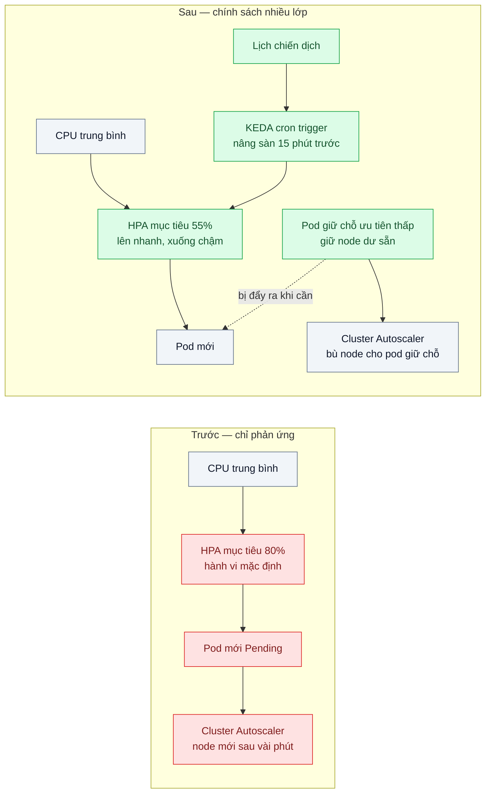
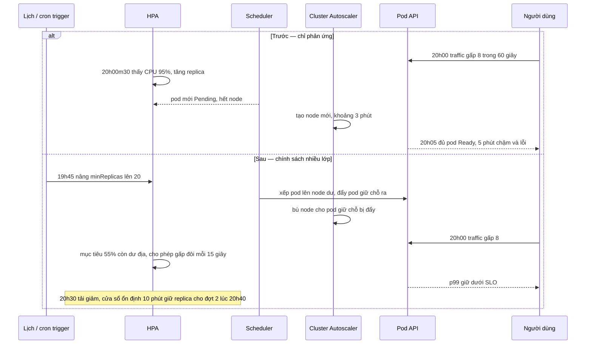

# Autoscaling Policies (target tracking, predictive, cooldown) — Autoscale phản ứng sau 5 phút, traffic đến trong 1 phút

| Scope | Mức độ | Trạng thái | Pattern gốc | Cập nhật |
|---|---|---|---|---|
| 18 · backend / vertical / horizontal scale | 🟡 Trung bình | 📋 Kế hoạch | HPA behavior (stabilization window, scaling policies) — Kubernetes docs; target tracking, scheduled & predictive scaling — AWS Auto Scaling docs | 2026-10-06 |

> **Một câu tóm tắt:** Autoscaling thuần phản ứng luôn đến sau traffic một chuỗi độ trễ; chính sách tốt ghép nhiều lớp — mục tiêu sử dụng có dư địa, scale lên nhanh và scale xuống chậm, nâng sẵn trước sự kiện đã biết, giữ node dư bằng pod giữ chỗ — để năng lực có mặt trước hoặc cùng lúc với đỉnh.

## 1. Bài toán thực tế (What)

**Bối cảnh** *(doanh nghiệp giả định, số liệu minh họa)*
Một ví điện tử gửi thông báo đẩy về chương trình hoàn tiền tới 3 triệu người dùng lúc 20h. Traffic API tăng từ khoảng 500 lên 4.000 request/giây trong 60 giây. API chạy trên Kubernetes với HPA theo CPU mục tiêu 80% (hành vi mặc định) và Cluster Autoscaler; thông báo được gửi thành 3 đợt cách nhau 20 phút.

**Triệu chứng người kinh doanh nhìn thấy**
- 5 phút đầu mỗi chiến dịch, app chậm và lỗi khoảng 15% thao tác; khách bấm vào thông báo rồi thoát, ngân sách marketing đổ vào lúc hệ thống tệ nhất.
- Giữa các đợt thông báo, số pod tăng giảm liên tục; đợt thứ hai lại chậm như đợt đầu.
- Đội marketing biết lịch chiến dịch từ một tuần trước nhưng hệ thống "không biết".

**Nguyên nhân kỹ thuật**
Năng lực mới đến sau một chuỗi độ trễ: chỉ số được thu thập và làm mượt, HPA đồng bộ định kỳ, pod mới Pending vì hết node, Cluster Autoscaler tạo node mất vài phút, kéo image, app khởi động, qua readiness — cộng lại khoảng 5 phút. Mục tiêu 80% gần như không có dư địa để chịu trong lúc chờ. Sau đỉnh, scale xuống ngay khi tải giảm nên đợt sau phải scale lại từ đầu.

**Ràng buộc**
- Không giữ cố định số pod cho đỉnh lớn nhất cả ngày (chi phí).
- Lịch chiến dịch có trước; vẫn có đỉnh bất ngờ không báo trước.
- Môi trường local không có node autoscaling thật; phải đo được phần độ trễ ở mức pod và mô phỏng phần node.

## 2. Vì sao dùng pattern này (Why)

**Nguyên nhân gốc mà pattern nhắm vào:** chính sách scale chỉ phản ứng, không có dư địa, đối xứng giữa lên và xuống, và bỏ qua thông tin đã biết trước.

**Pattern giải quyết thế nào:** AWS Auto Scaling mô tả *target tracking* (giữ chỉ số quanh một mục tiêu), *scheduled scaling* (đổi sàn/trần theo lịch), *predictive scaling* (dự báo từ lịch sử để scale trước) và thời gian làm mát/khởi động để tránh phản ứng thái quá. HPA của Kubernetes có tương đương: mục tiêu sử dụng, trường `behavior` với `stabilizationWindowSeconds` và các `policies` (theo số pod hoặc phần trăm mỗi khoảng thời gian) riêng cho scale lên và scale xuống; mặc định scale xuống có cửa sổ ổn định 300 giây. Ghép lại: hạ mục tiêu xuống khoảng 55% để có dư địa trong lúc chờ; scale lên mạnh (gấp đôi mỗi 15 giây) và scale xuống chậm (cửa sổ 10 phút, tối đa 10%/phút); nâng `minReplicas` 15 phút trước chiến dịch bằng trigger cron; giữ sẵn node trống bằng pod giữ chỗ ưu tiên thấp để pod thật đẩy ra khi cần.

**Lựa chọn khác đã cân nhắc**

| Lựa chọn | Giải quyết được gì | Vì sao không chọn (ở bài này) |
|---|---|---|
| Giữ nguyên + tối ưu nhỏ (chỉ hạ mục tiêu CPU xuống 50%) | Thêm dư địa | Tốn thêm cả ngày; không rút ngắn độ trễ tạo node; vẫn dao động giữa các đợt |
| Cố định số pod cho đỉnh lớn nhất | Không còn độ trễ | Trả tiền cho đỉnh suốt 24 giờ |
| Load shedding (bài 05) | Bảo vệ khi năng lực chưa kịp tới | Lưới an toàn, không thay được việc có năng lực đúng lúc |
| Queue-Based Load Leveling (bài 04) | Hấp thụ đỉnh cho việc bất đồng bộ | Thao tác người dùng bấm từ thông báo là đồng bộ |
| Chính sách nhiều lớp: mục tiêu có dư địa + hành vi bất đối xứng + nâng theo lịch + node dư sẵn — **chọn** | Năng lực có mặt trước đỉnh đã biết, phản ứng nhanh với đỉnh bất ngờ, hết dao động | Nhiều tham số cần hiệu chỉnh; tốn thêm chi phí cho dư địa và node chờ |

## 3. Thiết kế hệ thống (How)

### 3.1 Kiến trúc trước và sau



### 3.2 Luồng chính — chiến dịch 20h, trước và sau



### 3.3 Thành phần và trách nhiệm

| Thành phần | Trách nhiệm | Quyết định thiết kế đáng chú ý |
|---|---|---|
| HPA `autoscaling/v2` | Target tracking theo CPU với mục tiêu 55% | Mục tiêu suy ra từ năng lực an toàn một pod (bài 07) và mức tăng tối đa trong thời gian chờ năng lực |
| `behavior.scaleUp` | Không cửa sổ ổn định; cho phép +100% hoặc +10 pod mỗi 15 giây, chọn mức lớn hơn | Phản ứng nhanh với đỉnh bất ngờ |
| `behavior.scaleDown` | Cửa sổ ổn định 600 giây, tối đa giảm 10% mỗi phút | Hết dao động giữa các đợt thông báo |
| KEDA cron trigger (hoặc CronJob sửa `minReplicas`) | Nâng sàn trước sự kiện đã biết, hạ lại sau | Lịch lấy từ lịch marketing, có người chịu trách nhiệm cập nhật |
| Pod giữ chỗ ưu tiên thấp | Giữ node dư để pod thật không phải chờ node mới | `PriorityClass` âm; pod thật đẩy chúng ra ngay (cần xác minh cấu hình khuyến nghị của Cluster Autoscaler) |
| Tối ưu khởi động | Image nhỏ, startup probe sát thực tế | Mỗi giây khởi động bớt được là một giây ít cần dư địa |

### 3.4 Điểm dễ sai khi triển khai
- Chỉnh HPA rất nhạy mà quên phần lớn độ trễ nằm ở tạo node và khởi động pod → HPA quyết định nhanh nhưng pod vẫn Pending.
- Scale lên và xuống đối xứng → dao động liên tục, mỗi đợt tải mới lại trả chi phí khởi động.
- Lịch nâng sàn không có người chịu trách nhiệm → chiến dịch đổi giờ mà cron vẫn chạy giờ cũ.
- Đặt `maxReplicas` theo cảm tính → đỉnh lớn chạm trần im lặng; trần lấy từ kế hoạch công suất và giới hạn của DB.
- Đo "thời gian đủ năng lực" bằng lúc HPA đổi số mong muốn thay vì lúc pod Ready và nhận traffic.

## 4. Tech stack và tác động (Impact techstack)

| Lớp | Công nghệ chọn | Vì sao chọn | Thay thế tương đương |
|---|---|---|---|
| Cluster local | k3d, thêm node bằng `k3d node create` theo script có độ trễ để mô phỏng tạo node | Bài cần HPA nên dùng Kubernetes thay cho NGINX thuần của các bài khác trong scope; độ trễ node cloud chỉ mô phỏng được | kind |
| Autoscaling | HPA `autoscaling/v2` với `behavior`; KEDA cron trigger cho lịch | HPA có sẵn; KEDA cho lịch gọn hơn CronJob tự viết | CronJob + `kubectl patch` |
| Node autoscaling (production) | Cluster Autoscaler hoặc Karpenter + pod giữ chỗ ưu tiên thấp | Rút ngắn phần độ trễ lớn nhất | AWS predictive scaling cho nhóm máy ảo |
| Ứng dụng | Fastify, TypeScript strict, Node 20, độ trễ khởi động cấu hình được | Tái hiện chuỗi độ trễ | NestJS |
| Đo | k6 `ramping-arrival-rate` tăng gấp 8 trong 60 giây, 3 đợt; Prometheus + kube-state-metrics | Thời gian đủ năng lực, p99, số lần đổi replica | — |

**Thay đổi so với hệ thống hiện tại:** sửa HPA (mục tiêu, `behavior`), thêm trigger theo lịch nối với lịch marketing, thêm pod giữ chỗ và `PriorityClass`, tối ưu thời gian khởi động. Đội vận hành học đọc "chuỗi độ trễ năng lực" và hiệu chỉnh tham số theo số đo.

## 5. Kết quả đầu ra và cách đo (Output impact)

| Chỉ số | Trước (minh họa) | Mục tiêu khi thực hành | Cách đo |
|---|---|---|---|
| Thời gian từ khi traffic tăng tới khi đủ pod Ready (mức pod, local) | 5 phút | < 60 giây; với sự kiện có lịch là 0 | So thời điểm bắt đầu đợt k6 với `kube_deployment_status_replicas_available` trên Prometheus |
| p99 trong 5 phút đầu mỗi đợt | 8 giây | < 500 ms | k6 `http_req_duration` p99 theo cửa sổ thời gian |
| Tỷ lệ lỗi trong đợt tăng | 15% | < 0,5% | k6 `http_req_failed` |
| Số lần đổi số replica mỗi giờ khi có 3 đợt | 24 | ≤ 6 | Đếm thay đổi của số replica mong muốn do kube-state-metrics xuất (cần xác minh tên chỉ số) |
| Pod-giờ trong kịch bản 24 giờ rút gọn | Mốc phương án cố định cho đỉnh | Thấp hơn rõ rệt | Tích phân `sum(kube_deployment_status_replicas)` |

> Số "trước" là minh họa để hình dung bài toán. Số "mục tiêu" chỉ được coi là đạt khi có số đo thật
> ở mục 8 kèm môi trường đo.

**Tác động nghiệp vụ mong đợi:** người dùng bấm vào thông báo gặp app nhanh như lúc thường; ngân sách marketing không bị đốt vào 5 phút hệ thống chậm; chi phí hạ tầng vẫn bám theo tải.

## 6. Đánh đổi và khi KHÔNG nên dùng

**Đánh đổi**
- Mục tiêu có dư địa và node giữ chỗ là chi phí trả thường xuyên cho khả năng chịu đỉnh.
- Nhiều tham số tương tác nhau; hiệu chỉnh sai có thể tệ hơn mặc định.
- Nâng sàn theo lịch phụ thuộc quy trình phối hợp với bộ phận kinh doanh.

**Không nên dùng khi**
- Tải phẳng hoặc tăng chậm trong nhiều giờ: hành vi mặc định của HPA đủ dùng.
- Nút thắt là DB hay dịch vụ không co giãn: scale pod nhanh hơn chỉ đẩy tải xuống nút thắt nhanh hơn; xem bài 04, 05, 07.
- Ứng dụng khởi động vài phút và không rút ngắn được: ưu tiên giữ năng lực nền cao và nâng theo lịch thay vì phản ứng.

**Liên quan**
- [../07-capacity-planning-use-method-mua-may-bao-nhieu-cho-tet/](../07-capacity-planning-use-method-mua-may-bao-nhieu-cho-tet/) — nơi lấy mục tiêu sử dụng, sàn và trần.
- [../05-load-shedding-qua-tai-thi-tu-choi-mot-phan-thay-vi-sap-het/](../05-load-shedding-qua-tai-thi-tu-choi-mot-phan-thay-vi-sap-het/) — lưới an toàn khi đỉnh đến nhanh hơn mọi chính sách.
- [../01-stateless-session-externalized-login-server-a-server-b-khong-biet/](../01-stateless-session-externalized-login-server-a-server-b-khong-biet/) — điều kiện để thêm bớt pod tự do.
- [../../16-backend-k8s/03-requests-limits-hpa-9h-sang-traffic-gap-5/](../../16-backend-k8s/03-requests-limits-hpa-9h-sang-traffic-gap-5/) — nền tảng requests và HPA.
- [../../16-backend-k8s/09-keda-scale-worker-theo-do-dai-hang-doi/](../../16-backend-k8s/09-keda-scale-worker-theo-do-dai-hang-doi/) — KEDA và trigger cron.
- [../../17-backend-docker/01-multi-stage-build-image-1-8gb-deploy-10-phut/](../../17-backend-docker/01-multi-stage-build-image-1-8gb-deploy-10-phut/) — image nhỏ rút ngắn thời gian kéo image.

## 7. Cơ sở tham khảo

- Kubernetes docs, "Horizontal Pod Autoscaling" — https://kubernetes.io/docs/tasks/run-application/horizontal-pod-autoscale/ — `behavior`, `stabilizationWindowSeconds`, `policies`, `selectPolicy`, hành vi mặc định.
- AWS EC2 Auto Scaling docs, "Target tracking scaling policies" — https://docs.aws.amazon.com/autoscaling/ec2/userguide/as-scaling-target-tracking.html (cần xác minh URL) — giữ chỉ số quanh mục tiêu, thời gian khởi động instance.
- AWS EC2 Auto Scaling docs, "Predictive scaling" và "Scheduled scaling" — https://docs.aws.amazon.com/autoscaling/ (cần xác minh đường dẫn từng trang) — scale trước theo dự báo và theo lịch.
- KEDA docs, scaler "Cron" — https://keda.sh/docs/ — nâng sàn replica theo lịch.
- Kubernetes docs, "Pod Priority and Preemption" — https://kubernetes.io/docs/concepts/scheduling-eviction/pod-priority-preemption/ — cơ chế để pod giữ chỗ bị đẩy ra.
- Kubernetes Cluster Autoscaler FAQ, mục overprovisioning — https://github.com/kubernetes/autoscaler/blob/master/cluster-autoscaler/FAQ.md (cần xác minh mục) — giữ node dư bằng pod ưu tiên thấp.

## 8. Kế hoạch thực hành

- [ ] Bước 1: k3d 2 node, API Fastify khởi động 30 giây, HPA mục tiêu 80% hành vi mặc định; script thêm node sau 3 phút khi có pod Pending để mô phỏng Cluster Autoscaler.
- [ ] Bước 2: Đo "trước": k6 3 đợt, mỗi đợt tăng gấp 8 trong 60 giây; ghi thời gian đủ năng lực, p99, lỗi, số lần đổi replica.
- [ ] Bước 3: Áp dụng chính sách: mục tiêu 55%, `behavior` bất đối xứng, KEDA cron nâng sàn trước đợt 1, pod giữ chỗ với `PriorityClass` âm.
- [ ] Bước 4: Đo "sau" cùng kịch bản, thêm một đợt bất ngờ không có lịch; ghi vào mục 5 kèm môi trường.
- [ ] Bước 5: Test (script kịch bản): trước giờ chiến dịch đã đủ sàn; đợt bất ngờ đạt đủ pod trong 60 giây; giữa hai đợt cách 20 phút replica không giảm quá 10%/phút; pod giữ chỗ bị đẩy ra khi pod thật cần chỗ.

**Cấu trúc code dự kiến**
```text
src/server.ts                       # API có độ trễ khởi động cấu hình được
k8s/
  before/hpa-default.yaml
  after/hpa-behavior.yaml           # mục tiêu 55%, lên nhanh, xuống chậm
  after/scaled-object-cron.yaml     # KEDA cron nâng sàn
  after/placeholder-pods.yaml       # PriorityClass âm, pod giữ chỗ
scripts/simulate-node-provisioning.sh
bench/campaign-waves.k6.js          # 3 đợt + 1 đợt bất ngờ
```

**Cách chạy** *(điền khi bắt đầu code)*
```bash
k3d cluster create autoscale --agents 1
kubectl apply -f k8s/after/
k6 run bench/campaign-waves.k6.js & ./scripts/simulate-node-provisioning.sh
```
