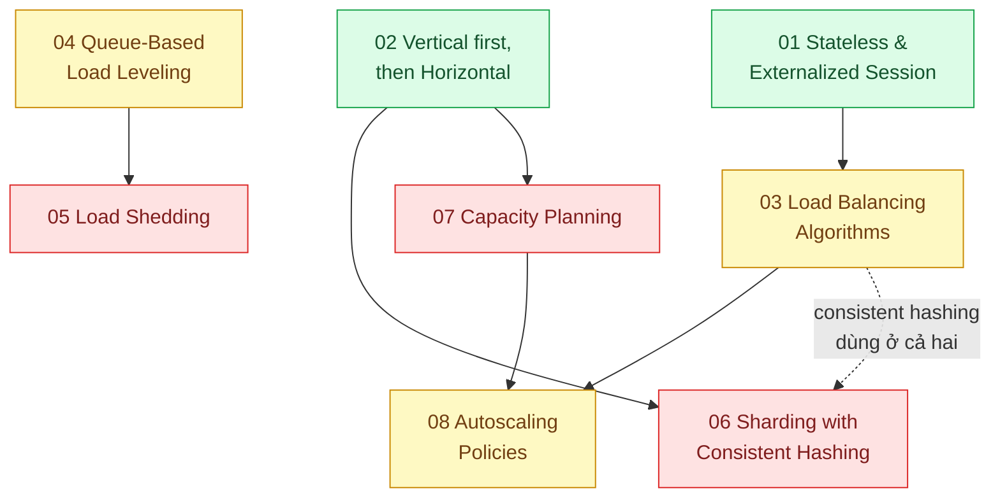

# 18 · Mở rộng dọc và ngang (`backend / vertical / horizontal scale`)

> **Phạm vi:** Chiến lược tăng khả năng chịu tải: stateless hóa, thứ tự scale up/out, cân bằng tải,
> san phẳng đỉnh bằng queue, giảm tải có kiểm soát, phân mảnh, lập kế hoạch công suất, chính sách
> autoscale. Công cụ cụ thể trên Kubernetes thuộc scope 16; cache và DB thuộc scope 02/03.
>
> **Câu hỏi trung tâm:** Nâng máy hay thêm máy, theo thứ tự nào, và làm gì khi tải vượt mọi dự tính?

## Bản đồ pattern trong scope

## Danh sách bài toán

| # | Bài toán (pattern — triệu chứng) | Mức | Pattern gốc / nguồn | Trạng thái |
|---|---|---|---|---|
| 01 | [Stateless Service & Externalized Session — Login ở server A, request sau vào server B bị văng ra](./01-stateless-session-externalized-login-server-a-server-b-khong-biet/) | 🟢 | 12factor.net "Processes"; Fowler, *PoEAA*: Client / Server / Database Session State; Redis docs | 📋 |
| 02 | [Vertical first, then Horizontal — DB CPU 90%: nâng máy hay thêm máy? Thang scale theo thứ tự](./02-scale-up-truoc-hay-scale-out-db-cpu-90/) | 🟢 | AWS Well-Architected (Performance Efficiency); DDIA ch.1 (scalability), ch.5–6 | 📋 |
| 03 | [Load Balancing Algorithms — Một server quá tải trong khi 3 server khác rảnh vì round-robin với request không đều](./03-load-balancing-mot-server-qua-tai-cac-server-khac-ranh/) | 🟡 | NGINX docs "HTTP Load Balancing" (round robin, least_conn, hash); Karger et al., "Consistent Hashing" (1997) | 📋 |
| 04 | [Queue-Based Load Leveling — Đỉnh 20h gấp 20 lần bình thường trong 10 phút, mua máy cho đỉnh thì lãng phí](./04-queue-based-load-leveling-dinh-20h-flash-sale/) | 🟡 | Azure "Queue-Based Load Leveling"; Little, "A Proof for the Queuing Formula L = λW" (1961) | 📋 |
| 05 | [Load Shedding & Graceful Degradation — Quá tải thì từ chối 20% request thay vì sập 100%](./05-load-shedding-qua-tai-thi-tu-choi-mot-phan-thay-vi-sap-het/) | 🔴 | Google SRE Book ch.21 "Handling Overload", ch.22 "Addressing Cascading Failures"; Amazon Builders' Library "Using load shedding to avoid overload" | 📋 |
| 06 | [Sharding with Consistent Hashing — Dữ liệu vượt một máy; chia theo khách hàng mà thêm máy không phải chia lại hết](./06-sharding-consistent-hashing-mot-db-khong-chua-noi-du-lieu/) | 🔴 | DDIA ch.6; Karger et al. (1997); DeCandia et al., "Dynamo" (SOSP 2007); Citus / Vitess docs | 📋 |
| 07 | [Capacity Planning (USE method, Little's law) — Mua bao nhiêu máy cho mùa Tết? Hiện tại đoán mò](./07-capacity-planning-use-method-mua-may-bao-nhieu-cho-tet/) | 🔴 | Brendan Gregg, "The USE Method"; Google SRE Book (capacity planning); Little's law | 📋 |
| 08 | [Autoscaling Policies (target tracking, predictive, cooldown) — Autoscale phản ứng sau 5 phút, traffic đến trong 1 phút](./08-autoscaling-policy-scale-cham-hon-traffic/) | 🟡 | Kubernetes HPA docs (behavior, stabilization window); AWS Auto Scaling docs (target tracking, predictive scaling) | 📋 |

## Lộ trình đề xuất trong scope

1. **Stateless** — điều kiện tiên quyết của scale ngang.
2. **Vertical first** — hiểu "thang scale" để không nhảy cóc sang sharding.
3. **Load balancing → Autoscaling policies** — phân phối và co giãn.
4. **Queue-based load leveling → Load shedding** — hai cách đối phó đỉnh: hấp thụ và từ chối.
5. **Sharding, Capacity planning** — nâng cao; cần dữ liệu đo thật từ scope 23.

## Kiến thức nền cần có trước

- Scope 23 bài 01, 04 (golden signals, percentiles) để đo trước khi scale.
- Redis cho session store; Kubernetes HPA (scope 16 bài 03).
- Queue cơ bản (scope 14 bài 01).

## Liên kết với scope khác

- `02-backend-database` bài 03, 05, 09 — pool, replica, partition là các bậc scale DB.
- `03-backend-cache` — cache là bậc scale đọc rẻ nhất.
- `16-backend-k8s` — HPA/KEDA cài đặt chính sách.
- `23-backend-monitoring-benchmark` — load testing để tìm giới hạn thật.

## Nguồn tổng quan cho scope

- Google, *Site Reliability Engineering* (2016), ch.21–22.
- Martin Kleppmann, *DDIA* ch.1, 5, 6.
- Amazon Builders' Library — https://aws.amazon.com/builders-library/
