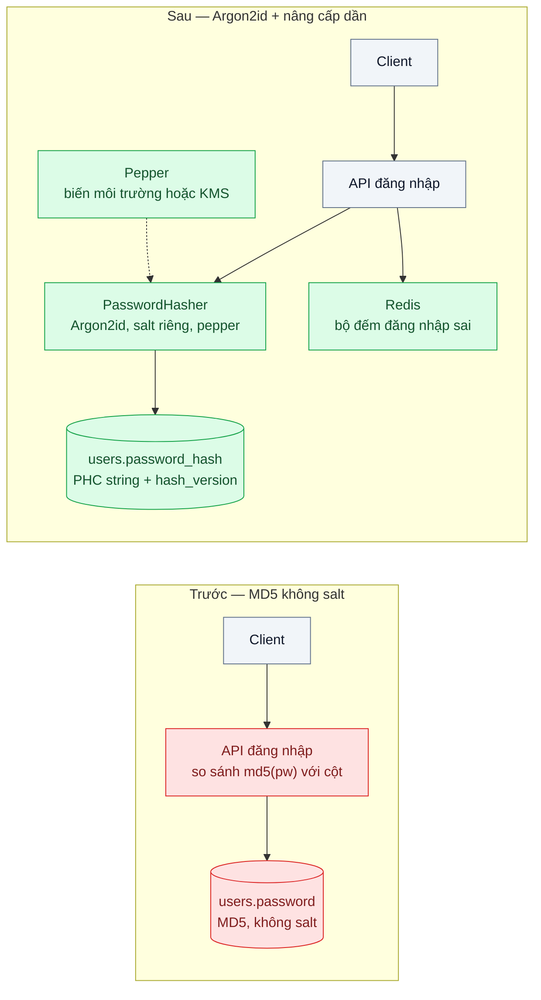
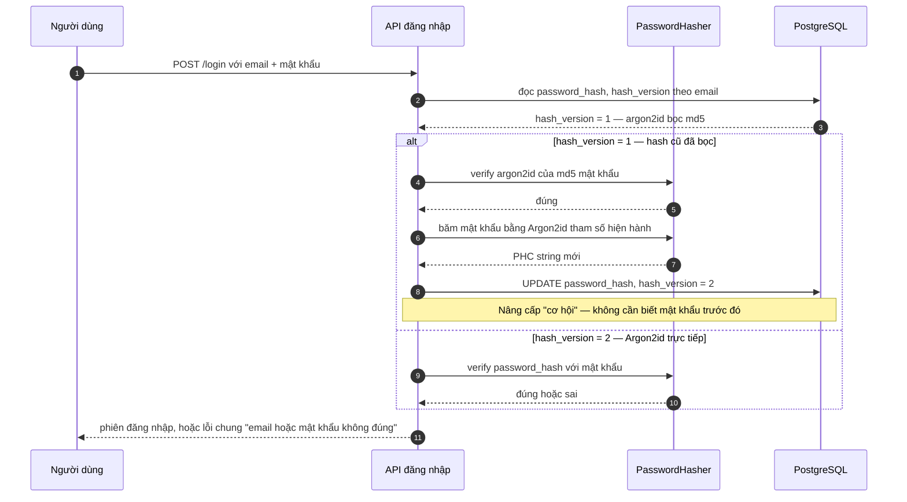

# Password Hashing (Argon2id / bcrypt) — Lộ DB là lộ toàn bộ mật khẩu vì lưu MD5

| Scope | Mức độ | Trạng thái | Pattern gốc | Cập nhật |
|---|---|---|---|---|
| 19 · backend / frontend / authenticate | 🟢 Cơ bản | 📋 Kế hoạch | Argon2id — RFC 9106 (2021); OWASP "Password Storage Cheat Sheet" | 2026-10-06 |

> **Một câu tóm tắt:** Lưu mật khẩu bằng hàm băm chuyên dụng, chậm và tốn bộ nhớ (Argon2id, dự phòng bcrypt) với salt riêng từng người, để một bản sao DB bị lộ không biến thành danh sách mật khẩu dùng được — và nâng cấp hash cũ dần theo từng lần đăng nhập mà không cần biết mật khẩu gốc.

## 1. Bài toán thực tế (What)

**Bối cảnh** *(doanh nghiệp giả định, số liệu minh họa)*
Sàn thương mại điện tử 1,8 triệu tài khoản, hệ thống viết từ 2015, cột `users.password` lưu `MD5(mật khẩu)` không salt — "hồi đó ai cũng làm thế". Một bản backup DB bị lộ qua bucket lưu trữ cấu hình sai quyền. Ba ngày sau, diễn đàn rao bán "1,8 triệu email + mật khẩu dạng rõ" của sàn.

**Triệu chứng người kinh doanh nhìn thấy**
- Khách báo bị đăng nhập lạ, đổi địa chỉ nhận hàng, tiêu điểm tích lũy; đội chăm sóc khách hàng nhận ~300 ticket/ngày trong tuần đầu.
- Phải ép 1,8 triệu người đổi mật khẩu cùng lúc; tỷ lệ quay lại sau sự cố sụt, phát sinh chi phí truyền thông và pháp lý.
- Khách dùng lại mật khẩu ở ngân hàng/ví điện tử bị thiệt hại ở nơi khác và quy trách nhiệm cho sàn — rủi ro uy tín lớn hơn thiệt hại trực tiếp.

**Nguyên nhân kỹ thuật**
MD5 là hàm băm thiết kế để *nhanh*: phần cứng phổ thông thử được hàng tỷ ứng viên mỗi giây. Không có salt nên hai người cùng mật khẩu có cùng hash, và bảng tra sẵn (rainbow table) dùng được cho mọi tài khoản. Hậu quả: có file hash là coi như có mật khẩu rõ của phần lớn người dùng chỉ sau vài giờ.

**Ràng buộc**
- Không có mật khẩu gốc để băm lại hàng loạt; chỉ "gặp" mật khẩu khi người dùng đăng nhập.
- Đăng nhập không được chậm thêm quá ~300 ms ở p95; API chạy trên pod 1 vCPU / 1 GB RAM (minh họa).
- Phải tương thích luồng đăng nhập và đặt lại mật khẩu hiện tại; không ép đổi mật khẩu toàn bộ lần thứ hai.

## 2. Vì sao dùng pattern này (Why)

**Nguyên nhân gốc mà pattern nhắm vào:** chi phí để kẻ tấn công *thử một mật khẩu* quá rẻ, và một lần thử đúng cho một người lại áp dụng được cho mọi người có cùng mật khẩu.

**Pattern giải quyết thế nào:** dùng *password hashing function* — hàm băm có tham số chi phí điều chỉnh được (bộ nhớ, số vòng, độ song song) và salt ngẫu nhiên riêng từng tài khoản. Argon2id (RFC 9106) là hàm *memory-hard*: mỗi lần tính cần vài chục MiB RAM, nên GPU/ASIC không còn lợi thế hàng nghìn lần như với MD5; bcrypt là phương án dự phòng đã được kiểm chứng lâu năm khi không dùng được Argon2. Chuỗi hash lưu kèm thuật toán và tham số (dạng PHC string `$argon2id$v=19$m=...,t=...,p=...$salt$hash`) nên có thể tăng chi phí theo thời gian và nhận ra hash "cũ" cần nâng cấp. Với dữ liệu MD5 đang có, OWASP mô tả hai cách bổ sung nhau: *bọc* ngay toàn bộ (`argon2id(md5_cũ)`) để đóng lỗ hổng tức thời, rồi *băm lại* bằng mật khẩu thật ở lần đăng nhập kế tiếp.

**Lựa chọn khác đã cân nhắc**

| Lựa chọn | Giải quyết được gì | Vì sao không chọn (ở bài này) |
|---|---|---|
| Giữ nguyên + tối ưu nhỏ (thêm salt vào MD5, ép mật khẩu dài hơn) | Vô hiệu rainbow table; cùng mật khẩu khác hash | MD5 có salt vẫn thử được hàng tỷ lần/giây; chỉ kéo thời gian bẻ từ giờ sang ngày |
| SHA-256 lặp nhiều vòng tự chế | Chậm hơn MD5 | Không memory-hard, tự thiết kế dễ sai; đã có PBKDF2/bcrypt/Argon2 được phân tích công khai |
| bcrypt | Chậm, có salt, thư viện mọi ngôn ngữ | Vẫn là dự phòng tốt; nhược điểm: giới hạn 72 byte đầu vào, không memory-hard |
| scrypt | Memory-hard, có sẵn trong `node:crypto` | Tham số khó chỉnh hơn Argon2id; OWASP xếp sau Argon2id |
| Ép toàn bộ người dùng đặt lại mật khẩu, giữ MD5 | Vô hiệu dữ liệu đã lộ | Không sửa cách lưu — lần lộ sau lặp lại y nguyên |
| Bỏ mật khẩu: chỉ đăng nhập qua Google/Zalo hoặc passkey | Không còn hash để lộ | Không áp được cho toàn bộ khách hiện tại; là hướng dài hạn ở bài 03 và 08 |

## 3. Thiết kế hệ thống (How)

### 3.1 Kiến trúc trước và sau



### 3.2 Luồng chính



### 3.3 Thành phần và trách nhiệm

| Thành phần | Trách nhiệm | Quyết định thiết kế đáng chú ý |
|---|---|---|
| `PasswordHasher` | `hash`, `verify`, `needsRehash` bọc thư viện Argon2id | Tham số đặt ở một chỗ, đọc từ cấu hình; đo lại trên máy đích mỗi khi đổi hạ tầng |
| `LegacyHashAdapter` | Xác minh hash_version = 1 bằng `argon2id(md5(pw))` | Chỉ tồn tại trong giai đoạn di trú; xóa khi tài khoản hoạt động đã nâng cấp hết |
| Migration một lần | Bọc toàn bộ hash MD5 hiện có bằng Argon2id | Chạy theo lô, tiếp tục được khi gián đoạn; đóng lỗ hổng ngay đêm đầu |
| Pepper | Khóa bí mật ngoài DB trộn vào trước khi băm (HMAC) hoặc mã hóa hash sau khi băm | Lộ DB mà không lộ pepper thì hash vô dụng; xoay pepper cần kế hoạch riêng |
| Bộ đếm đăng nhập sai (Redis) | Giới hạn thử mật khẩu online theo tài khoản và IP | Hash chậm chỉ bảo vệ offline; online phải có throttling (scope 13 bài 03) |
| Cột `hash_version` | Cho biết tài khoản nào còn hash cũ | Đo tiến độ di trú bằng một câu SQL |

### 3.4 Điểm dễ sai khi triển khai
- Lấy tham số mặc định của thư viện rồi không đo trên máy đích: pod 1 vCPU có thể mất 1–2 giây/hash, tự làm DoS khi 50 người đăng nhập cùng lúc. Đo trước, chọn tham số cho ~100–300 ms.
- Tính hash trong event loop của Node làm chặn toàn bộ request khác. Thư viện `argon2` chạy trên threadpool của libuv; vẫn cần giới hạn số hash đồng thời.
- Dùng bcrypt mà quên giới hạn 72 byte: phần sau của mật khẩu dài bị bỏ qua âm thầm. Argon2id không có giới hạn này.
- Thông báo lỗi khác nhau cho "email không tồn tại" và "sai mật khẩu" làm lộ danh sách tài khoản; thời gian phản hồi cũng phải tương đương (băm một hash giả khi email không tồn tại).
- Tự so sánh hash bằng `===` thay vì dùng `verify` của thư viện (so sánh thời gian cố định).
- Cắt ngắn mật khẩu hoặc cấm ký tự đặc biệt "cho an toàn": giảm entropy mà không có lợi gì cho hash.
- Quên đưa luồng *đặt lại mật khẩu* và *đổi mật khẩu* qua cùng `PasswordHasher` — hash mới sinh vẫn theo cách cũ.

## 4. Tech stack và tác động (Impact techstack)

| Lớp | Công nghệ chọn | Vì sao chọn | Thay thế tương đương |
|---|---|---|---|
| Ngôn ngữ / runtime | TypeScript strict, Node 20+ | Stack mặc định của repo | — |
| HTTP app | NestJS | Module `auth` tách riêng, DI để thay hasher trong test | Fastify thuần |
| Hàm băm | `argon2` (node-argon2, binding C của libargon2) | Argon2id theo RFC 9106; chạy ngoài event loop; xuất PHC string | `bcrypt` (npm) khi không build được binding native; `crypto.scrypt` có sẵn trong Node |
| Dữ liệu | PostgreSQL 16 | Cột `password_hash text`, `hash_version smallint`; migration theo lô | MySQL/MariaDB |
| Giới hạn thử | Redis 7 | Bộ đếm đăng nhập sai với TTL | Bảng PostgreSQL nếu lưu lượng nhỏ |
| Đo | Script benchmark Node, k6, Vitest | Đo thời gian hash theo tham số; đo p95 đăng nhập dưới tải; test hành vi | — |
| Hạ tầng local | Docker Compose | Dựng Postgres + Redis một lệnh | — |

**Thay đổi so với hệ thống hiện tại:** thêm module `PasswordHasher` và adapter hash cũ; thêm cột `hash_version`; một migration bọc toàn bộ hash cũ; đội vận hành học cách đo và chỉnh tham số Argon2 khi đổi loại máy, cách quản lý và xoay pepper.

## 5. Kết quả đầu ra và cách đo (Output impact)

| Chỉ số | Trước (minh họa) | Mục tiêu khi thực hành | Cách đo |
|---|---|---|---|
| Chi phí thử 1 ứng viên mật khẩu offline | MD5: hàng tỷ lần/giây trên GPU phổ thông | Argon2id: ~100 ms CPU + hàng chục MiB RAM mỗi lần, GPU không tăng tốc đáng kể | Benchmark Node đo `hash` 1.000 lần với tham số đã chọn, ghi rõ CPU/RAM máy đo |
| Hai tài khoản cùng mật khẩu → hash giống nhau | Có | Không | Test Vitest: băm cùng mật khẩu hai lần, kết quả khác nhau |
| Thời gian `verify` p95 trên máy đích | ~0 ms | 100–300 ms | Benchmark trên pod cùng cấu hình production |
| Độ trễ `POST /login` p95 với 50 người đăng nhập đồng thời | ~40 ms | ≤ trước + 300 ms, không timeout | k6, kịch bản 50 VU trong 2 phút |
| Tài khoản còn hash cũ sau 30 / 90 ngày | 100% | Theo dõi giảm dần | `SELECT hash_version, count(*) FROM users GROUP BY 1` |
| Số lần thử sai liên tiếp trước khi bị chặn | Vô hạn | 10 lần / 15 phút theo tài khoản | Test tích hợp gửi 11 request sai, request thứ 11 nhận 429 |

> Số "trước" là minh họa để hình dung bài toán. Số "mục tiêu" chỉ được coi là đạt khi có số đo thật
> ở mục 8 kèm môi trường đo.

**Tác động nghiệp vụ mong đợi:** một lần lộ DB không còn đồng nghĩa với mất toàn bộ tài khoản — chi phí bẻ từng mật khẩu đủ cao để phần lớn người dùng kịp đổi; sàn tránh được đợt ép đổi mật khẩu diện rộng và các khiếu nại dây chuyền.

## 6. Đánh đổi và khi KHÔNG nên dùng

**Đánh đổi**
- Đăng nhập tốn CPU/RAM thật: 100 ms × số đăng nhập mỗi giây là tải phải tính vào quy mô pod; kẻ tấn công có thể dùng chính endpoint đăng nhập để gây DoS nếu không throttling.
- Binding native (`argon2`) phức tạp hóa Docker image và CI; phải có phương án bcrypt.
- Giai đoạn di trú có hai định dạng hash song song; tài khoản không hoạt động lâu không bao giờ được nâng cấp — cần chính sách (ép đặt lại sau N tháng).
- Pepper mang thêm một bí mật phải quản lý; mất pepper là mất khả năng xác minh toàn bộ.

**Không nên dùng khi**
- Hệ thống không lưu mật khẩu: đăng nhập hoàn toàn qua IdP/SSO (bài 07) hoặc passkey (bài 08).
- Giá trị cần lưu là bí mật ngẫu nhiên entropy cao do máy sinh (API key, refresh token, session id): SHA-256 đơn thuần là đủ và nhanh hơn nhiều (bài 04, bài 10).
- Cần kiểm tra "mật khẩu này có trong danh sách đã lộ không" cho hàng triệu bản ghi — đó là bài toán tra cứu theo hash tiền tố, không phải slow hash.

**Liên quan**
- [Bài 02 — Session Cookie vs JWT](../02-session-cookie-vs-jwt-spa-luu-token-o-dau/) — bước tiếp theo sau khi xác minh mật khẩu.
- [Bài 08 — MFA: TOTP & Passkeys](../08-mfa-totp-webauthn-passkey-tai-khoan-ke-toan-bi-chiem/) — khi mật khẩu đúng vẫn chưa đủ.
- [Scope 13 bài 03 — Rate Limiting & Throttling](../../13-backend-transporter/03-rate-limiting-mot-khach-api-goi-10k-req-s/) — giới hạn thử mật khẩu online.

## 7. Cơ sở tham khảo

- OWASP Cheat Sheet Series, "Password Storage Cheat Sheet" — https://cheatsheetseries.owasp.org/cheatsheets/Password_Storage_Cheat_Sheet.html — thứ tự ưu tiên Argon2id, scrypt, bcrypt, PBKDF2; tham số tối thiểu khuyến nghị; pepper; cách nâng cấp hash cũ bằng bọc và băm lại khi đăng nhập.
- Biryukov, Dinu, Khovratovich, Josefsson, RFC 9106, *Argon2 Memory-Hard Function for Password Hashing and Proof-of-Work Applications*, 2021 — https://www.rfc-editor.org/rfc/rfc9106 — đặc tả Argon2id và khuyến nghị tham số theo tài nguyên sẵn có.
- node-argon2, thư viện `argon2` cho Node.js — https://github.com/ranisalt/node-argon2 — API băm/xác minh, định dạng PHC string, hành vi chạy trên threadpool dùng ở mục 4.
- NestJS docs, "Authentication" — https://docs.nestjs.com/security/authentication — cấu trúc module auth dùng cho phần thực hành.

## 8. Kế hoạch thực hành

- [ ] Bước 1: dựng Postgres + Redis; seed 10.000 user với MD5 không salt (`src/truoc/`); viết script "kẻ tấn công" thử từ điển 100k mật khẩu phổ biến lên file hash, ghi tỷ lệ bẻ được.
- [ ] Bước 2: đo "trước": thời gian thử mỗi ứng viên, p95 `/login` bằng k6, số tài khoản bẻ được.
- [ ] Bước 3: áp dụng pattern: `PasswordHasher` Argon2id (chọn tham số bằng benchmark trên máy đích), migration bọc hash cũ, nâng cấp khi đăng nhập, bộ đếm sai trong Redis.
- [ ] Bước 4: đo "sau" cùng kịch bản, chạy lại script tấn công trên file hash mới, ghi vào mục 5 kèm môi trường.
- [ ] Bước 5: test Vitest: cùng mật khẩu cho hash khác; hash cũ đăng nhập đúng thì `hash_version` thành 2; sai 11 lần thì 429; mật khẩu 100 ký tự không bị cắt.

**Cấu trúc code dự kiến**
```text
src/
  truoc/login-md5.ts            # tái hiện cách lưu cũ
  sau/password-hasher.ts        # [PATTERN] Argon2id + PHC string + kiểm tra cần băm lại
  sau/legacy-hash-adapter.ts    # xác minh argon2id(md5) trong giai đoạn di trú
  sau/login.service.ts          # xác minh, nâng cấp cơ hội, bộ đếm sai
  shared/db.ts
  shared/redis.ts
bench/
  hash-params.bench.ts          # đo thời gian hash theo m, t, p
  login.k6.js
  crack-dictionary.ts           # script "tấn công" offline để so sánh trước/sau
test/
  password-hasher.test.ts
  login-upgrade.test.ts
docker-compose.yml
```

**Cách chạy** *(điền khi bắt đầu code)*
```bash
docker compose up -d
pnpm install && pnpm test
```
