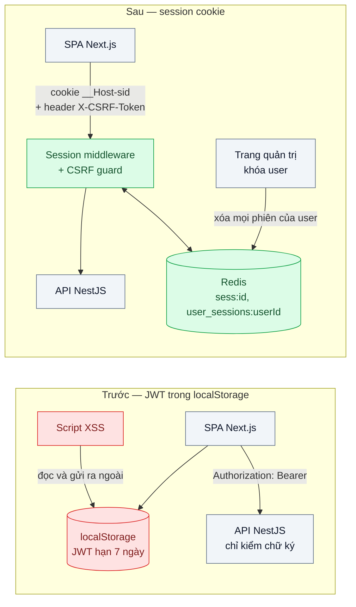
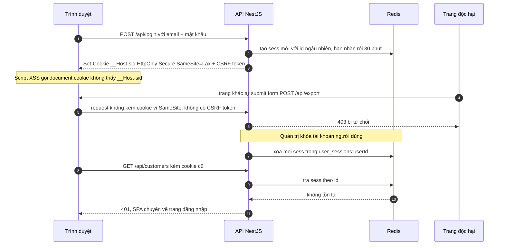

# Session Cookie vs JWT — SPA + API: lưu token ở localStorage (XSS) hay cookie (CSRF)?

| Scope | Mức độ | Trạng thái | Pattern gốc | Cập nhật |
|---|---|---|---|---|
| 19 · backend / frontend / authenticate | 🟢 Cơ bản | ✅ Hoàn thành | Server-side Session + HttpOnly Cookie — OWASP "Session Management" & "CSRF Prevention" cheat sheets; RFC 7519, RFC 8725 | 2026-10-09 |

> **Một câu tóm tắt:** Thay JWT sống 7 ngày nằm trong `localStorage` bằng session id ngẫu nhiên trong cookie `HttpOnly; Secure; SameSite` trỏ tới phiên lưu ở Redis, kèm chống CSRF — để script độc không mang được "chìa khóa" đi, và khóa tài khoản là phiên chết ngay ở request kế tiếp.

## 1. Bài toán thực tế (What)

**Bối cảnh** *(doanh nghiệp giả định, số liệu minh họa)*
SaaS B2B quản lý khách hàng (CRM) cho khoảng 600 doanh nghiệp, 9.000 người dùng. Frontend là SPA Next.js, gọi API NestJS. Sau khi đăng nhập, API trả JWT ký HS256, hạn 7 ngày; SPA lưu vào `localStorage` và gắn header `Authorization: Bearer` cho mọi request. "Đăng xuất" chỉ là xóa `localStorage`.

**Triệu chứng người kinh doanh nhìn thấy**
- Một ô "ghi chú khách hàng" cho nhập rich text bị chèn script; ai mở hồ sơ đó là token bị gửi ra ngoài. 37 tài khoản bị đọc danh sách khách hàng trong 4 ngày trước khi phát hiện.
- Khách doanh nghiệp cho một nhân viên kinh doanh nghỉ việc, khóa tài khoản trên CRM, nhưng người đó vẫn xuất được file khách hàng thêm 6 ngày.
- Đội bảo mật của một khách hàng lớn từ chối gia hạn hợp đồng vì "token đăng nhập không thu hồi được".

**Nguyên nhân kỹ thuật**
JWT là *bearer token*: ai cầm là dùng được, đến khi hết hạn. Đặt trong `localStorage` nghĩa là mọi đoạn JavaScript chạy trên trang — kể cả script bị chèn qua XSS hay thư viện bên thứ ba bị nhiễm — đọc và gửi đi được. JWT lại tự chứa và được xác minh bằng chữ ký, nên server không có chỗ nào để "rút" nó trước hạn: khóa user trong DB không làm token đã phát mất hiệu lực.

**Ràng buộc**
- Không đổi kiến trúc SPA + API; SPA và API phục vụ cùng một domain (API ở đường dẫn `/api`).
- Thời gian thu hồi phiên khi khóa tài khoản phải tính bằng giây, không bằng ngày.
- Không thêm IdP hay OAuth ở bài này; chỉ một ứng dụng, một API.
- Mỗi request không được chậm thêm quá vài mili giây.

## 2. Vì sao dùng pattern này (Why)

**Nguyên nhân gốc mà pattern nhắm vào:** thông tin xác thực vừa *đọc được bằng JavaScript* vừa *không thu hồi được*, nên một lỗ XSS biến thành quyền truy cập kéo dài nhiều ngày.

**Pattern giải quyết thế nào:** server tạo session id ngẫu nhiên, đủ entropy theo OWASP, lưu dữ liệu phiên ở Redis và chỉ gửi id về trình duyệt trong cookie `__Host-sid` với `HttpOnly` (JavaScript không đọc được), `Secure` (chỉ đi qua HTTPS), `SameSite=Lax` (không gửi kèm request POST từ trang khác), `Path=/` và không đặt `Domain` (tiền tố `__Host-` buộc điều này). Phiên có hạn nhàn rỗi và hạn tuyệt đối; id được tạo mới sau đăng nhập để chống *session fixation*. Thu hồi là xóa bản ghi ở Redis. Đổi lại, vì trình duyệt tự gửi cookie, ứng dụng phải chống CSRF: OWASP khuyến nghị kết hợp SameSite với token chống CSRF (synchronizer hoặc double-submit có ký) hoặc header tùy chỉnh và kiểm tra `Origin`. JWT không bị loại bỏ — nó vẫn phù hợp làm token ngắn hạn giữa các service phía sau (RFC 8725 cho cách dùng an toàn), chỉ không phải là thứ trình duyệt cầm.

**Lựa chọn khác đã cân nhắc**

| Lựa chọn | Giải quyết được gì | Vì sao không chọn (ở bài này) |
|---|---|---|
| Giữ nguyên + tối ưu nhỏ (JWT `localStorage`, hạn 15 phút, thêm CSP) | Thu hẹp cửa sổ lạm dụng; CSP chặn bớt script lạ | Token vẫn đọc được bằng JS; 15 phút vẫn đủ để xuất dữ liệu; khóa user vẫn không có hiệu lực ngay |
| JWT đặt trong cookie `HttpOnly` (vẫn stateless) | JS không đọc được token | Vẫn không thu hồi trước hạn; thêm denylist thì đã thành stateful mà vẫn mang JWT to trong mỗi request |
| Access token ngắn trong bộ nhớ + refresh token trong cookie | Cân bằng giữa stateless và thu hồi | Phức tạp hơn mức cần cho một SPA gọi một API của chính mình; xem bài 04 và bài 05 |
| BFF / Token Handler (bài 05) | Token OAuth không bao giờ chạm trình duyệt | Thừa khi chưa có IdP/OAuth bên ngoài |
| Session cookie + Redis + chống CSRF (chọn) | JS không đọc được; thu hồi tức thì; đơn giản, nhiều framework hỗ trợ sẵn | Mỗi request đọc Redis một lần; phải làm đúng phần CSRF |

## 3. Thiết kế hệ thống (How)

### 3.1 Kiến trúc trước và sau



### 3.2 Luồng chính



### 3.3 Thành phần và trách nhiệm

| Thành phần | Trách nhiệm | Quyết định thiết kế đáng chú ý |
|---|---|---|
| Session middleware | Đọc cookie, tra phiên ở Redis, gia hạn hạn nhàn rỗi | Hạn nhàn rỗi 30 phút + hạn tuyệt đối 12 giờ (minh họa); tạo id mới khi đăng nhập và khi nâng quyền |
| Redis session store | Lưu `sess:<id>` và tập `user_sessions:<userId>` | Tập theo user để "đăng xuất mọi thiết bị" và khóa tài khoản bằng một lệnh |
| CSRF guard | Từ chối request đổi dữ liệu thiếu token hợp lệ hoặc `Origin` lạ | Áp cho mọi phương thức không an toàn; GET không bao giờ đổi dữ liệu |
| Cấu hình cookie | `__Host-sid`, `HttpOnly`, `Secure`, `SameSite=Lax`, `Path=/` | Không đặt `Domain` để subdomain khác không nhận cookie |
| CSP + sanitize rich text | Giảm khả năng XSS xảy ra ngay từ đầu | Session cookie không thay thế việc chống XSS (xem 3.4) |

### 3.4 Điểm dễ sai khi triển khai
- **Tin rằng `HttpOnly` chống được XSS.** Script độc vẫn gửi request nhân danh người dùng khi trang đang mở; `HttpOnly` chỉ ngăn mang phiên đi dùng nơi khác và lâu dài. Vẫn phải sanitize rich text và bật CSP.
- **Không tạo id mới sau đăng nhập**: kẻ tấn công cài sẵn id cho nạn nhân rồi dùng chung phiên (session fixation).
- **Đặt `SameSite=None` "cho chạy được"** khi gặp lỗi cookie lúc dev — mở lại toàn bộ CSRF.
- **Đặt `Domain=.ten-mien.vn`**: trang marketing do bên thứ ba host trên subdomain cũng nhận cookie phiên.
- **Dùng GET cho thao tác đổi dữ liệu**: `SameSite=Lax` vẫn gửi cookie khi điều hướng GET cấp cao nhất.
- **Còn dùng JWT ở chỗ khác mà quên RFC 8725**: chấp nhận `alg` từ header, chấp nhận `none`, không kiểm `iss`/`aud`.
- **Redis không bền**: khởi động lại là mọi người bị đăng xuất. Bật persistence hoặc chấp nhận có chủ đích và ghi vào runbook.

## 4. Tech stack và tác động (Impact techstack)

| Lớp | Công nghệ chọn | Vì sao chọn | Thay thế tương đương |
|---|---|---|---|
| Ngôn ngữ / runtime | TypeScript strict, Node 20+ | Stack mặc định của repo | — |
| API | NestJS + `express-session` | NestJS có hướng dẫn chính thức dùng `express-session`; middleware quen thuộc | Fastify + `@fastify/session` |
| Session store | Redis 7 qua `connect-redis` | Tra phiên O(1), TTL tự hết hạn, xóa theo user bằng tập | Bảng PostgreSQL `sessions` khi lưu lượng nhỏ |
| Chống CSRF | Double-submit CÓ KÝ tự viết (HMAC-SHA256 qua `node:crypto`, token gắn với session id) + kiểm tra `Origin` | Không thêm phụ thuộc; token buộc gắn đúng phiên; thực hành đúng "Signed Double-Submit Cookie" của OWASP | Synchronizer token lưu trong phiên; thư viện `csrf-csrf` |
| Frontend | Next.js 16.4 | Stack mặc định (đã dùng ở 04/03); gọi `/api` cùng origin qua `rewrites` nên không cần CORS | Vite + React |
| JWT bản trước | `jsonwebtoken` HS256 | Thư viện phổ biến; đủ để tái hiện bearer token tự chứa | `jose` |
| Xác minh mật khẩu | `scrypt` của `node:crypto` | Lab KHÔNG về băm mật khẩu (xem 19/01 cho Argon2id); scrypt sẵn trong Node, không thêm phụ thuộc | Argon2id (bài 19/01) |
| Kiểm thử | Vitest + `fetch` tới app thật; `playwright-core` + Chrome hệ thống; OWASP ZAP | Test hành vi phiên + bất biến ở mức Redis; giả lập XSS trên trình duyệt thật; quét passive | Jest; supertest |
| Đo | k6 | So sánh p95 `/me` trước/sau (overhead tra Redis) | — |

**Thay đổi so với hệ thống hiện tại:** bỏ việc lưu token ở SPA; thêm Redis và session middleware; thêm CSRF token vào mọi request đổi dữ liệu; trang quản trị có nút "đăng xuất mọi thiết bị". Đội vận hành phải theo dõi Redis như thành phần bắt buộc của đăng nhập.

**Lệch so với kế hoạch (ghi rõ lý do):**
- Chống CSRF **tự viết** double-submit có ký bằng `node:crypto` thay cho `csrf-csrf` (mục 118 cũ ghi "cần xác minh API"): token gắn chặt với session id, không thêm phụ thuộc, và đọc mã dễ hiểu điểm `[PATTERN]`. Đúng khuyến nghị "Signed Double-Submit Cookie" của OWASP.
- Chạy **http://localhost** (không HTTPS): đã kiểm Chrome 154 chấp nhận cookie `Secure`/`__Host-` qua http localhost (secure context) — xem 5.1. Để `express-session` PHÁT cookie `Secure` qua http, app bật `trust proxy` + middleware `src/shared/localhost-secure.ts` báo `X-Forwarded-Proto=https` **chỉ cho request có Host localhost**, và chỉ khi đặt `TRUST_LOCALHOST_SECURE=1` (mặc định tắt; bỏ đi khi chạy sau TLS thật). Bản đầu của lab bật mặc định và áp cho mọi Host; người điều phối sửa lúc kiểm chứng để quên biến môi trường không làm http bị coi là https.
- Xác minh mật khẩu dùng `scrypt` (không Argon2id) vì bài này không về băm mật khẩu.

## 5. Kết quả đầu ra và cách đo (Output impact)

| Chỉ số | Trước (minh họa) | Mục tiêu khi thực hành | Cách đo |
|---|---|---|---|
| Thông tin xác thực đọc được từ JavaScript | Có — JWT trong `localStorage` | Không | Test Playwright chèn script giả lập XSS đọc `localStorage`, `sessionStorage`, `document.cookie` và ghi lại thứ lấy được |
| Thời gian từ khi khóa tài khoản tới khi phiên mất hiệu lực | Tới 7 ngày | Request kế tiếp nhận 401, ≤ 1 giây | Test tích hợp: khóa user rồi gọi API ngay bằng cookie cũ |
| Phiên còn dùng được sau khi đăng xuất | Có, tới hết hạn token | Không | Test: đăng xuất rồi phát lại cookie cũ |
| Request đổi dữ liệu từ origin khác được chấp nhận | Không áp dụng — header Bearer không tự gửi | 0 | Test trang ở origin khác submit form và `fetch`; OWASP ZAP active scan phần CSRF |
| Cờ cookie đạt khuyến nghị | — | `__Host-`, `HttpOnly`, `Secure`, `SameSite=Lax` | OWASP ZAP baseline scan, kiểm tra header `Set-Cookie` |
| Độ trễ thêm do tra phiên ở Redis, p95 | 0 ms | ≤ 3 ms | k6 cùng kịch bản 200 request/giây trên hai phiên bản |

> Số "trước" là minh họa để hình dung bài toán. Số "mục tiêu" chỉ được coi là đạt khi có số đo thật
> ở mục 5.1 kèm môi trường đo.

### 5.1 Số đã đo

**Môi trường:** MacBook (Darwin 25.6.0, arm64, 8 vCPU, 16 GB RAM); Docker 28.5.1; PostgreSQL 16.15; Redis 7.4.6; Node v20.19.6; k6 v1.4.2; Next.js 16.4.0 + React 19.3.0; Google Chrome 154.0.8037.98 (headless, profile tạm, qua `playwright-core` 1.63.0 — KHÔNG đụng Chrome của người dùng); NestJS 10.4.22; `express-session` 1.18.1; `connect-redis` 7.1.1; `jsonwebtoken` 9.0.2. Nguồn điện AC, nắp mở, không khoảng máy ngủ; `load1` 7,2–9,6 (máy chạy chung container `mysql_server`, `rabbitmq` của dự án khác). Quy mô: 2 user mẫu (bối cảnh nêu 9.000 — không seed lớn vì chỉ số của bài là đúng/sai và độ trễ, không phụ thuộc số user). File thô ở `bench/results/main/` (không commit).

**`__Host-` + `Secure` trên `http://localhost` (đã kiểm Chrome 154, `bench/results/main/xss.json`):** Chrome 154.0.8037.98 **LƯU và GỬI LẠI** cookie `__Host-sid` (`Secure`, `HttpOnly`) và `csrf` (`Secure`) đặt qua `http://localhost` — localhost là secure context. `document.cookie` chỉ thấy `csrf`, KHÔNG thấy `__Host-sid` (vì `HttpOnly`). ⇒ lab chạy http thường, **không cần HTTPS**. Để `express-session` PHÁT được cookie `Secure` qua http, app bật `trust proxy` + middleware báo `X-Forwarded-Proto=https` cho localhost (`TRUST_LOCALHOST_SECURE=1`; đặt `0` khi chạy sau TLS thật). Cờ đo được: `hostCookieStoredByChrome=true`, `secure=true`, `httpOnly=true`.

**XSS đọc được gì — Chrome thật, trang ghi chú không sanitize (`bench/results/main/xss.json`):**

| Chỉ số | Bản TRƯỚC (JWT localStorage) | Bản SAU (session cookie) |
|---|---|---|
| Script XSS lấy được thông tin xác thực | **CÓ** — JWT `{"jwt":"eyJ…"}` trong localStorage, gửi về endpoint kẻ tấn công giả | **KHÔNG** — localStorage rỗng `{}`; cookie lấy được chỉ có `csrf=…`, KHÔNG có `__Host-sid` |
| `__Host-sid` xuất hiện trong `document.cookie`? | — | Không (HttpOnly) |
| Phiên dùng lại được nơi khác / về sau | Có (bearer token tự chứa, hạn 7 ngày) | Không (không lấy được id phiên) |
| XSS gửi được request CÙNG PHIÊN khi trang đang mở | — | **VẪN CÓ**: script tạo được ghi chú mới qua `/sau/notes` (ghi chú 1→2) — `HttpOnly` không chặn việc này |

**Thu hồi khi khóa / đăng xuất (test tích hợp + kiểm Redis, `test/*.test.ts`, 12/12 xanh):**
- Bản sau — khóa user: 2 phiên (2 thiết bị) đều nhận **401 ở request kế**; Redis không còn key `sess:*` nào của user và tập `user_sessions:<id>` đã xóa (`revoked=2`).
- Bản sau — đăng xuất: phát lại cookie cũ → **401**; key `sess:<id>` biến mất khỏi Redis; id không còn trong tập.
- Bản trước (tương phản): khóa user trong DB xong, JWT cũ vẫn `/truoc/me` = **200** (không thu hồi được tới khi hết hạn).
- Fixation: id phiên **đổi** sau đăng nhập (`regenerate`); `sess:<id cũ>` không còn trong Redis.

**Overhead tra Redis mỗi request — p95 `/me` (`bench/results/main/overhead.json`, 3 vòng, ĐẢO thứ tự):**

| Mô hình | `/truoc/me` (JWT, CPU) p95 | `/sau/me` (tra Redis + touch) p95 | delta p95 (trung vị) |
|---|---|---|---|
| closed, 1 VU nối tiếp, 30 s | **0,69 ms** (0,57–0,69) | **0,93 ms** (0,91–1,57) | **+0,24 ms** (vòng: 0,36 / 0,22 / 0,88) |
| arrival, 200 req/s, 30 s | 3,53 ms (3,44–3,67) | 7,80 ms (7,40–9,48) | +4,27 ms (vòng: 4,36 / 5,95 / 3,73) |

`/sau/me` làm Redis `GET` + gia hạn TTL (`touch`, do `rolling`) mỗi request; `/truoc/me` chỉ verify JWT (CPU, không IO). Overhead "thuần" của một lần tra phiên đo ở mô hình **closed 1 VU là ~0,24 ms** (đạt mục tiêu ≤ 3 ms). Ở 200 req/s dưới `load1` 7–9 (máy chạy chung container dự án khác), delta lên ~4 ms và dao động 3,7–6 ms theo vòng — phần lớn là tranh CPU + ghi `touch`, không phải chi phí một lần tra; nên con số tin cậy cho "overhead tra Redis" là mô hình closed (nhật ký 01/03 điểm 5).

**OWASP ZAP passive baseline (`bench/results/main/zap.json`):** image `ghcr.io/zaproxy/zaproxy:stable` (digest `sha256:7aaa659b0d43…`, 3,65 GB; đĩa host còn 28 Gi, Docker VM còn ~398 Gi — trong ngân sách). Quét passive 2 URL cùng origin (`/truoc`, `/sau`) qua `host.docker.internal`, `zap-baseline.py -I -j -m 1`, KHÔNG active scan. Cả hai bản cho **cùng** hồ sơ: **0 FAIL / 0 High**, PASS 59; **2 Medium** (CSP Header Not Set ×5, Missing Anti-clickjacking Header ×3), **6 Low** (COEP/COOP/CORP, Permissions-Policy, `X-Powered-By` leak, X-Content-Type-Options), **3 Informational**. Đây đều là HEADER an ninh còn thiếu của app Next/API và GIỐNG NHAU ở hai bản, nên ZAP passive không phân biệt được phần session vs JWT. Lab CỐ Ý bỏ CSP để tái hiện XSS (3.4); production nên thêm CSP + Anti-clickjacking làm phòng thủ bổ sung. ZAP baseline KHÔNG đăng nhập nên không quan sát cờ cookie trong `Set-Cookie` — việc kiểm `__Host-`/HttpOnly/Secure/SameSite làm bằng `cookie-flags.test.ts` + `xss.json`. Báo cáo thô `zap/truoc.json`, `zap/sau.json` không commit.

**Phép thử âm (`bench/results/fix/negative-drills.json`, 5/5 đúng kỳ vọng — gỡ điểm then chốt → đúng file test chuyển ĐỎ, có test chạy):** bỏ `HttpOnly` khỏi cookie → `cookie-flags.test.ts` đỏ; bỏ `regenerate` khi đăng nhập → `session-fixation.test.ts` đỏ; bỏ kiểm `Origin` → `csrf-guard.test.ts` đỏ; bỏ kiểm token CSRF → `csrf-guard.test.ts` đỏ; revoker không đọc tập phiên theo user → `session-revoke.test.ts` đỏ (401 không xảy ra, key Redis không bị xóa).

**Đối chiếu mục tiêu:** "thông tin xác thực đọc được từ JS" trước Có → sau Không — **đạt**; "khóa tài khoản → phiên mất hiệu lực ≤ 1 s" — **đạt** (401 ngay ở request kế, so với tới 7 ngày ở bản trước); "phiên còn dùng sau đăng xuất" Không — **đạt**; "request đổi dữ liệu từ origin khác / thiếu CSRF" 403 — **đạt**; "cờ cookie `__Host-`/HttpOnly/Secure/SameSite=Lax" — **đạt**; "overhead p95 ≤ 3 ms" — **đạt** ở mô hình closed (0,24 ms), vượt ở 200 req/s do nhiễu tải. Điểm quan trọng đã đo rõ: `HttpOnly` **không** chặn XSS gửi request cùng phiên — session cookie thu hẹp hậu quả XSS (không lấy được phiên lâu dài) chứ không thay việc chống XSS (sanitize + CSP).

**Giới hạn của code lab:** `POST /sau/admin/lock` chỉ cần phiên đã đăng nhập, không kiểm vai trò quản trị (người điều phối thấy khi kiểm đầu cuối: user thường khóa được user khác). Đủ để đo thu hồi phiên, nhưng hệ thống thật phải đặt guard phân quyền trước endpoint này, xem `../06-rbac-abac-rebac-phan-quyen-theo-chi-nhanh-phong-ban/`.

**Hạn chế số đo:** không seed 9.000 user (chỉ số của bài không phụ thuộc số user); XSS/thu hồi là chỉ số đúng/sai nên một lượt đủ; overhead 200 req/s đo dưới `load1` 7–9 nên nhiễu; mật khẩu dùng `scrypt` (lab không về băm mật khẩu — xem 19/01).

**Tác động nghiệp vụ mong đợi:** khóa tài khoản nhân viên nghỉ việc có hiệu lực ngay; một lỗi XSS không còn đồng nghĩa với việc mất quyền kiểm soát tài khoản nhiều ngày — điều mà đội bảo mật của khách doanh nghiệp hỏi đầu tiên khi đánh giá nhà cung cấp.

## 6. Đánh đổi và khi KHÔNG nên dùng

**Đánh đổi**
- Đăng nhập phụ thuộc Redis: Redis chết là không ai dùng được; cần giám sát và kế hoạch phục hồi.
- Thêm phần chống CSRF mà kiểu Bearer header trước đây không cần.
- Cookie gắn với domain: app mobile native hoặc client ở domain khác cần cơ chế khác (OAuth, bài 03).

**Không nên dùng khi**
- API phục vụ nhiều client không phải trình duyệt (mobile, đối tác, máy gọi máy): dùng OAuth token (bài 03, bài 10).
- SPA phải gọi API ở site khác mà không đặt được proxy cùng domain: cookie `SameSite` và `__Host-` không áp được; cân nhắc BFF (bài 05).
- Hệ thống đăng nhập qua IdP ngoài và cần gọi nhiều API bên thứ ba: bài 05 phù hợp hơn.

**Liên quan**
- [Bài 01 — Password Hashing](../01-password-hashing-argon2-lo-db-la-lo-mat-khau/) — bước xác minh mật khẩu trước khi tạo phiên.
- [Bài 04 — Refresh Token Rotation](../04-refresh-token-rotation-token-bi-danh-cap-dung-mai/) — khi buộc phải dùng token thay vì phiên.
- [Bài 05 — BFF / Token Handler](../05-bff-token-handler-token-khong-bao-gio-cham-trinh-duyet/) — kết hợp session cookie với OAuth.
- [Scope 18 bài 01 — Stateless Service & Externalized Session](../../18-backend-scale/01-stateless-session-externalized-login-server-a-server-b-khong-biet/) — vì sao phiên phải nằm ở Redis chứ không ở bộ nhớ từng server.

## 7. Cơ sở tham khảo

- OWASP Cheat Sheet Series, "Session Management Cheat Sheet" — https://cheatsheetseries.owasp.org/cheatsheets/Session_Management_Cheat_Sheet.html — yêu cầu về entropy session id, thuộc tính cookie, hạn nhàn rỗi và tuyệt đối, tạo id mới sau đăng nhập.
- OWASP Cheat Sheet Series, "Cross-Site Request Forgery Prevention Cheat Sheet" — https://cheatsheetseries.owasp.org/cheatsheets/Cross-Site_Request_Forgery_Prevention_Cheat_Sheet.html — synchronizer token, double-submit có ký, header tùy chỉnh, SameSite như lớp phòng thủ bổ sung.
- OWASP Cheat Sheet Series, "HTML5 Security Cheat Sheet" — https://cheatsheetseries.owasp.org/cheatsheets/HTML5_Security_Cheat_Sheet.html — khuyến nghị không lưu định danh phiên trong Web Storage.
- Jones, Bradley, Sakimura, RFC 7519, *JSON Web Token (JWT)*, 2015 — https://www.rfc-editor.org/rfc/rfc7519 — định nghĩa JWT và các claim chuẩn, cơ sở để hiểu vì sao JWT không tự thu hồi được.
- Sheffer, Hardt, Jones, RFC 8725, *JSON Web Token Best Current Practices*, 2020 — https://www.rfc-editor.org/rfc/rfc8725 — kiểm tra thuật toán, `iss`, `aud` khi vẫn dùng JWT giữa các service.
- NestJS docs, "Session" và "CSRF Protection" — https://docs.nestjs.com/ — cách gắn `express-session` và chống CSRF trong NestJS dùng ở mục 4.
- IETF, *Cookies: HTTP State Management Mechanism* (draft-ietf-httpbis-rfc6265bis, "RFC 6265bis") — https://datatracker.ietf.org/doc/html/draft-ietf-httpbis-rfc6265bis — định nghĩa tiền tố `__Host-`/`__Secure-`, ràng buộc `SameSite`, điều kiện trình duyệt chấp nhận cookie `Secure`.
- MDN Web Docs, "Set-Cookie" — https://developer.mozilla.org/en-US/docs/Web/HTTP/Reference/Headers/Set-Cookie — thuộc tính `HttpOnly`, `Secure`, `SameSite`, `Path`, `Domain` và tiền tố cookie dùng ở mục 3.
- OWASP ZAP, "ZAP Baseline Scan" — https://www.zaproxy.org/docs/docker/baseline-scan/ — quét passive, không active, dùng ở 5.1.

## 8. Kế hoạch thực hành

- [x] Bước 1: dựng Next.js 16 + NestJS 10 + Redis 7 + PostgreSQL 16 bằng Docker Compose; bản `truoc/` lưu JWT trong `localStorage`; trang ghi chú CỐ Ý không sanitize (`web/app/*/page.tsx`, `dangerouslySetInnerHTML`) + endpoint "kẻ tấn công" giả trong lab (`src/shared/attacker.controller.ts`).
- [x] Bước 2: đo "trước" (Chrome 154 hệ thống qua playwright-core, `bench/xss-browser.ts`): script XSS đọc được JWT ở localStorage và gửi về endpoint giả; p95 `/truoc/me` bằng k6; khóa user mà JWT cũ vẫn 200 (test `session-revoke.test.ts`).
- [x] Bước 3: áp dụng pattern trong `sau/`: `express-session` + `connect-redis`, cookie `__Host-sid`, `regenerate` khi đăng nhập (chống fixation), CSRF guard (double-submit có ký + kiểm `Origin`), `SessionRevoker` khóa user xóa mọi phiên theo tập `user_sessions:<id>`.
- [x] Bước 4: đo "sau" cùng kịch bản (XSS KHÔNG lấy được phiên, nhưng VẪN gửi được request cùng phiên); p95 `/sau/me`; chạy OWASP ZAP passive baseline; ghi số vào 5.1.
- [x] Bước 5: test Vitest (12, `fetch` tới app thật) + kiểm Redis: khóa user → 401 và key phiên biến mất khỏi Redis; đăng xuất → 401 và key biến mất; POST thiếu/sai CSRF hoặc Origin lạ → 403; id phiên đổi sau đăng nhập và id cũ không còn trong Redis. Phép thử âm 5 drill (`bench/negative-drills.ts`).

**Cấu trúc code (thật)**
```text
src/
  truoc/truoc.controller.ts      # POST /truoc/login (JWT HS256 7 ngày), /truoc/me (chỉ verify, KHÔNG tra DB), /truoc/notes
  sau/session.config.ts          # [PATTERN] express-session + connect-redis, cookie __Host-sid, rolling TTL
  sau/csrf.ts                    # [PATTERN] double-submit CÓ KÝ (HMAC gắn session id) — mint/verify
  sau/csrf.guard.ts              # [PATTERN] kiểm Origin + token CSRF cho phương thức không an toàn
  sau/session.guard.ts           # [PATTERN] phiên còn sống? (userId + hạn tuyệt đối)
  sau/session-revoker.ts         # [PATTERN] xóa mọi sess:<id> trong tập user_sessions:<userId>
  sau/sau.controller.ts          # login (regenerate id), me, csrf, notes, logout, admin/lock
  shared/{config,db,redis,password,users.service,notes.service,attacker.controller,shared.module,seed-users}.ts
web/                             # Next.js 16 tối giản: /truoc (JWT localStorage), /sau (session cookie); /api/* rewrite → 3100
test/                            # session-revoke, logout, csrf-guard, session-fixation, cookie-flags (+ support/)
bench/
  xss-browser.ts                 # XSS trên Chrome thật + kiểm __Host-/Secure trên http localhost
  session-overhead.k6.js + run-overhead.ts   # p95 /truoc/me vs /sau/me (overhead Redis)
  negative-drills.ts             # 5 phép thử âm (gỡ điểm then chốt → test đỏ)
  zap-baseline.ts                # OWASP ZAP passive baseline qua host.docker.internal
scripts/seed.ts                  # seed 2 user mẫu cho bench (pnpm db:seed)
db/schema.sql  docker-compose.yml  .env.example
```

**Cách chạy** *(đã chạy từ đầu trên máy sạch)*
```bash
docker compose up -d --wait          # PostgreSQL 55432 + Redis 56379
pnpm install
cp .env.example .env                 # đặt SESSION_SECRET / CSRF_SECRET / JWT_SECRET ngẫu nhiên khi chạy thật
pnpm test                            # 12 test Vitest (cần db:up; KHÔNG cần seed)
# Tái hiện số đo (RUN=<tên> ghi vào bench/results/<tên>). Bench tự dựng Next, bật API+Next, tắt khi xong.
pnpm db:seed                         # 2 user mẫu (alice/bob) cho bench trình duyệt
RUN=main pnpm bench:xss              # XSS trên Chrome thật (trước/sau) + kiểm __Host-/Secure
RUN=main pnpm bench:login            # p95 /me: closed 1 VU + arrival 200 req/s, 3 vòng đảo thứ tự
RUN=main pnpm zap:baseline           # OWASP ZAP passive baseline (kéo image ~1,3 GB)
RUN=fix pnpm bench:drills            # 5 phép thử âm
# Chạy app tay: pnpm api (cổng 3100) và pnpm web:build && pnpm web (cổng 3200), mở http://localhost:3200
```

## Bài học sau khi làm

- **`HttpOnly` thu hẹp hậu quả XSS, không xóa nó.** Đo trên Chrome thật: bản trước XSS lấy JWT trong localStorage và gửi đi được (chiếm tài khoản tới 7 ngày); bản sau KHÔNG lấy được id phiên (`__Host-sid` là `HttpOnly`), nhưng script XSS VẪN tạo được ghi chú qua `/sau/notes` ngay trong phiên đang mở (ghi chú 1→2). Nói cách khác: session cookie làm lỗ XSS không còn là "mất chìa khóa mang đi dùng mãi", nhưng **không thay** việc sanitize rich text + bật CSP. Đây là điểm dễ hiểu sai nhất của bài, nên đo tận mắt.
- **Thu hồi phải kiểm ở mức BẢN GHI trong Redis, không chỉ ở mã trả về** (tiếp nối nhật ký 2026-10-09 của 19/01). Test không chỉ khẳng định "khóa user → 401" mà còn `SCAN sess:*` để chắc **key phiên thật sự biến mất** và tập `user_sessions:<id>` đã xóa; phép thử âm "revoker không đọc tập phiên" làm test này đỏ. Nếu chỉ kiểm 401, một revoker chỉ đánh dấu DB (không xóa Redis) vẫn "xanh" giả tạo — y hệt lỗi "giữ cột MD5" của 19/01.
- **`express-session` không PHÁT cookie `Secure` qua http** nếu không biết kết nối là "secure": phải `trust proxy` + `X-Forwarded-Proto=https`. Còn việc trình duyệt CÓ CHẤP NHẬN cookie `Secure`/`__Host-` qua http hay không là chuyện khác — đã kiểm Chrome 154 chấp nhận trên `localhost` (secure context). Hai việc tách bạch: server phát được, trình duyệt nhận được. Nhờ vậy lab không cần dựng HTTPS.
- **CSRF guard chặn cả việc đăng nhập lại khi phiên đã xác thực** — tốt cho an toàn nhưng làm test "fixation" (đăng nhập hai lần để thấy id đổi) ban đầu đỏ nhầm với 403: phải gửi token CSRF của phiên hiện tại ở lần đăng nhập thứ hai. Và `regenerate` khi đã có danh tính mới thật sự chứng minh được việc đổi id.
- **Giá trị cookie đã ký của express-session (`s:<id>.<chữ ký>`, URL-encode) khác id thô dùng làm khóa Redis (`sess:<id>`).** Test so khóa Redis phải giải mã + bóc `s:` + cắt chữ ký (`rawSessionId`), nếu không so nhầm và tưởng id không đổi.
- **Chọn `connect-redis` 7.1.1 dùng default export** (`import RedisStore from 'connect-redis'`), không phải named export như một số tài liệu cũ/mới khác; `maxmemory-policy noeviction` cho Redis session store (đừng để `allkeys-lru` evict phiên của người đang đăng nhập).
- **Hạn chế số đo:** overhead "thuần" tin cậy ở mô hình closed 1 VU (~0,24 ms); 200 req/s đo dưới `load1` 7–9 nên nhiễu, không nên đọc như chi phí một lần tra Redis. Không seed 9.000 user vì chỉ số của bài (đúng/sai + overhead nhỏ) không phụ thuộc số user.
