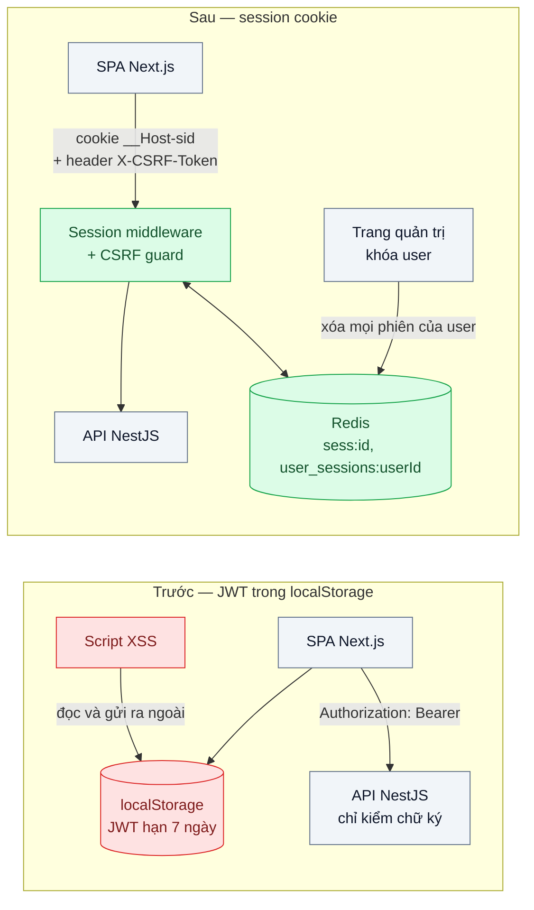
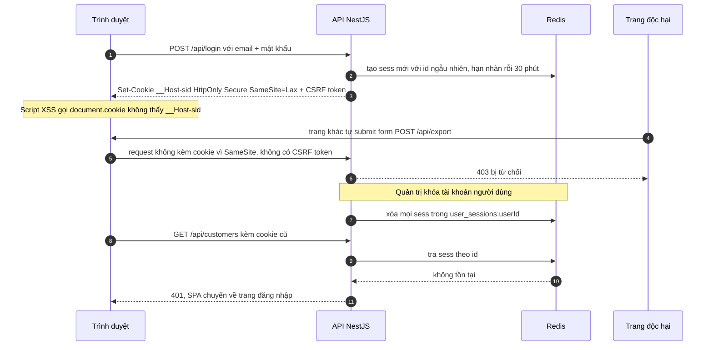

# Session Cookie vs JWT — SPA + API: lưu token ở localStorage (XSS) hay cookie (CSRF)?

| Scope | Mức độ | Trạng thái | Pattern gốc | Cập nhật |
|---|---|---|---|---|
| 19 · backend / frontend / authenticate | 🟢 Cơ bản | 📋 Kế hoạch | Server-side Session + HttpOnly Cookie — OWASP "Session Management" & "CSRF Prevention" cheat sheets; RFC 7519, RFC 8725 | 2026-10-06 |

> **Một câu tóm tắt:** Thay JWT sống 7 ngày nằm trong `localStorage` bằng session id ngẫu nhiên trong cookie `HttpOnly; Secure; SameSite` trỏ tới phiên lưu ở Redis, kèm chống CSRF — để script độc không mang được "chìa khóa" đi, và khóa tài khoản là phiên chết ngay ở request kế tiếp.

## 1. Bài toán thực tế (What)

**Bối cảnh** *(doanh nghiệp giả định, số liệu minh họa)*
SaaS B2B quản lý khách hàng (CRM) cho khoảng 600 doanh nghiệp, 9.000 người dùng. Frontend là SPA Next.js, gọi API NestJS. Sau khi đăng nhập, API trả JWT ký HS256, hạn 7 ngày; SPA lưu vào `localStorage` và gắn header `Authorization: Bearer` cho mọi request. "Đăng xuất" chỉ là xóa `localStorage`.

**Triệu chứng người kinh doanh nhìn thấy**
- Một ô "ghi chú khách hàng" cho nhập rich text bị chèn script; ai mở hồ sơ đó là token bị gửi ra ngoài. 37 tài khoản bị đọc danh sách khách hàng trong 4 ngày trước khi phát hiện.
- Khách doanh nghiệp cho một nhân viên kinh doanh nghỉ việc, khóa tài khoản trên CRM, nhưng người đó vẫn xuất được file khách hàng thêm 6 ngày.
- Đội bảo mật của một khách hàng lớn từ chối gia hạn hợp đồng vì "token đăng nhập không thu hồi được".

**Nguyên nhân kỹ thuật**
JWT là *bearer token*: ai cầm là dùng được, đến khi hết hạn. Đặt trong `localStorage` nghĩa là mọi đoạn JavaScript chạy trên trang — kể cả script bị chèn qua XSS hay thư viện bên thứ ba bị nhiễm — đọc và gửi đi được. JWT lại tự chứa và được xác minh bằng chữ ký, nên server không có chỗ nào để "rút" nó trước hạn: khóa user trong DB không làm token đã phát mất hiệu lực.

**Ràng buộc**
- Không đổi kiến trúc SPA + API; SPA và API phục vụ cùng một domain (API ở đường dẫn `/api`).
- Thời gian thu hồi phiên khi khóa tài khoản phải tính bằng giây, không bằng ngày.
- Không thêm IdP hay OAuth ở bài này; chỉ một ứng dụng, một API.
- Mỗi request không được chậm thêm quá vài mili giây.

## 2. Vì sao dùng pattern này (Why)

**Nguyên nhân gốc mà pattern nhắm vào:** thông tin xác thực vừa *đọc được bằng JavaScript* vừa *không thu hồi được*, nên một lỗ XSS biến thành quyền truy cập kéo dài nhiều ngày.

**Pattern giải quyết thế nào:** server tạo session id ngẫu nhiên, đủ entropy theo OWASP, lưu dữ liệu phiên ở Redis và chỉ gửi id về trình duyệt trong cookie `__Host-sid` với `HttpOnly` (JavaScript không đọc được), `Secure` (chỉ đi qua HTTPS), `SameSite=Lax` (không gửi kèm request POST từ trang khác), `Path=/` và không đặt `Domain` (tiền tố `__Host-` buộc điều này). Phiên có hạn nhàn rỗi và hạn tuyệt đối; id được tạo mới sau đăng nhập để chống *session fixation*. Thu hồi là xóa bản ghi ở Redis. Đổi lại, vì trình duyệt tự gửi cookie, ứng dụng phải chống CSRF: OWASP khuyến nghị kết hợp SameSite với token chống CSRF (synchronizer hoặc double-submit có ký) hoặc header tùy chỉnh và kiểm tra `Origin`. JWT không bị loại bỏ — nó vẫn phù hợp làm token ngắn hạn giữa các service phía sau (RFC 8725 cho cách dùng an toàn), chỉ không phải là thứ trình duyệt cầm.

**Lựa chọn khác đã cân nhắc**

| Lựa chọn | Giải quyết được gì | Vì sao không chọn (ở bài này) |
|---|---|---|
| Giữ nguyên + tối ưu nhỏ (JWT `localStorage`, hạn 15 phút, thêm CSP) | Thu hẹp cửa sổ lạm dụng; CSP chặn bớt script lạ | Token vẫn đọc được bằng JS; 15 phút vẫn đủ để xuất dữ liệu; khóa user vẫn không có hiệu lực ngay |
| JWT đặt trong cookie `HttpOnly` (vẫn stateless) | JS không đọc được token | Vẫn không thu hồi trước hạn; thêm denylist thì đã thành stateful mà vẫn mang JWT to trong mỗi request |
| Access token ngắn trong bộ nhớ + refresh token trong cookie | Cân bằng giữa stateless và thu hồi | Phức tạp hơn mức cần cho một SPA gọi một API của chính mình; xem bài 04 và bài 05 |
| BFF / Token Handler (bài 05) | Token OAuth không bao giờ chạm trình duyệt | Thừa khi chưa có IdP/OAuth bên ngoài |
| Session cookie + Redis + chống CSRF (chọn) | JS không đọc được; thu hồi tức thì; đơn giản, nhiều framework hỗ trợ sẵn | Mỗi request đọc Redis một lần; phải làm đúng phần CSRF |

## 3. Thiết kế hệ thống (How)

### 3.1 Kiến trúc trước và sau



### 3.2 Luồng chính



### 3.3 Thành phần và trách nhiệm

| Thành phần | Trách nhiệm | Quyết định thiết kế đáng chú ý |
|---|---|---|
| Session middleware | Đọc cookie, tra phiên ở Redis, gia hạn hạn nhàn rỗi | Hạn nhàn rỗi 30 phút + hạn tuyệt đối 12 giờ (minh họa); tạo id mới khi đăng nhập và khi nâng quyền |
| Redis session store | Lưu `sess:<id>` và tập `user_sessions:<userId>` | Tập theo user để "đăng xuất mọi thiết bị" và khóa tài khoản bằng một lệnh |
| CSRF guard | Từ chối request đổi dữ liệu thiếu token hợp lệ hoặc `Origin` lạ | Áp cho mọi phương thức không an toàn; GET không bao giờ đổi dữ liệu |
| Cấu hình cookie | `__Host-sid`, `HttpOnly`, `Secure`, `SameSite=Lax`, `Path=/` | Không đặt `Domain` để subdomain khác không nhận cookie |
| CSP + sanitize rich text | Giảm khả năng XSS xảy ra ngay từ đầu | Session cookie không thay thế việc chống XSS (xem 3.4) |

### 3.4 Điểm dễ sai khi triển khai
- **Tin rằng `HttpOnly` chống được XSS.** Script độc vẫn gửi request nhân danh người dùng khi trang đang mở; `HttpOnly` chỉ ngăn mang phiên đi dùng nơi khác và lâu dài. Vẫn phải sanitize rich text và bật CSP.
- **Không tạo id mới sau đăng nhập**: kẻ tấn công cài sẵn id cho nạn nhân rồi dùng chung phiên (session fixation).
- **Đặt `SameSite=None` "cho chạy được"** khi gặp lỗi cookie lúc dev — mở lại toàn bộ CSRF.
- **Đặt `Domain=.ten-mien.vn`**: trang marketing do bên thứ ba host trên subdomain cũng nhận cookie phiên.
- **Dùng GET cho thao tác đổi dữ liệu**: `SameSite=Lax` vẫn gửi cookie khi điều hướng GET cấp cao nhất.
- **Còn dùng JWT ở chỗ khác mà quên RFC 8725**: chấp nhận `alg` từ header, chấp nhận `none`, không kiểm `iss`/`aud`.
- **Redis không bền**: khởi động lại là mọi người bị đăng xuất. Bật persistence hoặc chấp nhận có chủ đích và ghi vào runbook.

## 4. Tech stack và tác động (Impact techstack)

| Lớp | Công nghệ chọn | Vì sao chọn | Thay thế tương đương |
|---|---|---|---|
| Ngôn ngữ / runtime | TypeScript strict, Node 20+ | Stack mặc định của repo | — |
| API | NestJS + `express-session` | NestJS có hướng dẫn chính thức dùng `express-session`; middleware quen thuộc | Fastify + `@fastify/session` |
| Session store | Redis 7 qua `connect-redis` | Tra phiên O(1), TTL tự hết hạn, xóa theo user bằng tập | Bảng PostgreSQL `sessions` khi lưu lượng nhỏ |
| Chống CSRF | Token double-submit có ký qua `csrf-csrf` (cần xác minh API) + kiểm tra `Origin` | Không cần lưu thêm trạng thái; NestJS docs có mục CSRF | Synchronizer token lưu trong phiên |
| Frontend | Next.js | Stack mặc định; gọi `/api` cùng origin nên không cần CORS | Vite + React |
| Kiểm thử | Vitest + supertest, Playwright, OWASP ZAP | Test hành vi phiên; giả lập XSS trên trình duyệt thật; quét cờ cookie | Jest |
| Đo | k6 | So sánh p95 trước/sau khi thêm bước đọc Redis | — |

**Thay đổi so với hệ thống hiện tại:** bỏ việc lưu token ở SPA; thêm Redis và session middleware; thêm CSRF token vào mọi request đổi dữ liệu; trang quản trị có nút "đăng xuất mọi thiết bị". Đội vận hành phải theo dõi Redis như thành phần bắt buộc của đăng nhập.

## 5. Kết quả đầu ra và cách đo (Output impact)

| Chỉ số | Trước (minh họa) | Mục tiêu khi thực hành | Cách đo |
|---|---|---|---|
| Thông tin xác thực đọc được từ JavaScript | Có — JWT trong `localStorage` | Không | Test Playwright chèn script giả lập XSS đọc `localStorage`, `sessionStorage`, `document.cookie` và ghi lại thứ lấy được |
| Thời gian từ khi khóa tài khoản tới khi phiên mất hiệu lực | Tới 7 ngày | Request kế tiếp nhận 401, ≤ 1 giây | Test tích hợp: khóa user rồi gọi API ngay bằng cookie cũ |
| Phiên còn dùng được sau khi đăng xuất | Có, tới hết hạn token | Không | Test: đăng xuất rồi phát lại cookie cũ |
| Request đổi dữ liệu từ origin khác được chấp nhận | Không áp dụng — header Bearer không tự gửi | 0 | Test trang ở origin khác submit form và `fetch`; OWASP ZAP active scan phần CSRF |
| Cờ cookie đạt khuyến nghị | — | `__Host-`, `HttpOnly`, `Secure`, `SameSite=Lax` | OWASP ZAP baseline scan, kiểm tra header `Set-Cookie` |
| Độ trễ thêm do tra phiên ở Redis, p95 | 0 ms | ≤ 3 ms | k6 cùng kịch bản 200 request/giây trên hai phiên bản |

> Số "trước" là minh họa để hình dung bài toán. Số "mục tiêu" chỉ được coi là đạt khi có số đo thật
> ở mục 8 kèm môi trường đo.

**Tác động nghiệp vụ mong đợi:** khóa tài khoản nhân viên nghỉ việc có hiệu lực ngay; một lỗi XSS không còn đồng nghĩa với việc mất quyền kiểm soát tài khoản nhiều ngày — điều mà đội bảo mật của khách doanh nghiệp hỏi đầu tiên khi đánh giá nhà cung cấp.

## 6. Đánh đổi và khi KHÔNG nên dùng

**Đánh đổi**
- Đăng nhập phụ thuộc Redis: Redis chết là không ai dùng được; cần giám sát và kế hoạch phục hồi.
- Thêm phần chống CSRF mà kiểu Bearer header trước đây không cần.
- Cookie gắn với domain: app mobile native hoặc client ở domain khác cần cơ chế khác (OAuth, bài 03).

**Không nên dùng khi**
- API phục vụ nhiều client không phải trình duyệt (mobile, đối tác, máy gọi máy): dùng OAuth token (bài 03, bài 10).
- SPA phải gọi API ở site khác mà không đặt được proxy cùng domain: cookie `SameSite` và `__Host-` không áp được; cân nhắc BFF (bài 05).
- Hệ thống đăng nhập qua IdP ngoài và cần gọi nhiều API bên thứ ba: bài 05 phù hợp hơn.

**Liên quan**
- [Bài 01 — Password Hashing](../01-password-hashing-argon2-lo-db-la-lo-mat-khau/) — bước xác minh mật khẩu trước khi tạo phiên.
- [Bài 04 — Refresh Token Rotation](../04-refresh-token-rotation-token-bi-danh-cap-dung-mai/) — khi buộc phải dùng token thay vì phiên.
- [Bài 05 — BFF / Token Handler](../05-bff-token-handler-token-khong-bao-gio-cham-trinh-duyet/) — kết hợp session cookie với OAuth.
- [Scope 18 bài 01 — Stateless Service & Externalized Session](../../18-backend-scale/01-stateless-session-externalized-login-server-a-server-b-khong-biet/) — vì sao phiên phải nằm ở Redis chứ không ở bộ nhớ từng server.

## 7. Cơ sở tham khảo

- OWASP Cheat Sheet Series, "Session Management Cheat Sheet" — https://cheatsheetseries.owasp.org/cheatsheets/Session_Management_Cheat_Sheet.html — yêu cầu về entropy session id, thuộc tính cookie, hạn nhàn rỗi và tuyệt đối, tạo id mới sau đăng nhập.
- OWASP Cheat Sheet Series, "Cross-Site Request Forgery Prevention Cheat Sheet" — https://cheatsheetseries.owasp.org/cheatsheets/Cross-Site_Request_Forgery_Prevention_Cheat_Sheet.html — synchronizer token, double-submit có ký, header tùy chỉnh, SameSite như lớp phòng thủ bổ sung.
- OWASP Cheat Sheet Series, "HTML5 Security Cheat Sheet" — https://cheatsheetseries.owasp.org/cheatsheets/HTML5_Security_Cheat_Sheet.html — khuyến nghị không lưu định danh phiên trong Web Storage.
- Jones, Bradley, Sakimura, RFC 7519, *JSON Web Token (JWT)*, 2015 — https://www.rfc-editor.org/rfc/rfc7519 — định nghĩa JWT và các claim chuẩn, cơ sở để hiểu vì sao JWT không tự thu hồi được.
- Sheffer, Hardt, Jones, RFC 8725, *JSON Web Token Best Current Practices*, 2020 — https://www.rfc-editor.org/rfc/rfc8725 — kiểm tra thuật toán, `iss`, `aud` khi vẫn dùng JWT giữa các service.
- NestJS docs, "Session" và "CSRF Protection" — https://docs.nestjs.com/ — cách gắn `express-session` và chống CSRF trong NestJS dùng ở mục 4.

## 8. Kế hoạch thực hành

- [ ] Bước 1: dựng Next.js + NestJS + Redis bằng Docker Compose; phiên bản `truoc/` lưu JWT trong `localStorage`; thêm một trang có ô ghi chú cố ý không sanitize để giả lập XSS.
- [ ] Bước 2: đo "trước": test Playwright cho thấy script đọc được token; test khóa user nhưng token vẫn dùng được; p95 bằng k6.
- [ ] Bước 3: áp dụng pattern trong `sau/`: session middleware + Redis store, cookie `__Host-sid`, tạo id mới khi đăng nhập, CSRF guard, API khóa user xóa mọi phiên.
- [ ] Bước 4: đo "sau" cùng kịch bản; chạy OWASP ZAP baseline; ghi số đo và môi trường vào mục 5.
- [ ] Bước 5: test Vitest/supertest: khóa user thì request kế tiếp 401; đăng xuất rồi phát lại cookie thì 401; POST thiếu CSRF token thì 403; id phiên đổi sau đăng nhập.

**Cấu trúc code dự kiến**
```text
src/
  truoc/jwt-local-storage.ts     # tái hiện cách lưu token cũ
  sau/session.config.ts          # [PATTERN] cookie __Host-sid, hạn nhàn rỗi và tuyệt đối
  sau/session-revoker.ts         # xóa mọi phiên của một user
  sau/csrf.guard.ts              # double-submit có ký + kiểm tra Origin
  sau/auth.controller.ts         # login, logout, tạo id phiên mới
  shared/redis.ts
web/                             # Next.js tối giản, có trang ghi chú để giả lập XSS
test/
  session-revoke.test.ts
  csrf-guard.test.ts
  xss-cannot-read-session.spec.ts   # Playwright
bench/session-overhead.k6.js
docker-compose.yml
```

**Cách chạy** *(điền khi bắt đầu code)*
```bash
docker compose up -d
pnpm install && pnpm test
```
