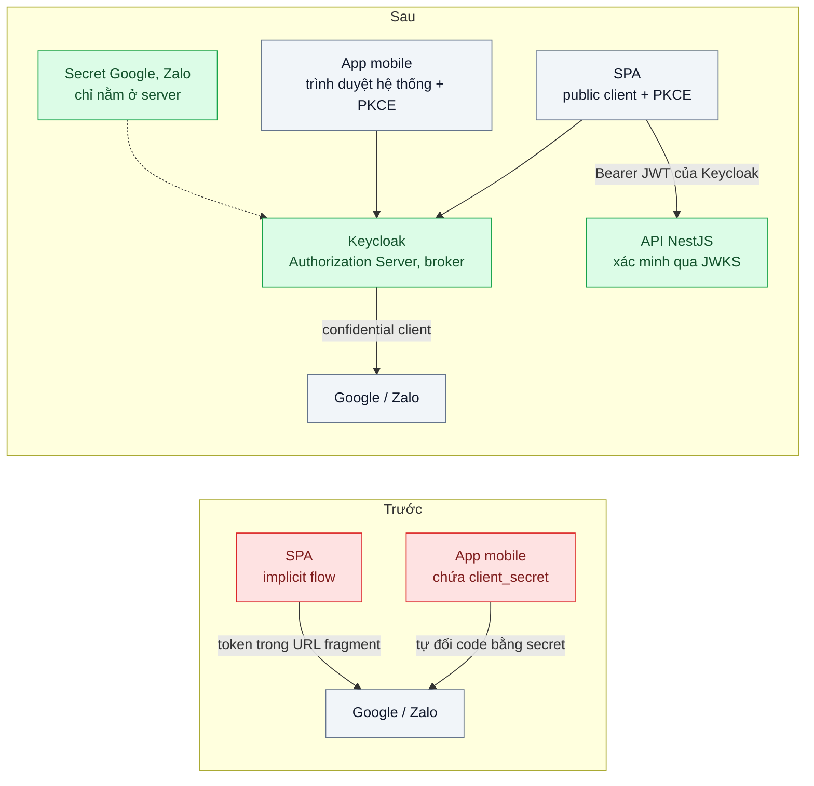
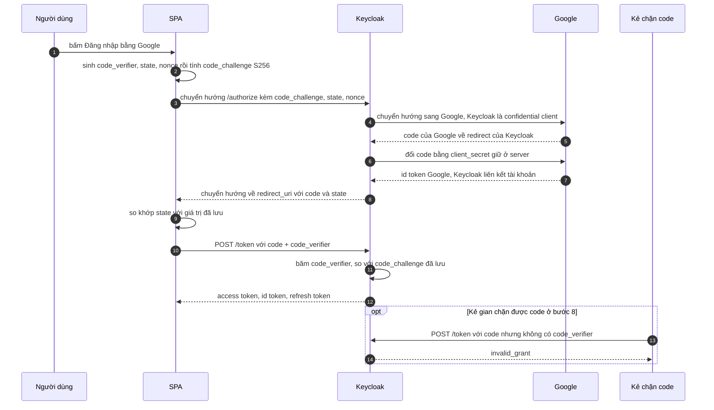

# OAuth 2.0 Authorization Code + PKCE — Đăng nhập bằng Google/Zalo cho SPA và app mobile không có nơi giữ secret

| Scope | Mức độ | Trạng thái | Pattern gốc | Cập nhật |
|---|---|---|---|---|
| 19 · backend / frontend / authenticate | 🟡 Trung bình | 📋 Kế hoạch | Authorization Code + PKCE — RFC 6749, RFC 7636; RFC 9700 (2025) | 2026-10-06 |

> **Một câu tóm tắt:** Cho SPA và app mobile đăng nhập bằng Authorization Code + PKCE với một Authorization Server của chính mình (Keycloak) làm trung gian tới Google/Zalo, để client không phải giữ secret nào, token không bao giờ nằm trên URL, và một mã code bị chặn giữa đường không đổi được thành token.

## 1. Bài toán thực tế (What)

**Bối cảnh** *(doanh nghiệp giả định, số liệu minh họa)*
Sàn đấu giá trực tuyến khoảng 400.000 người dùng, có web SPA (Next.js) và app React Native. Nút "Đăng nhập bằng Google / Zalo" được làm gấp trước mùa đấu giá: web dùng *implicit flow* (`response_type=token`), access token trả về trong fragment của URL; app mobile nhúng `client_secret` của ứng dụng Google và Zalo trong bản build để tự gọi token endpoint, redirect về custom scheme `daugia://callback`.

**Triệu chứng người kinh doanh nhìn thấy**
- Một nhà nghiên cứu bảo mật giải nén app, công bố `client_secret`. Đội kỹ thuật phải xoay secret; mọi bản app cũ đang chứa secret cũ lập tức không đăng nhập Google được — gần một ngày mất người đăng ký mới đúng mùa cao điểm.
- Token xuất hiện trong lịch sử trình duyệt và trong URL mà script phân tích hành vi ghi lại; vài tài khoản bị đặt giá hộ.
- Mỗi lần thêm nhà cung cấp đăng nhập mới phải phát hành lại app và chờ duyệt cửa hàng ứng dụng.

**Nguyên nhân kỹ thuật**
SPA và app mobile là *public client*: mọi thứ nằm trong bản build hoặc trong trình duyệt đều đọc được, nên "secret" ở đó không còn là bí mật. Implicit flow đặt token vào URL, nơi nó rò qua lịch sử, log và script bên thứ ba. Authorization code không có gì ràng buộc với client đã xin nó: một app khác đăng ký cùng custom scheme, hay một redirect URI so khớp lỏng, có thể nhận code và tự đổi lấy token.

**Ràng buộc**
- Giữ trải nghiệm "một chạm" với Google và Zalo trên cả web lẫn mobile.
- Xoay secret của Google/Zalo không được phụ thuộc vào việc phát hành app.
- API nội bộ cần một định dạng token thống nhất, không phải mỗi nhà cung cấp một kiểu.
- Đăng nhập không chậm thêm quá khoảng 1 giây so với hiện tại.

## 2. Vì sao dùng pattern này (Why)

**Nguyên nhân gốc mà pattern nhắm vào:** client không giữ được bí mật, nên cần một cách chứng minh "người đổi code chính là người đã xin code" mà không dựa vào secret tĩnh.

**Pattern giải quyết thế nào:** RFC 7636 thêm PKCE vào Authorization Code (RFC 6749). Trước khi chuyển hướng, client sinh `code_verifier` ngẫu nhiên entropy cao (43–128 ký tự), gửi kèm `code_challenge = BASE64URL(SHA256(code_verifier))` với `code_challenge_method=S256`. Authorization Server lưu challenge cùng code. Khi đổi code lấy token, client gửi `code_verifier`; server băm lại và so khớp. Kẻ chặn được code không có verifier nên không đổi được. Token chỉ đi qua kênh POST trực tiếp tới token endpoint, không qua URL. RFC 9700 (2025) khuyến nghị không dùng implicit grant, dùng PKCE cho mọi client và so khớp redirect URI chính xác. `state` chống giả mạo luồng chuyển hướng; `nonce` (OpenID Connect) chống phát lại id token. Trong thiết kế này, SPA và app là public client của **Keycloak**; Keycloak dùng *Identity Brokering* để làm confidential client với Google và Zalo, giữ secret ở phía server và phát JWT riêng cho API nội bộ.

**Lựa chọn khác đã cân nhắc**

| Lựa chọn | Giải quyết được gì | Vì sao không chọn (ở bài này) |
|---|---|---|
| Giữ nguyên + tối ưu nhỏ (implicit với token hạn ngắn, làm rối secret trong app) | Rút ngắn thời gian token lộ còn giá trị | Token vẫn trên URL; làm rối chỉ làm chậm việc trích secret; RFC 9700 khuyến nghị bỏ implicit |
| Authorization Code không PKCE, secret vẫn nằm trong app | Token không còn trên URL | Secret trong bản build coi như công khai; code bị chặn vẫn đổi được |
| Mỗi client tích hợp thẳng Google/Zalo bằng PKCE | Bỏ secret khỏi app | Mỗi nhà cung cấp một cách; token Google không dùng cho API nội bộ được; mức hỗ trợ PKCE của từng nhà cung cấp cho từng loại client cần xác minh |
| Resource Owner Password Credentials | Đơn giản | RFC 9700 khuyến nghị không dùng; không áp được cho Google/Zalo |
| Code + PKCE với Keycloak làm broker (chọn) | Không secret ở client; code bị chặn vô dụng; token thống nhất; thêm nhà cung cấp không cần phát hành app | Thêm Keycloak phải vận hành; luồng chuyển hướng dài thêm một chặng |

## 3. Thiết kế hệ thống (How)

### 3.1 Kiến trúc trước và sau



### 3.2 Luồng chính



### 3.3 Thành phần và trách nhiệm

| Thành phần | Trách nhiệm | Quyết định thiết kế đáng chú ý |
|---|---|---|
| SPA (public client) | Sinh verifier/state/nonce, chuyển hướng, đổi code | Verifier sinh bằng `crypto.getRandomValues`, giữ trong `sessionStorage` chỉ trong thời gian chuyển hướng |
| App mobile | Mở trình duyệt hệ thống, nhận redirect, đổi code | Dùng App Links / Universal Links (HTTPS) thay custom scheme; không dùng WebView nhúng vì app đọc được thứ người dùng gõ |
| Keycloak realm | Authorization Server cho mọi client; broker tới Google/Zalo | Client public bắt buộc PKCE S256; redirect URI khai báo chính xác, không wildcard |
| Identity provider Google / Zalo | Xác thực người dùng ở nhà cung cấp | Google cấu hình theo OIDC; Zalo cấu hình như nhà cung cấp OAuth 2.0 tùy chỉnh (mức tương thích OIDC cần xác minh) |
| Liên kết tài khoản | Ghép người dùng từ nhà cung cấp với tài khoản sẵn có | Chỉ ghép tự động khi email đã được nhà cung cấp xác minh; còn lại yêu cầu xác nhận |
| API NestJS | Xác minh JWT của Keycloak | Kiểm chữ ký qua JWKS, `iss`, `aud`, `exp`; không chấp nhận token Google trực tiếp |

### 3.4 Điểm dễ sai khi triển khai
- Dùng `code_challenge_method=plain` hoặc sinh verifier bằng `Math.random` — mất gần hết giá trị của PKCE.
- Không kiểm `state` khi nhận redirect: kẻ gian ép nạn nhân đăng nhập vào tài khoản của kẻ gian (login CSRF).
- Redirect URI so khớp theo tiền tố hoặc wildcard: một đường dẫn có open redirect trên cùng domain là đủ để lấy code.
- Tự động liên kết tài khoản theo email mà không kiểm email đã xác minh — đường tắt để chiếm tài khoản.
- Nghĩ PKCE bảo vệ token *sau khi* nhận: PKCE chỉ bảo vệ bước đổi code. Token lưu ở `localStorage` vẫn lộ qua XSS — xem bài 04 và bài 05.
- API quên kiểm `aud`: token phát cho ứng dụng khác cùng realm cũng gọi được API.
- Mobile tự viết luồng OAuth thay vì dùng thư viện AppAuth đã kiểm chứng.

## 4. Tech stack và tác động (Impact techstack)

| Lớp | Công nghệ chọn | Vì sao chọn | Thay thế tương đương |
|---|---|---|---|
| Authorization Server | Keycloak (Docker) + PostgreSQL 16 | IdP local của repo; Identity Brokering, bắt buộc PKCE theo client, phát JWT và JWKS | Ory Hydra; dịch vụ quản lý như Auth0, Cognito |
| SPA | Next.js + `oauth4webapi` | Thư viện OAuth/OIDC cho trình duyệt, có sẵn hàm PKCE (tên hàm cần xác minh theo phiên bản) | `oidc-client-ts` |
| Mobile | React Native + `react-native-app-auth` | Bọc AppAuth cho iOS/Android, mở trình duyệt hệ thống | AppAuth native |
| API | NestJS + `jose` (`createRemoteJWKSet`, `jwtVerify`) | Xác minh JWT theo JWKS, cache khóa, kiểm claim | `passport-jwt` |
| Kiểm thử | Vitest, Playwright, OWASP ZAP | Test tấn công chặn code; ghi mọi URL điều hướng; quét redirect URI | — |
| Hạ tầng local | Docker Compose | Dựng Keycloak, Postgres, API, SPA bằng một lệnh | — |

**Thay đổi so với hệ thống hiện tại:** thêm Keycloak làm Authorization Server; gỡ secret khỏi app mobile và bỏ implicit flow ở web; API chuyển sang chỉ tin JWT của Keycloak. Đội vận hành học cách cấu hình realm, client, identity provider và xoay secret của nhà cung cấp mà không đụng tới app.

## 5. Kết quả đầu ra và cách đo (Output impact)

| Chỉ số | Trước (minh họa) | Mục tiêu khi thực hành | Cách đo |
|---|---|---|---|
| Secret OAuth nằm trong bản build client | Có — Google và Zalo | 0 | Script CI giải nén bản build và tìm chuỗi secret đã biết (công cụ giải nén APK cần xác minh) |
| Token xuất hiện trên URL hoặc lịch sử trình duyệt | Có | 0 | Playwright ghi mọi URL điều hướng và request, tìm `access_token`, `id_token` |
| Code bị chặn đổi được token | Có | 0 trên 100 lần thử | Test tích hợp mô phỏng kẻ gian đổi code không có hoặc sai `code_verifier`, kỳ vọng `invalid_grant` |
| Redirect URI biến thể được chấp nhận | Chưa kiểm | 0 | Test gửi redirect URI thêm đường dẫn, đổi subdomain, thêm query; OWASP ZAP |
| Xoay secret Google/Zalo | Phải phát hành app, ~1 ngày gián đoạn | Đổi trên Keycloak, không phát hành app, 0 lỗi đăng nhập | Diễn tập xoay secret trên môi trường thử, theo dõi tỷ lệ đăng nhập lỗi |
| Thời gian hoàn tất đăng nhập p95 | ~3 giây | ≤ trước + 1 giây | Playwright đo từ lúc bấm nút tới trang chủ, 30 lần |

> Số "trước" là minh họa để hình dung bài toán. Số "mục tiêu" chỉ được coi là đạt khi có số đo thật
> ở mục 8 kèm môi trường đo.

**Tác động nghiệp vụ mong đợi:** lộ bản build không còn là sự cố đăng nhập toàn hệ thống; thêm hay đổi nhà cung cấp đăng nhập là việc cấu hình, không phải đợt phát hành app.

## 6. Đánh đổi và khi KHÔNG nên dùng

**Đánh đổi**
- Keycloak trở thành điểm phụ thuộc của mọi lần đăng nhập: cần chạy nhiều bản, sao lưu DB, theo dõi.
- Luồng chuyển hướng dài hơn một chặng; lỗi cấu hình ở broker khó chẩn đoán hơn tích hợp thẳng.
- PKCE không giải quyết chuyện lưu token sau đó; SPA vẫn cần bài 04 hoặc bài 05.

**Không nên dùng khi**
- Ứng dụng web render phía server, chỉ có một API của chính mình và không cần đăng nhập bằng nhà cung cấp ngoài: session cookie (bài 02) đơn giản hơn.
- Máy gọi máy không có người dùng: dùng client credentials (bài 10).
- Chỉ có một nhà cung cấp, không có API nội bộ cần token riêng: tích hợp thẳng bằng PKCE có thể đủ, không cần broker.

**Liên quan**
- [Bài 02 — Session Cookie vs JWT](../02-session-cookie-vs-jwt-spa-luu-token-o-dau/) — khi không cần OAuth.
- [Bài 04 — Refresh Token Rotation](../04-refresh-token-rotation-token-bi-danh-cap-dung-mai/) — bảo vệ refresh token nhận được ở bước 12.
- [Bài 05 — BFF / Token Handler](../05-bff-token-handler-token-khong-bao-gio-cham-trinh-duyet/) — đưa toàn bộ luồng này ra phía server cho SPA.
- [Bài 07 — SSO with OpenID Connect](../07-sso-oidc-mot-lan-dang-nhap-cho-5-ung-dung-noi-bo/) — cùng nền OIDC, áp cho ứng dụng nội bộ.

## 7. Cơ sở tham khảo

- Hardt (ed.), RFC 6749, *The OAuth 2.0 Authorization Framework*, 2012 — https://www.rfc-editor.org/rfc/rfc6749 — định nghĩa Authorization Code grant, public vs confidential client, `state`.
- Sakimura, Bradley, Agarwal, RFC 7636, *Proof Key for Code Exchange by OAuth Public Clients*, 2015 — https://www.rfc-editor.org/rfc/rfc7636 — đặc tả `code_verifier`, `code_challenge`, phương thức S256 và mối đe dọa chặn code.
- Lodderstedt et al., RFC 9700, *Best Current Practice for OAuth 2.0 Security*, 2025 — https://www.rfc-editor.org/rfc/rfc9700 — bỏ implicit grant, PKCE cho mọi client, so khớp redirect URI chính xác.
- IETF OAuth WG, "OAuth 2.0 for Browser-Based Apps" (draft-ietf-oauth-browser-based-apps) — https://datatracker.ietf.org/doc/draft-ietf-oauth-browser-based-apps/ — mối đe dọa riêng của SPA và các kiến trúc khuyến nghị.
- OpenID Connect Core 1.0 — https://openid.net/specs/openid-connect-core-1_0.html — id token, `nonce` và các claim dùng khi broker nhận danh tính từ Google.
- Keycloak documentation, "Identity Brokering" trong Server Administration Guide — https://www.keycloak.org/documentation — cấu hình nhà cung cấp danh tính ngoài và luồng first broker login.

## 8. Kế hoạch thực hành

- [ ] Bước 1: dựng Keycloak + Postgres + API + SPA bằng Docker Compose; thay Google/Zalo bằng một realm Keycloak thứ hai đóng vai nhà cung cấp ngoài để chạy offline; dựng phiên bản `truoc/` dùng implicit flow.
- [ ] Bước 2: đo "trước": Playwright ghi URL chứa token; test cho thấy code bị chặn đổi được token khi không có PKCE.
- [ ] Bước 3: áp dụng pattern: client public bắt buộc PKCE S256, redirect URI chính xác, SPA dùng `oauth4webapi`, API xác minh JWT bằng `jose`.
- [ ] Bước 4: đo "sau" cùng kịch bản, chạy OWASP ZAP, diễn tập xoay secret của nhà cung cấp; ghi số và môi trường vào mục 5.
- [ ] Bước 5: test: code không kèm hoặc sai verifier nhận `invalid_grant`; `state` sai bị từ chối; redirect URI biến thể bị từ chối; API từ chối token sai `aud`.

**Cấu trúc code dự kiến**
```text
keycloak/realm-auction.json       # realm, client public PKCE, identity provider giả lập
src/
  api/jwt-verifier.ts             # jose + JWKS, kiểm iss, aud, exp
  api/auctions.controller.ts
web/
  lib/pkce-login.ts               # [PATTERN] sinh verifier, state, nonce, đổi code
  app/callback/page.tsx           # kiểm state, gọi token endpoint
test/
  code-interception.test.ts       # kẻ gian đổi code không có verifier
  redirect-uri-exact-match.test.ts
  login-flow.spec.ts              # Playwright, ghi URL điều hướng
docker-compose.yml
```

**Cách chạy** *(điền khi bắt đầu code)*
```bash
docker compose up -d
pnpm install && pnpm test
```
