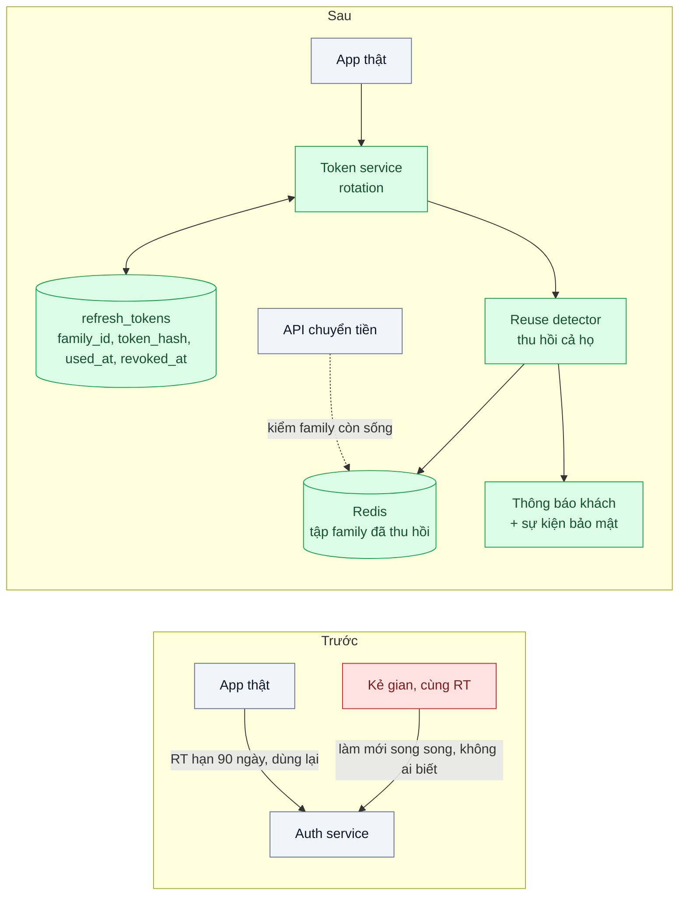
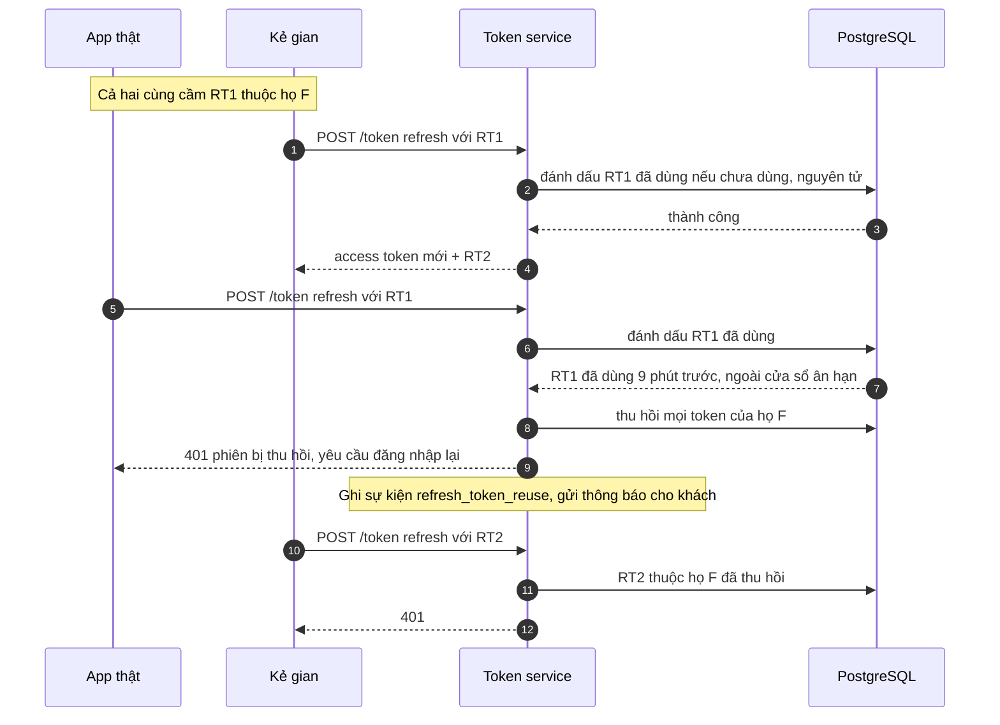

# Refresh Token Rotation & Reuse Detection — Refresh token bị đánh cắp dùng được mãi

| Scope | Mức độ | Trạng thái | Pattern gốc | Cập nhật |
|---|---|---|---|---|
| 19 · backend / frontend / authenticate | 🟡 Trung bình | 📋 Kế hoạch | Refresh Token Rotation & Reuse Detection — RFC 9700 (2025); Auth0 docs "Refresh Token Rotation" | 2026-10-06 |

> **Một câu tóm tắt:** Mỗi refresh token chỉ dùng được một lần và đổi ra cặp token mới; nếu một token đã dùng bị trình lại, server hiểu rằng có hai bên cùng cầm nó và thu hồi cả "họ" token — giới hạn thời gian kẻ trộm dùng được token xuống tới lần làm mới kế tiếp của chủ thật.

## 1. Bài toán thực tế (What)

**Bối cảnh** *(doanh nghiệp giả định, số liệu minh họa)*
Ví điện tử khoảng 2,5 triệu người dùng trên app mobile và web. Access token là JWT hạn 15 phút; refresh token là chuỗi ngẫu nhiên hạn 90 ngày, dùng lại được vô số lần, và mỗi lần làm mới lại được gia hạn thêm 90 ngày. Người dùng gần như không bao giờ phải đăng nhập lại.

**Triệu chứng người kinh doanh nhìn thấy**
- Một khách phát hiện giao dịch chuyển tiền lạ dù đã đổi mật khẩu từ tuần trước; điều tra cho thấy kẻ gian dùng refresh token sao chép từ máy nhiễm mã độc suốt 5 tuần.
- Đổi mật khẩu và bấm "đăng xuất" không làm gì với refresh token đã phát; chăm sóc khách hàng không có cách chắc chắn để "đuổi" kẻ gian ra.
- Kiểm toán bảo mật đánh dấu "không phát hiện được phiên bị dùng song song" là rủi ro cao.

**Nguyên nhân kỹ thuật**
Refresh token là *bearer credential* sống lâu: ai cầm cũng đổi được access token mới, và server không phân biệt được chủ thật với bản sao vì cả hai trình cùng một chuỗi. Gia hạn trượt không có hạn tuyệt đối biến 90 ngày thành vô thời hạn. Không có bản ghi nào cho biết token này đã từng được dùng, nên việc hai bên cùng dùng một token — dấu hiệu rõ nhất của đánh cắp — hoàn toàn vô hình.

**Ràng buộc**
- Người dùng không phải đăng nhập lại thường xuyên hơn trước khi không có gì bất thường.
- App mobile hay mất mạng giữa chừng; nhiều tab web có thể làm mới cùng lúc — không được đăng xuất nhầm.
- Endpoint làm mới chịu được khoảng 500 lượt/giây giờ cao điểm.

## 2. Vì sao dùng pattern này (Why)

**Nguyên nhân gốc mà pattern nhắm vào:** một refresh token dùng lại được vô hạn lần, nên bản sao và bản gốc cùng tồn tại mà không ai biết.

**Pattern giải quyết thế nào:** RFC 9700 yêu cầu Authorization Server phát hiện việc phát lại refresh token của public client bằng một trong hai cách: ràng buộc token với người gửi (sender-constrained) hoặc *rotation*. Với rotation, mỗi lần làm mới, server cấp refresh token mới và đánh dấu token cũ đã dùng. Mọi token sinh ra từ cùng một lần đăng nhập thuộc một *họ* (family). Nếu một token đã dùng được trình lại — bởi kẻ trộm hay bởi chủ thật, bên nào đến sau — server không biết ai là ai, nên thu hồi cả họ: cả hai phải đăng nhập lại, nhưng chỉ chủ thật làm được. Auth0 mô tả cùng cơ chế với tên "automatic reuse detection" và một khoảng ân hạn ngắn cho lỗi mạng. Kết hợp hạn tuyệt đối cho cả họ và hạn nhàn rỗi, refresh token không còn là chìa khóa vĩnh viễn.

**Lựa chọn khác đã cân nhắc**

| Lựa chọn | Giải quyết được gì | Vì sao không chọn (ở bài này) |
|---|---|---|
| Giữ nguyên + tối ưu nhỏ (hạn 7 ngày, bỏ gia hạn trượt) | Giới hạn thời gian lạm dụng | Vẫn 7 ngày tự do; vẫn không phát hiện được đang bị dùng song song |
| Bỏ refresh token, access token hạn dài | Đơn giản | Tệ hơn: token lộ sống lâu và không có điểm nào để chặn |
| Sender-constrained token (DPoP hoặc mTLS) | Token chép sang máy khác vô dụng vì thiếu khóa riêng | Cần quản lý khóa trên client, web khó giữ khóa an toàn; RFC 9700 coi là phương án ngang hàng — để làm sau |
| Danh sách thu hồi thủ công khi khách báo | Chặn được sau khi biết | Phụ thuộc khách tự phát hiện, thường sau nhiều tuần |
| Rotation + reuse detection (chọn) | Mỗi token dùng một lần; phát hiện dùng song song; thu hồi cả họ | Thêm một lần ghi DB mỗi lượt làm mới; phải xử lý race khi làm mới đồng thời |

## 3. Thiết kế hệ thống (How)

### 3.1 Kiến trúc trước và sau



### 3.2 Luồng chính



### 3.3 Thành phần và trách nhiệm

| Thành phần | Trách nhiệm | Quyết định thiết kế đáng chú ý |
|---|---|---|
| Token service | Cấp cặp token, xoay refresh token | Một câu `UPDATE ... WHERE token_hash = $1 AND used_at IS NULL RETURNING` làm phép "tiêu thụ" nguyên tử |
| Bảng `refresh_tokens` | Lưu `family_id`, `parent_id`, `token_hash`, `used_at`, `revoked_at`, `expires_at` | Chỉ lưu SHA-256 của token — đủ vì token ngẫu nhiên entropy cao (bài 01) |
| Reuse detector | Phân biệt "dùng lại do lỗi mạng" với "dùng lại do đánh cắp" | Cửa sổ ân hạn vài giây: trả lại đúng cặp token vừa cấp thay vì thu hồi |
| Hạn của họ token | Hạn nhàn rỗi 7 ngày, hạn tuyệt đối 30 ngày (minh họa) | Không còn gia hạn trượt vô hạn |
| Redis tập family thu hồi | Cho API kiểm nhanh với thao tác nhạy cảm | Thu hồi họ không giết access token đang còn hạn; thao tác chuyển tiền kiểm thêm tập này |
| Sự kiện bảo mật | Ghi và cảnh báo mỗi lần phát hiện dùng lại | Là tín hiệu đánh cắp chính xác nhất hệ thống có được |

### 3.4 Điểm dễ sai khi triển khai
- **Race khi làm mới đồng thời**: hai tab hoặc một lần thử lại do mất mạng gửi cùng token, server báo đánh cắp giả và đăng xuất người dùng. Client phải gộp các lượt làm mới thành một (single-flight); server có cửa sổ ân hạn.
- **Đọc rồi mới ghi** (SELECT rồi UPDATE): hai request song song đều thấy "chưa dùng" và đều nhận token mới. Phép tiêu thụ phải nguyên tử.
- **Lưu refresh token dạng rõ**: lộ DB là lộ mọi phiên.
- **Quên rằng access token còn sống**: thu hồi họ xong, access token 15 phút vẫn dùng được. Giữ access token ngắn và kiểm tập thu hồi cho thao tác tiền.
- **Đổi mật khẩu, "đăng xuất mọi thiết bị" không thu hồi họ token** — hai nơi phải gọi cùng một hàm thu hồi.
- **Không cảnh báo khi phát hiện dùng lại**: bỏ phí tín hiệu bảo mật quý nhất.

## 4. Tech stack và tác động (Impact techstack)

| Lớp | Công nghệ chọn | Vì sao chọn | Thay thế tương đương |
|---|---|---|---|
| Ngôn ngữ / runtime | TypeScript strict, Node 20+ | Stack mặc định của repo | — |
| Token service | NestJS tự viết, ký access token bằng `jose` | Tự viết để thấy rõ cơ chế họ token và phép tiêu thụ nguyên tử | Keycloak với tùy chọn thu hồi refresh token khi dùng lại trong cài đặt realm (cần xác minh tên tùy chọn) |
| Nguồn sự thật | PostgreSQL 16 | `UPDATE ... RETURNING` nguyên tử; truy vết họ token bằng `parent_id` | — |
| Kiểm nhanh thu hồi | Redis 7 | Tập family đã thu hồi có TTL bằng hạn access token | Gọi introspection tới token service |
| Kiểm thử | Vitest + test tích hợp với Postgres thật | Mô phỏng token bị đánh cắp và làm mới đồng thời | Jest |
| Đo | k6 | p95 endpoint làm mới ở 500 lượt/giây | — |

**Thay đổi so với hệ thống hiện tại:** thêm bảng `refresh_tokens` theo họ, thay logic làm mới, thêm sự kiện và thông báo khi phát hiện dùng lại; app mobile và web phải gộp lượt làm mới. Đội vận hành học đọc sự kiện `refresh_token_reuse` như một cảnh báo bảo mật.

## 5. Kết quả đầu ra và cách đo (Output impact)

| Chỉ số | Trước (minh họa) | Mục tiêu khi thực hành | Cách đo |
|---|---|---|---|
| Thời gian kẻ gian dùng được refresh token bị đánh cắp | Tới 90 ngày, gia hạn trượt vô hạn | Tới lần làm mới kế tiếp của chủ thật, ≤ 15 phút khi app đang mở | Test tích hợp mô phỏng token bị đánh cắp: hai client cùng giữ RT1, ghi thời điểm họ token bị thu hồi |
| Phát hiện dùng song song ngoài cửa sổ ân hạn | Không | 100% | Test: dùng lại token đã dùng sau 30 giây, kỳ vọng thu hồi họ + sự kiện `refresh_token_reuse` |
| Đăng xuất nhầm do làm mới đồng thời | Chưa đo | 0 trên 1.000 lần thử trong cửa sổ ân hạn | Test bắn hai request làm mới cùng token cách nhau 0–2 giây |
| Đổi mật khẩu thu hồi mọi phiên | Không | Có, request kế tiếp nhận 401 | Test: đổi mật khẩu rồi làm mới bằng token cũ |
| p95 endpoint làm mới | ~8 ms | ≤ 25 ms | k6 500 lượt/giây trong 5 phút |
| Token lưu dạng rõ trong DB | Có | Không, chỉ SHA-256 | Test đơn vị + truy vấn kiểm tra cột |

> Số "trước" là minh họa để hình dung bài toán. Số "mục tiêu" chỉ được coi là đạt khi có số đo thật
> ở mục 8 kèm môi trường đo.

**Tác động nghiệp vụ mong đợi:** token bị đánh cắp mất giá trị trong vài phút thay vì vài tháng; ví có tín hiệu phát hiện chiếm phiên để chủ động khóa và báo khách trước khi tiền bị chuyển.

## 6. Đánh đổi và khi KHÔNG nên dùng

**Đánh đổi**
- Mỗi lượt làm mới thêm một lần ghi DB; bảng token tăng nhanh, cần dọn bản ghi hết hạn.
- Khi phát hiện dùng lại, chủ thật cũng bị đăng xuất — đúng thiết kế, nhưng cần thông điệp rõ ràng để không thành ticket hỗ trợ.
- Không chặn được kẻ trộm nếu chủ thật không bao giờ mở app lại; hạn nhàn rỗi và hạn tuyệt đối là lưới an toàn còn lại.

**Không nên dùng khi**
- Refresh token đã được ràng buộc với người gửi (DPoP, mTLS): rotation thêm ít giá trị, RFC 9700 cho phép chọn một trong hai.
- Ứng dụng web dùng session cookie phía server (bài 02) hoặc BFF (bài 05) mà trình duyệt không bao giờ cầm refresh token: rotation vẫn hữu ích phía server nhưng không còn là tuyến phòng thủ chính.
- Client máy-máy dùng client credentials (bài 10): không có refresh token để xoay.

**Liên quan**
- [Bài 03 — OAuth 2.0 + PKCE](../03-oauth2-pkce-dang-nhap-google-cho-spa-va-mobile/) — nơi refresh token được phát lần đầu.
- [Bài 05 — BFF / Token Handler](../05-bff-token-handler-token-khong-bao-gio-cham-trinh-duyet/) — giữ refresh token hoàn toàn ở server.
- [Bài 01 — Password Hashing](../01-password-hashing-argon2-lo-db-la-lo-mat-khau/) — vì sao SHA-256 đủ cho token ngẫu nhiên nhưng không đủ cho mật khẩu.
- [Scope 01 bài 03 — Idempotency Key](../../01-frontend-backend-transporter/03-idempotency-key-bam-thanh-toan-hai-lan/) — cùng ý tưởng trả lại kết quả cũ cho lần gửi lặp trong cửa sổ ân hạn.

## 7. Cơ sở tham khảo

- Lodderstedt et al., RFC 9700, *Best Current Practice for OAuth 2.0 Security*, 2025 — https://www.rfc-editor.org/rfc/rfc9700 — yêu cầu phát hiện phát lại refresh token cho public client bằng rotation hoặc sender-constraining.
- IETF OAuth WG, "OAuth 2.0 for Browser-Based Apps" (draft-ietf-oauth-browser-based-apps) — https://datatracker.ietf.org/doc/draft-ietf-oauth-browser-based-apps/ — rủi ro refresh token trong trình duyệt và giới hạn thời gian sống.
- Auth0 docs, "Refresh Token Rotation" — https://auth0.com/docs/secure/tokens/refresh-tokens/refresh-token-rotation — mô tả họ token, phát hiện dùng lại tự động và khoảng ân hạn.
- Hardt (ed.), RFC 6749, *The OAuth 2.0 Authorization Framework*, 2012, mục 6 — https://www.rfc-editor.org/rfc/rfc6749 — cơ chế làm mới access token gốc mà pattern bổ sung.
- PostgreSQL docs, "UPDATE" (mệnh đề `RETURNING`) — https://www.postgresql.org/docs/16/sql-update.html — phép tiêu thụ token nguyên tử dùng ở mục 3.3.

## 8. Kế hoạch thực hành

- [ ] Bước 1: dựng Postgres + Redis + token service; phiên bản `truoc/` cấp refresh token dùng lại được, gia hạn trượt.
- [ ] Bước 2: đo "trước": test mô phỏng hai client cùng giữ một token, cả hai làm mới thoải mái trong 1.000 lượt; p95 bằng k6.
- [ ] Bước 3: áp dụng pattern: bảng theo họ, phép tiêu thụ nguyên tử, cửa sổ ân hạn, thu hồi cả họ, tập thu hồi trong Redis, sự kiện bảo mật.
- [ ] Bước 4: đo "sau" cùng kịch bản và ghi vào mục 5 kèm môi trường.
- [ ] Bước 5: test: dùng lại ngoài cửa sổ ân hạn thu hồi cả họ; hai request đồng thời trong cửa sổ ân hạn không đăng xuất nhầm; đổi mật khẩu thu hồi họ; token trong DB chỉ là hash.

**Cấu trúc code dự kiến**
```text
src/
  truoc/refresh-reusable.ts         # tái hiện refresh token dùng lại vô hạn
  sau/token.service.ts              # cấp cặp token, ký access token
  sau/refresh-rotation.ts           # [PATTERN] tiêu thụ nguyên tử, cửa sổ ân hạn
  sau/reuse-detector.ts             # [PATTERN] thu hồi cả họ, phát sự kiện
  sau/revoked-families.ts           # tập thu hồi trong Redis
  shared/db.ts
test/
  stolen-token-family-revoked.test.ts
  concurrent-refresh-grace.test.ts
  password-change-revokes.test.ts
bench/refresh.k6.js
docker-compose.yml
```

**Cách chạy** *(điền khi bắt đầu code)*
```bash
docker compose up -d
pnpm install && pnpm test
```
