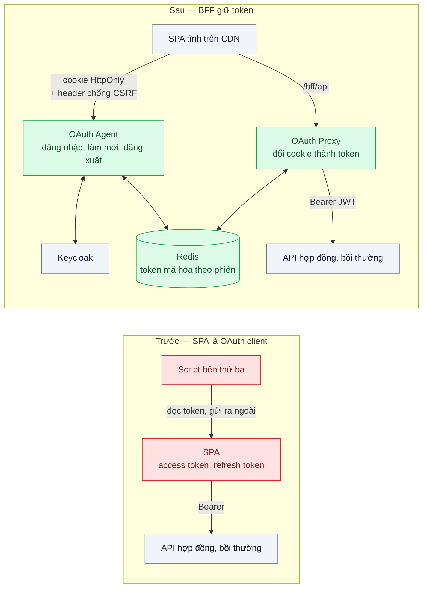
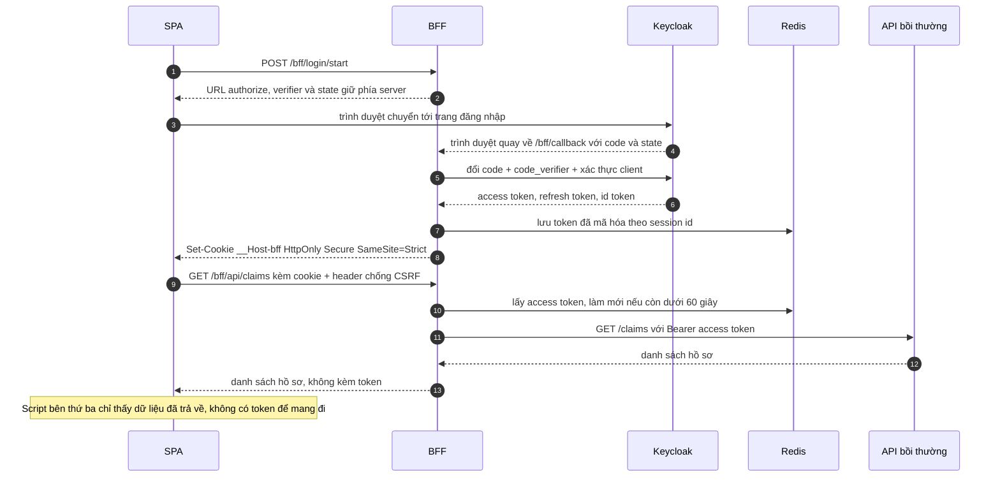

# BFF / Token Handler for SPA — Token không bao giờ chạm JavaScript trên trình duyệt

| Scope | Mức độ | Trạng thái | Pattern gốc | Cập nhật |
|---|---|---|---|---|
| 19 · backend / frontend / authenticate | 🟡 Trung bình | 📋 Kế hoạch | Backend for Frontend / Token Handler — IETF draft "OAuth 2.0 for Browser-Based Apps"; Curity, "The Token Handler Pattern" | 2026-10-06 |

> **Một câu tóm tắt:** Đặt một backend nhỏ cùng site với SPA làm OAuth client thay cho trình duyệt: backend giữ access token và refresh token, trình duyệt chỉ cầm một cookie `HttpOnly`, nên không đoạn JavaScript nào trên trang — kể cả script bên thứ ba bị chèn mã — lấy được token để mang đi nơi khác.

## 1. Bài toán thực tế (What)

**Bối cảnh** *(doanh nghiệp giả định, số liệu minh họa)*
Công ty bảo hiểm có cổng khách hàng dạng SPA để xem hợp đồng, nộp hồ sơ bồi thường kèm ảnh chứng từ y tế và đóng phí. SPA tự làm OAuth Authorization Code + PKCE với IdP (như bài 03), giữ access token trong bộ nhớ và refresh token trong `localStorage` cho tính năng "ghi nhớ đăng nhập". Trang nạp 6 script bên thứ ba: chat hỗ trợ, phân tích hành vi, A/B test và một tag manager do agency marketing quản lý.

**Triệu chứng người kinh doanh nhìn thấy**
- Tài khoản tag manager của agency bị chiếm; một đoạn script được thêm vào trang, gửi refresh token của khách ra ngoài trong 2 ngày trước khi bị phát hiện.
- Hồ sơ bồi thường có dữ liệu sức khỏe; đánh giá tuân thủ yêu cầu chứng minh token truy cập dữ liệu này không lộ ra trình duyệt.
- Đội phát triển không kiểm soát được script nào chạy trên trang vì marketing tự thêm qua tag manager.

**Nguyên nhân kỹ thuật**
Mọi script nạp vào trang chạy trong cùng ngữ cảnh JavaScript với SPA. Token nằm trong bộ nhớ, `localStorage` hay biến toàn cục đều nằm trong tầm với của script đó. PKCE bảo vệ bước đổi code, không bảo vệ token sau khi SPA đã nhận. Refresh token còn sống lâu, nên lấy được một lần là dùng được nhiều ngày từ máy khác.

**Ràng buộc**
- SPA vẫn build tĩnh và phục vụ qua CDN; không viết lại thành ứng dụng render phía server.
- Các API nghiệp vụ (hợp đồng, bồi thường, thanh toán) giữ nguyên cách xác minh JWT hiện tại.
- Không bỏ được script bên thứ ba vì lý do kinh doanh.
- Độ trễ thêm mỗi lời gọi API không quá vài chục mili giây.

## 2. Vì sao dùng pattern này (Why)

**Nguyên nhân gốc mà pattern nhắm vào:** trình duyệt là nơi duy nhất trong hệ thống không thể giữ bí mật, vậy mà token lại nằm ở đó.

**Pattern giải quyết thế nào:** draft IETF "OAuth 2.0 for Browser-Based Apps" mô tả kiến trúc *Backend for Frontend* là phương án an toàn nhất cho SPA: một backend cùng site làm confidential client, tự thực hiện luồng Authorization Code + PKCE, nhận và giữ token phía server, và cấp cho trình duyệt một cookie phiên `HttpOnly; Secure; SameSite`. SPA gọi API qua BFF; BFF tra token theo phiên, làm mới khi sắp hết hạn, gắn header `Authorization` rồi chuyển tiếp. Curity tách vai trò này thành hai phần: *OAuth Agent* lo đăng nhập, đăng xuất, làm mới và phát cookie; *OAuth Proxy* đứng ở gateway đổi cookie thành token trước khi tới API — nhờ vậy SPA vẫn tĩnh trên CDN. Ý tưởng BFF gốc của Sam Newman (một backend riêng cho từng loại frontend) ở đây được dùng cho mục tiêu bảo mật. Vì xác thực bằng cookie, BFF phải chống CSRF. Điều pattern *không* làm được: script độc vẫn gửi request qua BFF khi trang đang mở; pattern ngăn việc *mang token đi*, không ngăn XSS.

**Lựa chọn khác đã cân nhắc**

| Lựa chọn | Giải quyết được gì | Vì sao không chọn (ở bài này) |
|---|---|---|
| Giữ nguyên + tối ưu nhỏ (token chỉ trong bộ nhớ, rotation, CSP và SRI cho script) | Thu hẹp bề mặt tấn công | Script cùng trang vẫn đọc được token trong bộ nhớ; tag manager thay đổi nội dung ngoài quy trình review |
| Token-Mediating Backend (backend lấy token rồi trả access token cho SPA) | Refresh token ở server | Access token vẫn chạm JavaScript; draft xếp sau BFF về mức an toàn |
| Session cookie thuần, bỏ OAuth (bài 02) | Đơn giản nhất | Cổng phải dùng chung IdP với app mobile và gọi nhiều API cần JWT |
| BFF / Token Handler (chọn) | Token không bao giờ tới trình duyệt; làm mới ở server; thu hồi tập trung | Thêm một chặng trên mỗi request; phải chống CSRF; BFF trở thành nơi tập trung token cần bảo vệ |

## 3. Thiết kế hệ thống (How)

### 3.1 Kiến trúc trước và sau



### 3.2 Luồng chính



### 3.3 Thành phần và trách nhiệm

| Thành phần | Trách nhiệm | Quyết định thiết kế đáng chú ý |
|---|---|---|
| OAuth Agent | Bắt đầu và kết thúc đăng nhập, đăng xuất, trả thông tin người dùng, làm mới token | Là confidential client với Keycloak; không có endpoint nào trả token cho SPA |
| OAuth Proxy | Đổi cookie thành access token, chuyển tiếp tới API | Chỉ chuyển tiếp tới danh sách upstream cho phép; bỏ cookie trước khi gửi đi |
| Token store (Redis) | Lưu token theo session id | Mã hóa token bằng khóa ngoài Redis; TTL bằng hạn refresh token |
| Chống CSRF | Từ chối request thiếu header tùy chỉnh hoặc có `Origin` lạ | `SameSite=Strict` cho cookie BFF vì SPA và BFF cùng site |
| Đăng xuất | Xóa phiên BFF, thu hồi refresh token, gọi đăng xuất phía IdP | Ba việc trong một hành động, nếu không phiên IdP còn sống |
| API nghiệp vụ | Giữ nguyên xác minh JWT | Không cần biết BFF tồn tại |

### 3.4 Điểm dễ sai khi triển khai
- **BFF thành proxy mở**: chuyển tiếp mọi đường dẫn tới mọi host là lỗ SSRF. Chỉ cho phép danh sách route và upstream cố định.
- **Thêm endpoint `/bff/token` "cho tiện"** để SPA lấy access token gọi API khác — quay về đúng điểm xuất phát.
- **Bỏ chống CSRF vì đã có SameSite**: subdomain khác cùng site vẫn gửi được request; giữ header tùy chỉnh và kiểm `Origin`.
- **Phản chiếu `Origin` trong CORS kèm credentials**: bất kỳ trang nào được phản chiếu cũng gọi được BFF bằng cookie của người dùng.
- **Giữ token trong bộ nhớ tiến trình BFF**: pod khởi động lại là mọi người bị đăng xuất, và không scale ngang được.
- **Tin rằng BFF chống được XSS**: vẫn cần CSP, kiểm soát tag manager, review script bên thứ ba.

## 4. Tech stack và tác động (Impact techstack)

| Lớp | Công nghệ chọn | Vì sao chọn | Thay thế tương đương |
|---|---|---|---|
| BFF | NestJS + `openid-client` | Client OIDC phía server, hỗ trợ PKCE và làm mới token (API cần xác minh theo phiên bản) | Route Handlers của Next.js làm BFF; Duende BFF cho .NET |
| IdP | Keycloak | IdP local của repo; client confidential cho BFF | Bất kỳ IdP OIDC nào |
| Token store | Redis 7 | Tra theo session id, TTL, chia sẻ giữa nhiều pod BFF | Cookie mã hóa chứa token như cách Curity mô tả |
| SPA | Next.js build tĩnh | Giữ nguyên ràng buộc phục vụ qua CDN | Vite + React |
| API nghiệp vụ | NestJS + `jose` | Không đổi | — |
| Kiểm thử | Vitest, Playwright, OWASP ZAP | Test SPA không thấy token; giả lập script bên thứ ba độc; quét CSRF và cookie | — |
| Đo | k6 | Độ trễ thêm khi đi qua BFF | — |

**Thay đổi so với hệ thống hiện tại:** thêm BFF và Redis; SPA bỏ toàn bộ thư viện OAuth, gọi `/bff/api` thay vì gọi thẳng API; client trên Keycloak đổi từ public sang confidential. Đội vận hành học xoay khóa mã hóa token và theo dõi BFF như thành phần nằm trên đường đi của mọi request.

## 5. Kết quả đầu ra và cách đo (Output impact)

| Chỉ số | Trước (minh họa) | Mục tiêu khi thực hành | Cách đo |
|---|---|---|---|
| Token đọc được từ JavaScript của trang | Access token trong bộ nhớ, refresh token trong `localStorage` | 0 | Playwright chèn script giả lập bên thứ ba quét Web Storage, `document.cookie`, chặn `fetch`/XHR tìm chuỗi token; kiểm file HAR |
| Script độc lấy được token khi tag manager bị chèn mã | Có | Không | Test tích hợp mô phỏng script độc gửi mọi thứ đọc được về máy chủ giả |
| Độ trễ thêm khi qua BFF, p95 | 0 ms | ≤ 15 ms | k6 so sánh gọi thẳng API và qua BFF trong cùng mạng Docker |
| Request đổi dữ liệu từ origin khác được chấp nhận | — | 0 | Test từ origin khác; OWASP ZAP |
| Upstream ngoài danh sách cho phép | — | 0 | Test gọi đường dẫn có `..`, host lạ, kỳ vọng 404 |
| Thời gian thu hồi phiên sau đăng xuất | Tới hết hạn refresh token | Request kế tiếp nhận 401 | Test đăng xuất rồi phát lại cookie |

> Số "trước" là minh họa để hình dung bài toán. Số "mục tiêu" chỉ được coi là đạt khi có số đo thật
> ở mục 8 kèm môi trường đo.

**Tác động nghiệp vụ mong đợi:** một script bên thứ ba bị chiếm không còn đồng nghĩa với lộ phiên của khách; công ty có câu trả lời rõ cho đánh giá tuân thủ về nơi token được lưu.

## 6. Đánh đổi và khi KHÔNG nên dùng

**Đánh đổi**
- Thêm một thành phần trên đường đi mọi request: thêm độ trễ, thêm điểm hỏng, cần scale và giám sát.
- BFF tập trung token của mọi người dùng — trở thành mục tiêu giá trị cao, cần bảo vệ khóa mã hóa và quyền truy cập Redis.
- SPA và BFF phải cùng site; tách domain tùy ý không còn được.

**Không nên dùng khi**
- Ứng dụng đã render phía server và có session cookie (bài 02): bản thân server đó đã là BFF.
- App mobile native: không có ngữ cảnh JavaScript dùng chung với script lạ; dùng PKCE và kho khóa của hệ điều hành (bài 03, bài 04).
- SPA chỉ gọi một API của chính mình, không có IdP ngoài: session cookie đơn giản hơn.

**Liên quan**
- [Scope 01 bài 04 — Backend for Frontend (BFF)](../../01-frontend-backend-transporter/04-bff-web-mobile-can-du-lieu-khac-nhau/) — pattern BFF gốc, nên đọc trước.
- [Bài 03 — OAuth 2.0 + PKCE](../03-oauth2-pkce-dang-nhap-google-cho-spa-va-mobile/) — luồng mà BFF thực hiện thay trình duyệt.
- [Bài 04 — Refresh Token Rotation](../04-refresh-token-rotation-token-bi-danh-cap-dung-mai/) — BFF vẫn nên xoay refresh token phía server.
- [Scope 18 bài 01 — Stateless Service & Externalized Session](../../18-backend-scale/01-stateless-session-externalized-login-server-a-server-b-khong-biet/) — vì sao token store nằm ở Redis.

## 7. Cơ sở tham khảo

- IETF OAuth WG, "OAuth 2.0 for Browser-Based Apps" (draft-ietf-oauth-browser-based-apps) — https://datatracker.ietf.org/doc/draft-ietf-oauth-browser-based-apps/ — mô tả kiến trúc BFF, Token-Mediating Backend và client thuần trình duyệt, cùng mối đe dọa của từng loại.
- Curity, "The Token Handler Pattern" — https://curity.io/resources/learn/the-token-handler-pattern/ — tách OAuth Agent và OAuth Proxy để SPA vẫn tĩnh trên CDN.
- Sam Newman, "Pattern: Backends For Frontends", 2015 — https://samnewman.io/patterns/architectural/bff/ — ý tưởng gốc về backend riêng cho từng frontend.
- Lodderstedt et al., RFC 9700, *Best Current Practice for OAuth 2.0 Security*, 2025 — https://www.rfc-editor.org/rfc/rfc9700 — khuyến nghị cho confidential client và bảo vệ refresh token mà BFF áp dụng.
- OWASP Cheat Sheet Series, "Cross-Site Request Forgery Prevention Cheat Sheet" — https://cheatsheetseries.owasp.org/cheatsheets/Cross-Site_Request_Forgery_Prevention_Cheat_Sheet.html — header tùy chỉnh và kiểm tra `Origin` cho BFF xác thực bằng cookie.
- openid-client — https://github.com/panva/openid-client — thư viện client OIDC phía server dùng ở mục 4.

## 8. Kế hoạch thực hành

- [ ] Bước 1: dựng Keycloak, Redis, API bồi thường, SPA bằng Docker Compose; phiên bản `truoc/` SPA tự làm OAuth và giữ token; thêm script "bên thứ ba" giả lập có thể bật chế độ độc.
- [ ] Bước 2: đo "trước": Playwright cho thấy script độc lấy được refresh token; k6 đo p95 gọi thẳng API.
- [ ] Bước 3: áp dụng pattern: OAuth Agent và OAuth Proxy trong NestJS, token mã hóa trong Redis, cookie `__Host-bff`, chống CSRF, danh sách upstream cố định.
- [ ] Bước 4: đo "sau" cùng kịch bản, chạy OWASP ZAP; ghi số và môi trường vào mục 5.
- [ ] Bước 5: test: SPA không thấy token ở bất kỳ đâu; request thiếu header chống CSRF bị 403; upstream lạ bị 404; đăng xuất làm cookie cũ vô hiệu; access token sắp hết hạn được làm mới trong suốt.

**Cấu trúc code dự kiến**
```text
src/
  bff/oauth-agent.controller.ts   # [PATTERN] login start, callback, logout, userinfo
  bff/oauth-proxy.ts              # [PATTERN] cookie sang token, danh sách upstream
  bff/token-store.ts              # Redis, mã hóa token
  bff/csrf.guard.ts
  claims-api/claims.controller.ts # API nghiệp vụ, xác minh JWT bằng jose
web/                              # SPA tĩnh, gọi /bff/api
  public/fake-third-party.js      # script bên thứ ba giả lập
test/
  spa-sees-no-token.spec.ts       # Playwright
  proxy-upstream-allowlist.test.ts
  csrf-guard.test.ts
bench/bff-overhead.k6.js
docker-compose.yml
```

**Cách chạy** *(điền khi bắt đầu code)*
```bash
docker compose up -d
pnpm install && pnpm test
```
