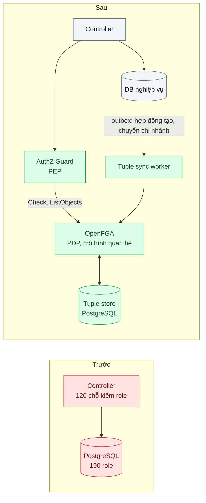
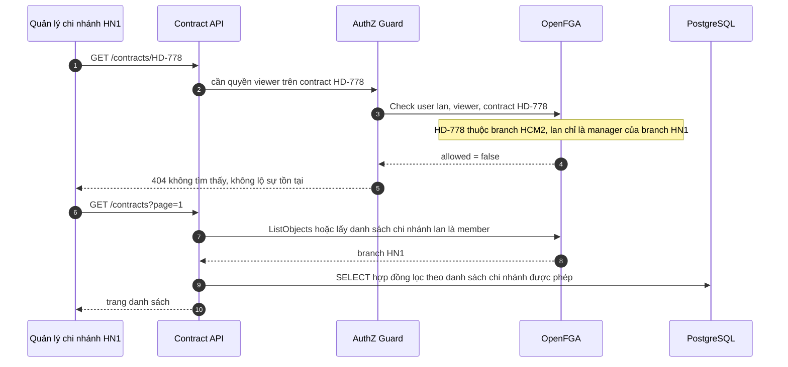

# RBAC → ABAC → ReBAC — Phân quyền "quản lý chi nhánh chỉ xem hợp đồng chi nhánh mình" vượt khả năng của role

| Scope | Mức độ | Trạng thái | Pattern gốc | Cập nhật |
|---|---|---|---|---|
| 19 · backend / frontend / authenticate | 🔴 Nâng cao | 📋 Kế hoạch | RBAC (Ferraiolo & Kuhn, 1992) → ABAC (NIST SP 800-162, 2014) → ReBAC (Zanzibar, USENIX ATC 2019) | 2026-10-06 |

> **Một câu tóm tắt:** Giữ role cho quyền chức năng thô, chuyển phần "ai xem được hợp đồng nào" sang mô hình quan hệ kiểu Zanzibar (người — chi nhánh — vùng — hợp đồng) do một policy decision point duy nhất trả lời, để thêm chi nhánh là thêm dữ liệu chứ không thêm role và sửa code.

## 1. Bài toán thực tế (What)

**Bối cảnh** *(doanh nghiệp giả định, số liệu minh họa)*
Công ty bảo hiểm 42 chi nhánh, 1.800 nhân viên và đại lý, dùng hệ thống quản lý hợp đồng nội bộ (NestJS + PostgreSQL). Ban đầu có 4 role: quản trị, quản lý, nhân viên, kế toán. Rồi yêu cầu đến dần: quản lý chi nhánh chỉ xem hợp đồng chi nhánh mình; nhân viên chỉ thấy hợp đồng mình phụ trách hoặc được chia sẻ; trưởng vùng thấy mọi chi nhánh trong vùng; kiểm soát nội bộ xem tất cả nhưng chỉ đọc.

**Triệu chứng người kinh doanh nhìn thấy**
- Một quản lý chi nhánh xuất được file hợp đồng (có thông tin sức khỏe khách hàng) của chi nhánh khác qua chức năng "xuất Excel" — sự cố phải báo cáo nội bộ.
- Mở một chi nhánh mới mất 2 ngày: tạo 4 role mới, sửa code ở nhiều nơi, deploy.
- Kiểm toán hỏi "ai đang xem được hợp đồng HD-778?" — không ai trả lời được nếu không đọc code.

**Nguyên nhân kỹ thuật**
Đội đã đối phó bằng role theo chi nhánh (`QUAN_LY_CN_01` … `QUAN_LY_CN_42`), nay có khoảng 190 role, và khoảng 120 chỗ `if (user.roles.includes(...))` rải trong controller. RBAC gán quyền theo *người — role — quyền*, không biết gì về *tài nguyên cụ thể*; quyền thật ở đây lại phụ thuộc quan hệ giữa người và hợp đồng (cùng chi nhánh, là người phụ trách, được chia sẻ, chi nhánh thuộc vùng mình quản lý). Endpoint chi tiết có kiểm, nhưng danh sách, tìm kiếm và xuất file thì quên.

**Ràng buộc**
- Phải trả lời được câu hỏi kiểm toán "ai xem được X" và "X xem được gì".

## 2. Vì sao dùng pattern này (Why)

**Nguyên nhân gốc mà pattern nhắm vào:** quyết định phân quyền phụ thuộc quan hệ giữa người và tài nguyên, nhưng mô hình chỉ biểu diễn được quan hệ giữa người và role.

**Pattern giải quyết thế nào:** đây là một chuỗi mô hình, mỗi bước thêm ngữ cảnh. *RBAC* (Ferraiolo & Kuhn, chuẩn hóa ở INCITS 359) đủ cho quyền chức năng như "được dùng module báo cáo". *ABAC* (NIST SP 800-162) quyết định dựa trên thuộc tính của chủ thể, tài nguyên, hành động, môi trường — "`user.branch == contract.branch`" — và tách *policy enforcement point* (PEP) khỏi *policy decision point* (PDP). *ReBAC* theo Zanzibar coi quyền là đồ thị quan hệ lưu dưới dạng tuple `đối tượng#quan hệ@người`, và quyền được suy ra bằng quy tắc: người xem hợp đồng = người phụ trách, hoặc người được chia sẻ, hoặc thành viên của chi nhánh sở hữu; quản lý chi nhánh = người được gán, hoặc quản lý của vùng cha. Thêm chi nhánh là ghi vài tuple. Vì quan hệ là dữ liệu, PDP trả lời được cả hai chiều: "người này xem được gì" và "ai xem được cái này".

**Lựa chọn khác đã cân nhắc**

| Lựa chọn | Giải quyết được gì | Vì sao không chọn (ở bài này) |
|---|---|---|
| Giữ nguyên + tối ưu nhỏ (gom kiểm tra role vào helper chung) | Bớt trùng lặp code | Role vẫn bùng nổ theo chi nhánh; chia sẻ từng hợp đồng không biểu diễn được |
| ABAC trong code hoặc policy engine (CASL, OPA) | Biểu diễn được "cùng chi nhánh"; chính sách tập trung | Quan hệ nhiều tầng (vùng → chi nhánh → hợp đồng, chia sẻ cá nhân) phải tự nạp thuộc tính mỗi lần; khó trả lời "ai xem được X" |
| Row-Level Security của PostgreSQL | Lọc ở DB, không thể quên | Rất hợp cho cách ly tenant (bài 09); quan hệ nhiều tầng viết bằng SQL policy khó bảo trì và khó kiểm toán |
| ReBAC với OpenFGA + RBAC cho quyền chức năng (chọn) | Quan hệ là dữ liệu; mở chi nhánh không sửa code; truy vấn được hai chiều | Thêm một service phải vận hành; phải đồng bộ tuple với DB nghiệp vụ; lọc danh sách cần thiết kế riêng |

## 3. Thiết kế hệ thống (How)

### 3.1 Kiến trúc trước và sau



Mô hình quan hệ (DSL của OpenFGA, cú pháp cần xác minh theo phiên bản; quyền chức năng vẫn dùng khoảng 6 role):
```text
model
  schema 1.1
type user
type region
  relations
    define manager: [user]
type branch
  relations
    define parent: [region]
    define manager: [user] or manager from parent
    define member: [user] or manager
type contract
  relations
    define branch: [branch]
    define owner: [user]
    define shared_with: [user]
    define viewer: owner or shared_with or member from branch
```

### 3.2 Luồng chính



### 3.3 Thành phần và trách nhiệm

| Thành phần | Trách nhiệm | Quyết định thiết kế đáng chú ý |
|---|---|---|
| Mô hình quan hệ | Định nghĩa type, relation, quy tắc suy quyền | Lưu trong Git, review như code, test bằng bộ assertion của OpenFGA |
| AuthZ Guard (PEP) | Gọi PDP trước mỗi hành động; áp cho chi tiết, danh sách, tìm kiếm, xuất file | Từ chối khi PDP lỗi hoặc timeout (fail closed) |
| OpenFGA (PDP) | Trả lời Check, ListObjects; truy vấn ngược "ai có quyền" | Một nơi duy nhất ra quyết định |
| Tuple sync worker | Ghi tuple khi tạo hợp đồng, chuyển chi nhánh, đổi người phụ trách | Đi qua transactional outbox để không lệch với DB nghiệp vụ |
| Lọc danh sách | Danh sách lớn lọc bằng SQL theo chi nhánh được phép; danh sách nhỏ dùng ListObjects | Không gọi Check cho từng dòng |

### 3.4 Điểm dễ sai khi triển khai
- **Kiểm ở endpoint chi tiết, quên ở danh sách, tìm kiếm, xuất file, báo cáo** — đúng là lỗ của sự cố ban đầu.
- **Tuple lệch với DB**: chuyển hợp đồng sang chi nhánh khác mà không cập nhật tuple là lộ hoặc mất quyền. Dùng outbox, có job đối soát định kỳ.
- **"New enemy problem"** mà Zanzibar mô tả: thu hồi quyền rồi thêm nội dung mới, nhưng PDP đọc dữ liệu cũ nên người vừa bị thu hồi vẫn thấy. Zanzibar dùng zookie; OpenFGA và SpiceDB có tùy chọn mức nhất quán tương ứng (cần xác minh).
- **Gọi Check cho từng dòng** của danh sách 500 dòng — N+1 ở tầng phân quyền (xem [scope 02 bài 01](../../02-backend-database/01-n-plus-1-trang-50-don-ban-151-cau-sql/)). Và trả 403 thay vì 404 cho tài nguyên không được xem là lộ rằng nó tồn tại.

## 4. Tech stack và tác động (Impact techstack)

| Lớp | Công nghệ chọn | Vì sao chọn | Thay thế tương đương |
|---|---|---|---|
| PDP | OpenFGA (Docker, datastore PostgreSQL) + `@openfga/sdk` | Mô hình theo Zanzibar, DSL dễ đọc, có Check, ListObjects và bộ test mô hình | SpiceDB (Zanzibar, có ZedToken cho nhất quán); Cerbos hoặc OPA nếu chỉ cần ABAC |
| PEP | NestJS Guard + decorator khai báo quyền | Gắn quyền ngay tại route, khó quên | Middleware thuần |
| DB nghiệp vụ | PostgreSQL 16 | Lọc danh sách theo chi nhánh; bảng outbox | — |
| Đồng bộ tuple | Worker đọc outbox | Cùng transaction với thay đổi nghiệp vụ | Debezium CDC |
| Kiểm thử | Vitest dạng bảng | Ma trận người dùng × hợp đồng × hành động × endpoint | — |

**Thay đổi so với hệ thống hiện tại:** thêm OpenFGA và worker đồng bộ; thay 120 chỗ kiểm role bằng guard khai báo; gộp 190 role về khoảng 6 role chức năng. Đội vận hành học đọc mô hình quan hệ, ghi tuple khi tổ chức thay đổi, và trả lời câu hỏi kiểm toán bằng truy vấn.

## 5. Kết quả đầu ra và cách đo (Output impact)

| Chỉ số | Trước (minh họa) | Mục tiêu khi thực hành | Cách đo |
|---|---|---|---|
| Rò rỉ chéo chi nhánh | 14 endpoint lộ theo pentest nội bộ | 0 | Test Vitest dạng bảng: mọi cặp người dùng × hợp đồng × hành động trên chi tiết, danh sách, tìm kiếm, xuất file |
| Thời gian mở một chi nhánh mới | 2 ngày, có sửa code | ≤ 10 phút, chỉ ghi tuple | Diễn tập trên môi trường thử |
| p99 Check | Chưa có | ≤ 10 ms | k6 gọi endpoint có guard; `histogram_quantile` trên histogram độ trễ của guard |
| p95 trang danh sách 50 hợp đồng | ~120 ms | ≤ 200 ms | k6 100 request/giây |
| Trả lời "ai xem được hợp đồng X" | Không trả lời được | ≤ 1 phút bằng truy vấn PDP | Gọi API truy vấn ngược của OpenFGA (tên API cần xác minh theo phiên bản) |
| Hành vi khi PDP không phản hồi | — | Từ chối, không mở cửa | Test dừng container OpenFGA giữa chừng |

> Số "trước" là minh họa để hình dung bài toán. Số "mục tiêu" chỉ được coi là đạt khi có số đo thật
> ở mục 8 kèm môi trường đo.

**Tác động nghiệp vụ mong đợi:** dữ liệu khách hàng không còn rò giữa chi nhánh; thay đổi tổ chức là thao tác dữ liệu; kiểm toán nhận câu trả lời trong vài phút.

## 6. Đánh đổi và khi KHÔNG nên dùng

**Đánh đổi**
- Thêm một service vào đường đi của mọi request; PDP chậm hoặc chết là toàn hệ thống từ chối.
- Hai nguồn dữ liệu (DB nghiệp vụ và tuple) phải luôn khớp; cần outbox và đối soát.

**Không nên dùng khi**
- Quyền thật sự chỉ theo chức năng (vài role, không phụ thuộc tài nguyên): RBAC là đủ.
- Chỉ cần cách ly theo tenant: RLS + tenant trong token (bài 09) đơn giản và chắc hơn.

**Liên quan**
- [Bài 09 — Multi-tenant Authorization](../09-multi-tenant-auth-tenant-trong-token-va-cach-ly/) — lớp cách ly tenant nằm dưới mô hình này.
- [Scope 14 bài 03 — Transactional Outbox](../../14-backend-queueing/03-transactional-outbox-ghi-don-xong-crash-mat-event/) — đồng bộ tuple không lệch với DB.

## 7. Cơ sở tham khảo

- David Ferraiolo & Richard Kuhn, "Role-Based Access Controls", 15th National Computer Security Conference, 1992; chuẩn hóa ở ANSI INCITS 359 — mô hình RBAC gốc và giới hạn của nó.
- NIST SP 800-162, *Guide to Attribute Based Access Control (ABAC) Definition and Considerations*, 2014 — định nghĩa ABAC, thuộc tính chủ thể/tài nguyên/môi trường, kiến trúc PEP–PDP.
- Pang et al., "Zanzibar: Google's Consistent, Global Authorization System", USENIX ATC 2019 — https://research.google/pubs/zanzibar-googles-consistent-global-authorization-system/ — mô hình tuple, userset rewrite, "new enemy problem" và zookie.
- OpenFGA docs — https://openfga.dev/docs — DSL mô hình, Check, ListObjects, test mô hình dùng ở mục 3 và 4.
- SpiceDB docs — https://authzed.com/docs — phương án thay thế theo Zanzibar, cách xử lý nhất quán bằng ZedToken.

## 8. Kế hoạch thực hành

- [ ] Bước 1: dựng PostgreSQL + OpenFGA + Contract API; seed 3 vùng, 6 chi nhánh, 40 người dùng, 2.000 hợp đồng; phiên bản `truoc/` kiểm role kiểu cũ, cố ý thiếu kiểm ở endpoint xuất file.
- [ ] Bước 2: đo "trước": chạy ma trận test để đếm rò rỉ; k6 đo p95 danh sách.
- [ ] Bước 3: áp dụng pattern: viết mô hình, guard khai báo, worker đồng bộ qua outbox, lọc danh sách theo chi nhánh được phép.
- [ ] Bước 4: đo "sau" cùng kịch bản; ghi số và môi trường vào mục 5.
- [ ] Bước 5: test: ma trận quyền không rò; trưởng vùng thấy mọi chi nhánh trong vùng; chuyển hợp đồng sang chi nhánh khác thì quyền đổi theo; PDP chết thì từ chối.

**Cấu trúc code dự kiến**
```text
authz/model.fga                   # mô hình quan hệ, kèm file assertion cho mô hình
src/
  truoc/role-checks.ts            # tái hiện kiểm role rải rác
  sau/authz.guard.ts              # [PATTERN] PEP gọi OpenFGA, fail closed
  sau/contract-list.query.ts      # lọc danh sách theo chi nhánh được phép
  sau/tuple-sync.worker.ts        # đọc outbox, ghi tuple
test/
  permission-matrix.test.ts       # bảng người dùng × hợp đồng × hành động
bench/contract-list.k6.js
docker-compose.yml
```

**Cách chạy** *(điền khi bắt đầu code)*
```bash
docker compose up -d
pnpm install && pnpm test
```
