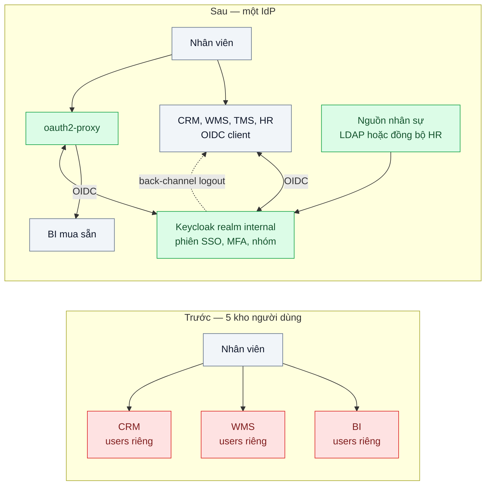
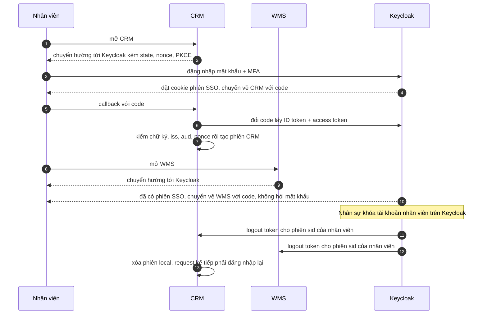

# SSO with OpenID Connect — 5 ứng dụng nội bộ, 5 lần đăng nhập, 5 nơi quản lý user

| Scope | Mức độ | Trạng thái | Pattern gốc | Cập nhật |
|---|---|---|---|---|
| 19 · backend / frontend / authenticate | 🟡 Trung bình | 📋 Kế hoạch | Single Sign-On / Federated Identity — OpenID Connect Core 1.0 (2014); Azure "Federated Identity pattern" | 2026-10-06 |

> **Một câu tóm tắt:** Đưa việc xác thực của 5 ứng dụng nội bộ về một Identity Provider dùng OpenID Connect, để nhân viên đăng nhập một lần, IT quản lý người dùng ở một nơi, và khóa một tài khoản là mất quyền ở mọi ứng dụng trong vài giây.

## 1. Bài toán thực tế (What)

**Bối cảnh** *(doanh nghiệp giả định, số liệu minh họa)*
Công ty logistics khoảng 1.200 nhân viên văn phòng, dùng 5 ứng dụng nội bộ: CRM khách hàng doanh nghiệp, quản lý kho (WMS), điều phối xe (TMS), cổng nhân sự và dashboard BI. Mỗi ứng dụng có bảng `users` và mật khẩu riêng; IT tạo tay tài khoản ở 5 nơi khi có người mới và xóa theo checklist khi có người nghỉ.

**Triệu chứng người kinh doanh nhìn thấy**
- Một nhân viên nghỉ việc vẫn đăng nhập WMS thêm 3 tuần vì checklist bỏ sót, và xuất báo cáo tồn kho của khách hàng lớn.
- Khoảng 40% ticket helpdesk là "quên mật khẩu" ở một trong 5 ứng dụng.
- Nhân viên mới mất 2 ngày mới có đủ tài khoản để làm việc.
- Kiểm toán hỏi "ai đang có quyền vào ứng dụng nào" — IT phải gom tay từ 5 hệ thống.

**Nguyên nhân kỹ thuật**
Danh tính bị nhân bản ở 5 nơi, mỗi nơi tự lưu mật khẩu, tự làm đăng nhập, tự giữ phiên. Không có nguồn sự thật duy nhất cho câu hỏi "người này còn làm ở công ty không", nên mọi thay đổi trạng thái nhân sự phải lan tay tới từng ứng dụng. Năm nơi lưu mật khẩu cũng là năm nơi có thể lộ.

**Ràng buộc**
- Dashboard BI là phần mềm mua sẵn, không sửa được code.
- Ứng dụng phải chạy tiếp khi chuyển đổi; người dùng cũ được ghép với danh tính mới, không tạo lại dữ liệu.
- Phân quyền chi tiết vẫn do từng ứng dụng quyết định; IdP chỉ trả lời "người này là ai, thuộc nhóm nào".

## 2. Vì sao dùng pattern này (Why)

**Nguyên nhân gốc mà pattern nhắm vào:** mỗi ứng dụng tự làm xác thực, nên danh tính và vòng đời người dùng bị phân mảnh.

**Pattern giải quyết thế nào:** *Federated Identity* (Azure Architecture Center) tách xác thực khỏi ứng dụng: ứng dụng tin một Identity Provider bên ngoài. OpenID Connect là lớp danh tính trên OAuth 2.0: ứng dụng chuyển người dùng tới IdP bằng Authorization Code, nhận lại *ID Token* — một JWT có `iss`, `sub`, `aud`, `exp`, `iat`, `nonce` — xác minh chữ ký và claim, rồi tạo phiên của riêng mình. IdP giữ phiên SSO bằng cookie của nó, nên lần đầu vào ứng dụng thứ hai chỉ là một vòng chuyển hướng không hỏi mật khẩu. Vòng đời người dùng nằm ở một chỗ: khóa trên IdP là không ai đăng nhập mới được; phiên đang mở ở các ứng dụng được kết thúc bằng phiên ứng dụng ngắn hoặc bằng back-channel logout (IdP gọi thẳng từng ứng dụng). Ứng dụng không sửa được thì đặt một reverse proxy biết OIDC đứng trước.

**Lựa chọn khác đã cân nhắc**

| Lựa chọn | Giải quyết được gì | Vì sao không chọn (ở bài này) |
|---|---|---|
| Giữ nguyên + tối ưu nhỏ (checklist offboarding chặt hơn, chính sách mật khẩu chung) | Giảm bỏ sót | Vẫn 5 kho người dùng, vẫn phụ thuộc người nhớ; quên mật khẩu vẫn nhân 5 |
| Mỗi ứng dụng tự bind LDAP để kiểm mật khẩu | Một mật khẩu cho mọi ứng dụng | Mỗi ứng dụng vẫn nhận mật khẩu thô; không có SSO thật; MFA không tập trung được |
| SAML 2.0 | SSO doanh nghiệp, phần mềm mua sẵn hay hỗ trợ | XML phức tạp, ít thư viện Node tốt; OIDC hợp hơn cho web hiện đại — Keycloak vẫn bật SAML được cho phần mềm cần |
| IdP dịch vụ quản lý (Entra ID, Google Workspace) | Không phải vận hành IdP | Hợp lệ nếu công ty đã dùng; bài dùng Keycloak để thực hành local, giao thức như nhau |
| OIDC với Keycloak (chọn) | Một nơi quản lý người dùng, SSO, MFA tập trung, khóa một lần | Keycloak thành điểm phụ thuộc; phải tích hợp lại 5 ứng dụng |

## 3. Thiết kế hệ thống (How)

### 3.1 Kiến trúc trước và sau



### 3.2 Luồng chính



### 3.3 Thành phần và trách nhiệm

| Thành phần | Trách nhiệm | Quyết định thiết kế đáng chú ý |
|---|---|---|
| Keycloak realm `internal` | Xác thực, phiên SSO, MFA, nhóm người dùng | Chạy ít nhất 2 bản, DB PostgreSQL có sao lưu; là điểm phụ thuộc của mọi ứng dụng |
| Client cho từng ứng dụng | Confidential client, redirect URI khai báo chính xác | Mỗi ứng dụng một client để thu hồi và kiểm toán riêng |
| Mapper nhóm vào claim | Đưa `groups` vào ID token | Chỉ nhóm thô; quyền chi tiết vẫn ở ứng dụng (bài 06) |
| Endpoint back-channel logout ở mỗi ứng dụng | Nhận logout token, xóa phiên local theo `sid` | Ứng dụng phải lưu ánh xạ `sid` → phiên local |
| oauth2-proxy | Thêm OIDC trước dashboard BI không sửa được | Chỉ chuyển tiếp request đã xác thực; truyền danh tính qua header nội bộ |
| Ghép người dùng cũ | Lần đăng nhập đầu, ghép theo email đã chuẩn hóa, lưu `idp_sub` | Sau khi ghép, `sub` là khóa; email chỉ dùng một lần |

### 3.4 Điểm dễ sai khi triển khai
- **Dùng access token để biết "người này là ai"** ở ứng dụng: ID token dành cho client, access token dành cho API. Kiểm `aud` và `nonce` của ID token.
- **Phiên ứng dụng dài 30 ngày** và không có back-channel logout: khóa trên IdP không có tác dụng với phiên đang mở.
- **Giữ đăng nhập mật khẩu local song song "phòng khi IdP chết"** — thành cửa sau. Chỉ giữ một tài khoản khẩn cấp có kiểm soát và cảnh báo.
- **Ghép người dùng theo email không chuẩn hóa** (hoa thường, khoảng trắng, email cũ): trùng hoặc ghép nhầm người.
- **Nhồi mọi quyền chi tiết vào token**: token phình, đổi quyền phải chờ đăng nhập lại.
- **oauth2-proxy nhưng BI vẫn nghe ở cổng công khai**: người dùng đi vòng qua proxy. Chỉ mở BI trong mạng nội bộ.

## 4. Tech stack và tác động (Impact techstack)

| Lớp | Công nghệ chọn | Vì sao chọn | Thay thế tương đương |
|---|---|---|---|
| Identity Provider | Keycloak + PostgreSQL 16 | IdP local của repo; OIDC đầy đủ, phiên SSO, back-channel logout, MFA, user federation LDAP | Authentik, Zitadel; Entra ID hoặc Google Workspace nếu đã có |
| Ứng dụng NestJS | `openid-client` + session phía server | Client OIDC đã được chứng nhận, xử lý discovery và xác minh ID token | `passport-openidconnect` |
| Ứng dụng Next.js | Auth.js với provider Keycloak (cần xác minh cấu hình theo phiên bản) | Tích hợp sẵn luồng OIDC cho Next.js | Tự viết bằng `openid-client` |
| Ứng dụng không sửa được | oauth2-proxy (cần xác minh tham số cấu hình) | Thêm OIDC mà không đụng code | Pomerium |
| Kiểm thử | Vitest, Playwright | Test SSO qua nhiều ứng dụng, test khóa tài khoản | — |
| Hạ tầng local | Docker Compose | Keycloak, Postgres, 3 ứng dụng mẫu, oauth2-proxy | — |

**Thay đổi so với hệ thống hiện tại:** thêm Keycloak; 4 ứng dụng chuyển sang OIDC client, 1 ứng dụng đứng sau proxy; mỗi ứng dụng thêm cột `idp_sub` và endpoint back-channel logout. IT chuyển từ tạo tài khoản ở 5 nơi sang quản lý nhóm trên Keycloak.

## 5. Kết quả đầu ra và cách đo (Output impact)

| Chỉ số | Trước (minh họa) | Mục tiêu khi thực hành | Cách đo |
|---|---|---|---|
| Số kho tài khoản người dùng | 5 | 1 | Kiểm kê hệ thống |
| Thời gian từ lúc khóa nhân viên tới khi mất quyền ở mọi ứng dụng | Tới 3 tuần | ≤ 1 phút với ứng dụng có back-channel logout; ≤ hạn phiên với ứng dụng sau proxy | Test tích hợp: khóa user trên Keycloak, Playwright thử từng ứng dụng mỗi 10 giây |
| Số lần nhập mật khẩu mỗi ngày mỗi nhân viên | 5 | 1 | Đếm sự kiện đăng nhập trong Keycloak events so với số ứng dụng đã truy cập |
| Thời gian vào ứng dụng thứ hai khi đã có phiên SSO, p95 | ~20 giây gõ mật khẩu | ≤ 2 giây | Playwright đo từ lúc mở ứng dụng tới trang chính |
| Thời gian cấp quyền cho nhân viên mới | 2 ngày | ≤ 1 giờ | Diễn tập thêm người vào nhóm trên Keycloak |
| Ticket quên mật khẩu mỗi tháng | ~300 | Theo dõi xu hướng giảm | Báo cáo hệ thống helpdesk |

> Số "trước" là minh họa để hình dung bài toán. Số "mục tiêu" chỉ được coi là đạt khi có số đo thật
> ở mục 8 kèm môi trường đo.

**Tác động nghiệp vụ mong đợi:** nghỉ việc là mất quyền ngay; nhân viên mới làm việc được trong ngày; kiểm toán nhận danh sách quyền từ một nơi.

## 6. Đánh đổi và khi KHÔNG nên dùng

**Đánh đổi**
- Keycloak chết là không ai đăng nhập được ứng dụng nào: cần chạy nhiều bản, sao lưu và diễn tập khôi phục.
- Một tài khoản bị chiếm là vào được cả 5 ứng dụng — SSO bắt buộc đi cùng MFA (bài 08).
- Thêm một hệ thống phải nâng cấp và vá bảo mật định kỳ.

**Không nên dùng khi**
- Chỉ có một ứng dụng: session cookie (bài 02) đơn giản hơn.
- Công ty đã có IdP dịch vụ (Entra ID, Google Workspace): dùng luôn IdP đó qua OIDC, không dựng thêm Keycloak.
- Người dùng là khách hàng bên ngoài cần đăng nhập mạng xã hội: xem bài 03 — vẫn là OIDC nhưng bài toán khác.

**Liên quan**
- [Bài 03 — OAuth 2.0 + PKCE](../03-oauth2-pkce-dang-nhap-google-cho-spa-va-mobile/) — luồng Authorization Code mà OIDC dựa trên.
- [Bài 06 — RBAC → ABAC → ReBAC](../06-rbac-abac-rebac-phan-quyen-theo-chi-nhanh-phong-ban/) — phân quyền chi tiết sau khi biết người dùng là ai.
- [Bài 08 — MFA: TOTP & Passkeys](../08-mfa-totp-webauthn-passkey-tai-khoan-ke-toan-bi-chiem/) — bắt buộc khi một lần đăng nhập mở được mọi cửa.
- [Bài 10 — Machine-to-Machine Auth](../10-api-key-service-to-service-client-credentials-mtls/) — khi chính các ứng dụng gọi nhau.

## 7. Cơ sở tham khảo

- OpenID Foundation, *OpenID Connect Core 1.0* — https://openid.net/specs/openid-connect-core-1_0.html — ID token, các claim bắt buộc, `nonce`, quy tắc xác minh ID token ở client.
- Microsoft Azure Architecture Center, "Federated Identity pattern" — https://learn.microsoft.com/azure/architecture/patterns/federated-identity — tách xác thực khỏi ứng dụng, lợi ích và vấn đề cần cân nhắc như điểm lỗi đơn.
- OpenID Foundation, *OpenID Connect Back-Channel Logout 1.0* — https://openid.net/specs/openid-connect-backchannel-1_0.html (cần xác minh — chưa có trong danh mục nguồn chuẩn) — logout token và cách IdP báo ứng dụng kết thúc phiên.
- Keycloak documentation, Server Administration Guide — https://www.keycloak.org/documentation — realm, client OIDC, phiên SSO, back-channel logout, user federation LDAP dùng ở mục 3 và 4.
- Hardt (ed.), RFC 6749, *The OAuth 2.0 Authorization Framework*, 2012 — https://www.rfc-editor.org/rfc/rfc6749 — Authorization Code grant mà OIDC xây trên.

## 8. Kế hoạch thực hành

- [ ] Bước 1: dựng Keycloak + Postgres + 3 ứng dụng mẫu (NestJS, Next.js, một "BI" tĩnh sau oauth2-proxy), mỗi ứng dụng phiên bản `truoc/` có bảng users và mật khẩu riêng.
- [ ] Bước 2: đo "trước": đếm số lần nhập mật khẩu khi đi qua 3 ứng dụng; khóa user ở một ứng dụng và cho thấy hai ứng dụng còn lại vẫn vào được.
- [ ] Bước 3: áp dụng pattern: realm `internal`, client cho từng ứng dụng, mapper nhóm, back-channel logout, ghép người dùng cũ theo email chuẩn hóa.
- [ ] Bước 4: đo "sau" cùng kịch bản và ghi vào mục 5 kèm môi trường.
- [ ] Bước 5: test: đăng nhập một lần vào được ba ứng dụng; khóa user thì cả ba từ chối trong thời gian mục tiêu; ID token sai `aud` hoặc `nonce` bị từ chối; truy cập thẳng BI không qua proxy bị chặn.

**Cấu trúc code dự kiến**
```text
keycloak/realm-internal.json         # realm, client, mapper nhóm, MFA
apps/
  crm-nestjs/src/oidc-login.ts        # [PATTERN] discovery, xác minh ID token, phiên local
  crm-nestjs/src/backchannel-logout.ts
  wms-nextjs/auth.ts                  # Auth.js với Keycloak
  bi-static/                          # đứng sau oauth2-proxy
test/
  sso-across-apps.spec.ts             # Playwright
  disable-user-revokes-all.spec.ts
  id-token-validation.test.ts
docker-compose.yml
```

**Cách chạy** *(điền khi bắt đầu code)*
```bash
docker compose up -d
pnpm install && pnpm test
```
