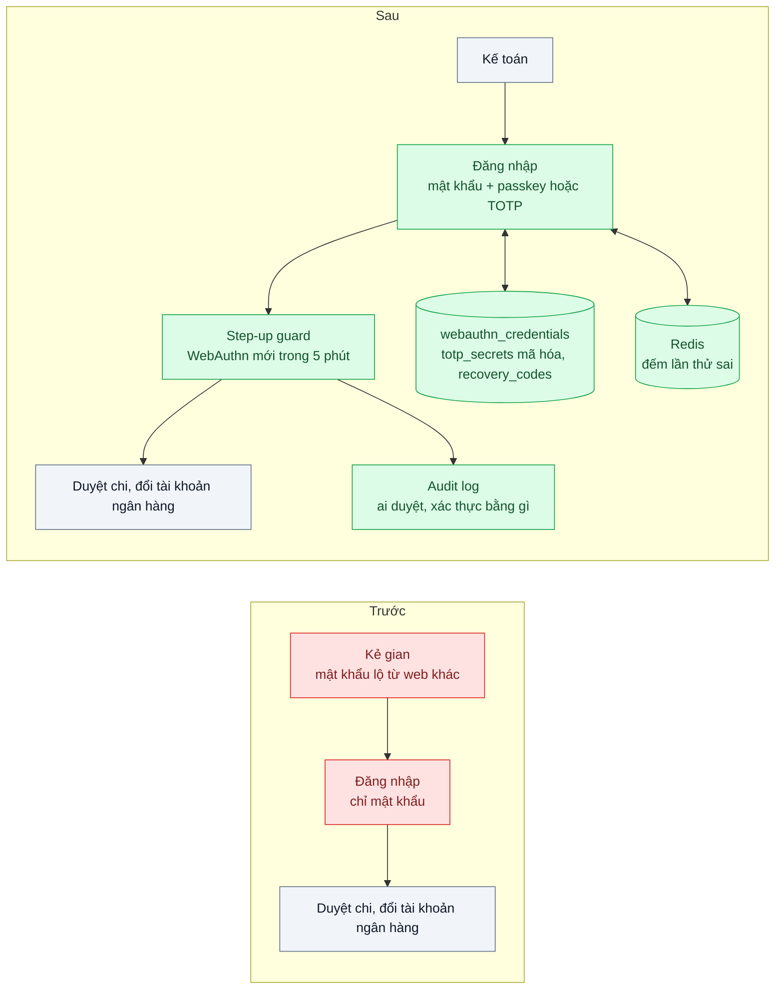
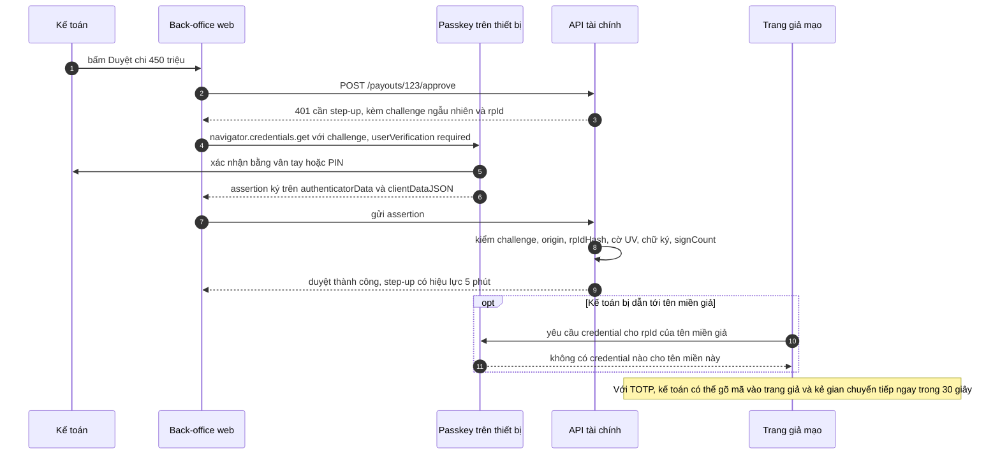

# MFA: TOTP & Passkeys (WebAuthn) — Tài khoản kế toán bị chiếm vì mật khẩu lộ từ web khác

| Scope | Mức độ | Trạng thái | Pattern gốc | Cập nhật |
|---|---|---|---|---|
| 19 · backend / frontend / authenticate | 🔴 Nâng cao | 📋 Kế hoạch | Multi-Factor Authentication — RFC 6238 (TOTP, 2011); W3C Web Authentication Level 3; FIDO Alliance passkeys | 2026-10-06 |

> **Một câu tóm tắt:** Bắt buộc yếu tố thứ hai cho tài khoản có quyền chi tiền — passkey (WebAuthn) chống được phishing làm mặc định, TOTP làm dự phòng — và yêu cầu xác thực lại ngay trước thao tác rủi ro cao, để một mật khẩu bị lộ ở nơi khác không còn đủ để rút tiền.

## 1. Bài toán thực tế (What)

**Bối cảnh** *(doanh nghiệp giả định, số liệu minh họa)*
Sàn thương mại điện tử có back-office tài chính: 25 kế toán duyệt chi trả cho khoảng 30.000 người bán và được quyền đổi tài khoản ngân hàng nhận tiền. Đăng nhập bằng email + mật khẩu, phiên sống 8 giờ.

**Triệu chứng người kinh doanh nhìn thấy**
- Một kế toán dùng lại mật khẩu đã lộ từ một diễn đàn bị hack. Kẻ gian đăng nhập back-office lúc 2 giờ sáng, đổi tài khoản ngân hàng của 12 người bán và duyệt chi khoảng 1,4 tỷ đồng.
- Người bán khiếu nại không nhận được tiền; sàn phải bồi hoàn và làm việc với ngân hàng.
- Đối tác thanh toán yêu cầu chứng minh tài khoản có quyền chi tiền dùng xác thực nhiều yếu tố chống phishing.

**Nguyên nhân kỹ thuật**
Chỉ một yếu tố — "thứ bạn biết". Mật khẩu dùng lại giữa nhiều trang nên lộ ở đâu cũng là lộ ở đây; kẻ tấn công thử hàng loạt cặp email/mật khẩu đã lộ (credential stuffing). Không có bước xác thực lại trước thao tác đổi tài khoản ngân hàng hay duyệt chi: có phiên là làm được mọi thứ suốt 8 giờ.

**Ràng buộc**
- Kế toán dùng laptop công ty và điện thoại cá nhân; không mua thêm khóa bảo mật phần cứng cho mọi người ngay.
- Luồng duyệt chi hằng ngày không được chậm đi đáng kể.
- Mất điện thoại không được làm kế toán nghỉ việc cả ngày, nhưng luồng khôi phục không được thành cửa sau.

## 2. Vì sao dùng pattern này (Why)

**Nguyên nhân gốc mà pattern nhắm vào:** một bí mật duy nhất, dùng lại được ở nhiều nơi và gõ được vào bất kỳ trang giả nào.

**Pattern giải quyết thế nào:** thêm yếu tố "thứ bạn có". *TOTP* (RFC 6238) sinh mã 6 chữ số từ bí mật chung và thời gian hiện tại theo bước 30 giây — rẻ, chạy offline trên app điện thoại, nhưng người dùng vẫn gõ được mã vào trang giả để kẻ gian chuyển tiếp ngay (phishing thời gian thực), và server phải giữ bí mật chung. *WebAuthn* (W3C) dùng cặp khóa: khóa riêng ở thiết bị, server chỉ giữ khóa công khai. Mỗi lần xác thực, thiết bị ký lên challenge ngẫu nhiên kèm `origin` mà trình duyệt điền; credential gắn với RP ID (tên miền), nên trang giả ở tên miền khác không gọi được credential thật — chống phishing theo thiết kế. *Passkey* (FIDO Alliance) là credential WebAuthn có thể đồng bộ giữa các thiết bị của người dùng, giải quyết bài toán mất máy. Cuối cùng, *step-up authentication*: thao tác rủi ro cao yêu cầu một lần xác thực WebAuthn mới trong vài phút gần nhất, kể cả khi đã đăng nhập.

**Lựa chọn khác đã cân nhắc**

| Lựa chọn | Giải quyết được gì | Vì sao không chọn (ở bài này) |
|---|---|---|
| Giữ nguyên + tối ưu nhỏ (mật khẩu dài hơn, đổi định kỳ, kiểm mật khẩu đã lộ) | Giảm mật khẩu yếu | Mật khẩu mạnh nhưng dùng lại vẫn lộ; không chống phishing |
| OTP qua SMS | Người dùng quen | Dễ bị chiếm SIM và chuyển tiếp; OWASP xếp vào yếu tố yếu hơn |
| Chỉ TOTP cho mọi người | Rẻ, không phụ thuộc trình duyệt | Không chống phishing thời gian thực — đúng kiểu tấn công nhắm vào kế toán |
| Khóa bảo mật phần cứng cho mọi người | Chống phishing mạnh nhất | Chi phí và hậu cần; passkey cho phần lớn lợi ích đó trên thiết bị sẵn có |
| Passkey mặc định + TOTP dự phòng + step-up (chọn) | Chống phishing; khôi phục được; bảo vệ cả thao tác sau đăng nhập | Thêm luồng đăng ký, khôi phục và kiểm thử phức tạp hơn |

## 3. Thiết kế hệ thống (How)

### 3.1 Kiến trúc trước và sau



### 3.2 Luồng chính



### 3.3 Thành phần và trách nhiệm

| Thành phần | Trách nhiệm | Quyết định thiết kế đáng chú ý |
|---|---|---|
| Đăng ký passkey | Ceremony đăng ký, lưu `credentialId`, khóa công khai, `signCount` | Mỗi kế toán đăng ký ít nhất 2 credential (laptop + điện thoại) để giảm phụ thuộc một thiết bị |
| Đăng ký TOTP | Sinh bí mật, hiện QR, xác minh mã đầu tiên | Bí mật mã hóa AES-GCM bằng khóa ngoài DB; không chấp nhận lại mã đã dùng trong cùng bước |
| Xác thực đăng nhập | Mật khẩu (bài 01) rồi yếu tố hai | Thông báo lỗi chung, không lộ yếu tố nào sai |
| Step-up guard | Bắt buộc WebAuthn mới cho duyệt chi và đổi tài khoản ngân hàng | Chỉ chấp nhận passkey cho step-up; TOTP không đủ cho thao tác tiền |
| Mã khôi phục | 10 mã dùng một lần, lưu dạng hash | Dùng mã khôi phục thì khóa thao tác tiền 24 giờ và báo quản lý |
| Giới hạn thử | Khóa tạm sau 5 lần sai trong 15 phút | Mã 6 chữ số chỉ có một triệu khả năng; không giới hạn là đoán được |

### 3.4 Điểm dễ sai khi triển khai
- **Cửa sổ lệch giờ TOTP quá rộng** (chấp nhận ±10 bước) và không giới hạn số lần thử — đoán mã trở nên khả thi.
- **Lưu bí mật TOTP dạng rõ**: lộ DB là lộ yếu tố hai của mọi người.
- **Không kiểm `origin`, `rpId`, challenge ở server**, hoặc dùng lại challenge: mất toàn bộ khả năng chống phishing của WebAuthn.
- **Bỏ qua cờ user verification**: ai cầm laptop đang mở cũng duyệt được.
- **Luồng khôi phục yếu** (gửi link tắt MFA qua email): kẻ tấn công nhắm thẳng vào khôi phục thay vì MFA.
- **MFA chỉ ở lúc đăng nhập**: phiên bị chiếm sau đó (bài 02, bài 05) vẫn duyệt chi được nếu không có step-up.

## 4. Tech stack và tác động (Impact techstack)

| Lớp | Công nghệ chọn | Vì sao chọn | Thay thế tương đương |
|---|---|---|---|
| WebAuthn | `@simplewebauthn/server` + `@simplewebauthn/browser` | Bọc ceremony đăng ký và xác thực, kiểm origin, rpId, chữ ký (tên hàm cần xác minh theo phiên bản) | Keycloak với WebAuthn authenticator; `fido2-lib` |
| TOTP | `otplib` | Cài đặt RFC 6238, cấu hình bước và cửa sổ | Tự viết bằng HMAC của `node:crypto` |
| API | NestJS | Guard cho step-up gắn theo route | Fastify |
| Dữ liệu | PostgreSQL 16 | Bảng credential, bí mật TOTP mã hóa, mã khôi phục, audit log | — |
| Giới hạn thử | Redis 7 | Bộ đếm có TTL theo tài khoản | Bảng PostgreSQL |
| Kiểm thử | Vitest, Playwright với virtual authenticator qua Chrome DevTools Protocol (cần xác minh API) | Test ceremony WebAuthn tự động, kể cả trường hợp origin sai | — |

**Thay đổi so với hệ thống hiện tại:** thêm luồng đăng ký passkey/TOTP, step-up guard cho thao tác tiền, mã khôi phục và quy trình khôi phục có quản lý xác nhận. Đội hỗ trợ học quy trình xác minh danh tính khi kế toán mất thiết bị.

## 5. Kết quả đầu ra và cách đo (Output impact)

| Chỉ số | Trước (minh họa) | Mục tiêu khi thực hành | Cách đo |
|---|---|---|---|
| Đăng nhập thành công khi chỉ có mật khẩu đúng | 100% | 0% | Test tích hợp: script credential stuffing 1.000 cặp, trong đó có cặp đúng, không có yếu tố hai |
| Phishing chuyển tiếp thời gian thực thành công | Có | Passkey: 0%; TOTP: vẫn có — ghi nhận là rủi ro đã biết | Playwright: trang giả ở origin khác yêu cầu assertion; thêm demo chuyển tiếp TOTP |
| Thao tác tiền thiếu step-up còn hiệu lực | Có | 0 | Test: duyệt chi khi step-up quá 5 phút, kỳ vọng 401 |
| Đoán TOTP | Không giới hạn | Khóa tạm sau 5 lần sai trong 15 phút | Test gửi 6 mã sai liên tiếp |
| Tỷ lệ kế toán đã đăng ký passkey | 0% | 100% sau 2 tuần triển khai | Truy vấn DB |
| Thời gian thêm cho một lần step-up, p50 | 0 | Passkey ≤ 5 giây | Playwright với virtual authenticator, kèm quan sát người dùng thật |

> Số "trước" là minh họa để hình dung bài toán. Số "mục tiêu" chỉ được coi là đạt khi có số đo thật
> ở mục 8 kèm môi trường đo.

**Tác động nghiệp vụ mong đợi:** mật khẩu lộ ở nơi khác không còn biến thành lệnh chi tiền; sàn đáp ứng yêu cầu của đối tác thanh toán về xác thực chống phishing.

## 6. Đánh đổi và khi KHÔNG nên dùng

**Đánh đổi**
- Thêm ma sát: mỗi lần duyệt chi lớn thêm vài giây; cần truyền thông và đào tạo.
- Luồng khôi phục là phần khó nhất và dễ thành điểm yếu nhất; cần quy trình người xác nhận.
- Passkey đồng bộ phụ thuộc tài khoản đám mây của nhà cung cấp hệ điều hành; tài khoản đó bị chiếm thì passkey cũng lộ.

**Không nên dùng khi**
- Đăng nhập đã được ủy quyền cho IdP có MFA tập trung (bài 07): bật MFA ở IdP, không tự làm lại ở từng ứng dụng.
- Tài khoản không có quyền gì đáng kể (xem nội dung công khai): ma sát lớn hơn lợi ích; dùng MFA theo rủi ro.
- Máy gọi máy: không có người để xác thực yếu tố hai; dùng bài 10.

**Liên quan**
- [Bài 01 — Password Hashing](../01-password-hashing-argon2-lo-db-la-lo-mat-khau/) — yếu tố một vẫn phải lưu đúng.
- [Bài 07 — SSO with OpenID Connect](../07-sso-oidc-mot-lan-dang-nhap-cho-5-ung-dung-noi-bo/) — nơi tập trung MFA cho nhiều ứng dụng.
- [Scope 13 bài 03 — Rate Limiting & Throttling](../../13-backend-transporter/03-rate-limiting-mot-khach-api-goi-10k-req-s/) — giới hạn thử mật khẩu và mã OTP.

## 7. Cơ sở tham khảo

- M'Raihi et al., RFC 6238, *TOTP: Time-Based One-Time Password Algorithm*, 2011 — https://www.rfc-editor.org/rfc/rfc6238 — thuật toán, bước thời gian, xử lý lệch giờ, không chấp nhận lại mã đã dùng.
- W3C, *Web Authentication: An API for accessing Public Key Credentials, Level 3* — https://www.w3.org/TR/webauthn-3/ — ceremony đăng ký và xác thực, RP ID, kiểm `origin`, cờ user verification, `signCount`.
- FIDO Alliance, "Passkeys" — https://fidoalliance.org/passkeys/ — passkey đồng bộ và gắn thiết bị, lý do chống phishing.
- OWASP Cheat Sheet Series, "Multifactor Authentication Cheat Sheet" — https://cheatsheetseries.owasp.org/cheatsheets/Multifactor_Authentication_Cheat_Sheet.html — so sánh các loại yếu tố, điểm yếu của SMS, khôi phục và step-up.
- SimpleWebAuthn docs — https://simplewebauthn.dev/ — thư viện WebAuthn cho server và trình duyệt dùng ở mục 4.

## 8. Kế hoạch thực hành

- [ ] Bước 1: dựng PostgreSQL + Redis + API tài chính + back-office web; phiên bản `truoc/` chỉ mật khẩu; seed 25 kế toán và một danh sách "mật khẩu đã lộ".
- [ ] Bước 2: đo "trước": script credential stuffing đăng nhập và duyệt chi được; ghi kết quả.
- [ ] Bước 3: áp dụng pattern: đăng ký passkey và TOTP, yếu tố hai khi đăng nhập, step-up guard cho duyệt chi và đổi tài khoản ngân hàng, mã khôi phục, giới hạn thử.
- [ ] Bước 4: đo "sau" cùng kịch bản, thêm kịch bản trang giả ở origin khác; ghi số và môi trường vào mục 5.
- [ ] Bước 5: test: mật khẩu đúng không có yếu tố hai bị từ chối; assertion từ origin sai bị từ chối; challenge dùng lại bị từ chối; mã TOTP dùng lại trong cùng bước bị từ chối; step-up quá hạn bị 401.

**Cấu trúc code dự kiến**
```text
src/
  truoc/password-only-login.ts
  sau/webauthn.service.ts          # [PATTERN] đăng ký, xác thực, kiểm origin và rpId
  sau/totp.service.ts              # bí mật mã hóa, cửa sổ lệch giờ, chống dùng lại
  sau/step-up.guard.ts             # [PATTERN] WebAuthn mới trong 5 phút cho thao tác tiền
  sau/recovery-codes.ts
  sau/attempt-limiter.ts           # Redis
web/                               # back-office tối giản
test/
  stuffing-blocked.test.ts
  webauthn-wrong-origin.spec.ts    # Playwright + virtual authenticator
  totp-replay-and-window.test.ts
  step-up-expiry.test.ts
docker-compose.yml
```

**Cách chạy** *(điền khi bắt đầu code)*
```bash
docker compose up -d
pnpm install && pnpm test
```
