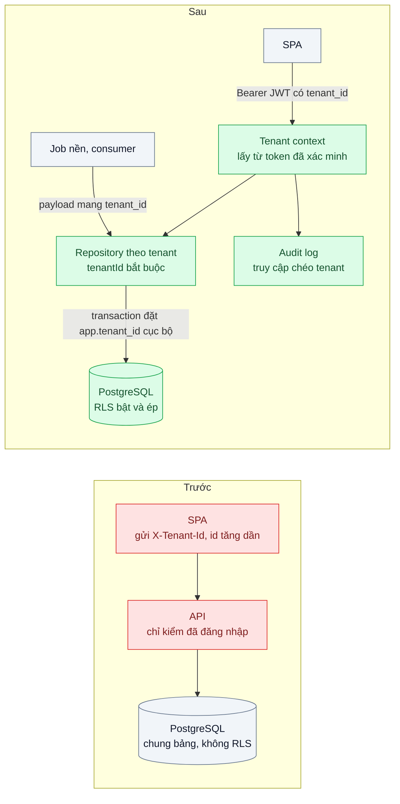
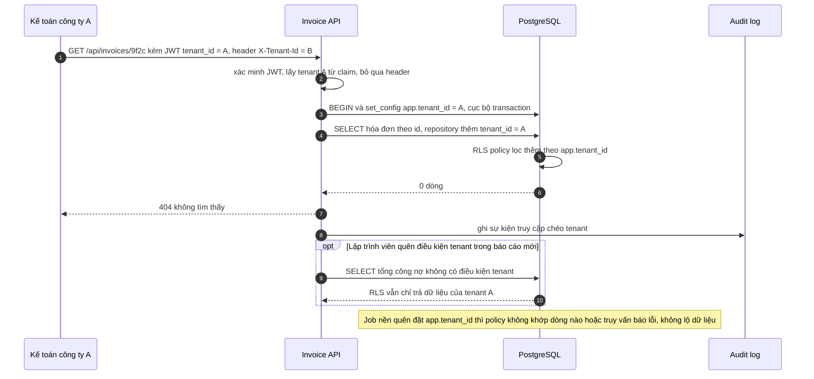

# Multi-tenant Authorization — Người của công ty A gọi API với id của công ty B và lấy được dữ liệu

| Scope | Mức độ | Trạng thái | Pattern gốc | Cập nhật |
|---|---|---|---|---|
| 19 · backend / frontend / authenticate | 🔴 Nâng cao | 📋 Kế hoạch | Tenant context từ token + Object-Level Authorization — OWASP API Security Top 10 (2023) API1 BOLA; PostgreSQL Row Security Policies | 2026-10-06 |

> **Một câu tóm tắt:** Chỉ lấy tenant từ token đã xác minh, buộc mọi truy vấn theo id đi qua repository có điều kiện tenant, và đặt Row-Level Security ở PostgreSQL làm lưới an toàn cuối — để đổi một con số trên URL không còn mở được dữ liệu của công ty khác.

## 1. Bài toán thực tế (What)

**Bối cảnh** *(doanh nghiệp giả định, số liệu minh họa)*
SaaS B2B quản lý hóa đơn và công nợ cho khoảng 300 công ty. API NestJS, một PostgreSQL dùng chung bảng, mỗi bảng có cột `tenant_id`. Người dùng đăng nhập qua Keycloak; SPA gửi tenant đang chọn trong header `X-Tenant-Id`, còn endpoint chi tiết dạng `GET /api/invoices/:id` với id tăng dần.

**Triệu chứng người kinh doanh nhìn thấy**
- Kế toán của một khách hàng sửa id trên thanh địa chỉ và xem được hóa đơn của công ty khác, rồi báo cho cả hai bên.
- Pentest sau đó tìm thêm 14 endpoint cùng lỗi, gồm cả chức năng xuất Excel và báo cáo công nợ.
- Một khách lớn yêu cầu báo cáo sự cố và cam kết bằng văn bản, đe dọa chấm dứt hợp đồng.

**Nguyên nhân kỹ thuật**
API chỉ kiểm "đã đăng nhập", không kiểm "đối tượng này thuộc tenant của bạn". Tenant lại đến từ input do client gửi (header, URL), nên client nói mình thuộc tenant nào cũng được tin. Mỗi truy vấn phải tự nhớ thêm `WHERE tenant_id = ?`; chỉ cần quên ở một báo cáo, một job nền hay một endpoint mới là lộ. OWASP xếp lỗi này — *Broken Object Level Authorization* — đứng đầu danh sách rủi ro API 2023.

**Ràng buộc**
- Giữ mô hình chung bảng (chuyển sang DB riêng cho 300 công ty là dự án khác — scope 02 bài 07).
- Một người có thể thuộc nhiều công ty (kế toán dịch vụ làm cho nhiều khách).
- Không làm chậm truy vấn danh sách quá khoảng 10%.

## 2. Vì sao dùng pattern này (Why)

**Nguyên nhân gốc mà pattern nhắm vào:** quyết định "dữ liệu này của ai" dựa vào input client gửi lên, và việc lọc theo tenant phụ thuộc trí nhớ của từng lập trình viên.

**Pattern giải quyết thế nào:** ba lớp, mỗi lớp bắt lỗi lớp trước bỏ sót. *Một*, tenant context chỉ đến từ token đã xác minh chữ ký (claim `tenant_id`) hoặc từ bảng thành viên tra phía server; URL, body, header không bao giờ quyết định tenant. Người thuộc nhiều công ty chọn công ty khi đăng nhập và nhận token cho đúng công ty đó. *Hai*, kiểm quyền ở mức đối tượng: repository nhận `tenantId` bắt buộc và tự thêm điều kiện, không có hàm "tìm theo id" trần. *Ba*, PostgreSQL Row Security Policies: bảng bật và ép RLS, policy so `tenant_id` với giá trị phiên `app.tenant_id` được đặt cục bộ trong từng transaction. Nếu code quên điều kiện, DB vẫn chỉ trả dòng của tenant hiện tại; nếu job quên đặt tenant, DB không trả dòng nào hoặc báo lỗi ép kiểu — cả hai đều là từ chối. Hướng dẫn kiến trúc multitenant của Azure mô tả các cách xác định tenant và đánh đổi giữa chúng, làm cơ sở chọn "tenant trong token".

**Lựa chọn khác đã cân nhắc**

| Lựa chọn | Giải quyết được gì | Vì sao không chọn (ở bài này) |
|---|---|---|
| Giữ nguyên + tối ưu nhỏ (rà 14 endpoint, thêm `WHERE tenant_id`) | Vá các lỗ đã biết | Endpoint thứ 15 viết tuần sau lại quên; không có lưới an toàn |
| Đổi id sang UUID ngẫu nhiên | Khó đoán id | Che giấu chứ không phải phân quyền; id vẫn lộ qua link chia sẻ, email, log |
| DB hoặc schema riêng cho từng tenant | Cách ly mạnh nhất | 300 DB/schema: migration, pool kết nối, chi phí — trái ràng buộc; xem scope 02 bài 07 |
| Tenant từ token + repository theo tenant + RLS (chọn) | Không tin input; khó quên; DB chặn khi code quên | RLS đòi kỷ luật về role kết nối và cách đặt biến phiên; thêm chút chi phí truy vấn |

## 3. Thiết kế hệ thống (How)

### 3.1 Kiến trúc trước và sau



### 3.2 Luồng chính



### 3.3 Thành phần và trách nhiệm

| Thành phần | Trách nhiệm | Quyết định thiết kế đáng chú ý |
|---|---|---|
| Tenant context | Lấy `tenant_id` từ JWT đã xác minh | Header `X-Tenant-Id` chỉ dùng để *chọn* công ty khi đăng nhập, sau đó đối chiếu bảng thành viên |
| Bảng thành viên | Người dùng thuộc những tenant nào, vai trò gì | Đổi công ty = xin token mới, không đổi header |
| Repository theo tenant | Mọi hàm đọc/ghi nhận `tenantId` bắt buộc | Không tồn tại hàm `findById(id)` trần; lint chặn truy vấn thô ngoài repository |
| RLS policy | `USING` và `WITH CHECK` so `tenant_id` với `current_setting('app.tenant_id', true)` | `FORCE ROW LEVEL SECURITY`; ứng dụng kết nối bằng role không sở hữu bảng, không có `BYPASSRLS` |
| Đặt biến phiên | `set_config('app.tenant_id', $1, true)` đầu mỗi transaction | Cục bộ transaction nên an toàn với pool và PgBouncer ở chế độ transaction |
| Truy cập hỗ trợ | Nhân viên hỗ trợ xem dữ liệu khách khi được phép | Luồng "mạo danh" riêng, có lý do, có hạn, ghi audit |

### 3.4 Điểm dễ sai khi triển khai
- **Ứng dụng kết nối bằng role sở hữu bảng**: owner bỏ qua RLS nếu không `FORCE`; superuser và role `BYPASSRLS` luôn bỏ qua.
- **Dùng `SET` mức phiên thay vì cục bộ transaction** khi có connection pool: tenant của request trước rò sang request sau trên cùng kết nối.
- **Job nền, consumer queue, cron không mang tenant**: hoặc lỗi im lặng, hoặc ai đó cấp role `BYPASSRLS` "cho chạy được".
- **Cache key thiếu tenant**: hai công ty cùng hit một key (scope 03 bài 01).
- **Ràng buộc unique toàn cục** như `UNIQUE(email)`: báo lỗi "email đã tồn tại" lộ thông tin giữa các công ty — dùng `UNIQUE(tenant_id, email)`.
- **Chỉ mục tìm kiếm ngoài PostgreSQL** (Elasticsearch, vector DB) không có RLS: phải lọc tenant ở truy vấn tìm kiếm.

## 4. Tech stack và tác động (Impact techstack)

| Lớp | Công nghệ chọn | Vì sao chọn | Thay thế tương đương |
|---|---|---|---|
| IdP | Keycloak, mapper đưa `tenant_id` vào token | IdP local của repo; claim tenant ký cùng token | Bất kỳ IdP OIDC nào có custom claim |
| API | NestJS + `jose` | Xác minh JWT, interceptor dựng tenant context | Fastify |
| Truy cập dữ liệu | Kysely với repository nhận `tenantId` | Trùng stack của người sở hữu repo; query builder có type giúp chặn truy vấn thiếu tenant | `pg` thuần, Prisma |
| DB | PostgreSQL 16 Row Security Policies | Lưới an toàn ở tầng dữ liệu, không phụ thuộc code | Cách ly bằng schema hoặc DB riêng |
| Pool | PgBouncer chế độ transaction | Tương thích biến phiên đặt cục bộ transaction | Pool trong ứng dụng |
| Kiểm thử | Vitest, OWASP ZAP | Ma trận BOLA sinh từ danh sách route; quét API | — |
| Đo | k6, `EXPLAIN ANALYZE` | Chi phí thêm của RLS | — |

**Thay đổi so với hệ thống hiện tại:** thêm claim tenant vào token, interceptor tenant context, repository bắt buộc tenant, policy RLS cho mọi bảng có `tenant_id`, tách role `migrator` (sở hữu bảng) và `app_user` (ứng dụng). Đội phát triển học quy tắc "không truy vấn ngoài repository"; CI kiểm mọi bảng mới đều có RLS.

## 5. Kết quả đầu ra và cách đo (Output impact)

| Chỉ số | Trước (minh họa) | Mục tiêu khi thực hành | Cách đo |
|---|---|---|---|
| Endpoint có lỗi BOLA | 14 | 0 | Test tự động sinh từ danh sách route: token tenant A gọi id thuộc tenant B, kỳ vọng 404; OWASP ZAP |
| Bảng có `tenant_id` đã bật và ép RLS | 0 / 38 | 38 / 38 | Truy vấn `pg_class.relrowsecurity` và `relforcerowsecurity` chạy trong CI |
| Truy vấn quên điều kiện tenant | Lộ dữ liệu mọi tenant | Chỉ trả dữ liệu tenant hiện tại | Test cố ý viết truy vấn không có điều kiện tenant |
| Job nền không đặt tenant | Đọc được mọi tenant | 0 dòng hoặc lỗi, không lộ dữ liệu | Test chạy job không đặt `app.tenant_id`, trên kết nối mới và kết nối đã dùng lại từ pool |
| Rò tenant giữa request qua pool | Chưa kiểm | 0 trên 10.000 request xen kẽ hai tenant | Test tải xen kẽ, kiểm mọi dòng trả về đúng tenant |
| Chi phí thêm của RLS trên truy vấn danh sách, p95 | — | ≤ 10% | `EXPLAIN ANALYZE` + k6 so sánh bật và tắt RLS |

> Số "trước" là minh họa để hình dung bài toán. Số "mục tiêu" chỉ được coi là đạt khi có số đo thật
> ở mục 8 kèm môi trường đo.

**Tác động nghiệp vụ mong đợi:** công ty có câu trả lời kỹ thuật kiểm chứng được cho cam kết "dữ liệu của bạn không ai khác xem được"; lỗi của một lập trình viên không còn thành sự cố dữ liệu.

## 6. Đánh đổi và khi KHÔNG nên dùng

**Đánh đổi**
- RLS làm truy vấn khó đoán hơn khi debug ("sao không ra dòng nào?"); cần công cụ và log rõ tenant hiện tại.
- Báo cáo xuyên tenant cho nội bộ phải đi qua role riêng, có audit — thêm một đường cần bảo vệ.
- Claim tenant trong token nghĩa là đổi thành viên phải chờ token mới; cần hạn token ngắn.

**Không nên dùng khi**
- Mỗi tenant đã có DB riêng: cách ly nằm ở tầng kết nối, RLS thừa (nhưng tenant vẫn phải từ token).
- Ứng dụng một tổ chức, không có khái niệm tenant: bài 06 là bài phù hợp.
- Dữ liệu không nằm ở PostgreSQL: lớp RLS không có, cần cơ chế tương đương của kho dữ liệu đó.

**Liên quan**
- [Scope 02 bài 07 — Multi-tenant Data Isolation](../../02-backend-database/07-multi-tenant-saas-300-cong-ty-chung-mot-db/) — chọn mô hình chung bảng, schema hay DB riêng.
- [Bài 06 — RBAC → ABAC → ReBAC](../06-rbac-abac-rebac-phan-quyen-theo-chi-nhanh-phong-ban/) — phân quyền bên trong một tenant.
- [Scope 02 bài 03 — Connection Pooling](../../02-backend-database/03-connection-pool-200-pod-dap-postgres/) — PgBouncer và biến phiên.
- [Scope 03 bài 01 — Cache-Aside](../../03-backend-cache/01-cache-aside-trang-san-pham-doc-10k-lan-phut/) — cache key phải có tenant.

## 7. Cơ sở tham khảo

- OWASP, *API Security Top 10* (2023), "API1:2023 Broken Object Level Authorization" — https://owasp.org/API-Security/ — mô tả lỗi, kịch bản tấn công đổi id, khuyến nghị kiểm quyền ở mức đối tượng dựa trên người dùng từ phiên.
- PostgreSQL docs, "Row Security Policies" — https://www.postgresql.org/docs/16/ddl-rowsecurity.html — `ENABLE`/`FORCE ROW LEVEL SECURITY`, `USING` và `WITH CHECK`, hành vi của owner, superuser và `BYPASSRLS`.
- PostgreSQL docs, "System Administration Functions" (`set_config`, `current_setting`) — https://www.postgresql.org/docs/16/functions-admin.html — đặt biến cục bộ transaction dùng cho tenant context.
- Microsoft, *Architect multitenant solutions on Azure* (phần identity) — https://learn.microsoft.com/azure/architecture/guide/multitenant/overview — cách xác định tenant của request và đánh đổi giữa các cách.

## 8. Kế hoạch thực hành

- [ ] Bước 1: dựng Keycloak + PostgreSQL + Invoice API; seed 3 tenant, 2.000 hóa đơn; phiên bản `truoc/` lấy tenant từ header và có endpoint chi tiết, danh sách, xuất file thiếu điều kiện tenant.
- [ ] Bước 2: đo "trước": chạy ma trận BOLA, đếm endpoint lộ; đo p95 danh sách bằng k6.
- [ ] Bước 3: áp dụng pattern: claim tenant trong token, interceptor tenant context, repository bắt buộc tenant, RLS bật và ép, tách role `migrator` và `app_user`.
- [ ] Bước 4: đo "sau" cùng kịch bản, chạy `EXPLAIN ANALYZE` bật/tắt RLS; ghi số và môi trường vào mục 5.
- [ ] Bước 5: test: ma trận BOLA 0 lỗ; truy vấn quên điều kiện vẫn đúng tenant; job không đặt tenant bị từ chối; 10.000 request xen kẽ qua pool không rò; CI báo đỏ khi thêm bảng có `tenant_id` mà thiếu RLS.

**Cấu trúc code dự kiến**
```text
db/migrations/
  001-enable-rls.sql             # [PATTERN] policy, FORCE, role app_user
src/
  truoc/invoices-by-header.ts    # tái hiện tenant lấy từ header
  sau/tenant-context.interceptor.ts   # [PATTERN] tenant chỉ từ token
  sau/tenant-transaction.ts      # set_config cục bộ transaction
  sau/invoice.repository.ts      # tenantId bắt buộc
test/
  bola-matrix.test.ts            # sinh từ danh sách route
  rls-safety-net.test.ts
  pool-no-tenant-leak.test.ts
  ci-rls-coverage.test.ts
bench/invoice-list-rls.k6.js
docker-compose.yml
```

**Cách chạy** *(điền khi bắt đầu code)*
```bash
docker compose up -d
pnpm install && pnpm test
```
