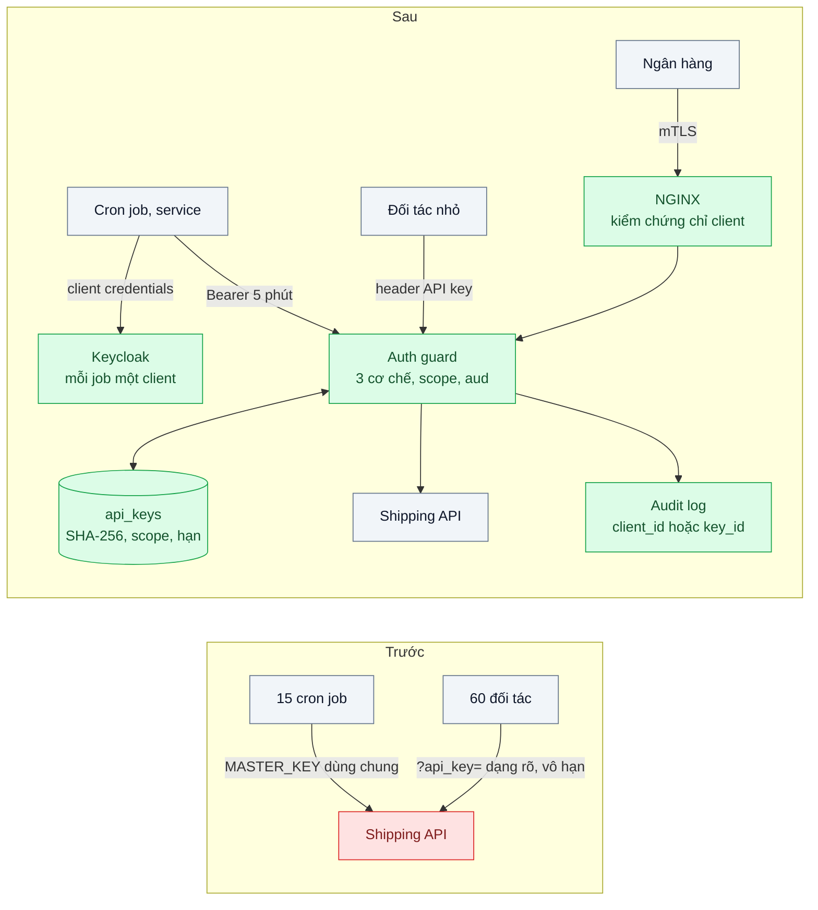
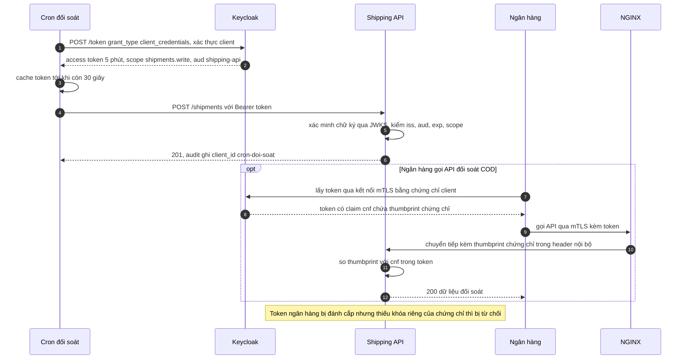

# Machine-to-Machine Auth (API keys, client credentials, mTLS) — Cron job và đối tác gọi API: dùng API key hay OAuth client credentials?

| Scope | Mức độ | Trạng thái | Pattern gốc | Cập nhật |
|---|---|---|---|---|
| 19 · backend / frontend / authenticate | 🟡 Trung bình | 📋 Kế hoạch | OAuth 2.0 Client Credentials — RFC 6749 §4.4 (2012); OAuth 2.0 Mutual-TLS — RFC 8705 (2020) | 2026-10-06 |

> **Một câu tóm tắt:** Phân loại bên gọi máy-máy và cho mỗi loại một cơ chế vừa đủ — client credentials với token 5 phút cho service nội bộ, API key có hash, scope và xoay vòng cho đối tác nhỏ, mTLS với token gắn chứng chỉ cho đối tác ngân hàng — để mọi lời gọi định danh được và một khóa lộ không còn mở toàn bộ API.

## 1. Bài toán thực tế (What)

**Bối cảnh** *(doanh nghiệp giả định, số liệu minh họa)*
Công ty logistics cung cấp API tạo và tra cứu vận đơn cho khoảng 60 đối tác (shop, sàn nhỏ, 2 ngân hàng thu hộ COD) và cho 15 cron job/service nội bộ. Mọi job nội bộ dùng chung một `MASTER_KEY` trong biến môi trường; mỗi đối tác có một API key lưu dạng rõ trong DB, không hạn, không phân quyền, gửi qua query string `?api_key=`.

**Triệu chứng người kinh doanh nhìn thấy**
- Một đối tác đẩy code lên GitHub công khai kèm key; qua một đêm có khoảng 3.000 vận đơn giả được tạo, tài xế chạy tới địa chỉ không tồn tại.
- Một job xóa nhầm dữ liệu lúc 3 giờ sáng; không biết job nào vì cả 15 job dùng cùng `MASTER_KEY`.
- Không ai dám đổi `MASTER_KEY` vì phải deploy lại 15 job cùng lúc.
- Ngân hàng đối tác yêu cầu API đối soát COD phải xác thực bằng mTLS mới ký hợp đồng.

**Nguyên nhân kỹ thuật**
Bên gọi không được định danh riêng: một bí mật dùng chung cho nhiều bên, có toàn quyền, sống vô hạn. Key nằm trong query string nên còn rơi vào access log của proxy và công cụ giám sát. Không có đường xoay vòng không gián đoạn, nên key không bao giờ được đổi. Bearer credential bị sao chép là dùng được từ bất kỳ đâu.

**Ràng buộc**
- Đối tác nhỏ dùng plugin bán hàng đơn giản, không làm được luồng lấy token; vẫn phải hỗ trợ API key.
- Đổi cơ chế không được làm gián đoạn đối tác đang chạy; có thời gian chuyển đổi.
- Mỗi lời gọi phải truy được tới đúng bên gọi trong audit log.

## 2. Vì sao dùng pattern này (Why)

**Nguyên nhân gốc mà pattern nhắm vào:** bí mật dùng chung, sống vô hạn, toàn quyền — thay vì danh tính riêng, ngắn hạn, giới hạn phạm vi cho từng bên gọi.

**Pattern giải quyết thế nào:** *Client credentials grant* (RFC 6749 §4.4) cho bên gọi không có người dùng: mỗi job là một client riêng, xác thực với token endpoint và nhận access token ngắn hạn có `scope` và `aud`; API xác minh token offline qua JWKS. Lộ token chỉ dùng được vài phút; xoay secret là việc của một job. Với đối tác nhỏ, *API key làm đúng*: key dạng `tiền-tố_chuỗi-ngẫu-nhiên` (tiền tố giúp tra cứu và quét lộ secret), chỉ lưu SHA-256, có scope, có hạn, cho phép 2 key cùng hiệu lực trong lúc xoay, ghi lần dùng cuối, rate limit theo key. Với ngân hàng, *mTLS* (RFC 8705): client xác thực bằng chứng chỉ khi lấy token, token mang claim `cnf` chứa thumbprint chứng chỉ (`x5t#S256`), và API kiểm chứng chỉ trình lên khớp thumbprint — token bị đánh cắp mà không có khóa riêng thì vô dụng. OWASP API Security Top 10 (2023) xếp xác thực hỏng ở vị trí API2, với các dấu hiệu đúng như hiện trạng: key trong URL, không hạn, không xoay.

**Lựa chọn khác đã cân nhắc**

| Lựa chọn | Giải quyết được gì | Vì sao không chọn (ở bài này) |
|---|---|---|
| Giữ nguyên + tối ưu nhỏ (đổi `MASTER_KEY` định kỳ, mã hóa key trong DB) | Giảm thời gian key lộ còn dùng được | Vẫn một key cho 15 job, không biết ai gọi; đổi key vẫn phải deploy đồng loạt |
| API key làm đúng cho tất cả | Đơn giản cho mọi bên | Hợp cho đối tác nhỏ; với service nội bộ, key lộ dùng được tới khi bị phát hiện, token 5 phút tốt hơn |
| Client credentials cho tất cả | Token ngắn hạn, chuẩn | Đối tác nhỏ không tích hợp được luồng token, tăng ma sát kinh doanh |
| mTLS cho tất cả | Mạnh nhất | Cấp và gia hạn chứng chỉ cho 60 đối tác là gánh nặng vận hành lớn |
| Phân loại theo bên gọi (chọn) | Mỗi loại một cơ chế vừa đủ; mọi lời gọi định danh được | Ba cơ chế song song phải vận hành và viết tài liệu |

## 3. Thiết kế hệ thống (How)

### 3.1 Kiến trúc trước và sau



### 3.2 Luồng chính



### 3.3 Thành phần và trách nhiệm

| Thành phần | Trách nhiệm | Quyết định thiết kế đáng chú ý |
|---|---|---|
| Client trên Keycloak | Mỗi job, mỗi đối tác đủ năng lực một client riêng | Secret lấy từ secret manager, không nằm trong image (scope 17 bài 08) |
| Token cache trong job | Dùng lại token tới gần hết hạn | Không xin token mới cho mỗi request |
| Auth guard | Nhận một trong ba cơ chế, chuẩn hóa thành `caller` có id và scope | Kiểm `aud` và `scope` cho mọi route |
| Dịch vụ API key | Cấp, xoay, thu hồi, ghi lần dùng cuối | Key chỉ hiện một lần khi cấp; lưu SHA-256 — đủ vì key ngẫu nhiên entropy cao (bài 01); tối đa 2 key hiệu lực mỗi đối tác |
| NGINX mTLS | Kiểm chứng chỉ client theo CA tin cậy, chuyển thumbprint vào header | Luôn xóa header đó nếu client tự gửi lên |
| Rate limit theo key | Giới hạn thiệt hại khi một key lộ | Bộ đếm trong Redis 7, dùng chung cơ chế của scope 13 bài 03 |

### 3.4 Điểm dễ sai khi triển khai
- **Key trong query string**: rơi vào access log, lịch sử, công cụ giám sát. Chỉ nhận key qua header.
- **Một client_id cho nhiều job** "cho tiện" — quay lại đúng vấn đề `MASTER_KEY`.
- **Không có scope**: key chỉ cần đọc vận đơn cũng tạo và hủy được vận đơn.
- **API tin header chứng chỉ do client gửi** vì proxy không xóa header đầu vào: ai cũng giả được mTLS.
- **Không cho 2 key cùng hiệu lực**: đối tác không thể xoay key mà không gián đoạn, nên không bao giờ xoay.

## 4. Tech stack và tác động (Impact techstack)

| Lớp | Công nghệ chọn | Vì sao chọn | Thay thế tương đương |
|---|---|---|---|
| Authorization Server | Keycloak (client có service account) | IdP local của repo; client credentials, scope, JWKS; hỗ trợ xác thực client bằng chứng chỉ (cấu hình cần xác minh) | Ory Hydra; dịch vụ quản lý |
| API | NestJS guard + `jose` | Xác minh JWT offline, gộp ba cơ chế vào một guard | Fastify |
| Lưu API key | PostgreSQL 16 | Bảng `api_keys` với hash, scope, `expires_at`, `last_used_at` | — |
| mTLS | NGINX (`ssl_verify_client`) + CA thử nghiệm tạo bằng OpenSSL | Kết thúc TLS và kiểm chứng chỉ ở biên | Envoy; service mesh cho nội bộ (scope 13 bài 07) |
| Quét lộ secret | gitleaks trong CI (cấu hình cần xác minh) | Bắt key có tiền tố trước khi đẩy lên | GitHub secret scanning |
| Kiểm thử, đo | Vitest, k6 | Test từng cơ chế; đo xoay key không gián đoạn | — |

**Thay đổi so với hệ thống hiện tại:** bỏ `MASTER_KEY`; 15 job thành 15 client; key đối tác chuyển sang header, hash, scope, hạn; thêm NGINX mTLS cho ngân hàng. Đội vận hành học quy trình cấp/xoay/thu hồi cho từng cơ chế và đọc audit log theo bên gọi.

## 5. Kết quả đầu ra và cách đo (Output impact)

| Chỉ số | Trước (minh họa) | Mục tiêu khi thực hành | Cách đo |
|---|---|---|---|
| Request định danh được bên gọi trong audit log | ~0% với job nội bộ | 100% | Truy vấn audit log: tỷ lệ request có `client_id` hoặc `key_id` |
| Thời gian sống của credential gọi API | Vô hạn | Token nội bộ 5 phút; key đối tác có hạn ≤ 1 năm | Đọc claim `exp`; truy vấn `api_keys.expires_at` |
| Xoay key đối tác | Không làm được | ≤ 1 ngày, 0 request lỗi | k6 gọi liên tục trong khi cấp key mới, chuyển sang key mới, thu hồi key cũ |
| Phạm vi thiệt hại khi một key lộ | Toàn bộ API | Chỉ scope của một đối tác, có rate limit | Test: key chỉ có scope đọc gọi API tạo vận đơn, kỳ vọng 403 |
| Token ngân hàng bị đánh cắp dùng với chứng chỉ khác | Không áp dụng | Bị từ chối | Test tích hợp gửi token kèm chứng chỉ khác, kỳ vọng 401 |
| Key xuất hiện trong log | Có | 0 | Grep log sau bộ test; gitleaks |

> Số "trước" là minh họa để hình dung bài toán. Số "mục tiêu" chỉ được coi là đạt khi có số đo thật
> ở mục 8 kèm môi trường đo.

**Tác động nghiệp vụ mong đợi:** một đối tác làm lộ key chỉ ảnh hưởng chính họ trong phạm vi đã cấp; mọi sự cố truy được tới đúng bên gọi; ký được hợp đồng với ngân hàng yêu cầu mTLS.

## 6. Đánh đổi và khi KHÔNG nên dùng

**Đánh đổi**
- Ba cơ chế song song: thêm tài liệu, thêm test, thêm quy trình hỗ trợ đối tác.
- Keycloak nằm trên đường đi của mọi job nội bộ (khi xin token); cần cache token và chạy nhiều bản.
- mTLS kéo theo vòng đời chứng chỉ: cấp, gia hạn, thu hồi, theo dõi ngày hết hạn.

**Không nên dùng khi**
- Bên gọi là người dùng qua trình duyệt hoặc app: dùng bài 02, 03, 05.
- Mọi service nội bộ đã chạy trong service mesh có mTLS và danh tính workload: tận dụng mesh (scope 13 bài 07) thay vì tự làm lớp mTLS riêng.
- Chỉ có một đối tác và một job: API key làm đúng là đủ, chưa cần Keycloak.

**Liên quan**
- [Bài 07 — SSO with OpenID Connect](../07-sso-oidc-mot-lan-dang-nhap-cho-5-ung-dung-noi-bo/) — cùng IdP, phía người dùng.
- [Scope 13 bài 03 — Rate Limiting & Throttling](../../13-backend-transporter/03-rate-limiting-mot-khach-api-goi-10k-req-s/) — giới hạn theo key.
- [Scope 13 bài 07 — Service Mesh](../../13-backend-transporter/07-service-mesh-mtls-retry-tracing-khong-sua-code/) — mTLS cho service nội bộ ở quy mô lớn.
- [Scope 17 bài 08 — Runtime Config & Secrets](../../17-backend-docker/08-env-config-secrets-khong-nuong-vao-image/) — nơi đặt client secret.

## 7. Cơ sở tham khảo

- Hardt (ed.), RFC 6749, *The OAuth 2.0 Authorization Framework*, 2012, §4.4 "Client Credentials Grant" — https://www.rfc-editor.org/rfc/rfc6749 — luồng cấp token cho client không có người dùng.
- Campbell, Bradley, Sakimura, Lodderstedt, RFC 8705, *OAuth 2.0 Mutual-TLS Client Authentication and Certificate-Bound Access Tokens*, 2020 — https://www.rfc-editor.org/rfc/rfc8705 — xác thực client bằng chứng chỉ và claim `cnf` với `x5t#S256`.
- OWASP, *API Security Top 10* (2023), "API2:2023 Broken Authentication" — https://owasp.org/API-Security/ — dấu hiệu xác thực máy-máy yếu và khuyến nghị.
- Keycloak documentation, Server Administration Guide (service accounts, client authentication) — https://www.keycloak.org/documentation — cấu hình client credentials dùng ở mục 4.
- NGINX docs, `ngx_http_ssl_module` — https://nginx.org/en/docs/http/ngx_http_ssl_module.html — `ssl_verify_client`, `ssl_client_certificate` và biến chứng chỉ client.

## 8. Kế hoạch thực hành

- [ ] Bước 1: dựng Keycloak, PostgreSQL, Redis, NGINX, Shipping API; phiên bản `truoc/` nhận `MASTER_KEY` và `?api_key=` dạng rõ; tạo CA thử nghiệm và chứng chỉ cho "ngân hàng".
- [ ] Bước 2: đo "trước": cho thấy audit log không phân biệt được job; key xuất hiện trong access log; không xoay được key mà không lỗi.
- [ ] Bước 3: áp dụng pattern: client cho từng job, token cache, dịch vụ API key (hash, scope, 2 key), NGINX mTLS và kiểm `cnf`, guard gộp ba cơ chế.
- [ ] Bước 4: đo "sau" cùng kịch bản, gồm kịch bản xoay key dưới tải k6; ghi số và môi trường vào mục 5.
- [ ] Bước 5: test: token sai `aud` hoặc thiếu scope bị từ chối; key hết hạn bị từ chối; 2 key cùng hiệu lực trong lúc xoay; header chứng chỉ do client tự gửi bị bỏ qua; token gắn chứng chỉ dùng với chứng chỉ khác bị 401.

**Cấu trúc code dự kiến**
```text
nginx/mtls.conf                    # ssl_verify_client, xóa header đầu vào
certs/make-test-ca.sh              # CA và chứng chỉ thử nghiệm
src/
  truoc/master-key.guard.ts
  sau/machine-auth.guard.ts        # [PATTERN] gộp client credentials, API key, mTLS
  sau/api-key.service.ts           # cấp, xoay, thu hồi, SHA-256
  sau/cert-bound-token.ts          # so thumbprint với cnf
  jobs/token-cache.ts              # client credentials + cache
test/
  scope-and-audience.test.ts
  api-key-rotation.test.ts
  mtls-cert-binding.test.ts
bench/key-rotation-under-load.k6.js
docker-compose.yml
```

**Cách chạy** *(điền khi bắt đầu code)*
```bash
docker compose up -d
pnpm install && pnpm test
```
