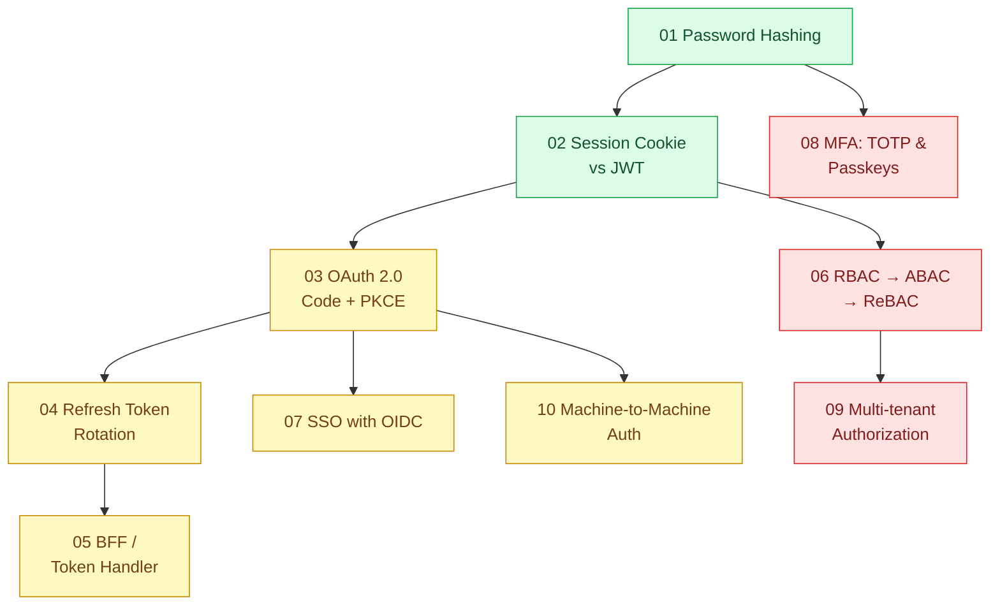

# 19 · Xác thực và phân quyền (`backend / frontend / authenticate`)

> **Phạm vi:** Ai là ai (authentication) và họ được làm gì (authorization) trong ứng dụng web nhiều
> client: lưu mật khẩu, session vs token, OAuth2/OIDC, xoay refresh token, BFF cho SPA, mô hình
> phân quyền, SSO, MFA/passkey, cách ly tenant, máy gọi máy.
>
> **Câu hỏi trung tâm:** Ai là ai, họ được làm gì, token nằm ở đâu, và chuyện gì xảy ra khi token
> bị đánh cắp?

## Bản đồ pattern trong scope

## Danh sách bài toán

| # | Bài toán (pattern — triệu chứng) | Mức | Pattern gốc / nguồn | Trạng thái |
|---|---|---|---|---|
| 01 | [Password Hashing (Argon2id / bcrypt) — Lộ DB là lộ toàn bộ mật khẩu vì lưu MD5](./01-password-hashing-argon2-lo-db-la-lo-mat-khau/) | 🟢 | OWASP "Password Storage Cheat Sheet"; RFC 9106 (Argon2) | 📋 |
| 02 | [Session Cookie vs JWT — SPA + API: lưu token ở localStorage (XSS) hay cookie (CSRF)?](./02-session-cookie-vs-jwt-spa-luu-token-o-dau/) | 🟢 | OWASP "Session Management", "CSRF Prevention" cheat sheets; RFC 7519 (JWT); RFC 8725 (JWT BCP) | 📋 |
| 03 | [OAuth 2.0 Authorization Code + PKCE — Đăng nhập bằng Google/Zalo cho SPA và app mobile không có nơi giữ secret](./03-oauth2-pkce-dang-nhap-google-cho-spa-va-mobile/) | 🟡 | RFC 6749; RFC 7636 (PKCE); RFC 9700 (OAuth 2.0 Security BCP, 2025); IETF draft "OAuth 2.0 for Browser-Based Apps" | 📋 |
| 04 | [Refresh Token Rotation & Reuse Detection — Refresh token bị đánh cắp dùng được mãi](./04-refresh-token-rotation-token-bi-danh-cap-dung-mai/) | 🟡 | RFC 9700 (refresh token rotation / sender-constraining); OAuth 2.0 for Browser-Based Apps; Auth0 docs "Refresh Token Rotation" | 📋 |
| 05 | [BFF / Token Handler for SPA — Token không bao giờ chạm JavaScript trên trình duyệt](./05-bff-token-handler-token-khong-bao-gio-cham-trinh-duyet/) | 🟡 | IETF draft "OAuth 2.0 for Browser-Based Apps" (BFF); Curity, "The Token Handler Pattern"; Sam Newman BFF (scope 01) | 📋 |
| 06 | [RBAC → ABAC → ReBAC — Phân quyền "quản lý chi nhánh chỉ xem hợp đồng chi nhánh mình" vượt khả năng của role](./06-rbac-abac-rebac-phan-quyen-theo-chi-nhanh-phong-ban/) | 🔴 | NIST RBAC (Ferraiolo & Kuhn, 1992; INCITS 359); NIST SP 800-162 (ABAC); Pang et al., "Zanzibar" (USENIX ATC 2019); SpiceDB / OpenFGA docs | 📋 |
| 07 | [SSO with OpenID Connect — 5 ứng dụng nội bộ, 5 lần đăng nhập, 5 nơi quản lý user](./07-sso-oidc-mot-lan-dang-nhap-cho-5-ung-dung-noi-bo/) | 🟡 | OpenID Connect Core 1.0; Keycloak docs | 📋 |
| 08 | [MFA: TOTP & Passkeys (WebAuthn) — Tài khoản kế toán bị chiếm vì mật khẩu lộ từ web khác](./08-mfa-totp-webauthn-passkey-tai-khoan-ke-toan-bi-chiem/) | 🔴 | RFC 6238 (TOTP); W3C Web Authentication Level 3; FIDO Alliance passkeys | 📋 |
| 09 | [Multi-tenant Authorization — Người của công ty A gọi API với id của công ty B và lấy được dữ liệu](./09-multi-tenant-auth-tenant-trong-token-va-cach-ly/) | 🔴 | OWASP API Security Top 10 (2023) — API1 Broken Object Level Authorization; PostgreSQL "Row Security Policies"; Azure multitenant identity guidance | 📋 |
| 10 | [Machine-to-Machine Auth (API keys, client credentials, mTLS) — Cron job và đối tác gọi API: dùng API key hay OAuth client credentials?](./10-api-key-service-to-service-client-credentials-mtls/) | 🟡 | RFC 6749 §4.4 (client credentials); RFC 8705 (OAuth 2.0 Mutual-TLS); OWASP API Security Top 10 | 📋 |

## Lộ trình đề xuất trong scope

1. **Password hashing → Session vs JWT** — hai quyết định nền của mọi ứng dụng có đăng nhập.
2. **OAuth2 + PKCE → Refresh rotation → BFF token handler** — chuỗi liền mạch cho SPA/mobile hiện đại.
3. **SSO, Machine-to-machine** — mở rộng cho nội bộ và đối tác.
4. **RBAC/ABAC/ReBAC → Multi-tenant authorization** — phân quyền; bài 09 là lỗi API phổ biến nhất.
5. **MFA/Passkeys** — nâng cao về xác thực.

## Kiến thức nền cần có trước

- HTTP cookie attribute (`HttpOnly`, `Secure`, `SameSite`), CORS.
- Mã hóa đối xứng/bất đối xứng, chữ ký số ở mức khái niệm.
- Scope 01 bài 04 (BFF) trước bài 05 ở đây.

## Liên kết với scope khác

- `01-frontend-backend-transporter` — BFF, API gateway thực thi xác thực.
- `02-backend-database` bài 07 — cách ly dữ liệu tenant bằng RLS.
- `11-backend-ai-agent` — agent gọi tool với quyền của người dùng (bài 06, 09).
- `13-backend-transporter` bài 07 — mTLS trong service mesh.

## Nguồn tổng quan cho scope

- OWASP Cheat Sheet Series — https://cheatsheetseries.owasp.org/
- RFC 9700, *Best Current Practice for OAuth 2.0 Security* (2025).
- Pang et al., "Zanzibar" (2019) — https://research.google/pubs/zanzibar-googles-consistent-global-authorization-system/
