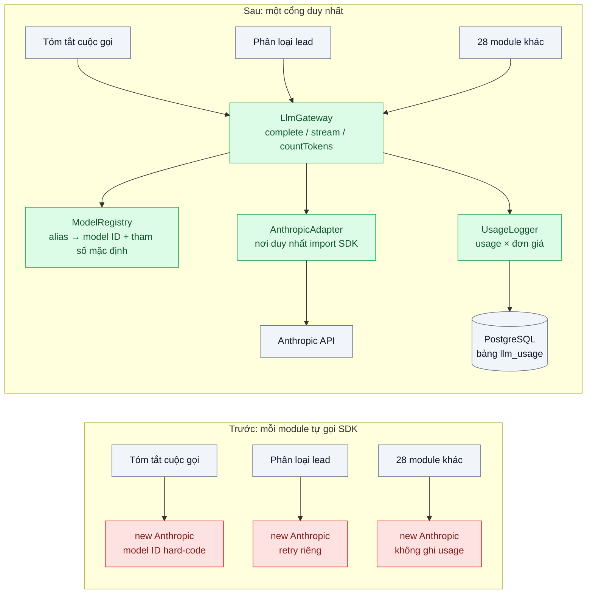
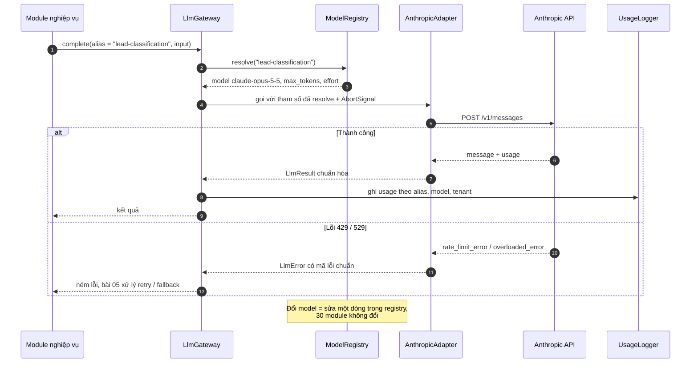

# Model Gateway / Provider Abstraction — Đổi model hoặc nhà cung cấp phải sửa 30 file

| Scope | Mức độ | Trạng thái | Pattern gốc | Cập nhật |
|---|---|---|---|---|
| 20 · backend / AI framework system design | 🟢 Cơ bản | 📋 Kế hoạch | Gateway — Fowler, *PoEAA* (2002); Anthropic SDK TypeScript | 2026-10-06 |

> **Một câu tóm tắt:** Gom mọi lời gọi LLM về một cổng duy nhất có hợp đồng nội bộ ổn định, để đổi model hay nhà cung cấp là đổi cấu hình và một adapter, không đụng vào 30 file nghiệp vụ.

## 1. Bài toán thực tế (What)

**Bối cảnh** *(doanh nghiệp giả định, số liệu minh họa)*
Một SaaS B2B làm CRM cho đội bán hàng có 6 tính năng AI: tóm tắt cuộc gọi, soạn email, phân loại lead, gợi ý bước tiếp theo, trích xuất điều khoản hợp đồng và chatbot hỗ trợ. Mỗi tính năng do một nhóm khác viết, nên có 30 file khởi tạo `new Anthropic()` trực tiếp, mỗi file tự đặt model ID, `max_tokens`, cách retry và cách ghi log riêng.

**Triệu chứng người kinh doanh nhìn thấy**
- Nâng cấp lên model mới (hoặc thử model rẻ hơn cho tính năng phụ) mất trọn một sprint hai tuần vì phải sửa và test lại 30 chỗ.
- Hóa đơn API tăng nhưng không trả lời được "tính năng nào tốn tiền" vì không chỗ nào ghi `usage` theo tính năng.
- Khi API lỗi lúc cao điểm, mỗi tính năng hỏng theo một kiểu khác nhau; không có công tắc tắt nhanh một tính năng.

**Nguyên nhân kỹ thuật**
Code nghiệp vụ phụ thuộc trực tiếp vào SDK và vào một model ID cụ thể. Các mối quan tâm xuyên suốt (timeout, retry, ghi usage, đặt `cache_control`, chọn effort) bị lặp lại và lệch nhau giữa 30 chỗ. Không có một "hợp đồng" nội bộ nào đứng giữa nghiệp vụ và nhà cung cấp.

**Ràng buộc**
- Không được "làm phẳng" tính năng riêng của Anthropic (prompt caching, structured outputs, adaptive thinking, streaming) để đổi lấy tính trung lập nhà cung cấp.
- Không thêm hop mạng mới nếu chưa cần; đội chỉ có TypeScript, không muốn vận hành thêm một dịch vụ Python.
- Phải dùng đúng ID model trong tài liệu chính thức (`claude-opus-5-5`, `claude-sonnet-5-5`, `claude-haiku-4-5`), không thêm hậu tố ngày.

## 2. Vì sao dùng pattern này (Why)

**Nguyên nhân gốc mà pattern nhắm vào:** nghiệp vụ biết quá nhiều về hạ tầng gọi model; mọi thay đổi ở tầng nhà cung cấp lan ngược vào mọi tính năng.

**Pattern giải quyết thế nào:** Gateway (Fowler) là một đối tượng bao bọc việc truy cập hệ thống bên ngoài, phơi ra giao diện theo ngôn ngữ của ứng dụng. Ở đây: `LlmGateway` có ba phương thức `complete`, `stream`, `countTokens` nhận *alias nghiệp vụ* (`"lead-classification"`) thay vì model ID; `ModelRegistry` ánh xạ alias sang model ID và tham số mặc định; `AnthropicAdapter` là nơi duy nhất import `@anthropic-ai/sdk`; `UsageLogger` ghi `usage` của mọi lời gọi theo alias, model và tenant. Đổi model là sửa một dòng trong registry rồi chạy eval; thêm nhà cung cấp là thêm một adapter cùng hợp đồng.

**Lựa chọn khác đã cân nhắc**

| Lựa chọn | Giải quyết được gì | Vì sao không chọn (ở bài này) |
|---|---|---|
| Giữ nguyên + tối ưu nhỏ: gom model ID vào biến môi trường | Đổi ID nhanh hơn | Vẫn 30 chỗ tự retry, tự log, tự đặt tham số; không trả lời được "tính năng nào tốn tiền" |
| LiteLLM proxy (OpenAI-compatible, đa nhà cung cấp) | Có sẵn routing, log, quota | Thêm hop mạng và một dịch vụ Python phải vận hành; chuẩn hóa về mẫu số chung dễ mất tham số native như `cache_control`, `output_config` |
| Framework tổng quát (LangChain và tương tự) | Trừu tượng hóa rộng, nhiều tích hợp | Lớp trừu tượng dày, khó kiểm soát tham số gửi đi và khó đọc lỗi; quá nặng cho một hợp đồng ba phương thức |
| Gateway mỏng trong app bằng DI của NestJS *(chọn)* | Một chỗ cho tham số, retry, log; giữ nguyên tính năng native | Phải giữ kỷ luật: cấm import SDK ngoài adapter bằng ESLint |

## 3. Thiết kế hệ thống (How)

### 3.1 Kiến trúc trước và sau



### 3.2 Luồng chính



### 3.3 Thành phần và trách nhiệm

| Thành phần | Trách nhiệm | Quyết định thiết kế đáng chú ý |
|---|---|---|
| `LlmGateway` (interface + implementation) | Hợp đồng nội bộ: `complete`, `stream`, `countTokens`; nhận alias, trả kết quả chuẩn hóa | Giữ "mỏng": không chứa prompt nghiệp vụ, không chứa logic retry phức tạp (để bài 05) |
| `ModelRegistry` | Ánh xạ alias → model ID, `max_tokens`, effort, cờ tính năng (streaming, caching) | Khai báo bằng TypeScript + zod validate lúc khởi động; alias đặt theo nghiệp vụ, không theo tên model |
| `AnthropicAdapter` | Gọi `@anthropic-ai/sdk`; truyền thẳng tham số native (`cache_control`, `output_config`, `thinking`) | Không chuẩn hóa về mẫu số chung; chỉ chuẩn hóa *lỗi* và *usage* |
| `UsageLogger` | Ghi `usage` (input, output, cache read/creation) theo alias, model, tenant, prompt version | Ghi bất đồng bộ, không chặn request; là nguồn dữ liệu cho scope 24 bài 02 |
| ESLint rule `no-restricted-imports` | Cấm import SDK ngoài thư mục adapter | Biến quy ước thành lỗi build |

### 3.4 Điểm dễ sai khi triển khai
- **Chuẩn hóa quá tay**: thiết kế hợp đồng theo "OpenAI-style" rồi mất `cache_control`, `output_config.format`, `thinking` — gateway phải cho phép truyền tham số native qua một trường mở rộng có kiểu.
- **Gateway thành "god object"**: nhồi prompt, parse JSON, quy tắc nghiệp vụ vào gateway. Prompt thuộc bài 02, parse thuộc bài 03.
- **Alias trùng tên model** (`"opus"`, `"haiku"`): khi đổi model, alias nói dối. Đặt alias theo việc (`"call-summary"`).
- **Không truyền timeout/AbortSignal**: SDK TypeScript nhận `timeout` tính bằng **mili giây** và `maxRetries`; để mặc định là chấp nhận chờ lâu khi API chậm.
- **Đổi model rồi không chạy eval** (bài 06): gateway làm việc đổi model *rẻ*, không làm nó *an toàn*.
- **Thứ tự `tools`/`system` không ổn định** giữa các lần gọi làm vỡ prompt cache (scope 22 bài 01) — adapter phải serialize deterministic.

## 4. Tech stack và tác động (Impact techstack)

| Lớp | Công nghệ chọn | Vì sao chọn | Thay thế tương đương |
|---|---|---|---|
| Ngôn ngữ / runtime | TypeScript strict, Node 20+ | Trùng stack sản phẩm; kiểu hóa hợp đồng gateway | — |
| HTTP app / DI | NestJS (provider + module) | DI giúp thay adapter giả trong test | Fastify + container DI thủ công |
| SDK | `@anthropic-ai/sdk`, model mặc định `claude-opus-5-5`; model rẻ hơn `claude-sonnet-5-5`, `claude-haiku-4-5` | SDK chính thức, có typed error (`RateLimitError`...), `maxRetries`, `timeout` | Adapter thứ hai qua `@anthropic-ai/bedrock-sdk` cho cùng model trên Bedrock |
| Lưu usage | PostgreSQL 16 | Truy vấn chi phí theo tính năng/tenant | ClickHouse khi khối lượng lớn |
| Cấu hình registry | File TypeScript + zod | Validate lúc khởi động, review được qua PR | JSON + JSON Schema |
| Test / hạ tầng | Vitest, Docker Compose | Adapter giả cho test đơn vị; Postgres cho test tích hợp | — |

Giá tại thời điểm viết (kiểm tra lại trang Pricing): `claude-opus-5-5` $4/$20 mỗi triệu token vào/ra; `claude-sonnet-5-5` $2/$10; `claude-haiku-4-5` $1/$5.

**Thay đổi so với hệ thống hiện tại:** thêm module `llm/` (gateway, registry, adapter, logger) và bảng `llm_usage`; sửa 30 file để gọi gateway thay vì SDK (một lần, cơ học); thêm ESLint rule. Đội vận hành học cách đọc bảng usage và cách đổi registry qua PR.

## 5. Kết quả đầu ra và cách đo (Output impact)

| Chỉ số | Trước (minh họa) | Mục tiêu khi thực hành | Cách đo |
|---|---|---|---|
| Số file phải sửa khi đổi model cho một tính năng | 30 | 1 (registry) | `git diff --stat` của PR đổi model |
| Số nơi import SDK ngoài adapter | 30 | 0 | ESLint `no-restricted-imports` + `grep -r "@anthropic-ai/sdk" src` |
| Tỷ lệ request có usage ghi theo tính năng | 0% | 100% | So số dòng `llm_usage` với số request ở log gateway |
| Chi phí theo tính năng mỗi ngày | không biết | có bảng theo alias | `SUM(usage × đơn giá)` từ `llm_usage`, đối chiếu trang Pricing |
| Thời gian chuyển model trong staging | 2 tuần | dưới 1 ngày | Thời gian từ mở ticket tới eval pass trên staging |
| Overhead độ trễ của gateway (p95) | — | dưới 2 ms | Vitest benchmark gọi gateway với adapter giả so với gọi trực tiếp |

> Số "trước" là minh họa để hình dung bài toán. Số "mục tiêu" chỉ được coi là đạt khi có số đo thật
> ở mục 8 kèm môi trường đo.

**Tác động nghiệp vụ mong đợi:** đổi model trở thành việc của một buổi chiều có eval, không phải một sprint; lần đầu trả lời được câu "tính năng nào tốn tiền".

## 6. Đánh đổi và khi KHÔNG nên dùng

**Đánh đổi**
- Thêm một lớp phải bảo trì; cám dỗ mở rộng hợp đồng cho mọi tính năng mới của API.
- Hợp đồng chung giữa nhiều nhà cung cấp luôn có xu hướng tụt về mẫu số chung; phải chủ động giữ "lối thoát" cho tham số native.
- Cần kỷ luật đội (ESLint, review) — nếu không, sau 6 tháng lại có `new Anthropic()` rải rác.

**Không nên dùng khi**
- Chỉ có một tính năng AI và một model; prototype đang tìm product-market fit.
- Tổ chức đã có LLM gateway tập trung (scope 21 bài 02): khi đó gateway trong app chỉ nên là client mỏng, không lặp lại quota/routing.

**Liên quan**
- [Prompt as Code](../02-prompt-as-code-prompt-nam-rai-trong-string-khong-version/) — prompt đi qua gateway nhưng sống ở registry riêng.
- [Structured Output](../03-structured-output-parse-json-tu-text-fail-5-phan-tram/) — gateway truyền `output_config.format` nguyên bản.
- [Resilience for LLM Calls](../05-fallback-retry-circuit-breaker-cho-llm-api-429-529/) — retry, fallback, circuit breaker cài ở gateway.
- [LLM Gateway (scope 21)](../../21-backend-ai-infrastructure/02-llm-gateway-5-team-chung-mot-api-key-khong-biet-ai-ton-tien/) — gateway cấp tổ chức.
- [Prompt Caching (scope 22)](../../22-backend-ai-optimizer/01-prompt-caching-system-prompt-20k-token-tra-tien-moi-request/) và [Model Routing (scope 22)](../../22-backend-ai-optimizer/03-model-routing-cascade-80-phan-tram-cau-don-gian-vao-model-dat/) — cài tại gateway.
- [Token & Cost Attribution (scope 24)](../../24-backend-ai-monitoring/02-token-cost-per-feature-tenant-hoa-don-tang-3-lan-khong-biet-vi-sao/) — tiêu thụ bảng usage.

## 7. Cơ sở tham khảo

- Fowler, *PoEAA* (2002), "Gateway" — https://martinfowler.com/eaaCatalog/gateway.html — định nghĩa pattern: đối tượng bao bọc truy cập hệ thống ngoài với giao diện theo ngôn ngữ ứng dụng.
- Cockburn, "Hexagonal architecture" (2005) — https://alistair.cockburn.us/hexagonal-architecture/ — ports & adapters: hợp đồng ở trong, adapter ở ngoài.
- Anthropic SDK TypeScript — https://github.com/anthropics/anthropic-sdk-typescript — client, `messages.create`, typed error, `maxRetries`, `timeout` (ms).
- Anthropic docs, "Models overview" và "Pricing" — https://platform.claude.com/docs/en/about-claude/models/overview — ID model chính thức và giá dùng cho registry và `UsageLogger`.
- Anthropic docs, "Claude on Amazon Bedrock" — https://platform.claude.com/docs/en/build-with-claude/claude-on-amazon-bedrock — adapter thứ hai cho cùng model trên nền tảng khác.
- LiteLLM docs — https://docs.litellm.ai/ — phương án proxy đa nhà cung cấp dùng để so sánh ở mục 2.

## 8. Kế hoạch thực hành

- [ ] Bước 1: dựng app NestJS nhỏ có 3 "tính năng" gọi SDK trực tiếp (tái hiện 3 kiểu lệch: model ID, retry, không log).
- [ ] Bước 2: đo "trước": đếm chỗ import SDK, thử đổi model và đếm file phải sửa, xác nhận không có usage log.
- [ ] Bước 3: áp dụng pattern: `LlmGateway`, `ModelRegistry` (zod), `AnthropicAdapter`, `UsageLogger` + bảng `llm_usage`; ESLint rule.
- [ ] Bước 4: đo "sau": đổi model qua registry, `git diff --stat`, truy vấn chi phí theo alias; ghi vào mục 5.
- [ ] Bước 5: test Vitest: adapter giả chứng minh (a) alias resolve đúng, (b) tham số native truyền nguyên vẹn, (c) usage được ghi, (d) lỗi 429 chuẩn hóa thành `LlmError`.

**Cấu trúc code dự kiến**
```text
src/
  llm/
    gateway.ts            # interface LlmGateway + implementation
    model-registry.ts     # alias → model ID + tham số, zod schema
    anthropic-adapter.ts  # nơi duy nhất import @anthropic-ai/sdk
    usage-logger.ts       # ghi usage vào PostgreSQL
    errors.ts             # LlmError chuẩn hóa
  features/
    lead-classification.service.ts
    call-summary.service.ts
test/
  gateway.test.ts
  model-registry.test.ts
docker-compose.yml        # PostgreSQL 16
.env.example
```

**Cách chạy** *(điền khi bắt đầu code)*
```bash
docker compose up -d
pnpm install && pnpm test
```
