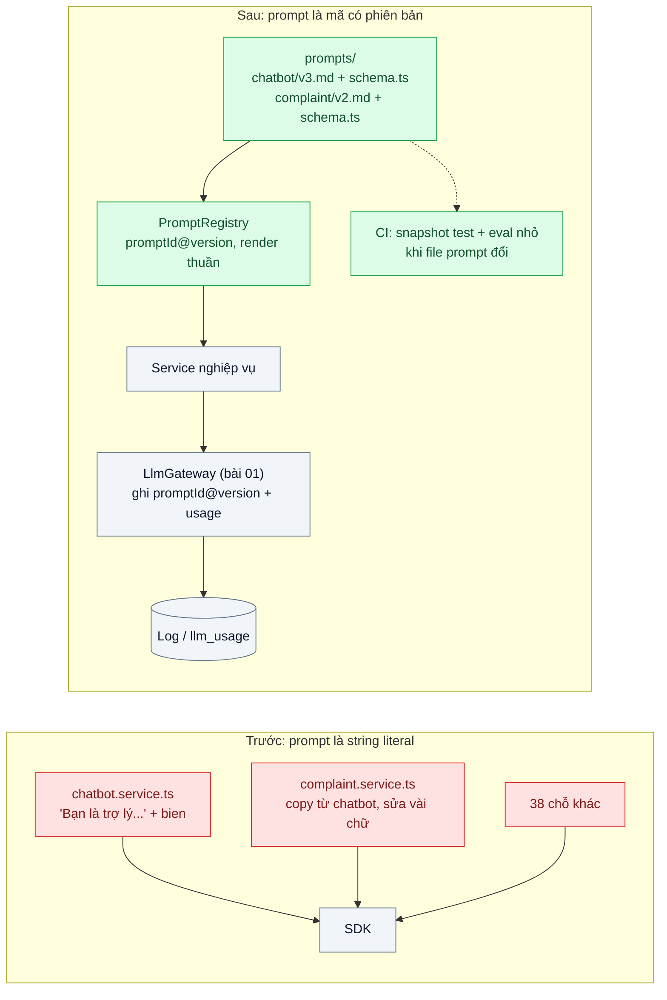
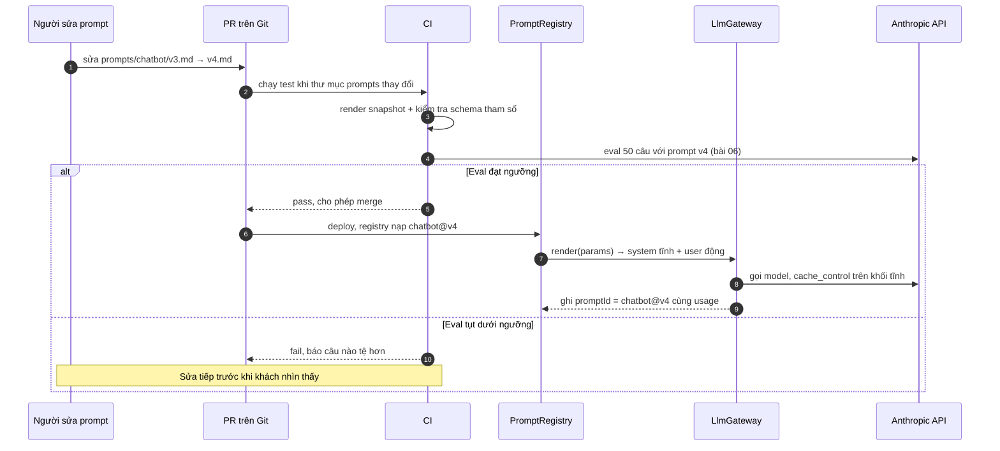

# Prompt as Code (template, version, test) — Prompt nằm rải rác trong string literal, sửa không biết hỏng gì

| Scope | Mức độ | Trạng thái | Pattern gốc | Cập nhật |
|---|---|---|---|---|
| 20 · backend / AI framework system design | 🟢 Cơ bản | 📋 Kế hoạch | Prompt as Code — 12-Factor Agents (factor 2, 2025); Eugene Yan, LLM patterns (2023) | 2026-10-06 |

> **Một câu tóm tắt:** Coi prompt là mã nguồn: có file riêng, tham số có kiểu, phiên bản, review qua PR và test chạy trong CI — để mỗi lần sửa prompt biết chắc mình đổi gì và hỏng gì.

## 1. Bài toán thực tế (What)

**Bối cảnh** *(doanh nghiệp giả định, số liệu minh họa)*
Một sàn thương mại điện tử có 12 tính năng dùng LLM (chatbot hỗ trợ, viết mô tả sản phẩm, phân loại khiếu nại, tóm tắt đánh giá...). Prompt được viết thẳng trong code dưới dạng 40 string literal, nhiều prompt nối chuỗi với biến tại chỗ. Một số prompt đã được copy từ tính năng này sang tính năng khác rồi chỉnh vài chữ.

**Triệu chứng người kinh doanh nhìn thấy**
- Yêu cầu "chatbot thân thiện hơn" được sửa trong 20 phút nhưng tuần sau tính năng phân loại khiếu nại trả sai định dạng vì hai tính năng dùng chung một đoạn prompt.
- Không ai trả lời được "prompt nào đang chạy trên production" khi khách phàn nàn một câu trả lời; không rollback được riêng prompt.
- Mỗi lần sửa prompt là một lần "deploy rồi xem", không có cách nào biết tốt hơn hay tệ hơn trước khi khách thấy.

**Nguyên nhân kỹ thuật**
Prompt là dữ liệu quyết định hành vi sản phẩm nhưng không được quản lý như mã: không có owner, không có phiên bản, biến chèn vào không có kiểu, không có test render, không có liên kết giữa log của một request và phiên bản prompt đã tạo ra nó. Nối chuỗi tùy tiện cũng khiến phần tĩnh (system prompt) thay đổi từng request, làm mất cơ hội prompt caching.

**Ràng buộc**
- Người viết nội dung (không phải lập trình viên) vẫn cần đọc và góp ý prompt được — định dạng file phải dễ đọc.
- Không được tách prompt ra khỏi quy trình review và test; "sửa prompt trên dashboard rồi lên production ngay" là điều đội đã bị bỏng.
- Phần tĩnh của prompt phải ổn định từng byte giữa các request để cache được (scope 22 bài 01).

## 2. Vì sao dùng pattern này (Why)

**Nguyên nhân gốc mà pattern nhắm vào:** prompt là logic nghiệp vụ nhưng nằm ngoài mọi kỷ luật kỹ thuật (version, review, test, truy vết).

**Pattern giải quyết thế nào:** mỗi prompt là một thư mục `prompts/<ten>/` gồm file nội dung (Markdown, đọc được bởi người không lập trình) và một file TypeScript khai báo *schema tham số* (zod) cùng hàm `render(params)` thuần. `PromptRegistry` nạp tất cả lúc khởi động, gán `promptId@version` (version lấy từ hash nội dung hoặc số thủ công), và tách rõ *khối tĩnh* (system, few-shot) khỏi *khối động* (dữ liệu của request). Test gồm: snapshot của kết quả render, kiểm tra tham số thiếu/thừa, và một bộ eval nhỏ (bài 06) chạy trong CI khi file prompt thay đổi. Mọi lời gọi qua gateway (bài 01) ghi `promptId@version` cùng `usage`, nên log của một request truy ngược được tới đúng phiên bản prompt. 12-Factor Agents gọi điều này là "own your prompts": prompt là mã, không phải tham số bị giấu trong framework.

**Lựa chọn khác đã cân nhắc**

| Lựa chọn | Giải quyết được gì | Vì sao không chọn (ở bài này) |
|---|---|---|
| Giữ nguyên + tối ưu nhỏ: gom 40 string vào một file `prompts.ts` | Tìm prompt nhanh hơn | Vẫn không có kiểu tham số, không có phiên bản gắn vào log, không có test render; prompt chung giữa tính năng vẫn vô hình |
| Quản lý prompt trên dashboard/DB (ví dụ tính năng prompt management của Langfuse) | Sửa prompt không cần deploy; người không lập trình tự sửa | Tách prompt khỏi review và CI — đúng rủi ro đội đã gặp; cần cache và fallback khi dịch vụ ngoài lỗi. Có thể cân nhắc *sau* khi đã có eval |
| DSPy: khai báo chữ ký, compiler tự tối ưu prompt | Bỏ việc chỉnh prompt bằng tay | Đổi ngôn ngữ (Python) và tư duy; quá sớm khi chưa có eval để compiler tối ưu theo |
| Prompt trong file + registry + test *(chọn)* | Phiên bản, review, test, truy vết, cache ổn định | Phải viết thêm registry và quy ước thư mục; đổi prompt vẫn cần deploy |

## 3. Thiết kế hệ thống (How)

### 3.1 Kiến trúc trước và sau



### 3.2 Luồng chính



### 3.3 Thành phần và trách nhiệm

| Thành phần | Trách nhiệm | Quyết định thiết kế đáng chú ý |
|---|---|---|
| Thư mục `prompts/<ten>/` | Nội dung prompt (Markdown) + `schema.ts` (zod) + metadata (owner, mô tả, model alias gợi ý) | Markdown để người viết nội dung đọc được; tham số dạng `{{ten}}` được kiểm bởi schema |
| `PromptRegistry` | Nạp, validate, gán `promptId@version`, cung cấp `render()` thuần (không I/O) | Version = hash SHA-256 nội dung rút gọn, kèm số version thủ công khi cần đọc dễ |
| Tách tĩnh/động | `system` và few-shot là khối tĩnh; dữ liệu request chỉ vào `messages` | Khối tĩnh byte-ổn định để `cache_control` có tác dụng (scope 22 bài 01) |
| Test render (Vitest snapshot) | Phát hiện thay đổi ngoài ý muốn ở prompt dùng chung | Snapshot đổi phải được review có chủ đích |
| Eval nhỏ trong CI (bài 06) | Chặn merge khi chất lượng tụt | Dùng model rẻ làm judge để CI chạy được thường xuyên |
| Gateway ghi `promptId@version` | Truy ngược log → phiên bản prompt | Cột `prompt_version` trong bảng `llm_usage` |

### 3.4 Điểm dễ sai khi triển khai
- **Chèn dữ liệu động vào system prompt** (ngày giờ, tên khách): làm cache trượt mọi request. Dữ liệu động đi vào `messages`.
- **Prompt dùng chung không được khai báo**: hai tính năng cùng import một file mà không ai biết. Registry phải liệt kê "ai dùng prompt nào"; thay đổi prompt chung bắt eval của cả hai.
- **Template engine quá mạnh** (vòng lặp, điều kiện lồng nhau): prompt thành chương trình khó đọc. Giữ `{{bien}}` đơn giản; logic chuyển vào TypeScript trước khi render.
- **Version chỉ nằm trong tên file** nhưng không ghi vào log: khi sự cố không truy được. Version phải đi cùng mọi lời gọi.
- **Snapshot test được cập nhật máy móc** (`-u`) mà không đọc diff — vô hiệu hóa mục đích của test.
- **Quên escape dữ liệu người dùng** khi chèn vào prompt — nối chuỗi với nội dung người dùng là cửa cho prompt injection (scope 11 bài 05).

## 4. Tech stack và tác động (Impact techstack)

| Lớp | Công nghệ chọn | Vì sao chọn | Thay thế tương đương |
|---|---|---|---|
| Ngôn ngữ / runtime | TypeScript strict, Node 20+ | Schema tham số có kiểu, render thuần dễ test | — |
| Schema tham số | zod | Validate lúc render và sinh kiểu TypeScript | TypeBox, Valibot |
| Định dạng prompt | Markdown + front matter (owner, mô tả) | Người không lập trình đọc được; diff rõ trên Git | YAML |
| Gọi model | `@anthropic-ai/sdk` qua gateway bài 01; model mặc định `claude-opus-5-5`; judge eval dùng `claude-haiku-4-5` | Giữ `cache_control` trên khối tĩnh, structured outputs cho judge | — |
| Test | Vitest (snapshot) + script eval (bài 06) | Chạy nhanh trong CI | Jest |
| CI | GitHub Actions với filter đường dẫn `prompts/**` | Chỉ chạy eval khi prompt đổi, tiết kiệm chi phí | GitLab CI |
| Lưu vết | PostgreSQL 16 (`llm_usage.prompt_version`) | Truy ngược request → phiên bản | — |

Giá tại thời điểm viết (kiểm tra lại trang Pricing): `claude-opus-5-5` $4/$20 mỗi triệu token vào/ra; `claude-sonnet-5-5` $2/$10; `claude-haiku-4-5` $1/$5.

**Thay đổi so với hệ thống hiện tại:** thêm thư mục `prompts/`, `PromptRegistry`, snapshot test và bước CI; di chuyển 40 string literal vào thư mục (một lần). Đội học quy ước: sửa prompt = mở PR, đọc kết quả eval, không sửa trực tiếp trên production.

## 5. Kết quả đầu ra và cách đo (Output impact)

| Chỉ số | Trước (minh họa) | Mục tiêu khi thực hành | Cách đo |
|---|---|---|---|
| Số prompt có owner và phiên bản | 0 / 40 | 40 / 40 | Script liệt kê registry, kiểm tra front matter |
| Thời gian trả lời "prompt nào đã tạo câu trả lời này" | hàng giờ (đọc code theo ngày deploy) | vài giây | Truy vấn `llm_usage` theo request ID, đọc `prompt_version` |
| Tỷ lệ thay đổi prompt có eval chạy trước khi merge | 0% | 100% | Log CI: số PR đụng `prompts/**` có job eval pass |
| Sự cố "sửa A hỏng B" mỗi quý | 3 | 0 | Ticket sự cố gắn nhãn prompt |
| `cache_read_input_tokens` / tổng token vào của chatbot | gần 0 | tăng rõ sau khi tách tĩnh/động | Tổng `usage.cache_read_input_tokens` so với tổng token vào trong `llm_usage` |
| Chi phí một lần chạy eval trong CI | — | dưới ngưỡng đội chấp nhận | Tổng `usage` của job eval × đơn giá |

> Số "trước" là minh họa để hình dung bài toán. Số "mục tiêu" chỉ được coi là đạt khi có số đo thật
> ở mục 8 kèm môi trường đo.

**Tác động nghiệp vụ mong đợi:** sửa prompt trở thành thay đổi có kiểm soát như sửa code; sự cố do prompt được phát hiện trong CI thay vì bởi khách hàng.

## 6. Đánh đổi và khi KHÔNG nên dùng

**Đánh đổi**
- Mỗi thay đổi prompt phải đi qua PR và deploy — chậm hơn "sửa trên dashboard", đổi lại là an toàn.
- Snapshot test dễ gây mệt mỏi nếu prompt đổi thường xuyên; cần kỷ luật đọc diff.
- Eval trong CI tốn tiền API; phải giới hạn kích thước bộ eval và dùng model rẻ làm judge.

**Không nên dùng khi**
- Chỉ có một hoặc hai prompt và một người duy nhất sửa — thư mục và registry là thừa, một file hằng số có kiểu là đủ.
- Đội vận hành nội dung cần sửa prompt nhiều lần mỗi ngày mà không có kỹ sư: khi đó cần nền tảng quản lý prompt có môi trường staging và eval riêng, chứ không chỉ "prompt trong code".

**Liên quan**
- [Model Gateway](../01-llm-gateway-abstraction-doi-model-phai-sua-30-file/) — nơi ghi `promptId@version` cùng usage.
- [Eval Pipeline & LLM-as-Judge in CI](../06-llm-as-judge-eval-pipeline-trong-ci-sua-prompt-khong-biet-tot-hon-hay-te-hon/) — bộ eval mà CI chạy khi prompt đổi.
- [Prompt Caching (scope 22)](../../22-backend-ai-optimizer/01-prompt-caching-system-prompt-20k-token-tra-tien-moi-request/) — lý do phải tách khối tĩnh/động.
- [Prompt Injection Defense (scope 11)](../../11-backend-ai-agent/05-prompt-injection-khach-nhap-bo-qua-huong-dan-giam-gia-100/) — rủi ro khi chèn dữ liệu người dùng vào prompt.
- [Golden Dataset from Production Traces (scope 24)](../../24-backend-ai-monitoring/04-golden-dataset-tu-production-regression-test-prompt/) — nguồn bộ eval hồi quy.

## 7. Cơ sở tham khảo

- Dex Horthy, *12-Factor Agents* (2025), factor 2 "Own your prompts" — https://github.com/humanlayer/12-factor-agents — lập luận prompt là mã nguồn phải do đội sở hữu, không giấu trong framework.
- Eugene Yan, "Patterns for Building LLM-based Systems & Products" (2023) — https://eugeneyan.com/writing/llm-patterns/ — evals là điều kiện để thay đổi prompt an toàn; caching đòi hỏi phần tĩnh ổn định.
- Anthropic docs, "Prompt engineering" — https://platform.claude.com/docs/en/ (mục Build with Claude → Prompt engineering) — cấu trúc system prompt, few-shot, dùng thẻ XML tách dữ liệu khỏi hướng dẫn.
- Anthropic docs, "Prompt caching" — https://platform.claude.com/docs/en/build-with-claude/prompt-caching — vì sao khối tĩnh phải đứng trước và không đổi từng byte.
- Hamel Husain, "Your AI Product Needs Evals" (2024) — https://hamel.dev/blog/posts/evals/ — bộ eval cấp 1 (assertion) chạy được trong CI.

## 8. Kế hoạch thực hành

- [ ] Bước 1: dựng 3 service có prompt string literal, trong đó 2 service dùng chung một đoạn; tái hiện "sửa A hỏng B".
- [ ] Bước 2: đo "trước": đếm prompt không có version, thử truy ngược một request về prompt (không được).
- [ ] Bước 3: áp dụng pattern: thư mục `prompts/`, `PromptRegistry` + zod, tách tĩnh/động, ghi `prompt_version` qua gateway.
- [ ] Bước 4: đo "sau": snapshot test bắt được thay đổi prompt chung; `cache_read_input_tokens` tăng; ghi vào mục 5.
- [ ] Bước 5: test Vitest: (a) thiếu tham số → lỗi rõ, (b) render thuần cho cùng output, (c) snapshot đổi khi prompt đổi, (d) CI chỉ chạy eval khi `prompts/**` đổi.

**Cấu trúc code dự kiến**
```text
prompts/
  chatbot/
    v4.md              # nội dung + front matter (owner, mô tả)
    schema.ts          # zod schema tham số
  complaint/
src/
  prompt/
    registry.ts        # nạp, validate, promptId@version, render()
    render.ts          # thay {{bien}}, tách khối tĩnh/động
  llm/                 # gateway bài 01
test/
  registry.test.ts
  __snapshots__/
.github/workflows/eval-prompt.yml
docker-compose.yml
```

**Cách chạy** *(điền khi bắt đầu code)*
```bash
docker compose up -d
pnpm install && pnpm test
```
