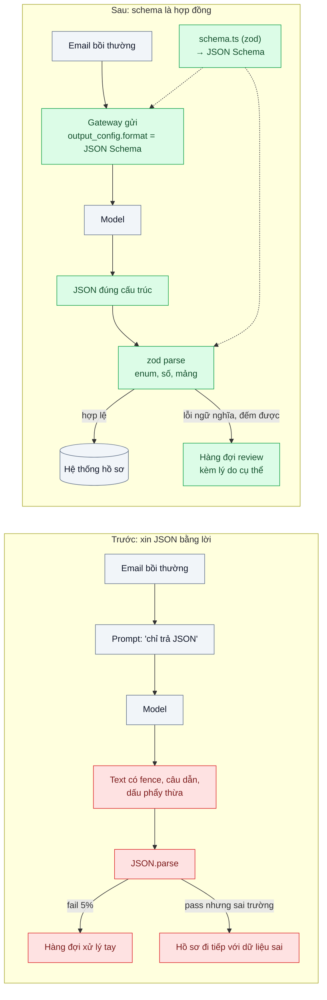
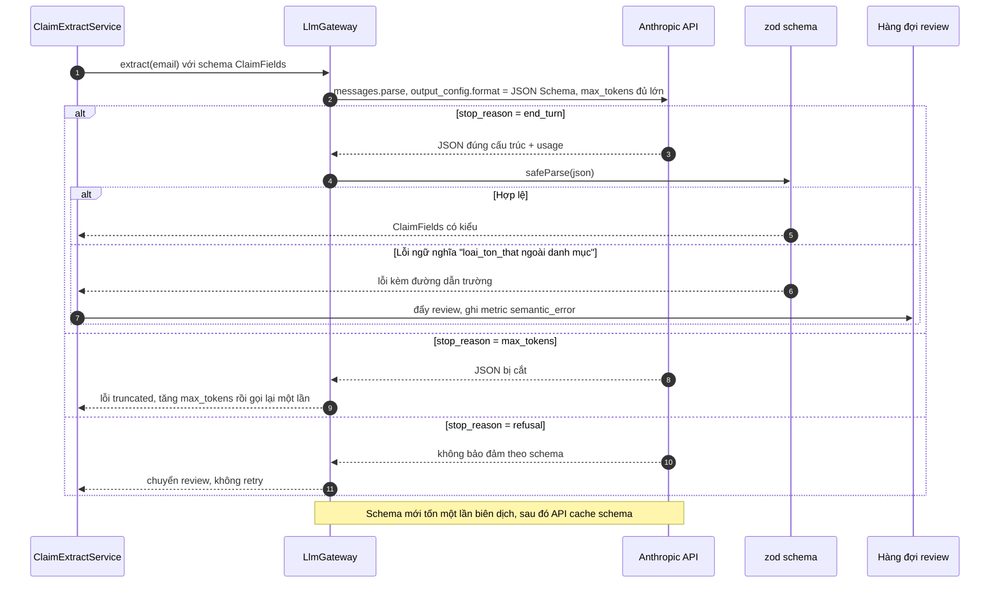

# Structured Output (JSON schema / strict tools) — Parse JSON từ text trả về fail 5% request

| Scope | Mức độ | Trạng thái | Pattern gốc | Cập nhật |
|---|---|---|---|---|
| 20 · backend / AI framework system design | 🟢 Cơ bản | 📋 Kế hoạch | Structured Outputs — Anthropic docs (`output_config.format`, `strict`); JSON Schema | 2026-10-06 |

> **Một câu tóm tắt:** Thay vì xin model "chỉ trả JSON" rồi parse bằng tay, khai báo JSON Schema để API ràng buộc định dạng đầu ra, và validate bằng zod ở phía ứng dụng — lỗi cú pháp về 0, lỗi còn lại là lỗi ngữ nghĩa đo được.

## 1. Bài toán thực tế (What)

**Bối cảnh** *(doanh nghiệp giả định, số liệu minh họa)*
Một công ty bảo hiểm nhận 4.000 email yêu cầu bồi thường mỗi ngày. Một service dùng LLM trích xuất 14 trường (số hợp đồng, ngày sự kiện, loại tổn thất, số tiền yêu cầu, danh sách chứng từ đính kèm...) thành JSON để đổ vào hệ thống xử lý hồ sơ. Prompt hiện tại kết thúc bằng "Chỉ trả về JSON hợp lệ, không giải thích".

**Triệu chứng người kinh doanh nhìn thấy**
- 5% email (khoảng 200 mỗi ngày) rơi vào hàng đợi xử lý tay vì "lỗi hệ thống", nhân viên phải nhập lại 14 trường.
- Chi phí API cao hơn dự tính vì mỗi lần parse lỗi service gọi lại model, có email gọi tới 3 lần.
- Thỉnh thoảng JSON parse *được* nhưng thiếu trường hoặc `loai_ton_that` là một giá trị ngoài danh mục, hồ sơ đi tiếp và sai ở bước sau — khó phát hiện hơn lỗi parse.

**Nguyên nhân kỹ thuật**
Model trả JSON bọc trong ```` ```json ```` fence, kèm một câu dẫn, thừa dấu phẩy cuối, hoặc đổi tên trường theo ngôn ngữ tự nhiên. `JSON.parse` thất bại và code không phân biệt được lỗi cú pháp với lỗi ngữ nghĩa. Không có hợp đồng máy đọc được (schema) giữa prompt và code tiêu thụ.

**Ràng buộc**
- Danh mục `loai_ton_that` cố định 9 giá trị; `so_tien` phải là số; `chung_tu` là mảng chuỗi.
- Không được tăng số lần gọi model; tốt nhất là giảm.
- Phải phân biệt được "model không chắc" (trường để `null`) với "model bịa".

## 2. Vì sao dùng pattern này (Why)

**Nguyên nhân gốc mà pattern nhắm vào:** định dạng đầu ra được *mô tả bằng lời* trong prompt thay vì *ràng buộc bằng máy*; mọi sai lệch chỉ lộ ra khi parse.

**Pattern giải quyết thế nào:** khai báo JSON Schema cho đầu ra và gửi qua `output_config.format` — API ràng buộc model sinh đúng cấu trúc đó (schema cần `additionalProperties: false` và danh sách `required`). Ở ứng dụng, cùng một schema được viết bằng zod: SDK TypeScript có `client.messages.parse()` validate phản hồi theo schema, nên code nhận về đối tượng có kiểu thay vì chuỗi. Khi đầu ra cần đi kèm *hành động* (gọi tool), dùng tool use với `strict: true` để tham số tool bảo đảm đúng schema. Lỗi cú pháp biến mất; lỗi còn lại (giá trị ngoài danh mục, số tiền âm) được zod bắt tại chỗ và đếm được — đó là tín hiệu để sửa prompt hoặc schema, không phải để retry mù.

**Lựa chọn khác đã cân nhắc**

| Lựa chọn | Giải quyết được gì | Vì sao không chọn (ở bài này) |
|---|---|---|
| Giữ nguyên + tối ưu nhỏ: cắt fence bằng regex, dùng thư viện sửa JSON (kiểu `jsonrepair`) | Giảm lỗi cú pháp phần lớn | Vẫn không bảo đảm trường/kiểu; che lỗi thay vì ngăn lỗi; không bắt được giá trị ngoài danh mục |
| Prompt kỹ hơn + ví dụ few-shot + retry khi parse lỗi | Giảm tỷ lệ lỗi | Tốn tiền gọi lại; không có bảo đảm; lỗi ngữ nghĩa vẫn lọt |
| Prefill câu trả lời của assistant bằng `{` | Từng là mẹo phổ biến | Các model hiện tại không còn hỗ trợ prefill cho lượt assistant (API trả lỗi) — xem tài liệu Structured outputs |
| Tool use với `strict: true` | Bảo đảm schema tham số tool | Chọn khi output *là* lệnh gọi tool; ở bài này chỉ cần dữ liệu nên `output_config.format` gọn hơn (ghi ở mục 3.4 khi nào dùng cái nào) |
| `output_config.format` + zod *(chọn)* | Bảo đảm cú pháp, kiểu có sẵn ở TypeScript | Schema có giới hạn (không hỗ trợ đệ quy, không hỗ trợ ràng buộc số/độ dài — SDK validate phía client) |

## 3. Thiết kế hệ thống (How)

### 3.1 Kiến trúc trước và sau



### 3.2 Luồng chính



### 3.3 Thành phần và trách nhiệm

| Thành phần | Trách nhiệm | Quyết định thiết kế đáng chú ý |
|---|---|---|
| `claim-fields.schema.ts` (zod) | Nguồn sự thật duy nhất của cấu trúc; sinh JSON Schema gửi API và validate phản hồi | Mỗi trường cho phép `null` khi không có trong email, kèm `do_tin_cay` để tách "không chắc" với "bịa" |
| Gateway (bài 01) | Gắn `output_config.format`, đặt `max_tokens` đủ cho 14 trường, kiểm `stop_reason` | Không retry khi `refusal`; retry đúng một lần khi `max_tokens` |
| Tầng validate | `safeParse`, phân loại lỗi: cú pháp (kỳ vọng 0) / ngữ nghĩa / thiếu dữ liệu | Mỗi loại một metric riêng để biết sửa gì |
| Hàng đợi review | Nhận hồ sơ lỗi ngữ nghĩa kèm lý do và JSON gốc | Người review sửa nhanh hơn vì không nhập lại 14 trường |
| Bộ eval 200 email có nhãn | Đo độ chính xác trích xuất theo trường | Chạy lại mỗi khi đổi schema/prompt/model |

### 3.4 Điểm dễ sai khi triển khai
- **Thiếu `additionalProperties: false` hoặc `required`** trong schema: API từ chối hoặc kết quả không chặt như mong đợi. Sinh JSON Schema từ zod bằng công cụ, không viết tay.
- **Dùng ràng buộc không được hỗ trợ** (`minimum`, `maxLength`, schema đệ quy): API không thi hành; SDK TypeScript loại chúng khỏi schema gửi đi và validate phía client — phải biết điều đó để không tưởng API đã kiểm.
- **`max_tokens` quá thấp**: JSON bị cắt, `stop_reason` là `max_tokens`. Luôn kiểm `stop_reason` trước khi parse.
- **Kết hợp với `citations`**: structured outputs không dùng được cùng citations (API trả 400). Bài này không cần citations.
- **Dùng `strict: true` nhầm chỗ**: `strict` là trường cấp cao nhất của *định nghĩa tool*, không nằm trong `tool_choice`. Chọn tool use khi output là *hành động*; chọn `output_config.format` khi output là *dữ liệu*.
- **Coi "parse được" là "đúng"**: schema bảo đảm cấu trúc, không bảo đảm sự thật. Độ chính xác trích xuất phải đo bằng bộ eval có nhãn.

## 4. Tech stack và tác động (Impact techstack)

| Lớp | Công nghệ chọn | Vì sao chọn | Thay thế tương đương |
|---|---|---|---|
| Ngôn ngữ / runtime | TypeScript strict, Node 20+ | Kiểu suy ra từ zod dùng xuyên suốt | — |
| Schema | zod + công cụ chuyển sang JSON Schema | Một nguồn sự thật cho API và validate | TypeBox (sinh JSON Schema trực tiếp) |
| SDK | `@anthropic-ai/sdk`: `messages.parse()`, `output_config.format`; model `claude-opus-5-5` (thử `claude-sonnet-5-5` cho trích xuất đơn giản sau khi có eval) | Ràng buộc định dạng tại API; parse có kiểu | Tool use `strict: true` khi cần gọi tool |
| HTTP app | NestJS | Service + hàng đợi review | Fastify |
| Lưu trữ | PostgreSQL 16 (hồ sơ, hàng đợi review, metric) | Đếm lỗi theo loại | — |
| Test / hạ tầng | Vitest, Docker Compose | Test schema và phân loại lỗi với phản hồi giả | — |

Giá tại thời điểm viết (kiểm tra lại trang Pricing): `claude-opus-5-5` $4/$20 mỗi triệu token vào/ra; `claude-sonnet-5-5` $2/$10; `claude-haiku-4-5` $1/$5.

**Thay đổi so với hệ thống hiện tại:** thêm `schema.ts`, đổi lời gọi sang `messages.parse()` với `output_config.format`, thêm phân loại lỗi và metric; bỏ regex cắt fence và vòng retry mù. Đội vận hành học đọc ba metric lỗi thay vì một hàng đợi "lỗi hệ thống".

## 5. Kết quả đầu ra và cách đo (Output impact)

| Chỉ số | Trước (minh họa) | Mục tiêu khi thực hành | Cách đo |
|---|---|---|---|
| Tỷ lệ lỗi cú pháp JSON | 5% | 0% | Counter `json_syntax_error` trong service, chạy trên 1.000 email mẫu |
| Tỷ lệ lỗi ngữ nghĩa (enum sai, kiểu sai) | không đo được | đo được, kỳ vọng dưới 1% | `safeParse` thất bại / tổng request, phân loại theo đường dẫn trường |
| Số lần gọi model trung bình mỗi email | 1,1 | 1,0 (chỉ retry khi `max_tokens`) | Đếm request trong `llm_usage` theo email ID |
| Chi phí mỗi 1.000 email | — | giảm theo số lần gọi | Tổng `usage` × đơn giá từ `llm_usage` |
| Độ chính xác trích xuất theo trường (bộ eval 200 email) | — | mục tiêu đặt sau lần đo đầu | So khớp từng trường với nhãn (programmatic), người kiểm 30 mẫu lỗi |
| Hồ sơ vào hàng đợi tay mỗi ngày | 200 | chỉ còn lỗi ngữ nghĩa thật | Số bản ghi hàng đợi review theo ngày |

> Số "trước" là minh họa để hình dung bài toán. Số "mục tiêu" chỉ được coi là đạt khi có số đo thật
> ở mục 8 kèm môi trường đo.

**Tác động nghiệp vụ mong đợi:** nhân viên không còn nhập lại 14 trường vì lỗi kỹ thuật; những hồ sơ cần người xem là hồ sơ thật sự mơ hồ, kèm lý do cụ thể.

## 6. Đánh đổi và khi KHÔNG nên dùng

**Đánh đổi**
- Schema cứng làm khó thay đổi nhanh: thêm một trường là thay đổi hợp đồng ở cả API và code.
- Lần gọi đầu với schema mới chậm hơn do biên dịch schema; schema thay đổi liên tục sẽ trả giá này nhiều lần.
- Một số ràng buộc phải validate phía client; đội phải hiểu ranh giới API bảo đảm được gì.

**Không nên dùng khi**
- Đầu ra là văn bản tự do cho người đọc (email, tóm tắt) — ép vào JSON chỉ thêm token và làm cứng giọng văn.
- Cần `citations` trong cùng một phản hồi — hai tính năng không dùng chung được.
- Cấu trúc đệ quy sâu hoặc ràng buộc số học phức tạp là cốt lõi — API không thi hành, phải thiết kế lại thành hai bước.

**Liên quan**
- [Model Gateway](../01-llm-gateway-abstraction-doi-model-phai-sua-30-file/) — nơi truyền `output_config.format` nguyên bản.
- [Workflow Patterns](../04-workflow-patterns-chaining-routing-parallelization/) — mỗi bước pipeline nhận/trả dữ liệu có schema.
- [Tool Design & Tool Search](../09-tool-design-for-agents-30-tool-agent-chon-sai/) — `strict: true` cho tham số tool.
- [Tool Use / Function Calling (scope 11)](../../11-backend-ai-agent/02-tool-use-agent-tra-cuu-don-hang-trong-db-noi-bo/) — khi output là hành động.
- [Output Token Discipline (scope 22)](../../22-backend-ai-optimizer/10-token-budget-output-limits-model-tra-loi-dai-gap-3-can-thiet/) — JSON theo schema cũng là cách bỏ câu dẫn thừa.

## 7. Cơ sở tham khảo

- Anthropic docs, "Structured outputs" — https://platform.claude.com/docs/en/build-with-claude/structured-outputs — `output_config.format`, yêu cầu `additionalProperties: false`, các ràng buộc được/không được hỗ trợ, tương tác với `max_tokens`, `refusal`, citations.
- Anthropic docs, "Tool use overview" — https://platform.claude.com/docs/en/agents-and-tools/tool-use/overview — `strict: true` trên định nghĩa tool để bảo đảm schema tham số.
- JSON Schema — https://json-schema.org/ — chuẩn mô tả cấu trúc dùng cho cả API và validate.
- Anthropic SDK TypeScript — https://github.com/anthropics/anthropic-sdk-typescript — `messages.parse()` và cách SDK xử lý ràng buộc không được API hỗ trợ.
- Hamel Husain, "Your AI Product Needs Evals" (2024) — https://hamel.dev/blog/posts/evals/ — assertion cấp 1 (schema pass) khác với đánh giá độ đúng; cần bộ eval có nhãn.

## 8. Kế hoạch thực hành

- [ ] Bước 1: dựng service trích xuất với prompt "chỉ trả JSON" + `JSON.parse`; tạo 200 email mẫu có nhãn (sinh bằng model rồi người sửa).
- [ ] Bước 2: đo "trước": tỷ lệ lỗi cú pháp, số lần gọi mỗi email, độ chính xác theo trường.
- [ ] Bước 3: áp dụng pattern: zod schema → JSON Schema, `messages.parse()` với `output_config.format`, phân loại lỗi, hàng đợi review.
- [ ] Bước 4: đo "sau" trên cùng 200 email; ghi vào mục 5 kèm model và ngày đo.
- [ ] Bước 5: test Vitest: (a) phản hồi giả đúng schema → đối tượng có kiểu, (b) enum sai → lỗi ngữ nghĩa có đường dẫn trường, (c) `stop_reason: max_tokens` → retry một lần, (d) `refusal` → không retry.

**Cấu trúc code dự kiến**
```text
src/
  claims/
    claim-fields.schema.ts   # zod → JSON Schema
    claim-extract.service.ts # gọi gateway với output_config.format
    error-classifier.ts      # cú pháp / ngữ nghĩa / thiếu dữ liệu
  llm/                       # gateway bài 01
test/
  schema.test.ts
  extract.test.ts
eval/
  emails-200.jsonl           # email + nhãn 14 trường
  run-eval.ts
docker-compose.yml
```

**Cách chạy** *(điền khi bắt đầu code)*
```bash
docker compose up -d
pnpm install && pnpm test
```
