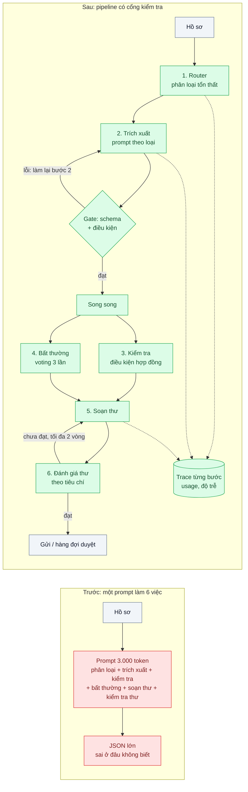
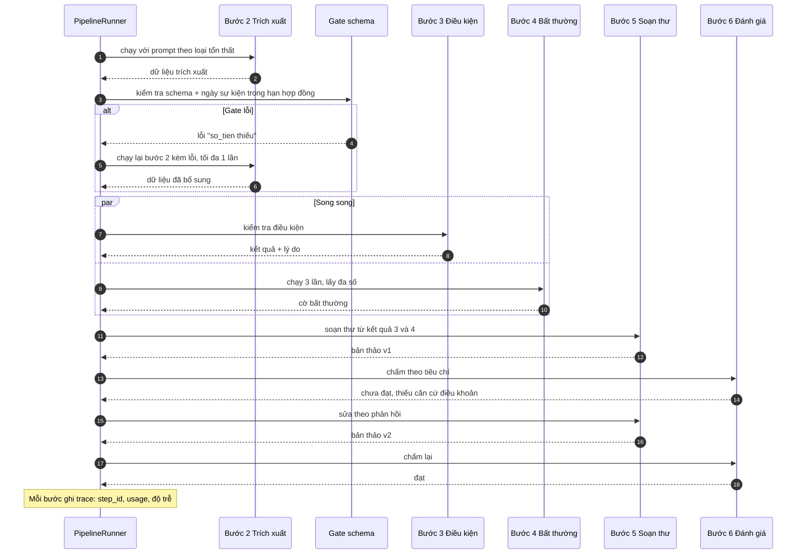

# Workflow Patterns (chaining, routing, parallelization, evaluator-optimizer) — Pipeline xử lý hồ sơ bảo hiểm 6 bước, bước nào cũng có thể sai

| Scope | Mức độ | Trạng thái | Pattern gốc | Cập nhật |
|---|---|---|---|---|
| 20 · backend / AI framework system design | 🟡 Trung bình | 📋 Kế hoạch | Workflow patterns — Anthropic, "Building effective agents" (2024) | 2026-10-06 |

> **Một câu tóm tắt:** Thay một prompt khổng lồ "làm hết 6 việc" bằng một pipeline do code điều khiển: mỗi bước một prompt nhỏ có schema, có cổng kiểm tra giữa các bước, bước độc lập chạy song song, bước quan trọng có vòng đánh giá-sửa — để lỗi được bắt đúng chỗ và chỉ làm lại đúng bước đó.

## 1. Bài toán thực tế (What)

**Bối cảnh** *(doanh nghiệp giả định, số liệu minh họa)*
Một công ty bảo hiểm xe cơ giới xử lý 1.500 hồ sơ bồi thường mỗi ngày. Quy trình có 6 bước: (1) phân loại hồ sơ theo loại tổn thất, (2) trích xuất dữ liệu từ biên bản và hóa đơn sửa chữa, (3) kiểm tra điều kiện bảo hiểm theo hợp đồng, (4) phát hiện dấu hiệu bất thường, (5) soạn thư thông báo quyết định, (6) kiểm tra thư trước khi gửi. Phiên bản đầu dùng *một* prompt 3.000 token yêu cầu model làm cả 6 việc và trả một JSON lớn.

**Triệu chứng người kinh doanh nhìn thấy**
- 12% hồ sơ bị trả lại làm toàn bộ vì thư quyết định sai, dù phần lớn dữ liệu trích xuất đúng.
- Khi sai, không ai chỉ ra được *bước nào* sai; đội nghiệp vụ và đội kỹ thuật đổ lỗi cho nhau.
- Muốn cải thiện riêng bước "phát hiện bất thường" phải sửa prompt chung và chấp nhận rủi ro hỏng 5 bước còn lại.
- Thời gian xử lý một hồ sơ gần 40 giây vì mọi việc làm tuần tự trong một lần sinh dài.

**Nguyên nhân kỹ thuật**
Một lời gọi gánh nhiều mục tiêu khác tính chất (phân loại, trích xuất, suy luận theo hợp đồng, viết văn) làm chất lượng từng việc đều giảm; lỗi ở bước sớm lan sang bước sau mà không có điểm kiểm tra; không có dữ liệu trung gian để đo, so sánh hay làm lại từng phần; không tận dụng được việc bước 3 và 4 độc lập nhau.

**Ràng buộc**
- Quy trình cố định, biết trước các bước — không cần model tự quyết định làm gì tiếp (đây là *workflow*, không phải *agent*).
- Thư quyết định phải đi qua kiểm tra trước khi gửi; hồ sơ nghi ngờ bất thường phải có người duyệt.
- Chi phí mỗi hồ sơ không được vượt bản hiện tại quá 20%.

## 2. Vì sao dùng pattern này (Why)

**Nguyên nhân gốc mà pattern nhắm vào:** mọi quyết định bị gói trong một lần sinh không quan sát được, nên không thể kiểm tra, song song hóa hay cải thiện từng phần.

**Pattern giải quyết thế nào:** bài viết "Building effective agents" tách *workflow* (code điều khiển luồng, model làm từng việc nhỏ) khỏi *agent* (model tự điều khiển), và mô tả năm khối xây dựng dùng ở đây:
- **Prompt chaining**: 6 bước thành 6 lời gọi nối tiếp, giữa các bước có *gate* kiểm tra bằng code (schema, điều kiện nghiệp vụ) — bước 2 sai thì dừng và làm lại bước 2, không chạy tiếp.
- **Routing**: bước 1 phân loại rồi chuyển hồ sơ vào prompt chuyên cho từng loại tổn thất (va chạm, cháy, mất cắp...), thay vì một prompt cố ôm hết.
- **Parallelization**: bước 3 và 4 độc lập nên chạy song song (*sectioning*); bước 4 chạy 3 lần rồi lấy đa số (*voting*) vì chi phí bỏ sót bất thường cao.
- **Evaluator-optimizer**: bước 5 soạn thư, bước 6 là một lời gọi đánh giá theo tiêu chí rõ ràng; không đạt thì gửi phản hồi về bước 5 sửa lại, tối đa 2 vòng.
- **Orchestrator-workers** không dùng vì số bước đã biết trước; ghi lại để phân biệt.
Mỗi bước là một hàm `Step<I, O>` nhận và trả dữ liệu có schema (bài 03); `PipelineRunner` ghi trace từng bước (đầu vào, đầu ra, `usage`, độ trễ) nên đo và so sánh được từng phần.

**Lựa chọn khác đã cân nhắc**

| Lựa chọn | Giải quyết được gì | Vì sao không chọn (ở bài này) |
|---|---|---|
| Giữ nguyên + tối ưu nhỏ: prompt dài hơn, thêm few-shot, yêu cầu "suy nghĩ từng bước" | Có thể giảm vài phần trăm lỗi | Vẫn một lời gọi không quan sát được; vẫn làm lại toàn bộ khi sai; không song song |
| Agent có tool tự quyết định bước tiếp theo | Linh hoạt với hồ sơ bất thường | Quy trình đã cố định; agent đắt hơn, khó dự đoán, khó kiểm toán — xem scope 11 bài 01 |
| DSPy: khai báo chữ ký từng bước, compiler tự tối ưu prompt | Bớt chỉnh prompt bằng tay | Đổi sang Python và cần bộ eval tốt trước; đáng cân nhắc *sau* khi pipeline đã tách bước và có eval (bài 06) |
| Pipeline workflow do code điều khiển *(chọn)* | Bắt lỗi đúng chỗ, song song, cải thiện từng bước | Nhiều lời gọi hơn; cần thiết kế schema và gate cho từng bước |

## 3. Thiết kế hệ thống (How)

### 3.1 Kiến trúc trước và sau



### 3.2 Luồng chính



### 3.3 Thành phần và trách nhiệm

| Thành phần | Trách nhiệm | Quyết định thiết kế đáng chú ý |
|---|---|---|
| `Step<I, O>` | Một việc, một prompt, đầu vào/đầu ra có zod schema | Hàm thuần dùng gateway (bài 01); không biết về bước khác |
| `Router` | Phân loại và chọn prompt chuyên biệt | Dùng structured output với enum; model rẻ sau khi eval xác nhận |
| `Gate` | Kiểm tra bằng code giữa các bước | Lỗi gate làm lại *một* bước, có giới hạn số lần |
| `ParallelSection` | Chạy các bước độc lập cùng lúc với giới hạn đồng thời | Dùng `Promise.all` qua bộ giới hạn để không tự gây 429 (bài 05) |
| `Voting` | Chạy N lần, tổng hợp đa số | Đầu ra phải chuẩn hóa (enum) mới so được |
| `EvaluatorOptimizer` | Vòng soạn-đánh giá với tiêu chí rõ và số vòng tối đa | Prompt đánh giá tách khỏi prompt soạn; cân nhắc model khác để giảm thiên lệch |
| `PipelineRunner` + bảng trace | Điều phối, lưu kết quả trung gian, ghi `usage`/độ trễ từng bước | Kết quả trung gian lưu PostgreSQL để làm lại từ bước lỗi (nền cho bài 08) |

### 3.4 Điểm dễ sai khi triển khai
- **Tách bước nhưng không có gate**: lỗi vẫn lan, chỉ tốn thêm lời gọi. Gate là phần quan trọng nhất của chaining.
- **Evaluator dùng y nguyên prompt và model của generator**: dễ "tự khen"; tách tiêu chí, viết tiêu chí kiểm được, cân nhắc model khác cho đánh giá.
- **Vòng evaluator không có trần**: lặp vô hạn khi tiêu chí mâu thuẫn. Tối đa 2 vòng rồi chuyển người duyệt.
- **Song song không giới hạn** làm vượt rate limit; ghép với concurrency limiter của bài 05.
- **Bước nào cũng dùng model mạnh nhất**: router và phân loại nên thử model rẻ *sau khi có eval* (scope 22 bài 03), đừng đoán.
- **Voting trên văn bản tự do**: không so được. Voting cần đầu ra enum/boolean.
- **Không lưu kết quả trung gian**: crash ở bước 5 là làm lại từ bước 1 và trả tiền hai lần — bài 08.

## 4. Tech stack và tác động (Impact techstack)

| Lớp | Công nghệ chọn | Vì sao chọn | Thay thế tương đương |
|---|---|---|---|
| Ngôn ngữ / runtime | TypeScript strict, Node 20+ | `Step<I, O>` có kiểu; `Promise.all` cho song song | — |
| HTTP app | NestJS | Module cho pipeline, DI cho gateway giả trong test | Fastify |
| SDK | `@anthropic-ai/sdk` qua gateway bài 01; `claude-opus-5-5` cho bước 3 và 5, thử `claude-haiku-4-5` cho router sau khi eval | Structured outputs cho mọi bước; adaptive thinking (`thinking: {type: "adaptive"}`) ở bước suy luận hợp đồng | — |
| Giới hạn đồng thời | `p-limit` hoặc semaphore tự viết | Chặn bão request khi song song | Bulkhead của bài 05 |
| Lưu trung gian / trace | PostgreSQL 16 | Làm lại từ bước lỗi; truy vấn chi phí theo bước | Redis cho trace ngắn hạn |
| Eval | Bộ 100 hồ sơ có nhãn + judge (bài 06) | So sánh pipeline với prompt khổng lồ | — |
| Test / hạ tầng | Vitest, Docker Compose | Gateway giả để test luồng gate/vòng lặp không tốn tiền | — |

Giá tại thời điểm viết (kiểm tra lại trang Pricing): `claude-opus-5-5` $4/$20 mỗi triệu token vào/ra; `claude-sonnet-5-5` $2/$10; `claude-haiku-4-5` $1/$5.

**Thay đổi so với hệ thống hiện tại:** thay một service gọi prompt khổng lồ bằng module `pipeline/` với 6 step, gate, runner và bảng trace; thêm hàng đợi duyệt cho hồ sơ bất thường. Đội nghiệp vụ lần đầu nhìn thấy kết quả từng bước và góp ý tiêu chí đánh giá thư.

## 5. Kết quả đầu ra và cách đo (Output impact)

| Chỉ số | Trước (minh họa) | Mục tiêu khi thực hành | Cách đo |
|---|---|---|---|
| Hồ sơ phải làm lại toàn bộ | 12% | gần 0% (chỉ làm lại bước lỗi) | Đếm lần chạy lại theo `step_id` trong bảng trace |
| Bước lỗi được định danh | 0% | 100% | Mỗi hồ sơ lỗi có `step_id` và lý do gate |
| Chi phí mỗi hồ sơ | 1 lời gọi lớn | không vượt +20% | Tổng `usage` các bước × đơn giá, so với baseline trên cùng 100 hồ sơ |
| Chất lượng thư quyết định (bộ eval 100 hồ sơ) | — | mục tiêu đặt sau lần đo đầu | LLM-as-judge pairwise pipeline so với baseline + người thẩm định 20 mẫu |
| Độ trễ end-to-end p95 | 40 giây | giảm nhờ song song bước 3 và 4 | Timestamp đầu/cuối trong trace, phân vị tính bằng SQL |
| Số vòng evaluator trung bình | — | dưới 1,5 | Cột `rounds` trong trace |

> Số "trước" là minh họa để hình dung bài toán. Số "mục tiêu" chỉ được coi là đạt khi có số đo thật
> ở mục 8 kèm môi trường đo.

**Tác động nghiệp vụ mong đợi:** hồ sơ sai được sửa đúng chỗ thay vì làm lại từ đầu; đội nghiệp vụ cải thiện từng bước mà không sợ hỏng bước khác.

## 6. Đánh đổi và khi KHÔNG nên dùng

**Đánh đổi**
- Nhiều lời gọi hơn: độ trễ tuần tự có thể tăng nếu không song song hóa; chi phí phải đo, không giả định rẻ hơn.
- Nhiều schema, gate và prompt phải bảo trì; thay đổi nghiệp vụ chạm nhiều bước.
- Code điều khiển luồng cứng: hồ sơ ngoài mọi nhánh router cần đường thoát sang người xử lý.

**Không nên dùng khi**
- Việc chỉ là một bước (phân loại, tóm tắt) — chaining chỉ thêm độ trễ.
- Số bước và thứ tự không biết trước, phụ thuộc kết quả tìm được — khi đó cân nhắc agent hoặc orchestrator-workers (scope 11).
- Chưa có bộ eval: không đo được thì không biết pipeline có tốt hơn prompt khổng lồ không.

**Liên quan**
- [Structured Output](../03-structured-output-parse-json-tu-text-fail-5-phan-tram/) — schema cho đầu vào/đầu ra mỗi bước.
- [Resilience for LLM Calls](../05-fallback-retry-circuit-breaker-cho-llm-api-429-529/) — giới hạn đồng thời khi song song.
- [Eval Pipeline & LLM-as-Judge in CI](../06-llm-as-judge-eval-pipeline-trong-ci-sua-prompt-khong-biet-tot-hon-hay-te-hon/) — đo pipeline so với baseline.
- [Durable Execution](../08-durable-execution-workflow-ai-chay-10-phut-crash-giua-chung/) — làm lại từ bước lỗi khi crash.
- [Workflow vs Agent (scope 11)](../../11-backend-ai-agent/01-workflow-vs-agent-khi-nao-can-agent/) và [Prompt Chaining & Routing (scope 11)](../../11-backend-ai-agent/03-routing-prompt-chaining-mot-prompt-khong-lo-duoc-5-loai-yeu-cau/).
- [Model Routing / Cascade (scope 22)](../../22-backend-ai-optimizer/03-model-routing-cascade-80-phan-tram-cau-don-gian-vao-model-dat/) — chọn model theo bước.

## 7. Cơ sở tham khảo

- Anthropic, "Building effective agents" (2024-12) — https://www.anthropic.com/engineering/building-effective-agents — định nghĩa workflow so với agent và năm khối: prompt chaining, routing, parallelization, orchestrator-workers, evaluator-optimizer.
- Khattab et al., "DSPy: Compiling Declarative Language Model Calls into Self-Improving Pipelines" (2023) — https://dspy.ai/ — hướng compile pipeline nhiều bước, dùng làm phương án so sánh ở mục 2.
- Hohpe & Woolf, *EIP* (2003), "Pipes and Filters" — https://www.enterpriseintegrationpatterns.com/patterns/messaging/PipesAndFilters.html — nền của việc nối các bước độc lập có thể kiểm tra riêng.
- Anthropic docs, "Structured outputs" — https://platform.claude.com/docs/en/build-with-claude/structured-outputs — đầu ra có schema cho router, voting và gate.
- Anthropic docs, "Adaptive thinking" — https://platform.claude.com/docs/en/build-with-claude/adaptive-thinking — bật suy luận ở bước kiểm tra điều kiện hợp đồng.

## 8. Kế hoạch thực hành

- [ ] Bước 1: dựng service "một prompt làm 6 việc" với 100 hồ sơ mẫu có nhãn (sinh bằng model, người sửa nhãn).
- [ ] Bước 2: đo "trước": tỷ lệ hồ sơ sai, chi phí/hồ sơ, độ trễ p95, không định danh được bước lỗi.
- [ ] Bước 3: áp dụng pattern: 6 `Step`, `Router`, `Gate`, song song bước 3 và 4 (voting cho 4), evaluator-optimizer cho 5 và 6, bảng trace.
- [ ] Bước 4: đo "sau" trên cùng 100 hồ sơ; chạy judge pairwise; ghi vào mục 5.
- [ ] Bước 5: test Vitest với gateway giả: (a) gate lỗi chỉ chạy lại bước 2, (b) voting lấy đa số đúng, (c) evaluator dừng sau 2 vòng, (d) trace đủ `step_id`/`usage`.

**Cấu trúc code dự kiến**
```text
src/
  pipeline/
    step.ts                 # interface Step<I, O>
    runner.ts               # PipelineRunner, trace, làm lại từ bước lỗi
    gate.ts
    parallel.ts             # sectioning + voting với giới hạn đồng thời
    evaluator-optimizer.ts
  claims/
    steps/01-router.ts ... 06-evaluate-letter.ts
    schemas/
  llm/                      # gateway bài 01
test/
  runner.test.ts
  parallel.test.ts
eval/
  claims-100.jsonl
docker-compose.yml          # PostgreSQL 16
```

**Cách chạy** *(điền khi bắt đầu code)*
```bash
docker compose up -d
pnpm install && pnpm test
```
