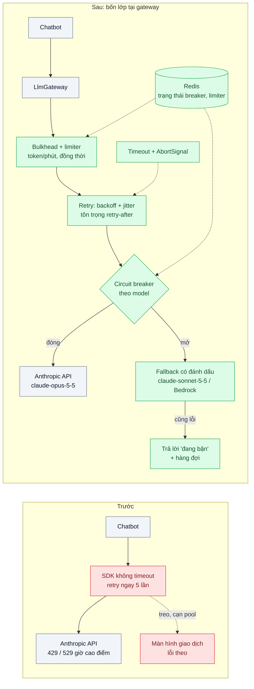
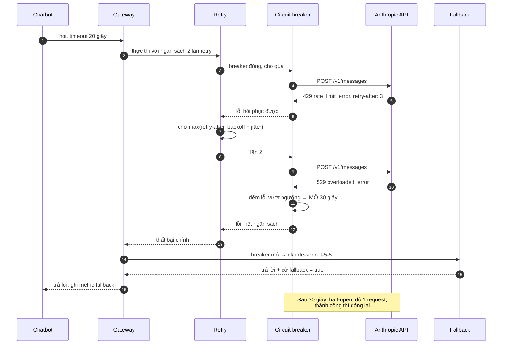

# Resilience for LLM Calls (retry, fallback model, circuit breaker) — API trả 429/529 lúc cao điểm, tính năng chết

| Scope | Mức độ | Trạng thái | Pattern gốc | Cập nhật |
|---|---|---|---|---|
| 20 · backend / AI framework system design | 🟡 Trung bình | 📋 Kế hoạch | Circuit Breaker, Timeouts, Bulkhead — Nygard, *Release It!* (2018); Backoff with jitter — Brooker, AWS (2015) | 2026-10-06 |

> **Một câu tóm tắt:** Bao mọi lời gọi LLM bằng bốn lớp phòng vệ — timeout, retry có backoff và jitter tôn trọng `retry-after`, circuit breaker theo model, và fallback có đánh dấu — để lúc API trả 429/529 tính năng chậm lại một cách có kiểm soát thay vì chết và kéo theo cả ứng dụng.

## 1. Bài toán thực tế (What)

**Bối cảnh** *(doanh nghiệp giả định, số liệu minh họa)*
Ví điện tử có chatbot hỗ trợ khách hàng chạy trên NestJS, trung bình 120 request/phút và lên 300 request/phút từ 19h đến 21h. Toàn bộ tính năng AI dùng chung một API key, chưa cấu hình timeout (SDK để mặc định) và chưa có retry hoặc retry ngay lập tức 5 lần liên tiếp.

**Triệu chứng người kinh doanh nhìn thấy**
- Giờ cao điểm, 8% câu hỏi của khách nhận "Có lỗi xảy ra" vì API trả 429 (vượt hạn mức token mỗi phút) hoặc 529 (API quá tải).
- Khi API chậm, request treo nhiều phút, pool kết nối của app cạn, màn hình *lịch sử giao dịch* (không liên quan AI) cũng lỗi theo.
- Sau mỗi sự cố của nhà cung cấp, hệ thống "tự bắn mình": hàng trăm request retry cùng lúc, hóa đơn tăng mà khách vẫn không được phục vụ.

**Nguyên nhân kỹ thuật**
Không có timeout nên lỗi chậm biến thành lỗi treo; retry ngay lập tức không jitter tạo cơn bão retry đồng loạt; không có cầu dao ngắt nên 300 request/phút tiếp tục đập vào API đang lỗi; không có đường lùi (fallback) nên lỗi ở nhà cung cấp là lỗi với khách; không cách ly tài nguyên nên AI lỗi kéo theo tính năng khác.

**Ràng buộc**
- Chat cần phản hồi trong vài giây; không thể chuyển toàn bộ sang xử lý nền.
- Hạn mức rate limit của tài khoản là cố định trong kỳ; giải pháp phải sống được *bên trong* hạn mức.
- Fallback sang model khác được phép nhưng phải đánh dấu để theo dõi chất lượng; không fallback âm thầm.

## 2. Vì sao dùng pattern này (Why)

**Nguyên nhân gốc mà pattern nhắm vào:** ứng dụng coi API bên ngoài là luôn sẵn và nhanh; mọi chế độ lỗi của nó (chậm, hết hạn mức, quá tải) đều đi thẳng tới khách.

**Pattern giải quyết thế nào:** bốn lớp xếp theo thứ tự từ trong ra ngoài, cài ở gateway (bài 01):
1. **Timeouts**: đặt `timeout` (SDK TypeScript tính bằng mili giây) và truyền `AbortSignal` để không có request treo vô hạn; stream dài dùng timeout theo khoảng cách giữa hai sự kiện.
2. **Retry có backoff và jitter**: chỉ retry lỗi *có thể hồi phục* (429, 529, 5xx, lỗi kết nối), chờ theo lũy thừa cộng ngẫu nhiên (full jitter), ưu tiên giá trị header `retry-after` khi có; có *ngân sách retry* tổng để một sự cố không nhân đôi hóa đơn. SDK tự retry với `maxRetries` mặc định 2 — phải quyết định rõ ai retry (SDK hay app), không để cả hai cùng retry.
3. **Circuit breaker theo model/nhà cung cấp**: đếm lỗi trong cửa sổ trượt; vượt ngưỡng thì *mở* và trả lỗi nhanh (fail fast) thay vì tiếp tục gọi; sau thời gian chờ chuyển *half-open* dò một request, thành công thì đóng lại.
4. **Fallback có đánh dấu**: khi breaker mở, chuyển sang `claude-sonnet-5-5` hoặc cùng model trên nền tảng khác (Bedrock); phản hồi gắn cờ `fallback=true` để theo dõi; không có fallback thì trả lời "hệ thống đang bận" và xếp vào hàng đợi.
Thêm **bulkhead**: pool kết nối và giới hạn đồng thời riêng cho lời gọi AI, và một bộ giới hạn theo token/phút để không tự gây 429.

**Lựa chọn khác đã cân nhắc**

| Lựa chọn | Giải quyết được gì | Vì sao không chọn (ở bài này) |
|---|---|---|
| Giữ nguyên + tối ưu nhỏ: tăng `maxRetries` của SDK lên 5 | Vượt qua 429 thoáng qua | Vẫn bão retry khi lỗi kéo dài; không bảo vệ pool kết nối; không có đường lùi |
| Mua hạn mức rate limit cao hơn | Giảm 429 | Không giải quyết 529 và sự cố nhà cung cấp; tốn tiền cho đỉnh 2 giờ mỗi ngày |
| Chuyển toàn bộ sang hàng đợi (asynchronous request-reply) | Hấp thụ đỉnh tải | Chat cần phản hồi tức thì; phù hợp cho tác vụ nền (xem scope 13 bài 05) |
| Failover đa vùng / đa nhà cung cấp ở tầng hạ tầng (scope 21 bài 08) | Sống qua sự cố lớn | Là lớp bổ sung ở trên; không thay được timeout/retry/breaker trong app |
| Bốn lớp phòng vệ tại gateway *(chọn)* | Sống được trong hạn mức, lỗi có kiểm soát | Thêm trạng thái (breaker, limiter) phải chia sẻ giữa các instance |

## 3. Thiết kế hệ thống (How)

### 3.1 Kiến trúc trước và sau



### 3.2 Luồng chính



### 3.3 Thành phần và trách nhiệm

| Thành phần | Trách nhiệm | Quyết định thiết kế đáng chú ý |
|---|---|---|
| Timeout + `AbortSignal` | Chặn request treo; hủy stream im lặng quá lâu | Timeout tổng cho non-stream; timeout "khoảng cách sự kiện" cho stream |
| `RetryPolicy` | Phân loại lỗi hồi phục được bằng typed error của SDK; backoff + full jitter; đọc `retry-after`; ngân sách retry | Không retry 400/401/403; đặt `maxRetries: 0` ở SDK khi app tự retry để không nhân đôi |
| `CircuitBreaker` theo model | Mở/half-open/đóng theo tỷ lệ lỗi trong cửa sổ trượt | Khóa theo `model` vì 529 có thể chỉ ở một model; trạng thái trong Redis để các instance nhất quán |
| `FallbackChain` | Thứ tự lùi: model khác → nền tảng khác → phản hồi suy giảm | Gắn cờ và ghi metric; nhớ rằng đổi model làm mất prompt cache và đổi chất lượng |
| `Bulkhead` + `RateLimiter` | Pool/đồng thời riêng cho AI; token bucket theo token/phút | Ước lượng token bằng `countTokens` hoặc trung bình lịch sử |
| Máy chủ giả lập lỗi | Trả 429/529/chậm theo kịch bản để test và k6 | Không test chịu lỗi trên API thật |

### 3.4 Điểm dễ sai khi triển khai
- **Retry lỗi 400** (sai tham số): vô ích và tốn tiền. Dùng typed error (`RateLimitError`, `InternalServerError`, `APIConnectionError`) để phân loại, không so chuỗi.
- **Bỏ qua `retry-after`**: tự chọn khoảng chờ ngắn hơn giá trị máy chủ yêu cầu rồi bị 429 tiếp.
- **Backoff không jitter**: mọi instance retry cùng nhịp — chính là cơn bão thứ hai.
- **Breaker cho "toàn bộ API"**: một model quá tải làm ngắt cả model khác vẫn khỏe. Khóa theo model/nhà cung cấp.
- **Fallback âm thầm**: chất lượng tụt không ai biết. Cờ, metric và eval mẫu (scope 24 bài 03).
- **Retry giữa stream**: đã gửi nửa câu trả lời cho khách rồi lại gửi lại từ đầu. Retry chỉ trước khi có token đầu tiên; sau đó báo lỗi rõ.
- **Hai lớp retry** (SDK và app) nhân thành 9 lần gọi. Chọn một nơi.

## 4. Tech stack và tác động (Impact techstack)

| Lớp | Công nghệ chọn | Vì sao chọn | Thay thế tương đương |
|---|---|---|---|
| Ngôn ngữ / runtime | TypeScript strict, Node 20+ | — | — |
| HTTP app | NestJS | Interceptor/guard cho bulkhead | Fastify |
| SDK | `@anthropic-ai/sdk`: `timeout` (ms), `maxRetries`, typed error; `claude-opus-5-5` chính, `claude-sonnet-5-5` fallback | Phân loại lỗi đúng; kiểm soát ai retry | `@anthropic-ai/bedrock-sdk` cho fallback nền tảng |
| Thư viện chịu lỗi | `cockatiel` (retry, circuit breaker, timeout, bulkhead) (cần xác minh) | Gom bốn policy trong một API | `opossum` cho circuit breaker (cần xác minh); tự viết |
| Trạng thái chia sẻ | Redis 7 | Breaker và limiter nhất quán giữa instance | PostgreSQL khi tần suất thấp |
| Giả lập lỗi & tải | Máy chủ giả bằng Fastify + k6 | Tái hiện 429/529 có kịch bản | MSW |
| Quan sát | Prometheus counter/histogram (retry, breaker state, fallback) | Đo được từng lớp | OpenTelemetry metrics |

Giá tại thời điểm viết (kiểm tra lại trang Pricing): `claude-opus-5-5` $4/$20 mỗi triệu token vào/ra; `claude-sonnet-5-5` $2/$10; `claude-haiku-4-5` $1/$5.

**Thay đổi so với hệ thống hiện tại:** thêm bốn policy vào gateway, Redis cho trạng thái, máy chủ giả lập lỗi trong môi trường test; sửa cấu hình SDK (`timeout`, `maxRetries`). Đội vận hành học đọc dashboard breaker/fallback và quy trình khi breaker mở lâu.

## 5. Kết quả đầu ra và cách đo (Output impact)

| Chỉ số | Trước (minh họa) | Mục tiêu khi thực hành | Cách đo |
|---|---|---|---|
| Tỷ lệ request trả lỗi cho khách khi API trả 429/529 theo kịch bản | 8% | dưới 0,5% (fallback hoặc suy giảm có kiểm soát) | k6 chạy 300 request/phút vào app nối máy chủ giả, đếm lỗi HTTP |
| p95 độ trễ khi API chậm | treo tới timeout mặc định | dưới 20 giây (timeout) | k6 `http_req_duration` p95 |
| Số lần gọi API trung bình mỗi request khi sự cố | 5 (retry ngay) | không quá 3 (ngân sách 2 retry) | Counter ở gateway chia cho số request |
| Tính năng không liên quan còn sống khi AI lỗi | lỗi theo | 100% health check pass | k6 gọi `/transactions` song song khi máy chủ giả trả lỗi |
| Tỷ lệ fallback và thời gian breaker mở | không đo | có dashboard | Prometheus: `llm_fallback_total`, `llm_breaker_state` |
| Chi phí phát sinh do retry | không đo | thấy được | Tổng `usage` của lần gọi có `attempt > 1` × đơn giá |

> Số "trước" là minh họa để hình dung bài toán. Số "mục tiêu" chỉ được coi là đạt khi có số đo thật
> ở mục 8 kèm môi trường đo.

**Tác động nghiệp vụ mong đợi:** giờ cao điểm khách vẫn được trả lời (có thể bằng model dự phòng) và các màn hình khác không lỗi theo; sự cố nhà cung cấp không còn tạo hóa đơn retry.

## 6. Đánh đổi và khi KHÔNG nên dùng

**Đánh đổi**
- Thêm trạng thái phân tán (breaker, limiter) phải vận hành; cấu hình ngưỡng sai thì breaker nhạy quá hoặc chậm quá.
- Fallback sang model khác đổi chất lượng và làm mất prompt cache của model chính; là lựa chọn "còn hơn chết", không phải miễn phí.
- Retry luôn tốn tiền; ngân sách retry là đánh đổi giữa tỷ lệ thành công và chi phí.

**Không nên dùng khi**
- Tác vụ nền không cần phản hồi ngay: dùng hàng đợi và Message Batches (scope 22 bài 02) thay vì retry trong request.
- Lưu lượng rất thấp, chưa từng chạm rate limit: timeout và retry của SDK là đủ, breaker là thừa.

**Liên quan**
- [Model Gateway](../01-llm-gateway-abstraction-doi-model-phai-sua-30-file/) — nơi cài bốn policy.
- [Circuit Breaker (scope 07)](../../07-backend-microservices/03-circuit-breaker-service-khuyen-mai-cham-lam-sap-checkout/) và [Timeouts, Retries, Backoff with Jitter (scope 07)](../../07-backend-microservices/04-timeout-retry-backoff-jitter-retry-dong-loat-tao-bao-moi/) — nền tảng chung.
- [Bulkhead (scope 07)](../../07-backend-microservices/08-bulkhead-mot-tenant-lon-chiem-het-thread-pool/) — cách ly tài nguyên.
- [Multi-provider / Multi-region Failover (scope 21)](../../21-backend-ai-infrastructure/08-multi-region-failover-llm-provider-mot-region-down/) — lớp hạ tầng phía trên.
- [Batch Processing (scope 22)](../../22-backend-ai-optimizer/02-batch-api-phan-loai-1-trieu-ticket-cu/) — đường cho tác vụ không cần realtime.
- [Online Quality Monitoring (scope 24)](../../24-backend-ai-monitoring/03-quality-monitoring-llm-judge-sampling-chat-luong-tut-dan-khong-ai-thay/) — theo dõi chất lượng khi fallback.

## 7. Cơ sở tham khảo

- Anthropic docs, "Errors" — https://platform.claude.com/docs/en/api/errors — mã lỗi 429 `rate_limit_error`, 529 `overloaded_error`, 500 `api_error`, header `retry-after`, lỗi nào nên retry.
- Anthropic docs, "Rate limits" — https://platform.claude.com/docs/en/api/rate-limits — hạn mức theo request và token mỗi phút, header phản hồi để xây limiter.
- Nygard, *Release It!* 2nd ed. (2018) — Circuit Breaker, Timeouts, Bulkhead, Fail Fast: cơ chế và lý do mỗi lớp.
- Brooker, "Exponential Backoff And Jitter", AWS Architecture Blog (2015) — https://aws.amazon.com/blogs/architecture/exponential-backoff-and-jitter/ — vì sao full jitter chống bão retry.
- Amazon Builders' Library, "Timeouts, retries, and backoff with jitter" — https://aws.amazon.com/builders-library/ — ngân sách retry và tránh retry nhiều tầng.
- Fowler, "CircuitBreaker" (2014) — https://martinfowler.com/bliki/CircuitBreaker.html — ba trạng thái đóng/mở/half-open.
- Anthropic SDK TypeScript — https://github.com/anthropics/anthropic-sdk-typescript — `timeout` (ms), `maxRetries`, typed error class.

## 8. Kế hoạch thực hành

- [ ] Bước 1: dựng chatbot NestJS + máy chủ giả lập API có kịch bản (bình thường / 429 kèm `retry-after` / 529 / chậm 60 giây); endpoint `/transactions` không liên quan AI.
- [ ] Bước 2: đo "trước" bằng k6: tỷ lệ lỗi, p95, số lần gọi mỗi request, `/transactions` có chết theo không.
- [ ] Bước 3: áp dụng pattern: timeout + AbortSignal, `RetryPolicy`, `CircuitBreaker` theo model trong Redis, `FallbackChain`, bulkhead + limiter.
- [ ] Bước 4: đo "sau" cùng kịch bản k6; ghi vào mục 5 kèm cấu hình ngưỡng.
- [ ] Bước 5: test Vitest: (a) 400 không retry, (b) `retry-after` được tôn trọng, (c) breaker mở sau N lỗi và half-open dò đúng, (d) fallback gắn cờ, (e) không retry sau token đầu tiên của stream.

**Cấu trúc code dự kiến**
```text
src/
  llm/
    resilience/
      timeout.ts
      retry-policy.ts        # phân loại lỗi, backoff + jitter, retry-after, ngân sách
      circuit-breaker.ts     # trạng thái trong Redis, khóa theo model
      fallback-chain.ts
      bulkhead.ts            # đồng thời + token bucket theo token/phút
    gateway.ts
test/
  retry-policy.test.ts
  circuit-breaker.test.ts
tools/
  fake-anthropic-server.ts   # kịch bản 429 / 529 / chậm
  k6/peak-hour.js
docker-compose.yml           # Redis 7
```

**Cách chạy** *(điền khi bắt đầu code)*
```bash
docker compose up -d
pnpm install && pnpm test
```
