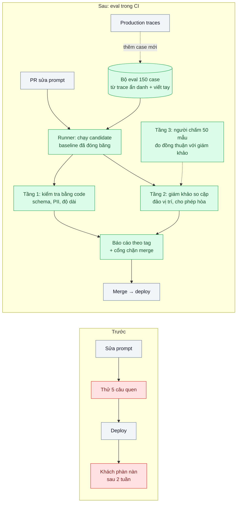
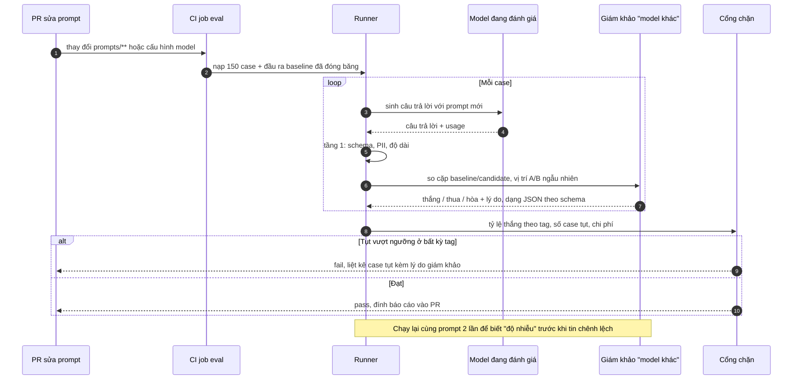

# Eval Pipeline & LLM-as-Judge in CI — Sửa prompt không biết tốt hơn hay tệ hơn

| Scope | Mức độ | Trạng thái | Pattern gốc | Cập nhật |
|---|---|---|---|---|
| 20 · backend / AI framework system design | 🟡 Trung bình | 📋 Kế hoạch | LLM-as-a-Judge — Zheng et al. (NeurIPS 2023); Evals — Hamel Husain (2024) | 2026-10-06 |

> **Một câu tóm tắt:** Xây một bộ eval chạy được trong CI — kiểm tra bằng code ở tầng dưới, model làm giám khảo so sánh cặp ở tầng giữa, người kiểm mẫu để hiệu chuẩn ở tầng trên — để mọi thay đổi prompt hoặc model có con số trước khi tới khách.

## 1. Bài toán thực tế (What)

**Bối cảnh** *(doanh nghiệp giả định, số liệu minh họa)*
Một SaaS B2B có trợ lý trả lời ticket hỗ trợ cho 400 khách hàng doanh nghiệp. Trong một quý, đội sửa prompt 8 lần (đổi giọng, thêm quy tắc, đổi model một lần). Hai lần trong số đó làm chất lượng tụt, nhưng chỉ phát hiện sau 1–2 tuần qua phàn nàn của khách. Cách kiểm tra hiện tại: người sửa thử 5 câu quen thuộc và thấy "ổn".

**Triệu chứng người kinh doanh nhìn thấy**
- Hai sự cố chất lượng mỗi quý, mỗi lần mất khoảng 2 tuần mới nhận ra và một tuần để sửa.
- Không ai dám đổi sang model rẻ hơn vì không có cách chứng minh "không tệ hơn".
- Tranh luận "prompt mới tốt hơn" diễn ra bằng cảm giác, kéo dài và không kết thúc.

**Nguyên nhân kỹ thuật**
Không có bộ dữ liệu đại diện, không có tiêu chí đo được, không có cách chấm tự động, và không có bước nào trong quy trình phát hành chạy các thứ đó. Đầu ra là văn bản tự do nên test bằng so khớp chuỗi không khả thi, còn chấm bằng người cho mọi thay đổi thì không đủ nhanh.

**Ràng buộc**
- Eval phải chạy trong CI khi prompt hoặc cấu hình model đổi, xong trong vài phút, chi phí mỗi lần chạy trong ngân sách đội chấp nhận.
- Giám khảo tự động phải được kiểm chứng với người; không tin mù.
- Dữ liệu eval lấy từ production phải được ẩn thông tin cá nhân.

## 2. Vì sao dùng pattern này (Why)

**Nguyên nhân gốc mà pattern nhắm vào:** chất lượng là thuộc tính không có bài kiểm tra; mọi thay đổi được phát hành dựa trên niềm tin.

**Pattern giải quyết thế nào:** một pipeline ba tầng theo Hamel Husain và dùng LLM-as-a-Judge theo Zheng et al.:
- **Dữ liệu**: 150 case gồm câu hỏi thật (ẩn danh, lấy từ trace — scope 24 bài 04) và case viết tay cho góc hiếm; mỗi case có nhãn hoặc tiêu chí; gắn tag (chủ đề, độ khó) để đọc kết quả theo nhóm.
- **Tầng 1 — kiểm tra bằng code**: đúng schema, không lộ dữ liệu cá nhân, độ dài trong khoảng, có trích dẫn nguồn khi cần. Miễn phí, chạy mọi case.
- **Tầng 2 — giám khảo là model**: so sánh *cặp* câu trả lời của prompt hiện tại (baseline, đầu ra đã đóng băng) và prompt mới trên cùng câu hỏi; đảo ngẫu nhiên vị trí A/B để tránh thiên lệch vị trí; cho phép "hòa"; giám khảo trả kết quả qua structured outputs để parse ổn định; giám khảo là model *khác* model đang được đánh giá để tránh thiên lệch tự khen.
- **Tầng 3 — người kiểm mẫu**: định kỳ chấm 50 case và so với giám khảo; tỷ lệ đồng thuận là thước đo độ tin của tầng 2.
- **CI**: job chạy khi `prompts/**` hoặc cấu hình model đổi; báo cáo tỷ lệ thắng/thua/hòa theo tag; chặn merge khi tụt vượt ngưỡng đã thống nhất; eval lớn chạy đêm bằng Message Batches để rẻ hơn.

**Lựa chọn khác đã cân nhắc**

| Lựa chọn | Giải quyết được gì | Vì sao không chọn (ở bài này) |
|---|---|---|
| Giữ nguyên + tối ưu nhỏ: checklist 20 câu thử tay trước khi deploy | Bắt lỗi thô | Không lặp lại được, không đo theo nhóm, phụ thuộc người thử |
| Chỉ dựa vào phản hồi người dùng và metric online (scope 24 bài 03) | Phản ánh thực tế | Hậu kiểm, chậm 1–2 tuần — chính là vấn đề hiện tại; cần nhưng không đủ |
| Chỉ kiểm tra bằng code | Rẻ, xác định | Không đo được chất lượng của văn bản mở |
| Người chấm toàn bộ mỗi lần sửa | Chính xác nhất | Đắt, chậm; không chạy được trong CI |
| Ba tầng + CI *(chọn)* | Nhanh, đo được, có hiệu chuẩn | Tốn tiền API cho giám khảo; phải bảo trì bộ dữ liệu |

## 3. Thiết kế hệ thống (How)

### 3.1 Kiến trúc trước và sau



### 3.2 Luồng chính



### 3.3 Thành phần và trách nhiệm

| Thành phần | Trách nhiệm | Quyết định thiết kế đáng chú ý |
|---|---|---|
| Bộ dữ liệu `eval/cases.jsonl` | Câu hỏi, ngữ cảnh, nhãn/tiêu chí, tag | Ẩn danh trước khi đưa vào repo; mỗi case có nguồn gốc |
| Baseline đóng băng | Đầu ra của prompt hiện tại lưu trên đĩa | Không sinh lại baseline mỗi lần, nếu không "tỷ lệ thắng" đổi nghĩa |
| Tầng 1 (assertion) | Kiểm tra xác định bằng code | Chạy trước, miễn phí, chặn sớm lỗi thô |
| Tầng 2 (giám khảo) | So cặp với rubric cụ thể, đảo vị trí, cho phép hòa, structured outputs | Giám khảo khác model đang đánh giá; rubric là các mệnh đề kiểm được, không phải "chấm 1–5" |
| Tầng 3 (người) | Chấm 50 mẫu định kỳ, đo đồng thuận với giám khảo | Dưới ngưỡng đồng thuận thì sửa rubric trước khi tin kết quả |
| Cổng chặn trong CI | Ngưỡng theo tag, báo cáo, chi phí | Ngưỡng thống nhất với nghiệp vụ; có đường "override có lý do" |
| Job eval đêm | Chạy bộ lớn hơn qua Message Batches | Rẻ hơn, không chặn PR |

### 3.4 Điểm dễ sai khi triển khai
- **Giám khảo là chính model đang được đánh giá**: thiên lệch tự khen (Zheng et al.). Dùng model khác hoặc ít nhất prompt và cấu hình khác.
- **Không đảo vị trí A/B**: giám khảo thiên về vị trí đầu hoặc câu dài hơn (position/verbosity bias).
- **Rubric mơ hồ** ("hữu ích 1–5"): kết quả nhiễu. Viết tiêu chí kiểm được ("có nêu bước tiếp theo", "không bịa chính sách").
- **Không có mức nhiễu nền**: chạy cùng prompt hai lần có thể lệch vài phần trăm; chênh lệch nhỏ hơn mức đó không có ý nghĩa.
- **Bộ eval rò vào few-shot của prompt**: điểm đẹp giả tạo. Tách tập eval khỏi tập ví dụ.
- **Bộ eval không đại diện hoặc cũ**: cập nhật từ production và từ phản hồi "không hữu ích" (scope 24 bài 09).
- **Ngưỡng quá chặt**: mọi PR fail, đội tắt eval. Bắt đầu từ "không tụt quá mức nhiễu", siết dần.

## 4. Tech stack và tác động (Impact techstack)

| Lớp | Công nghệ chọn | Vì sao chọn | Thay thế tương đương |
|---|---|---|---|
| Ngôn ngữ / runtime | TypeScript strict, Node 20+ | Runner và assertion cùng ngôn ngữ với app | — |
| SDK | `@anthropic-ai/sdk`; model đánh giá `claude-opus-5-5`; giám khảo `claude-sonnet-5-5` (hoặc `claude-haiku-4-5` cho chạy nhanh trong PR) với `output_config.format` | Giám khảo khác model; JSON ổn định | — |
| Chạy theo lô | Message Batches cho eval đêm | Giảm 50% chi phí, không cần realtime | Chạy trực tiếp cho PR nhỏ |
| Dữ liệu | JSONL trong repo + PostgreSQL lưu kết quả mỗi lần chạy | Diff được bộ eval; truy vấn xu hướng | Langfuse datasets |
| CI | GitHub Actions, filter đường dẫn `prompts/**` | Chỉ chạy khi cần | GitLab CI |
| Test | Vitest cho tầng 1 và cho chính runner | Runner cũng phải có test | — |

Giá tại thời điểm viết (kiểm tra lại trang Pricing): `claude-opus-5-5` $4/$20 mỗi triệu token vào/ra; `claude-sonnet-5-5` $2/$10; `claude-haiku-4-5` $1/$5.

**Thay đổi so với hệ thống hiện tại:** thêm thư mục `eval/`, runner, job CI, bảng kết quả; quy trình phát hành có thêm bước đọc báo cáo eval. Đội nghiệp vụ tham gia viết rubric và chấm mẫu định kỳ.

## 5. Kết quả đầu ra và cách đo (Output impact)

| Chỉ số | Trước (minh họa) | Mục tiêu khi thực hành | Cách đo |
|---|---|---|---|
| Thay đổi prompt có eval trước khi merge | 0 / 8 | 100% | Log CI theo PR đụng `prompts/**` |
| Thời gian phát hiện chất lượng tụt | 1–2 tuần | trước khi merge | So thời điểm fail CI với thời điểm tạo PR |
| Đồng thuận giám khảo – người trên 50 mẫu | chưa đo | từ 80% trở lên | Tỷ lệ đồng thuận (và Cohen's kappa) giữa nhãn người và giám khảo |
| Mức nhiễu nền (chênh lệch hai lần chạy cùng prompt) | chưa đo | biết con số, dùng làm ngưỡng tối thiểu | Chạy lặp 2 lần, so tỷ lệ thắng |
| Chi phí một lần eval trong PR | — | trong ngân sách đội đặt | Tổng `usage` (model + giám khảo) × đơn giá |
| Tỷ lệ thắng/hòa/thua của prompt mới theo tag | không có | báo cáo mỗi PR | Đầu ra giám khảo tổng hợp theo tag |

> Số "trước" là minh họa để hình dung bài toán. Số "mục tiêu" chỉ được coi là đạt khi có số đo thật
> ở mục 8 kèm môi trường đo.

**Tác động nghiệp vụ mong đợi:** sự cố chất lượng do sửa prompt được chặn trước khi phát hành; quyết định đổi model rẻ hơn có bằng chứng thay vì tranh luận.

## 6. Đánh đổi và khi KHÔNG nên dùng

**Đánh đổi**
- Chi phí API cho giám khảo mỗi PR; cần giới hạn số case trong PR và đẩy phần lớn sang job đêm.
- Bộ eval là tài sản phải bảo trì: thêm case, loại case cũ, cập nhật rubric khi sản phẩm đổi.
- Giám khảo tự động có thiên lệch; tầng 3 là chi phí người định kỳ không bỏ được.

**Không nên dùng khi**
- Đầu ra có đáp án xác định (phân loại, trích xuất): dùng so khớp nhãn, không cần giám khảo.
- Sản phẩm thay đổi hàng ngày và chưa có người dùng thật: bộ eval cũ nhanh hơn tốc độ cập nhật; dùng vài assertion thô cho tới khi ổn định.

**Liên quan**
- [Prompt as Code](../02-prompt-as-code-prompt-nam-rai-trong-string-khong-version/) — thay đổi prompt kích hoạt job eval.
- [Workflow Patterns](../04-workflow-patterns-chaining-routing-parallelization/) — evaluator-optimizer dùng cùng kỹ thuật giám khảo nhưng ở runtime.
- [Guardrails Layer](../10-guardrails-layer-input-output-validation-model-tra-loi-ngoai-pham-vi/) — đo guardrail bằng eval.
- [Batch Processing (scope 22)](../../22-backend-ai-optimizer/02-batch-api-phan-loai-1-trieu-ticket-cu/) — job eval đêm.
- [Model Routing / Cascade (scope 22)](../../22-backend-ai-optimizer/03-model-routing-cascade-80-phan-tram-cau-don-gian-vao-model-dat/) — eval là điều kiện để đổi model.
- [Golden Dataset from Production Traces (scope 24)](../../24-backend-ai-monitoring/04-golden-dataset-tu-production-regression-test-prompt/) và [Feedback Loop (scope 24)](../../24-backend-ai-monitoring/09-feedback-loop-thumbs-down-thanh-eval-case/) — nguồn case mới.
- [RAG Evaluation (scope 10)](../../10-backend-ai-rag/06-rag-evaluation-ragas-khong-biet-tra-loi-dung-bao-nhieu-phan-tram/) — eval chuyên cho RAG.

## 7. Cơ sở tham khảo

- Zheng et al., "Judging LLM-as-a-Judge with MT-Bench and Chatbot Arena" (NeurIPS 2023) — các thiên lệch của giám khảo (vị trí, độ dài, tự khen) và cách giảm: đảo vị trí, so cặp, rubric.
- Hamel Husain, "Your AI Product Needs Evals" (2024) — https://hamel.dev/blog/posts/evals/ — ba tầng eval (assertion, model, người) và phân tích lỗi.
- Eugene Yan, "Patterns for Building LLM-based Systems & Products" (2023) — https://eugeneyan.com/writing/llm-patterns/ — mục Evals: vì sao eval là nền của mọi thay đổi.
- Anthropic docs, "Structured outputs" — https://platform.claude.com/docs/en/build-with-claude/structured-outputs — giám khảo trả JSON theo schema.
- Anthropic docs, "Batch processing" — https://platform.claude.com/docs/en/build-with-claude/batch-processing — chạy eval lớn theo lô với chi phí giảm 50%.
- Anthropic docs, "Define your success criteria" và "Create strong empirical evaluations" — https://platform.claude.com/docs/en/ (mục Test and evaluate; đường dẫn cần xác minh) — cách viết tiêu chí đo được.

## 8. Kế hoạch thực hành

- [ ] Bước 1: dựng trợ lý ticket với prompt v1; thu 150 case (sinh câu hỏi bằng model từ 10 chủ đề, người sửa và gắn tag); đóng băng đầu ra baseline.
- [ ] Bước 2: đo "trước": chạy prompt v1 hai lần để lấy mức nhiễu nền; người chấm 50 mẫu làm chuẩn.
- [ ] Bước 3: áp dụng pattern: tầng 1 assertion, tầng 2 giám khảo so cặp với structured outputs, báo cáo theo tag, job CI với cổng chặn; job đêm dùng Message Batches.
- [ ] Bước 4: đo "sau": tạo PR sửa prompt cố ý làm tệ một chủ đề, xác nhận CI chặn; đo đồng thuận giám khảo – người; ghi vào mục 5.
- [ ] Bước 5: test Vitest cho runner: (a) đảo vị trí ngẫu nhiên, (b) parse kết quả giám khảo theo schema, (c) cổng chặn tính đúng theo tag, (d) baseline không bị sinh lại.

**Cấu trúc code dự kiến**
```text
eval/
  cases.jsonl               # câu hỏi, nhãn/tiêu chí, tag, nguồn
  baseline/                 # đầu ra đóng băng của prompt hiện tại
  rubric.md
src/
  eval/
    runner.ts               # chạy candidate, gọi tầng 1 và 2, tổng hợp
    assertions.ts           # tầng 1
    judge.ts                # tầng 2: so cặp, đảo vị trí, structured outputs
    gate.ts                 # ngưỡng theo tag
    batch-night.ts          # Message Batches
test/
  runner.test.ts
.github/workflows/eval.yml
docker-compose.yml          # PostgreSQL 16 lưu kết quả
```

**Cách chạy** *(điền khi bắt đầu code)*
```bash
docker compose up -d
pnpm install && pnpm test
```
