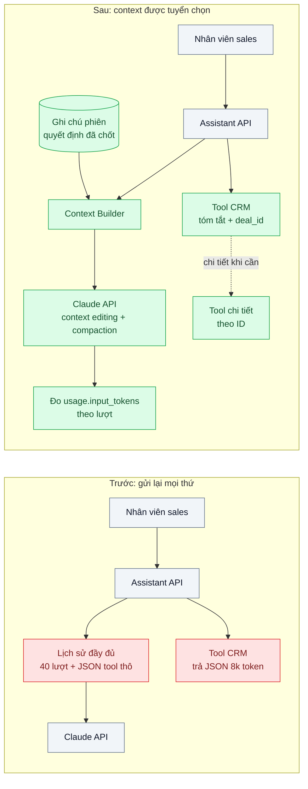
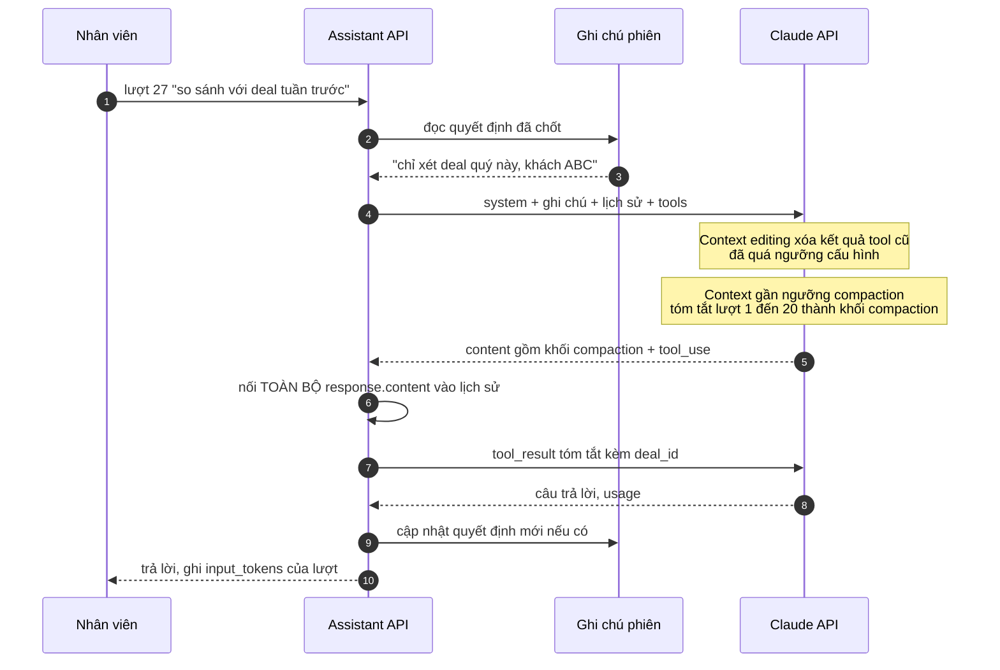

# Context Engineering (compaction, context editing, just-in-time retrieval) — Hội thoại dài 20 lượt tràn context, chất lượng tụt

| Scope | Mức độ | Trạng thái | Pattern gốc | Cập nhật |
|---|---|---|---|---|
| 20 · backend / AI framework system design | 🔴 Nâng cao | 📋 Kế hoạch | Context Engineering — Anthropic, "Effective context engineering for AI agents" (2025); Anthropic docs "Compaction", "Context editing" | 2026-10-06 |

> **Một câu tóm tắt:** Coi context window là ngân sách có hạn và chủ động quản lý nó — xóa kết quả tool cũ bằng context editing, tóm tắt lịch sử bằng compaction phía server, và chỉ nạp dữ liệu đúng lúc cần (just-in-time) qua tham chiếu — để phiên trợ lý dài 20–40 lượt vẫn giữ chất lượng và chi phí mỗi lượt không tăng tuyến tính.

## 1. Bài toán thực tế (What)

**Bối cảnh** *(doanh nghiệp giả định, số liệu minh họa)*
Một SaaS B2B bán CRM cho doanh nghiệp vừa có "trợ lý bán hàng" chạy trên NestJS: nhân viên sales hỏi về khách hàng, trợ lý gọi tool tra deal, lịch sử email, ticket hỗ trợ, ghi chú cuộc gọi. Mỗi kết quả tool là JSON 3.000–8.000 token. Một phiên làm việc trung bình 20–40 lượt, khoảng 6.000 phiên mỗi ngày. Model chính `claude-opus-5-5`; một số luồng phụ chạy `claude-haiku-4-5` với context window nhỏ hơn.

**Triệu chứng người kinh doanh nhìn thấy**
- Sau khoảng 20 lượt, trợ lý "quên" yêu cầu đầu phiên ("chỉ xét deal quý này"), trích nhầm số liệu của khách khác đã tra từ lượt 5.
- Luồng phụ chạy model nhỏ bắt đầu lỗi "vượt context" ở các phiên dài; nhân viên phải mở phiên mới và kể lại từ đầu.
- Chi phí mỗi phiên dài gấp 6–8 lần phiên ngắn; độ trễ lượt thứ 30 gấp ba lượt thứ 3.

**Nguyên nhân kỹ thuật**
Ứng dụng gửi lại *toàn bộ* lịch sử mỗi lượt, kể cả mọi kết quả tool đã dùng xong. Sau 20 lượt, phần lớn context là JSON thô đã lỗi thời; thông tin quan trọng (yêu cầu ban đầu, quyết định đã chốt) bị chôn giữa hàng trăm nghìn token. Tài liệu Anthropic gọi hiện tượng chất lượng giảm dần khi context phình to là *context rot*: context window lớn không có nghĩa mọi token đều được chú ý như nhau. Không có chỗ nào đo `usage.input_tokens` theo lượt nên không ai thấy đường cong tăng.

**Ràng buộc**
- Không được mất các quyết định nghiệp vụ đã chốt trong phiên (bộ lọc, khách đang xét, con số đã xác nhận).
- Phải tương thích với prompt caching hiện có (scope 22 bài 01): mọi chỉnh sửa lịch sử đều có thể làm mất cache tiền tố.
- Dữ liệu CRM có phân quyền: không được đưa dữ liệu ngoài quyền của nhân viên vào bản tóm tắt.

## 2. Vì sao dùng pattern này (Why)

**Nguyên nhân gốc mà pattern nhắm vào:** context được coi là "chỗ chứa mọi thứ" thay vì tài nguyên có hạn cần tuyển chọn; mỗi lượt thêm token mà không bao giờ bớt.

**Pattern giải quyết thế nào:** context engineering là tập kỹ thuật chọn *tập token nhỏ nhất có tín hiệu cao nhất* cho mỗi lượt gọi model. Bài này ghép ba kỹ thuật theo thứ tự rẻ → đắt:
1. **Just-in-time retrieval**: tool trả về bản tóm tắt ngắn kèm định danh (`deal_id`, `email_thread_id`) thay vì JSON đầy đủ; model gọi tool chi tiết khi thật sự cần. Context chỉ chứa *tham chiếu*, dữ liệu nằm ở hệ thống nguồn.
2. **Context editing**: tính năng phía API tự động xóa các kết quả tool cũ (và có thể cả khối thinking cũ) khỏi context trước khi model đọc, theo chiến lược cấu hình — dọn phần "đã dùng xong" mà không phải tự viết logic cắt.
3. **Compaction**: khi context tiến gần ngưỡng, API tự tóm tắt phần lịch sử cũ thành một khối compaction; ứng dụng phải nối lại *toàn bộ* `response.content` (không chỉ phần text) để lượt sau dùng khối đó thay cho lịch sử.
Bổ sung **ghi chú có cấu trúc** (structured note-taking): trợ lý ghi "các quyết định đã chốt" vào một bản ghi phiên trong PostgreSQL (hoặc memory tool) và nạp lại ở đầu mỗi lượt, nên dù lịch sử bị tóm tắt, yêu cầu cốt lõi vẫn còn nguyên văn.

**Lựa chọn khác đã cân nhắc**

| Lựa chọn | Giải quyết được gì | Vì sao không chọn (ở bài này) |
|---|---|---|
| Giữ nguyên + tối ưu nhỏ: cửa sổ trượt, chỉ giữ N lượt gần nhất | Đơn giản, chặn được lỗi vượt context | Cắt mất yêu cầu đầu phiên — chính là lỗi đang gặp; không phân biệt token quan trọng và token rác |
| Tự viết bước tóm tắt bằng model nhỏ (scope 22 bài 06) | Kiểm soát hoàn toàn prompt tóm tắt | Phải tự quản ngưỡng, định dạng, lỗi tóm tắt; compaction phía server làm sẵn và đồng bộ với API |
| Chỉ dựa vào context window lớn của model | Không phải sửa gì | Dời vấn đề chứ không giải: chi phí và độ trễ vẫn tăng tuyến tính, context rot vẫn xảy ra |
| Tách sub-agent cho tác vụ đọc nhiều (scope 11 bài 08) | Context của agent chính sạch | Hợp với tác vụ nghiên cứu nhiều nguồn; ở đây hội thoại tuần tự với một nhân viên, thêm agent là quá tay |

## 3. Thiết kế hệ thống (How)

### 3.1 Kiến trúc trước và sau



### 3.2 Luồng chính



### 3.3 Thành phần và trách nhiệm

| Thành phần | Trách nhiệm | Quyết định thiết kế đáng chú ý |
|---|---|---|
| Context Builder | Ghép system prompt, ghi chú phiên, lịch sử, danh sách tool theo thứ tự ổn định | Phần tĩnh đặt đầu để giữ cache tiền tố; ghi chú phiên đặt sau phần tĩnh |
| Tool CRM dạng "tóm tắt + ID" | Trả bản tóm tắt vài trăm token, kèm định danh để tra chi tiết | Theo nguyên tắc tool trả ngữ cảnh có ý nghĩa, tiết kiệm token (xem bài 09) |
| Cấu hình context editing | Xóa kết quả tool cũ trước khi model đọc | Bật theo beta trong docs; chọn ngưỡng sao cho không xóa kết quả của lượt hiện tại |
| Cấu hình compaction | Tóm tắt lịch sử khi gần ngưỡng | Luôn nối nguyên `response.content`; lưu lịch sử ở dạng block, không ở dạng chuỗi |
| Ghi chú phiên (PostgreSQL) | Lưu quyết định đã chốt, bộ lọc, đối tượng đang xét | Nguồn sự thật không bị tóm tắt làm méo; có thể thay bằng memory tool của Anthropic |

### 3.4 Điểm dễ sai khi triển khai
- **Chỉ lưu phần text của phản hồi.** Khối compaction bị mất, lượt sau gửi lại lịch sử cũ như chưa từng tóm tắt. Lưu và nối nguyên mảng `content`.
- **Không nghĩ tới prompt caching.** Mỗi lần context editing hay compaction thay đổi phần giữa lịch sử, cache sau điểm đó mất hiệu lực. Đo `cache_read_input_tokens` trước/sau và chọn ngưỡng để việc dọn dẹp xảy ra thưa.
- **Tin hoàn toàn vào bản tóm tắt.** Bản tóm tắt có thể bỏ sót con số đã chốt. Những gì không được phép sai phải nằm trong ghi chú phiên có cấu trúc.
- **Tool vẫn trả JSON đầy đủ.** Context editing dọn được kết quả cũ nhưng lượt hiện tại vẫn phình. Sửa từ nguồn: tool trả tóm tắt.
- **Dùng nhầm tên tính năng.** Context editing (xóa) và compaction (tóm tắt) là hai tính năng khác nhau, beta header khác nhau; lấy đúng cấu hình từ docs, không chép từ ký ức.

## 4. Tech stack và tác động (Impact techstack)

| Lớp | Công nghệ chọn | Vì sao chọn | Thay thế tương đương |
|---|---|---|---|
| Runtime / HTTP | TypeScript strict, Node 20+, NestJS | Trùng stack sản phẩm; interceptor gom đo lường một chỗ | Fastify |
| Gọi model | `@anthropic-ai/sdk`, `claude-opus-5-5`; luồng phụ `claude-haiku-4-5` | Compaction và context editing là tính năng phía API (beta), dùng qua `client.beta.messages`; model nào hỗ trợ từng tính năng phải tra docs — luồng model nhỏ có thể chỉ dùng được context editing hoặc tóm tắt tự viết | Gateway của bài 01 bọc lại |
| Đếm token | Token counting API của Anthropic | Đo trước kích thước context, không đoán bằng số ký tự | Đọc `usage` sau khi gọi |
| Ghi chú phiên | PostgreSQL 16 (bảng `session_notes`, JSONB) | Nguồn sự thật có cấu trúc, truy vấn được | Memory tool của Anthropic; Redis 7 với TTL |
| Eval | Vitest + bộ hội thoại dài dựng sẵn + judge `claude-sonnet-5-5` | Đo "còn nhớ yêu cầu đầu phiên" ở lượt 20, 30, 40 | Pipeline eval của bài 06 |

Giá tại thời điểm viết (kiểm tra lại trang Pricing): `claude-opus-5-5` $4/$20 mỗi triệu token vào/ra; `claude-sonnet-5-5` $2/$10; `claude-haiku-4-5` $1/$5.

**Thay đổi so với hệ thống hiện tại:** thêm Context Builder và bảng ghi chú phiên; sửa tool CRM sang dạng "tóm tắt + ID"; bật context editing và compaction qua beta; lưu lịch sử dạng block. Đội phát triển học đọc đường cong token theo lượt và cân bằng giữa dọn context với giữ cache.

## 5. Kết quả đầu ra và cách đo (Output impact)

| Chỉ số | Trước (minh họa) | Mục tiêu khi thực hành | Cách đo |
|---|---|---|---|
| `input_tokens` ở lượt 30 | ~250.000 | dưới 60.000 | Ghi `usage.input_tokens` theo số thứ tự lượt trên 20 hội thoại dài dựng sẵn |
| Tỷ lệ "còn nhớ yêu cầu đầu phiên" ở lượt 30 | ~55% | ≥ 95% | Judge `claude-sonnet-5-5` chấm theo rubric trên 50 kịch bản có câu hỏi kiểm tra trí nhớ |
| Chi phí trung bình mỗi phiên 40 lượt | 100 (chỉ số gốc) | ≤ 40 | Tổng `usage` × đơn giá, gồm cả `cache_read_input_tokens` |
| Lỗi vượt context ở luồng model nhỏ | 3% phiên dài | 0 | Đếm lỗi API theo loại trong log có cấu trúc |

> Số "trước" là minh họa để hình dung bài toán. Số "mục tiêu" chỉ được coi là đạt khi có số đo thật
> ở mục 8 kèm môi trường đo.

**Tác động nghiệp vụ mong đợi:** nhân viên sales làm việc cả buổi trong một phiên mà không phải kể lại; chi phí trợ lý không tăng theo độ dài phiên, giúp giữ giá gói dịch vụ.

## 6. Đánh đổi và khi KHÔNG nên dùng

**Đánh đổi**
- Compaction là tóm tắt có mất mát; chi tiết bị bỏ không lấy lại được trong phiên nếu không có ghi chú phiên.
- Dọn context làm mất cache tiền tố tại điểm thay đổi; tối ưu một phía có thể làm đắt phía kia.
- Tính năng ở dạng beta: cấu hình có thể đổi giữa các phiên bản, phải cô lập trong một module.

**Không nên dùng khi**
- Hội thoại ngắn (dưới khoảng 10 lượt) và tool trả kết quả nhỏ: chi phí phức tạp lớn hơn lợi ích.
- Yêu cầu kiểm toán đòi giữ nguyên văn mọi thứ model đã thấy: phải lưu lịch sử đầy đủ ở nơi khác trước khi dọn.

**Liên quan**
- [Context Pruning & Summarization (scope 22)](../../22-backend-ai-optimizer/06-context-pruning-lich-su-hoi-thoai-100-luot-gui-lai-moi-lan/) — góc nhìn chi phí của cùng vấn đề.
- [Prompt Caching (scope 22)](../../22-backend-ai-optimizer/01-prompt-caching-system-prompt-20k-token-tra-tien-moi-request/) — tương tác với việc dọn context.
- [Agent Memory (scope 11)](../../11-backend-ai-agent/07-agent-memory-khach-quay-lai-agent-quen-het/) — nhớ giữa các phiên.
- [Tool Design & Tool Search](../09-tool-design-for-agents-30-tool-agent-chon-sai/) — tool tiết kiệm token.

## 7. Cơ sở tham khảo

- Anthropic, "Effective context engineering for AI agents" (2025) — https://www.anthropic.com/engineering/effective-context-engineering-for-ai-agents — khái niệm context rot, just-in-time retrieval, compaction, structured note-taking, sub-agent.
- Anthropic docs, "Compaction" — https://platform.claude.com/docs/en/build-with-claude/compaction — tóm tắt phía server, yêu cầu nối lại khối compaction.
- Anthropic docs, "Context editing" — https://platform.claude.com/docs/en/build-with-claude/context-editing — chiến lược xóa kết quả tool và khối thinking cũ.
- Anthropic docs, "Context windows" và "Token counting" — https://platform.claude.com/docs/en/build-with-claude/context-windows — giới hạn theo model và cách đo kích thước context.
- Anthropic docs, "Memory tool" — https://platform.claude.com/docs/en/agents-and-tools/tool-use/memory-tool — lựa chọn thay thế cho bảng ghi chú phiên.
- Dex Horthy, *12-Factor Agents* (2025), factor 3 "Own your context window" — https://github.com/humanlayer/12-factor-agents — lý do ứng dụng phải tự quyết định nội dung context.

## 8. Kế hoạch thực hành

- [ ] Bước 1: dựng trợ lý NestJS tối giản + tool CRM giả lập trả JSON lớn; viết 20 hội thoại dài 40 lượt có "yêu cầu đầu phiên" và câu kiểm tra trí nhớ ở lượt 20, 30, 40.
- [ ] Bước 2: đo "trước": đường cong `input_tokens` theo lượt, điểm judge trí nhớ, chi phí mỗi phiên, lỗi vượt context ở luồng model nhỏ.
- [ ] Bước 3: áp dụng pattern theo thứ tự: tool "tóm tắt + ID" → ghi chú phiên → context editing → compaction; đo sau mỗi bước để thấy đóng góp riêng.
- [ ] Bước 4: đo "sau" với cùng bộ hội thoại; ghi số đo và cấu hình ngưỡng vào mục 5.
- [ ] Bước 5: test Vitest: (a) lịch sử lưu nguyên khối compaction, (b) ghi chú phiên luôn có trong request, (c) tool trả dưới N token, (d) thứ tự phần tĩnh không đổi giữa các lượt (giữ cache).

**Cấu trúc code dự kiến**
```text
src/
  assistant/
    context-builder.ts       # ghép system, ghi chú phiên, lịch sử, tools theo thứ tự ổn định
    conversation-store.ts    # lưu lịch sử dạng block, giữ khối compaction
    session-notes.ts         # đọc/ghi quyết định đã chốt (PostgreSQL)
    assistant.service.ts     # gọi client.beta.messages với context editing + compaction
  tools/
    deal-summary.tool.ts     # trả tóm tắt + deal_id
test/
  context-builder.test.ts
  conversation-store.test.ts
eval/
  long-conversations/        # 20 kịch bản 40 lượt
  memory-judge.ts
docker-compose.yml           # PostgreSQL 16
```

**Cách chạy** *(điền khi bắt đầu code)*
```bash
docker compose up -d
pnpm install && pnpm test
```
