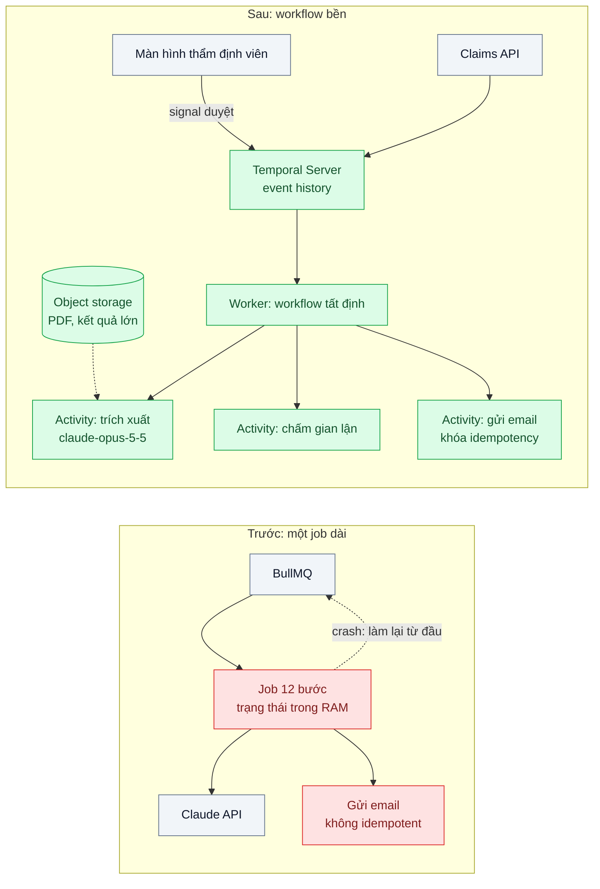
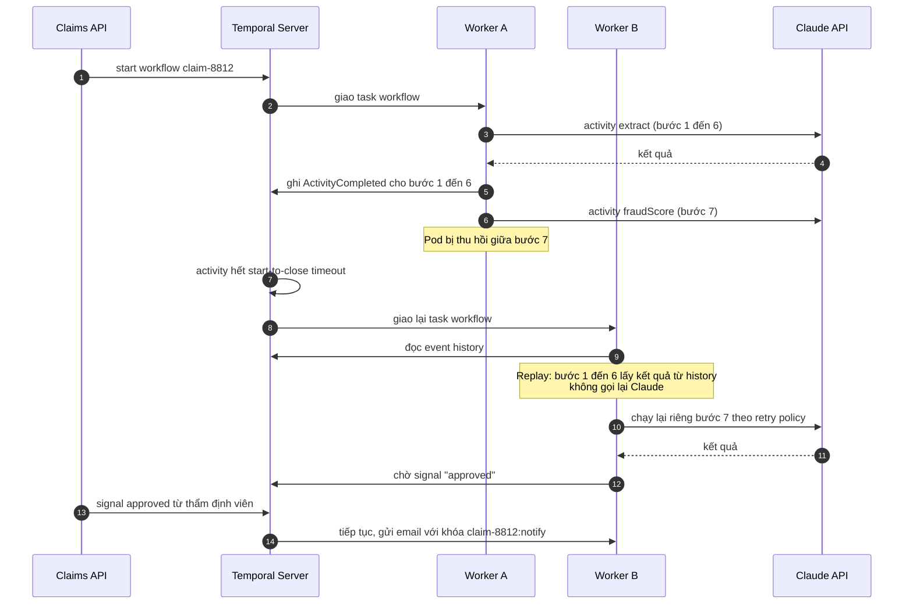

# Durable Execution for Long AI Workflows — Workflow AI chạy 10 phút, crash giữa chừng là làm lại từ đầu, tốn tiền gấp đôi

| Scope | Mức độ | Trạng thái | Pattern gốc | Cập nhật |
|---|---|---|---|---|
| 20 · backend / AI framework system design | 🔴 Nâng cao | 📋 Kế hoạch | Durable Execution — Temporal docs; Scheduler Agent Supervisor — Azure Architecture Center; 12-Factor Agents factor 6 (2025) | 2026-10-06 |

> **Một câu tóm tắt:** Viết pipeline AI nhiều bước thành workflow có trạng thái bền — mỗi lời gọi LLM, ghi DB hay gửi email là một activity được ghi kết quả vào lịch sử sự kiện — để khi worker crash, workflow chạy tiếp từ bước dở dang thay vì gọi lại model từ đầu và gửi email cho khách lần thứ hai.

## 1. Bài toán thực tế (What)

**Bối cảnh** *(doanh nghiệp giả định, số liệu minh họa)*
Một công ty bảo hiểm phi nhân thọ tự động hóa thẩm định hồ sơ bồi thường xe: đọc PDF giám định 40 trang, trích xuất thông tin bằng structured output, đối chiếu điều khoản hợp đồng, chấm rủi ro gian lận, soạn tờ trình và gửi email thông báo cho khách. Pipeline gồm khoảng 12 lời gọi `claude-opus-5-5`, chạy trung bình 10 phút, 3.000 hồ sơ mỗi ngày, hiện nằm trong một job BullMQ duy nhất.

**Triệu chứng người kinh doanh nhìn thấy**
- Mỗi lần deploy hoặc pod bị thu hồi, các hồ sơ đang chạy bị làm lại từ đầu: hóa đơn API tháng có ngày cao gấp đôi bình thường.
- Khách nhận hai email "hồ sơ đã được tiếp nhận" vì bước gửi email chạy lại sau crash.
- Hồ sơ cần thẩm định viên duyệt ở giữa pipeline phải "treo" job hàng giờ; job hết hạn là mất kết quả các bước trước.

**Nguyên nhân kỹ thuật**
Trạng thái pipeline chỉ nằm trong bộ nhớ của một tiến trình. Job queue biết "job chưa xong" nên giao lại, nhưng không biết "bước 7 trên 12 đã xong với kết quả này", nên mọi lời gọi LLM tốn tiền phải chạy lại. Các side effect (email, cập nhật hệ thống lõi) không có khóa idempotency. Bước chờ người duyệt được làm bằng vòng lặp polling trong job, giữ worker và không sống qua restart.

**Ràng buộc**
- Kết quả LLM không tất định: chạy lại cùng bước có thể ra kết quả khác, nên *không được* chạy lại bước đã chốt.
- Hồ sơ phải kiểm toán được: biết bước nào chạy lúc nào, với input/output gì, ai duyệt.
- PDF và kết quả trung gian có thể lớn; không nhét vào message hay lịch sử workflow.

## 2. Vì sao dùng pattern này (Why)

**Nguyên nhân gốc mà pattern nhắm vào:** trạng thái tiến độ của một quy trình dài không được lưu bền, nên mọi sự cố hạ tầng đều biến thành "làm lại từ đầu".

**Pattern giải quyết thế nào:** durable execution tách quy trình thành **workflow** (mã điều phối, phải tất định) và **activity** (mọi việc có side effect hoặc không tất định: gọi LLM, đọc PDF, ghi DB, gửi email). Engine (Temporal) ghi mỗi lần activity bắt đầu và hoàn thành kèm kết quả vào *event history* bền. Khi worker chết, một worker khác *replay* mã workflow: các activity đã có kết quả trong history được trả lại ngay mà không chạy lại, workflow tiếp tục ở bước dở dang. Activity có retry policy riêng (retry 429/529, không retry lỗi 400), timeout và heartbeat cho bước dài. Bước chờ người duyệt là một **signal**: workflow ngủ không tốn worker, thức dậy khi thẩm định viên bấm duyệt — đúng ý "launch/pause/resume" của 12-Factor Agents. Side effect dùng khóa idempotency `claimId + stepName` để an toàn khi activity buộc phải retry.

**Lựa chọn khác đã cân nhắc**

| Lựa chọn | Giải quyết được gì | Vì sao không chọn (ở bài này) |
|---|---|---|
| Giữ nguyên + tối ưu nhỏ: tự ghi kết quả từng bước vào bảng `claim_steps` trong PostgreSQL | Không thêm hạ tầng; resume được nếu code cẩn thận | Tự viết lại retry, timeout, chờ signal, versioning — chính là tự xây một engine kém hơn |
| BullMQ flows (job cha/con) | Đơn giản, đã có Redis; mỗi bước một job | Không có replay; chờ người duyệt hàng giờ và versioning khó; hợp khi pipeline ngắn |
| Airflow DAG | Lịch chạy batch, giao diện quan sát tốt | Thiết kế cho DAG theo lịch, không cho hàng nghìn workflow theo sự kiện có signal |
| Durable execution với Temporal *(chọn)* | Resume, retry, timer, signal, lịch sử kiểm toán | Thêm một cụm hạ tầng và kỷ luật viết workflow tất định |

## 3. Thiết kế hệ thống (How)

### 3.1 Kiến trúc trước và sau



### 3.2 Luồng chính



### 3.3 Thành phần và trách nhiệm

| Thành phần | Trách nhiệm | Quyết định thiết kế đáng chú ý |
|---|---|---|
| `claimReviewWorkflow` | Điều phối thứ tự bước, rẽ nhánh theo điểm rủi ro, chờ signal duyệt | Không gọi mạng, không `Date.now()`, không random trực tiếp; dùng API của SDK workflow |
| Activity gọi LLM | Mỗi lời gọi model là một activity, trả kết quả đã parse (structured output) | Retry 429/529/5xx với backoff; lỗi 400 đánh dấu non-retryable; `maxRetries: 0` ở SDK Anthropic để không retry hai tầng |
| Activity side effect | Gửi email, cập nhật hệ thống lõi | Khóa idempotency theo `claimId + stepName`; bên nhận kiểm tra trùng |
| Object storage | Giữ PDF và kết quả lớn; activity chỉ truyền đường dẫn | Claim Check — giữ event history nhỏ |
| Signal / query | Nhận quyết định duyệt; trả tiến độ cho giao diện | Thay vòng lặp polling bằng chờ signal có timer hết hạn |
| Worker versioning | Đổi mã workflow khi còn workflow cũ đang chạy | Dùng cơ chế versioning/patching theo docs Temporal |

### 3.4 Điểm dễ sai khi triển khai
- **Gọi LLM ngay trong mã workflow.** Lúc replay, lời gọi chạy lại và cho kết quả khác — phá tính tất định. Mọi I/O phải nằm trong activity.
- **Nhét PDF hay prompt 50k token vào input activity.** Event history phình, có giới hạn kích thước payload. Lưu ra object storage, truyền tham chiếu.
- **Activity không idempotent.** Activity vẫn có thể chạy hơn một lần (crash sau khi gửi email, trước khi báo hoàn thành). Khóa idempotency là bắt buộc với side effect.
- **Retry vô hạn lỗi 400.** Prompt sai tham số sẽ retry mãi và tốn tiền. Phân loại lỗi bằng typed error của SDK.
- **Sửa thứ tự bước khi workflow cũ còn chạy.** Replay lệch lịch sử gây lỗi non-determinism. Dùng versioning, test replay với history thật.

## 4. Tech stack và tác động (Impact techstack)

| Lớp | Công nghệ chọn | Vì sao chọn | Thay thế tương đương |
|---|---|---|---|
| Runtime | TypeScript strict, Node 20+ | Temporal có TypeScript SDK chính thức | Go/Java SDK của Temporal |
| Durable execution | Temporal (`@temporalio/workflow`, `@temporalio/activity`, `@temporalio/worker`, `@temporalio/client`) | Event history, replay, retry policy, timer, signal, versioning | BullMQ flows (đơn giản hơn, không replay); AWS Step Functions |
| HTTP | NestJS | Claims API khởi chạy workflow và gửi signal | Fastify |
| Gọi model | `@anthropic-ai/sdk`, `claude-opus-5-5`; `output_config.format` cho bước trích xuất | Kết quả có cấu trúc để lưu trong history gọn | Gateway bài 01 |
| Lưu trữ | PostgreSQL 16 (dữ liệu nghiệp vụ), MinIO (PDF, kết quả lớn) | Claim Check cho payload lớn | AWS S3 |
| Hạ tầng local | Docker Compose (Temporal dev server + UI) | Một lệnh dựng môi trường, có giao diện xem history | Temporal CLI dev server |
| Test | Vitest + môi trường test của Temporal (time-skipping) | Test replay và crash có kiểm soát | Jest |

Giá tại thời điểm viết (kiểm tra lại trang Pricing): `claude-opus-5-5` $4/$20 mỗi triệu token vào/ra; `claude-sonnet-5-5` $2/$10; `claude-haiku-4-5` $1/$5.

**Thay đổi so với hệ thống hiện tại:** thêm cụm Temporal (server, DB của nó, UI); viết lại job thành workflow + activity; thêm object storage và khóa idempotency cho side effect. Đội phát triển phải học quy tắc tất định và versioning; đội vận hành học đọc event history khi điều tra hồ sơ.

## 5. Kết quả đầu ra và cách đo (Output impact)

| Chỉ số | Trước (minh họa) | Mục tiêu khi thực hành | Cách đo |
|---|---|---|---|
| Lời gọi LLM lặp lại cho bước đã xong sau crash | toàn bộ 12 bước | 0 | Counter theo `claimId + stepName` trong activity; kịch bản `kill -9` worker ở bước 7 |
| Token tốn thêm do crash | ~100% một hồ sơ | chỉ bước đang dở | Tổng `usage` của hồ sơ có crash so với hồ sơ không crash |
| Email trùng gửi cho khách | có | 0 | Đếm bản ghi gửi theo khóa idempotency trong máy chủ mail giả lập |
| Thời gian hoàn thành hồ sơ khi có crash | 10 phút + làm lại | ≤ 10 phút + thời gian phát hiện | Lịch sử workflow trên Temporal UI / truy vấn visibility |
| Worker bị giữ khi chờ người duyệt | 1 worker mỗi hồ sơ | 0 | Số slot activity đang bận trong lúc 100 workflow chờ signal |

> Số "trước" là minh họa để hình dung bài toán. Số "mục tiêu" chỉ được coi là đạt khi có số đo thật
> ở mục 8 kèm môi trường đo.

**Tác động nghiệp vụ mong đợi:** deploy giữa giờ không còn làm đội chi phí; khách không nhận email trùng; mỗi hồ sơ có lịch sử bước để kiểm toán và giải trình.

## 6. Đánh đổi và khi KHÔNG nên dùng

**Đánh đổi**
- Thêm một hệ thống phân tán phải vận hành (hoặc trả tiền dịch vụ managed).
- Kỷ luật viết workflow tất định và versioning là chi phí học thật; lỗi non-determinism khó gỡ với người mới.

**Không nên dùng khi**
- Pipeline ngắn (dưới một phút), ít bước, chạy lại rẻ: retry cả job trong queue là đủ.
- Tác vụ hàng loạt không gấp và không cần signal: Message Batches (scope 22 bài 02) với bảng trạng thái đơn giản hơn.

**Liên quan**
- [Workflow Patterns](../04-workflow-patterns-chaining-routing-parallelization/) — cấu trúc các bước bên trong workflow.
- [Resilience for LLM Calls](../05-fallback-retry-circuit-breaker-cho-llm-api-429-529/) — chính sách retry cho activity gọi LLM.
- [Idempotent Consumer (scope 14)](../../14-backend-queueing/04-idempotent-consumer-event-den-hai-lan-tru-kho-hai-lan/) và [Claim Check (scope 14)](../../14-backend-queueing/08-claim-check-message-50mb-lam-nghen-broker/).
- [Human-in-the-loop Approval (scope 11)](../../11-backend-ai-agent/04-human-in-the-loop-agent-tu-gui-email-hoan-tien-cho-khach/) — signal duyệt.
- [Embedding Ingestion Pipeline (scope 21)](../../21-backend-ai-infrastructure/05-embedding-pipeline-nhap-10-trieu-tai-lieu-idempotent/) — cùng kỹ thuật cho pipeline dữ liệu.

## 7. Cơ sở tham khảo

- Temporal docs — https://docs.temporal.io/ — workflow, activity, event history và replay, retry policy, timeout/heartbeat, signal, ràng buộc tất định, versioning.
- Microsoft Azure Architecture Center, "Scheduler Agent Supervisor" — https://learn.microsoft.com/azure/architecture/patterns/scheduler-agent-supervisor — điều phối bước, giám sát và khôi phục quy trình dài.
- Dex Horthy, *12-Factor Agents* (2025), factor 5 "Unify execution state and business state" và factor 6 "Launch/Pause/Resume" — https://github.com/humanlayer/12-factor-agents — vì sao agent/workflow AI cần tạm dừng và chạy tiếp được.
- Hohpe & Woolf, *Enterprise Integration Patterns* (2003), "Idempotent Receiver", "Claim Check" — an toàn khi activity chạy lại; payload lớn ngoài message.
- Anthropic docs, "Errors" — https://platform.claude.com/docs/en/api/errors — phân loại lỗi retry được và không retry được cho activity.
- BullMQ docs, "Flows" — https://docs.bullmq.io/ — phương án đơn giản hơn để so sánh.

## 8. Kế hoạch thực hành

- [ ] Bước 1: dựng Docker Compose (Temporal dev server + UI, PostgreSQL, MinIO, máy chủ mail giả lập); viết bản "trước" là một job BullMQ 12 bước với Claude API giả lập có độ trễ.
- [ ] Bước 2: đo "trước": `kill -9` worker ở bước 7 trên 20 hồ sơ, đếm lời gọi LLM lặp lại, token tốn thêm, email trùng.
- [ ] Bước 3: áp dụng pattern: workflow tất định, activity cho mọi I/O, retry policy phân loại lỗi, Claim Check qua MinIO, khóa idempotency, signal duyệt.
- [ ] Bước 4: đo "sau" cùng kịch bản crash; ghi vào mục 5 kèm phiên bản Temporal và cấu hình timeout.
- [ ] Bước 5: test Vitest: (a) replay history không gọi lại activity đã xong, (b) email chỉ gửi một lần khi activity retry, (c) lỗi 400 không retry, (d) workflow chờ signal không giữ worker, (e) test replay với history đã lưu sau khi đổi code.

**Cấu trúc code dự kiến**
```text
src/
  workflows/claim-review.workflow.ts   # điều phối tất định, chờ signal duyệt
  activities/
    extract-claim.activity.ts          # gọi claude-opus-5-5 + structured output
    fraud-score.activity.ts
    notify-customer.activity.ts        # khóa idempotency
  api/claims.controller.ts             # start workflow, gửi signal
test/
  claim-review.replay.test.ts
docker-compose.yml                     # temporal, temporal-ui, postgres, minio, mailpit
```

**Cách chạy** *(điền khi bắt đầu code)*
```bash
docker compose up -d
pnpm install && pnpm test
```
