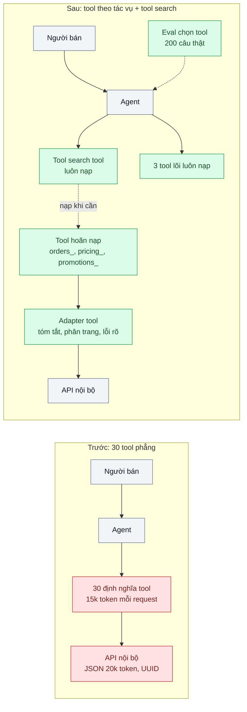
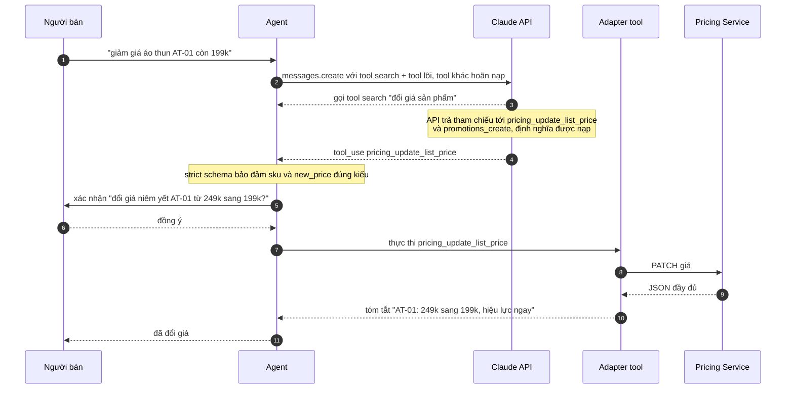

# Tool Design & Tool Search — 30 tool trong một agent, agent chọn sai tool 15% số lần

| Scope | Mức độ | Trạng thái | Pattern gốc | Cập nhật |
|---|---|---|---|---|
| 20 · backend / AI framework system design | 🔴 Nâng cao | 📋 Kế hoạch | Agent-Computer Interface — Anthropic, "Building effective agents" (2024); "Writing effective tools for agents — with agents" (2025); Anthropic docs "Tool search tool" | 2026-10-06 |

> **Một câu tóm tắt:** Thiết kế tool như thiết kế giao diện cho một người dùng mới — gộp theo tác vụ, đặt tên có namespace, mô tả rõ ràng, trả kết quả gọn và có ý nghĩa, schema `strict` — rồi dùng tool search để model chỉ nạp những tool cần thiết, và đo tỷ lệ chọn đúng tool bằng eval thay vì cảm giác.

## 1. Bài toán thực tế (What)

**Bối cảnh** *(doanh nghiệp giả định, số liệu minh họa)*
Một sàn thương mại điện tử có "trợ lý người bán" trong seller center: người bán hỏi bằng ngôn ngữ tự nhiên, agent dùng `claude-opus-5-5` gọi tool để tra đơn, tồn kho, phí vận chuyển, tạo khuyến mãi, đổi giá, xem đánh giá... Sau một năm mỗi team thêm tool của mình, agent có 30 tool; phần định nghĩa tool khoảng 15.000 token đi kèm mọi request.

**Triệu chứng người kinh doanh nhìn thấy**
- Khoảng 15% yêu cầu agent chọn sai tool: người bán bảo "giảm giá áo thun còn 199k" thì agent tạo *chương trình khuyến mãi* thay vì *đổi giá niêm yết*.
- Một câu hỏi đơn giản ("đơn nào chưa giao quá 3 ngày?") cần 6–8 lần gọi tool, người bán chờ 30 giây.
- Chi phí mỗi lượt cao dù câu hỏi ngắn, vì định nghĩa tool chiếm phần lớn token đầu vào.

**Nguyên nhân kỹ thuật**
Tool được viết như API nội bộ chứ không phải cho model đọc: `get_order`, `get_order_detail`, `search_orders`, `order_lookup_v2` gần trùng nhau; mô tả một dòng; tham số `id: string` không nói là mã đơn hay mã sản phẩm; kết quả trả nguyên JSON 20.000 token với UUID khó hiểu. Không có bộ eval cho việc chọn tool nên mỗi lần thêm tool không ai biết agent có kém đi không.

**Ràng buộc**
- Tool thay đổi dữ liệu thật (đổi giá, tạo khuyến mãi) phải có xác nhận và không được gọi với tham số sai kiểu.
- Không thể bắt mọi team viết lại backend; thay đổi nằm ở lớp tool của agent.
- Định nghĩa tool là một phần tiền tố được cache (scope 22 bài 01); thay đổi tool ảnh hưởng tới cache.

## 2. Vì sao dùng pattern này (Why)

**Nguyên nhân gốc mà pattern nhắm vào:** giao diện giữa agent và hệ thống (agent-computer interface) được thiết kế cẩu thả; model nhận quá nhiều lựa chọn mơ hồ và kết quả khó đọc.

**Pattern giải quyết thế nào:** theo hai bài viết của Anthropic, đầu tư vào tool quan trọng ngang đầu tư vào prompt:
1. **Chọn đúng tool cần có**: gộp chuỗi thao tác thường đi cùng nhau thành một tool theo tác vụ (ví dụ `orders_find_delayed` thay cho list + filter + detail); bỏ tool trùng.
2. **Namespace**: tiền tố theo miền (`orders_`, `pricing_`, `promotions_`) giúp model phân biệt "đổi giá" và "khuyến mãi".
3. **Trả ngữ cảnh có ý nghĩa, tiết kiệm token**: tên thay cho UUID, phân trang, lọc, cho chính tool một tham số `response_format` (ngắn / chi tiết) như bài viết gợi ý; lỗi trả thông điệp hướng dẫn sửa.
4. **Mô tả như viết cho đồng nghiệp mới**: nói rõ khi nào dùng, khi nào không, ví dụ input; tham số đặt tên rõ (`order_code` thay cho `id`).
5. **`strict: true`** trên định nghĩa tool để input luôn khớp schema.
6. **Tool search tool**: đánh dấu phần lớn tool là hoãn nạp (`defer_loading`), model gọi tool tìm kiếm để nạp đúng vài tool liên quan, nên không phải gửi đủ 30 định nghĩa mỗi lần.
7. **Eval chọn tool**: bộ câu hỏi thật kèm tool kỳ vọng; dùng chính agent để phân tích transcript lỗi và đề xuất sửa mô tả (tinh thần "with agents").

**Lựa chọn khác đã cân nhắc**

| Lựa chọn | Giải quyết được gì | Vì sao không chọn (ở bài này) |
|---|---|---|
| Giữ nguyên + tối ưu nhỏ: viết lại mô tả tool | Rẻ, cải thiện được phần nào | Không giải được tool trùng lặp, kết quả 20k token và chi phí định nghĩa tool |
| Router chia thành nhiều agent chuyên biệt (bài 04, scope 11 bài 08) | Mỗi agent ít tool hơn | Câu hỏi của người bán thường chạm nhiều miền; router sai thì cả lượt sai; thêm độ trễ |
| Tự viết tool retrieval: embedding mô tả tool, chọn top-k trước khi gọi model | Giảm số tool gửi đi | Tự vận hành index và ngưỡng; tool search của API làm việc này trong vòng lặp của model |

## 3. Thiết kế hệ thống (How)

### 3.1 Kiến trúc trước và sau



### 3.2 Luồng chính



### 3.3 Thành phần và trách nhiệm

| Thành phần | Trách nhiệm | Quyết định thiết kế đáng chú ý |
|---|---|---|
| Danh mục tool (registry) | Khai báo tool theo namespace, mô tả, schema, cờ hoãn nạp | Một nguồn sự thật; sinh định nghĩa theo thứ tự ổn định để giữ cache |
| Tool lõi luôn nạp | 2–3 tool dùng ở hầu hết lượt | Không đánh dấu hoãn nạp toàn bộ — API yêu cầu ít nhất một tool không hoãn |
| Tool search tool | Cho model tìm và nạp tool theo nhu cầu | Chọn biến thể tìm kiếm theo docs; mô tả tool phải chứa từ khóa người dùng hay nói |
| Adapter tool | Chuyển JSON nội bộ thành kết quả gọn, có tên, phân trang; lỗi có hướng dẫn | Nơi áp dụng nguyên tắc tiết kiệm token, không sửa backend |
| Cổng xác nhận | Hỏi lại trước tool thay đổi dữ liệu | Liên kết với human-in-the-loop (scope 11 bài 04) |
| Eval chọn tool | 200 câu thật kèm tool kỳ vọng, chạy trong CI | Đo cả tỷ lệ chọn đúng lẫn số lần gọi tool trung bình |

### 3.4 Điểm dễ sai khi triển khai
- **Gộp tool quá tay.** Một tool "làm mọi thứ về đơn hàng" với 15 tham số tùy chọn cũng khó chọn đúng như 5 tool trùng. Gộp theo tác vụ người dùng, không theo bảng dữ liệu.
- **Mô tả tool thiếu từ người dùng hay dùng.** Tool search tìm theo nội dung định nghĩa; mô tả toàn thuật ngữ nội bộ thì không bao giờ được nạp.
- **Trả lỗi kiểu `500 Internal Error`.** Model không biết sửa thế nào và thử lại mù quáng. Trả "thiếu `order_code`, định dạng ví dụ DH123456".
- **Đổi định nghĩa tool liên tục.** Mỗi thay đổi làm mất cache tiền tố; gom thay đổi theo đợt phát hành.
- **Đo bằng vài câu thử tay.** Không có eval thì không biết thêm tool thứ 31 làm hỏng gì; chạy eval chọn tool trong CI (bài 06).

## 4. Tech stack và tác động (Impact techstack)

| Lớp | Công nghệ chọn | Vì sao chọn | Thay thế tương đương |
|---|---|---|---|
| Runtime / HTTP | TypeScript strict, Node 20+, NestJS | Trùng stack seller center | Fastify |
| Gọi model | `@anthropic-ai/sdk`, `claude-opus-5-5`; tool use với `strict: true`; tool search tool | Định nghĩa tool chuẩn, schema được bảo đảm, nạp tool theo nhu cầu | Gateway bài 01 bọc lại |
| Schema | JSON Schema sinh từ Zod (`zod-to-json-schema`, cần xác minh) | Một nguồn cho type TypeScript và schema tool | Viết JSON Schema tay |
| Eval | Vitest + bộ 200 câu + chấm tự động theo tên tool kỳ vọng | Chỉ số khách quan, chạy được trong CI | Pipeline eval của bài 06; Langfuse Datasets |

Giá tại thời điểm viết (kiểm tra lại trang Pricing): `claude-opus-5-5` $4/$20 mỗi triệu token vào/ra; `claude-sonnet-5-5` $2/$10; `claude-haiku-4-5` $1/$5.

**Thay đổi so với hệ thống hiện tại:** thêm registry tool và lớp adapter; gộp/đổi tên tool; bật `strict` và tool search; thêm eval chọn tool vào CI. Các team sở hữu backend không phải đổi API, nhưng phải viết mô tả tool theo hướng dẫn chung và thêm câu eval khi thêm tool.

## 5. Kết quả đầu ra và cách đo (Output impact)

| Chỉ số | Trước (minh họa) | Mục tiêu khi thực hành | Cách đo |
|---|---|---|---|
| Tỷ lệ chọn đúng tool | 85% | ≥ 97% | Eval 200 câu thật đã che dữ liệu, so tên tool được gọi với tool kỳ vọng |
| Số lần gọi tool trung bình mỗi tác vụ | 6,5 | ≤ 3 | Đếm `tool_use` trong transcript eval |
| Token định nghĩa tool mỗi request | ~15.000 | dưới 4.000 | Token counting API với và không có tool search; `usage.input_tokens` |
| Token trung bình mỗi kết quả tool | ~20.000 | dưới 1.500 | Đếm token của `tool_result` trong transcript |
| Input tool sai schema | ~2% | 0 | Validate input bằng Zod trước khi thực thi, đếm lỗi |

> Số "trước" là minh họa để hình dung bài toán. Số "mục tiêu" chỉ được coi là đạt khi có số đo thật
> ở mục 8 kèm môi trường đo.

**Tác động nghiệp vụ mong đợi:** người bán bớt gặp thao tác sai nguy hiểm (đổi giá nhầm thành khuyến mãi), câu trả lời nhanh hơn, chi phí mỗi lượt giảm nhờ ít token định nghĩa và kết quả tool.

## 6. Đánh đổi và khi KHÔNG nên dùng

**Đánh đổi**
- Tool search thêm một vòng suy luận khi tool cần thiết chưa được nạp; với tool hay dùng, độ trễ có thể tăng.
- Lớp adapter là code thêm phải bảo trì song song với API nội bộ.

**Không nên dùng khi**
- Agent dưới khoảng 10 tool rõ ràng: thiết kế tool tốt là đủ, tool search là thừa.
- Tác vụ là workflow cố định (bài 04): code gọi đúng hàm theo thứ tự, không cần model chọn tool.

**Liên quan**
- [Tool Use / Function Calling (scope 11)](../../11-backend-ai-agent/02-tool-use-agent-tra-cuu-don-hang-trong-db-noi-bo/) — nền tảng vòng lặp tool use.
- [MCP (scope 11)](../../11-backend-ai-agent/06-mcp-ket-noi-agent-voi-crm-erp-theo-chuan/) — chia sẻ tool giữa các agent.
- [Structured Output](../03-structured-output-parse-json-tu-text-fail-5-phan-tram/) và [Eval Pipeline](../06-llm-as-judge-eval-pipeline-trong-ci-sua-prompt-khong-biet-tot-hon-hay-te-hon/).
- [Context Engineering](../07-context-engineering-context-window-tran-sau-20-luot/) — kết quả tool gọn giữ context sạch.

## 7. Cơ sở tham khảo

- Anthropic, "Writing effective tools for agents — with agents" (2025) — https://www.anthropic.com/engineering/writing-tools-for-agents — chọn tool, namespace, trả ngữ cảnh có ý nghĩa, tiết kiệm token, mô tả tool, dùng agent để đánh giá tool.
- Anthropic, "Building effective agents" (2024) — https://www.anthropic.com/engineering/building-effective-agents — khái niệm agent-computer interface và phụ lục về prompt engineering cho tool.
- Anthropic docs, "Tool search tool" — https://platform.claude.com/docs/en/agents-and-tools/tool-use/tool-search-tool — nạp tool theo nhu cầu, hoãn nạp, ràng buộc phải có tool không hoãn.
- Anthropic docs, "Tool use" — https://platform.claude.com/docs/en/agents-and-tools/tool-use/overview — định nghĩa tool, `strict`, `tool_result` với `is_error`.
- JSON Schema — https://json-schema.org/ — schema cho input tool.

## 8. Kế hoạch thực hành

- [ ] Bước 1: dựng agent NestJS với 30 tool "nguyên trạng" (trùng lặp, mô tả một dòng, JSON lớn) trên dữ liệu seed; soạn 200 câu thật kèm tool kỳ vọng.
- [ ] Bước 2: đo "trước": tỷ lệ chọn đúng, số lần gọi tool, token định nghĩa và kết quả tool.
- [ ] Bước 3: áp dụng pattern từng bước: gộp/đổi tên theo namespace → viết lại mô tả và tham số → adapter tóm tắt → `strict: true` → tool search với 3 tool lõi; dùng `claude-sonnet-5-5` phân tích các ca sai.
- [ ] Bước 4: đo "sau" sau mỗi bước để thấy đóng góp riêng; ghi số đo vào mục 5.
- [ ] Bước 5: test Vitest: (a) registry sinh định nghĩa theo thứ tự ổn định, (b) luôn có ít nhất một tool không hoãn nạp, (c) adapter trả dưới N token, (d) tool thay đổi dữ liệu luôn qua cổng xác nhận.

**Cấu trúc code dự kiến**
```text
src/
  tools/
    registry.ts                    # khai báo tool, namespace, cờ hoãn nạp, thứ tự ổn định
    orders/find-delayed.tool.ts
    pricing/update-list-price.tool.ts
    adapters/summarize.ts          # tóm tắt, phân trang, lỗi có hướng dẫn
  agent/seller-agent.service.ts    # vòng lặp tool use + tool search
test/
  registry.test.ts
  adapters.test.ts
eval/tool-selection/               # 200 câu + tool kỳ vọng, runner
docker-compose.yml                 # PostgreSQL 16 + seed
```

**Cách chạy** *(điền khi bắt đầu code)*
```bash
docker compose up -d
pnpm install && pnpm test
```
