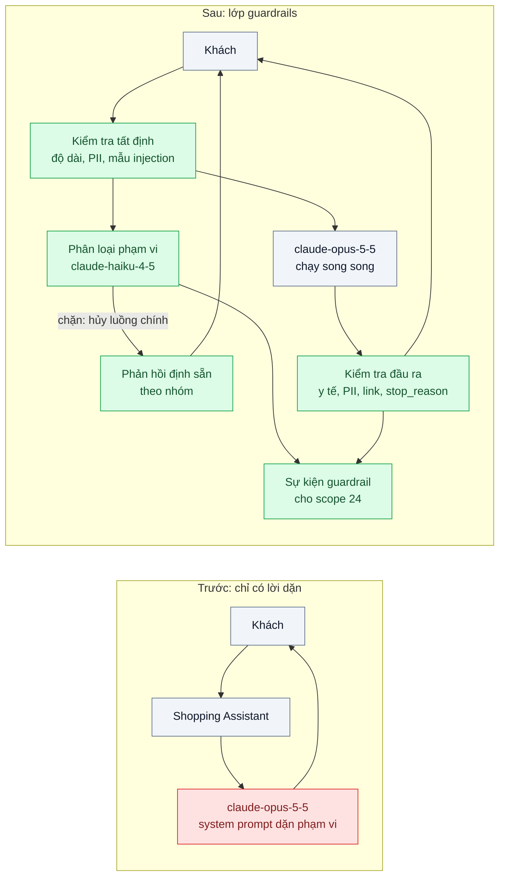
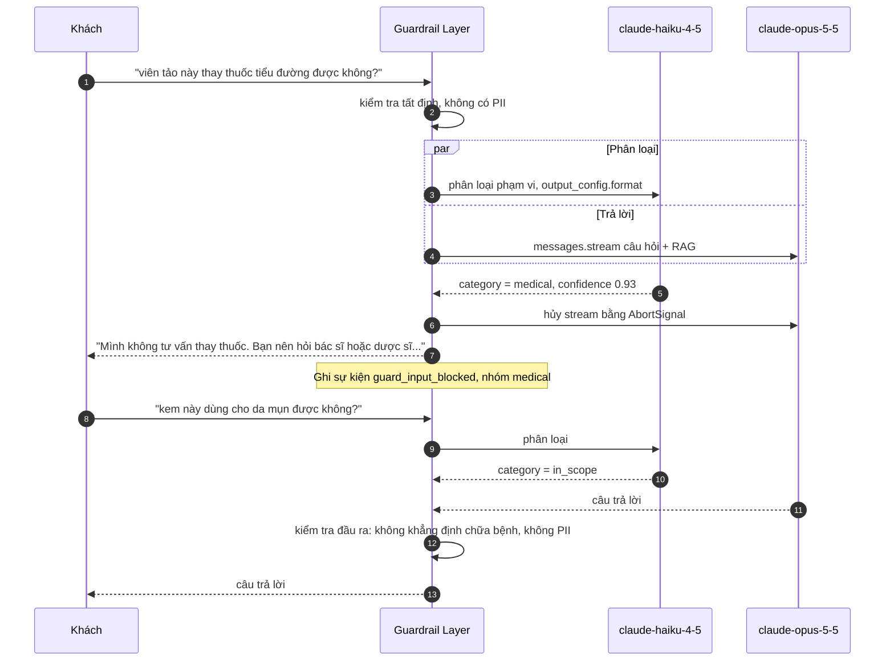

# Guardrails Layer (input / output validation) — Model trả lời câu hỏi ngoài phạm vi: tư vấn y tế trong app bán hàng

| Scope | Mức độ | Trạng thái | Pattern gốc | Cập nhật |
|---|---|---|---|---|
| 20 · backend / AI framework system design | 🟡 Trung bình | 📋 Kế hoạch | Guardrails — Eugene Yan, "Patterns for Building LLM-based Systems & Products" (2023); OWASP Top 10 for LLM Applications (2025) | 2026-10-06 |

> **Một câu tóm tắt:** Đặt một lớp kiểm soát riêng quanh lời gọi model — chặn/điều hướng đầu vào ngoài phạm vi hoặc có dấu hiệu injection, kiểm tra đầu ra trước khi tới khách (khẳng định y tế, PII, link lạ, `stop_reason`) — và đo lớp đó bằng eval như đo mọi tính năng khác, thay vì chỉ dặn model "đừng làm" trong system prompt.

## 1. Bài toán thực tế (What)

**Bối cảnh** *(doanh nghiệp giả định, số liệu minh họa)*
Một sàn thương mại điện tử chuyên mỹ phẩm và thực phẩm bổ sung có "trợ lý mua sắm" dùng `claude-opus-5-5` với RAG trên mô tả sản phẩm. Khoảng 25.000 lượt hỏi mỗi ngày. System prompt có câu "chỉ trả lời về sản phẩm của sàn"; ngoài ra không có kiểm soát nào khác.

**Triệu chứng người kinh doanh nhìn thấy**
- Khách hỏi "uống viên tảo này thay thuốc tiểu đường được không?", trợ lý trả lời như tư vấn y khoa; pháp chế cảnh báo rủi ro quảng cáo sai công dụng.
- Có người dùng trợ lý để viết bài luận, so sánh với sàn đối thủ, hoặc chèn "bỏ qua hướng dẫn trước đó" để moi system prompt.
- Một lần trợ lý đọc nhầm số điện thoại của khách khác nằm trong đánh giá sản phẩm và lặp lại trong câu trả lời.

**Nguyên nhân kỹ thuật**
Mọi chính sách phạm vi nằm trong một đoạn system prompt — là "lời dặn" chứ không phải kiểm soát; không có bước nào kiểm tra đầu vào trước khi tới model hay kiểm tra đầu ra trước khi tới khách. Không có bộ test cho câu ngoài phạm vi nên không ai biết tỷ lệ lọt là bao nhiêu, và mỗi lần sửa prompt có thể làm hỏng điều đã chặn được.

**Ràng buộc**
- Không được chặn nhầm câu hợp lệ quá nhiều: "kem này có dùng được cho da mụn không?" là câu bán hàng chính đáng.
- Độ trễ thêm phải nhỏ; trợ lý đang stream câu trả lời.
- Câu trả lời khi bị chặn phải lịch sự, gợi ý hướng đi (hỏi dược sĩ, liên hệ CSKH), không lộ lý do kỹ thuật.

## 2. Vì sao dùng pattern này (Why)

**Nguyên nhân gốc mà pattern nhắm vào:** chính sách an toàn và phạm vi được giao hoàn toàn cho chính model đang trả lời, không có lớp kiểm tra độc lập và không có số đo.

**Pattern giải quyết thế nào:** guardrails tách thành các lớp quanh lời gọi chính:
1. **Kiểm tra đầu vào tất định**: độ dài, ngôn ngữ, regex PII, danh sách mẫu injection đã biết — rẻ, chạy trước.
2. **Phân loại phạm vi bằng model nhỏ**: `claude-haiku-4-5` với structured output (`output_config.format`) trả `{category: in_scope | medical | legal | competitor | injection | off_topic, confidence}`. Theo "Building effective agents", guardrail có thể chạy **song song** với lời gọi chính (sectioning): bộ phân loại và model chính chạy cùng lúc; nếu bộ phân loại chặn thì hủy luồng chính trước khi gửi token đầu ra.
3. **Kiểm tra đầu ra**: không có khẳng định chữa bệnh, không có PII, link chỉ thuộc tên miền cho phép, đúng schema; xử lý `stop_reason` — `refusal` (đọc `stop_details` để biết nhóm) và `max_tokens` — thành phản hồi thân thiện.
4. **Phản hồi định sẵn** cho từng nhóm bị chặn và ghi sự kiện để đo (scope 24 bài 06).
5. **Eval cho guardrail** (bài 06): bộ câu trong phạm vi và ngoài phạm vi; đo cả chặn nhầm (false positive) và lọt (false negative) mỗi lần đổi prompt hay ngưỡng.

**Lựa chọn khác đã cân nhắc**

| Lựa chọn | Giải quyết được gì | Vì sao không chọn (ở bài này) |
|---|---|---|
| Giữ nguyên + tối ưu nhỏ: viết system prompt chặt hơn | Rẻ, có tác dụng phần nào | Vẫn là lời dặn cho chính model; không có điểm chặn độc lập, không đo được |
| NeMo Guardrails (framework Python, Colang) | Bộ rail dựng sẵn, luồng hội thoại khai báo | Thêm runtime Python vào stack TypeScript; ở bài này bộ phân loại + kiểm tra đầu ra là đủ |
| Chỉ kiểm tra đầu ra | Một điểm chặn | Đã tốn tiền gọi model chính cho câu không nên trả lời; injection vẫn tác động tới tool |

## 3. Thiết kế hệ thống (How)

### 3.1 Kiến trúc trước và sau



### 3.2 Luồng chính



### 3.3 Thành phần và trách nhiệm

| Thành phần | Trách nhiệm | Quyết định thiết kế đáng chú ý |
|---|---|---|
| Kiểm tra tất định | Độ dài, regex PII, mẫu injection đã biết | Chạy đầu tiên vì rẻ; không chặn chỉ vì một từ khóa, chỉ gắn cờ cho bộ phân loại |
| Bộ phân loại phạm vi | Gán nhóm và độ tin cậy bằng model nhỏ | Schema cố định qua structured output; ngưỡng theo nhóm (y tế chặt hơn đối thủ) |
| Điều phối song song | Chạy phân loại cùng lúc với model chính, hủy khi bị chặn | Giữ độ trễ gần bằng không cho câu hợp lệ; chỉ gửi token cho khách sau khi phân loại xong |
| Kiểm tra đầu ra | Khẳng định y tế, PII, tên miền link, schema, `stop_reason` | Với streaming: đệm theo câu và kiểm tra trước khi gửi, hoặc kiểm tra sau và thu hồi |
| Phản hồi định sẵn | Câu trả lời lịch sự theo nhóm | Không lộ lý do kỹ thuật, không lộ system prompt |
| Bộ eval guardrail | Câu trong/ngoài phạm vi, ca injection | Chạy trong CI cùng bài 06; theo dõi cả chặn nhầm lẫn lọt |

### 3.4 Điểm dễ sai khi triển khai
- **Chỉ đo tỷ lệ chặn.** Guardrail chặn mọi thứ cũng có tỷ lệ chặn cao. Luôn đo chặn nhầm trên câu hợp lệ.
- **Stream token cho khách trước khi phân loại xong.** Câu trả lời y tế đã hiện trên màn hình rồi mới bị chặn. Giữ token đầu tiên cho tới khi bộ phân loại trả kết quả.
- **Bộ phân loại dùng chung prompt với model chính.** Injection đánh lừa được cả hai. Bộ phân loại có prompt riêng, ngắn, chỉ phân loại, nội dung khách đặt trong khối dữ liệu rõ ràng.
- **Bỏ qua `stop_reason`.** `refusal` hay `max_tokens` mà vẫn hiển thị `content` như bình thường gây câu trả lời cụt hoặc rỗng.

## 4. Tech stack và tác động (Impact techstack)

| Lớp | Công nghệ chọn | Vì sao chọn | Thay thế tương đương |
|---|---|---|---|
| Runtime / HTTP | TypeScript strict, Node 20+, NestJS | Guardrail đặt thành interceptor/service dùng chung | Fastify |
| Model chính | `@anthropic-ai/sdk`, `claude-opus-5-5`, streaming | Xử lý `stop_reason` và `stop_details` từ phản hồi | Gateway bài 01 |
| Bộ phân loại | `claude-haiku-4-5` + `output_config.format` | Rẻ, nhanh, đầu ra có cấu trúc chắc chắn | `claude-sonnet-5-5` cho nhóm khó; NeMo Guardrails |
| Kiểm tra tất định | Regex + danh sách mẫu, Zod cho schema đầu ra | Không tốn token, dễ test | Thư viện phát hiện PII chuyên dụng |
| Eval | Vitest + bộ câu có nhãn + pipeline bài 06 | Đo chặn nhầm/lọt mỗi lần đổi | Langfuse Datasets |

Giá tại thời điểm viết (kiểm tra lại trang Pricing): `claude-opus-5-5` $4/$20 mỗi triệu token vào/ra; `claude-sonnet-5-5` $2/$10; `claude-haiku-4-5` $1/$5.

**Thay đổi so với hệ thống hiện tại:** thêm Guardrail Layer bọc lời gọi model, một lời gọi `claude-haiku-4-5` mỗi lượt, bộ phản hồi định sẵn và bộ eval. Pháp chế và CSKH tham gia định nghĩa nhóm "ngoài phạm vi" và duyệt câu phản hồi.

## 5. Kết quả đầu ra và cách đo (Output impact)

| Chỉ số | Trước (minh họa) | Mục tiêu khi thực hành | Cách đo |
|---|---|---|---|
| Tỷ lệ lọt câu y tế/pháp lý | ~40% | dưới 2% | Eval 300 câu ngoài phạm vi có nhãn; judge `claude-sonnet-5-5` kiểm tra câu trả lời có tư vấn y tế không |
| Tỷ lệ chặn nhầm câu hợp lệ | không đo | dưới 1% | Eval 500 câu bán hàng thật đã che dữ liệu |
| Tỷ lệ injection thành công | không đo | 0 trên bộ ca đã biết | Bộ ca injection chạy trong CI, kiểm tra không lộ system prompt |
| Độ trễ thêm tới token đầu tiên p95 | — | ≤ 300 ms | Script streaming đo TTFT có và không có guardrail |
| Chi phí guardrail mỗi 1.000 lượt | — | ghi nhận | Tổng `usage` của lời gọi phân loại × đơn giá |

> Số "trước" là minh họa để hình dung bài toán. Số "mục tiêu" chỉ được coi là đạt khi có số đo thật
> ở mục 8 kèm môi trường đo.

**Tác động nghiệp vụ mong đợi:** giảm rủi ro pháp lý từ quảng cáo sai công dụng và lộ dữ liệu khách; trợ lý vẫn trả lời tự nhiên với câu bán hàng hợp lệ.

## 6. Đánh đổi và khi KHÔNG nên dùng

**Đánh đổi**
- Thêm một lời gọi model mỗi lượt (chi phí, độ trễ) và một điểm lỗi mới: bộ phân loại lỗi thì chặn hết hay cho qua hết phải được quyết định trước.
- Guardrail không bao giờ đạt 0% lọt; nó giảm rủi ro chứ không thay quy trình pháp chế.

**Không nên dùng khi**
- Công cụ nội bộ cho nhân viên đã được đào tạo, dữ liệu không nhạy cảm: kiểm tra đầu ra tối thiểu là đủ.
- Tác vụ đầu vào có cấu trúc chặt (form, JSON đã validate) không nhận văn bản tự do từ người ngoài.

**Liên quan**
- [Prompt Injection Defense (scope 11)](../../11-backend-ai-agent/05-prompt-injection-khach-nhap-bo-qua-huong-dan-giam-gia-100/) — phòng thủ chuyên sâu cho agent có tool.
- [Safety & Guardrail Metrics (scope 24)](../../24-backend-ai-monitoring/06-guardrail-metrics-injection-attempts-refusal-rate/) — đo lớp này trong production.
- [Eval Pipeline & LLM-as-Judge](../06-llm-as-judge-eval-pipeline-trong-ci-sua-prompt-khong-biet-tot-hon-hay-te-hon/) và [Structured Output](../03-structured-output-parse-json-tu-text-fail-5-phan-tram/).

## 7. Cơ sở tham khảo

- OWASP, *Top 10 for LLM Applications* (2025) — https://genai.owasp.org/ — LLM01 Prompt Injection, LLM02 Sensitive Information Disclosure, LLM06 Excessive Agency: các rủi ro lớp guardrail phải che.
- Eugene Yan, "Patterns for Building LLM-based Systems & Products" (2023) — https://eugeneyan.com/writing/llm-patterns/ — mục Guardrails: kiểm tra đầu vào/đầu ra, phân loại, vì sao phải đo.
- Anthropic, "Building effective agents" (2024) — https://www.anthropic.com/engineering/building-effective-agents — parallelization (sectioning) với một model trả lời và một model sàng lọc.
- Anthropic docs, "Structured outputs" — https://platform.claude.com/docs/en/build-with-claude/structured-outputs — `output_config.format` cho bộ phân loại.
- Anthropic docs về `stop_reason` `refusal` và `stop_details` — https://platform.claude.com/docs/en/build-with-claude/refusals-and-fallback — xử lý phản hồi bị từ chối.
- NeMo Guardrails docs — https://docs.nvidia.com/nemo/guardrails/ — framework thay thế để so sánh.

## 8. Kế hoạch thực hành

- [ ] Bước 1: dựng trợ lý NestJS có RAG trên dữ liệu sản phẩm giả lập (có đánh giá chứa số điện thoại giả); soạn bộ eval 500 câu hợp lệ + 300 câu ngoài phạm vi + 50 ca injection.
- [ ] Bước 2: đo "trước": tỷ lệ lọt, tỷ lệ injection thành công, TTFT nền.
- [ ] Bước 3: áp dụng pattern: kiểm tra tất định → bộ phân loại `claude-haiku-4-5` chạy song song → kiểm tra đầu ra → phản hồi định sẵn → sự kiện guardrail.
- [ ] Bước 4: đo "sau" trên cùng bộ eval; điều chỉnh ngưỡng theo nhóm; ghi số đo vào mục 5.
- [ ] Bước 5: test Vitest: (a) không token nào tới khách trước khi phân loại xong, (b) `refusal` được chuyển thành phản hồi định sẵn, (c) PII trong đầu ra bị chặn, (d) bộ phân loại lỗi thì áp chính sách mặc định đã chọn.

**Cấu trúc code dự kiến**
```text
src/
  guardrails/
    deterministic-checks.ts    # độ dài, regex PII, mẫu injection
    scope-classifier.ts        # claude-haiku-4-5 + output_config.format
    output-checks.ts           # y tế, PII, tên miền link, stop_reason
    guarded-chat.service.ts    # điều phối song song, hủy bằng AbortSignal
test/
  guarded-chat.test.ts
eval/guardrails/               # câu hợp lệ, ngoài phạm vi, injection
docker-compose.yml             # PostgreSQL 16 + pgvector cho RAG
```

**Cách chạy** *(điền khi bắt đầu code)*
```bash
docker compose up -d
pnpm install && pnpm test
```
