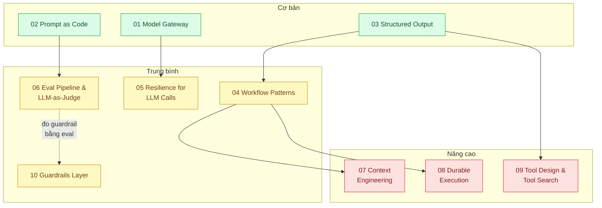

# 20 · Thiết kế hệ thống AI framework, cơ bản → nâng cao (`backend / AI framework system design`)

> **Phạm vi:** Lớp nền để xây ứng dụng LLM trong sản phẩm, theo ba bậc. **Cơ bản:** gọi model có
> kiểm soát (gateway, prompt as code, structured output). **Trung bình:** workflow pattern, chịu lỗi,
> eval trong CI, guardrails. **Nâng cao:** context engineering, durable execution, thiết kế tool.
> RAG thuộc scope 10, agent thuộc scope 11, tối ưu chi phí thuộc scope 22, hạ tầng GPU thuộc scope 21.
>
> **Câu hỏi trung tâm:** Xây lớp nền cho ứng dụng LLM: từ gọi model có kiểm soát tới workflow bền,
> có eval, có guardrail?

## Bản đồ pattern trong scope

## Danh sách bài toán

| # | Bài toán (pattern — triệu chứng) | Mức | Pattern gốc / nguồn | Trạng thái |
|---|---|---|---|---|
| 01 | [Model Gateway / Provider Abstraction — Đổi model hoặc nhà cung cấp phải sửa 30 file](./01-llm-gateway-abstraction-doi-model-phai-sua-30-file/) | 🟢 | Fowler, *PoEAA* "Gateway"; LiteLLM docs; Anthropic SDK TypeScript docs | 📋 |
| 02 | [Prompt as Code (template, version, test) — Prompt nằm rải rác trong string literal, sửa không biết hỏng gì](./02-prompt-as-code-prompt-nam-rai-trong-string-khong-version/) | 🟢 | Eugene Yan, "Patterns for Building LLM-based Systems" (2023); 12-Factor Agents (factor 2); Anthropic docs "Prompt engineering" | 📋 |
| 03 | [Structured Output (JSON schema / strict tools) — Parse JSON từ text trả về fail 5% request](./03-structured-output-parse-json-tu-text-fail-5-phan-tram/) | 🟢 | Anthropic docs "Structured outputs" (`output_config.format`), "Tool use" (`strict`); JSON Schema | 📋 |
| 04 | [Workflow Patterns (chaining, routing, parallelization, evaluator-optimizer) — Pipeline xử lý hồ sơ bảo hiểm 6 bước, bước nào cũng có thể sai](./04-workflow-patterns-chaining-routing-parallelization/) | 🟡 | Anthropic, "Building effective agents" (2024); Khattab et al., "DSPy" (2023) — hướng compile pipeline | 📋 |
| 05 | [Resilience for LLM Calls (retry, fallback model, circuit breaker) — API trả 429/529 lúc cao điểm, tính năng chết](./05-fallback-retry-circuit-breaker-cho-llm-api-429-529/) | 🟡 | Anthropic docs "Errors", "Rate limits"; Nygard, *Release It!*; Amazon Builders' Library (retries, jitter) | 📋 |
| 06 | [Eval Pipeline & LLM-as-Judge in CI — Sửa prompt không biết tốt hơn hay tệ hơn](./06-llm-as-judge-eval-pipeline-trong-ci-sua-prompt-khong-biet-tot-hon-hay-te-hon/) | 🟡 | Zheng et al., "Judging LLM-as-a-Judge with MT-Bench and Chatbot Arena" (2023); Hamel Husain, "Your AI Product Needs Evals" (2024) | 📋 |
| 07 | [Context Engineering (compaction, context editing, just-in-time retrieval) — Hội thoại dài 20 lượt tràn context, chất lượng tụt](./07-context-engineering-context-window-tran-sau-20-luot/) | 🔴 | Anthropic, "Effective context engineering for AI agents" (2025); Anthropic docs "Compaction", "Context editing", "Context windows" | 📋 |
| 08 | [Durable Execution for Long AI Workflows — Workflow AI chạy 10 phút, crash giữa chừng là làm lại từ đầu, tốn tiền gấp đôi](./08-durable-execution-workflow-ai-chay-10-phut-crash-giua-chung/) | 🔴 | Temporal docs (durable execution); Azure "Scheduler Agent Supervisor"; 12-Factor Agents (factor 6: launch/pause/resume) | 📋 |
| 09 | [Tool Design & Tool Search — 30 tool trong một agent, agent chọn sai tool 15% số lần](./09-tool-design-for-agents-30-tool-agent-chon-sai/) | 🔴 | Anthropic, "Writing effective tools for agents — with agents" (2025); Anthropic docs "Tool search tool"; "Building effective agents" (agent-computer interface) | 📋 |
| 10 | [Guardrails Layer (input / output validation) — Model trả lời câu hỏi ngoài phạm vi: tư vấn y tế trong app bán hàng](./10-guardrails-layer-input-output-validation-model-tra-loi-ngoai-pham-vi/) | 🟡 | OWASP Top 10 for LLM Applications (2025); Eugene Yan, LLM patterns (Guardrails); Anthropic docs (system prompt); NeMo Guardrails docs | 📋 |

## Lộ trình đề xuất trong scope

1. **Gateway → Prompt as code → Structured output** — ba viên gạch; mọi scope AI khác xây trên đó.
2. **Workflow patterns** — hầu hết sản phẩm cần workflow, không cần agent (xem scope 11 bài 01).
3. **Resilience → Eval in CI → Guardrails** — ba bài biến prototype thành sản phẩm.
4. **Context engineering → Durable execution → Tool design** — nâng cao, phục vụ agent dài hơi.

## Kiến thức nền cần có trước

- Anthropic SDK TypeScript: `messages.create`, streaming, tools; đọc tài liệu chính thức để lấy đúng
  tham số (ví dụ `thinking: {type: "adaptive"}`, `output_config.format`), không dựa vào ký ức.
- Khái niệm token, context window, prompt caching (scope 22 bài 01).
- Circuit breaker, retry/jitter (scope 07 bài 03–04).

## Liên kết với scope khác

- `10`, `11` — RAG và agent dùng gateway/structured output/eval từ đây.
- `22-backend-ai-optimizer` — prompt caching, routing, effort tuning.
- `24-backend-ai-monitoring` — tracing và eval online nối tiếp eval CI (bài 06).
- `14-backend-queueing` / `08` bài 02 — durable execution có thể bắt đầu từ job queue.

## Nguồn tổng quan cho scope

- Anthropic, "Building effective agents" (2024).
- Chip Huyen, *AI Engineering* (2025).
- Eugene Yan, "Patterns for Building LLM-based Systems & Products" (2023).
