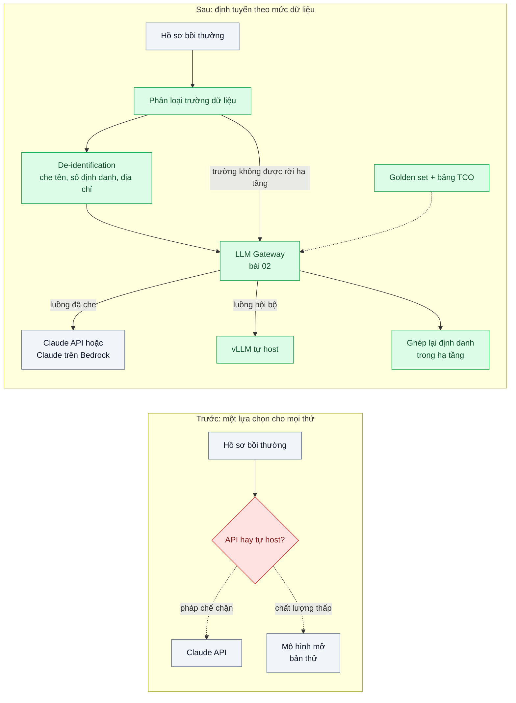
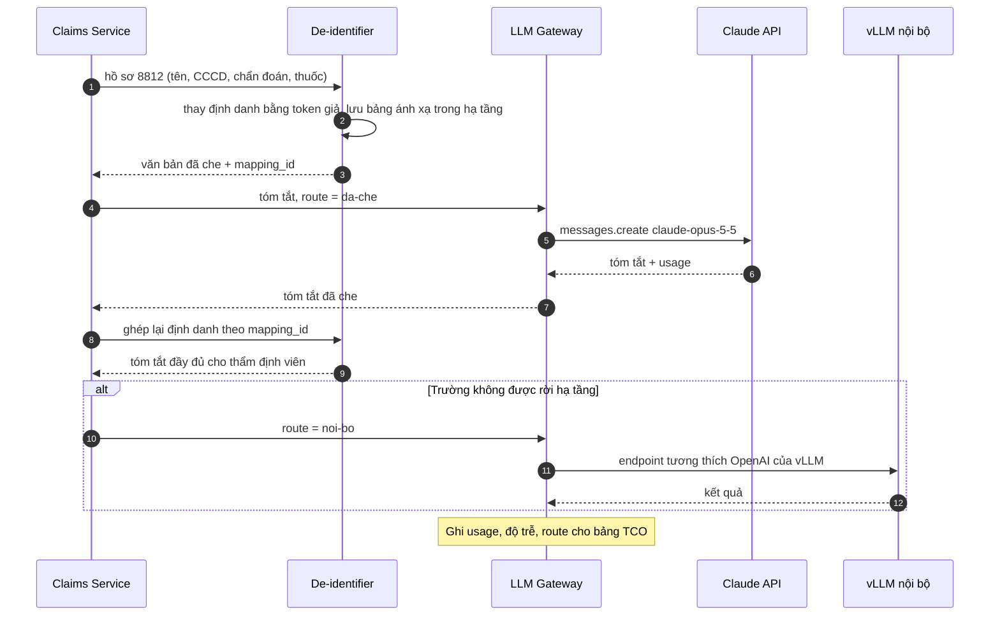

# API vs Self-hosting LLM — Dữ liệu nhạy cảm: gọi API hay tự host mô hình mở? Bài toán chi phí và tuân thủ

| Scope | Mức độ | Trạng thái | Pattern gốc | Cập nhật |
|---|---|---|---|---|
| 21 · backend / AI infrastructure | 🟢 Cơ bản | 📋 Kế hoạch | Model selection: build vs buy — Chip Huyen, *AI Engineering* (2025); Anthropic docs "Pricing"; vLLM docs | 2026-10-06 |

> **Một câu tóm tắt:** Thay cuộc tranh luận "API hay tự host" bằng một quy trình quyết định có số — phân loại dữ liệu theo luồng, đo chất lượng trên golden set của chính bài toán, tính tổng chi phí sở hữu (TCO) và điểm hòa vốn — rồi chọn theo từng luồng, thường là lai: che dữ liệu nhạy cảm trước khi gọi API, chỉ tự host phần thật sự không được rời hạ tầng.

## 1. Bài toán thực tế (What)

**Bối cảnh** *(doanh nghiệp giả định, số liệu minh họa)*
Một công ty bảo hiểm sức khỏe muốn dùng LLM tóm tắt hồ sơ bồi thường nội trú (giấy ra viện, đơn thuốc, hóa đơn) để thẩm định viên đọc nhanh hơn: khoảng 4.000 hồ sơ mỗi ngày, mỗi hồ sơ 15.000–30.000 token. Pháp chế lo dữ liệu sức khỏe rời hạ tầng; một nhóm kỹ sư đề xuất thuê GPU tự host mô hình mở cỡ lớn; giám đốc tài chính hỏi "tổng cộng tốn bao nhiêu mỗi tháng" và chưa ai trả lời được.

**Triệu chứng người kinh doanh nhìn thấy**
- Dự án dừng ba tháng vì tranh luận, không có số liệu để chốt.
- Bản thử tự host chạy được nhưng thẩm định viên chê tóm tắt bỏ sót chẩn đoán phụ; bản thử gọi API thì bị pháp chế chặn.
- Báo giá GPU, báo giá token, chi phí nhân sự vận hành nằm ở ba bảng tính khác nhau, không so được.

**Nguyên nhân kỹ thuật**
Quyết định được đặt ở mức "toàn công ty chọn một phía" thay vì theo từng luồng dữ liệu. Không có golden set chung để so chất lượng; không ai tính chi phí tự host gồm GPU nhàn rỗi, nhân sự trực, nâng cấp model; không ai liệt kê cụ thể trường dữ liệu nào là nhạy cảm và có thể che (de-identification) trước khi gửi đi hay không.

**Ràng buộc**
- Dữ liệu sức khỏe phải tuân thủ quy định bảo vệ dữ liệu cá nhân hiện hành và hợp đồng với khách hàng; pháp chế là người duyệt cuối.
- Chất lượng tóm tắt phải đạt ngưỡng do thẩm định viên đặt (không bỏ sót chẩn đoán, thuốc, số tiền).
- Đội hạ tầng có 2 người, chưa từng vận hành GPU.

## 2. Vì sao dùng pattern này (Why)

**Nguyên nhân gốc mà pattern nhắm vào:** quyết định hạ tầng AI được đưa ra bằng cảm tính, gộp mọi luồng dữ liệu vào một lựa chọn duy nhất.

**Pattern giải quyết thế nào:** quy trình bốn bước cho mỗi luồng:
1. **Phân loại dữ liệu**: liệt kê trường theo mức (công khai / nội bộ / định danh cá nhân / sức khỏe); xác định trường nào che được mà tóm tắt vẫn dùng được.
2. **Đo chất lượng trên golden set**: 200 hồ sơ đã che, chạy qua `claude-opus-5-5`, `claude-sonnet-5-5` và mô hình mở tự host (vLLM); judge + thẩm định viên chấm theo cùng rubric.
3. **Tính TCO và điểm hòa vốn**: API = token vào × đơn giá + token ra × đơn giá (đọc từ `usage`); tự host = số GPU × đơn giá GPU-giờ × 730 giờ / tháng + nhân sự vận hành + chi phí cơ hội, chia cho số hồ sơ thực tế xử lý được ở mức sử dụng GPU đo được. Điểm hòa vốn là khối lượng mà hai đường chi phí cắt nhau.
4. **Chọn theo luồng, thường là lai**: luồng che được → API (trực tiếp hoặc qua Claude trên Amazon Bedrock / Vertex AI ở vùng và hợp đồng phù hợp); luồng không được rời hạ tầng → mô hình tự host; mọi luồng đi qua một gateway (bài 02) để đổi quyết định không phải sửa ứng dụng.

**Lựa chọn khác đã cân nhắc**

| Lựa chọn | Giải quyết được gì | Vì sao không chọn (ở bài này) |
|---|---|---|
| Giữ nguyên + tối ưu nhỏ: tiếp tục thẩm định thủ công, dùng mẫu tóm tắt | Không rủi ro dữ liệu mới | Không giải được tắc nghẽn 4.000 hồ sơ/ngày |
| 100% API, gửi nguyên dữ liệu | Chất lượng cao nhất, vận hành ít | Pháp chế không duyệt nếu chưa có thỏa thuận và biện pháp che dữ liệu |
| 100% tự host | Dữ liệu không rời hạ tầng | Chất lượng đo được thấp hơn ngưỡng; đội 2 người phải trực GPU; chi phí cố định cả khi không dùng |
| Quy trình quyết định theo luồng, kết quả lai *(chọn)* | Mỗi luồng có lựa chọn hợp lý với số liệu | Tốn công dựng golden set và bộ che dữ liệu; hai đường vận hành |

## 3. Thiết kế hệ thống (How)

### 3.1 Kiến trúc trước và sau



### 3.2 Luồng chính



### 3.3 Thành phần và trách nhiệm

| Thành phần | Trách nhiệm | Quyết định thiết kế đáng chú ý |
|---|---|---|
| Danh mục phân loại dữ liệu | Liệt kê trường và mức nhạy cảm, quy tắc che | Pháp chế duyệt; là đầu vào cho cả kỹ thuật lẫn hợp đồng |
| De-identifier | Che định danh trước khi gửi ra ngoài, ghép lại sau | Bảng ánh xạ chỉ nằm trong hạ tầng; token giả giữ được ngữ cảnh ("BỆNH_NHÂN_1") |
| Golden set | 200 hồ sơ đã che, rubric chấm do thẩm định viên viết | Dùng chung để so mọi model; nạp vào eval scope 20 bài 06 |
| Bảng TCO | Công thức API vs tự host, điểm hòa vốn, độ nhạy theo khối lượng | Đơn giá lấy từ trang Pricing và báo giá GPU thực tế tại thời điểm tính |
| LLM Gateway | Định tuyến theo route, ghi usage | Đổi quyết định chỉ là đổi cấu hình route |
| vLLM tự host | Phục vụ luồng nội bộ | Chỉ dựng khi bước 3 cho thấy cần; chi tiết ở bài 03 |

### 3.4 Điểm dễ sai khi triển khai
- **So chất lượng bằng vài ví dụ đẹp.** Phải cùng golden set, cùng rubric, có người chấm mù (không biết model nào).
- **Tính chi phí tự host theo GPU chạy 100% công suất.** Thực tế GPU nhàn rỗi ban đêm và cuối tuần; tính theo mức sử dụng đo được (`nvidia-smi`) và cộng nhân sự trực.
- **Quên chi phí token đầu ra.** Tóm tắt dài làm token ra chiếm phần đáng kể; dùng `usage.output_tokens` thật, không ước lượng.
- **Che dữ liệu làm hỏng nghĩa.** Che cả tên thuốc hay mã bệnh khiến tóm tắt vô dụng; đo chất lượng *sau khi che*.

## 4. Tech stack và tác động (Impact techstack)

| Lớp | Công nghệ chọn | Vì sao chọn | Thay thế tương đương |
|---|---|---|---|
| Gọi API | `@anthropic-ai/sdk`, `claude-opus-5-5`; so sánh thêm `claude-sonnet-5-5` | Trường `usage` cho số liệu chi phí chính xác | Claude trên Amazon Bedrock (`@anthropic-ai/bedrock-sdk`) hoặc Vertex AI khi cần vùng/hợp đồng đám mây |
| Tự host | vLLM, endpoint tương thích OpenAI | Throughput cao, chuẩn giao diện; xem bài 03 | Hugging Face TGI |
| Gateway | LiteLLM Proxy | Một giao diện cho cả Claude và vLLM, ghi usage theo route | Gateway mức code (scope 20 bài 01) |
| Che dữ liệu | Microsoft Presidio (nhận diện PII) + quy tắc riêng cho mẫu giấy tờ | Có sẵn bộ nhận diện, mở rộng được | Regex + từ điển tự viết |
| Eval | Vitest + judge `claude-sonnet-5-5` + chấm người trên mẫu | Cùng rubric cho mọi model | Pipeline eval scope 20 bài 06 |

Giá tại thời điểm viết (kiểm tra lại trang Pricing): `claude-opus-5-5` $4/$20 mỗi triệu token vào/ra; `claude-sonnet-5-5` $2/$10; `claude-haiku-4-5` $1/$5. Đơn giá GPU không ghi ở đây: lấy báo giá thực tế của nhà cung cấp tại thời điểm tính.

**Thay đổi so với hệ thống hiện tại:** thêm danh mục phân loại dữ liệu, bộ che dữ liệu, golden set và bảng TCO; gateway trở thành điểm định tuyến. Pháp chế, tài chính và kỹ thuật cùng làm việc trên một bộ số.

## 5. Kết quả đầu ra và cách đo (Output impact)

| Chỉ số | Trước (minh họa) | Mục tiêu khi thực hành | Cách đo |
|---|---|---|---|
| Điểm chất lượng tóm tắt theo rubric | chưa đo | có số cho từng model trên cùng golden set | Judge `claude-sonnet-5-5` + thẩm định viên chấm mù 50 mẫu |
| Chi phí mỗi 1.000 hồ sơ | ba bảng tính rời | một con số cho mỗi phương án | `usage` × đơn giá (API); GPU-giờ × đơn giá / số hồ sơ xử lý (tự host) |
| Điểm hòa vốn theo khối lượng | không biết | ghi nhận | Script TCO vẽ hai đường chi phí theo số hồ sơ/ngày |
| PII lọt ra request gửi đi | không đo | 0 | Quét log request gửi gateway bằng bộ nhận diện PII trên 1.000 hồ sơ |
| Mức sử dụng GPU tự host | — | ghi nhận theo giờ | `nvidia-smi` / DCGM exporter trong tuần thử |

> Số "trước" là minh họa để hình dung bài toán. Số "mục tiêu" chỉ được coi là đạt khi có số đo thật
> ở mục 8 kèm môi trường đo.

**Tác động nghiệp vụ mong đợi:** dự án có quyết định trong vài tuần thay vì vài quý, kèm hồ sơ để pháp chế duyệt và tài chính lập ngân sách; quyết định có thể xem lại khi giá hoặc chất lượng thay đổi.

## 6. Đánh đổi và khi KHÔNG nên dùng

**Đánh đổi**
- Kiến trúc lai nghĩa là vận hành hai đường; bộ che dữ liệu là thành phần nhạy cảm cần kiểm thử kỹ.
- Che dữ liệu không xóa hết rủi ro tái định danh từ ngữ cảnh; pháp chế vẫn phải đánh giá.

**Không nên dùng khi**
- Dữ liệu không nhạy cảm, khối lượng nhỏ: gọi API qua gateway là đủ, không cần quy trình đầy đủ.
- Đã có quy định bắt buộc dữ liệu không rời hạ tầng nội bộ: câu hỏi chỉ còn là chọn mô hình mở nào (bài 03).

**Liên quan**
- [LLM Gateway](../02-llm-gateway-5-team-chung-mot-api-key-khong-biet-ai-ton-tien/) — điểm định tuyến cho quyết định này.
- [Model Serving vLLM](../03-vllm-serving-continuous-batching-tu-host-50-req-s/) — nhánh tự host.
- [Model Gateway (scope 20)](../../20-backend-ai-framework-system-design/01-llm-gateway-abstraction-doi-model-phai-sua-30-file/) và [Eval Pipeline (scope 20)](../../20-backend-ai-framework-system-design/06-llm-as-judge-eval-pipeline-trong-ci-sua-prompt-khong-biet-tot-hon-hay-te-hon/).

## 7. Cơ sở tham khảo

- Chip Huyen, *AI Engineering*, O'Reilly, 2025 — phần chọn model: tiêu chí build vs buy, API vs mô hình mở, đánh giá trên dữ liệu của chính mình.
- Anthropic docs, "Pricing" và "Models overview" — https://platform.claude.com/docs/en/about-claude/pricing — đơn giá token theo model để tính TCO.
- Anthropic docs về chính sách lưu giữ dữ liệu (data retention) — https://platform.claude.com/docs/en/ (cần xác minh đường dẫn trang) — đầu vào cho đánh giá của pháp chế.
- Anthropic docs, "Claude on Amazon Bedrock" — https://platform.claude.com/docs/en/build-with-claude/claude-on-amazon-bedrock — chạy Claude qua tài khoản và vùng đám mây của doanh nghiệp.
- vLLM docs — https://docs.vllm.ai/ — serving mô hình mở, endpoint tương thích OpenAI, metrics để đo công suất.
- OWASP, *Top 10 for LLM Applications* (2025), LLM02 Sensitive Information Disclosure — https://genai.owasp.org/ — rủi ro lộ dữ liệu nhạy cảm qua LLM.

## 8. Kế hoạch thực hành

- [ ] Bước 1: tạo bộ hồ sơ giả lập (không dùng dữ liệu thật) có định danh và nội dung y tế; viết danh mục phân loại trường và rubric chấm.
- [ ] Bước 2: đo "trước": chạy golden set qua Claude API (đã che) và một mô hình mở trên vLLM; ghi điểm chất lượng, `usage`, thời gian, mức sử dụng GPU.
- [ ] Bước 3: áp dụng pattern: De-identifier + ghép lại, gateway định tuyến theo route, script TCO và điểm hòa vốn.
- [ ] Bước 4: đo "sau": quét PII lọt, tính chi phí mỗi 1.000 hồ sơ cho từng phương án; ghi vào mục 5 kèm đơn giá và ngày lấy giá.
- [ ] Bước 5: test Vitest: (a) định danh không xuất hiện trong request gửi ra ngoài, (b) ghép lại đúng theo `mapping_id`, (c) route nội bộ không bao giờ đi tới API bên ngoài, (d) script TCO cho kết quả đúng với bộ số mẫu.

**Cấu trúc code dự kiến**
```text
src/
  data-classification/fields.ts   # danh mục trường và mức nhạy cảm
  deid/deidentifier.ts            # che và ghép lại, bảng ánh xạ trong PostgreSQL
  routing/route-policy.ts         # chọn route theo mức dữ liệu
  tco/tco-calculator.ts           # API vs tự host, điểm hòa vốn
eval/golden-set/                  # 200 hồ sơ giả lập + rubric
test/
  deidentifier.test.ts
  route-policy.test.ts
docker-compose.yml                # postgres, litellm-proxy (vLLM chạy trên máy có GPU)
```

**Cách chạy** *(điền khi bắt đầu code)*
```bash
docker compose up -d
pnpm install && pnpm test
```
