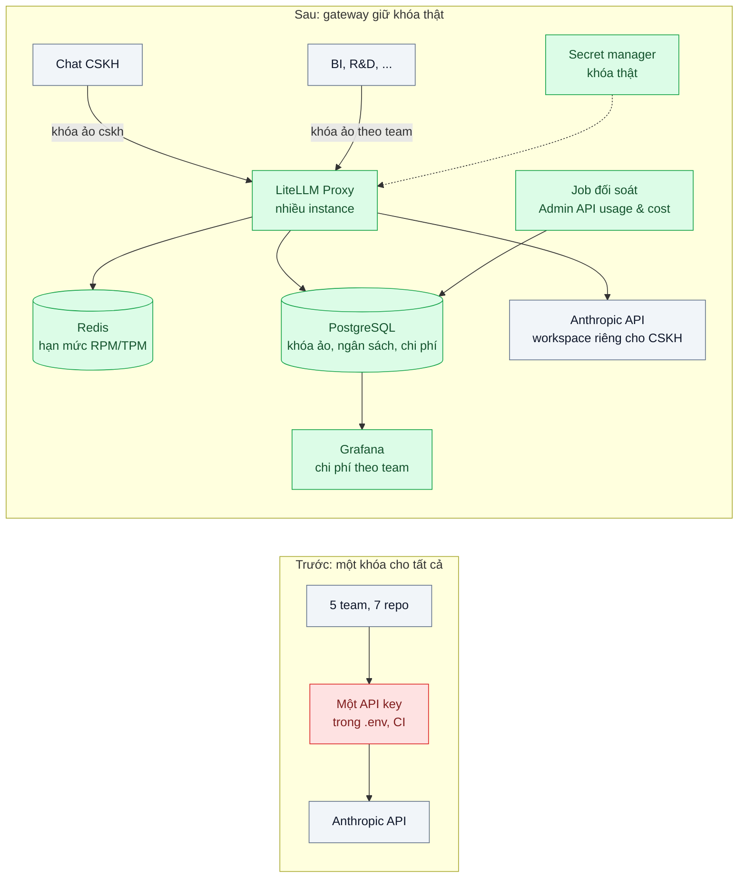
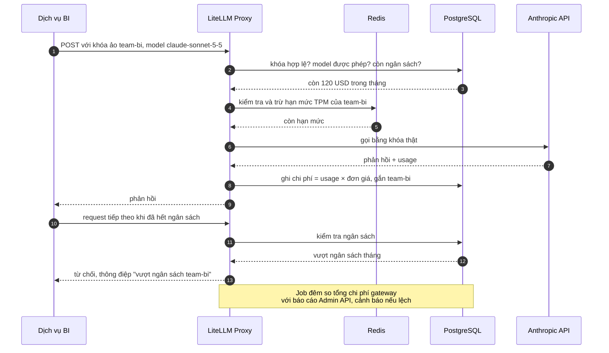

# LLM Gateway (key management, quota, cost per team) — 5 team dùng chung một API key, hóa đơn tăng không biết ai tốn

| Scope | Mức độ | Trạng thái | Pattern gốc | Cập nhật |
|---|---|---|---|---|
| 21 · backend / AI infrastructure | 🟢 Cơ bản | 📋 Kế hoạch | Gateway Offloading — Azure Architecture Center; LiteLLM Proxy docs; Anthropic docs "Admin API" (usage & cost) | 2026-10-06 |

> **Một câu tóm tắt:** Đặt một LLM gateway dùng chung giữ khóa thật của nhà cung cấp; mỗi team/dịch vụ nhận khóa ảo riêng có ngân sách, hạn mức tốc độ và danh sách model được phép; gateway ghi `usage` theo khóa ảo để quy chi phí cho từng team và đối soát hằng ngày với báo cáo usage & cost của Admin API.

## 1. Bài toán thực tế (What)

**Bối cảnh** *(doanh nghiệp giả định, số liệu minh họa)*
Một SaaS B2B làm CRM có 5 team dùng LLM: chat CSKH, tóm tắt email, chấm điểm lead, BI nội bộ và R&D. Cả 5 dùng chung một API key Anthropic nằm trong file `.env`, được chép sang 7 repo và 2 pipeline CI. Mỗi team tự gọi SDK trực tiếp, tự chọn model.

**Triệu chứng người kinh doanh nhìn thấy**
- Hóa đơn tháng tăng gấp ba, không team nào nhận "của mình"; giám đốc tài chính không phân bổ được chi phí vào từng sản phẩm.
- Một script thử nghiệm của R&D chạy suốt cuối tuần với model đắt nhất; chỉ phát hiện khi hóa đơn về.
- Khóa bị lộ trong log CI; xoay vòng khóa mất hai ngày vì phải sửa 7 repo, có dịch vụ chết vì quên cập nhật.
- Giờ cao điểm, BI chạy truy vấn hàng loạt làm chat CSKH dính 429 vì dùng chung hạn mức.

**Nguyên nhân kỹ thuật**
Khóa thật của nhà cung cấp vừa là *thông tin xác thực* vừa là *đơn vị tính tiền* vừa là *đơn vị hạn mức*, nhưng chỉ có một khóa cho 5 team. Không có điểm tập trung để áp chính sách (model nào được dùng, bao nhiêu tiền mỗi tháng, bao nhiêu token mỗi phút) hay ghi nhận ai gọi gì.

**Ràng buộc**
- Các team dùng ngôn ngữ khác nhau (TypeScript, Python cho BI); giải pháp không được là một thư viện chỉ cho một ngôn ngữ.
- Độ trễ thêm do gateway phải nhỏ so với thời gian gọi model.
- Gateway không được trở thành điểm chết duy nhất: cần chạy nhiều instance.

## 2. Vì sao dùng pattern này (Why)

**Nguyên nhân gốc mà pattern nhắm vào:** các mối quan tâm xuyên suốt (xác thực, hạn mức, đo chi phí, chọn model) bị rải vào từng dịch vụ, nên không ai có góc nhìn tổng và không có chỗ áp chính sách.

**Pattern giải quyết thế nào:** theo Gateway Offloading, đẩy các mối quan tâm chung ra một gateway:
1. **Khóa thật chỉ nằm ở gateway** (lấy từ secret manager); xoay vòng một chỗ.
2. **Khóa ảo theo team/dịch vụ** với ngân sách tháng, hạn mức RPM/TPM, danh sách model được phép; vượt ngân sách thì từ chối có thông điệp rõ.
3. **Ghi usage theo khóa ảo**: gateway đọc `usage` (input, output, cache tokens) trong mỗi phản hồi, nhân đơn giá, lưu vào PostgreSQL → báo cáo chi phí theo team, theo model, theo ngày.
4. **Đối soát**: job hằng ngày gọi báo cáo usage & cost của Anthropic Admin API, so tổng của gateway với số nhà cung cấp tính để phát hiện lời gọi đi vòng gateway.
5. **Tách hạn mức phía nhà cung cấp**: dùng workspace/API key riêng phía Anthropic cho nhóm lưu lượng quan trọng (chat CSKH) để BI không ăn hạn mức của chat.

**Lựa chọn khác đã cân nhắc**

| Lựa chọn | Giải quyết được gì | Vì sao không chọn (ở bài này) |
|---|---|---|
| Giữ nguyên + tối ưu nhỏ: mỗi team một API key Anthropic riêng | Quy chi phí theo khóa từ phía nhà cung cấp | Khóa thật vẫn rải ở nhiều repo; không có chính sách model, ngân sách cứng theo team ở một chỗ; vẫn dùng làm lớp bổ sung |
| Gateway mức thư viện (scope 20 bài 01) | Trừu tượng hóa provider trong code TypeScript | Không áp được cho dịch vụ Python; không quản khóa tập trung |
| API gateway chung (Kong, NGINX) | Xác thực, rate limit theo request | Không hiểu token và chi phí; rate limit theo request không phản ánh TPM |
| LLM gateway chuyên dụng — LiteLLM Proxy *(chọn)* | Khóa ảo, ngân sách, hạn mức, ghi chi phí, nhiều provider | Thêm một dịch vụ phải vận hành và theo dõi |

## 3. Thiết kế hệ thống (How)

### 3.1 Kiến trúc trước và sau



### 3.2 Luồng chính



### 3.3 Thành phần và trách nhiệm

| Thành phần | Trách nhiệm | Quyết định thiết kế đáng chú ý |
|---|---|---|
| LiteLLM Proxy | Xác thực khóa ảo, áp chính sách, chuyển tiếp, ghi usage | Chạy nhiều instance sau load balancer; trạng thái nằm ở Redis và PostgreSQL |
| Khóa ảo theo team | Đơn vị tính tiền và hạn mức nội bộ | Mỗi dịch vụ một khóa (không phải mỗi người); metadata ghi team, môi trường |
| PostgreSQL | Lưu khóa ảo, ngân sách, nhật ký chi phí | Nguồn cho báo cáo tài chính nội bộ |
| Redis | Bộ đếm hạn mức dùng chung giữa các instance | Hạn mức theo token/phút, không chỉ theo request |
| Workspace/API key phía Anthropic | Tách hạn mức cho lưu lượng quan trọng | Gateway chọn khóa thật theo nhóm khóa ảo |
| Job đối soát | So chi phí gateway với Admin API usage & cost | Báo cáo usage & cost gọi bằng HTTP với Admin API key; lệch lớn nghĩa là có lời gọi đi vòng gateway |

### 3.4 Điểm dễ sai khi triển khai
- **Vẫn để khóa thật trong repo "cho chắc".** Gateway vô nghĩa nếu còn đường đi vòng. Thu hồi khóa cũ sau khi chuyển xong; đối soát để phát hiện.
- **Hạn mức theo request thay vì theo token.** Một request 100k token và một request 1k token không như nhau; dùng TPM.
- **Đơn giá cứng trong code.** Giá thay đổi; giữ bảng đơn giá có ngày hiệu lực và kiểm tra lại trang Pricing.
- **Bỏ qua token cache.** `cache_read_input_tokens` và `cache_creation_input_tokens` có đơn giá khác token thường; tính sai thì chi phí lệch.

## 4. Tech stack và tác động (Impact techstack)

| Lớp | Công nghệ chọn | Vì sao chọn | Thay thế tương đương |
|---|---|---|---|
| Gateway | LiteLLM Proxy (Docker) | Khóa ảo, ngân sách, hạn mức, ghi chi phí, nhiều provider; dịch vụ ngôn ngữ nào cũng gọi được qua HTTP | Tự viết gateway NestJS; Envoy AI Gateway (cần xác minh) |
| Trạng thái | PostgreSQL 16, Redis 7 | Theo yêu cầu của LiteLLM cho khóa ảo/chi phí và hạn mức dùng chung | — |
| Secret | Biến môi trường từ secret manager (scope 16 bài 04) | Khóa thật không nằm trong repo | Vault |
| Đối soát | Script TypeScript gọi Admin API usage & cost bằng HTTP | SDK không bọc nhóm endpoint báo cáo này; dùng Admin API key riêng | Xuất báo cáo thủ công từ Console |
| Client mẫu | `@anthropic-ai/sdk` trỏ `baseURL` vào gateway (cần xác minh định dạng endpoint gateway hỗ trợ) | Team TypeScript ít phải sửa code | SDK Python cho team BI |
| Dashboard | Grafana đọc PostgreSQL | Chi phí theo team/model/ngày | Metabase |

Giá tại thời điểm viết (kiểm tra lại trang Pricing): `claude-opus-5-5` $4/$20 mỗi triệu token vào/ra; `claude-sonnet-5-5` $2/$10; `claude-haiku-4-5` $1/$5.

**Thay đổi so với hệ thống hiện tại:** thêm gateway, PostgreSQL/Redis cho gateway, job đối soát; mọi dịch vụ đổi endpoint sang gateway và dùng khóa ảo; thu hồi khóa thật cũ. Đội nền tảng sở hữu gateway; tài chính nhận báo cáo chi phí theo team hằng tháng.

## 5. Kết quả đầu ra và cách đo (Output impact)

| Chỉ số | Trước (minh họa) | Mục tiêu khi thực hành | Cách đo |
|---|---|---|---|
| Tỷ lệ chi phí quy được về team | 0% | ≥ 98% | Tổng chi phí gateway theo team / tổng chi phí báo cáo Admin API usage & cost cùng kỳ |
| Thời gian xoay vòng khóa thật | 2 ngày | dưới 10 phút | Bấm giờ kịch bản: tạo khóa mới, cập nhật secret, khởi động lại gateway, thu hồi khóa cũ |
| Request vượt ngân sách bị chặn đúng | không có cơ chế | 100% | Test: đặt ngân sách nhỏ cho khóa thử, bắn request tới khi vượt |
| Overhead độ trễ p95 do gateway | — | dưới 30 ms | k6 gọi máy chủ giả lập qua và không qua gateway |
| 429 của chat CSKH khi BI chạy hàng loạt | thường xuyên | 0 do lưu lượng BI | k6 chạy song song hai luồng, đếm 429 theo khóa ảo |

> Số "trước" là minh họa để hình dung bài toán. Số "mục tiêu" chỉ được coi là đạt khi có số đo thật
> ở mục 8 kèm môi trường đo.

**Tác động nghiệp vụ mong đợi:** tài chính phân bổ được chi phí AI vào từng sản phẩm; một script lỗi chỉ đốt tới mức ngân sách của team đó; lộ khóa trở thành sự cố mười phút.

## 6. Đánh đổi và khi KHÔNG nên dùng

**Đánh đổi**
- Thêm một dịch vụ trên đường đi của mọi lời gọi AI: phải có nhiều instance, giám sát và quy trình nâng cấp.
- Tính năng mới của API (beta) phải chờ gateway hỗ trợ chuyển tiếp; cần kiểm tra trước khi dùng.

**Không nên dùng khi**
- Chỉ một team, một dịch vụ: workspace/API key riêng phía nhà cung cấp và Admin API là đủ.
- Cần tính năng phía API mà gateway chưa chuyển tiếp được: gọi trực tiếp cho luồng đó và đối soát riêng.

**Liên quan**
- [Model Gateway (scope 20)](../../20-backend-ai-framework-system-design/01-llm-gateway-abstraction-doi-model-phai-sua-30-file/) — gateway mức code bên trong một dịch vụ.
- [Token & Cost Attribution (scope 24)](../../24-backend-ai-monitoring/02-token-cost-per-feature-tenant-hoa-don-tang-3-lan-khong-biet-vi-sao/) — quy chi phí tới tính năng và tenant.
- [Multi-provider / Multi-region Failover](../08-multi-region-failover-llm-provider-mot-region-down/) — gateway là điểm chuyển hướng.
- [Rate Limiting & Throttling (scope 13)](../../13-backend-transporter/03-rate-limiting-mot-khach-api-goi-10k-req-s/) và [ConfigMap, Secret & External Secrets (scope 16)](../../16-backend-k8s/04-config-secret-external-secrets-password-db-nam-trong-yaml/).

## 7. Cơ sở tham khảo

- Microsoft Azure Architecture Center, "Gateway Offloading" và "Gateway Routing" — https://learn.microsoft.com/azure/architecture/patterns/ — đẩy mối quan tâm chung ra gateway.
- LiteLLM docs — https://docs.litellm.ai/ — Proxy: khóa ảo, ngân sách theo khóa/team, hạn mức, theo dõi chi phí, cấu hình nhiều instance với Redis.
- Anthropic docs, "Admin API" — https://platform.claude.com/docs/en/api/admin — quản lý workspace/API key và báo cáo usage & cost để đối soát.
- Anthropic docs, "Rate limits" — https://platform.claude.com/docs/en/api/rate-limits — hạn mức theo request và token mỗi phút.
- Anthropic docs, "Pricing" — https://platform.claude.com/docs/en/about-claude/pricing — đơn giá token thường và token cache.

## 8. Kế hoạch thực hành

- [ ] Bước 1: dựng Docker Compose (LiteLLM Proxy hai instance, PostgreSQL, Redis, máy chủ giả lập Anthropic trả `usage`); viết 3 dịch vụ mẫu đại diện cho các team.
- [ ] Bước 2: đo "trước": gọi thẳng bằng một khóa chung, cho thấy không quy được chi phí và BI gây 429 cho CSKH.
- [ ] Bước 3: áp dụng pattern: tạo khóa ảo theo team với ngân sách/hạn mức/model cho phép; chuyển dịch vụ sang gateway; job đối soát; dashboard Grafana.
- [ ] Bước 4: đo "sau": tỷ lệ quy chi phí, overhead k6, 429 theo khóa, thời gian xoay vòng khóa; ghi vào mục 5.
- [ ] Bước 5: test Vitest: (a) model không được phép bị từ chối, (b) vượt ngân sách bị chặn, (c) chi phí tính đúng cả token cache, (d) job đối soát cảnh báo khi lệch quá ngưỡng.

**Cấu trúc code dự kiến**
```text
gateway/litellm-config.yaml        # model, khóa thật từ env, Redis, PostgreSQL
src/
  reconcile/admin-usage-client.ts  # gọi báo cáo usage & cost bằng HTTP
  reconcile/reconcile-job.ts       # so chi phí gateway với Admin API
  demo-services/                   # cskh, bi, rnd gọi qua gateway
test/
  budget-policy.test.ts
  reconcile-job.test.ts
tools/fake-anthropic-server.ts
docker-compose.yml                 # litellm x2, postgres, redis, grafana
```

**Cách chạy** *(điền khi bắt đầu code)*
```bash
docker compose up -d
pnpm install && pnpm test
```
