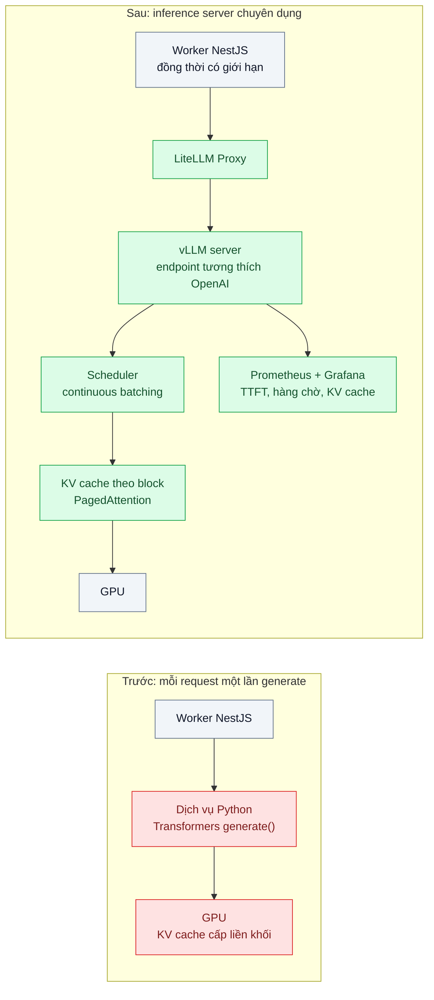
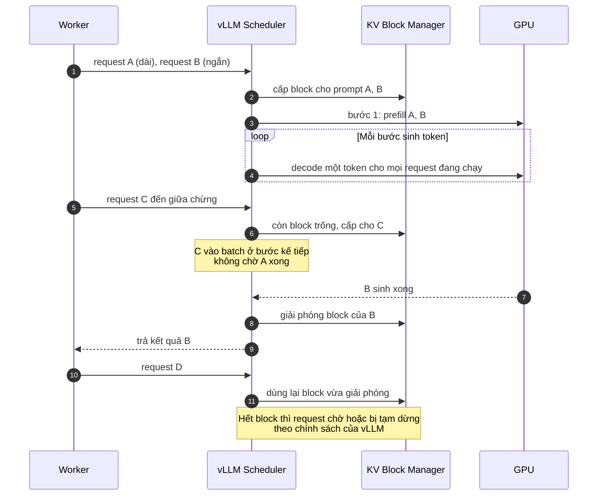

# Model Serving (vLLM, continuous batching, PagedAttention) — Tự host mô hình 8B phục vụ 50 req/s trên 1 GPU

| Scope | Mức độ | Trạng thái | Pattern gốc | Cập nhật |
|---|---|---|---|---|
| 21 · backend / AI infrastructure | 🟡 Trung bình | 📋 Kế hoạch | Continuous batching — Yu et al., "Orca" (OSDI 2022); PagedAttention — Kwon et al. (SOSP 2023); vLLM docs | 2026-10-06 |

> **Một câu tóm tắt:** Thay vòng lặp "mỗi request một lần `generate()`" bằng một inference server lập lịch theo từng bước sinh token (continuous batching) và quản lý KV cache theo trang (PagedAttention), để một GPU phục vụ hàng chục request đồng thời thay vì vài request tuần tự.

## 1. Bài toán thực tế (What)

**Bối cảnh** *(doanh nghiệp giả định, số liệu minh họa)*
Một công ty logistics phải phân loại và trích xuất thông tin từ ghi chú giao hàng, khiếu nại của người nhận (khoảng 3 triệu tin mỗi ngày, đỉnh 50 tin/giây giờ cao điểm). Theo kết luận của bài 01, dữ liệu này được xử lý bằng một mô hình mở cỡ 8B tham số tự host. Bản đầu tiên là một dịch vụ Python bọc thư viện Transformers: mỗi request gọi `generate()` riêng, chạy trên một GPU.

**Triệu chứng người kinh doanh nhìn thấy**
- Giờ cao điểm hàng đợi dồn, khiếu nại khẩn tới tay CSKH chậm 20–30 phút.
- Đội hạ tầng đề xuất thuê thêm 5 GPU cho đỉnh tải, trong khi GPU hiện có báo mức sử dụng thấp phần lớn thời gian.
- Độ trễ p95 dao động mạnh: tin ngắn cũng phải chờ tin dài phía trước sinh xong.

**Nguyên nhân kỹ thuật**
Sinh token là quá trình lặp: mỗi bước tạo một token và đọc KV cache của mọi token trước đó. Xử lý từng request một khiến GPU chủ yếu chờ đọc bộ nhớ, phần tính toán bị bỏ phí. Nếu gom batch tĩnh, cả batch phải chờ request dài nhất xong mới nhận request mới. KV cache được cấp phát liền khối theo độ dài tối đa, phần lớn bị bỏ trống, nên số request đồng thời bị giới hạn bởi bộ nhớ chứ không bởi tính toán.

**Ràng buộc**
- Một GPU hiện có; thêm GPU chỉ khi đã tận dụng hết GPU này.
- Ứng dụng NestJS hiện gọi qua HTTP; không muốn viết lại client cho từng engine.
- Đầu ra phải là JSON hợp lệ cho bước lưu trữ phía sau.

## 2. Vì sao dùng pattern này (Why)

**Nguyên nhân gốc mà pattern nhắm vào:** lập lịch theo request và cấp phát KV cache liền khối làm GPU vừa thiếu việc vừa thiếu bộ nhớ cho request đồng thời.

**Pattern giải quyết thế nào:**
1. **Continuous batching (iteration-level scheduling, Orca)**: bộ lập lịch quyết định ở *mỗi bước sinh token* request nào tham gia; request xong thì rời batch ngay, request mới vào ngay bước kế tiếp, không chờ cả batch.
2. **PagedAttention**: KV cache chia thành các block kích thước cố định, cấp phát theo nhu cầu như trang bộ nhớ ảo; gần như không phân mảnh, nên cùng dung lượng GPU chứa được nhiều request đồng thời hơn, và block có thể dùng chung giữa request cùng tiền tố (bài 07).
3. **vLLM** hiện thực cả hai, cung cấp endpoint tương thích OpenAI và metrics Prometheus. Ứng dụng gọi qua LiteLLM Proxy (bài 02) để cùng giao diện với Claude API.
4. **Tinh chỉnh theo số đo**: giới hạn độ dài ngữ cảnh tối đa sát nhu cầu thật để dành bộ nhớ cho KV cache, đặt tỷ lệ bộ nhớ GPU cho vLLM, giới hạn số chuỗi đồng thời; dùng Little's law (đồng thời = thông lượng × độ trễ) để chọn mức đồng thời của client.

**Lựa chọn khác đã cân nhắc**

| Lựa chọn | Giải quyết được gì | Vì sao không chọn (ở bài này) |
|---|---|---|
| Giữ nguyên + tối ưu nhỏ: batch tĩnh tự viết trong dịch vụ Python | Tăng thông lượng phần nào | Vẫn chờ request dài nhất; KV cache vẫn cấp liền khối; tự viết scheduler là việc của engine |
| Hugging Face Text Generation Inference (TGI) | Cũng có continuous batching, endpoint chuẩn | Lựa chọn tương đương; chọn vLLM vì có sẵn trong danh mục nguồn và tài liệu prefix caching dùng ở bài 07 |
| NVIDIA TensorRT-LLM + Triton | Hiệu năng cao trên GPU NVIDIA | Bước build engine phức tạp hơn cho đội nhỏ; cân nhắc khi đã tối ưu xong ở vLLM |
| Gọi API thay vì tự host (bài 01) | Không vận hành GPU | Bài 01 đã kết luận luồng này phải ở trong hạ tầng |

## 3. Thiết kế hệ thống (How)

### 3.1 Kiến trúc trước và sau



### 3.2 Luồng chính



### 3.3 Thành phần và trách nhiệm

| Thành phần | Trách nhiệm | Quyết định thiết kế đáng chú ý |
|---|---|---|
| vLLM server | Nạp model, lập lịch, quản lý KV cache, phục vụ HTTP | Chạy bằng image chính thức trong Docker có GPU; tham số khởi động ghi trong file cấu hình, không gõ tay |
| Cấu hình bộ nhớ | Độ dài ngữ cảnh tối đa, tỷ lệ bộ nhớ GPU, số chuỗi đồng thời tối đa | Đặt theo phân phối độ dài thật của tin; độ dài tối đa thừa là bộ nhớ KV bị giữ chỗ |
| LiteLLM Proxy | Một giao diện cho vLLM và Claude, ghi usage | Đổi model hay engine không sửa worker |
| Worker NestJS | Lấy tin từ hàng đợi, gọi với mức đồng thời giới hạn | Mức đồng thời chọn theo Little's law và số đo, không "càng nhiều càng tốt" |
| Đầu ra JSON | Bảo đảm kết quả parse được | Dùng tính năng structured/guided output của vLLM theo docs, validate lại bằng Zod |
| Giám sát | TTFT, thời gian mỗi token, số request đang chạy/chờ, mức dùng KV cache | Lấy từ endpoint metrics của vLLM; tên metric kiểm tra theo phiên bản đang dùng |

### 3.4 Điểm dễ sai khi triển khai
- **Đặt độ dài ngữ cảnh tối đa bằng mức model hỗ trợ.** Bộ nhớ KV bị chia cho các chuỗi dài hiếm gặp; số request đồng thời giảm mạnh.
- **Client bắn không giới hạn.** Hàng chờ trong vLLM phình, TTFT tăng vọt dù thông lượng không tăng thêm; giới hạn đồng thời ở worker.
- **Đo bằng request đơn lẻ.** Lợi ích của continuous batching chỉ hiện ra khi có tải đồng thời; benchmark phải tái hiện phân phối độ dài và tốc độ đến thật.
- **So thông lượng mà bỏ qua chất lượng.** Đổi model, lượng tử hóa (scope 22 bài 09) để nhanh hơn phải chạy lại golden set.
- **Quên warm-up.** Lần chạy đầu bao gồm nạp model và biên dịch; bỏ qua khi đo.

## 4. Tech stack và tác động (Impact techstack)

| Lớp | Công nghệ chọn | Vì sao chọn | Thay thế tương đương |
|---|---|---|---|
| Inference server | vLLM (image Docker chính thức) | Continuous batching, PagedAttention, endpoint tương thích OpenAI, metrics | Hugging Face TGI; SGLang (cần xác minh); TensorRT-LLM |
| GPU runtime | NVIDIA driver + NVIDIA Container Toolkit | Cho container truy cập GPU | Chạy trực tiếp trên host |
| Gateway | LiteLLM Proxy | Cùng giao diện với Claude API, ghi usage | Gọi thẳng vLLM |
| Ứng dụng | TypeScript strict, Node 20+, NestJS worker, Zod | Trùng stack; validate JSON đầu ra | Fastify worker |
| Hàng đợi | BullMQ trên Redis 7 | Đệm đỉnh tải, giới hạn đồng thời | PGMQ |
| Đo tải | Công cụ benchmark serving đi kèm vLLM (cần xác minh tên lệnh theo phiên bản), k6 | Đo thông lượng, TTFT, thời gian mỗi token dưới tải | Locust |
| Giám sát | Prometheus + Grafana, `nvidia-smi` / DCGM exporter | Thấy đồng thời mức dùng GPU và hàng chờ | — |

**Thay đổi so với hệ thống hiện tại:** thay dịch vụ Python tự viết bằng vLLM; thêm gateway và dashboard GPU; worker gọi qua gateway với đồng thời giới hạn. Đội hạ tầng học đọc metrics KV cache/hàng chờ và chọn tham số bộ nhớ.

## 5. Kết quả đầu ra và cách đo (Output impact)

| Chỉ số | Trước (minh họa) | Mục tiêu khi thực hành | Cách đo |
|---|---|---|---|
| Thông lượng ở p95 TTFT dưới 1 giây | ~3 req/s | ≥ 50 req/s | Benchmark serving của vLLM / k6 với phân phối độ dài tin thật, tăng dần tốc độ đến |
| Token đầu ra mỗi giây toàn GPU | ghi nhận | ghi nhận, so trước/sau | Tổng `completion_tokens` / thời gian chạy; metric của vLLM |
| TTFT p95 dưới tải đỉnh | ~20 giây | dưới 1 giây | Script streaming đo thời gian tới token đầu tiên |
| Mức sử dụng GPU giờ cao điểm | thấp | cao và ổn định | `nvidia-smi` utilization / DCGM exporter trên Grafana |
| Chi phí mỗi 1 triệu tin | 100 (chỉ số gốc) | ghi nhận | GPU-giờ × đơn giá / số tin xử lý trong lần đo |

> Số "trước" là minh họa để hình dung bài toán. Số "mục tiêu" chỉ được coi là đạt khi có số đo thật
> ở mục 8 kèm môi trường đo.

**Tác động nghiệp vụ mong đợi:** khiếu nại khẩn tới CSKH trong vài giây ở giờ cao điểm mà không phải thuê thêm GPU; quyết định mua thêm GPU dựa trên số đo công suất thật.

## 6. Đánh đổi và khi KHÔNG nên dùng

**Đánh đổi**
- Batch lớn tăng thông lượng nhưng có thể tăng độ trễ từng request; phải chọn điểm cân bằng theo SLO.
- vLLM thay đổi nhanh giữa các phiên bản (tham số, tên metric); phải ghim phiên bản và đọc changelog khi nâng cấp.
- Vận hành GPU (driver, toolkit, giám sát nhiệt độ/bộ nhớ) là năng lực mới của đội.

**Không nên dùng khi**
- Lưu lượng thấp, không có yêu cầu dữ liệu phải ở trong hạ tầng: gọi API rẻ và đơn giản hơn (bài 01).
- Tác vụ hàng loạt không gấp có thể chạy bằng Message Batches của Anthropic (scope 22 bài 02) nếu dữ liệu được phép.

**Liên quan**
- [API vs Self-hosting](../01-api-vs-self-host-du-lieu-nhay-cam-co-nen-tu-host-model/) — quyết định trước bài này.
- [GPU Scheduling on Kubernetes](../04-gpu-on-k8s-device-plugin-mig-time-slicing-gpu-ranh-70-phan-tram/) và [Prefix / KV Caching](../07-inference-cache-kv-prefix-caching-system-prompt-5k-token-moi-request/).
- [Quantization & Speculative Decoding (scope 22)](../../22-backend-ai-optimizer/09-quantization-speculative-decoding-self-host-cham-va-ton-vram/) — tối ưu tiếp trên vLLM.
- [LLM Latency Breakdown (scope 24)](../../24-backend-ai-monitoring/07-latency-ttft-tokens-per-second-chat-cham-nhung-p50-binh-thuong/) — đo TTFT và token/s.

## 7. Cơ sở tham khảo

- Kwon et al., "Efficient Memory Management for Large Language Model Serving with PagedAttention", SOSP 2023 — quản lý KV cache theo block, chia sẻ block, nền tảng của vLLM.
- Yu et al., "Orca: A Distributed Serving System for Transformer-Based Generative Models", OSDI 2022 — lập lịch theo từng bước sinh (iteration-level scheduling).
- vLLM docs — https://docs.vllm.ai/ — chạy server tương thích OpenAI, tham số bộ nhớ và đồng thời, metrics, structured outputs, benchmark.
- Chip Huyen, *AI Engineering*, O'Reilly, 2025 — chương tối ưu inference: TTFT, thông lượng, batching.
- J. D. C. Little, "A Proof for the Queuing Formula: L = λW", Operations Research, 1961 — chọn mức đồng thời của client.
- NVIDIA Container Toolkit docs (cần xác minh URL) — cấp GPU cho container.

## 8. Kế hoạch thực hành

- [ ] Bước 1: chuẩn bị máy có một GPU NVIDIA, Docker + Container Toolkit; tạo bộ 10.000 tin giả lập có phân phối độ dài giống thật; dựng bản "trước" bằng Transformers.
- [ ] Bước 2: đo "trước": thông lượng và TTFT p95 ở các mức tốc độ đến, mức sử dụng GPU.
- [ ] Bước 3: áp dụng pattern: chạy vLLM với cùng model, đặt tham số bộ nhớ theo phân phối độ dài, đi qua LiteLLM Proxy, worker giới hạn đồng thời, Prometheus + Grafana.
- [ ] Bước 4: đo "sau" cùng kịch bản; ghi vào mục 5 kèm loại GPU, phiên bản vLLM, model, tham số.
- [ ] Bước 5: test Vitest: (a) đầu ra parse được bằng Zod trên 1.000 tin, (b) worker không vượt mức đồng thời cấu hình, (c) script đo TTFT trả kết quả lặp lại được giữa hai lần chạy.

**Cấu trúc code dự kiến**
```text
serving/
  vllm.env                    # model, độ dài tối đa, tỷ lệ bộ nhớ, số chuỗi đồng thời
  baseline/transformers-server.py   # bản "trước", chạy như script
src/
  worker/classify.worker.ts   # BullMQ, đồng thời giới hạn
  worker/output-schema.ts     # Zod
bench/
  serving-load.k6.js
  ttft-probe.ts
test/
  output-schema.test.ts
docker-compose.yml            # vllm (GPU), litellm, redis, prometheus, grafana, dcgm-exporter
```

**Cách chạy** *(điền khi bắt đầu code)*
```bash
docker compose up -d
pnpm install && pnpm test
```
