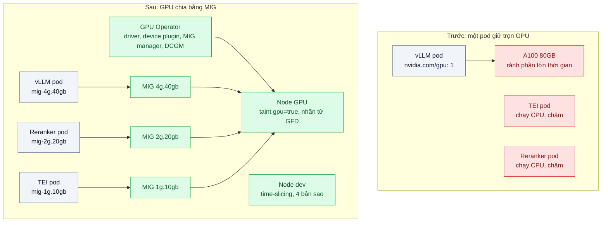
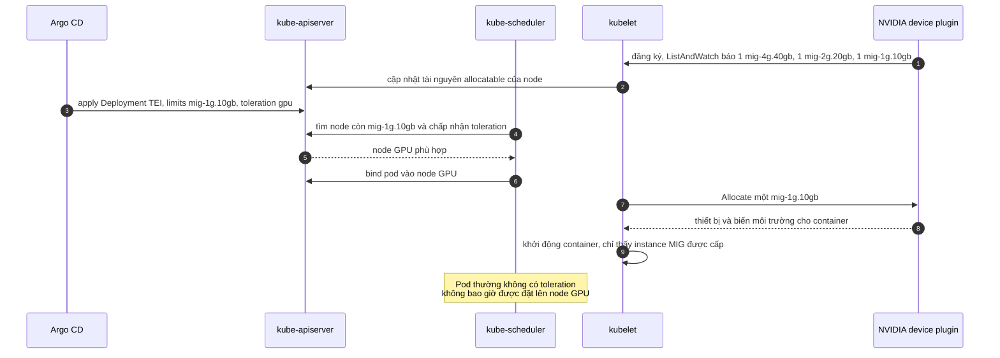

# GPU Scheduling on Kubernetes (device plugin, MIG, time-slicing) — GPU A100 rảnh 70% thời gian nhưng không chia được cho 3 service

| Scope | Mức độ | Trạng thái | Pattern gốc | Cập nhật |
|---|---|---|---|---|
| 21 · backend / AI infrastructure | 🟡 Trung bình | 📋 Kế hoạch | GPU sharing — NVIDIA Kubernetes device plugin docs; NVIDIA MIG User Guide; Kubernetes docs "Schedule GPUs" | 2026-10-06 |

> **Một câu tóm tắt:** Cho Kubernetes thấy GPU dưới dạng tài nguyên chia được — MIG cắt một A100 thành các instance cô lập phần cứng cho service production, time-slicing chia sẻ theo thời gian cho môi trường thử — kèm taint/toleration và nhãn node để chỉ đúng pod được đặt lên node GPU.

## 1. Bài toán thực tế (What)

**Bối cảnh** *(doanh nghiệp giả định, số liệu minh họa)*
Một SaaS B2B làm nền tảng tri thức nội bộ chạy trên Kubernetes, có một node với một GPU A100 80 GB. Ba service cần GPU: vLLM phục vụ mô hình 8B (bài 03), Text Embeddings Inference (TEI) sinh embedding cho RAG, và một reranker. Hiện vLLM chiếm trọn GPU; TEI và reranker chạy trên CPU rất chậm, hoặc team đề xuất thuê thêm hai GPU.

**Triệu chứng người kinh doanh nhìn thấy**
- Tìm kiếm tài liệu chậm 2–3 giây vì embedding và rerank chạy CPU; khách doanh nghiệp phàn nàn khi demo.
- Hóa đơn đám mây có một GPU đắt tiền mà dashboard cho thấy rảnh khoảng 70% thời gian.
- Đề xuất mua thêm GPU bị tài chính bác vì "GPU hiện có còn rảnh".

**Nguyên nhân kỹ thuật**
Mặc định NVIDIA device plugin quảng bá GPU như tài nguyên mở rộng `nvidia.com/gpu` nguyên đơn vị: một pod xin `1` là giữ trọn GPU, không pod nào khác được đặt lên. Kubernetes không cho xin "nửa GPU" và không overcommit GPU. Service nhỏ như TEI chỉ cần một phần nhỏ bộ nhớ và tính toán nhưng không có cách xin phần nhỏ đó.

**Ràng buộc**
- vLLM phục vụ người dùng thật: không được để service khác làm tràn bộ nhớ hay làm chậm nó đột biến.
- Đội hạ tầng nhỏ: cấu hình phải khai báo được (GitOps), không thao tác tay trên node.
- Pod không dùng GPU không được chiếm chỗ trên node GPU đắt tiền.

## 2. Vì sao dùng pattern này (Why)

**Nguyên nhân gốc mà pattern nhắm vào:** đơn vị cấp phát GPU trong cluster (nguyên một GPU) lớn hơn nhiều so với nhu cầu của từng service.

**Pattern giải quyết thế nào:** có hai cơ chế chia GPU, chọn theo mức cô lập cần có:
1. **MIG (Multi-Instance GPU)** trên A100/H100: cắt GPU ở mức phần cứng thành các instance có bộ nhớ, cache và đơn vị tính toán riêng. Với chiến lược `mixed` của device plugin, mỗi profile thành một tài nguyên riêng (ví dụ `nvidia.com/mig-1g.10gb`); pod xin đúng profile cần. Ví dụ chia 4g.40gb cho vLLM, 2g.20gb cho reranker, 1g.10gb cho TEI — tổ hợp hợp lệ phải kiểm tra trong MIG User Guide.
2. **Time-slicing**: device plugin quảng bá một GPU thành nhiều bản sao; các pod chia nhau GPU theo thời gian. Không cô lập bộ nhớ hay lỗi: một pod tràn bộ nhớ ảnh hưởng pod khác. Hợp cho dev/staging, notebook, tác vụ thử.
Bổ sung: **taint** node GPU và **toleration** cho pod GPU để pod thường không chiếm chỗ; **nhãn node** từ GPU Feature Discovery để chọn đúng loại GPU; **NVIDIA GPU Operator** cài driver, container toolkit, device plugin, MIG manager và DCGM exporter theo khai báo.

**Lựa chọn khác đã cân nhắc**

| Lựa chọn | Giải quyết được gì | Vì sao không chọn (ở bài này) |
|---|---|---|
| Giữ nguyên + tối ưu nhỏ: chạy TEI và reranker chung container với vLLM | Dùng chung GPU ngay | Phá ranh giới deploy/scale/giám sát; một service lỗi kéo cả container |
| Thuê thêm hai GPU nhỏ | Cô lập hoàn toàn | Tốn tiền trong khi GPU hiện có còn rảnh; thêm node phải vận hành |
| Time-slicing cho production | Cấu hình đơn giản, không cần GPU hỗ trợ MIG | Không cô lập bộ nhớ; TEI tăng đột biến có thể làm vLLM lỗi hết bộ nhớ |
| MIG cho production, time-slicing cho dev *(chọn)* | Cô lập phần cứng nơi cần, linh hoạt nơi không cần | Đổi cấu hình MIG cần drain node; profile cố định, chia lệch là lãng phí |

## 3. Thiết kế hệ thống (How)

### 3.1 Kiến trúc trước và sau



### 3.2 Luồng chính



### 3.3 Thành phần và trách nhiệm

| Thành phần | Trách nhiệm | Quyết định thiết kế đáng chú ý |
|---|---|---|
| NVIDIA GPU Operator | Cài và quản lý driver, container toolkit, device plugin, GFD, MIG manager, DCGM exporter | Khai báo bằng Helm values trong Git; không cài tay trên node |
| MIG manager | Áp cấu hình MIG theo nhãn node | Đổi profile cần drain node: lên lịch như bảo trì |
| Device plugin | Quảng bá tài nguyên GPU/MIG, cấp thiết bị khi pod khởi động | Chiến lược `mixed` để mỗi profile là một tài nguyên riêng; cấu hình time-slicing cho node dev |
| Taint/toleration + nhãn node | Giữ node GPU cho pod GPU, chọn đúng loại GPU | Tránh pod thường chiếm CPU/RAM của node GPU |
| Resource limits | Pod khai báo GPU trong `limits` | Theo docs Kubernetes, GPU chỉ khai báo ở limits; không overcommit |
| DCGM exporter + Grafana | Mức dùng tính toán, bộ nhớ theo GPU và theo instance | Với MIG, xem metric theo instance để biết profile nào chia lệch |

### 3.4 Điểm dễ sai khi triển khai
- **Chọn profile MIG theo cảm tính.** vLLM thiếu bộ nhớ KV cache thì thông lượng tụt; đo nhu cầu bộ nhớ thật của từng service (bài 03) trước khi chia.
- **Dùng time-slicing rồi tưởng có cô lập.** Time-slicing không giới hạn bộ nhớ từng pod; một pod tràn bộ nhớ có thể làm pod khác lỗi.
- **Quên taint node GPU.** Pod web thường được đặt lên node GPU, chiếm CPU/RAM khiến pod GPU không còn chỗ.
- **Đổi cấu hình MIG khi pod đang chạy.** Phải drain node; đặt PodDisruptionBudget và lịch bảo trì (scope 16 bài 07).
- **Xin `nvidia.com/gpu` sau khi bật MIG mixed.** Tài nguyên đã đổi tên theo profile; manifest cũ sẽ Pending mãi.

## 4. Tech stack và tác động (Impact techstack)

| Lớp | Công nghệ chọn | Vì sao chọn | Thay thế tương đương |
|---|---|---|---|
| Orchestration | Kubernetes 1.29+ | Cơ chế device plugin và extended resources | — |
| GPU stack | NVIDIA GPU Operator (Helm) | Một chart quản lý driver, toolkit, device plugin, MIG manager, DCGM | Cài NVIDIA k8s-device-plugin riêng lẻ |
| Chia GPU | MIG (A100) cho production; time-slicing cho dev | Cô lập phần cứng nơi cần, linh hoạt nơi không cần | MPS của CUDA (cần xác minh mức hỗ trợ trong device plugin) |
| Workload | vLLM, Hugging Face TEI, reranker | Ba service thật của bài toán | Triton Inference Server |
| GitOps | Argo CD | Cấu hình node và workload khai báo được | Flux |
| Giám sát | DCGM exporter, Prometheus, Grafana | Mức dùng GPU theo instance | `nvidia-smi` thủ công |
| Đo tải | k6 gọi ba service đồng thời | Kiểm tra ảnh hưởng chéo khi chạy chung GPU | — |

**Thay đổi so với hệ thống hiện tại:** cài GPU Operator, bật MIG trên node GPU, sửa manifest ba service sang tài nguyên MIG, thêm taint/toleration; thêm node dev dùng time-slicing. Đội hạ tầng học quy trình đổi profile MIG và đọc metric DCGM.

## 5. Kết quả đầu ra và cách đo (Output impact)

| Chỉ số | Trước (minh họa) | Mục tiêu khi thực hành | Cách đo |
|---|---|---|---|
| Số service dùng GPU trên cùng node | 1 | 3 | `kubectl describe node` (allocatable/allocated) |
| Mức sử dụng GPU trung bình giờ làm việc | ~30% | ≥ 60% | DCGM exporter trên Grafana, trung bình theo giờ trong một tuần thử |
| p95 độ trễ tìm kiếm (embedding + rerank) | 2–3 giây | dưới 300 ms | k6 gọi API tìm kiếm với bộ câu hỏi mẫu |
| p95 TTFT của vLLM khi hai service kia chịu tải | — | tăng không quá 10% so với chạy riêng | Script streaming đo TTFT, chạy song song k6 vào TEI và reranker |
| Lỗi hết bộ nhớ GPU do ảnh hưởng chéo | — | 0 với MIG | Sự kiện pod/OOM và log container trong kịch bản tải đột biến TEI |

> Số "trước" là minh họa để hình dung bài toán. Số "mục tiêu" chỉ được coi là đạt khi có số đo thật
> ở mục 8 kèm môi trường đo.

**Tác động nghiệp vụ mong đợi:** tìm kiếm nhanh hơn rõ rệt mà không mua thêm GPU; quyết định mua GPU tiếp theo dựa trên mức dùng đo được theo từng service.

## 6. Đánh đổi và khi KHÔNG nên dùng

**Đánh đổi**
- Profile MIG cố định: nhu cầu đổi thì phải drain node để cắt lại; chia lệch là lãng phí phần còn lại.
- Time-slicing tăng mật độ nhưng mất cô lập và làm độ trễ khó đoán.
- GPU Operator thêm nhiều thành phần chạy trên node; nâng cấp driver là sự kiện cần kế hoạch.

**Không nên dùng khi**
- GPU không hỗ trợ MIG và workload production nhạy độ trễ: dùng GPU riêng cho mỗi service quan trọng.
- Một service đã dùng gần hết GPU (ví dụ vLLM đã tối ưu đạt mức sử dụng cao): chia ra chỉ làm nó chậm đi.

**Liên quan**
- [Model Serving vLLM](../03-vllm-serving-continuous-batching-tu-host-50-req-s/) — đo nhu cầu bộ nhớ trước khi chia.
- [Scale-to-zero & Spot GPUs](../06-scale-to-zero-gpu-spot-gpu-chay-ca-dem-khong-ai-dung/) — tiết kiệm phần thời gian GPU rảnh.
- [Resource Requests/Limits & HPA (scope 16)](../../16-backend-k8s/03-requests-limits-hpa-9h-sang-traffic-gap-5/) và [PodDisruptionBudget & Anti-affinity (scope 16)](../../16-backend-k8s/07-pdb-anti-affinity-node-drain-lam-down-ca-service/).
- [Embedding Ingestion Pipeline](../05-embedding-pipeline-nhap-10-trieu-tai-lieu-idempotent/) — TEI dùng chung GPU.

## 7. Cơ sở tham khảo

- Kubernetes docs, "Schedule GPUs" — https://kubernetes.io/docs/tasks/manage-gpus/scheduling-gpus/ — GPU là extended resource, chỉ khai báo trong limits, không chia sẻ mặc định.
- Kubernetes docs, "Device Plugins" — https://kubernetes.io/docs/concepts/extend-kubernetes/compute-storage-net/device-plugins/ — cơ chế đăng ký, ListAndWatch, Allocate.
- NVIDIA k8s-device-plugin — https://github.com/NVIDIA/k8s-device-plugin — chiến lược MIG (`none`, `single`, `mixed`), cấu hình time-slicing.
- NVIDIA MIG User Guide — https://docs.nvidia.com/datacenter/tesla/mig-user-guide/ — profile, tổ hợp hợp lệ, mức cô lập.
- NVIDIA GPU Operator docs (cần xác minh URL) — cài đặt và quản lý stack GPU trên Kubernetes, MIG manager, DCGM exporter.
- Kubernetes docs, "Taints and Tolerations" — https://kubernetes.io/docs/concepts/scheduling-eviction/taint-and-toleration/ — giữ node GPU cho workload GPU.

## 8. Kế hoạch thực hành

- [ ] Bước 1: chuẩn bị cluster có một node GPU hỗ trợ MIG (đám mây thuê theo giờ) và một node dev; triển khai ba service với cấu hình "trước" (vLLM giữ trọn GPU, TEI/reranker chạy CPU).
- [ ] Bước 2: đo "trước": mức dùng GPU, p95 tìm kiếm, TTFT của vLLM.
- [ ] Bước 3: áp dụng pattern: GPU Operator qua Argo CD, bật MIG mixed với tổ hợp profile đã kiểm tra, sửa manifest, taint/toleration; time-slicing trên node dev.
- [ ] Bước 4: đo "sau" cùng kịch bản, thêm kịch bản tải đột biến TEI để kiểm tra cô lập; ghi vào mục 5 kèm loại GPU, phiên bản driver/Operator.
- [ ] Bước 5: kiểm thử tự động (Vitest gọi `kubectl` qua script): (a) pod không có toleration không vào node GPU, (b) mỗi pod chỉ thấy đúng instance MIG được cấp, (c) manifest dùng đúng tên tài nguyên MIG.

**Cấu trúc code dự kiến**
```text
k8s/
  gpu-operator/values.yaml        # MIG strategy mixed, DCGM exporter
  gpu-operator/mig-config.yaml    # tổ hợp profile theo nhãn node
  gpu-operator/time-slicing.yaml  # cấu hình cho node dev
  workloads/vllm.yaml             # limits nvidia.com/mig-4g.40gb, toleration
  workloads/tei.yaml
  workloads/reranker.yaml
bench/search-load.k6.js
test/scheduling.test.ts           # kiểm tra đặt pod và tài nguyên
```

**Cách chạy** *(điền khi bắt đầu code)*
```bash
kubectl apply -k k8s/
pnpm install && pnpm test
```
