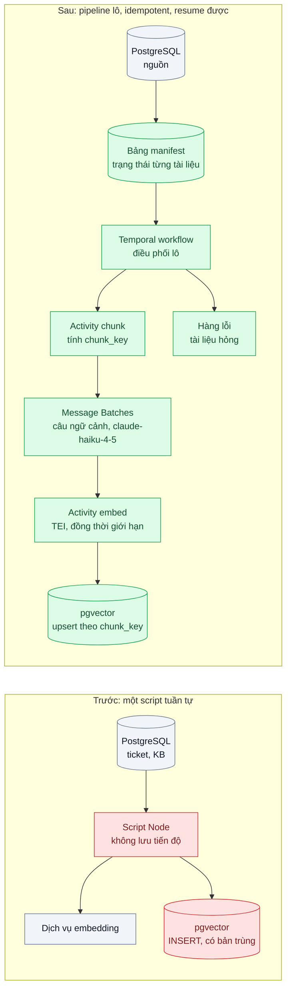
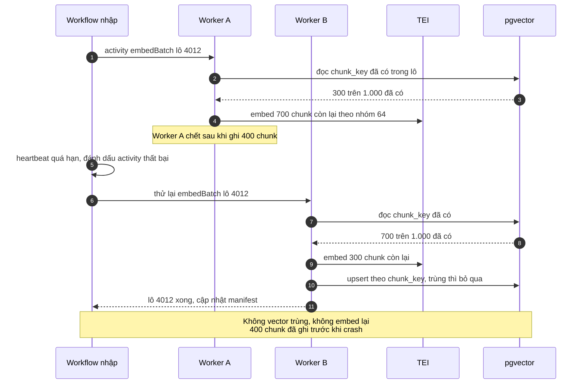

# Embedding Ingestion Pipeline (batch, idempotent, resumable) — Nhập 10 triệu tài liệu, chạy lại từ đầu mỗi lần lỗi

| Scope | Mức độ | Trạng thái | Pattern gốc | Cập nhật |
|---|---|---|---|---|
| 21 · backend / AI infrastructure | 🟡 Trung bình | 📋 Kế hoạch | Idempotent Receiver — Hohpe & Woolf, *EIP* (2003); Durable Execution — Temporal docs; Hugging Face TEI docs | 2026-10-06 |

> **Một câu tóm tắt:** Chia việc nhập 10 triệu tài liệu thành các lô nhỏ chạy trong workflow bền, mỗi chunk có khóa idempotency là hash nội dung + phiên bản model embedding, để lỗi ở lô thứ 40.000 chỉ làm lại đúng lô đó, không embed trùng và không trả tiền hai lần.

## 1. Bài toán thực tế (What)

**Bối cảnh** *(doanh nghiệp giả định, số liệu minh họa)*
Một nền tảng helpdesk cho doanh nghiệp muốn bật trợ lý RAG trên toàn bộ lịch sử: khoảng 10 triệu ticket và bài knowledge base của các tenant. Pipeline hiện tại là một script Node chạy trên một máy: đọc từ PostgreSQL, cắt chunk, gọi dịch vụ embedding, ghi vào pgvector. Ngoài ra mỗi chunk được sinh một câu ngữ cảnh ngắn bằng `claude-haiku-4-5` theo kỹ thuật Contextual Retrieval để truy hồi tốt hơn.

**Triệu chứng người kinh doanh nhìn thấy**
- Lần chạy đầu mất 3 ngày rồi chết ở khoảng 60% vì máy hết bộ nhớ; chạy lại từ đầu, ra mắt tính năng lùi hai tuần.
- Sau vài lần chạy lại, kết quả tìm kiếm có nhiều đoạn trùng y hệt; khách thấy trợ lý trích cùng một đoạn ba lần.
- Chi phí sinh câu ngữ cảnh bằng LLM bị trả nhiều lần cho cùng chunk.

**Nguyên nhân kỹ thuật**
Script không lưu tiến độ ở mức chunk: lỗi ở bất kỳ đâu là mất toàn bộ. Ghi vector bằng `INSERT` thường nên chạy lại tạo bản trùng. Không có ranh giới lô, không giới hạn tốc độ: dịch vụ embedding quá tải thì lỗi lan ra cả pipeline. Một tài liệu hỏng (encoding lạ, file 200 MB) làm script dừng hẳn. Không ghi phiên bản model embedding nên không biết vector nào cần làm lại khi đổi model.

**Ràng buộc**
- Không làm chậm database production: đọc theo lô, có giới hạn tốc độ.
- Dữ liệu tenant tách bạch: mỗi vector mang `tenant_id`.
- Sau lần nhập đầu, pipeline phải chạy tăng dần hằng ngày cho tài liệu mới/sửa.

## 2. Vì sao dùng pattern này (Why)

**Nguyên nhân gốc mà pattern nhắm vào:** tiến độ không được lưu bền và phép ghi không idempotent, nên mọi lỗi đều biến thành "làm lại tất cả và sinh bản trùng".

**Pattern giải quyết thế nào:**
1. **Khóa idempotency theo nội dung**: `chunk_key = sha256(văn bản chuẩn hóa + chunker_version + embedding_model)`. Ghi bằng upsert theo khóa; gặp khóa đã có là bỏ qua — đúng tinh thần Idempotent Receiver.
2. **Bảng manifest**: mỗi tài liệu có trạng thái (`pending`, `chunked`, `embedded`, `failed`) và số lần thử; nhìn bảng là biết tiến độ, chạy lại chỉ lấy phần chưa xong.
3. **Workflow bền chia lô**: một workflow Temporal điều phối nhiều lô 1.000 tài liệu; mỗi lô là activity có retry policy, heartbeat; worker chết thì lô được giao lại, lô đã xong không chạy lại.
4. **Tách bước LLM không gấp sang Message Batches**: câu ngữ cảnh cho chunk gửi theo lô qua Message Batches của Anthropic (giá thấp hơn gọi thường, xem trang Pricing), kết quả ghép lại theo `custom_id = chunk_key`.
5. **Embedding tự host bằng TEI** với giới hạn đồng thời; tài liệu hỏng sau N lần thử vào hàng lỗi (DLQ) để người xem, không chặn pipeline.

**Lựa chọn khác đã cân nhắc**

| Lựa chọn | Giải quyết được gì | Vì sao không chọn (ở bài này) |
|---|---|---|
| Giữ nguyên + tối ưu nhỏ: script ghi offset vào file, `try/catch` từng tài liệu | Resume thô được | Offset không chính xác khi chạy song song; vẫn trùng nếu crash giữa ghi và lưu offset |
| BullMQ: mỗi lô một job, upsert theo hash | Đơn giản, đã có Redis | Lựa chọn tốt cho quy mô nhỏ hơn; thiếu điều phối nhiều giai đoạn và theo dõi tổng tiến độ |
| Airflow DAG hằng ngày | Lịch chạy, giao diện quan sát | Hợp cho lần chạy tăng dần theo lịch; lần nhập đầu cần song song hóa mức lô linh hoạt hơn |

## 3. Thiết kế hệ thống (How)

### 3.1 Kiến trúc trước và sau



### 3.2 Luồng chính



### 3.3 Thành phần và trách nhiệm

| Thành phần | Trách nhiệm | Quyết định thiết kế đáng chú ý |
|---|---|---|
| Bảng manifest | Trạng thái, số lần thử, lỗi gần nhất của từng tài liệu | Truy vấn tiến độ bằng SQL; nguồn cho lần chạy tăng dần (so `updated_at` nguồn) |
| `chunk_key` | Khóa idempotency theo nội dung + phiên bản chunker + model | Đổi model embedding là đổi khóa, nên biết chính xác vector nào cần làm lại (scope 12 bài 05) |
| Workflow Temporal | Chia lô, giới hạn số lô song song, theo dõi tổng tiến độ | Workflow chỉ truyền ID lô, không truyền văn bản (giữ history nhỏ) |
| Activity embed | Gọi TEI theo nhóm, ghi upsert | Heartbeat theo tiến độ; lỗi 4xx của tài liệu hỏng đánh dấu không retry |
| Message Batches | Sinh câu ngữ cảnh cho chunk với `claude-haiku-4-5` | Kết quả về không theo thứ tự: ghép theo `custom_id`, không theo vị trí |
| TEI | Phục vụ model embedding trên GPU | Giới hạn đồng thời phía client để không quá tải; dùng chung GPU theo bài 04 |
| Hàng lỗi | Giữ tài liệu thất bại sau N lần | Có giao diện/truy vấn để xử lý tay và đẩy lại |

### 3.4 Điểm dễ sai khi triển khai
- **Hash văn bản chưa chuẩn hóa.** Khác biệt khoảng trắng, xuống dòng tạo khóa mới cho cùng nội dung. Chuẩn hóa trước khi hash.
- **Quên đưa phiên bản model vào khóa.** Đổi model embedding mà khóa không đổi thì vector cũ và mới trộn lẫn, không so được với nhau.
- **Ghép kết quả Message Batches theo thứ tự.** Kết quả trả về theo thứ tự bất kỳ; luôn ghép theo `custom_id`.
- **Truyền văn bản qua workflow.** Event history phình; chỉ truyền ID, activity tự đọc từ DB.

## 4. Tech stack và tác động (Impact techstack)

| Lớp | Công nghệ chọn | Vì sao chọn | Thay thế tương đương |
|---|---|---|---|
| Điều phối | Temporal (TypeScript SDK) | Lô bền, retry, heartbeat, theo dõi tiến độ | BullMQ (đơn giản hơn); Airflow cho lần chạy theo lịch |
| Embedding | Hugging Face Text Embeddings Inference (TEI) | Server embedding tối ưu cho GPU, batching sẵn | Embedding API của nhà cung cấp khác |
| Sinh ngữ cảnh chunk | Message Batches, `claude-haiku-4-5` | Tác vụ không gấp, khối lượng lớn, giá thấp hơn gọi thường | `claude-sonnet-5-5` nếu chất lượng chưa đạt |
| Vector store | PostgreSQL 16 + pgvector | Upsert theo khóa, cùng DB với manifest | Qdrant |
| Ứng dụng | TypeScript strict, Node 20+ | Trùng stack | — |
| Giám sát | Prometheus counter (chunk/s, lỗi, lô đang chạy) + Grafana; Temporal UI | Thấy nút thắt ở đâu | — |

Giá tại thời điểm viết (kiểm tra lại trang Pricing): `claude-opus-5-5` $4/$20 mỗi triệu token vào/ra; `claude-sonnet-5-5` $2/$10; `claude-haiku-4-5` $1/$5.

**Thay đổi so với hệ thống hiện tại:** thay script bằng workflow + activity; thêm bảng manifest, cột `chunk_key` duy nhất trong bảng vector, hàng lỗi; bước sinh ngữ cảnh chuyển sang Message Batches. Đội dữ liệu theo dõi tiến độ qua manifest và Temporal UI.

## 5. Kết quả đầu ra và cách đo (Output impact)

| Chỉ số | Trước (minh họa) | Mục tiêu khi thực hành | Cách đo |
|---|---|---|---|
| Chunk embed lại sau crash | toàn bộ | 0 với chunk đã ghi | Counter lời gọi TEI theo `chunk_key`; kịch bản `kill -9` worker giữa lô |
| Vector trùng | có | 0 | SQL `GROUP BY chunk_key HAVING count(*) > 1` |
| Thời gian nhập 1 triệu tài liệu mẫu | ghi nhận | ghi nhận, kèm cấu hình song song | Thời gian từ start đến khi manifest hết `pending` |
| Thông lượng chunk/giây | ghi nhận | ghi nhận nút thắt | Prometheus `rate()` trên counter chunk đã ghi |
| Chi phí sinh ngữ cảnh mỗi 1 triệu chunk | gọi thường, có trả trùng | chỉ trả một lần, giá batch | Tổng `usage` từ kết quả Message Batches × đơn giá |
| Tài liệu vào hàng lỗi | dừng cả pipeline | ghi nhận, pipeline vẫn chạy | Đếm bản ghi `failed` trong manifest |

> Số "trước" là minh họa để hình dung bài toán. Số "mục tiêu" chỉ được coi là đạt khi có số đo thật
> ở mục 8 kèm môi trường đo.

**Tác động nghiệp vụ mong đợi:** ra mắt trợ lý RAG đúng hạn vì lỗi không còn làm lại từ đầu; kết quả tìm kiếm không trùng; chi phí LLM cho bước ngữ cảnh chỉ trả một lần.

## 6. Đánh đổi và khi KHÔNG nên dùng

**Đánh đổi**
- Thêm Temporal và bảng manifest: phức tạp hơn một script, cần người hiểu workflow.
- Message Batches trả kết quả không tức thời; pipeline phải chờ lô xong mới embed bước sau.

**Không nên dùng khi**
- Dưới vài chục nghìn tài liệu, chạy xong trong vài phút: script có upsert theo hash là đủ.
- Tài liệu thay đổi liên tục theo thời gian thực: cần luồng CDC/sự kiện (DDIA ch.11) thay vì lô.

**Liên quan**
- [Embedding Model Versioning & Re-embedding (scope 12)](../../12-backend-database-vector/05-embedding-versioning-doi-model-embedding-phai-re-embed-tat-ca/) — dùng `chunk_key` có phiên bản model.
- [Durable Execution (scope 20)](../../20-backend-ai-framework-system-design/08-durable-execution-workflow-ai-chay-10-phut-crash-giua-chung/) — cùng kỹ thuật workflow bền.
- [Idempotent Consumer (scope 14)](../../14-backend-queueing/04-idempotent-consumer-event-den-hai-lan-tru-kho-hai-lan/) và [Dead Letter Queue (scope 14)](../../14-backend-queueing/05-dead-letter-queue-mot-message-loi-chan-ca-hang-doi/).
- [Batch Processing (scope 22)](../../22-backend-ai-optimizer/02-batch-api-phan-loai-1-trieu-ticket-cu/) và [Chunking Strategies (scope 10)](../../10-backend-ai-rag/02-chunking-cat-giua-dieu-khoan-tra-loi-thieu-nghia/).

## 7. Cơ sở tham khảo

- Hohpe & Woolf, *Enterprise Integration Patterns* (2003), "Idempotent Receiver" — https://www.enterpriseintegrationpatterns.com/patterns/messaging/ — xử lý trùng an toàn bằng khóa.
- Temporal docs — https://docs.temporal.io/ — activity retry, heartbeat, workflow chia lô.
- Hugging Face Text Embeddings Inference docs — https://huggingface.co/docs/text-embeddings-inference — chạy server embedding, batching.
- Anthropic docs, "Batch processing" — https://platform.claude.com/docs/en/build-with-claude/batch-processing — Message Batches, `custom_id`, kết quả không theo thứ tự.
- Anthropic, "Introducing Contextual Retrieval" (2024) — https://www.anthropic.com/news/contextual-retrieval — sinh ngữ cảnh cho chunk trước khi embed.
- pgvector — https://github.com/pgvector/pgvector — lưu và upsert vector trong PostgreSQL.

## 8. Kế hoạch thực hành

- [ ] Bước 1: sinh 1 triệu tài liệu giả lập (có vài nghìn tài liệu hỏng cố ý) trong PostgreSQL; dựng TEI (CPU cho thử, GPU nếu có) và bản "trước" là script tuần tự.
- [ ] Bước 2: đo "trước": `kill -9` ở giữa, đếm chunk embed lại và vector trùng; thời gian và thông lượng.
- [ ] Bước 3: áp dụng pattern: manifest, `chunk_key`, upsert, workflow chia lô, Message Batches cho câu ngữ cảnh, hàng lỗi, metric.
- [ ] Bước 4: đo "sau" cùng kịch bản crash; ghi vào mục 5 kèm số lô song song, kích thước lô, phần cứng.
- [ ] Bước 5: test Vitest: (a) hai lần chạy cùng dữ liệu không tạo vector trùng, (b) chuẩn hóa văn bản cho cùng khóa, (c) đổi model sinh khóa mới, (d) kết quả batch ghép đúng theo `custom_id` khi bị xáo trộn.

**Cấu trúc code dự kiến**
```text
src/
  ingest/ingest.workflow.ts        # chia lô, giới hạn song song
  ingest/activities/chunk.ts       # chunk + chunk_key
  ingest/activities/contextualize.ts # Message Batches, ghép theo custom_id
  ingest/activities/embed.ts       # TEI, upsert pgvector, heartbeat
  ingest/chunk-key.ts
test/
  chunk-key.test.ts
  embed-idempotency.test.ts
docker-compose.yml                 # postgres+pgvector, temporal, tei, prometheus
```

**Cách chạy** *(điền khi bắt đầu code)*
```bash
docker compose up -d
pnpm install && pnpm test
```
