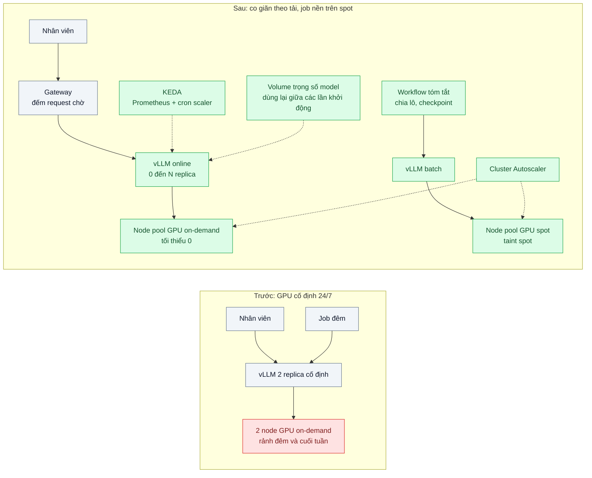
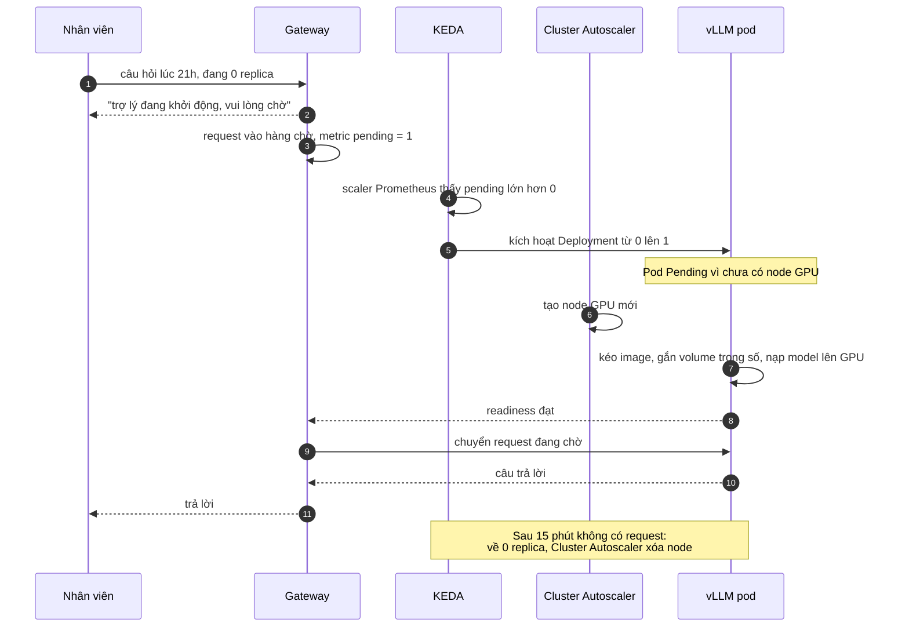

# Scale-to-zero & Spot GPUs — GPU chạy cả đêm tốn tiền dù không ai dùng

| Scope | Mức độ | Trạng thái | Pattern gốc | Cập nhật |
|---|---|---|---|---|
| 21 · backend / AI infrastructure | 🔴 Nâng cao | 📋 Kế hoạch | Event-driven autoscaling / scale to zero — KEDA docs, Knative Serving docs; Spot instances — AWS / GCP docs | 2026-10-06 |

> **Một câu tóm tắt:** Cho dịch vụ model tự host về 0 replica (và node GPU về 0) khi không có tải, bật lại theo tín hiệu hàng đợi hoặc request với chiến lược giảm cold start; còn tác vụ nền không gấp thì chạy trên spot GPU rẻ hơn, có checkpoint để sống qua việc bị thu hồi.

## 1. Bài toán thực tế (What)

**Bối cảnh** *(doanh nghiệp giả định, số liệu minh họa)*
Một SaaS nhân sự (HR) tự host mô hình mở trên vLLM (bài 03) vì dữ liệu hồ sơ nhân viên không được rời hạ tầng. Hai việc dùng GPU: trợ lý hỏi đáp chính sách cho nhân viên các công ty khách hàng (giờ hành chính 8h–18h, thứ Hai–thứ Sáu) và job tóm tắt hồ sơ ứng viên chạy ban đêm, không gấp. Hai node GPU on-demand chạy 24/7.

**Triệu chứng người kinh doanh nhìn thấy**
- Hóa đơn GPU là khoản chi hạ tầng lớn nhất, trong khi dashboard cho thấy từ 19h tới 7h sáng và cả cuối tuần gần như không có request.
- Tài chính tính ra khoảng 70% GPU-giờ là chờ không.
- Job ban đêm chạy trên cùng GPU đắt tiền, dù trễ vài giờ cũng không sao.

**Nguyên nhân kỹ thuật**
Deployment vLLM được cấu hình số replica cố định; HPA mặc định không scale về 0. Node GPU nằm trong node group có kích thước tối thiểu lớn hơn 0. Job nền và dịch vụ online dùng chung loại node on-demand, không tận dụng được giá spot. Cold start của dịch vụ model (kéo image lớn, tải trọng số vài chục GB, nạp lên GPU) chưa được đo nên không ai dám tắt.

**Ràng buộc**
- Giờ hành chính, câu trả lời đầu tiên trong ngày không được chờ quá lâu; ngoài giờ chấp nhận chờ khởi động có thông báo.
- Job ban đêm phải xong trước 7h sáng dù bị thu hồi spot nhiều lần.
- Không đổi nền tảng: vẫn Kubernetes trên đám mây hiện tại.

## 2. Vì sao dùng pattern này (Why)

**Nguyên nhân gốc mà pattern nhắm vào:** công suất GPU được cấp phát theo đỉnh và giữ cố định, trong khi tải có chu kỳ rõ và một phần tải không cần chạy ngay.

**Pattern giải quyết thế nào:**
1. **Scale-to-zero cho dịch vụ online**: KEDA kích hoạt Deployment vLLM từ 0 lên 1 khi có tín hiệu (số request đang chờ ở gateway hoặc hàng đợi, metric Prometheus) và về 0 sau một khoảng nguội; từ 1 trở lên KEDA dùng HPA bên dưới. Knative Serving là lựa chọn tương đương: activator giữ request trong lúc replica đang khởi động.
2. **Lịch tối thiểu theo giờ**: cron scaler giữ tối thiểu 1 replica trong giờ hành chính (khởi động trước 7h45) để người đầu tiên không chịu cold start; ngoài giờ cho về 0.
3. **Node về 0**: Cluster Autoscaler (hoặc Karpenter) xóa node GPU khi không còn pod GPU, tạo lại khi có pod Pending.
4. **Giảm cold start**: trọng số model trên volume dùng lại hoặc cache cục bộ, image kéo sẵn, readiness probe chỉ đạt khi model đã nạp; giao diện hiển thị "đang khởi động" thay vì lỗi.
5. **Spot GPU cho job nền**: node pool spot có taint riêng; job tóm tắt chạy trong workflow bền (bài 05, scope 20 bài 08) chia lô nhỏ, nên khi node bị thu hồi chỉ mất lô đang chạy; xử lý tín hiệu báo trước để dừng gọn.

**Lựa chọn khác đã cân nhắc**

| Lựa chọn | Giải quyết được gì | Vì sao không chọn (ở bài này) |
|---|---|---|
| Giữ nguyên + tối ưu nhỏ: cron script tắt/bật Deployment theo giờ | Cắt phần lớn giờ đêm | Có người dùng ngoài giờ thì không ai phục vụ; không co giãn theo tải thật |
| Gọi API trả theo token (bài 01) | Tự nhiên "về 0", không vận hành GPU | Luồng này bị ràng buộc dữ liệu phải ở trong hạ tầng |
| HPA thuần | Co giãn theo CPU/metric từ 1 trở lên | Không về 0 nếu không bật feature gate alpha; không có tín hiệu kích hoạt từ hàng đợi |
| Chạy dịch vụ online trên spot | Rẻ nhất | Bị thu hồi giữa giờ làm việc là gián đoạn người dùng; chỉ hợp với job chịu ngắt quãng |

## 3. Thiết kế hệ thống (How)

### 3.1 Kiến trúc trước và sau



### 3.2 Luồng chính



### 3.3 Thành phần và trách nhiệm

| Thành phần | Trách nhiệm | Quyết định thiết kế đáng chú ý |
|---|---|---|
| KEDA ScaledObject | Kích hoạt 0 → 1 và về 0; đặt tối thiểu theo lịch | Tín hiệu là số request chờ ở gateway, không phải CPU; khoảng nguội đủ dài để tránh bật/tắt liên tục |
| Gateway hàng chờ | Giữ request trong lúc khởi động, báo trạng thái cho UI | Timeout theo ngưỡng chịu đựng của người dùng; quá hạn thì báo thử lại |
| Cluster Autoscaler | Thêm/xóa node GPU theo pod Pending | Node pool GPU tối thiểu 0; chỉ pod GPU có toleration (bài 04) |
| Volume trọng số | Giữ model giữa các lần khởi động | Tránh tải lại vài chục GB từ internet mỗi lần |
| Node pool spot | Chạy job nền giá rẻ | Taint riêng; job có toleration và chịu được bị ngắt |
| Workflow job nền | Chia lô nhỏ, checkpoint, retry khi node bị thu hồi | Lô ngắn hơn khoảng thời gian báo trước của nhà cung cấp càng tốt |

### 3.4 Điểm dễ sai khi triển khai
- **Không đo cold start trước khi tắt.** Từ 0 lên phục vụ được có thể mất nhiều phút (tạo node + kéo image + nạp model); đo từng giai đoạn rồi mới đặt kỳ vọng với người dùng.
- **Readiness đạt trước khi model nạp xong.** Request đầu tiên lỗi hoặc treo; readiness phải gọi thử endpoint model.
- **Khoảng nguội quá ngắn.** Replica bật/tắt liên tục, mỗi lần trả giá cold start; đặt theo khoảng cách request thực tế.
- **Job spot lô quá dài.** Bị thu hồi là mất cả giờ xử lý; chia lô nhỏ và lưu tiến độ.
- **Quên hạn mức GPU của tài khoản đám mây.** Autoscaler muốn tạo node nhưng vùng hết GPU spot hoặc hết hạn mức; cần phương án dự phòng on-demand cho job sắp trễ hạn.

## 4. Tech stack và tác động (Impact techstack)

| Lớp | Công nghệ chọn | Vì sao chọn | Thay thế tương đương |
|---|---|---|---|
| Autoscaling workload | KEDA (Prometheus scaler, cron scaler) | Về 0 và kích hoạt theo metric bất kỳ; dùng HPA cho 1 → N | Knative Serving (activator giữ request); KEDA HTTP add-on (cần xác minh mức trưởng thành) |
| Autoscaling node | Cluster Autoscaler | Node pool GPU tối thiểu 0 trên nhà cung cấp đám mây phổ biến | Karpenter |
| Serving | vLLM | Đã dùng ở bài 03 | TGI |
| Job nền | Temporal workflow chia lô | Sống qua thu hồi spot | BullMQ với lô nhỏ và trạng thái trong PostgreSQL |
| Giám sát | Prometheus + Grafana, metric vLLM, chi phí từ báo cáo billing đám mây | Thấy GPU-giờ và cold start | OpenCost (cần xác minh) |
| Đo cold start | Script TypeScript gửi request khi 0 replica, ghi mốc thời gian từng giai đoạn | Lặp lại được | k6 |

**Thay đổi so với hệ thống hiện tại:** thêm KEDA và cấu hình node pool GPU tối thiểu 0, node pool spot; gateway có hàng chờ và thông báo khởi động; job đêm chuyển sang workflow chia lô. Đội hạ tầng học đọc chi phí GPU-giờ theo node pool và tinh chỉnh khoảng nguội.

## 5. Kết quả đầu ra và cách đo (Output impact)

| Chỉ số | Trước (minh họa) | Mục tiêu khi thực hành | Cách đo |
|---|---|---|---|
| GPU-giờ mỗi tuần cho dịch vụ online | 336 (2 node × 168 giờ) | ≤ 120 | Báo cáo billing đám mây hoặc tổng thời gian node GPU tồn tại theo nhãn node pool |
| Thời gian cold start 0 → câu trả lời đầu | chưa đo | ghi nhận từng giai đoạn; mục tiêu dưới 5 phút | Script đo: mốc request, node sẵn sàng, pod chạy, readiness, token đầu tiên |
| Request lỗi trong lúc khởi động | — | 0 (chỉ chờ, không lỗi) | Đếm phản hồi lỗi ở gateway trong 20 lần khởi động từ 0 |
| Job đêm xong trước 7h dù bị thu hồi spot | — | 100% trong 10 đêm thử | Mô phỏng thu hồi bằng cách xóa node spot ngẫu nhiên; kiểm tra thời điểm hoàn thành workflow |
| Chi phí GPU mỗi 1.000 hồ sơ tóm tắt | 100 (chỉ số gốc, on-demand) | ghi nhận so với spot | GPU-giờ spot × đơn giá / số hồ sơ |

> Số "trước" là minh họa để hình dung bài toán. Số "mục tiêu" chỉ được coi là đạt khi có số đo thật
> ở mục 8 kèm môi trường đo.

**Tác động nghiệp vụ mong đợi:** chi phí GPU bám theo mức sử dụng thật thay vì theo đỉnh; job nền rẻ hơn nhờ spot mà vẫn đúng hạn; người dùng ngoài giờ vẫn được phục vụ, chỉ chờ lâu hơn có báo trước.

## 6. Đánh đổi và khi KHÔNG nên dùng

**Đánh đổi**
- Cold start tính bằng phút với model lớn: trải nghiệm người dùng ngoài giờ kém hơn.
- Thêm nhiều thành phần (KEDA, autoscaler, hàng chờ) và nhiều chế độ lỗi (hết GPU trong vùng, hết hạn mức).
- Spot rẻ nhưng không bảo đảm có hàng; job sát hạn cần đường lùi on-demand.

**Không nên dùng khi**
- Tải đều 24/7 (dịch vụ cho nhiều múi giờ): luôn có request, scale-to-zero không có tác dụng.
- Yêu cầu phản hồi ngay mọi lúc với model lớn: giữ tối thiểu 1 replica, hoặc dùng API (bài 01) cho luồng được phép.

**Liên quan**
- [Event-driven Autoscaling KEDA (scope 16)](../../16-backend-k8s/09-keda-scale-worker-theo-do-dai-hang-doi/) — nền tảng KEDA cho worker.
- [GPU Scheduling on Kubernetes](../04-gpu-on-k8s-device-plugin-mig-time-slicing-gpu-ranh-70-phan-tram/) và [Model Serving vLLM](../03-vllm-serving-continuous-batching-tu-host-50-req-s/).
- [Embedding Ingestion Pipeline](../05-embedding-pipeline-nhap-10-trieu-tai-lieu-idempotent/) — job lô chịu ngắt quãng.
- [Autoscaling Policies (scope 18)](../../18-backend-scale/08-autoscaling-policy-scale-cham-hon-traffic/) — cooldown và scale theo dự đoán.

## 7. Cơ sở tham khảo

- KEDA docs — https://keda.sh/docs/ — ScaledObject, kích hoạt từ 0, Prometheus scaler, cron scaler, quan hệ với HPA.
- Knative Serving docs — https://knative.dev/docs/serving/ — autoscaling, scale to zero, activator giữ request khi chưa có replica.
- Kubernetes docs, "Horizontal Pod Autoscaling" — https://kubernetes.io/docs/tasks/run-application/horizontal-pod-autoscale/ — giới hạn tối thiểu replica của HPA.
- AWS docs, EC2 Spot Instances (interruption notices) — https://docs.aws.amazon.com/AWSEC2/latest/UserGuide/using-spot-instances.html — cơ chế thu hồi và thông báo trước.
- Google Cloud docs, Spot VMs — https://cloud.google.com/compute/docs/instances/spot — cơ chế preemption trên GCP.
- vLLM docs — https://docs.vllm.ai/ — metric để làm tín hiệu scale, thời gian nạp model.

## 8. Kế hoạch thực hành

- [ ] Bước 1: dựng cluster đám mây có node pool GPU on-demand (tối thiểu 0) và node pool spot; triển khai vLLM với model nhỏ để thử; gateway có metric request chờ.
- [ ] Bước 2: đo "trước": GPU-giờ một tuần với replica cố định; đo cold start từng giai đoạn (chưa tối ưu).
- [ ] Bước 3: áp dụng pattern: KEDA ScaledObject (Prometheus + cron), Cluster Autoscaler, volume trọng số, readiness gọi thử model, job đêm trên spot với workflow chia lô.
- [ ] Bước 4: đo "sau": GPU-giờ, cold start sau tối ưu, lỗi trong lúc khởi động, job đêm khi xóa node spot ngẫu nhiên; ghi vào mục 5 kèm loại GPU, vùng, model.
- [ ] Bước 5: test Vitest + script: (a) gateway không trả lỗi khi 0 replica mà chờ tới timeout cấu hình, (b) readiness chỉ đạt sau khi model trả lời thử, (c) workflow tiếp tục đúng lô sau khi node spot bị xóa.

**Cấu trúc code dự kiến**
```text
k8s/
  keda/vllm-scaledobject.yaml   # Prometheus scaler + cron scaler, cooldown
  nodepools/gpu-ondemand.yaml   # tối thiểu 0
  nodepools/gpu-spot.yaml       # taint spot
  vllm/deployment.yaml          # readiness gọi thử model, volume trọng số
src/
  gateway/pending-queue.ts      # giữ request, metric pending
  batch/summarize.workflow.ts   # chia lô, chạy trên spot
bench/cold-start-probe.ts       # đo từng giai đoạn khởi động
test/pending-queue.test.ts
```

**Cách chạy** *(điền khi bắt đầu code)*
```bash
kubectl apply -k k8s/
pnpm install && pnpm test
```
