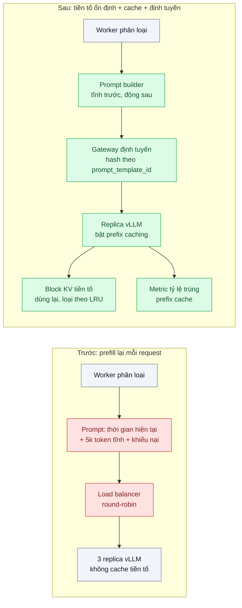
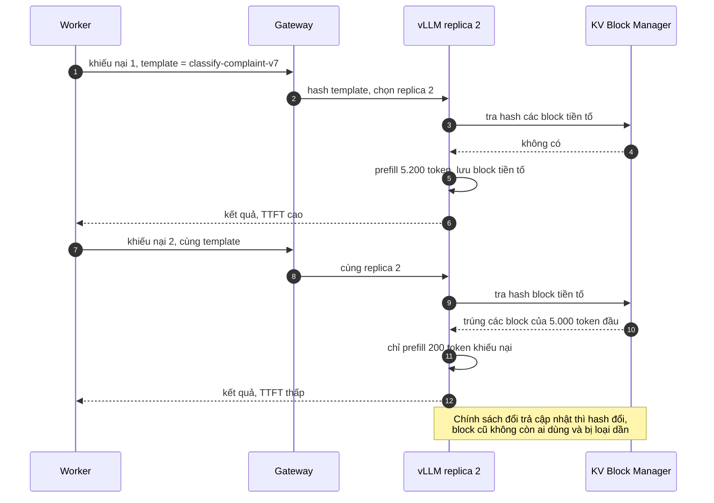

# Prefix / KV Caching at Serving Layer — System prompt 5k token được tính lại cho mỗi request

| Scope | Mức độ | Trạng thái | Pattern gốc | Cập nhật |
|---|---|---|---|---|
| 21 · backend / AI infrastructure | 🟡 Trung bình | 📋 Kế hoạch | Automatic Prefix Caching — vLLM docs; KV block sharing — Kwon et al., PagedAttention (SOSP 2023) | 2026-10-06 |

> **Một câu tóm tắt:** Bật prefix caching ở inference server để các request có chung phần đầu prompt (system prompt, few-shot, danh mục chính sách) dùng lại KV cache đã tính thay vì prefill lại 5.000 token mỗi lần, rồi sắp xếp prompt và định tuyến request sao cho tỷ lệ trúng cache cao.

## 1. Bài toán thực tế (What)

**Bối cảnh** *(doanh nghiệp giả định, số liệu minh họa)*
Một sàn thương mại điện tử tự host mô hình mở trên vLLM (bài 03) để phân loại khiếu nại người mua vào 40 nhóm và trích thông tin đơn. Mỗi request gồm system prompt mô tả quy tắc phân loại, 20 ví dụ few-shot và bảng chính sách đổi trả — khoảng 5.000 token giống hệt nhau — cộng nội dung khiếu nại chỉ khoảng 200 token. Ba replica vLLM sau một load balancer round-robin, khoảng 30 request/giây giờ cao điểm.

**Triệu chứng người kinh doanh nhìn thấy**
- Mùa sale, khiếu nại dồn và thời gian phân loại tăng vọt; đội vận hành đòi thêm GPU.
- Độ trễ tới kết quả đầu tiên (TTFT) cao dù khiếu nại rất ngắn.
- Đội sản phẩm muốn thêm ví dụ few-shot để tăng độ chính xác nhưng bị từ chối vì "prompt dài làm chậm".

**Nguyên nhân kỹ thuật**
Mỗi request phải *prefill*: tính KV cache cho toàn bộ token đầu vào trước khi sinh token đầu tiên. 96% số token đầu vào (phần tĩnh 5.000 token) được tính lại y hệt ở mọi request, chiếm phần lớn thời gian GPU dành cho prefill. Prompt được ghép với một dòng "thời gian hiện tại" ở đầu, nên kể cả khi bật cache thì phần đầu cũng khác nhau mỗi request. Load balancer round-robin rải các request cùng loại sang ba replica, mỗi replica giữ cache riêng.

**Ràng buộc**
- Không đổi model, không giảm số ví dụ few-shot (ảnh hưởng chất lượng đã đo).
- Bộ nhớ GPU có hạn: cache tiền tố dùng chung bộ nhớ với KV cache của request đang chạy.
- Phần chính sách đổi trả cập nhật vài lần mỗi tháng; cache phải tự hết hiệu lực khi nội dung đổi.

## 2. Vì sao dùng pattern này (Why)

**Nguyên nhân gốc mà pattern nhắm vào:** công việc giống hệt (prefill phần tiền tố chung) bị lặp lại ở mọi request vì inference server không nhớ kết quả giữa các request.

**Pattern giải quyết thế nào:** vLLM quản lý KV cache theo block (PagedAttention). Với Automatic Prefix Caching, mỗi block đầy được định danh bằng hash của chính các token trong block cộng với toàn bộ tiền tố đứng trước. Request mới có cùng tiền tố tìm thấy các block đã tính và dùng lại, chỉ prefill phần khác biệt (200 token khiếu nại). Block không còn được dùng bị loại theo chính sách LRU khi cần chỗ. Để tỷ lệ trúng cao cần ba điều:
1. **Phần tĩnh đặt đầu, phần động đặt cuối**, giống hệt từng token: bỏ dấu thời gian, ID request ra khỏi phần đầu; thứ tự ví dụ few-shot cố định.
2. **Định tuyến nhận biết tiền tố**: request cùng loại prompt đi về cùng replica (hash theo `prompt_template_id` ở gateway) thay vì round-robin.
3. **Nội dung đổi thì tiền tố đổi**: cập nhật chính sách sinh tiền tố mới, block cũ tự bị loại; không cần xóa cache thủ công.
Đây là cùng nguyên tắc với prompt caching phía API của Anthropic (`cache_control`, kiểm tra bằng `usage.cache_read_input_tokens`) — khác ở chỗ ở đây ta tự vận hành bộ nhớ và định tuyến.

**Lựa chọn khác đã cân nhắc**

| Lựa chọn | Giải quyết được gì | Vì sao không chọn (ở bài này) |
|---|---|---|
| Giữ nguyên + tối ưu nhỏ: rút gọn system prompt, bớt few-shot | Ít token prefill hơn | Ràng buộc không cho giảm few-shot; chất lượng đã đo sẽ tụt |
| Semantic cache câu trả lời (scope 22 bài 05) | Bỏ qua gọi model khi câu hỏi gần trùng | Khiếu nại hiếm khi trùng nhau; cache kết quả khác với cache tính toán tiền tố |
| Fine-tune để bỏ few-shot (scope 22 bài 08) | Prompt ngắn hẳn | Tốn công huấn luyện, phải làm lại mỗi khi quy tắc đổi |
| Thêm GPU | Tăng thông lượng | Trả tiền để lặp lại cùng một phép tính |

## 3. Thiết kế hệ thống (How)

### 3.1 Kiến trúc trước và sau



### 3.2 Luồng chính



### 3.3 Thành phần và trách nhiệm

| Thành phần | Trách nhiệm | Quyết định thiết kế đáng chú ý |
|---|---|---|
| Prompt builder | Ghép prompt theo thứ tự tĩnh → bán tĩnh → động | Không có giá trị thay đổi theo request trong phần đầu; few-shot thứ tự cố định; có test so sánh từng token |
| vLLM prefix caching | Dùng lại block KV theo hash tiền tố | Kiểm tra cờ bật/tắt mặc định theo phiên bản vLLM đang dùng |
| Gateway định tuyến | Đưa request cùng template tới cùng replica | Hash nhất quán để thêm/bớt replica không xáo trộn toàn bộ; vẫn cân bằng khi một template quá nóng |
| Cấu hình bộ nhớ | Cân bằng chỗ cho cache tiền tố và request đang chạy | Theo dõi mức dùng KV cache và số request bị tạm dừng |
| Giám sát | Tỷ lệ trúng cache tiền tố, TTFT, thông lượng | Tên metric lấy từ docs vLLM theo phiên bản |

### 3.4 Điểm dễ sai khi triển khai
- **Một ký tự động ở đầu prompt.** Dấu thời gian, tên khách, ID request đặt trước phần tĩnh làm tỷ lệ trúng về 0. Đặt mọi giá trị động ở cuối.
- **Template engine sinh khoảng trắng khác nhau.** Cùng nội dung nhưng khác token là trượt cache; snapshot test chuỗi prompt.
- **Round-robin giữa nhiều replica.** Mỗi replica giữ cache riêng; tỷ lệ trúng chia nhỏ theo số replica. Định tuyến theo template.
- **Kỳ vọng cache cải thiện cả thời gian sinh.** Prefix cache rút ngắn prefill (TTFT); thời gian sinh token đầu ra gần như không đổi.
- **Tiền tố ngắn hơn một block.** Chỉ block đầy mới được dùng lại; tiền tố quá ngắn ít lợi ích.

## 4. Tech stack và tác động (Impact techstack)

| Lớp | Công nghệ chọn | Vì sao chọn | Thay thế tương đương |
|---|---|---|---|
| Inference server | vLLM với Automatic Prefix Caching | Cache theo block có sẵn, nằm trong cơ chế PagedAttention | SGLang (RadixAttention, cần xác minh); TGI |
| Gateway định tuyến | LiteLLM Proxy hoặc NGINX `hash` theo header template | Định tuyến dính theo template | Envoy với consistent hashing |
| Prompt builder | TypeScript strict, Node 20+ | Trùng stack worker; snapshot test bằng Vitest | — |
| Đo TTFT | Script streaming TypeScript + k6 | Đo đúng thời gian tới token đầu tiên dưới tải | Công cụ benchmark serving của vLLM |
| Giám sát | Prometheus + Grafana, metric vLLM, `nvidia-smi` | Tỷ lệ trúng cache, mức dùng KV cache, GPU | — |
| So sánh phía API | `@anthropic-ai/sdk` với `cache_control`, `claude-haiku-4-5` | Thí nghiệm đối chứng cùng prompt: đọc `usage.cache_read_input_tokens` | — |

**Thay đổi so với hệ thống hiện tại:** sửa prompt builder, bật prefix caching, đổi load balancer sang định tuyến theo template, thêm dashboard tỷ lệ trúng. Đội sản phẩm có thể thêm ví dụ few-shot với chi phí độ trễ thấp hơn nhiều so với trước.

## 5. Kết quả đầu ra và cách đo (Output impact)

| Chỉ số | Trước (minh họa) | Mục tiêu khi thực hành | Cách đo |
|---|---|---|---|
| Tỷ lệ token đầu vào trúng prefix cache | 0% | ≥ 90% | Metric prefix cache của vLLM; đối chiếu số token prefill trên tổng token đầu vào |
| TTFT p95 ở 30 req/s | ~1,5 giây | dưới 300 ms | Script streaming đo thời gian tới token đầu tiên, chạy cùng k6 |
| Thông lượng tối đa giữ p95 TTFT dưới 1 giây | ghi nhận | tăng rõ so với trước | k6 tăng dần tốc độ đến |
| Số GPU cần cho đỉnh mùa sale | 3 | ghi nhận sau tối ưu | Tính từ thông lượng mỗi replica đo được |
| Đối chứng phía API | — | ghi nhận | `usage.cache_read_input_tokens` / tổng input trên cùng bộ prompt gửi `claude-haiku-4-5` với `cache_control` |

> Số "trước" là minh họa để hình dung bài toán. Số "mục tiêu" chỉ được coi là đạt khi có số đo thật
> ở mục 8 kèm môi trường đo.

**Tác động nghiệp vụ mong đợi:** mùa sale phân loại khiếu nại kịp với số GPU hiện có; đội sản phẩm được phép làm prompt dài hơn để tăng độ chính xác.

## 6. Đánh đổi và khi KHÔNG nên dùng

**Đánh đổi**
- Cache tiền tố chiếm bộ nhớ KV; tải đa dạng có thể làm cache bị loại liên tục và giảm số request đồng thời.
- Định tuyến dính theo template có thể làm lệch tải giữa các replica khi một template quá nóng.
- Kỷ luật prompt (phần động ở cuối) trở thành quy ước bắt buộc cho mọi người viết prompt.

**Không nên dùng khi**
- Mỗi request có prompt khác hẳn nhau, không có phần chung đáng kể.
- Đang gọi API thay vì tự host: dùng prompt caching của nhà cung cấp (scope 22 bài 01), không cần bài này.

**Liên quan**
- [Prompt Caching (scope 22)](../../22-backend-ai-optimizer/01-prompt-caching-system-prompt-20k-token-tra-tien-moi-request/) — cùng nguyên tắc ở phía API.
- [Model Serving vLLM](../03-vllm-serving-continuous-batching-tu-host-50-req-s/) — nền tảng PagedAttention.
- [LLM Latency Breakdown (scope 24)](../../24-backend-ai-monitoring/07-latency-ttft-tokens-per-second-chat-cham-nhung-p50-binh-thuong/) — đo TTFT đúng cách.
- [Load Balancing Algorithms (scope 18)](../../18-backend-scale/03-load-balancing-mot-server-qua-tai-cac-server-khac-ranh/) — định tuyến dính và cân bằng tải.

## 7. Cơ sở tham khảo

- vLLM docs, "Automatic Prefix Caching" — https://docs.vllm.ai/ — hash block theo tiền tố, dùng lại block, chính sách loại bỏ, cách bật.
- Kwon et al., "Efficient Memory Management for Large Language Model Serving with PagedAttention", SOSP 2023 — KV cache theo block và chia sẻ block giữa các chuỗi.
- vLLM docs, metrics — https://docs.vllm.ai/ — metric tỷ lệ trúng cache, mức dùng KV cache, TTFT.
- Anthropic docs, "Prompt caching" — https://platform.claude.com/docs/en/build-with-claude/prompt-caching — cùng nguyên tắc so khớp tiền tố phía API, `cache_control`, `cache_read_input_tokens`.
- Chip Huyen, *AI Engineering*, O'Reilly, 2025 — chương tối ưu inference: prefill vs decode, cache tiền tố.

## 8. Kế hoạch thực hành

- [ ] Bước 1: dựng 3 replica vLLM (model nhỏ) sau NGINX round-robin; prompt builder "trước" có dấu thời gian ở đầu; bộ 5.000 khiếu nại giả lập.
- [ ] Bước 2: đo "trước": TTFT p95 và thông lượng ở 10/20/30 req/s, tỷ lệ trúng cache.
- [ ] Bước 3: áp dụng pattern theo từng bước để thấy đóng góp riêng: (a) sửa prompt builder, (b) bật prefix caching, (c) định tuyến theo template.
- [ ] Bước 4: đo "sau" sau mỗi bước; chạy đối chứng phía API với `cache_control`; ghi vào mục 5 kèm GPU, model, phiên bản vLLM.
- [ ] Bước 5: test Vitest: (a) hai request khác nhau có phần đầu prompt giống hệt từng ký tự, (b) cập nhật chính sách làm đổi tiền tố, (c) gateway gửi cùng template tới cùng replica.

**Cấu trúc code dự kiến**
```text
src/
  prompt/prompt-builder.ts       # tĩnh trước, động sau
  prompt/templates/classify-complaint-v7.ts
  routing/template-hash.ts       # chọn replica theo prompt_template_id
bench/
  ttft-probe.ts
  load.k6.js
  api-cache-control.ts           # đối chứng với prompt caching của Anthropic
test/
  prompt-builder.test.ts         # snapshot từng ký tự phần tĩnh
docker-compose.yml               # vllm x3 (GPU), nginx, prometheus, grafana
```

**Cách chạy** *(điền khi bắt đầu code)*
```bash
docker compose up -d
pnpm install && pnpm test
```
