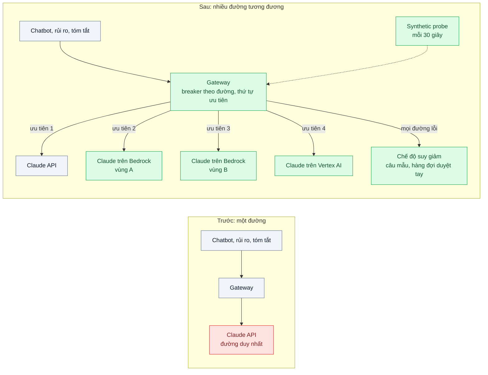
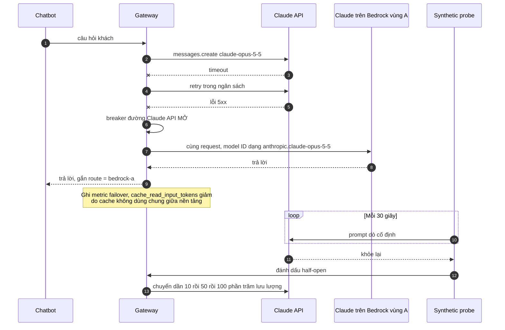

# Multi-provider / Multi-region Failover — Provider gặp sự cố 2 giờ, toàn bộ tính năng AI chết

| Scope | Mức độ | Trạng thái | Pattern gốc | Cập nhật |
|---|---|---|---|---|
| 21 · backend / AI infrastructure | 🔴 Nâng cao | 📋 Kế hoạch | Failover — AWS Well-Architected (Reliability); Circuit Breaker — Nygard, *Release It!* (2018); Anthropic docs "Claude on Amazon Bedrock", Vertex AI (đa nền tảng) | 2026-10-06 |

> **Một câu tóm tắt:** Cho gateway một danh sách đường đi tương đương tới cùng model — Claude API trực tiếp, Claude trên Amazon Bedrock ở hai vùng, Claude trên Vertex AI — với health check, circuit breaker theo từng đường và thứ tự ưu tiên, để sự cố của một nền tảng hay một vùng chỉ làm tính năng chậm đi vài giây chứ không chết hai giờ.

## 1. Bài toán thực tế (What)

**Bối cảnh** *(doanh nghiệp giả định, số liệu minh họa)*
Một ví điện tử có ba tính năng AI: chatbot CSKH (khoảng 200.000 lượt/ngày), phân loại giao dịch nghi vấn cho đội rủi ro, tóm tắt ticket cho nhân viên. Tất cả gọi Claude API trực tiếp với `claude-opus-5-5` qua một gateway nội bộ (bài 02). Đã có retry, circuit breaker và fallback model trong cùng nhà cung cấp (scope 20 bài 05).

**Triệu chứng người kinh doanh nhìn thấy**
- Một lần đường kết nối tới nhà cung cấp gặp sự cố kéo dài khoảng 2 giờ (giả định): chatbot trả "hệ thống bận" cho mọi khách, tổng đài quá tải, đội rủi ro phải duyệt tay.
- Ban điều hành hỏi "nếu lặp lại thì sao?" và không có câu trả lời ngoài "chờ nhà cung cấp khắc phục".
- Hợp đồng với đối tác ngân hàng yêu cầu mục tiêu sẵn sàng cho luồng phân loại rủi ro mà kiến trúc một đường không chứng minh được.

**Nguyên nhân kỹ thuật**
Mọi lời gọi đi qua một đường duy nhất (một endpoint, một tài khoản, một vùng). Fallback ở scope 20 bài 05 đổi *model* nhưng vẫn cùng *đường*, nên không giúp khi chính đường đó gặp sự cố. Không có health check chủ động, không có danh sách đường dự phòng đã cấu hình sẵn hạn mức, không có quy trình diễn tập.

**Ràng buộc**
- Dữ liệu giao dịch phải xử lý trong vùng và theo hợp đồng đã được pháp chế duyệt; không phải vùng nào cũng dùng được.
- Hạn mức (rate limit) ở mỗi nền tảng phải được đặt trước; đường dự phòng không có hạn mức thì vô dụng lúc cần.
- Hành vi giữa các nền tảng phải tương đương: cùng model, cùng prompt, tính năng API dùng phải có trên mọi đường.

## 2. Vì sao dùng pattern này (Why)

**Nguyên nhân gốc mà pattern nhắm vào:** một điểm hỏng duy nhất ở tầng nhà cung cấp/vùng, không có đường thay thế đã sẵn sàng.

**Pattern giải quyết thế nào:**
1. **Danh sách deployment tương đương** ở gateway: Claude API (chính), Claude trên Amazon Bedrock vùng A và vùng B, Claude trên Vertex AI; mỗi đường có thông tin xác thực, model ID theo định dạng của nền tảng (Bedrock dùng tiền tố `anthropic.`) và hạn mức đã đặt.
2. **Phát hiện lỗi hai lớp**: thụ động (tỷ lệ lỗi 5xx/529/timeout trong cửa sổ trượt) và chủ động (synthetic probe mỗi 30 giây gửi prompt nhỏ cố định).
3. **Circuit breaker theo từng đường**: mở thì gateway chuyển sang đường kế tiếp theo thứ tự ưu tiên; half-open dò lại; failback dần (một phần lưu lượng) khi đường chính khỏe lại.
4. **Bảo đảm tương đương tính năng**: chỉ dùng tính năng API có trên mọi đường cho luồng cần failover (tra bảng availability theo nền tảng trong docs); prompt cache không dùng chung giữa nền tảng nên chi phí tăng khi failover — chấp nhận và đo.
5. **Chế độ suy giảm khi mọi đường lỗi**: chatbot trả câu mẫu + tạo ticket; phân loại rủi ro chuyển hàng đợi duyệt tay.
6. **Diễn tập (game day)**: định kỳ chặn đường chính trong staging và một phần production để chứng minh failover chạy.

**Lựa chọn khác đã cân nhắc**

| Lựa chọn | Giải quyết được gì | Vì sao không chọn (ở bài này) |
|---|---|---|
| Giữ nguyên + tối ưu nhỏ: retry lâu hơn, fallback model cùng nhà cung cấp (scope 20 bài 05) | Lỗi thoáng qua, quá tải một model | Không sống qua sự cố của chính đường đi |
| Model của hãng khác làm dự phòng | Độc lập nhà cung cấp | Prompt, tool use, định dạng đầu ra khác; phải eval và bảo trì hai bộ prompt |
| Model tự host làm dự phòng (bài 03) | Không phụ thuộc bên ngoài | Chất lượng khác; GPU chờ không phần lớn thời gian |
| Active-active chia đều lưu lượng | Luôn biết mọi đường còn chạy | Cache phân tán, chi phí cao hơn, đối soát phức tạp; dùng một phần nhỏ lưu lượng thường trực thay thế |

## 3. Thiết kế hệ thống (How)

### 3.1 Kiến trúc trước và sau



### 3.2 Luồng chính



### 3.3 Thành phần và trách nhiệm

| Thành phần | Trách nhiệm | Quyết định thiết kế đáng chú ý |
|---|---|---|
| Bảng deployment | Mô tả từng đường: nền tảng, vùng, model ID, thông tin xác thực, hạn mức, ưu tiên | Khai báo trong cấu hình, review như code; chỉ đưa vào đường đã được pháp chế duyệt |
| Breaker theo đường | Mở/half-open/đóng dựa trên tỷ lệ lỗi và probe | Khóa theo `nền tảng + vùng + model`; trạng thái trong Redis dùng chung giữa các instance gateway |
| Synthetic probe | Gửi prompt nhỏ cố định tới mọi đường, kể cả đường đang không dùng | Phát hiện đường dự phòng hỏng *trước* khi cần tới nó |
| Kiểm tra tương đương tính năng | Chặn dùng tính năng không có trên đường dự phòng | Bảng availability theo nền tảng lấy từ docs; test hợp đồng chạy trên mọi đường |
| Chế độ suy giảm | Phản hồi khi mọi đường lỗi | Theo từng tính năng: chatbot câu mẫu, rủi ro chuyển duyệt tay |
| Quan sát | Route của mỗi request, thời gian failover, chi phí theo đường | Dashboard và alert khi đang chạy trên đường dự phòng quá lâu |

### 3.4 Điểm dễ sai khi triển khai
- **Đường dự phòng chưa từng nhận lưu lượng.** Thông tin xác thực hết hạn, hạn mức bằng 0, model chưa được bật ở vùng đó — chỉ lộ ra lúc sự cố. Probe và một phần nhỏ lưu lượng thường trực.
- **Dùng tính năng chỉ có ở một nền tảng.** Request failover lỗi 400; kiểm tra bảng availability và chạy test hợp đồng trên mọi đường.
- **Failback một lần 100%.** Đường chính vừa hồi phục bị dội lại và sập tiếp; chuyển dần.
- **Quên chi phí.** Mất prompt cache khi đổi nền tảng làm chi phí tăng trong lúc failover; đơn giá giữa nền tảng có thể khác (xem trang giá của từng nền tảng).

## 4. Tech stack và tác động (Impact techstack)

| Lớp | Công nghệ chọn | Vì sao chọn | Thay thế tương đương |
|---|---|---|---|
| Gateway | LiteLLM Proxy (router có fallback và cooldown) hoặc gateway NestJS tự viết | Cấu hình nhiều deployment cho cùng model | Envoy AI Gateway (cần xác minh) |
| SDK theo nền tảng | `@anthropic-ai/sdk`, `@anthropic-ai/bedrock-sdk`, `@anthropic-ai/vertex-sdk` | Cùng bề mặt `messages.create` trên mọi nền tảng | Gọi qua LiteLLM cho mọi đường |
| Model | `claude-opus-5-5` trên mọi đường | Hành vi tương đương; ID theo định dạng từng nền tảng | `claude-sonnet-5-5` làm đường lùi cuối |
| Trạng thái breaker | Redis 7 | Nhất quán giữa các instance gateway | — |
| Probe | Script định kỳ (Kubernetes CronJob) | Kiểm tra mọi đường, kể cả đường rảnh | Synthetic monitoring của scope 23 bài 09 |
| Giả lập sự cố | Proxy giả lập lỗi mạng trước từng đường (Toxiproxy, cần xác minh) | Diễn tập có kiểm soát | Chặn DNS/egress bằng NetworkPolicy |

Giá tại thời điểm viết cho Claude API (kiểm tra lại trang Pricing): `claude-opus-5-5` $4/$20 mỗi triệu token vào/ra; `claude-sonnet-5-5` $2/$10; `claude-haiku-4-5` $1/$5. Giá trên Bedrock và Vertex AI theo trang giá của từng nền tảng.

**Thay đổi so với hệ thống hiện tại:** thêm tài khoản/hạn mức trên Bedrock và Vertex AI, bảng deployment và breaker theo đường ở gateway, probe, chế độ suy giảm, lịch diễn tập. Pháp chế duyệt danh sách vùng; đội vận hành có runbook khi đang chạy trên đường dự phòng.

## 5. Kết quả đầu ra và cách đo (Output impact)

| Chỉ số | Trước (minh họa) | Mục tiêu khi thực hành | Cách đo |
|---|---|---|---|
| Tỷ lệ request thành công khi chặn đường chính | 0% | ≥ 99% | k6 chạy tải ổn định, chặn đường Claude API bằng proxy giả lập lỗi giữa chừng |
| Thời gian từ sự cố tới chuyển đường | không có | dưới 60 giây | Mốc chặn đường so với mốc request đầu tiên đi đường dự phòng (log gateway) |
| Đường dự phòng hỏng mà không biết | không đo | phát hiện trong 1 phút | Thu hồi thông tin xác thực đường dự phòng, đo thời gian probe báo đỏ |
| Chi phí tăng thêm khi chạy dự phòng | không đo | ghi nhận | `usage` × đơn giá theo route; so `cache_read_input_tokens` trước/sau failover |
| Chênh lệch chất lượng giữa các đường | không đo | không khác biệt đáng kể | Judge `claude-sonnet-5-5` chấm cùng 200 câu qua từng đường |

> Số "trước" là minh họa để hình dung bài toán. Số "mục tiêu" chỉ được coi là đạt khi có số đo thật
> ở mục 8 kèm môi trường đo.

**Tác động nghiệp vụ mong đợi:** sự cố của một nền tảng hay một vùng không còn làm chết chatbot và luồng rủi ro; có bằng chứng diễn tập để đưa vào hợp đồng với đối tác.

## 6. Đánh đổi và khi KHÔNG nên dùng

**Đánh đổi**
- Thêm hợp đồng, tài khoản, hạn mức và thông tin xác thực ở nhiều nền tảng phải quản lý.
- Chỉ dùng được giao của tính năng có trên mọi đường; tính năng mới phải chờ có ở mọi nơi hoặc chấp nhận luồng đó không failover.

**Không nên dùng khi**
- Tính năng AI không quan trọng với doanh thu/hợp đồng: chế độ suy giảm rõ ràng là đủ.
- Tác vụ nền không gấp: chờ nhà cung cấp hồi phục và chạy lại từ hàng đợi rẻ hơn.

**Liên quan**
- [Resilience for LLM Calls (scope 20)](../../20-backend-ai-framework-system-design/05-fallback-retry-circuit-breaker-cho-llm-api-429-529/) — lớp chịu lỗi bên trong một đường.
- [LLM Gateway](../02-llm-gateway-5-team-chung-mot-api-key-khong-biet-ai-ton-tien/) — nơi đặt bảng deployment.
- [SLI / SLO / Error Budget (scope 23)](../../23-backend-monitoring-benchmark/05-slo-error-budget-he-thong-on-chua-khong-co-so/) và [Synthetic Monitoring (scope 23)](../../23-backend-monitoring-benchmark/09-synthetic-monitoring-health-check-khach-bao-loi-truoc-khi-doi-ky-thuat-biet/).

## 7. Cơ sở tham khảo

- Anthropic docs, "Claude on Amazon Bedrock" và "Claude Platform on AWS" — https://platform.claude.com/docs/en/build-with-claude/claude-on-amazon-bedrock — dùng Claude qua nền tảng đám mây, định dạng model ID, khác biệt tính năng.
- Anthropic docs, Claude trên Vertex AI — https://platform.claude.com/docs/en/ (cần xác minh đường dẫn trang) — đường thứ ba qua Google Cloud.
- AWS Well-Architected Framework, Reliability Pillar — https://docs.aws.amazon.com/wellarchitected/ — failover, kiểm tra phục hồi định kỳ, loại bỏ điểm hỏng duy nhất.
- Nygard, *Release It!* 2nd ed. (2018) — Circuit Breaker, Fail Fast, Steady State.
- LiteLLM docs — https://docs.litellm.ai/ — router với nhiều deployment, fallback, cooldown.

## 8. Kế hoạch thực hành

- [ ] Bước 1: dựng gateway với máy chủ giả lập cho ba nền tảng (giả lập API Anthropic, Bedrock, Vertex) phía sau proxy giả lập lỗi; nếu có tài khoản thật, thêm một đường Bedrock thật với hạn mức nhỏ.
- [ ] Bước 2: đo "trước": k6 tải ổn định, chặn đường chính, ghi tỷ lệ thành công.
- [ ] Bước 3: áp dụng pattern: bảng deployment, breaker theo đường trong Redis, probe, failback dần, chế độ suy giảm, dashboard route.
- [ ] Bước 4: đo "sau": các kịch bản chặn đường chính, hỏng thông tin xác thực đường dự phòng, mọi đường lỗi; ghi vào mục 5.
- [ ] Bước 5: test Vitest: (a) breaker mở chuyển đúng thứ tự ưu tiên, (b) model ID đúng định dạng theo nền tảng, (c) request dùng tính năng không có trên đường dự phòng bị chặn trước khi gửi, (d) failback chuyển dần, (e) không retry nhiều tầng.

**Cấu trúc code dự kiến**
```text
src/
  gateway/deployments.ts       # bảng đường: nền tảng, vùng, model ID, ưu tiên
  gateway/route-breaker.ts     # breaker theo đường, trạng thái Redis
  gateway/failover-router.ts   # chọn đường, failback dần
  gateway/feature-parity.ts    # chặn tính năng không có trên đường dự phòng
  probe/synthetic-probe.ts
test/
  failover-router.test.ts
tools/fake-providers/          # giả lập Anthropic, Bedrock, Vertex
docker-compose.yml             # redis, toxiproxy, fake providers, prometheus, grafana
```

**Cách chạy** *(điền khi bắt đầu code)*
```bash
docker compose up -d
pnpm install && pnpm test
```
