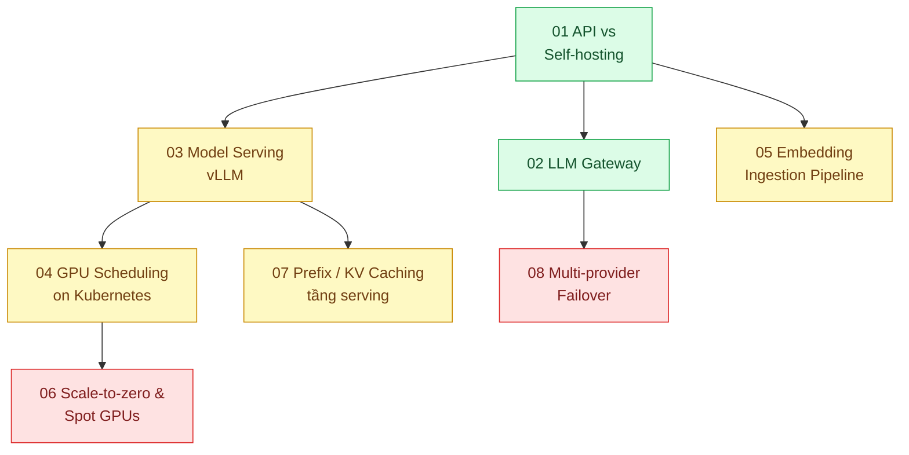

# 21 · Hạ tầng AI (`backend / AI infrastructure`)

> **Phạm vi:** Phần "chạy ở đâu, bằng gì" của tính năng AI: gọi API hay tự host, gateway quản lý
> khóa và chi phí, serving mô hình mở, GPU trên Kubernetes, pipeline embedding quy mô lớn, scale về
> không, cache tiền tố ở tầng serving, chuyển vùng/nhà cung cấp khi sự cố. Thiết kế lớp ứng dụng
> thuộc scope 20; tối ưu chi phí theo request thuộc scope 22.
>
> **Câu hỏi trung tâm:** Gọi API hay tự host, GPU dùng ra sao, gateway quản lý chi phí thế nào,
> mất provider thì sao?

## Bản đồ pattern trong scope

## Danh sách bài toán

| # | Bài toán (pattern — triệu chứng) | Mức | Pattern gốc / nguồn | Trạng thái |
|---|---|---|---|---|
| 01 | [API vs Self-hosting LLM — Dữ liệu nhạy cảm: gọi API hay tự host mô hình mở? Bài toán chi phí và tuân thủ](./01-api-vs-self-host-du-lieu-nhay-cam-co-nen-tu-host-model/) | 🟢 | Anthropic docs "Pricing", data retention; vLLM docs; Chip Huyen, *AI Engineering* (2025) — model selection | 📋 |
| 02 | [LLM Gateway (key management, quota, cost per team) — 5 team dùng chung một API key, hóa đơn tăng không biết ai tốn](./02-llm-gateway-5-team-chung-mot-api-key-khong-biet-ai-ton-tien/) | 🟢 | LiteLLM Proxy docs; Anthropic docs "Admin API" (usage & cost), "Rate limits"; Azure "Gateway Offloading" | 📋 |
| 03 | [Model Serving (vLLM, continuous batching, PagedAttention) — Tự host mô hình 8B phục vụ 50 req/s trên 1 GPU](./03-vllm-serving-continuous-batching-tu-host-50-req-s/) | 🟡 | Kwon et al., "PagedAttention" (SOSP 2023); Yu et al., "Orca" (OSDI 2022); vLLM docs | 📋 |
| 04 | [GPU Scheduling on Kubernetes (device plugin, MIG, time-slicing) — GPU A100 rảnh 70% thời gian nhưng không chia được cho 3 service](./04-gpu-on-k8s-device-plugin-mig-time-slicing-gpu-ranh-70-phan-tram/) | 🟡 | NVIDIA Kubernetes device plugin docs; NVIDIA MIG User Guide; Kubernetes docs "Schedule GPUs" | 📋 |
| 05 | [Embedding Ingestion Pipeline (batch, idempotent, resumable) — Nhập 10 triệu tài liệu, chạy lại từ đầu mỗi lần lỗi](./05-embedding-pipeline-nhap-10-trieu-tai-lieu-idempotent/) | 🟡 | Anthropic docs "Batch processing"; Hugging Face Text Embeddings Inference docs; Temporal docs; *EIP* "Idempotent Receiver" | 📋 |
| 06 | [Scale-to-zero & Spot GPUs — GPU chạy cả đêm tốn tiền dù không ai dùng](./06-scale-to-zero-gpu-spot-gpu-chay-ca-dem-khong-ai-dung/) | 🔴 | KEDA docs (scale to zero); Knative Serving docs; AWS / GCP Spot instance docs | 📋 |
| 07 | [Prefix / KV Caching at Serving Layer — System prompt 5k token được tính lại cho mỗi request](./07-inference-cache-kv-prefix-caching-system-prompt-5k-token-moi-request/) | 🟡 | vLLM docs "Automatic Prefix Caching"; Anthropic docs "Prompt caching" (phía API, so sánh) | 📋 |
| 08 | [Multi-provider / Multi-region Failover — Provider gặp sự cố 2 giờ, toàn bộ tính năng AI chết](./08-multi-region-failover-llm-provider-mot-region-down/) | 🔴 | Anthropic docs "Claude on Amazon Bedrock", "Claude Platform on AWS", Vertex AI (đa nền tảng); Nygard, *Release It!*; AWS Well-Architected (Reliability) | 📋 |

## Lộ trình đề xuất trong scope

1. **API vs self-host** — quyết định đầu tiên; đa số nên bắt đầu bằng API và chỉ tự host khi có lý do
   tuân thủ hoặc khối lượng rất lớn.
2. **LLM gateway** — cần ngay khi có hơn một team/tính năng dùng model.
3. **Embedding pipeline** — bài hạ tầng dữ liệu phục vụ scope 10/12.
4. **vLLM → GPU on k8s → Prefix caching → Scale-to-zero** — nhánh tự host, chỉ khi bài 01 kết luận cần.
5. **Failover** — vận hành; cần gateway (bài 02) làm điểm chuyển hướng.

## Kiến thức nền cần có trước

- Kubernetes (scope 16 bài 01–03) cho nhánh GPU.
- Queue/batch (scope 14) cho pipeline embedding.
- Khái niệm token, throughput (token/s), TTFT (scope 24 bài 07).

## Liên kết với scope khác

- `20-backend-ai-framework-system-design` bài 01 (Model Gateway) — gateway ở mức code; bài 02 ở đây là gateway ở mức hạ tầng.
- `22-backend-ai-optimizer` — quantization, speculative decoding cho nhánh tự host.
- `12-backend-database-vector` — nơi lưu embedding từ bài 05.
- `16-backend-k8s`, `14-backend-queueing`.

## Nguồn tổng quan cho scope

- Kwon et al., "Efficient Memory Management for LLM Serving with PagedAttention" (SOSP 2023).
- vLLM docs — https://docs.vllm.ai/
- Chip Huyen, *AI Engineering* (2025), chương về inference optimization.
